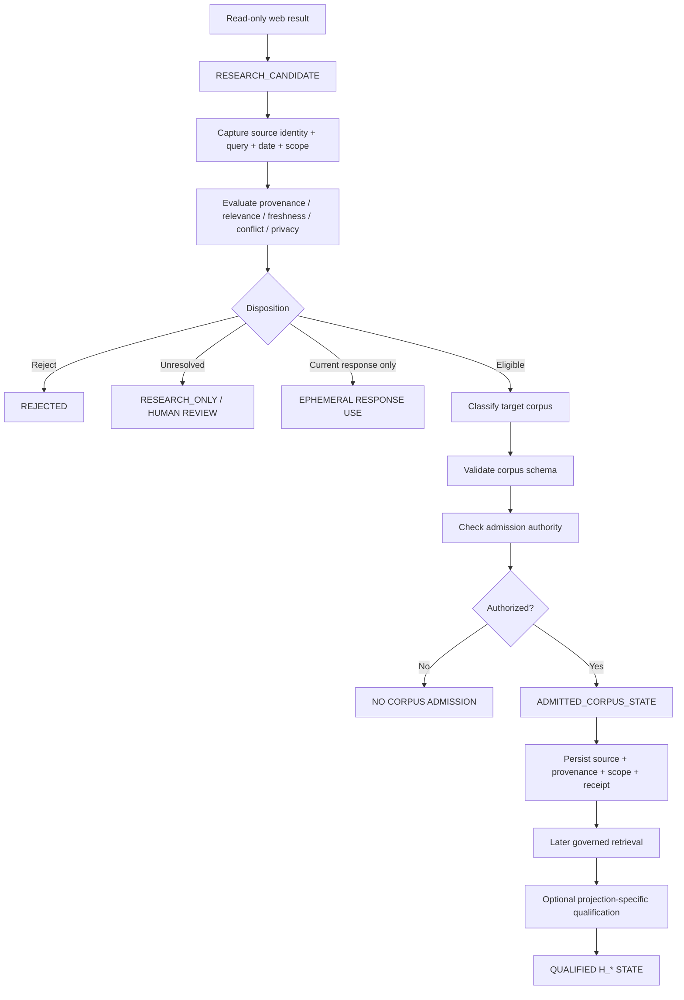

<div align="center">

# ALLIS — Research-to-Corpus Ingestion

### Governed separation between external web retrieval, candidate research state, evidence evaluation, corpus admission, persistence, later retrieval, and qualified Hilbert state

<br>


<br>

**Kidd's Technical Services · ALLIS**

</div>

---

> [!IMPORTANT]
> This document separates **web retrieval** from **corpus admission**.
>
> It defines the intended future path from externally retrieved information to candidate research state, evaluated evidence, admitted corpus state, later retrieval, and—only where separately qualified—derived or routed H_* state.
>
> The controlling distinction is:
>
> ```text
> web result
>     ≠
> trusted fact
>     ≠
> admitted corpus state
>     ≠
> qualified Hilbert state
> ```
>
> Current status remains:
>
> ```text
> RESEARCH_TO_CORPUS_INGESTION_QUALIFIED=NO
>
> AUTOMATED_LEARNING_WEB_RESEARCH_QUALIFIED=NO
> ```

---

# 1. Purpose

The purpose of this architecture is to prevent external retrieval from collapsing directly into persistent system knowledge.

A web result is only an observed external claim or source artifact.

It must pass through:

```text
candidate capture
    ↓
provenance
    ↓
evaluation
    ↓
domain classification
    ↓
admission authority
    ↓
storage
```

before it becomes admitted corpus state.

Even then, admitted corpus state is not automatically a qualified H_* object.

---

# 2. Core separation

The intended path is:

```text
external web retrieval
    ↓
RESEARCH_CANDIDATE
    ↓
source/provenance capture
    ↓
evaluation
    ↓
candidate disposition
    ↓
corpus-domain classification
    ↓
admission gate
    ↓
ADMITTED_CORPUS_STATE
    ↓
storage
    ↓
later governed retrieval
```

A separate downstream path may later be:

```text
admitted corpus state
    ↓
projection-specific qualification
    ↓
qualified H_* state
```

where appropriate.

That second transition is not implied by the first.

---

# 3. State distinctions

The architecture should preserve at least four distinct states:

```text
WEB_RESULT

RESEARCH_CANDIDATE

ADMITTED_CORPUS_STATE

QUALIFIED_HILBERT_STATE
```

These states have different evidence and authority requirements.

---

# 4. `WEB_RESULT`

A `WEB_RESULT` is external material obtained through read-only retrieval.

It may be:

- a webpage;
- official document;
- API response;
- public dataset;
- search result;
- article;
- technical documentation;
- public notice;
- research paper.

A web result is not trusted merely because retrieval succeeded.

---

# 5. `RESEARCH_CANDIDATE`

A retrieved item becomes:

```text
RESEARCH_CANDIDATE
```

once ALLIS captures it with enough provenance and task context to evaluate it.

A candidate is:

```text
available for evaluation
```

not:

```text
accepted as system knowledge
```

---

# 6. `ADMITTED_CORPUS_STATE`

An item becomes admitted corpus state only after:

```text
provenance validation

scope validation

source evaluation

domain classification

privacy review

authority check

schema validation

duplicate/conflict handling

admission decision
```

have passed for the target corpus.

---

# 7. `QUALIFIED_HILBERT_STATE`

Qualified Hilbert state is a stronger and separate classification.

It requires the corresponding H_* domain to have:

- a defined semantic contract;
- a carrier/dimensional contract where applicable;
- producer/consumer semantics;
- persistence/retrieval rules;
- authority;
- model-to-source correspondence;
- source/runtime correspondence where claimed;
- projection-specific qualification.

Therefore:

```text
admitted corpus state
    ≠
qualified H_* state
```

---

# 8. Retrieval and ingestion are separate components

The read-only research mechanism should end at:

```text
candidate result
```

The ingestion mechanism begins at:

```text
candidate evaluation
```

Conceptually:

```text
READ-ONLY RESEARCH
    |
    v
RESEARCH_CANDIDATE
    |
    | separate boundary
    v
RESEARCH-TO-CORPUS INGESTION
```

This is an intentional trust boundary.

---

# 9. Why the boundary matters

Without this separation:

```text
search result
    →
persistent knowledge
```

could occur without:

- provenance;
- source-quality analysis;
- temporal validity;
- geographic validity;
- privacy classification;
- authority;
- conflict handling;
- domain semantics.

That would defeat the larger ALLIS qualification model.

---

# 10. Candidate research record

Every research candidate should carry a structured record.

Recommended fields:

```yaml
research_candidate:
  candidate_id:
  research_need_id:

  content:
  extracted_claims: []

  source:
    source_id:
    url:
    domain:
    title:
    author:
    organization:
    source_class:
    publication_date:
    updated_date:

  retrieval:
    query:
    retrieved_at:
    retrieval_method:
    read_only: true

  scope:
    subject:
    temporal:
    geographic:

  transformations: []

  status: CANDIDATE
```

---

# 11. Source identity

Source identity must be preserved as a first-class field.

Recommended components:

```text
URL / canonical URI

publisher / organization

document identifier

author

title

publication date

updated date

retrieval date

source class
```

Where available, stable document IDs should be preferred over only mutable page titles.

---

# 12. Source identity is not source trust

Preserve:

```text
source identified
    ≠
source trusted
```

The system must still evaluate whether the source is suitable for the specific claim and domain.

---

# 13. Source classes

Recommended source classes:

```text
PRIMARY_OFFICIAL

PRIMARY_RESEARCH

AUTHORITATIVE_DATA

OFFICIAL_DOCUMENTATION

SECONDARY_HIGH_QUALITY

SECONDARY_GENERAL

COMMUNITY_REPORT

UNVERIFIED

UNKNOWN
```

The target corpus may require a minimum class.

---

# 14. Query provenance

Every candidate should retain the query that led to retrieval.

Preserve:

```text
original question

research need

derived query

source returned
```

This supports later audit of why the source entered the candidate set.

---

# 15. Temporal scope

Every candidate should record its temporal scope.

Recommended fields:

```text
event_time

valid_from

valid_until

publication_date

updated_date

retrieved_at

freshness_requirement
```

The system must distinguish:

```text
historically correct
```

from:

```text
currently valid
```

---

# 16. Temporal mismatch

A candidate may be rejected or limited if:

```text
source date
    ≠
required task date
```

Example:

```text
2022 source
    ≠
evidence of 2026 current state
```

unless the claim is explicitly historical.

---

# 17. Geographic scope

Candidates should record geographic scope where relevant.

Recommended fields:

```text
country

state / province

county / district

city / locality

site / coordinate scope

jurisdiction

generalized vs precise location
```

Do not apply a source about one geography to another without explicit justification.

---

# 18. Geographic mismatch

Preserve:

```text
same topic
    ≠
same geographic applicability
```

A policy or statistic from one jurisdiction should not be ingested as though it represented another.

---

# 19. Subject scope

Candidate records should identify who or what the source concerns.

Examples:

```text
individual

organization

software version

service

geographic feature

policy

dataset

population

event
```

This prevents broad claims from being attached to the wrong subject.

---

# 20. Information class

Every candidate should classify what kind of information it contains.

Recommended classes:

```text
FACT

CLAIM

OPINION

MEASUREMENT

ESTIMATE

FORECAST

POLICY

LEGAL_TEXT

RESEARCH_FINDING

TECHNICAL_SPECIFICATION

UNVERIFIED_REPORT
```

The ingestion process should preserve that class.

---

# 21. External claim is not trusted fact

A source may state something explicitly.

That establishes:

```text
source X claims Y
```

It does not automatically establish:

```text
Y is true
```

Therefore the candidate model should distinguish:

```text
source assertion
```

from:

```text
system-admitted factual assertion
```

---

# 22. Candidate evaluation

Candidate evaluation should consider:

```text
relevance

source class

source authority

independence

freshness

temporal fit

geographic fit

subject fit

internal consistency

corroboration

conflicting evidence

privacy

provenance completeness

domain suitability
```

This evaluation produces a disposition.

---

# 23. Evaluation is not admission

Preserve:

```text
candidate evaluation complete
    ≠
candidate admitted
```

Evaluation may conclude:

```text
credible
```

without permission to persist.

---

# 24. Candidate dispositions

Recommended dispositions:

```text
REJECTED

UNRESOLVED

CONFLICTED

NEEDS_HUMAN_REVIEW

ACCEPTED_FOR_CURRENT_RESPONSE

ELIGIBLE_FOR_CORPUS_ADMISSION
```

Use:

```text
ELIGIBLE
```

rather than:

```text
ADMITTED
```

until the authority gate closes.

---

# 25. Admission target classification

Before admission, classify the intended target corpus.

Examples:

```text
PUBLIC_REFERENCE_CORPUS

TECHNICAL_EVIDENCE_CORPUS

GEOGRAPHIC_CORPUS

CIVIC_CORPUS

RESEARCH_ARCHIVE

H_PEOPLE_PUBLIC_SOURCE_CORPUS

H_PEOPLE_PRIVATE_CANDIDATE

APPLICATION_SPECIFIC_CORPUS

NO_PERSISTENT_TARGET
```

Do not send all accepted information into one generic vector store.

---

# 26. Corpus schema

Every corpus should define:

```text
allowed information classes

required provenance

privacy class

temporal fields

geographic fields

producer version

embedding policy

update policy

conflict policy

retention
```

A candidate must satisfy the target schema before admission.

---

# 27. Admission gate

The admission gate should require:

```text
candidate disposition = ELIGIBLE_FOR_CORPUS_ADMISSION

provenance = PASS

source identity = PRESENT

temporal scope = VALID

geographic scope = VALID_OR_NOT_APPLICABLE

privacy = PASS

target corpus schema = PASS

authority = PRESENT

duplicate/conflict policy = RESOLVED
```

Only then:

```text
CORPUS_ADMISSION=AUTHORIZED
```

---

# 28. Authority is separate

The candidate may be excellent evidence and still lack persistence authority.

Preserve:

```text
credible
    ≠
authorized to persist
```

and:

```text
qualified for response
    ≠
qualified for corpus admission
```

---

# 29. Admission receipt

Every persistent admission should produce a receipt containing:

```text
candidate ID

source identity

target corpus

authority identity

schema version

producer / embedding version

admitted-at timestamp

content hash / object identity

supersession relation if any
```

This makes corpus state reconstructable.

---

# 30. Storage

After authorized admission, storage should preserve:

```text
content

source identity

provenance

temporal scope

geographic scope

subject scope

information class

admission receipt

producer version

embedding version where applicable
```

Do not persist only the vector and discard the evidence that explains it.

---

# 31. Vector storage is not enough

Preserve:

```text
embedding
    ≠
source record
```

A vector without source/provenance cannot support robust later correspondence.

Where vectors are used, the source object and transformation lineage should remain reachable.

---

# 32. Later retrieval

Later retrieval should operate only over admitted corpus state.

Conceptually:

```text
query
    ↓
admitted corpus
    ↓
retrieval
    ↓
result + provenance
```

not:

```text
query
    ↓
raw candidate pool
```

unless a separate research interface explicitly requests unresolved candidate evidence.

---

# 33. Retrieval result preserves provenance

When an admitted record is retrieved, the result should expose enough metadata to reconstruct:

```text
what source produced this state

when it was admitted

what temporal/geographic scope applies

which version produced its embedding

whether it was superseded
```

---

# 34. Retrieval scope

Retrieval should support filters such as:

```text
subject

time

geography

source class

privacy class

domain

status

supersession
```

The system should not rely only on vector similarity.

---

# 35. Temporal retrieval

For time-sensitive domains, retrieval should distinguish:

```text
current

historical

superseded

expired
```

A stale record may remain useful historically without being suitable as current context.

---

# 36. Geographic retrieval

For geographic records, retrieval should preserve:

```text
jurisdiction

bounding area

place identifier

coordinate / geometry relation

precision

generalization
```

where relevant.

---

# 37. Source-aware retrieval

A retrieved corpus item should retain its source class.

This allows downstream consumers to distinguish:

```text
official primary source
```

from:

```text
secondary summary
```

even after both are embedded.

---

# 38. Conflict-aware storage

The corpus should support conflicting records without forcing destructive overwrite.

Recommended relation states:

```text
CONFIRMS

CONFLICTS

SUPERSEDES

UPDATES

DUPLICATES
```

This is preferable to silently replacing earlier evidence.

---

# 39. Supersession

Where new state legitimately supersedes old state, preserve both:

```text
old record
new record
supersession relation
```

Do not destroy historical lineage unless retention policy explicitly requires it.

---

# 40. Candidate pool separation

Candidate records should remain separate from admitted corpus records.

Conceptually:

```text
research_candidates
```

versus:

```text
qualified_corpus
```

The exact storage implementation may differ.

The semantic separation must remain visible.

---

# 41. Research archive

Some candidates may be useful to retain as:

```text
RESEARCH_ARCHIVE
```

without becoming qualified operational corpus state.

This may include:

- unresolved evidence;
- conflicting sources;
- historical research notes;
- low-confidence sources;
- future review material.

---

# 42. Research archive is not production knowledge

Preserve:

```text
archived for research
    ≠
admitted for operational retrieval
```

The archive should not be silently included in ordinary conversational corpus retrieval.

---

# 43. Current-response use and corpus admission

A candidate may be used for the current response:

```text
ACCEPTED_FOR_CURRENT_RESPONSE
```

while:

```text
CORPUS_ADMISSION=NO
```

This is a valid state.

It is important for volatile information.

---

# 44. Corpus admission and Hilbert qualification

An admitted record may later be routed into a named projection.

The correct path is:

```text
ADMITTED_CORPUS_STATE
    ↓
projection-specific producer
    ↓
projection-specific qualification
    ↓
QUALIFIED_HILBERT_STATE
```

not:

```text
ADMITTED_CORPUS_STATE
    =
QUALIFIED_HILBERT_STATE
```

---

# 45. H384 relationship

A corpus item may be embedded into the planned H384 carrier:

```text
Fin 384 → ℝ
```

That establishes representation only.

It does not establish:

```text
semantic domain

truth

authority

privacy

H_* qualification
```

---

# 46. H_geo relationship

Geographic corpus state may later feed H_geo.

Requirements include:

```text
geographic semantics

spatial precision

temporal validity

source geography

producer contract

authority

H_geo correspondence
```

Current boundary remains:

```text
H_GEO_CURRENT_JCP_ADMISSION=NO
```

---

# 47. H_p relationship

Civic corpus state may later feed H_p.

The H_p domain must independently define:

```text
source types

civic semantics

producer

retrieval

authority

conversational use

JCP relationship
```

Corpus admission alone is insufficient.

---

# 48. H_people relationship

Person-linked corpus state must be handled with tier-aware governance.

Preserve:

```text
public source
    ≠
H_people SECRET state
```

and:

```text
person-linked fact
    ≠
automatic PRIVATE use
```

H_people admission requires its own privacy and authority review.

---

# 49. H_commons relationship

Community/aggregate corpus state may later feed H_commons after current semantics are requalified.

Legacy formal material does not bypass the corpus-to-projection qualification boundary.

---

# 50. H_App relationship

Application-specific corpus state may later feed H_App once H_App semantics and producer/consumer contracts are established.

Do not use H_App as a default destination for uncategorized research.

---

# 51. Direct web-to-Hilbert admission prohibited by design

Preserve:

```text
WEB_RESULT
    ↓
H_* persistent state
```

as invalid without the intervening candidate and corpus/projection qualification steps.

The design target is:

```text
WEB_RESULT
    ↓
RESEARCH_CANDIDATE
    ↓
ADMITTED_CORPUS_STATE
    ↓
QUALIFIED_HILBERT_STATE
```

where each transition is separately governed.

---

# 52. Direct web-to-JCP admission prohibited

Likewise:

```text
WEB_RESULT
    ≠
JCP FIELD
```

A current response may use eligible research context ephemerally.

Persistent structural JCP use requires separate qualification.

---

# 53. Research-to-corpus is not DGM by default

This ingestion path is distinct from DGM authorized adoption unless a future implementation explicitly chooses DGM for a particular protected transition.

Preserve:

```text
corpus admission
    ≠
DGM adoption automatically
```

---

# 54. Research-to-corpus is not publication

Admitted internal corpus state is not automatically public.

Preserve:

```text
internal qualified corpus
    ≠
governed publication
```

Publication requires a separate projection and authority path.

---

# 55. Candidate provenance fields

A candidate should preserve at minimum:

```text
SOURCE_IDENTITY

SOURCE_URL

SOURCE_DOMAIN

SOURCE_CLASS

SOURCE_PUBLICATION_DATE

SOURCE_UPDATED_DATE

RETRIEVAL_DATE

RESEARCH_QUERY

RESEARCH_NEED_ID

SUBJECT_SCOPE

TEMPORAL_SCOPE

GEOGRAPHIC_SCOPE

TRANSFORMATION_LINEAGE
```

---

# 56. Admission metadata fields

An admitted corpus record should add:

```text
ADMISSION_AUTHORITY

ADMISSION_TIMESTAMP

TARGET_CORPUS

CORPUS_SCHEMA_VERSION

PRODUCER_VERSION

EMBEDDING_VERSION

CONTENT_HASH

SUPERSESSION_STATUS
```

where applicable.

---

# 57. Retrieval metadata fields

A later retrieval result should expose:

```text
record_id

source_id

source_class

admitted_at

valid_time

geographic_scope

subject_scope

producer_version

supersession_status

provenance_reference
```

---

# 58. Failure: missing provenance

If required provenance is missing:

```text
ADMISSION=BLOCKED
```

The candidate may remain:

```text
UNRESOLVED
```

or:

```text
RESEARCH_ONLY
```

but not qualified corpus state.

---

# 59. Failure: stale time scope

If a candidate is too stale for the target corpus:

```text
CURRENT_ADMISSION=BLOCKED
```

It may still be stored in a historical research archive if appropriate.

---

# 60. Failure: geographic mismatch

If geographic scope does not match the intended domain:

```text
DOMAIN_ADMISSION=BLOCKED_OR_RECLASSIFIED
```

Do not force-fit the record.

---

# 61. Failure: source identity ambiguity

If source identity cannot be established:

```text
SOURCE_IDENTITY=UNRESOLVED

QUALIFIED_ADMISSION=NO
```

A copied claim with no traceable origin should not be treated like a primary source.

---

# 62. Failure: authority absent

If the admission authority is absent:

```text
PERSISTENCE=NO
```

Even if:

```text
EVIDENCE_QUALITY=HIGH
```

---

# 63. Failure: privacy unresolved

If privacy classification cannot be resolved:

```text
WITHHOLD

or

HUMAN_REVIEW_REQUIRED
```

Do not default to PUBLIC or ordinary conversational use.

---

# 64. Duplicate handling

For duplicates, the admission engine should determine:

```text
exact duplicate

semantic duplicate

source duplicate

corroborating duplicate
```

Possible dispositions:

```text
NO_NEW_RECORD

ADD_CORROBORATING_SOURCE

CREATE_NEW_VERSION

LINK_AS_CONFIRMATION
```

---

# 65. Conflicting evidence

Conflicting admitted records should preserve source-level disagreement.

Recommended model:

```text
claim A
    supported by source set A

claim B
    supported by source set B

relation = CONFLICTS
```

Do not replace this with one synthetic fact unless a separate adjudication process resolves it.

---

# 66. Ingestion graph



---

# 67. State-separation graph


Read the dashed relationships as:

```text
not semantically equivalent
```

not as unreachable transitions.

---

# 68. Recommended implementation phases

Phase 1:

```text
candidate schema
source identity
query/date/scope preservation
```

Phase 2:

```text
candidate evaluation
dispositions
research-only archive
```

Phase 3:

```text
one bounded corpus schema
authority-gated admission
admission receipt
```

Phase 4:

```text
later governed retrieval
provenance-aware retrieval result
```

Phase 5:

```text
projection-specific corpus → H_* qualification
```

Do not implement multi-domain ingestion first.

---

# 69. First corpus recommendation

The first implementation should target a bounded, non-sensitive corpus whose semantics are easy to audit.

Desirable characteristics:

```text
public sources

clear technical provenance

low privacy risk

versioned source identity

easy invalidation

no direct JCP admission

no H_people SECRET material
```

The exact target should be selected during implementation work.

---

# 70. Formal theorem candidates

A future formal family may include properties such as:

```text
web_result_is_not_admitted_corpus_state

candidate_requires_admission_for_persistence

failed_provenance_blocks_corpus_admission

failed_authority_blocks_corpus_admission

current_response_use_does_not_imply_corpus_admission

admitted_corpus_state_does_not_imply_hilbert_qualification

source_identity_preserved_through_admission

temporal_scope_preserved_through_admission

geographic_scope_preserved_through_admission
```

These are candidate theorem areas.

Exact statements should follow implementation semantics.

---

# 71. Qualification tests

Before closing research-to-corpus ingestion, test:

```text
web result captured as candidate only

no candidate appears in qualified corpus before admission

source identity preserved

query preserved

dates preserved

temporal scope preserved

geographic scope preserved

provenance failure blocks admission

authority failure blocks admission

duplicate handling works

conflict handling works

admitted record later retrieves with provenance

research-only item excluded from normal corpus retrieval

current-response-only item not persisted

corpus item not automatically promoted to H_* state
```

---

# 72. Current-status flags

```text
RESEARCH_TO_CORPUS_ARCHITECTURE_DEFINED=YES

RESEARCH_CANDIDATE_STATE_DEFINED=YES

SOURCE_IDENTITY_REQUIRED=YES

TEMPORAL_SCOPE_REQUIRED=YES

GEOGRAPHIC_SCOPE_REQUIRED_WHERE_RELEVANT=YES

PROVENANCE_REQUIRED=YES

ADMISSION_AUTHORITY_REQUIRED=YES

WEB_RESULT_EQUALS_TRUSTED_FACT=NO

WEB_RESULT_EQUALS_ADMITTED_CORPUS_STATE=NO

ADMITTED_CORPUS_STATE_EQUALS_QUALIFIED_HILBERT_STATE=NO

RESEARCH_TO_CORPUS_INGESTION_QUALIFIED=NO

SYSTEM_PROVEN=NO
```

---

# 73. Normalized architecture record

```yaml
research_to_corpus_ingestion:
  status: FUTURE_QUALIFICATION_TARGET

  separation:
    web_result_equals_trusted_fact: false
    web_result_equals_admitted_corpus_state: false
    admitted_corpus_state_equals_qualified_hilbert_state: false

  candidate:
    initial_state: RESEARCH_CANDIDATE

    required_provenance:
      - source_identity
      - source_url
      - source_class
      - publication_date_when_available
      - updated_date_when_available
      - retrieval_date
      - query
      - research_need_id
      - subject_scope
      - temporal_scope
      - geographic_scope_when_relevant
      - transformation_lineage

  evaluation:
    required:
      - relevance
      - source_quality
      - freshness
      - temporal_fit
      - geographic_fit
      - subject_fit
      - conflict_review
      - privacy_review
      - provenance_completeness

  disposition:
    states:
      - REJECTED
      - UNRESOLVED
      - CONFLICTED
      - NEEDS_HUMAN_REVIEW
      - ACCEPTED_FOR_CURRENT_RESPONSE
      - ELIGIBLE_FOR_CORPUS_ADMISSION

  admission:
    authority_required: true
    schema_required: true
    duplicate_conflict_handling_required: true

  storage:
    preserve_source: true
    preserve_provenance: true
    preserve_temporal_scope: true
    preserve_geographic_scope: true
    preserve_admission_receipt: true
    vector_only_storage_sufficient: false

  retrieval:
    admitted_corpus_only_by_default: true
    provenance_aware: true
    temporal_filters_supported: planned
    geographic_filters_supported: planned
    source_class_filters_supported: planned

  hilbert:
    direct_web_to_hilbert_write: false
    corpus_admission_implies_hilbert_qualification: false
    projection_specific_qualification_required: true

  jcp:
    direct_web_to_jcp_write: false
    direct_corpus_to_jcp_write: false

  current_status:
    research_to_corpus_ingestion_qualified: false
    automated_learning_web_research_qualified: false
    system_proven: false
```

---

# 74. Final architecture statement

```text
RESEARCH_TO_CORPUS_INGESTION=FUTURE_DESIGN

WEB_RESULT_INITIAL_STATE=EXTERNAL_SOURCE_RESULT

RESEARCH_CANDIDATE_STATE=REQUIRED

SOURCE_IDENTITY=REQUIRED

QUERY_PROVENANCE=REQUIRED

PUBLICATION_DATE=REQUIRED_WHEN_AVAILABLE

RETRIEVAL_DATE=REQUIRED

TEMPORAL_SCOPE=REQUIRED

GEOGRAPHIC_SCOPE=REQUIRED_WHERE_RELEVANT

EVALUATION_BEFORE_ADMISSION=REQUIRED

AUTHORITY_BEFORE_PERSISTENCE=REQUIRED

ADMISSION_RECEIPT=REQUIRED

LATER_RETRIEVAL_PRESERVES_PROVENANCE=YES

WEB_RESULT_EQUALS_TRUSTED_FACT=NO

TRUSTED_FACT_EQUALS_ADMITTED_CORPUS_STATE=NO

ADMITTED_CORPUS_STATE_EQUALS_QUALIFIED_HILBERT_STATE=NO

DIRECT_WEB_TO_CORPUS_WRITE=NO

DIRECT_WEB_TO_HILBERT_WRITE=NO

DIRECT_WEB_TO_JCP_WRITE=NO

RESEARCH_TO_CORPUS_INGESTION_QUALIFIED=NO

SYSTEM_PROVEN=NO
```

---

# Governing principles

> **Web retrieval and corpus admission are separate trust boundaries.**

> **Every retrieved result begins as candidate state.**

> **A source claim is not automatically a trusted fact.**

> **Source identity, date, query, temporal scope, geographic scope, and transformation lineage remain attached to the candidate.**

> **Evaluation may make a candidate eligible; it does not self-authorize persistence.**

> **Corpus admission requires an explicit target schema and authority.**

> **Storage preserves provenance, not merely embeddings.**

> **Later retrieval operates over admitted corpus state by default and returns provenance-aware records.**

> **Admitted corpus state is not automatically qualified H_* state.**

> **H_geo, H_p, H_people, H_commons, H_App, and other projections retain separate qualification contracts.**

> **Web result != trusted fact != admitted corpus state != qualified Hilbert state.**

> **RESEARCH_TO_CORPUS_INGESTION_QUALIFIED remains NO until implementation and qualification are complete.**

> **SYSTEM_PROVEN remains NO.**
