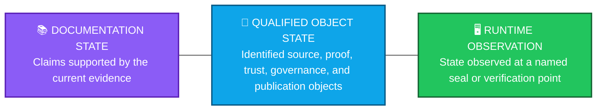
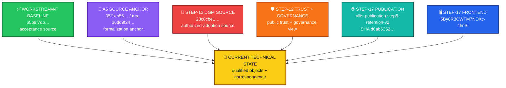
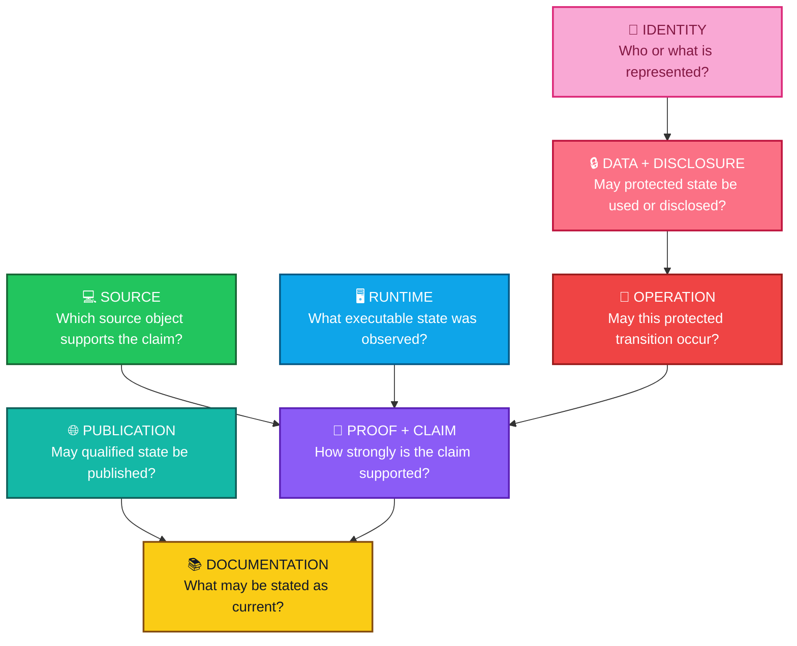
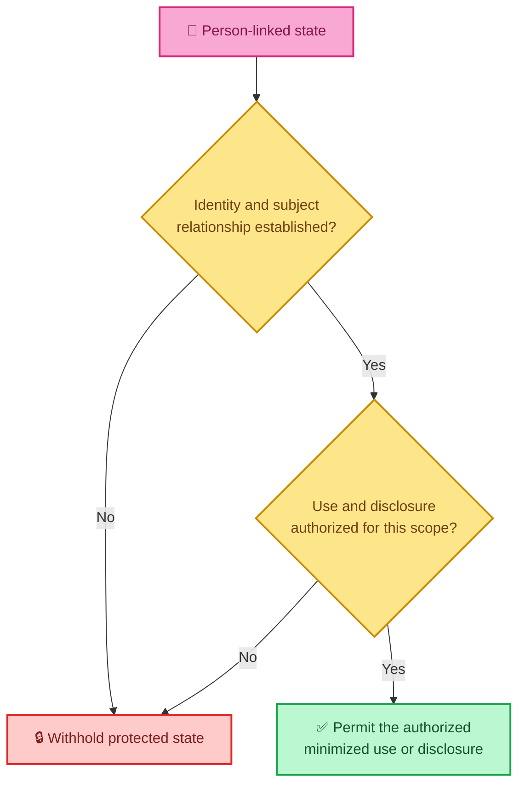
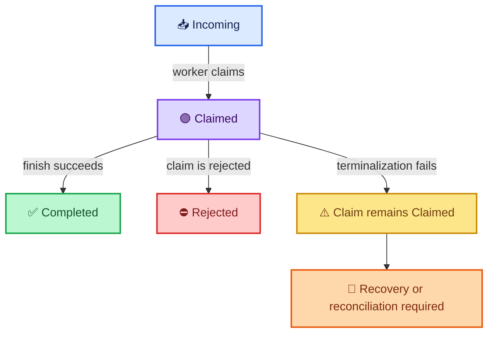
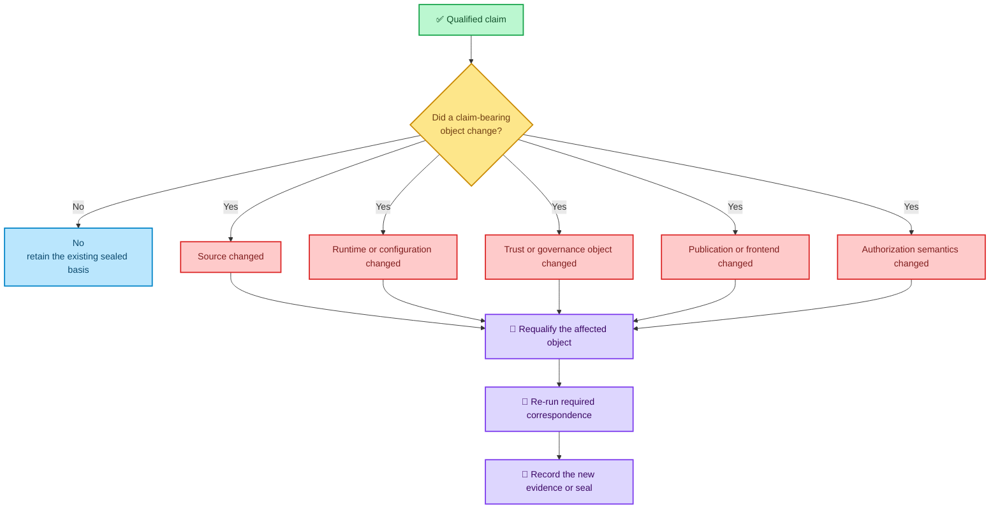

<div align="center">

# ALLIS — CURRENT STATE

### Current qualified technical state

**Status as of September 20, 2026**

<br>


<br>

**Kidd’s Technical Services · ALLIS**

</div>

---

> [!IMPORTANT]
> `CURRENT.md` summarizes the qualified state of ALLIS.
>
> It shows which workstreams are closed, which results are verified, which runtime observations are time-specific, and which claims remain outside the current scope.

---

# 👀 Status at a glance

| Scope | Status | What the status means |
|---|---|---|
| 🟢 **Workstream F** | **CLOSED** | F1–F5 closed · 5/5 proofs · formal close |
| 🟢 **DGM Step 12** | **GREEN_CLOSED_WITH_EXPLICIT_RESIDUALS** | The bounded authorized-adoption formal and correspondence workstream is closed |
| 🤖 **T12D-A** | **MACHINE_CHECKED** | The bounded successful-application theorem satisfies the Step-12 machine-checking method |
| 🔗 **T12D-B** | **CORRESPONDENCE_VERIFIED** | Invalid authorization fails closed in the verified source/runtime path |
| 🔗 **T12D-C** | **CORRESPONDENCE_VERIFIED** | An empty incoming spool produces no worker claim or authorized application |
| 🔴 **P12C-09** | **MACHINE_CHECKED_DISPROVEN** | Unconditional terminal totality is false in the bounded model |
| 🟢 **Publication Step 17** | **GREEN COMPLETE** | Steps 0–17 are green · 25/25 fixed-goal criteria pass |
| 🌐 **Governed publication endpoint** | **COMPLETE at final seal** | The fixed-goal read-only publication path is complete |
| 🔎 **Evidence & Governance Portal** | **LIVE at final Step-17 observation** | The GUI consumed the governed publication at the final observation |
| ⚪ **Whole-system proof** | **NOT CLAIMED** | `SYSTEM_PROVEN=NO` remains the current boundary |

---

# 🧭 Three status layers

ALLIS separates the status of documentation, qualified objects, and runtime observations.



| Layer | What it tells you |
|---|---|
| 📚 **Documentation state** | Which claims the public technical record supports |
| 🧩 **Qualified-object state** | Which exact technical objects support those claims |
| 🖥️ **Runtime observation** | What the system showed at a specific observation or seal |

> [!NOTE]
> Runtime observations are time-specific. If a claim-bearing runtime object changes, the affected correspondence must be verified again.

---

# 🧩 Qualified object map

The current ALLIS record uses several qualified objects because different workstreams answer different technical questions.



## Qualified-object registry

| Object | Identity | Role | Scope |
|---|---|---|---|
| ✅ **Workstream-F qualified source baseline** | branch `remediation/active-source-baseline-20260902` · HEAD `65b9f7dbd594ec9d225152aabd705eefc9216dbb` · tag `stage10-auth-identity-65b9f7dbd594` | Source authority for Workstream-F close | Workstream-F acceptance lineage |
| 📐 **A5 source anchor** | HEAD `35f1aa5586e1a23e1ab88f4d757c451b44506893` · tree `36dd9f2425db4b23bacfce1cb258603cace25f1b` | Source anchor for bounded formalization and wiring analysis | A5 formalization domain |
| 🔐 **Step-12 production DGM source** | `20c8cbe175781c8a1c05d65c03977859ceca884a` | Production source for `DGM_PRODUCTION_AUTHORIZED_ADOPTION_MODEL_V1` | Bounded authorized-adoption model |
| 🔑 **Step-12 public trust object** | SHA-256 `4809a1af3dd8fad1767dc5a8a9d67aa763388a055e00ec818c15f9fe0321fbb5` | Public verification trust object | Step-12 trust correspondence |
| 🧭 **Step-12 governance view** | SHA-256 `26523c0bad40ff06a75c62a802f20195295534764dce45cfa6acdcdaecc3fcc2` | Sealed governance object | Step-12 governance correspondence |
| 🌐 **Step-17 publication** | ID `allis-publication-step6-retention-v2` | Governed public projection | Step-17 publication workstream |
| 🧾 **Step-17 publication body** | SHA-256 `d6ab63522f9080fae440578ebbb6ed42140595155c9a30253f5b8eeeef8009b7` | Immutable publication identity | Final Step-17 publication |
| 🖥️ **Step-17 frontend build** | `5By6R3CWTM7NDXc-4lmSi` | Frontend build identity | Final Step-17 GUI observation |

These objects are complementary. Together, they describe the qualified technical state across several bounded workstreams.

---

# 🌈 Authority planes

ALLIS separates authority by function.



| Plane | Governing question |
|---|---|
| 👤 Identity | Who or what is represented? |
| 🔒 Data and disclosure | May this protected state be used or disclosed for this purpose and recipient? |
| 🔐 Operation | May this exact protected transition occur? |
| 💻 Source | Which source object supports this claim? |
| 🖥️ Runtime | What executable state was observed? |
| 📐 Proof and claim | What level of evidence supports the claim? |
| 🌐 Publication | May this qualified state leave the system as public evidence? |
| 📚 Documentation | What may the public technical record state as current? |

> **State does not become authority merely because it exists.**

---

# ✅ Workstream F

<div align="center">


</div>

Workstream F is formally closed.

```text
F1 = CLOSED
F2 = CLOSED
F3 = CLOSED
F4 = CLOSED
F5 = CLOSED

proofs = 5 / 5

WORKSTREAM_F_STATUS = CLOSED
```

Qualified source:

```text
branch:
remediation/active-source-baseline-20260902

HEAD:
65b9f7dbd594ec9d225152aabd705eefc9216dbb

tag:
stage10-auth-identity-65b9f7dbd594
```

**Scope:** Workstream F closes its acceptance obligations and preserves the qualified source used for that close. Later proof objects, production sources, and system-wide claims use their own qualification records.

---

# 🔐 DGM Step 12

<div align="center">


</div>

Formal object:

```text
DGM_PRODUCTION_AUTHORIZED_ADOPTION_MODEL_V1
```

Production source:

```text
20c8cbe175781c8a1c05d65c03977859ceca884a
```

Final status:

```text
GREEN_CLOSED_WITH_EXPLICIT_RESIDUALS
```

Final seal SHA-256:

```text
b00a954a924d3aa3490a5bcb8d4473da2b6885b8c41e116cf03545fee975c23b
```

## Proposition dashboard

| Proposition | Validation state | Meaning |
|---|---|---|
| `T12D-A` | 🤖 **MACHINE_CHECKED** | A successful bounded application implies the required authorization, target, prestate, one-use, and receipt predicates |
| `T12D-B` | 🔗 **CORRESPONDENCE_VERIFIED** | Invalid authorization does not enter the authorized spool |
| `T12D-C` | 🔗 **CORRESPONDENCE_VERIFIED** | An empty incoming spool produces no worker claim or authorized application |
| `P12C-09` | 🔴 **MACHINE_CHECKED_DISPROVEN** | A claimed record is not guaranteed to reach Completed or Rejected |

```mermaid
flowchart LR
    A["📦 External package"] --> B["🛡️ NBB validation"]
    B --> C["📥 Authorized spool"]
    C --> D["👷 Worker claim"]
    D --> E["🔐 Authorized apply gate"]
    E --> F["🔧 Governed apply"]
    F --> G["🧾 Durable receipt"]
    G --> H["✅ Completed or rejected"]

    classDef default stroke-width:2px;
    style A fill:#dbeafe,stroke:#2563eb,color:#172554
    style B fill:#fde68a,stroke:#ca8a04,color:#713f12
    style C fill:#bae6fd,stroke:#0284c7,color:#0c4a6e
    style D fill:#ddd6fe,stroke:#7c3aed,color:#3b0764
    style E fill:#fecaca,stroke:#dc2626,color:#7f1d1d
    style F fill:#bbf7d0,stroke:#16a34a,color:#14532d
    style G fill:#99f6e4,stroke:#0f766e,color:#134e4a
    style H fill:#f9a8d4,stroke:#db2777,color:#831843
```



## Step-12 residuals

| Residual | Status |
|---|---|
| Positive live authorized apply | `NOT_OBSERVED` in the Step-12 formal workstream |
| Unconditional terminal totality | `DISPROVEN` |
| General production mutation safety | `NOT_PROVEN` |
| Whole-system safety | `NOT_PROVEN` |
| Historical D1R5 domain | `HISTORICAL_ONLY` |
| Formal domain | `BOUNDED_DOMAIN` |
| Runtime correspondence | `POINT_IN_TIME_BINDING` |
| Authorization issuance | `EXTERNAL_TO_RUNTIME_MODEL` |

Step 12 proves bounded properties of the authorized-adoption path. Whole-system proof remains outside this workstream.

```text
PRODUCTION_MUTATION_SAFETY_THEOREM_PROVEN=NO

WHOLE_SYSTEM_SAFETY_THEOREM_PROVEN=NO

SYSTEM_PROVEN=NO
```

Read the detailed records:

- [Formal model](formal-verification/authorized-adoption/formal-model.md)
- [Theorem registry](formal-verification/authorized-adoption/theorem-registry.md)
- [Counterexample registry](formal-verification/authorized-adoption/counterexample-registry.md)
- [Step-12 final seal](evidence/governed-evolution/step12-final-seal.md)
- [Residuals and non-promotions](evidence/governed-evolution/residuals.md)

---

# 🌐 Publication Step 17

<div align="center">


</div>

The publication and Evidence & Governance Portal workstream is complete for its fixed goal.

```text
Steps 0–17:
GREEN

Completion criteria:
25 / 25 PASS

Final network continuity:
GREEN

ALLIS_LIVE_PUBLICATION_ENDPOINT:
COMPLETE

ALLIS_EVIDENCE_GOVERNANCE_PORTAL:
LIVE at final sealed observation
```

## Final identities

| Object | Identity |
|---|---|
| 🌐 Publication ID | `allis-publication-step6-retention-v2` |
| 🧾 Publication SHA-256 | `d6ab63522f9080fae440578ebbb6ed42140595155c9a30253f5b8eeeef8009b7` |
| 🖥️ Frontend build | `5By6R3CWTM7NDXc-4lmSi` |

## Publication path


The final closeout establishes:

- a governed read-only public GET endpoint;
- schema and contract validation;
- reference resolution;
- explicit source and publication authority;
- immutable publication identity;
- retained prior publication state;
- privacy and publication-eligibility governance;
- fail-closed behavior for prohibited methods and missing resources;
- no public mutation endpoint;
- publication-service isolation from qualified ALLIS;
- loopback-only publication service;
- authorized public routing;
- GUI consumption without unrestricted direct ALLIS access;
- epistemic-state preservation;
- restart persistence;
- rollback demonstration;
- source → publication → HTTP → GUI correspondence;
- final network continuity; and
- no production mutation during final closeout.

---

# 👤 Private-state boundary

ALLIS treats person-linked information as protected state.



The boundary separates five questions:

```text
Does the state exist?
Who does it concern?
Is this use authorized?
Is this disclosure authorized?
What scope and recipient are permitted?
```

Private state enters shared or public lanes only through the applicable identity, scope, and disclosure controls.

---

# 🧷 Semantic commitment

DGM authorization binds the semantics that can affect a governed decision.

The bounded candidate envelope includes:

```text
proposal
target
expected prestate
candidate content
evaluation
scores
expected tests
```

> **Every authority-bearing semantic input must be committed when the authorization decision depends on it.**

A valid signature proves the integrity of the signed object. Complete authorization also requires the relevant semantic inputs and policy predicates.

---

# 🧯 Recovery state

Step 12 disproves unconditional terminal totality.

A claimed record can remain in the `Claimed` state if terminalization fails.



This result establishes an explicit recovery case:

```text
claimed
    ≠
guaranteed terminal
```

Recovery logic must handle a record that remains claimed after a terminalization failure.

---

# 🔗 Correspondence

Correspondence connects a formal claim to the implementation and runtime state that support it.

```mermaid
flowchart LR
    A["📐 Formal model"]:::m
    B["💻 Qualified source"]:::s
    C["🖥️ Observed runtime"]:::r
    D["🧪 Bounded observation"]:::o
    E["🔗 Correspondence result"]:::c

    A --> B --> C --> D --> E

    classDef m fill:#ddd6fe,stroke:#7c3aed,color:#3b0764,stroke-width:2px;
    classDef s fill:#bbf7d0,stroke:#16a34a,color:#14532d,stroke-width:2px;
    classDef r fill:#bae6fd,stroke:#0284c7,color:#0c4a6e,stroke-width:2px;
    classDef o fill:#fde68a,stroke:#ca8a04,color:#713f12,stroke-width:2px;
    classDef c fill:#f0abfc,stroke:#c026d3,color:#701a75,stroke-width:2px;
```



Runtime correspondence is time-specific.

```text
correspondence at seal time
    ≠
permanent correspondence
```

Revalidate correspondence after a claim-bearing runtime object changes.

This rule applies to:

- source/runtime correspondence;
- trust correspondence;
- governance-view correspondence;
- publication-body correspondence; and
- GUI/publication continuity.

---

# 📌 Validated results

| Result | Domain | Validation level |
|---|---|---|
| Workstream F is formally closed | Acceptance | ✅ Closed |
| Step 12 is closed with explicit residuals | DGM | 🤖 / 🔗 Machine-checked + selected correspondence |
| Invalid authorization fails closed | DGM | 🔗 Correspondence-Verified |
| Empty incoming spool produces no authorized application | DGM | 🔗 Correspondence-Verified |
| Unconditional terminal totality is false | DGM | 🔴 Machine-Checked Disproven |
| Candidate scores are authority-bearing semantics | Authorization | 🧷 Source/governance relevance established |
| Step-17 publication fixed goal is complete | Publication | 🔗 Correspondence-verified fixed goal |
| The publication endpoint is governed and read-only within the fixed goal | Publication | 🔗 Correspondence-verified fixed goal |
| The Evidence & Governance Portal consumed the governed publication at final seal | Publication / GUI | 🔗 Correspondence-verified fixed goal |
| Runtime correspondence is time-specific | Correspondence | ✅ Current architecture rule |

---

# 🎯 Scope limits

The following boundaries remain part of the current record.

| Area | Current boundary |
|---|---|
| Whole-system proof | `SYSTEM_PROVEN=NO` |
| Universal production mutation safety | Outside the bounded Step-12 theorem |
| T12D-A live positive-path correspondence | Not established in Step 12 |
| Runtime correspondence | Applies to the verified observation point, not all future runtime states |
| Historical D1R5 theorem | Applies to its historical theorem domain |
| Private-state runtime correspondence | Requires separate evidence for each applicable path |
| Authorization | Requires signature verification **and** complete semantic and policy checks |
| Publication | Requires a separate outward publication boundary |
| Deployment programs | Instantiations of ALLIS, not definitions of the platform |
| Thesis | Research lineage and explanation, not current implementation authority |

---

# 🚦 Fail-closed outcomes

ALLIS uses distinct outcomes for different safe states.

| Outcome | Meaning |
|---|---|
| ⛔ **BLOCKED / DENIED** | The requested transition is prohibited |
| 🔒 **WITHHELD / NOT_AUTHORIZED** | Protected state exists, but this use or disclosure lacks authority |
| 📴 **UNAVAILABLE** | A required dependency or qualified state cannot be reached |
| 🟡 **GOVERNED_DEGRADED** | A reduced mode is permitted within a defined scope |
| ❓ **UNRESOLVED** | Required evidence or authority still needs adjudication |
| ➖ **NOT_APPLICABLE** | The transition does not apply to this request |

> **Missing authority never becomes permission by default.**

---

# 🔄 Revalidation after change

A change to a claim-bearing object can require new qualification or correspondence evidence.



Changes that can require revalidation include:

- source commit or tree changes;
- runtime image or mounted source changes;
- trust-anchor changes;
- governance-view changes;
- authorization schema or semantic-binding changes;
- publication identity changes;
- frontend build changes;
- public routing changes; and
- new protected state transitions.

---

# 🔒 Workstream closure

A closed workstream keeps its scope, evidence, and final result.

Each closed workstream preserves:

- its qualified object;
- acceptance criteria;
- proof state;
- evidence;
- residuals;
- final seal; and
- scope.

A new capability uses a new governed workstream and its own acceptance criteria.

---

# 🧠 System roles

| Name | Role |
|---|---|
| 🧩 **ALLIS** | KTS engineering and research platform |
| 💬 **Ms. Allis** | Governed intelligence-facing analytical and advisory service that operates through ALLIS |
| 🏛️ **External institutions and communities** | Hold legal, institutional, academic, organizational, or community authority outside ALLIS |
| 🗺️ **Pilots and deployments** | Bounded use cases and deployment environments |
| 🔗 **MountainShares / The Commons** | Separate governance or economic systems that can use ALLIS |

These roles remain separate.

```text
Ms. Allis
    ≠
ALLIS

deployment
    ≠
ALLIS definition

external institutional authority
    ≠
ALLIS technical authority
```

---

# 🏠 Public documentation and local source

ALLIS keeps implementation source local while publishing the evidence needed to review public technical claims.

Public technical records can include:

- architecture;
- qualified object identities;
- source commit identities;
- non-sensitive hashes;
- formal models;
- theorem status;
- counterexamples;
- correspondence results;
- residuals and scope limits;
- publication identities; and
- closeout evidence.

Private material remains outside the public repository where appropriate, including:

- signing keys;
- credentials;
- authentication tokens;
- private personal information;
- sensitive authorization artifacts;
- exploit-relevant operational details; and
- local implementation source that is not required to support a public claim.

> **Public documentation does not require a public source-code release.**

---

# 📚 Related records

## Architecture

- [System boundary](architecture/system-boundary/ALLIS_SYSTEM_BOUNDARY.md)
- [State model](architecture/state-models/STATE_MODEL_OVERVIEW.md)
- [Trust and authority](architecture/trust-and-authority/TRUST_AND_AUTHORITY_OVERVIEW.md)
- [Deployment model](architecture/deployment-model/DEPLOYMENT_MODEL_OVERVIEW.md)

## Step-12 formal verification

- [Formal model](formal-verification/authorized-adoption/formal-model.md)
- [Theorem registry](formal-verification/authorized-adoption/theorem-registry.md)
- [Counterexample registry](formal-verification/authorized-adoption/counterexample-registry.md)

## Correspondence

- [Correspondence overview](correspondence/README.md)
- [Authorized adoption: model → source](correspondence/authorized-adoption/model-to-source.md)
- [Authorized adoption: source → runtime](correspondence/authorized-adoption/source-to-runtime.md)

## Evidence

- [Evidence overview](evidence/README.md)
- [Governed-evolution evidence](evidence/governed-evolution/README.md)
- [Source identity](evidence/governed-evolution/source-identity.md)
- [Trust anchor](evidence/governed-evolution/trust-anchor.md)
- [Governance view](evidence/governed-evolution/governance-view.md)
- [Residuals and non-promotions](evidence/governed-evolution/residuals.md)
- [Step-12 final seal](evidence/governed-evolution/step12-final-seal.md)

---

# 🧾 Summary

<div align="center">

### 🟢 Workstream F
**CLOSED**

### 🟢 DGM Step 12
**CLOSED WITH EXPLICIT RESIDUALS**

### 🟢 Publication Step 17
**GREEN COMPLETE**

### 🔗 Selected bounded results
**CORRESPONDENCE-VERIFIED**

### 🔴 P12C-09
**DISPROVEN AND PRESERVED**

### ⚪ Whole-system proof
**NOT CLAIMED**

<br>

# `SYSTEM_PROVEN=NO`

</div>

---

# Core principles

> **State does not become authority merely because it exists.**

> **Capability does not create permission.**

> **A protected transition requires authority for that transition.**

> **Authority itself has provenance.**

> **Cryptographic validity does not replace semantic completeness.**

> **A claim advances only as far as its evidence supports.**

> **Correspondence is time-specific.**

> **A closed workstream does not imply whole-system proof.**
