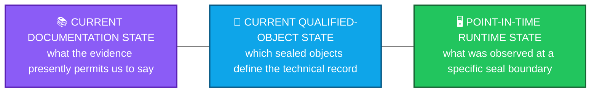
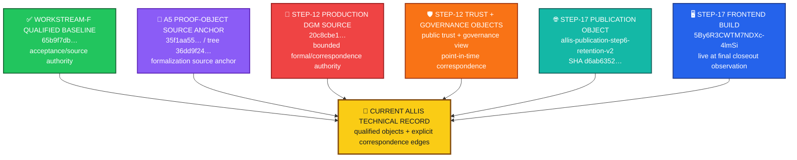
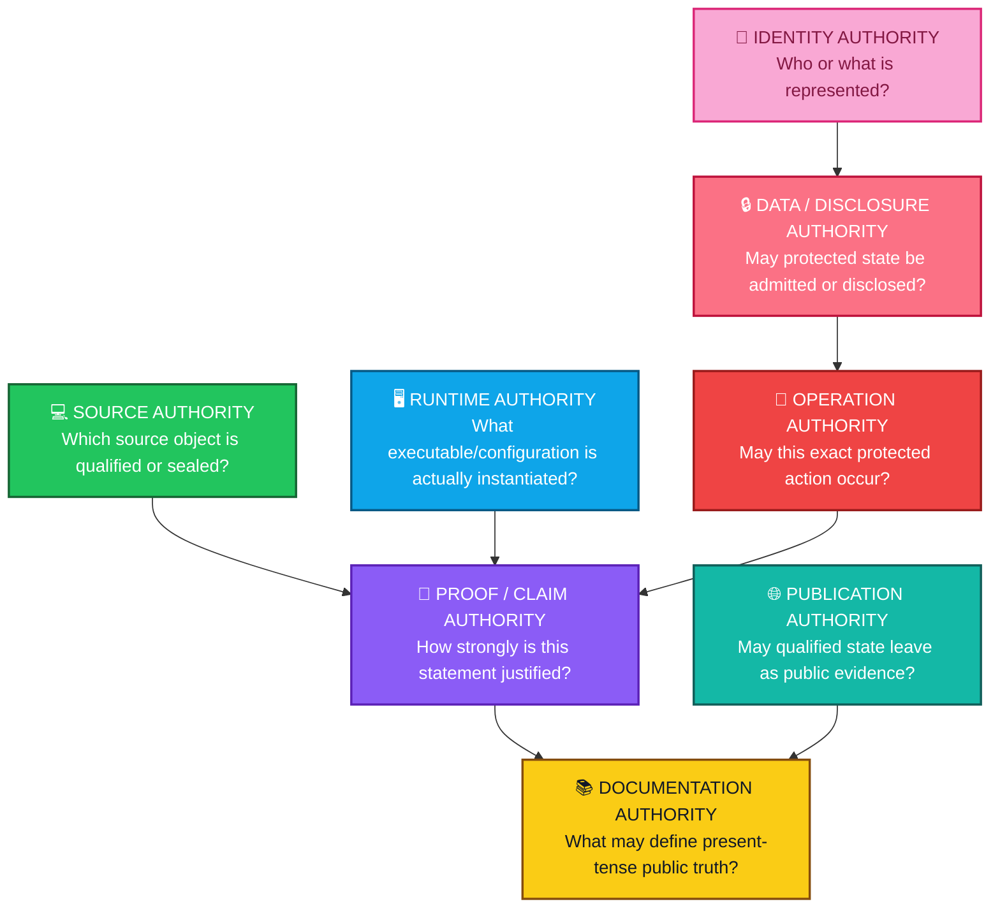
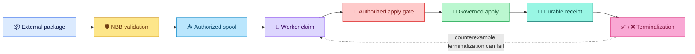
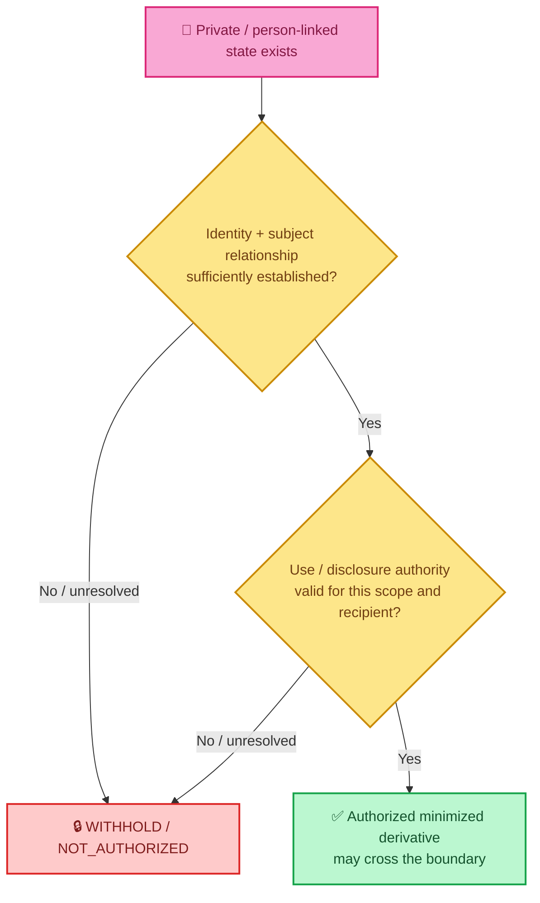
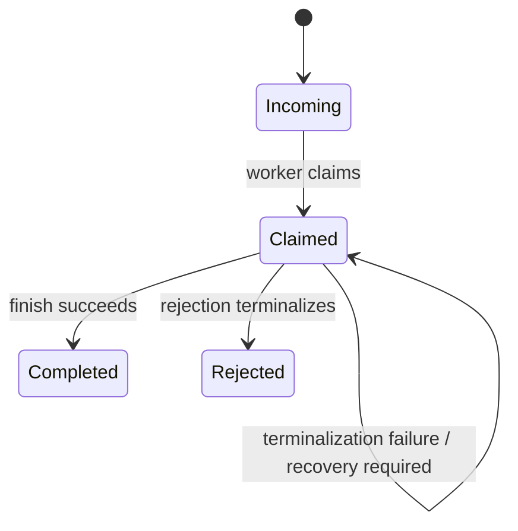
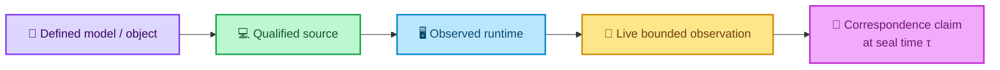
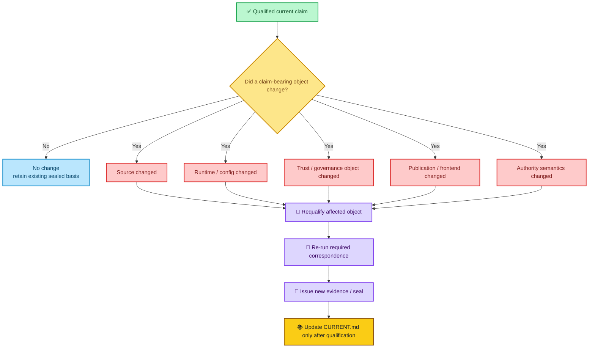

<div align="center">

# ALLIS — CURRENT STATE

### Present qualified technical record

**Evidence reconciled through September 20, 2026**

<br>


<br>

**Kidd’s Technical Services · ALLIS**

</div>

---

> [!IMPORTANT]
> `CURRENT.md` answers one question:
>
> # What can the public technical record truthfully say about ALLIS now?
>
> This file is a **governed projection of qualified evidence**.  
> It is not a development diary, not a thesis summary, and not a claim that every runtime fact remains permanently true.

---

# 👀 Current state at a glance

| Scope | Current state | Validation meaning |
|---|---|---|
| 🟢 **Workstream F** | **CLOSED** | F1–F5 closed · 5/5 proofs · formal close |
| 🟢 **DGM Step 12** | **GREEN_CLOSED_WITH_EXPLICIT_RESIDUALS** | Bounded authorized-adoption formal/correspondence workstream closed |
| 🤖 **T12D-A** | **MACHINE_CHECKED** | Positive-path theorem established in the bounded sealed model; live positive apply not observed |
| 🔗 **T12D-B** | **CORRESPONDENCE_VERIFIED** | Invalid authorization fail-closed behavior bound to source/runtime observation |
| 🔗 **T12D-C** | **CORRESPONDENCE_VERIFIED** | Empty incoming spool non-application bound to source/runtime observation |
| 🔴 **P12C-09** | **MACHINE_CHECKED_DISPROVEN** | Unconditional terminal totality is false in the bounded model |
| 🟢 **Publication Step 17** | **GREEN COMPLETE** | Steps 0–17 green · 25/25 fixed-goal criteria |
| 🌐 **Governed publication endpoint** | **COMPLETE at final seal** | Read-only governed publication path closed for the fixed goal |
| 🔎 **Evidence & Governance Portal** | **LIVE at final Step-17 observation** | GUI consumed governed same-origin publication at the sealed observation boundary |
| ⚪ **Whole-system proof** | **NOT CLAIMED** | `SYSTEM_PROVEN=NO` remains controlling |

---

# 🧭 How to read “current”

There are three different meanings of current in this document.



### The distinction matters

```text
current documentation claim
    ≠
permanent runtime guarantee
```

```text
qualified source object
    ≠
all of ALLIS
```

```text
closed workstream
    ≠
whole-system proof
```

> [!NOTE]
> A runtime statement in this file is current **as an evidence-backed record of the sealed observation** unless a later qualified observation supersedes it.
>
> If runtime state changes, correspondence must be earned again.

---

# 🧩 The current ALLIS record is composite

There is no single commit, image, theorem, publication, or frontend build that truthfully equals “the current ALLIS system.”

The current technical record is a **composite of separately qualified objects with different authority roles**.



## Current qualified-object registry

| Object | Current identity | Role | What it does **not** mean |
|---|---|---|---|
| ✅ **Workstream-F qualified source baseline** | branch `remediation/active-source-baseline-20260902` · HEAD `65b9f7dbd594ec9d225152aabd705eefc9216dbb` · tag `stage10-auth-identity-65b9f7dbd594` | Source authority for F close | Does not automatically identify later proof or production DGM source |
| 📐 **A5 proof-object source anchor** | HEAD `35f1aa5586e1a23e1ab88f4d757c451b44506893` · tree `36dd9f2425db4b23bacfce1cb258603cace25f1b` | Bounded formalization/wiring source anchor | Does not silently replace the F-close baseline |
| 🔐 **Step-12 production DGM source** | `20c8cbe175781c8a1c05d65c03977859ceca884a` | Production source for `DGM_PRODUCTION_AUTHORIZED_ADOPTION_MODEL_V1` | Does not represent every ALLIS subsystem |
| 🔑 **Step-12 public trust object** | SHA-256 `4809a1af3dd8fad1767dc5a8a9d67aa763388a055e00ec818c15f9fe0321fbb5` | Public verification trust correspondence | Does not create private signing authority |
| 🧭 **Step-12 governance view** | SHA-256 `26523c0bad40ff06a75c62a802f20195295534764dce45cfa6acdcdaecc3fcc2` | Sealed NBB governance-view correspondence | Does not itself authorize mutation |
| 🌐 **Step-17 publication** | ID `allis-publication-step6-retention-v2` | Governed public projection | Does not expose full internal/private ALLIS state |
| 🧾 **Step-17 publication body** | SHA-256 `d6ab63522f9080fae440578ebbb6ed42140595155c9a30253f5b8eeeef8009b7` | Immutable publication identity | Does not imply perpetual future HTTP correspondence |
| 🖥️ **Step-17 frontend build** | `5By6R3CWTM7NDXc-4lmSi` | Frontend identity at final Step-17 closeout | Does not represent the entire runtime |

> [!IMPORTANT]
> These objects are **complementary**, not competing.
>
> The current system record must preserve their different roles instead of flattening them into one version string.

---

# 🌈 Current authority-plane map

ALLIS presently has evidence across multiple authority planes.



## Current governing questions

| Plane | Current governing question |
|---|---|
| 👤 Identity | Who or what is authenticated or represented? |
| 🔒 Data/disclosure | May this private/person-linked state be used or disclosed in this scope? |
| 🔐 Operation | May this exact candidate/action cross a protected transition? |
| 💻 Source | Which exact source object is qualified for this claim? |
| 🖥️ Runtime | What was actually instantiated at the observation boundary? |
| 📐 Proof/claim | How far may the claim advance? |
| 🌐 Publication | May this governed state be exposed outward as public evidence? |
| 📚 Documentation | Which qualified evidence may define present-tense public documentation? |

The common invariant is:

> **No object makes itself authoritative merely by existing.**

---

# ✅ Workstream F — current state

<div align="center">


</div>

Workstream F is formally closed.

```text
F1 = CLOSED
F2 = CLOSED
F3 = CLOSED
F4 = CLOSED
F5 = CLOSED

proofs = 5 / 5

WORKSTREAM_F_STATUS = CLOSED
```

Qualified F-close source:

```text
branch:
remediation/active-source-baseline-20260902

HEAD:
65b9f7dbd594ec9d225152aabd705eefc9216dbb

tag:
stage10-auth-identity-65b9f7dbd594
```

### Current meaning

Workstream F provides a **closed acceptance/source-authority object**.

It does not automatically mean:

```text
F close
    ⇒
all later source is the same source
```

or:

```text
F close
    ⇒
whole ALLIS proven
```

---

# 🔐 DGM Step 12 — current state

<div align="center">


</div>

Formal object:

```text
DGM_PRODUCTION_AUTHORIZED_ADOPTION_MODEL_V1
```

Production source:

```text
20c8cbe175781c8a1c05d65c03977859ceca884a
```

Final status:

```text
GREEN_CLOSED_WITH_EXPLICIT_RESIDUALS
```

Final seal SHA-256:

```text
b00a954a924d3aa3490a5bcb8d4473da2b6885b8c41e116cf03545fee975c23b
```

## Proposition dashboard

| Proposition | Current validation state | Meaning |
|---|---|---|
| `T12D-A` | 🤖 **MACHINE_CHECKED** | Successful bounded authorized application implies the required validation/reservation/receipt predicates |
| `T12D-B` | 🔗 **CORRESPONDENCE_VERIFIED** | Invalid authorization does not enter authorized spool publication |
| `T12D-C` | 🔗 **CORRESPONDENCE_VERIFIED** | Empty incoming spool implies no worker claim and no authorized application |
| `P12C-09` | 🔴 **MACHINE_CHECKED_DISPROVEN** | `claimed ⇒ completed OR rejected` is not universally true |



## Step-12 residuals that remain current

| Residual | Current state |
|---|---|
| Positive live authorized apply | `NOT_OBSERVED` in the Step-12 formal workstream |
| Unconditional terminal totality | `DISPROVEN` |
| General production mutation safety | `NOT_PROVEN` |
| Whole-system safety | `NOT_PROVEN` |
| Historical D1R5 domain | `HISTORICAL_ONLY` |
| Formal domain | `BOUNDED_DOMAIN` |
| Runtime correspondence | `POINT_IN_TIME_BINDING` |
| Authorization issuance | `EXTERNAL_TO_RUNTIME_MODEL` |

The controlling non-promotion remains:

```text
PRODUCTION_MUTATION_SAFETY_THEOREM_PROVEN=NO

WHOLE_SYSTEM_SAFETY_THEOREM_PROVEN=NO

SYSTEM_PROVEN=NO
```

> [!CAUTION]
> These are **current claim boundaries**, not unfinished bookkeeping.

Read the preserved Step-12 records:

- [Formal model](formal-verification/authorized-adoption/formal-model.md)
- [Theorem registry](formal-verification/authorized-adoption/theorem-registry.md)
- [Counterexample registry](formal-verification/authorized-adoption/counterexample-registry.md)
- [Step-12 final seal](evidence/governed-evolution/step12-final-seal.md)
- [Residuals and non-promotions](evidence/governed-evolution/residuals.md)

---

# 🌐 Publication Step 17 — current state

<div align="center">


</div>

The bounded live-publication / Evidence & Governance Portal fixed goal is closed.

```text
Steps 0–17:
GREEN

Completion criteria:
25 / 25 PASS

Final network continuity:
GREEN

ALLIS_LIVE_PUBLICATION_ENDPOINT:
COMPLETE

ALLIS_EVIDENCE_GOVERNANCE_PORTAL:
LIVE at final sealed observation
```

## Final Step-17 identities

| Object | Identity |
|---|---|
| 🌐 Publication ID | `allis-publication-step6-retention-v2` |
| 🧾 Publication SHA-256 | `d6ab63522f9080fae440578ebbb6ed42140595155c9a30253f5b8eeeef8009b7` |
| 🖥️ Frontend build | `5By6R3CWTM7NDXc-4lmSi` |

## Final demonstrated publication chain

```mermaid
flowchart LR
    A["✅ Qualified state"]:::q
    B["🛡️ Publication eligibility"]:::e
    C["📦 Immutable publication"]:::p
    D["🔒 Loopback-only GET service"]:::l
    E["🚦 Authorized Caddy route"]:::c
    F["🌐 Public HTTPS publication"]:::h
    G["🔎 Evidence & Governance Portal"]:::g

    A --> B --> C --> D --> E --> F --> G

    classDef q fill:#bbf7d0,stroke:#16a34a,color:#14532d,stroke-width:2px;
    classDef e fill:#fde68a,stroke:#ca8a04,color:#713f12,stroke-width:2px;
    classDef p fill:#99f6e4,stroke:#0f766e,color:#134e4a,stroke-width:2px;
    classDef l fill:#ddd6fe,stroke:#7c3aed,color:#3b0764,stroke-width:2px;
    classDef c fill:#fed7aa,stroke:#ea580c,color:#7c2d12,stroke-width:2px;
    classDef h fill:#bae6fd,stroke:#0284c7,color:#0c4a6e,stroke-width:2px;
    classDef g fill:#f0abfc,stroke:#c026d3,color:#701a75,stroke-width:2px;
```



The final closeout established, within the fixed goal:

- governed read-only public GET endpoint;
- frozen-contract/schema validation;
- reference resolution;
- explicit source and publication authority;
- immutable publication identity;
- retained prior publication state;
- privacy and publication-eligibility governance;
- fail-closed prohibited-method / missing-resource behavior;
- no public mutation endpoint;
- publication service isolation from qualified ALLIS;
- loopback-only publication service;
- authorized public routing;
- GUI consumption without unrestricted direct ALLIS access;
- epistemic-state preservation;
- restart persistence;
- rollback demonstration;
- source → publication → HTTP → GUI correspondence;
- final network continuity;
- no production mutation during the final closeout.

## The transient DNS event is **not** current red state

The predecessor R2-R1 closeout reached a valid **25/25 criteria matrix**, then encountered a DNS-resolution timeout during the final public GUI continuity check.

That temporary result is superseded.

R2-R2 reproduced public continuity on the **first bounded recovery attempt**:

```text
DNS resolved
publication endpoint = HTTP 200
GUI endpoint = HTTP 200
direct/public publication bodies = identical
production repair required = NO
```

Current classification:

```text
TRANSIENT_EXTERNAL_NAME_RESOLUTION_FAILURE_RECOVERED
```

Final result:

```text
OVERALL_GOAL=GREEN_COMPLETE
```

> [!IMPORTANT]
> There is **no Step 18 for this fixed goal**.
>
> A new capability requires a new governed workstream with its own authority and acceptance criteria.

---

# 👤 Private-state / H_people — current claim boundary

The current public technical record supports the **architectural privacy/disclosure boundary**.

It does **not** support promoting the historical Gate05c auth runtime into a current runtime-authoritative H_people claim.



Current architectural rule:

```text
private state exists
    ≠
identity authority exists
    ≠
use authority exists
    ≠
disclosure authority exists
    ≠
public publication authority exists
```

Historical Gate05c evidence remains useful provenance:

- subject-key lifecycle routes were source-sealed;
- H_people remained fail-closed where authority was absent;
- exact historical inventory later showed two stopped auth-service containers and zero running.

But:

> **Historical Gate05c runtime state is not current H_people runtime authority.**

---

# 🧷 Current semantic-commitment rule

The DGM engineering record exposed a critical governance property:

> **Cryptographic validity is not enough if authority-bearing semantics are outside the committed object.**

Candidate `scores` were shown to be authority-bearing because governed evaluation can reject based on them.

The corrected formal model represents a candidate envelope containing bounded semantic context including:

```text
proposal
target
expected prestate
candidate content
evaluation
scores
expected tests
```

Current governing rule:

> **Every authority-bearing semantic input must be committed where the authorization decision depends on it.**

This is broader than a serialization detail.

It is part of the authorization security boundary.

---

# 🧯 Current recovery-state rule

Step 12 disproved unconditional terminal totality.

That means `claimed` is a real recoverable operational state—not merely a fleeting implementation detail.



Current implication:

```text
claimed
    ≠
guaranteed terminal
```

A future recovery/reconciliation mechanism must respect that state rather than pretending terminality is mathematically guaranteed.

---

# 🔗 Current correspondence rule

Correspondence is a **time-indexed relation**.



Conceptually:

```text
C(source, runtime, τseal) = PASS
```

does **not** imply:

```text
C(source, runtime, every future time) = PASS
```

Current rule:

> **A changed runtime must earn renewed correspondence.**

This applies to:

- source/runtime correspondence;
- trust correspondence;
- governance-view correspondence;
- publication/direct/public body correspondence;
- GUI/publication continuity.

---

# 🚫 What is **not** current truth

This section exists because the engineering history contains many states that were once correct but are now historical, superseded, bounded, or failed attempts.

| Historical / intermediate state | Current interpretation |
|---|---|
| `RUNNING_AUTH_CONTAINER=NONE` | ❌ Historical heuristic only; did not prove runtime absence |
| `AUTH_SERVICE_EXISTS_BUT_NOT_RUNNING` | 🕰️ Historical Gate05c exact inventory; not a present-runtime claim |
| V1 malformed-token result | ❌ Incomplete; Redis checker did not reach sealed closure |
| V1R1 Redis conclusion | ❌ Not established; graph walker failed with `KeyError: None` |
| V1R2 one reachable `get_connection()` edge | ⚠️ Conservative static reachability; not proof the exact application path connects |
| V1R3 expected-success prose | ❌ Method/expected output, not observed execution evidence in that Backend range |
| A5 analyzer definition | 📐 Method artifact; later handoff summary reports successor closure |
| Historical D1R5 theorem | 🕰️ Legitimate historical bounded theorem; not directly promotable into current production domain |
| Y5 shared mutable runtime source | ❌ `NOT_ESTABLISHED`; production promotion blocked at that point |
| Step 17 R2-R1 final RED | ✅ Superseded by R2-R2 bounded recovery and final GREEN seal |
| Thesis descriptions inconsistent with qualified implementation | 📚 Research lineage; not present-state authority |

> [!WARNING]
> **Higher line number, newer document, or successful-looking output does not automatically mean “current.”**
>
> Current state is determined by authority, scope, supersession, and correspondence—not by chronology alone.

---

# 📌 Current supported claims

The following are safe current public technical claims from the reconciled record.

| Claim | Domain | Current maturity |
|---|---|---|
| Workstream F is formally closed | Acceptance | ✅ Closed / accepted |
| The bounded Step-12 authorized-adoption model is closed with explicit residuals | DGM | 🤖 / 🔗 Machine-checked + selected correspondence |
| Invalid authorization fail-closed behavior is correspondence-verified | DGM | 🔗 Correspondence-Verified |
| Empty incoming spool non-application is correspondence-verified | DGM | 🔗 Correspondence-Verified |
| Unconditional terminal totality is false | DGM | 🔴 Machine-Checked Disproven |
| Candidate scores are authority-bearing semantics | Authorization | 🧷 Source/governance relevance established |
| Step-17 publication fixed goal is complete | Publication | 🔗 Correspondence-verified fixed goal |
| The live publication endpoint is governed and read-only within the fixed goal | Publication | 🔗 Correspondence-verified fixed goal |
| The Evidence & Governance Portal consumed the governed publication at final seal | Publication / GUI | 🔗 Correspondence-verified fixed goal |
| Runtime correspondence is point-in-time | Correspondence | ✅ Controlling current principle |
| Private/local implementation code is not required to be published to document public technical claims | Publication policy | ✅ Current policy |

---

# ⛔ Current explicit nonclaims

These statements remain **unavailable** as present claims.

| Not claimed | Why |
|---|---|
| `SYSTEM_PROVEN=YES` | Whole-system formal verification has not been established |
| Universal production mutation safety | Step-12 theorem is bounded |
| T12D-A is correspondence-verified | Positive live authorized application was deliberately not observed in Step 12 |
| Runtime correspondence is perpetual | Correspondence is point-in-time |
| Historical D1R5 theorem is current production proof | Domain and correspondence differ |
| Historical Gate05c H_people runtime is current runtime-authoritative | No later evidence in the corpus promotes that historical state |
| A valid signature alone proves complete authorization | Semantic completeness and other predicates are separately required |
| Internal qualified state is automatically publishable | Publication requires a distinct outward authority boundary |
| Published state gives unrestricted direct access to ALLIS | Step-17 demonstrates a governed projection/read boundary |
| A deployment defines ALLIS | Deployment is a bounded instantiation/use case |
| The thesis defines current implementation truth | Thesis is explanatory research output, not present-state authority |

---

# 🚦 Current fail-closed vocabulary

ALLIS should not flatten every safe non-success condition into the word “failure.”

| State | Current meaning |
|---|---|
| ⛔ **BLOCKED / DENIED** | The requested transition is prohibited |
| 🔒 **WITHHELD / NOT_AUTHORIZED** | State may exist, but authority for this use/disclosure is absent |
| 📴 **UNAVAILABLE** | Required dependency or qualified state cannot currently be reached |
| 🟡 **GOVERNED_DEGRADED** | A bounded reduced mode is permitted without pretending full operation |
| ❓ **UNRESOLVED** | Required evidence or authority has not yet been adjudicated |
| ➖ **NOT_APPLICABLE** | The transition/lane does not apply |

The invariant underneath all of them is:

> **Missing authority must never be silently converted into permission.**

---

# 🔄 What must be revalidated after change?

A sealed current record is not an excuse to stop checking correspondence.



Examples of events that can invalidate automatic inheritance:

- source commit/tree changes;
- runtime image or mounted source changes;
- trust-anchor change;
- governance-view change;
- authorization schema/semantic binding change;
- publication identity changes;
- frontend build changes;
- public routing changes;
- new protected state transition;
- new capability added to a closed workstream.

---

# 🔒 Closed workstreams stay closed

A closed workstream is an **immutable epistemic object**.

It should retain:

- scope;
- qualified source/object identity;
- acceptance criteria;
- proof state;
- evidence;
- residuals;
- non-promotions;
- final seal;
- successor relationship.

```text
closed workstream
    ≠
permission to silently expand scope
```

```text
new capability
    ⇒
new governed workstream
```

For the Step-17 fixed goal specifically:

```text
NO STEP 18
```

unless a **new capability** is formally defined with its own authority and acceptance criteria.

---

# 🧠 ALLIS / Ms. Allis / external systems

The current system boundary remains:

| Name | Current role |
|---|---|
| 🧩 **ALLIS** | KTS engineering/research platform |
| 💬 **Ms. Allis** | Governed intelligence-facing analytical/advisory service operating through ALLIS |
| 🏛️ **External institutions / communities** | Hold legal, institutional, academic, organizational, or community authority outside ALLIS |
| 🗺️ **Pilots / deployments** | Bounded use cases and deployment environments |
| 🔗 **MountainShares / The Commons** | Separate governance/economic systems that may use ALLIS |

These relationships do not collapse.

```text
Ms. Allis
    ≠
ALLIS

deployment
    ≠
ALLIS definition

external institutional authority
    ≠
ALLIS technical authority
```

---

# 🏠 Public documentation vs local engineering source

The current public-documentation rule is:

> **Make technical claims reviewable without implying that private/local implementation source is published.**

Public-safe records can include:

- architecture;
- qualified object identities;
- source commit identities;
- non-sensitive hashes;
- formal models;
- theorem state;
- counterexamples;
- correspondence state;
- residuals;
- non-promotions;
- publication identities;
- closeout evidence.

Private/local material remains outside the public repository where appropriate, including:

- signing keys;
- credentials;
- authentication tokens;
- private personal information;
- sensitive authorization artifacts;
- exploit-relevant operational detail;
- local implementation source not required to substantiate a public claim.

```text
public documentation
    ≠
public source-code release
```

---

# 📚 Current repository relationship

`CURRENT.md` is intended to become the **present-state authority index** for the public repository.

The existing bounded records remain authoritative within their own scopes.

## Existing architecture

- [System boundary](architecture/system-boundary/ALLIS_SYSTEM_BOUNDARY.md)
- [State model](architecture/state-models/STATE_MODEL_OVERVIEW.md)
- [Trust and authority](architecture/trust-and-authority/TRUST_AND_AUTHORITY_OVERVIEW.md)
- [Deployment model](architecture/deployment-model/DEPLOYMENT_MODEL_OVERVIEW.md)

## Existing Step-12 formal verification

- [Formal model](formal-verification/authorized-adoption/formal-model.md)
- [Theorem registry](formal-verification/authorized-adoption/theorem-registry.md)
- [Counterexample registry](formal-verification/authorized-adoption/counterexample-registry.md)

## Existing correspondence

- [Correspondence overview](correspondence/README.md)
- [Authorized adoption: model → source](correspondence/authorized-adoption/model-to-source.md)
- [Authorized adoption: source → runtime](correspondence/authorized-adoption/source-to-runtime.md)

## Existing evidence

- [Evidence overview](evidence/README.md)
- [Governed-evolution evidence](evidence/governed-evolution/README.md)
- [Source identity](evidence/governed-evolution/source-identity.md)
- [Trust anchor](evidence/governed-evolution/trust-anchor.md)
- [Governance view](evidence/governed-evolution/governance-view.md)
- [Residuals and non-promotions](evidence/governed-evolution/residuals.md)
- [Step-12 final seal](evidence/governed-evolution/step12-final-seal.md)

---

# 🏗️ Companion records being added during repository reconciliation

The reconciled evidence record calls for additional public current-state indexes.

These should complement—not rewrite—the bounded evidence packages.

```text
acceptance/
├── CURRENT_SYSTEM_MANIFEST.md
├── BASELINE_OBJECT_REGISTRY.md
└── closeout/
    ├── WORKSTREAM_F_CLOSE.md
    ├── DGM_STEP12_CLOSE.md
    └── PUBLICATION_STEP17_CLOSE.md

claims/
├── CLAIM_REGISTRY.md
└── NONCLAIMS_AND_RESIDUALS.md

architecture/
├── AUTHORITY_PLANES.md
├── FAIL_CLOSED_SEMANTICS.md
└── private-state/
    └── H_PEOPLE_BOUNDARY.md

correspondence/
└── publication/
    └── source-to-publication-to-http-to-gui.md

evidence/
└── publication/
    ├── README.md
    ├── publication-identity.md
    ├── runtime-boundary.md
    ├── network-continuity.md
    └── step17-final-close.md

research/
└── THESIS_RECONCILIATION.md
```

These paths are the **planned reconciliation layer** until each file is actually added.

---

# 📝 How `CURRENT.md` should be updated

This file should not be edited merely because new development occurred.

A current-state claim should change only when the relevant evidence authority changes.

```mermaid
flowchart LR
    A["🔧 New engineering work"]:::work
    B["🧾 Evidence captured"]:::evidence
    C["🛡️ Authority / scope adjudicated"]:::authority
    D["✅ Object qualified / workstream closed"]:::qualified
    E["🔗 Correspondence established where required"]:::corr
    F["📚 CURRENT.md updated"]:::current

    A --> B --> C --> D --> E --> F

    classDef work fill:#dbeafe,stroke:#2563eb,color:#172554,stroke-width:2px;
    classDef evidence fill:#a5f3fc,stroke:#0891b2,color:#164e63,stroke-width:2px;
    classDef authority fill:#fed7aa,stroke:#ea580c,color:#7c2d12,stroke-width:2px;
    classDef qualified fill:#bbf7d0,stroke:#16a34a,color:#14532d,stroke-width:2px;
    classDef corr fill:#ddd6fe,stroke:#7c3aed,color:#3b0764,stroke-width:2px;
    classDef current fill:#facc15,stroke:#854d0e,color:#111827,stroke-width:2px;
```



The governing documentation rule is:

> **Raw history does not become current truth merely because it exists.**

and:

> **Current truth is assembled from qualified objects and explicit correspondence—not inferred from whichever document was written most recently.**

---

# 🧾 Current-state summary

<div align="center">

### 🟢 CLOSED

**Workstream F**

### 🟢 CLOSED WITH EXPLICIT RESIDUALS

**DGM Step 12**

### 🟢 GREEN COMPLETE

**Publication Step 17**

### 🔗 CORRESPONDENCE-VERIFIED BOUNDED RESULTS

**Selected Step-12 fail-closed paths · Step-17 publication/GUI fixed goal**

### 🔴 DISPROVEN AND PRESERVED

**P12C-09 unconditional terminal totality**

### ⚪ NOT CLAIMED

**Whole-system proof**

<br>

# `SYSTEM_PROVEN=NO`

</div>

---

# Core current principles

> **State does not become authority merely because it exists.**

> **Capability does not create permission.**

> **A protected transition requires authority for that transition.**

> **Authority itself has provenance.**

> **Cryptographic validity does not replace semantic completeness.**

> **A claim may advance only as far as its evidence supports.**

> **Correspondence is time-indexed.**

> **A closed workstream does not imply whole-system proof.**

> **New capabilities require new governed workstreams.**

> **Current documentation is a governed projection of qualified evidence.**

---

<div align="center">

## ALLIS — Current Technical Record

**Reconciled from the completed Uniformed Gateway, DGM, and Backend engineering records**

### 119,907 / 119,907 source lines reviewed

The purpose of `CURRENT.md` is not to make ALLIS appear more complete than the evidence supports.

It is to make the present boundary unmistakable:

### **what is closed · what is live at its seal · what is proven · what is disproven · what is correspondence-verified · what is historical · and what remains explicitly unclaimed**

</div>
