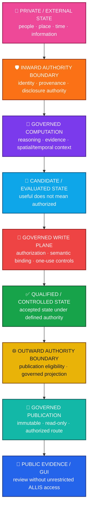
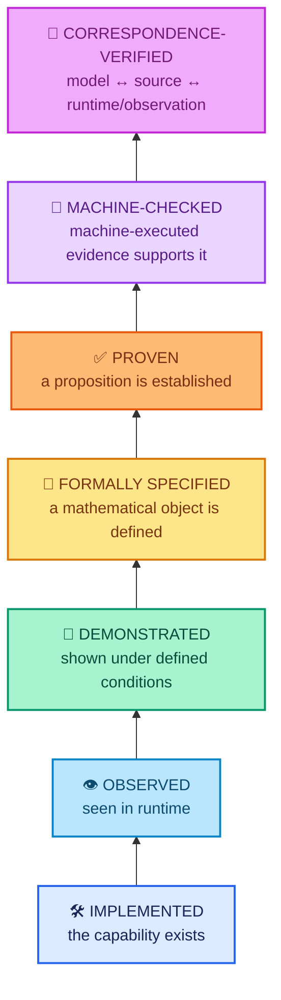
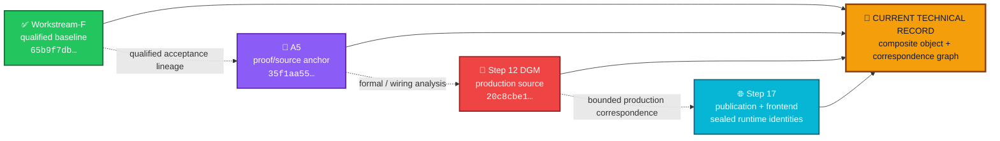
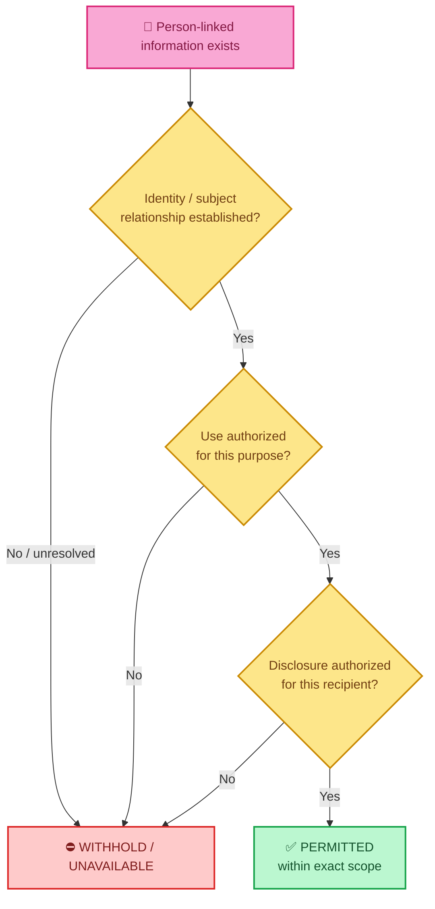

<div align="center">

# ALLIS

### Artificial Learning and Location Intelligence System

**Governed intelligence for understanding state, place, evidence, authority, and change.**

<br>


<br>

**Kidd’s Technical Services · West Virginia**

</div>

---

> [!IMPORTANT]
> **The organizing rule of ALLIS is simple:**
>
> # State does not become authority merely because it exists.
>
> ALLIS separates having information, reasoning about information, proving something about information, having authority to act, and publishing an authorized result.

---

# 👀 ALLIS in 30 seconds

ALLIS is a **governed artificial-intelligence and location-intelligence platform**.

It is designed to reason across:

| | State domain | The question ALLIS keeps separate |
|---|---|---|
| 🧠 | **Semantic** | What does this information mean? |
| 📍 | **Geographic** | Where does it apply? |
| ⏱️ | **Temporal** | When is it valid? |
| 👤 | **Person-linked** | Whom does it concern? |
| 🧾 | **Evidence & provenance** | Where did it come from, and how strong is it? |
| 🛡️ | **Authority** | Is this exact transition permitted? |

The system does **not** assume that access, inference, technical capability, or successful computation automatically creates permission.

```text
available information    ≠ verified information
verified information     ≠ authorized use
identity established     ≠ disclosure authorized
candidate evaluated      ≠ candidate authorized
technically possible     ≠ permitted
implemented              ≠ proven
proven                   ≠ runtime-correspondent
published                ≠ unrestricted backend access
```

---

# 🧭 Choose your path

You do not need to read this README from top to bottom.

| If you want to… | Start here |
|---|---|
| 🌈 **Understand the big idea** | [The authority planes](#-the-authority-planes) |
| 🧩 **See how the system fits together** | [ALLIS is not one source commit](#-allis-is-not-one-source-commit) |
| 🧪 **Understand what “proven” means here** | [Validation ladder](#-the-validation-ladder) |
| 🛡️ **Understand privacy and protected state** | [The inward boundary](#-the-inward-boundary-private-and-person-linked-state) |
| 🔐 **Understand governed system change** | [The governed write plane](#-the-governed-write-plane) |
| 🌐 **Understand what is publicly live** | [The governed read plane](#-the-governed-read-plane) |
| 🔗 **Understand model → source → runtime** | [Correspondence](#-correspondence) |
| 📊 **See the current bounded results** | [Workstream dashboard](#-workstream-dashboard) |
| 📐 **Audit the mathematics** | [Formal verification](formal-verification/authorized-adoption/formal-model.md) |
| 🧾 **Audit the evidence** | [Evidence](evidence/README.md) |

---

# 🌈 The authority planes

ALLIS is easier to understand as a set of **governed state transitions** than as a list of software services.



### In plain English

ALLIS asks different questions at different boundaries:

> **Can the system see this?**  
> is not the same as  
> **May the system use this?**

> **Can the system generate this change?**  
> is not the same as  
> **May the system apply this change?**

> **Does qualified state exist internally?**  
> is not the same as  
> **May this state be published publicly?**

Those distinctions are the architecture.

---

# 🧱 Four principles to remember

| Principle | Meaning |
|---|---|
| 🛡️ **State ≠ authority** | Information does not authorize its own use. |
| 🔐 **Capability ≠ permission** | A component that can act is not automatically permitted to act. |
| 🧾 **Evidence ≠ execution authority** | Strong evidence can support a decision without authorizing it. |
| 🔗 **Correspondence ≠ permanence** | A runtime that matched a sealed source once must be revalidated after change. |

> [!NOTE]
> ALLIS does not try to turn every uncertainty into a binary “yes/no.”  
> A governed result can also be **withheld, unavailable, degraded, unresolved, or not applicable**.

---

# 🪜 The validation ladder

Not every ALLIS claim has the same validation status.



### Why this matters

```text
implemented
    ≠
observed
    ≠
demonstrated
    ≠
formally specified
    ≠
proven
    ≠
machine-checked
    ≠
correspondence-verified
```

For the Step-12 workstream, **Machine-Checked** means machine-executed source-structure checks plus bounded execution evidence.

It does **not** mean the theorem was proved in Lean, Coq, Isabelle, TLA+, or another general-purpose proof assistant.

> [!NOTE]
> **Later successor qualification:** after the historical Step-12 close, a separate Lean 4.34.0 R1 workstream independently formalized and kernel-checked `T12D-A`, `T12D-B`, `T12D-C`, and the `P12C-09` disproof. The qualified principal results reported no theorem-level axiom dependencies.
>
> This later proof-assistant evidence does **not** retroactively redefine the historical Step-12 `MACHINE_CHECKED` label.
>
> See the [Lean R1 workstream closeout](formal-verification/authorized-adoption/lean/workstream-closeout-r1.md).

---

# 🧩 ALLIS is not one source commit

The present technical record cannot be truthfully represented by naming one Git commit and calling it “ALLIS.”

Different qualified objects answer different questions.



## The qualified objects currently represented in the engineering record

| Object | Identity | Role |
|---|---|---|
| ✅ **Workstream-F qualified baseline** | `65b9f7dbd594ec9d225152aabd705eefc9216dbb` | Formal acceptance lineage |
| 📐 **A5 proof/source anchor** | `35f1aa5586e1a23e1ab88f4d757c451b44506893` | Bounded proof/wiring source anchor |
| 🔐 **Step-12 production DGM source** | `20c8cbe175781c8a1c05d65c03977859ceca884a` | Authorized-adoption formal/correspondence source |
| 🌐 **Step-17 publication** | `allis-publication-step6-retention-v2` | Governed public publication identity |
| 🧾 **Step-17 publication SHA-256** | `d6ab63522f9080fae440578ebbb6ed42140595155c9a30253f5b8eeeef8009b7` | Immutable publication body identity |
| 🖥️ **Step-17 frontend build** | `5By6R3CWTM7NDXc-4lmSi` | Sealed frontend build identity |

> [!IMPORTANT]
> These are **related qualified objects**.  
> They are **not competing versions of the same thing**, and none should silently replace the others.

The repository now uses a **composite current-system manifest/object model** rather than treating a single Git commit as the identity of the whole present ALLIS system.

Current-state entry points:

- [Current public technical state](CURRENT.md)
- [Current system manifest](acceptance/current-system-manifest.md)
- [Baseline object registry](acceptance/baseline-object-registry.md)

---

# 📊 Workstream dashboard

A closed workstream is not the same thing as a proven whole system.

| Scope | State | What the evidence supports |
|---|---|---|
| 🟢 **Workstream F** | **CLOSED** | F1–F5 closed · 5/5 proofs · qualified acceptance lineage |
| 🟢 **DGM Step 12** | **CLOSED WITH EXPLICIT RESIDUALS** | Bounded production authorized-adoption formal model and selected correspondence |
| 🟢 **Publication Step 17** | **GREEN COMPLETE** | 25/25 fixed-goal criteria · governed publication endpoint · Evidence & Governance Portal |
| ⚪ **Whole-system proof** | **NOT CLAIMED** | `SYSTEM_PROVEN=NO` |

### The key idea

```text
bounded workstream = green
```

can coexist honestly with:

```text
SYSTEM_PROVEN = NO
```

That is not a contradiction.

It is what disciplined claim boundaries look like.

---

# 🔐 The governed write plane

ALLIS separates **candidate generation** from **authority to change protected state**.

```mermaid
flowchart LR
    A["💡 Candidate<br/>proposed"]:::c1
    B["🧪 Candidate<br/>evaluated"]:::c2
    C["🧾 Exact semantics<br/>committed"]:::c3
    D["🛡️ Independent<br/>authorization"]:::c4
    E["🎯 Target + prestate<br/>validated"]:::c5
    F["1️⃣ One-use / replay<br/>controls"]:::c6
    G["🔧 Governed<br/>application"]:::c7
    H["🧾 Durable<br/>receipt"]:::c8

    A --> B --> C --> D --> E --> F --> G --> H

    classDef c1 fill:#bfdbfe,stroke:#2563eb,color:#172554,stroke-width:2px;
    classDef c2 fill:#a5f3fc,stroke:#0891b2,color:#164e63,stroke-width:2px;
    classDef c3 fill:#ddd6fe,stroke:#7c3aed,color:#3b0764,stroke-width:2px;
    classDef c4 fill:#fecaca,stroke:#dc2626,color:#7f1d1d,stroke-width:2px;
    classDef c5 fill:#fed7aa,stroke:#ea580c,color:#7c2d12,stroke-width:2px;
    classDef c6 fill:#fde68a,stroke:#ca8a04,color:#713f12,stroke-width:2px;
    classDef c7 fill:#bbf7d0,stroke:#16a34a,color:#14532d,stroke-width:2px;
    classDef c8 fill:#99f6e4,stroke:#0f766e,color:#134e4a,stroke-width:2px;
```



```text
CandidateEnvelope
    ≠
AuthorizationEnvelope
```

A candidate does not authorize itself.

A successful evaluation does not authorize adoption.

A component capable of applying a change does not thereby acquire the authority to create the authorization it verifies.

---

## 🧷 Semantic commitment completeness

Cryptographic verification is necessary, but cryptography cannot protect a semantic input that was never committed.

The corrected bounded model treats the candidate envelope as including authority-relevant context such as:

```text
proposal
target
expected prestate
candidate content
evaluation
scores
expected tests
```

> **Every authority-bearing semantic input must be committed where the authorization decision depends on it.**

A valid signature over an incomplete semantic commitment is not equivalent to complete authorization.

<details>
<summary><strong>Why this matters technically</strong></summary>

A signature can prove that a particular signed object was authorized.

It cannot prove that an omitted field was authorized.

If an omitted field can change a governed decision, the missing field is not merely a serialization detail—it is part of the authority boundary.

The production formal model therefore distinguishes candidate-content identity, evaluation identity, and full candidate-envelope identity where the sealed source uses complete envelope binding.

</details>

---

# 🌐 The governed read plane

ALLIS also governs the opposite direction: **qualified internal state → public evidence**.

```mermaid
flowchart LR
    A["✅ Qualified<br/>controlled state"]:::r1
    B["🛡️ Publication<br/>eligibility"]:::r2
    C["📦 Immutable<br/>publication"]:::r3
    D["🔒 Loopback-only<br/>read service"]:::r4
    E["🚦 Authorized<br/>public route"]:::r5
    F["🌐 Public HTTPS<br/>publication"]:::r6
    G["🔎 Evidence &<br/>Governance Portal"]:::r7

    A --> B --> C --> D --> E --> F --> G

    classDef r1 fill:#bbf7d0,stroke:#16a34a,color:#14532d,stroke-width:2px;
    classDef r2 fill:#fde68a,stroke:#ca8a04,color:#713f12,stroke-width:2px;
    classDef r3 fill:#a7f3d0,stroke:#059669,color:#064e3b,stroke-width:2px;
    classDef r4 fill:#ddd6fe,stroke:#7c3aed,color:#3b0764,stroke-width:2px;
    classDef r5 fill:#fed7aa,stroke:#ea580c,color:#7c2d12,stroke-width:2px;
    classDef r6 fill:#bae6fd,stroke:#0284c7,color:#0c4a6e,stroke-width:2px;
    classDef r7 fill:#f0abfc,stroke:#c026d3,color:#701a75,stroke-width:2px;
```



State does not become public merely because it exists internally.

```text
qualified internally
    ≠
publication eligible
    ≠
published
    ≠
publicly routed
    ≠
unrestricted backend access
```

At the sealed Step-17 closeout:

| Step-17 result | Status |
|---|---|
| Steps 0–17 | 🟢 **GREEN** |
| Fixed-goal criteria | 🟢 **25 / 25 PASS** |
| Final network continuity | 🟢 **GREEN** |
| Governed publication endpoint | 🟢 **COMPLETE** |
| Evidence & Governance Portal | 🟢 **LIVE at seal boundary** |
| Production mutation during final closeout | ✅ **NONE** |

> [!NOTE]
> “LIVE” is a **sealed point-in-time runtime result**, not a promise that runtime correspondence can never drift.

---

# ↔️ Two governed directions

The symmetry matters.

| 🔐 **Governed write plane** | 🌐 **Governed read plane** |
|---|---|
| Candidate generated | Qualified state exists |
| Candidate evaluated | Publication eligibility evaluated |
| Semantic inputs committed | Public projection constructed |
| Independent authorization required | Immutable publication identity sealed |
| Target/prestate checked | Read-only service boundary enforced |
| One-use/replay controls | Authorized public route enforced |
| Controlled mutation | Controlled public exposure |
| Durable receipt | Public/GUI correspondence evidence |

> **Neither direction is automatic. Both require a governed boundary crossing.**

---

# 👤 The inward boundary: private and person-linked state

Person-linked information is not ordinary shared context.



### Remember this

> **Private state does not become shared state just because ALLIS can see it.**

The H_people / private-state architecture exists to preserve distinctions among:

```text
information exists
    ≠
identity established
    ≠
authorization established
    ≠
disclosure authorized
    ≠
retention authorized
    ≠
publicly publishable
```

The public repository documents the boundary without publishing private data, credentials, private keys, or sensitive operational details.

---

# 🧮 Step 12 at a glance

The bounded production authorized-adoption formal object is:

```text
DGM_PRODUCTION_AUTHORIZED_ADOPTION_MODEL_V1
```

Production source:

```text
20c8cbe175781c8a1c05d65c03977859ceca884a
```

Final state:

```text
GREEN_CLOSED_WITH_EXPLICIT_RESIDUALS
```

## Proposition scorecard

| Result | Count |
|---|---:|
| ✅ Proven | **11** |
| ❌ Disproven | **1** |
| ❓ Unadjudicated | **0** |
| **Total** | **12** |

Principal validation levels:

| Proposition | Result |
|---|---|
| `T12D-A` | 🤖 **MACHINE_CHECKED** |
| `T12D-B` | 🔗 **CORRESPONDENCE_VERIFIED** |
| `T12D-C` | 🔗 **CORRESPONDENCE_VERIFIED** |
| `P12C-09` | 🔴 **MACHINE_CHECKED_DISPROVEN** |

## Later successor evidence

The historical Step-12 statuses above remain unchanged.

Later work added two additional evidence layers:

1. **Lean R1 proof-assistant qualification** independently kernel-checked the principal result set.
2. **Post-A8 current correspondence revalidation** re-established the theorem-relevant source/runtime relationship against the currently observed DGM NBB and worker runtimes.

The post-A8 source/runtime result is:

```text
IMMUTABLE_SOURCE_IDENTITY=PASS_11_OF_11
NBB_SOURCE_TO_RUNTIME_CORRESPONDENCE=PASS_11_OF_11
WORKER_SOURCE_TO_RUNTIME_CORRESPONDENCE=PASS_11_OF_11
CURRENT_POST_A8_DGM_SOURCE_TO_RUNTIME_CORRESPONDENCE=PASS_11_OF_11
```

Current theorem-specific live observations additionally support:

```text
T12D_B_CURRENT_VALIDATION_LEVEL=CORRESPONDENCE_VERIFIED
T12D_C_CURRENT_VALIDATION_LEVEL=CORRESPONDENCE_VERIFIED
```

`T12D-A` remains:

```text
T12D_A_CURRENT_VALIDATION_LEVEL=MACHINE_CHECKED
```

because no positive authorized-apply production observation was executed.

See:

- [Lean R1 workstream closeout](formal-verification/authorized-adoption/lean/workstream-closeout-r1.md)
- [Post-A8 DGM theorem correspondence registry R1](evidence/governed-evolution/post-a8-theorem-correspondence-registry-r1.md)

<details>
<summary><strong>What was disproven?</strong></summary>

The proposed unconditional terminal-totality property said, in effect:

```text
claimed
    ⇒
completed OR rejected
```

The bounded model produced a valid counterexample in which final terminalization can fail and the record can remain:

```text
claimed
```

Therefore:

```text
claimed
    ≠
guaranteed terminal
```

This is a preserved negative result, not an unanswered question.

See the [counterexample registry](formal-verification/authorized-adoption/counterexample-registry.md).

</details>

---

# 🚧 Explicit limits remain visible

A green workstream does not gain permission to make a stronger claim just because it is closed.

Step 12 preserves eight explicit residuals, including:

- positive production application was not observed in the historical Step-12 formal workstream and was still not executed during the later post-A8 current correspondence revalidation;
- unconditional terminal totality was disproven;
- general production-mutation safety is not proven;
- whole-system safety is not proven;
- the formal domain is bounded;
- runtime correspondence is point-in-time; and
- authorization issuance remains external to the modeled runtime.

The controlling whole-system boundary remains:

```text
PRODUCTION_MUTATION_SAFETY_THEOREM_PROVEN=NO

WHOLE_SYSTEM_SAFETY_THEOREM_PROVEN=NO

SYSTEM_PROVEN=NO
```

> [!CAUTION]
> **`SYSTEM_PROVEN=NO` is an intentional scientific boundary.**
>
> It does not mean the closed workstreams failed.  
> It means ALLIS does not silently promote bounded results into a universal claim.

---

# 🔗 Correspondence

A formal model can be correct mathematics while still describing the wrong source.

The source can be correct while the runtime is running different bytes.

Matching bytes can exist while the theorem-specific behavior has not been observed.

ALLIS therefore makes correspondence explicit.

```mermaid
flowchart LR
    A["📐 Formal Model"]:::f
    B["💻 Sealed Source"]:::s
    C["🖥️ Observed Runtime"]:::r
    D["🧪 Theorem-specific<br/>Live Observation"]:::o
    E["🔗 Correspondence<br/>Claim"]:::c

    A -->|"model → source"| B
    B -->|"source → runtime"| C
    C -->|"observe bounded behavior"| D
    D --> E

    classDef f fill:#ddd6fe,stroke:#7c3aed,color:#3b0764,stroke-width:2px;
    classDef s fill:#bfdbfe,stroke:#2563eb,color:#172554,stroke-width:2px;
    classDef r fill:#a5f3fc,stroke:#0891b2,color:#164e63,stroke-width:2px;
    classDef o fill:#fde68a,stroke:#ca8a04,color:#713f12,stroke-width:2px;
    classDef c fill:#bbf7d0,stroke:#16a34a,color:#14532d,stroke-width:2px;
```



## Correspondence is point-in-time

```text
corresponded at seal time
    ≠
guaranteed to correspond forever
```

A changed runtime must earn a new correspondence result.

## Current post-A8 DGM correspondence

A later post-A8 qualification revalidated the bounded theorem-relevant DGM source/runtime relationship rather than relying only on the historical Step-12 observation.

The current observed result is:

```text
CURRENT_POST_A8_DGM_SOURCE_TO_RUNTIME_CORRESPONDENCE=PASS_11_OF_11
```

with:

```text
NBB_SOURCE_TO_RUNTIME_CORRESPONDENCE=PASS_11_OF_11
WORKER_SOURCE_TO_RUNTIME_CORRESPONDENCE=PASS_11_OF_11
```

The later work then separately re-observed the theorem-specific live behavior needed for `T12D-B` and `T12D-C`.

Therefore:

```text
T12D-B = CORRESPONDENCE_VERIFIED
T12D-C = CORRESPONDENCE_VERIFIED
```

`T12D-A` was **not** promoted because no positive authorized-apply production observation was executed:

```text
T12D-A = MACHINE_CHECKED
```

The bounded criterion used by the successor work is:

```text
machine-checked theorem
        +
current source/runtime correspondence
        +
current theorem-specific live observation
```

Matching source/runtime bytes alone does not establish theorem-specific runtime behavior.

See the [Post-A8 DGM theorem correspondence registry R1](evidence/governed-evolution/post-a8-theorem-correspondence-registry-r1.md).

Read more:

- [Correspondence overview](correspondence/README.md)
- [Authorized adoption: model → source](correspondence/authorized-adoption/model-to-source.md)
- [Authorized adoption: source → runtime](correspondence/authorized-adoption/source-to-runtime.md)
- [Post-A8 DGM theorem correspondence registry R1](evidence/governed-evolution/post-a8-theorem-correspondence-registry-r1.md)

---

# 🚦 Fail-closed does not mean only one thing

ALLIS distinguishes several safe non-success states.

| State | Meaning |
|---|---|
| ⛔ **BLOCKED / DENIED** | The requested transition is prohibited. |
| 🔒 **WITHHELD / NOT_AUTHORIZED** | State may exist, but authority for this use/disclosure is absent. |
| 📴 **UNAVAILABLE** | A required dependency or qualified state cannot currently be reached. |
| 🟡 **GOVERNED_DEGRADED** | A bounded reduced mode is allowed without pretending full operation. |
| ❓ **UNRESOLVED** | Required evidence or authority has not yet been adjudicated. |
| ➖ **NOT_APPLICABLE** | The transition or lane does not apply to this request. |

The common rule is:

> **Missing authority must never be silently converted into permission.**

---

# 🧠 ALLIS and Ms. Allis

They are related, but they are not the same thing.

| | |
|---|---|
| 🧩 **ALLIS** | The governed engineering and research platform |
| 💬 **Ms. Allis** | An intelligence-facing analytical/advisory service operating through governed ALLIS capabilities |

Ms. Allis does not independently create:

- disclosure authority;
- production authorization;
- institutional authority;
- governance authority; or
- external decision-making authority.

```text
request
    ≠
authorization

reasoning
    ≠
governance approval

recommendation
    ≠
external action
```

---

# 🗺️ Place matters—but a deployment is not ALLIS

ALLIS can support place-aware systems, pilots, community infrastructure, research, and institutional deployments.

Examples such as the **New River Gorge Safety & Heritage Mesh Pilot**, Mount Hope implementation work, Community Champion development, or future Thurmond phases are **deployment and research contexts**.

They do not define the ALLIS platform.

> **A deployment instantiates ALLIS. It does not redefine ALLIS.**

Each deployment must establish its own:

- authority;
- privacy requirements;
- infrastructure;
- configuration;
- local data;
- governance;
- operating capacity;
- evidence; and
- acceptance criteria.

See the [deployment model](architecture/deployment-model/deployment-model-overview.md).

---

# 📚 Repository map

The current repository is a **composite technical record**. Its layers serve different roles and should not be collapsed into one source identity, one proof object, one runtime observation, or one research document.

```text
ALLIS/
│
├── CURRENT.md
├── LICENSE
├── README.md
│
├── acceptance/
│   ├── baseline-object-registry.md
│   ├── current-system-manifest.md
│   │
│   ├── closeout/
│   │   ├── README.md
│   │   ├── dgm-step12-close.md
│   │   ├── publication-step17-close.md
│   │   └── workstream-f-close.md
│   │
│   └── qualified-baseline/
│       ├── README.md
│       └── qualified-baseline-manifest.md
│
├── architecture/
│   ├── authority-planes.md
│   ├── fail-closed-semantics.md
│   │
│   ├── deployment-model/
│   │   ├── deployment-model-overview.md
│   │   └── examples/
│   │       └── new-river-gorge-deployment-example.md
│   │
│   ├── private-state/
│   │   └── h-people-boundary.md
│   │
│   ├── state-models/
│   │   └── state-model-overview.md
│   │
│   ├── system-boundary/
│   │   └── allis-system-boundary.md
│   │
│   └── trust-and-authority/
│       └── trust-and-authority-overview.md
│
├── claims/
│   ├── claim-registry.md
│   └── nonclaims-and-residuals.md
│
├── correspondence/
│   ├── README.md
│   │
│   ├── authorized-adoption/
│   │   ├── model-to-source.md
│   │   └── source-to-runtime.md
│   │
│   └── publication/
│       └── source-to-publication-to-http-to-gui.md
│
├── evidence/
│   ├── README.md
│   │
│   ├── governed-evolution/
│   │   ├── README.md
│   │   ├── governance-view.md
│   │   ├── post-a8-theorem-correspondence-registry-r1.md
│   │   ├── residuals.md
│   │   ├── source-identity.md
│   │   ├── step12-final-seal.md
│   │   └── trust-anchor.md
│   │
│   └── publication/
│       ├── README.md
│       ├── network-continuity.md
│       ├── publication-identity.md
│       ├── runtime-boundary.md
│       └── step17-final-close.md
│
├── formal-verification/
│   └── authorized-adoption/
│       ├── counterexample-registry.md
│       ├── formal-model.md
│       ├── theorem-registry.md
│       └── lean/
│           └── workstream-closeout-r1.md
│
└── research/
    └── thesis-reconciliation.md
```

## How the current repository layers relate

The reconciliation layers described in earlier versions of this README are now present. They serve different technical functions:

```text
CURRENT.md
    = current public technical state

acceptance/
    = qualified objects and bounded workstream closeout

architecture/
    = system, state, trust, privacy, deployment, and authority boundaries

claims/
    = supported claims plus explicit nonclaims/residuals

formal-verification/
    = bounded formal objects and proposition status

correspondence/
    = model/source/runtime/publication/GUI relationship evidence

evidence/
    = public-safe evidence packages

research/
    = thesis/research reconciliation downstream of the qualified technical record
```

The governing rule is unchanged:

> **Current truth is assembled from qualified objects and explicit correspondence—not from whichever document was written most recently.**

---

# 🔎 Where to go deeper

## Current state

- [Current public technical state](CURRENT.md)
- [Current system manifest](acceptance/current-system-manifest.md)
- [Baseline object registry](acceptance/baseline-object-registry.md)

## Acceptance

- [Qualified baseline overview](acceptance/qualified-baseline/README.md)
- [Qualified baseline manifest](acceptance/qualified-baseline/qualified-baseline-manifest.md)
- [Closeout overview](acceptance/closeout/README.md)
- [Workstream-F close](acceptance/closeout/workstream-f-close.md)
- [DGM Step-12 close](acceptance/closeout/dgm-step12-close.md)
- [Publication Step-17 close](acceptance/closeout/publication-step17-close.md)

> [!NOTE]
> The acceptance layer **already uses explicit object-role separation**. The Workstream-F qualified baseline, A5 proof/source anchor, Step-12 production source, trust/governance objects, publication object, and frontend object answer different technical questions. The A5 source anchor is therefore **not** the single identity of the whole present ALLIS system.

## Architecture

- [Authority planes](architecture/authority-planes.md)
- [Fail-closed semantics](architecture/fail-closed-semantics.md)
- [System boundary](architecture/system-boundary/allis-system-boundary.md)
- [State model](architecture/state-models/state-model-overview.md)
- [Trust and authority](architecture/trust-and-authority/trust-and-authority-overview.md)
- [Private / person-linked state boundary](architecture/private-state/h-people-boundary.md)
- [Deployment model](architecture/deployment-model/deployment-model-overview.md)
- [New River Gorge deployment example](architecture/deployment-model/examples/new-river-gorge-deployment-example.md)

## Claims and nonclaims

- [Claim registry](claims/claim-registry.md)
- [Nonclaims and residuals](claims/nonclaims-and-residuals.md)

## Formal verification

- [Formal model](formal-verification/authorized-adoption/formal-model.md)
- [Theorem registry](formal-verification/authorized-adoption/theorem-registry.md)
- [Counterexample registry](formal-verification/authorized-adoption/counterexample-registry.md)
- [Lean R1 workstream closeout](formal-verification/authorized-adoption/lean/workstream-closeout-r1.md)

## Correspondence

- [Correspondence overview](correspondence/README.md)
- [Authorized adoption: model → source](correspondence/authorized-adoption/model-to-source.md)
- [Authorized adoption: source → runtime](correspondence/authorized-adoption/source-to-runtime.md)
- [Publication: source → publication → HTTP → GUI](correspondence/publication/source-to-publication-to-http-to-gui.md)

## Governed-evolution evidence

- [Governed-evolution evidence overview](evidence/governed-evolution/README.md)
- [Source identity](evidence/governed-evolution/source-identity.md)
- [Trust anchor](evidence/governed-evolution/trust-anchor.md)
- [Governance view](evidence/governed-evolution/governance-view.md)
- [Post-A8 DGM theorem correspondence registry R1](evidence/governed-evolution/post-a8-theorem-correspondence-registry-r1.md)
- [Residuals and non-promotions](evidence/governed-evolution/residuals.md)
- [Step-12 final seal](evidence/governed-evolution/step12-final-seal.md)

## Publication evidence

- [Publication evidence overview](evidence/publication/README.md)
- [Publication identity](evidence/publication/publication-identity.md)
- [Runtime boundary](evidence/publication/runtime-boundary.md)
- [Network continuity](evidence/publication/network-continuity.md)
- [Step-17 final close](evidence/publication/step17-final-close.md)

## Research and thesis reconciliation

- [Thesis reconciliation](research/thesis-reconciliation.md)

---

# 🧾 What the public repository can show

ALLIS is engineered locally.

Public documentation can still make technical claims reviewable without publishing private implementation source or operational secrets.

### Public-safe material can include

- architecture;
- bounded formal objects;
- theorem status;
- counterexamples;
- qualified object identities;
- non-sensitive hashes;
- public trust-anchor identities;
- governance-object identities;
- correspondence results;
- residuals;
- non-promotions;
- acceptance state;
- publication identities; and
- final seal identities.

### Material that remains private includes

- signing keys;
- credentials;
- authentication tokens;
- private personal information;
- sensitive authorization artifacts;
- exploit-relevant operational details; and
- local source that is not required to substantiate a public claim.

> **Transparency does not require publishing secrets.**

---

# 📖 Research and thesis relationship

The broader ALLIS thesis and research corpus preserve the intellectual development of the system.

They are **not** the authority for the current implementation state.

The governing direction is:

```mermaid
flowchart LR
    A["💻 Current qualified<br/>implementation"]:::x1
    B["✅ Acceptance /<br/>formal close"]:::x2
    C["🔌 Present wiring<br/>and behavior"]:::x3
    D["📐 Formal model<br/>and proof"]:::x4
    E["🔗 Source/runtime<br/>correspondence"]:::x5
    F["📚 Current technical<br/>documentation"]:::x6
    G["📝 Thesis<br/>reconciliation"]:::x7

    A --> B --> C --> D --> E --> F --> G

    classDef x1 fill:#bfdbfe,stroke:#2563eb,color:#172554,stroke-width:2px;
    classDef x2 fill:#bbf7d0,stroke:#16a34a,color:#14532d,stroke-width:2px;
    classDef x3 fill:#a5f3fc,stroke:#0891b2,color:#164e63,stroke-width:2px;
    classDef x4 fill:#ddd6fe,stroke:#7c3aed,color:#3b0764,stroke-width:2px;
    classDef x5 fill:#fde68a,stroke:#ca8a04,color:#713f12,stroke-width:2px;
    classDef x6 fill:#fed7aa,stroke:#ea580c,color:#7c2d12,stroke-width:2px;
    classDef x7 fill:#f9a8d4,stroke:#db2777,color:#831843,stroke-width:2px;
```



> **The thesis should be reconciled from the qualified technical record.  
> The qualified technical record should not be reconstructed from stale thesis language.**

---

# ✅ What this repository currently supports

A defensible present description is:

> **ALLIS is a governed artificial-intelligence and location-intelligence platform that controls how state may move across identity, privacy, evidence, authorization, production-mutation, correspondence, and publication boundaries.**

The public technical record supports bounded claims that include:

- a formally closed Workstream-F acceptance lineage;
- a bounded, machine-adjudicated production authorized-adoption model;
- a later Lean 4.34.0 proof-assistant qualification of the principal Step-12 result set;
- current post-A8 `PASS_11_OF_11` source/runtime correspondence for the bounded theorem-relevant DGM source set;
- current correspondence-verified fail-closed results for `T12D-B` and `T12D-C`;
- continued non-promotion of `T12D-A` because the positive authorized-apply production observation was not executed;
- a preserved formal counterexample and later Lean-kernel-checked disproof for `P12C-09`;
- explicit residual and non-promotion records;
- a separately completed governed-publication workstream;
- a 25/25 Step-17 fixed-goal completion matrix;
- direct/public publication-body correspondence; and
- an Evidence & Governance Portal demonstrated live at the Step-17 seal boundary.

---

# ⛔ What this repository does not claim

This repository does **not** claim that:

- ALLIS has completed whole-system formal verification;
- every ALLIS subsystem has been mathematically modeled;
- every architectural path has current runtime correspondence;
- all production mutation is universally safe;
- `SYSTEM_PROVEN=YES`;
- runtime correspondence can never drift;
- every private-state path has been correspondence-verified;
- a valid signature alone is sufficient authorization;
- an evaluated candidate can promote itself;
- public visibility creates public authority;
- a published object grants unrestricted access to internal ALLIS state;
- an AI-generated result becomes verified evidence merely because the system generated it;
- Ms. Allis independently creates system authority;
- ALLIS is equivalent to a canonical open-ended Darwin Gödel Machine;
- ALLIS is artificial general intelligence; or
- a deployment program defines the ALLIS platform.

---

# 🧠 Seven sentences that explain ALLIS

> **1. State does not become authority merely because it exists.**

> **2. Capability does not create permission.**

> **3. A protected transition requires authority for that transition.**

> **4. Authority itself has provenance.**

> **5. A claim may advance only as far as its evidence supports.**

> **6. A closed workstream does not imply whole-system proof.**

> **7. Current truth is assembled from qualified objects and explicit correspondence—not from whichever document was written most recently.**

---

<div align="center">

## Kidd’s Technical Services

**ALLIS is an active research and engineering program.**

The purpose of this repository is not to make ALLIS appear more complete than the evidence supports.

The purpose is to make clear:

### **what ALLIS is · what has been established · what has been observed · what has been proved · what remains bounded · and what authority governs the transitions between those states**

</div>
