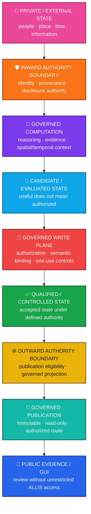
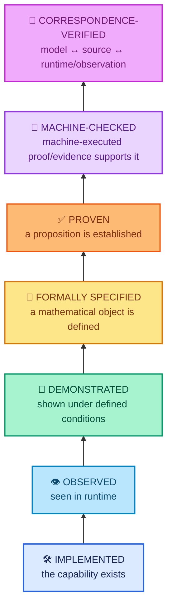

<div align="center">

# ALLIS

### Artificial Learning and Location Intelligence System

**Governed intelligence for understanding state, place, evidence, authority, and change.**

<br>


<br>

**Kidd's Technical Services · West Virginia**

</div>

---

> [!IMPORTANT]
> **The organizing rule of ALLIS is simple:**
>
> # State does not become authority merely because it exists.
>
> ALLIS separates having information, reasoning about information, proving something about information, having authority to act, executing an authorized transition, and publishing an authorized result.

---

# 👀 ALLIS in 30 seconds

ALLIS is a **governed artificial-intelligence and location-intelligence platform**.

It is designed to reason across:

| | State domain | The question ALLIS keeps separate |
|---|---|---|
| 🧠 | **Semantic** | What does this information mean? |
| 📍 | **Geographic** | Where does it apply? |
| ⏱️ | **Temporal** | When is it valid? |
| 👤 | **Person-linked** | Whom does it concern? |
| 🧾 | **Evidence & provenance** | Where did it come from, and how strong is it? |
| 🛡️ | **Authority** | Is this exact transition permitted? |

The platform does **not** assume that access, inference, technical capability, successful computation, or publication automatically creates permission.

```text
available information    ≠ verified information
verified information     ≠ authorized use
identity established     ≠ disclosure authorized
candidate evaluated      ≠ candidate authorized
technically possible     ≠ permitted
implemented              ≠ proven
proven                   ≠ runtime-correspondent
published                ≠ unrestricted backend access
```

---

# 🧭 Choose your path

You do not need to read this README from top to bottom.

| If you want to… | Start here |
|---|---|
| 🌈 **Understand the big idea** | [The authority planes](#-the-authority-planes) |
| 📚 **See the current technical state** | [`CURRENT.md`](CURRENT.md) |
| 🧩 **See how the qualified objects fit together** | [`acceptance/current-system-manifest.md`](acceptance/current-system-manifest.md) |
| 🗂️ **Find the correct qualified object** | [`acceptance/baseline-object-registry.md`](acceptance/baseline-object-registry.md) |
| 🧪 **Understand what “proven” means here** | [Validation ladder](#-the-validation-ladder) |
| 🟪 **Review the three Lean workstreams** | [Formal verification](#-formal-verification) |
| 💬 **Understand the conversational front door** | [Current conversational production state](#-current-conversational-production-state) |
| 🧭 **Understand Hilbert/JCP separation** | [Current JCP and Hilbert boundary](#-current-jcp-and-hilbert-boundary) |
| 🛡️ **Understand privacy and protected state** | [The inward boundary](#-the-inward-boundary-private-and-person-linked-state) |
| 🔐 **Understand governed system change** | [The governed write plane](#-the-governed-write-plane) |
| 🌐 **Understand governed publication** | [The governed read plane](#-the-governed-read-plane) |
| 🔗 **Understand model → source → runtime** | [`correspondence/README.md`](correspondence/README.md) |
| 🧾 **Audit the evidence** | [`evidence/README.md`](evidence/README.md) |
| 🛣️ **See what comes next** | [`architecture/roadmap/post-conversational-qualification-roadmap.md`](architecture/roadmap/post-conversational-qualification-roadmap.md) |

---

# 🌈 The authority planes

ALLIS is easier to understand as a set of **governed state transitions** than as a list of software services.


```mermaid
flowchart TB
    A["👤 PRIVATE / EXTERNAL STATE<br/>people · place · time · information"]:::private

    B["🛡️ INWARD AUTHORITY BOUNDARY<br/>identity · provenance · disclosure authority"]:::boundary

    C["🧠 GOVERNED COMPUTATION<br/>reasoning · evidence · spatial/temporal context"]:::compute

    D["🧪 CANDIDATE / EVALUATED STATE<br/>useful does not mean authorized"]:::candidate

    E["🔐 GOVERNED WRITE PLANE<br/>authorization · semantic binding · one-use controls"]:::write

    F["✅ QUALIFIED / CONTROLLED STATE<br/>accepted state under defined authority"]:::qualified

    G["🌐 OUTWARD AUTHORITY BOUNDARY<br/>publication eligibility · governed projection"]:::boundary2

    H["📣 GOVERNED PUBLICATION<br/>immutable · read-only · authorized route"]:::publication

    I["🔎 PUBLIC EVIDENCE / GUI<br/>review without unrestricted ALLIS access"]:::public

    A --> B --> C --> D --> E --> F --> G --> H --> I

    classDef private fill:#ec4899,stroke:#9d174d,color:#ffffff,stroke-width:2px;
    classDef boundary fill:#f97316,stroke:#9a3412,color:#ffffff,stroke-width:2px;
    classDef compute fill:#7c3aed,stroke:#4c1d95,color:#ffffff,stroke-width:2px;
    classDef candidate fill:#0ea5e9,stroke:#075985,color:#ffffff,stroke-width:2px;
    classDef write fill:#ef4444,stroke:#991b1b,color:#ffffff,stroke-width:2px;
    classDef qualified fill:#16a34a,stroke:#14532d,color:#ffffff,stroke-width:2px;
    classDef boundary2 fill:#eab308,stroke:#854d0e,color:#111827,stroke-width:2px;
    classDef publication fill:#14b8a6,stroke:#115e59,color:#ffffff,stroke-width:2px;
    classDef public fill:#2563eb,stroke:#1e3a8a,color:#ffffff,stroke-width:2px;
```

### In plain English

> **Can the system see this?**  
> is not the same as  
> **May the system use this?**

> **Can the system generate this change?**  
> is not the same as  
> **May the system apply this change?**

> **Does qualified state exist internally?**  
> is not the same as  
> **May this state be published publicly?**

Those distinctions are the architecture.

---

# 🧱 Four principles to remember

| Principle | Meaning |
|---|---|
| 🛡️ **State ≠ authority** | Information does not authorize its own use. |
| 🔐 **Capability ≠ permission** | A component that can act is not automatically permitted to act. |
| 🧾 **Evidence ≠ execution authority** | Strong evidence can support a decision without authorizing it. |
| 🔗 **Correspondence ≠ permanence** | A runtime that matched a qualified source once must be revalidated after claim-bearing change. |

> [!NOTE]
> ALLIS does not try to turn every uncertainty into a binary “yes/no.”
>
> A governed result can also be **withheld, unavailable, degraded, unresolved, rejected, or not applicable**.

---

# 🪜 The validation ladder

Not every ALLIS claim has the same validation status.


```mermaid
flowchart BT
    A["🛠️ IMPLEMENTED<br/>the capability exists"]:::l1
    B["👁️ OBSERVED<br/>seen in runtime"]:::l2
    C["🧪 DEMONSTRATED<br/>shown under defined conditions"]:::l3
    D["📐 FORMALLY SPECIFIED<br/>a mathematical object is defined"]:::l4
    E["✅ PROVEN<br/>a proposition is established"]:::l5
    F["🤖 MACHINE-CHECKED<br/>machine-executed proof/evidence supports it"]:::l6
    G["🔗 CORRESPONDENCE-VERIFIED<br/>model ↔ source ↔ runtime/observation"]:::l7

    A --> B --> C --> D --> E --> F --> G

    classDef l1 fill:#dbeafe,stroke:#2563eb,color:#172554,stroke-width:2px;
    classDef l2 fill:#bae6fd,stroke:#0284c7,color:#0c4a6e,stroke-width:2px;
    classDef l3 fill:#a7f3d0,stroke:#059669,color:#064e3b,stroke-width:2px;
    classDef l4 fill:#fde68a,stroke:#d97706,color:#78350f,stroke-width:2px;
    classDef l5 fill:#fdba74,stroke:#ea580c,color:#7c2d12,stroke-width:2px;
    classDef l6 fill:#e9d5ff,stroke:#9333ea,color:#581c87,stroke-width:2px;
    classDef l7 fill:#f0abfc,stroke:#c026d3,color:#701a75,stroke-width:2px;
```

```text
implemented
    ≠
observed
    ≠
demonstrated
    ≠
formally specified
    ≠
proven
    ≠
machine-checked
    ≠
correspondence-verified
```

The historical Step-12 record and the later Lean proof-assistant workstreams are therefore kept separate.

---

# 🟪 Three first-class Lean workstreams

The current repository contains three distinct first-class Lean qualification workstreams.

```text
R1 — Authorized Production Adoption

R2 — Conversational Admission

R3 — Hilbert/JCP Separation
```

Their bounded named principal checks total:

```text
R1 = 4
R2 = 6
R3 = 14

TOTAL = 24
```

Preserve:

```text
24 named principal checks
    ≠
whole-system proof
```

All three workstreams closed with zero proof holes in their final qualified states.

---

# 🟪 Lean R1 — Authorized Production Adoption

R1 is the proof-assistant successor layer over the historical Step-12 authorized-adoption formal record.

Qualified branch:

```text
formal-verification/lean-authorized-adoption-r1
```

Final local metadata HEAD:

```text
beceb3ee44fd5c33eaf689a5abe086e5e9c67911
```

Qualified proof commit:

```text
71ee78982c918145ca73850170a4c2a8a447170d
```

The four principal results are:

```text
T12D-A
T12D-B
T12D-C
P12C-09
```

Final proof-assistant state:

```text
LEAN_CLEAN_BUILD=PASS
LEAN_PROOF_HOLES=0
```

Lean `#print axioms` reported no theorem-level axiom dependencies for the qualified principal results.

R1 preserves the negative result:

```text
P12C-09 = DISPROVEN
```

The historical R1 closeout remains historically true to its own boundary, including its original statement that direct Lean-to-production correspondence had not yet been established at that close.

See:

- [`formal-verification/authorized-adoption/lean/workstream-closeout-r1.md`](formal-verification/authorized-adoption/lean/workstream-closeout-r1.md)
- [`formal-verification/authorized-adoption/theorem-registry.md`](formal-verification/authorized-adoption/theorem-registry.md)
- [`formal-verification/authorized-adoption/counterexample-registry.md`](formal-verification/authorized-adoption/counterexample-registry.md)

---

# 🟪 Lean R2 — Conversational Admission

R2 formalizes bounded ordinary conversational-admission semantics.

Qualified branch:

```text
formal-verification/lean-conversational-admission-r2
```

HEAD:

```text
c1a18b2e5fbe2e288d8b91dafe18668392bc787d
```

Tree:

```text
e325bfdd78cd6903dbfb3a8c15130af26de5cd9f
```

Final state:

```text
PRINCIPAL_CHECKS=6_OF_6
KERNEL_CHECKED=6_OF_6
PROOF_HOLES=0
FINAL_THEOREM_LEVEL_AXIOM_DEPENDENCIES=0_OF_6
FINAL_PROPEXT_DEPENDENCIES=0_OF_6
```

The theorem family is:

```text
TCHAT_A_server_derived_authenticated_identity

TCHAT_B_browser_identity_is_nonauthoritative

TCHAT_C_canonical_scalar_user_id_not_invented

TCHAT_D_distinct_authenticated_sessions_remain_identity_isolated

TCHAT_E_ordinary_chat_does_not_create_governance_authority

TCHAT_F_ordinary_chat_does_not_authorize_hpeople_secret_disclosure
```

The initial `6/6` `propext` dependency state failed qualification.

The final direct proof repair removed those dependencies without changing the intended R2 claims.

See:

- [`formal-verification/conversational-admission/theorem-registry.md`](formal-verification/conversational-admission/theorem-registry.md)
- [`formal-verification/conversational-admission/model-to-source.md`](formal-verification/conversational-admission/model-to-source.md)
- [`formal-verification/conversational-admission/workstream-closeout-r2.md`](formal-verification/conversational-admission/workstream-closeout-r2.md)
- [`evidence/conversational-admission/r2-qualification.md`](evidence/conversational-admission/r2-qualification.md)
- [`correspondence/conversational-admission/source-to-runtime.md`](correspondence/conversational-admission/source-to-runtime.md)
- [`acceptance/closeout/lean-conversational-admission-r2-close.md`](acceptance/closeout/lean-conversational-admission-r2-close.md)

---

# 🟪 Lean R3 — Hilbert/JCP Separation

R3 formalizes the bounded **current** separation between static Hilbert/state-domain qualification and the current Judge Context Packet.

Qualified branch:

```text
formal-verification/hilbert-jcp-separation-r3
```

HEAD:

```text
6f4a7de303e2d80c3d94a28a8d82e696387bf4b2
```

Tree:

```text
f5ffcb3fd693cbed60c1bd9dc966f868472707d4
```

Final state:

```text
FINAL_CHECKS=14_OF_14
KERNEL_CHECKED=14_OF_14
PROOF_HOLES=0
FINAL_THEOREM_LEVEL_AXIOM_DEPENDENCIES=0_OF_14
FINAL_PROPEXT_DEPENDENCIES=0_OF_14
```

The initial formulation had:

```text
propext = 11/14
```

and therefore did not qualify.

The final computational/Bool-oriented formulation preserved the architectural claims and removed those theorem-level dependencies.

See:

- [`formal-verification/hilbert-jcp-separation/theorem-registry.md`](formal-verification/hilbert-jcp-separation/theorem-registry.md)
- [`formal-verification/hilbert-jcp-separation/model-to-source.md`](formal-verification/hilbert-jcp-separation/model-to-source.md)
- [`formal-verification/hilbert-jcp-separation/workstream-closeout-r3.md`](formal-verification/hilbert-jcp-separation/workstream-closeout-r3.md)
- [`evidence/hilbert-jcp-separation/r3-qualification.md`](evidence/hilbert-jcp-separation/r3-qualification.md)
- [`correspondence/hilbert-jcp-separation/source-to-runtime.md`](correspondence/hilbert-jcp-separation/source-to-runtime.md)
- [`acceptance/closeout/lean-hilbert-jcp-separation-r3-close.md`](acceptance/closeout/lean-hilbert-jcp-separation-r3-close.md)

---

# 🧩 ALLIS is not one source commit

The present technical record cannot be truthfully represented by naming one Git commit and calling it “ALLIS.”

Different qualified objects answer different questions.


```mermaid
flowchart TB
    F["✅ Workstream F<br/>qualified baseline<br/>65b9f7db…"]:::base
    A["📐 A5<br/>proof/source anchor<br/>35f1aa55…"]:::proof
    D["🔐 Step 12<br/>production DGM source<br/>20c8cbe1…"]:::dgm

    R1["🟪 Lean R1<br/>authorized adoption"]:::lean
    R2["🟪 Lean R2<br/>conversational admission"]:::lean
    R3["🟪 Lean R3<br/>Hilbert/JCP separation"]:::lean

    FE["💬 Current frontend<br/>production cutover"]:::runtime
    GW["🚪 Unified Gateway<br/>production cutover"]:::runtime

    P["🌐 Step 17<br/>publication reference set"]:::pub

    X["🧾 CURRENT TECHNICAL RECORD<br/>composite qualified-object + correspondence graph"]:::current

    F --> X
    A --> X
    D --> X
    R1 --> X
    R2 --> X
    R3 --> X
    FE --> X
    GW --> X
    P --> X

    classDef base fill:#22c55e,stroke:#166534,color:#ffffff,stroke-width:2px;
    classDef proof fill:#8b5cf6,stroke:#5b21b6,color:#ffffff,stroke-width:2px;
    classDef dgm fill:#ef4444,stroke:#991b1b,color:#ffffff,stroke-width:2px;
    classDef lean fill:#ddd6fe,stroke:#7c3aed,color:#3b0764,stroke-width:2px;
    classDef runtime fill:#bae6fd,stroke:#0284c7,color:#0c4a6e,stroke-width:2px;
    classDef pub fill:#14b8a6,stroke:#115e59,color:#ffffff,stroke-width:2px;
    classDef current fill:#f59e0b,stroke:#92400e,color:#111827,stroke-width:3px;
```

Current object entry points:

- [`acceptance/baseline-object-registry.md`](acceptance/baseline-object-registry.md)
- [`acceptance/current-system-manifest.md`](acceptance/current-system-manifest.md)
- [`acceptance/qualified-baseline/README.md`](acceptance/qualified-baseline/README.md)

---

# 📊 Current technical dashboard

A closed workstream is not the same thing as a proven whole system.

| Scope | State | What the record supports |
|---|---|---|
| 🟢 **Workstream F** | **CLOSED** | F1–F5 closed; historical qualified baseline preserved |
| 🟠 **DGM Step 12** | **GREEN CLOSED WITH EXPLICIT RESIDUALS** | Bounded authorized-adoption model and correspondence |
| 🟪 **Lean R1** | **CLOSED / PASS** | Principal Step-12 theorem/disproof set independently kernel-checked |
| 🟪 **Lean R2** | **CLOSED / PASS** | 6/6 Conversational Admission checks |
| 🟪 **Lean R3** | **CLOSED / PASS** | 14/14 current Hilbert/JCP Separation checks |
| 🔐 **Auth/Guardian install** | **QUALIFIED INSTALL** | Versioned install + rollback sealing; install closeout itself did not activate runtime |
| 💬 **Frontend** | **PRODUCTION CUTOVER PASS** | Current conversational frontend identified and deployed |
| 🚪 **Unified Gateway** | **PRODUCTION CUTOVER PASS** | Qualified Gateway source became production source |
| 🧠 **Gateway → synthesis** | **QUALIFIED OBSERVED** | Gateway → BBB → `llm20production` → LM Synthesizer → response |
| 🌐 **Publication Step 17** | **GREEN COMPLETE** | Governed publication endpoint and portal fixed-goal close |
| 🟡 **Browser E2E** | **NOT YET DEMONSTRATED** | Current browser send surface remains separately incomplete |
| ⚪ **Whole-system proof** | **NOT CLAIMED** | `SYSTEM_PROVEN=NO` |

---

# 💬 Current conversational production state

The current ordinary browser-facing server route is:

```text
/api/chat
```

Preserve:

```text
/chatlight
    ≠
canonical ordinary route
```

and:

```text
/api/chat/async
    ≠
ordinary /api/chat route
```

The current qualified observed server-side downstream path is:

```text
Unified Gateway
    ↓
BBB
    ↓
llm20production
    ↓
LM Synthesizer
    ↓
response
```

The corrected Unified Gateway production cutover recorded:

```text
PRODUCTION_CUTOVER=PASS

FROZEN_RUNTIME_CONTRACT=PASS

HTTP_READINESS=PASS

REAL_CHAT_REQUEST=PASS

BBB_COMPLETE=PASS

ENSEMBLE_COMPLETE=PASS

LM_SYNTHESIZER_COMPLETE=PASS
```

See:

- [`architecture/conversational-frontdoor/conversational-frontdoor-boundary.md`](architecture/conversational-frontdoor/conversational-frontdoor-boundary.md)
- [`evidence/conversational-frontdoor/current-production-state.md`](evidence/conversational-frontdoor/current-production-state.md)
- [`correspondence/conversational-path/gateway-to-synthesis.md`](correspondence/conversational-path/gateway-to-synthesis.md)

---

# 🔐 Conversational identity boundary

The current R2 source/runtime correspondence preserves:

```text
authenticated_user = server-derived

browser identity-like content = non-authoritative

user_id = null
where no canonical scalar identity is separately established
```

and:

```text
Gateway accepts authenticated_user

process_unified does not read authenticated_user

authenticated_user does not enter current JCP

authenticated_user does not become downstream model input

authenticated_user does not create governance authority
```

Ordinary authenticated conversation therefore remains distinct from governance authority and H_people SECRET disclosure authority.

---

# 🟡 Browser E2E remains separate

The durable server/UI-boundary closeout recorded:

```text
CURRENT_BROWSER_CONVERSATIONAL_UI_READY=NO

CURRENT_BROWSER_CONVERSATIONAL_SEND_SURFACE=NO

AUTHENTICATED_BROWSER_CHAT_E2E=NOT_EXECUTABLE_CURRENT_UI
```

Therefore:

```text
SERVER_SIDE_CONVERSATIONAL_PATH_QUALIFIED=YES

BROWSER_E2E_DEMONSTRATED=NO
```

A future browser closeout must exercise the actual user-facing production flow:

```text
browser send surface
    ↓
authenticated session
    ↓
/api/chat
    ↓
Unified Gateway
    ↓
BBB
    ↓
llm20production
    ↓
LM Synthesizer
    ↓
browser-visible response
```

Do not retroactively call the current server-side qualification a browser E2E result.

---

# 🧭 Current JCP and Hilbert boundary

The current JCP builder is:

```text
build_judge_context_v2
```

Its exact current top-level field set is:

```text
schema_version

request_context

approved_evidence

wv_deliberative_context
```

Current field count:

```text
4
```

Current Hilbert/tensor/spatial top-level field count:

```text
0
```

Current R3 admission state:

```text
H_GEO_CURRENT_JCP_ADMISSION=NO

H_P_CURRENT_JCP_ADMISSION=NO

H_PEOPLE_CURRENT_JCP_ADMISSION=NO
```

while:

```text
STATIC_H_GEO_PATH_QUALIFIED=YES
```

Preserve:

```text
static H_geo qualification
    ≠
live H_geo JCP admission
```

---

# 📐 H384 and typed projections

The current architecture has a planned common mathematical carrier:

```text
H384 := Fin 384 -> Real
```

The current safe classification of named H_* objects is:

```text
governed typed projection / view / architectural state domain
```

until stronger closure/subspace properties are separately proved.

Preserve:

```text
shared 384-D carrier
    ≠
named H_* linear-subspace proof
```

Current status:

```text
H384_FORMALIZATION_COMPLETE=NO
```

See:

- [`architecture/state-models/hilbert-qualification-plan.md`](architecture/state-models/hilbert-qualification-plan.md)
- [`architecture/state-models/h384-formalization-plan.md`](architecture/state-models/h384-formalization-plan.md)
- [`architecture/state-models/hilbert-projection-interfaces.md`](architecture/state-models/hilbert-projection-interfaces.md)

---

# 🧠 Cognition rejoin

The intended cognition composition/rejoin path is:

```text
prefrontal_result
+
icontainers_result
+
psychology_result
    ↓
cognition stage
    ↓
cognition evaluate
    ↓
cognition emit
    ↓
llm_packet
    ↓
Gateway / JCP
    ↓
ensemble
    ↓
LM Synthesizer
```

The current Gateway-to-synthesis path qualifies the downstream side.

It does not yet qualify the complete upstream cognition theorem/correspondence family.

Current status:

```text
COGNITION_THEOREM_FAMILY_COMPLETE=NO
```

See:

[`architecture/cognition/cognition-rejoin-boundary.md`](architecture/cognition/cognition-rejoin-boundary.md)

---

# 🧠 Automated Learning architecture

The intended Automated Learning Graph is:

```text
task / question / system need
    ↓
detect informational insufficiency
    ↓
identify missing information
    ↓
bound research need
    ↓
select permitted source / method
    ↓
retrieve candidate information
    ↓
capture provenance
    ↓
evaluate candidate
    ↓
reject / unresolved / bounded use / admission eligibility
    ↓
separate corpus / H_* admission
```

Permanent distinction:

```text
web result
    ≠
trusted fact
    ≠
admitted corpus state
    ≠
qualified Hilbert state
```

The planned web-research component is read-only on the external side.

The approximately five-minute cadence means:

```text
evaluate pending bounded research needs
```

not:

```text
crawl the web every five minutes
```

Current status:

```text
AUTOMATED_LEARNING_WEB_RESEARCH_QUALIFIED=NO

RESEARCH_TO_CORPUS_INGESTION_QUALIFIED=NO
```

See:

- [`architecture/automated-learning/automated-learning-graph.md`](architecture/automated-learning/automated-learning-graph.md)
- [`architecture/automated-learning/read-only-web-research.md`](architecture/automated-learning/read-only-web-research.md)
- [`architecture/automated-learning/research-to-corpus-ingestion.md`](architecture/automated-learning/research-to-corpus-ingestion.md)

---

# 👤 The inward boundary: private and person-linked state

H_people is tiered:

```text
SECRET
PRIVATE
PUBLIC
```

The ordinary conversational path does not collapse those tiers.

The permanent SECRET identity-correspondence disclosure rule is:

```text
VERIFIED_LEGAL_PROCESS_AUTHORITY
+
permitted disclosure class
+
subject/scope match
+
minimum necessary disclosure
+
receipt
+
immutable audit record
```

Authentication alone is not SECRET disclosure authority.

Precise authoritative identity-linked location remains:

```text
KYC / H_people SECRET
```

A future bounded conversational use may derive minimum-necessary context without exposing the raw SECRET source.

Preserve:

```text
location known
    ≠
location disclosed
```

```text
location usable for permitted context
    ≠
location publishable
```

Current qualification:

```text
KYC_LOCATION_CONTEXT_USE_QUALIFIED=NO
```

See:

- [`architecture/private-state/h-people-boundary.md`](architecture/private-state/h-people-boundary.md)
- [`architecture/private-state/kyc-location-conversational-context.md`](architecture/private-state/kyc-location-conversational-context.md)

---

# 🔐 The governed write plane

ALLIS separates **candidate generation** from **authority to change protected state**.


```mermaid
flowchart LR
    A["💡 Candidate<br/>proposed"]:::c1
    B["🧪 Candidate<br/>evaluated"]:::c2
    C["🧾 Exact semantics<br/>committed"]:::c3
    D["🛡️ Independent<br/>authorization"]:::c4
    E["🎯 Target + prestate<br/>validated"]:::c5
    F["1️⃣ One-use / replay<br/>controls"]:::c6
    G["🔧 Governed<br/>application"]:::c7
    H["🧾 Durable<br/>receipt"]:::c8

    A --> B --> C --> D --> E --> F --> G --> H

    classDef c1 fill:#bfdbfe,stroke:#2563eb,color:#172554,stroke-width:2px;
    classDef c2 fill:#a5f3fc,stroke:#0891b2,color:#164e63,stroke-width:2px;
    classDef c3 fill:#ddd6fe,stroke:#7c3aed,color:#3b0764,stroke-width:2px;
    classDef c4 fill:#fecaca,stroke:#dc2626,color:#7f1d1d,stroke-width:2px;
    classDef c5 fill:#fed7aa,stroke:#ea580c,color:#7c2d12,stroke-width:2px;
    classDef c6 fill:#fde68a,stroke:#ca8a04,color:#713f12,stroke-width:2px;
    classDef c7 fill:#bbf7d0,stroke:#16a34a,color:#14532d,stroke-width:2px;
    classDef c8 fill:#99f6e4,stroke:#0f766e,color:#134e4a,stroke-width:2px;
```

```text
candidate
    ≠
authorization
```

```text
evaluation
    ≠
adoption authority
```

```text
capability to apply
    ≠
authority to create the authorization being verified
```

The historical Step-12 formal object remains:

```text
DGM_PRODUCTION_AUTHORIZED_ADOPTION_MODEL_V1
```

with:

```text
GREEN_CLOSED_WITH_EXPLICIT_RESIDUALS
```

and:

```text
12 propositions
11 proven
1 disproven
0 unadjudicated
```

---

# 🌐 The governed read plane

ALLIS also governs the opposite direction:

```text
qualified internal state
    ↓
publication eligibility
    ↓
governed projection
    ↓
immutable publication
    ↓
read-only service boundary
    ↓
authorized public route
    ↓
public presentation
```

Preserve:

```text
qualified internally
    ≠
publication eligible
    ≠
published
    ≠
publicly routed
    ≠
unrestricted backend access
```

The sealed Step-17 workstream remains:

```text
ALL_STEPS_0_THROUGH_17=GREEN

FINAL_CRITERIA=25_OF_25_PASS

FINAL_NETWORK_CONTINUITY=GREEN

OVERALL_GOAL=GREEN_COMPLETE
```

This historical publication close remains distinct from the later conversational frontend work.

---

# 🔗 Correspondence

A formal model can be correct mathematics while describing the wrong source.

The source can be correct while a runtime is running different bytes.

Matching bytes can exist while the claim-specific behavior has not been observed.

ALLIS therefore records correspondence explicitly.

The current correspondence layer includes:

```text
authorized-adoption/
    Step-12 model → source → runtime

conversational-admission/
    R2 identity/admission source → runtime

hilbert-jcp-separation/
    R3 JCP/static-H_geo source → runtime

conversational-path/
    Gateway → BBB → llm20production → LM Synthesizer

publication/
    qualified state → publication → HTTP → GUI
```

See:

[`correspondence/README.md`](correspondence/README.md)

Correspondence remains point-in-time.

```text
corresponded now
    ≠
guaranteed to correspond forever
```

---

# 🔄 Rollback remains part of the production boundary

The current Gateway production cutover retained rollback.

Current Gateway rollback state:

```text
STOPPED_RETAINED
```

Rollback retirement:

```text
AUTHORIZED=NO
```

Auth/Guardian qualification likewise preserved rollback.

Preserve:

```text
rollback retained
    ≠
production cutover failed
```

Rollback is a safety mechanism, not a contradiction of successful cutover.

---

# 🚦 Fail-closed does not mean only one thing

ALLIS distinguishes several safe non-success states.

| State | Meaning |
|---|---|
| ⛔ **BLOCKED / DENIED** | The requested transition is prohibited. |
| 🔒 **WITHHELD / NOT_AUTHORIZED** | State may exist, but authority for this use/disclosure is absent. |
| 📴 **UNAVAILABLE** | A required dependency or qualified state cannot currently be reached. |
| 🟡 **GOVERNED_DEGRADED** | A bounded reduced mode is allowed without pretending full operation. |
| ❓ **UNRESOLVED** | Required evidence or authority has not yet been adjudicated. |
| ➖ **NOT_APPLICABLE** | The transition or lane does not apply to this request. |

> **Missing authority must never be silently converted into permission.**

See:

[`architecture/fail-closed-semantics.md`](architecture/fail-closed-semantics.md)

---

# 🧩 ALLIS, Ms. Allis, and MountainShares are separate systems

The repository uses these names deliberately.

| System | Role |
|---|---|
| 🧩 **ALLIS / allis.pro** | KTS engineering/research platform and general ALLIS conversational system |
| 💬 **Ms. Allis / mountainshares.us** | Separate MountainShares-facing governed advisory intelligence |
| 🏔️ **MountainShares / The Commons** | Separate governance/economic systems |

Do not conflate them.

```text
ALLIS
    ≠
Ms. Allis
```

```text
Ms. Allis
    ≠
MountainShares governance itself
```

A capability exposed through one system does not silently inherit the authority of another.

See:

[`architecture/system-boundary/allis-system-boundary.md`](architecture/system-boundary/allis-system-boundary.md)

---

# 🗺️ Place matters—but a deployment is not ALLIS

ALLIS can support place-aware systems, pilots, community infrastructure, research, and institutional deployments.

Examples such as the New River Gorge Safety & Heritage Mesh Pilot, Mount Hope implementation work, Community Champion development, or future Thurmond phases are deployment and research contexts.

They do not define the ALLIS platform.

> **A deployment instantiates ALLIS. It does not redefine ALLIS.**

Each deployment must establish its own:

- authority;
- privacy requirements;
- infrastructure;
- configuration;
- local data;
- governance;
- operating capacity;
- evidence; and
- acceptance criteria.

See:

[`architecture/deployment-model/deployment-model-overview.md`](architecture/deployment-model/deployment-model-overview.md)

---

# 🛣️ Post-conversational qualification roadmap

The current successor sequence is:

```text
conversational front door
    ↓
Hilbert-by-Hilbert qualification
    ↓
Hilbert <-> Unified Gateway/JCP correspondence
    ↓
H384 / typed projection formalization
    ↓
cognition/rejoin qualification
    ↓
Automated Learning Graph qualification
    ↓
read-only web research
    ↓
research -> corpus/Hilbert admission
    ↓
protected KYC-location conversational context
    ↓
integrated conversational accuracy
    ↓
final DGM completion
```

This sequence is a roadmap.

It is not a declaration that the later phases are already qualified.

See:

[`architecture/roadmap/post-conversational-qualification-roadmap.md`](architecture/roadmap/post-conversational-qualification-roadmap.md)

---

# 📚 Repository map

The repository is a **composite technical record**.

```text
ALLIS/
│
├── CURRENT.md
├── LICENSE
├── README.md
│
├── acceptance/
│   ├── baseline-object-registry.md
│   ├── current-system-manifest.md
│   │
│   ├── closeout/
│   │   ├── README.md
│   │   ├── workstream-f-close.md
│   │   ├── dgm-step12-close.md
│   │   ├── post-a8-dgm-correspondence-close.md
│   │   ├── lean-conversational-admission-r2-close.md
│   │   ├── lean-hilbert-jcp-separation-r3-close.md
│   │   └── publication-step17-close.md
│   │
│   └── qualified-baseline/
│       ├── README.md
│       └── qualified-baseline-manifest.md
│
├── architecture/
│   ├── authority-planes.md
│   ├── fail-closed-semantics.md
│   │
│   ├── automated-learning/
│   │   ├── automated-learning-graph.md
│   │   ├── read-only-web-research.md
│   │   └── research-to-corpus-ingestion.md
│   │
│   ├── cognition/
│   │   └── cognition-rejoin-boundary.md
│   │
│   ├── conversational-frontdoor/
│   │   └── conversational-frontdoor-boundary.md
│   │
│   ├── deployment-model/
│   │   └── deployment-model-overview.md
│   │
│   ├── private-state/
│   │   ├── h-people-boundary.md
│   │   └── kyc-location-conversational-context.md
│   │
│   ├── roadmap/
│   │   └── post-conversational-qualification-roadmap.md
│   │
│   ├── state-models/
│   │   ├── state-model-overview.md
│   │   ├── hilbert-qualification-plan.md
│   │   ├── h384-formalization-plan.md
│   │   └── hilbert-projection-interfaces.md
│   │
│   ├── system-boundary/
│   │   └── allis-system-boundary.md
│   │
│   └── trust-and-authority/
│       └── trust-and-authority-overview.md
│
├── claims/
│   ├── claim-registry.md
│   └── nonclaims-and-residuals.md
│
├── correspondence/
│   ├── README.md
│   ├── authorized-adoption/
│   ├── conversational-admission/
│   │   └── source-to-runtime.md
│   ├── hilbert-jcp-separation/
│   │   └── source-to-runtime.md
│   ├── conversational-path/
│   │   └── gateway-to-synthesis.md
│   └── publication/
│
├── evidence/
│   ├── README.md
│   ├── governed-evolution/
│   ├── conversational-admission/
│   │   └── r2-qualification.md
│   ├── hilbert-jcp-separation/
│   │   └── r3-qualification.md
│   ├── conversational-frontdoor/
│   │   └── current-production-state.md
│   └── publication/
│
├── formal-verification/
│   ├── authorized-adoption/
│   │   └── lean/
│   │       └── workstream-closeout-r1.md
│   ├── conversational-admission/
│   │   ├── model-to-source.md
│   │   ├── theorem-registry.md
│   │   └── workstream-closeout-r2.md
│   └── hilbert-jcp-separation/
│       ├── model-to-source.md
│       ├── theorem-registry.md
│       └── workstream-closeout-r3.md
│
└── research/
    ├── allis-historical-lineage.md
    └── thesis-reconciliation.md
```

The root map intentionally shows the current public repository structure rather than planned files that do not yet exist.

---

# 🧭 How the repository layers relate

```text
CURRENT.md
    =
concise current technical state

acceptance/
    =
qualified objects + composite current state + bounded closeouts

architecture/
    =
system, state, trust, privacy, cognition, research, deployment,
and authority boundaries

claims/
    =
supported claims + explicit nonclaims / residuals

formal-verification/
    =
bounded formal objects + theorem/check status

correspondence/
    =
model/source/runtime/production/publication relationship evidence

evidence/
    =
public-safe qualification and observation packages

research/
    =
historical lineage + thesis reconciliation
```

The governing rule is:

> **Current truth is assembled from qualified objects and explicit correspondence—not from whichever document was written most recently.**

---

# 🔎 Where to go deeper

## Current state

- [`CURRENT.md`](CURRENT.md)
- [`acceptance/current-system-manifest.md`](acceptance/current-system-manifest.md)
- [`acceptance/baseline-object-registry.md`](acceptance/baseline-object-registry.md)

## Acceptance

- [`acceptance/qualified-baseline/README.md`](acceptance/qualified-baseline/README.md)
- [`acceptance/qualified-baseline/qualified-baseline-manifest.md`](acceptance/qualified-baseline/qualified-baseline-manifest.md)
- [`acceptance/closeout/README.md`](acceptance/closeout/README.md)
- [`acceptance/closeout/lean-conversational-admission-r2-close.md`](acceptance/closeout/lean-conversational-admission-r2-close.md)
- [`acceptance/closeout/lean-hilbert-jcp-separation-r3-close.md`](acceptance/closeout/lean-hilbert-jcp-separation-r3-close.md)

## Architecture

- [`architecture/authority-planes.md`](architecture/authority-planes.md)
- [`architecture/fail-closed-semantics.md`](architecture/fail-closed-semantics.md)
- [`architecture/system-boundary/allis-system-boundary.md`](architecture/system-boundary/allis-system-boundary.md)
- [`architecture/trust-and-authority/trust-and-authority-overview.md`](architecture/trust-and-authority/trust-and-authority-overview.md)
- [`architecture/state-models/state-model-overview.md`](architecture/state-models/state-model-overview.md)
- [`architecture/conversational-frontdoor/conversational-frontdoor-boundary.md`](architecture/conversational-frontdoor/conversational-frontdoor-boundary.md)
- [`architecture/private-state/h-people-boundary.md`](architecture/private-state/h-people-boundary.md)
- [`architecture/private-state/kyc-location-conversational-context.md`](architecture/private-state/kyc-location-conversational-context.md)
- [`architecture/cognition/cognition-rejoin-boundary.md`](architecture/cognition/cognition-rejoin-boundary.md)
- [`architecture/roadmap/post-conversational-qualification-roadmap.md`](architecture/roadmap/post-conversational-qualification-roadmap.md)

## Claims

- [`claims/claim-registry.md`](claims/claim-registry.md)
- [`claims/nonclaims-and-residuals.md`](claims/nonclaims-and-residuals.md)

## Formal verification

### R1 — Authorized Production Adoption

- [`formal-verification/authorized-adoption/formal-model.md`](formal-verification/authorized-adoption/formal-model.md)
- [`formal-verification/authorized-adoption/theorem-registry.md`](formal-verification/authorized-adoption/theorem-registry.md)
- [`formal-verification/authorized-adoption/counterexample-registry.md`](formal-verification/authorized-adoption/counterexample-registry.md)
- [`formal-verification/authorized-adoption/lean/workstream-closeout-r1.md`](formal-verification/authorized-adoption/lean/workstream-closeout-r1.md)

### R2 — Conversational Admission

- [`formal-verification/conversational-admission/theorem-registry.md`](formal-verification/conversational-admission/theorem-registry.md)
- [`formal-verification/conversational-admission/model-to-source.md`](formal-verification/conversational-admission/model-to-source.md)
- [`formal-verification/conversational-admission/workstream-closeout-r2.md`](formal-verification/conversational-admission/workstream-closeout-r2.md)

### R3 — Hilbert/JCP Separation

- [`formal-verification/hilbert-jcp-separation/theorem-registry.md`](formal-verification/hilbert-jcp-separation/theorem-registry.md)
- [`formal-verification/hilbert-jcp-separation/model-to-source.md`](formal-verification/hilbert-jcp-separation/model-to-source.md)
- [`formal-verification/hilbert-jcp-separation/workstream-closeout-r3.md`](formal-verification/hilbert-jcp-separation/workstream-closeout-r3.md)

## Correspondence

- [`correspondence/README.md`](correspondence/README.md)
- [`correspondence/authorized-adoption/model-to-source.md`](correspondence/authorized-adoption/model-to-source.md)
- [`correspondence/authorized-adoption/source-to-runtime.md`](correspondence/authorized-adoption/source-to-runtime.md)
- [`correspondence/conversational-admission/source-to-runtime.md`](correspondence/conversational-admission/source-to-runtime.md)
- [`correspondence/hilbert-jcp-separation/source-to-runtime.md`](correspondence/hilbert-jcp-separation/source-to-runtime.md)
- [`correspondence/conversational-path/gateway-to-synthesis.md`](correspondence/conversational-path/gateway-to-synthesis.md)
- [`correspondence/publication/source-to-publication-to-http-to-gui.md`](correspondence/publication/source-to-publication-to-http-to-gui.md)

## Evidence

- [`evidence/README.md`](evidence/README.md)
- [`evidence/conversational-admission/r2-qualification.md`](evidence/conversational-admission/r2-qualification.md)
- [`evidence/hilbert-jcp-separation/r3-qualification.md`](evidence/hilbert-jcp-separation/r3-qualification.md)
- [`evidence/conversational-frontdoor/current-production-state.md`](evidence/conversational-frontdoor/current-production-state.md)
- [`evidence/governed-evolution/post-a8-theorem-correspondence-registry-r1.md`](evidence/governed-evolution/post-a8-theorem-correspondence-registry-r1.md)
- [`evidence/publication/README.md`](evidence/publication/README.md)

## Successor state-model work

- [`architecture/state-models/hilbert-qualification-plan.md`](architecture/state-models/hilbert-qualification-plan.md)
- [`architecture/state-models/h384-formalization-plan.md`](architecture/state-models/h384-formalization-plan.md)
- [`architecture/state-models/hilbert-projection-interfaces.md`](architecture/state-models/hilbert-projection-interfaces.md)

## Automated Learning

- [`architecture/automated-learning/automated-learning-graph.md`](architecture/automated-learning/automated-learning-graph.md)
- [`architecture/automated-learning/read-only-web-research.md`](architecture/automated-learning/read-only-web-research.md)
- [`architecture/automated-learning/research-to-corpus-ingestion.md`](architecture/automated-learning/research-to-corpus-ingestion.md)

## Research

- [`research/allis-historical-lineage.md`](research/allis-historical-lineage.md)
- [`research/thesis-reconciliation.md`](research/thesis-reconciliation.md)

---

# 📖 Research and thesis relationship

The broader ALLIS thesis and research corpus preserve the intellectual development of the system.

They are not the authority for the current implementation state.

The governing direction is:

```text
engineering / qualified implementation
    ↓
acceptance
    ↓
formal qualification
    ↓
correspondence
    ↓
current technical documentation
    ↓
thesis reconciliation
```

The thesis is explanatory/research lineage.

It does not supersede current qualified source/runtime evidence.

See:

- [`research/thesis-reconciliation.md`](research/thesis-reconciliation.md)
- [`research/allis-historical-lineage.md`](research/allis-historical-lineage.md)

---

# ✅ What this repository currently supports

A defensible present description is:

> **ALLIS is a governed artificial-intelligence and location-intelligence platform that separates intelligence, evidence, identity, capability, authority, execution, persistence, and publication rather than treating them as one state.**

The public technical record supports bounded claims including:

- Workstream F closed under its qualified historical baseline;
- Step-12 authorized-adoption formalization closed with explicit residuals;
- Lean R1 kernel qualification of the principal Step-12 theorem/disproof set;
- Lean R2 qualification of six Conversational Admission checks;
- Lean R3 qualification of fourteen current Hilbert/JCP Separation checks;
- 24 named principal Lean checks across R1/R2/R3;
- current bounded R2 source/runtime identity correspondence;
- current bounded R3 four-field JCP/nonadmission correspondence;
- a qualified current frontend production cutover;
- a qualified current Unified Gateway production cutover;
- an observed server-side path through Gateway → BBB → `llm20production` → LM Synthesizer;
- fail-closed unauthenticated conversational/server boundaries;
- retained production rollback;
- static H_geo qualification without live JCP admission;
- preserved H_people SECRET/PRIVATE/PUBLIC distinctions;
- a separately completed governed-publication workstream;
- a 25/25 Step-17 fixed-goal completion matrix;
- direct/public publication-body correspondence; and
- explicit successor plans for H384, cognition, Automated Learning, research admission, KYC-location context, integrated accuracy, and final DGM completion.

---

# ⛔ What this repository does not claim

This repository does **not** claim that:

```text
SYSTEM_PROVEN=YES
```

It does not claim:

```text
PRODUCTION_MUTATION_SAFETY_THEOREM_PROVEN=YES

WHOLE_SYSTEM_SAFETY_THEOREM_PROVEN=YES

BROWSER_E2E_DEMONSTRATED=YES

LIVE_HILBERT_JCP_INTEGRATION_COMPLETE=YES

H384_FORMALIZATION_COMPLETE=YES

COGNITION_THEOREM_FAMILY_COMPLETE=YES

AUTOMATED_LEARNING_WEB_RESEARCH_QUALIFIED=YES

RESEARCH_TO_CORPUS_INGESTION_QUALIFIED=YES

KYC_LOCATION_CONTEXT_USE_QUALIFIED=YES

FULL_DGM_COMPLETION_CLAIMED=YES
```

It also does not claim that:

- every ALLIS subsystem has been mathematically modeled;
- every architectural path has current runtime correspondence;
- all production mutation is universally safe;
- runtime correspondence can never drift;
- every private-state path has been correspondence-verified;
- a valid signature alone is sufficient authorization;
- an evaluated candidate can promote itself;
- a published object grants unrestricted access to internal ALLIS state;
- a web result automatically becomes trusted or persistent knowledge;
- a named H_* architecture object is automatically a mathematical linear subspace;
- successful conversational synthesis creates governance authority;
- successful conversational synthesis creates persistent learning;
- ALLIS is equivalent to a canonical open-ended Darwin Gödel Machine;
- ALLIS is artificial general intelligence; or
- a deployment program defines the ALLIS platform.

---

# 🧠 Seven sentences that explain ALLIS

> **1. State does not become authority merely because it exists.**

> **2. Capability does not create permission.**

> **3. A protected transition requires authority for that transition.**

> **4. Authority itself has provenance.**

> **5. A claim may advance only as far as its evidence and correspondence support.**

> **6. A closed bounded workstream does not imply whole-system proof.**

> **7. Current truth is assembled from qualified objects and explicit correspondence—not from whichever document was written most recently.**

---

<div align="center">

## Kidd's Technical Services

**ALLIS is an active research and engineering program.**

The purpose of this repository is not to make ALLIS appear more complete than the evidence supports.

The purpose is to make clear:

### **what ALLIS is · what has been established · what has been observed · what has been proved · what remains bounded · and what authority governs the transitions between those states**

<br>

# `SYSTEM_PROVEN=NO`

</div>
