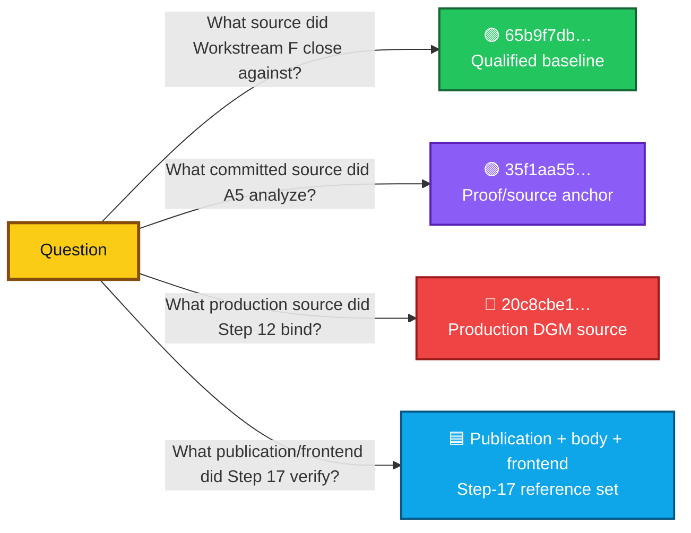
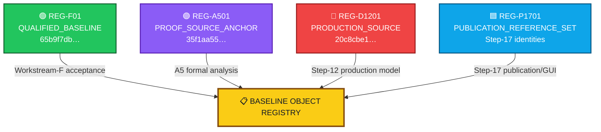
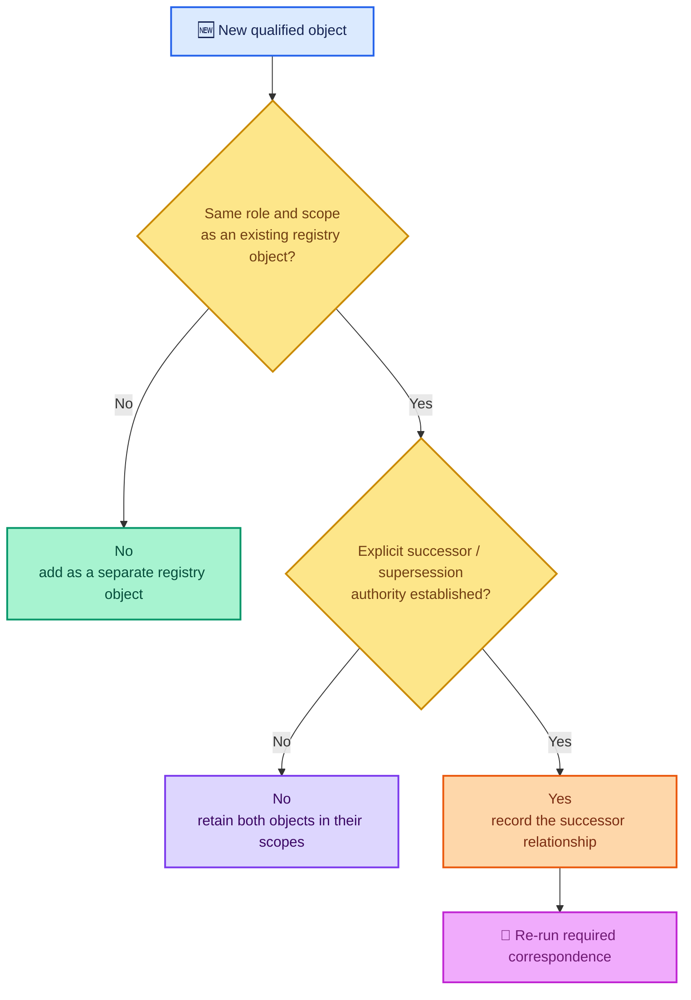
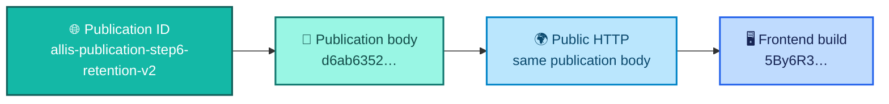

<div align="center">

# ALLIS — Baseline Object Registry

### Qualified reference objects for bounded ALLIS workstreams

**Acceptance registry · September 2026**

<br>


<br>

**Kidd’s Technical Services · ALLIS**

</div>

---

> [!IMPORTANT]
> The useful question is not **“What is the ALLIS baseline?”**
>
> The useful question is:
>
> # **Baseline for what scope, claim, and workstream?**
>
> ALLIS uses different qualified reference objects for acceptance, formal analysis, production correspondence, and public publication. This registry keeps those roles separate.

---

# 👀 Registry at a glance

| Registry object | Identity | Primary role | Bounded scope |
|---|---|---|---|
| 🟢 **Workstream-F qualified baseline** | `65b9f7dbd594ec9d225152aabd705eefc9216dbb` | Acceptance/source baseline | Workstream F |
| 🟣 **A5 proof/source anchor** | `35f1aa5586e1a23e1ab88f4d757c451b44506893` | Formal-analysis source anchor | A5 / A5A mathematical audit |
| 🔴 **Step-12 production DGM source** | `20c8cbe175781c8a1c05d65c03977859ceca884a` | Production formal/correspondence source | DGM Step 12 |
| 🟦 **Step-17 publication set** | `allis-publication-step6-retention-v2` · `d6ab6352…` · `5By6R3…` | Public publication/runtime reference set | Publication Step 17 |

### One sentence to remember

> **These objects are related parts of the current technical record, but none silently replaces another.**

---

# 🧭 Why this registry exists

A conventional software project can often identify one commit or release tag as “the current version.”

ALLIS has several bounded workstreams with different evidence requirements.

That creates several legitimate reference objects:



The correct reference depends on the question.

---

# 🏷️ Registry vocabulary

This registry uses four primary roles.

| Role | Definition | What it is for |
|---|---|---|
| `QUALIFIED_BASELINE` | Source object formally admitted for a bounded acceptance state | Acceptance and closeout |
| `PROOF_SOURCE_ANCHOR` | Committed source object used to anchor bounded formal analysis | Formalization and proof-domain identity |
| `PRODUCTION_SOURCE` | Production implementation identity used by a bounded formal/correspondence package | Production theorem and correspondence |
| `PUBLICATION_REFERENCE_SET` | Publication, publication-body, and frontend identities observed at a bounded public closeout | Public evidence and GUI correspondence |

These roles are **not a ranking**.

```text
QUALIFIED_BASELINE
    ≠
PROOF_SOURCE_ANCHOR
    ≠
PRODUCTION_SOURCE
    ≠
PUBLICATION_REFERENCE_SET
```

Each answers a different technical question.

---

# 🧩 Baseline object map



This registry does not create new equivalence among the objects.

It records their distinct roles in one place.

---

# 📋 Registry index

| Registry ID | Role | Primary identity | Supporting identity | Current state |
|---|---|---|---|---|
| `REG-F01` | `QUALIFIED_BASELINE` | `65b9f7dbd594ec9d225152aabd705eefc9216dbb` | tag `stage10-auth-identity-65b9f7dbd594` | **Workstream F CLOSED** |
| `REG-A501` | `PROOF_SOURCE_ANCHOR` | `35f1aa5586e1a23e1ab88f4d757c451b44506893` | tree `36dd9f2425db4b23bacfce1cb258603cace25f1b` | **Qualified bounded anchor** |
| `REG-D1201` | `PRODUCTION_SOURCE` | `20c8cbe175781c8a1c05d65c03977859ceca884a` | Step-12 final seal `b00a954a…` | **GREEN_CLOSED_WITH_EXPLICIT_RESIDUALS** |
| `REG-P1701` | `PUBLICATION_REFERENCE_SET` | `allis-publication-step6-retention-v2` | body `d6ab6352…` · frontend `5By6R3…` | **GREEN COMPLETE at final Step-17 seal** |

---

# 🟢 `REG-F01` — Workstream-F qualified baseline

<div align="center">


</div>

## Identity

```text
Branch:
remediation/active-source-baseline-20260902

HEAD:
65b9f7dbd594ec9d225152aabd705eefc9216dbb

Tag:
stage10-auth-identity-65b9f7dbd594
```

## Purpose

`REG-F01` answers:

> **Which source object was qualified for the formal Workstream-F close?**

## Current role

Workstream F closed with:

```text
F1 = CLOSED
F2 = CLOSED
F3 = CLOSED
F4 = CLOSED
F5 = CLOSED

proofs = 5 / 5

WORKSTREAM_F_STATUS = CLOSED
```

`REG-F01` is therefore the **qualified acceptance baseline** for that close.

## What this baseline supports

- identification of the Workstream-F qualified source;
- Workstream-F acceptance provenance;
- the formal F1–F5 close state;
- the 5/5 proof closeout record.

## What this baseline does not do

It does not automatically identify:

- the committed source used by the later A5 formalization;
- the production source used by the Step-12 DGM model;
- the publication body used by Step 17;
- the complete current ALLIS runtime.

### Registry rule

```text
REG-F01
    =
Workstream-F qualified baseline
```

not:

```text
REG-F01
    =
every later ALLIS source object
```

---

# 🟣 `REG-A501` — A5 proof/source anchor

<div align="center">


</div>

## Identity

```text
HEAD:
35f1aa5586e1a23e1ab88f4d757c451b44506893

Tree:
36dd9f2425db4b23bacfce1cb258603cace25f1b
```

## Purpose

`REG-A501` answers:

> **Which committed source object anchors the bounded A5 formal and wiring analysis?**

## Current role

The A5 tract uses this source object to freeze and analyze a bounded source domain.

The associated formal work includes:

- protected-root/domain analysis;
- qualified root/component binding;
- intraprocedural CFG construction;
- effect-candidate analysis;
- later A5/A5A successor analysis.

## What this anchor supports

- identification of the source object used by the A5 bounded analysis;
- reproducible reference to the committed source tree;
- formal-domain provenance.

## What this anchor does not do

`REG-A501` is **not** a silent replacement for `REG-F01`.

It is also not automatically equivalent to the Step-12 production source.

```text
REG-F01
    ≠ automatically
REG-A501
```

```text
REG-A501
    ≠ automatically
REG-D1201
```

A stronger equivalence statement requires explicit source correspondence.

---

# 🔴 `REG-D1201` — Step-12 production DGM source

<div align="center">


</div>

## Identity

```text
20c8cbe175781c8a1c05d65c03977859ceca884a
```

## Purpose

`REG-D1201` answers:

> **Which production source object does the bounded Step-12 authorized-adoption formal and correspondence package describe?**

## Formal object

```text
DGM_PRODUCTION_AUTHORIZED_ADOPTION_MODEL_V1
```

## Current role

The Step-12 package uses this production source identity for its bounded:

- state-transition model;
- authorization predicates;
- theorem adjudication;
- model-to-source correspondence;
- source-to-runtime correspondence;
- trust correspondence;
- governance correspondence.

The sealed Step-12 source domain contains:

```text
11 governed production source files
```

## Step-12 close

```text
12 propositions

11 proven
1 disproven
0 unadjudicated
```

Principal results:

| Proposition | State |
|---|---|
| `T12D-A` | 🤖 `MACHINE_CHECKED` |
| `T12D-B` | 🔗 `CORRESPONDENCE_VERIFIED` |
| `T12D-C` | 🔗 `CORRESPONDENCE_VERIFIED` |
| `P12C-09` | 🔴 `MACHINE_CHECKED_DISPROVEN` |

Final Step-12 seal:

```text
b00a954a924d3aa3490a5bcb8d4473da2b6885b8c41e116cf03545fee975c23b
```

## What this source supports

- the bounded Step-12 production authorized-adoption model;
- the sealed 11-file production source domain;
- Step-12 model-to-source correspondence;
- Step-12 source-to-runtime correspondence;
- the associated theorem and residual records.

## What this source does not do

`REG-D1201` does not identify every ALLIS subsystem.

It does not automatically replace:

```text
REG-F01
```

or:

```text
REG-A501
```

Those objects remain authoritative for their own bounded roles.

---

# 🟦 `REG-P1701` — Step-17 publication reference set

<div align="center">


</div>

## Purpose

`REG-P1701` answers:

> **Which publication and frontend identities define the final Step-17 governed-publication observation?**

Unlike the source-oriented registry objects, Step 17 is represented by a **reference set**.

## Publication identity

```text
Publication ID:
allis-publication-step6-retention-v2
```

## Publication body

```text
SHA-256:
d6ab63522f9080fae440578ebbb6ed42140595155c9a30253f5b8eeeef8009b7
```

## Frontend build

```text
5By6R3CWTM7NDXc-4lmSi
```

## Current role

These identities support the final Step-17 governed-publication state:

```text
Steps 0–17:
GREEN

Completion criteria:
25 / 25 PASS

Final network continuity:
GREEN

ALLIS_LIVE_PUBLICATION_ENDPOINT:
COMPLETE

ALLIS_EVIDENCE_GOVERNANCE_PORTAL:
LIVE at final sealed observation
```

## What this reference set supports

- the identity of the governed publication;
- immutable publication-body identity;
- direct/public body correspondence;
- the frontend build observed during final GUI continuity;
- the Step-17 fixed-goal closeout.

## What this reference set does not do

The publication reference set is not a Git source baseline.

It does not identify:

- the Workstream-F source;
- the A5 formalization source;
- the Step-12 production DGM source;
- the complete ALLIS runtime.

### Registry rule

```text
publication/runtime reference
    ≠
source-code baseline
```

---

# 🔍 Which object should a reviewer use?

| Reviewer question | Use this registry object |
|---|---|
| Which source did Workstream F formally close against? | 🟢 `REG-F01` |
| Which committed source anchors the A5 formal analysis? | 🟣 `REG-A501` |
| Which production source does the Step-12 DGM formal model describe? | 🔴 `REG-D1201` |
| Which publication/frontend identities define the final Step-17 observation? | 🟦 `REG-P1701` |
| What is the one commit for all current ALLIS? | **No single registry object answers that question. Use the current-system manifest.** |

---

# ↔️ Object-role comparison

| Characteristic | 🟢 `REG-F01` | 🟣 `REG-A501` | 🔴 `REG-D1201` | 🟦 `REG-P1701` |
|---|---|---|---|---|
| Git source identity | ✅ | ✅ | ✅ | — |
| Tree identity | — | ✅ | bounded source manifest | — |
| Formal acceptance close | ✅ | — | ✅ bounded workstream | ✅ fixed-goal close |
| Formal-analysis anchor | — | ✅ | ✅ production formal model | — |
| Runtime correspondence | not represented by this object | not represented by this object | ✅ Step-12 bounded correspondence | ✅ publication/GUI observation |
| Publication identity | — | — | — | ✅ |
| Frontend identity | — | — | — | ✅ |
| Whole-system identity | ❌ | ❌ | ❌ | ❌ |

---

# 🚦 Replacement semantics

A newer object does not automatically replace an older object with a different role.



## Replacement requires role continuity

To replace a registry object rather than add another object, the successor should establish:

1. the **same object role**;
2. the **same or explicitly revised scope**;
3. a qualified **successor relationship**;
4. any required **source or runtime correspondence**;
5. a new accepted identity or seal.

Without those elements, the registry keeps both objects in their bounded roles.

---

# 🧱 Cross-role nonreplacement matrix

The table below prevents accidental authority transfer.

| Existing object | Does A5 automatically replace it? | Does Step 12 automatically replace it? | Does Step 17 automatically replace it? |
|---|---:|---:|---:|
| 🟢 Workstream-F qualified baseline | **No** | **No** | **No** |
| 🟣 A5 proof/source anchor | — | **No** | **No** |
| 🔴 Step-12 production DGM source | — | — | **No** |
| 🟦 Step-17 publication reference set | — | — | — |

Why?

Because:

```text
acceptance baseline
    ≠
formal-analysis anchor
    ≠
production formal/correspondence source
    ≠
publication/runtime reference set
```

---

# 🔗 Registry relationship to correspondence

The registry identifies objects.

The correspondence layer establishes relationships among qualified objects, source, runtime, trust, governance, publication, and GUI state.


### Division of responsibility

| Document | Primary question |
|---|---|
| `baseline-object-registry.md` | **Which qualified reference object applies to this scope?** |
| `current-system-manifest.md` | **How do the qualified objects and explicit correspondence edges fit together?** |
| `correspondence/` | **Which model/source/runtime/publication relationships have been verified?** |
| `CURRENT.md` | **What does the current public technical record support?** |
| `README.md` | **What is ALLIS and how should a reader understand it?** |

---

# 🧭 Supporting Step-12 objects

`REG-D1201` is the Step-12 production source registry object.

Its bounded workstream also depends on supporting technical objects that belong in the current-system manifest and evidence records.

## Public trust object

```text
SHA-256:
4809a1af3dd8fad1767dc5a8a9d67aa763388a055e00ec818c15f9fe0321fbb5
```

Role:

```text
public verification trust
```

Final Step-12 state:

```text
trust correspondence = PASS
```

## Governance view

```text
SHA-256:
26523c0bad40ff06a75c62a802f20195295534764dce45cfa6acdcdaecc3fcc2
```

Role:

```text
sealed NBB governance object
```

Final Step-12 state:

```text
governance-view correspondence = PASS
```

## Final evidence seal

```text
SHA-256:
b00a954a924d3aa3490a5bcb8d4473da2b6885b8c41e116cf03545fee975c23b
```

Role:

```text
final Step-12 evidence state
```

These are **supporting evidence/correspondence objects**, not replacements for the production source identity.

---

# 🌐 Supporting Step-17 identities

`REG-P1701` is a reference set because the final publication state spans several distinct identities.



This reference set preserves the difference between:

```text
publication name
publication body identity
public transport observation
frontend consumer identity
```

They participate in one bounded closeout but remain distinct technical objects.

---

# 🕒 Time and baseline identity

A source commit remains the same source commit.

A runtime observation does not remain permanently current merely because the source identity is stable.

The registry therefore distinguishes:

```text
stable object identity
```

from:

```text
time-specific correspondence
```

For example:

```text
20c8cbe1…
```

remains the Step-12 production source identity.

But a later production runtime must be rechecked before inheriting the earlier runtime-correspondence claim.

Likewise:

```text
d6ab6352…
```

remains the identified Step-17 publication body.

A changed publication body requires a new identity.

---

# 🧷 Baseline integrity rule

A baseline-bearing object should identify the representation that matters for its scope.

Examples:

| Object type | Integrity identity |
|---|---|
| Git source | commit SHA, and tree where required |
| Bounded source set | source manifest / file hashes |
| Trust object | SHA-256 |
| Governance object | SHA-256 |
| Publication body | SHA-256 |
| Frontend build | build identifier |
| Evidence close | final seal SHA-256 |

The identity mechanism follows the object.

There is no requirement that every object use the same kind of identifier.

---

# 🎯 Claims by registry object

| Registry object | Public claim it supports |
|---|---|
| 🟢 `REG-F01` | Workstream F closed against its qualified source baseline |
| 🟣 `REG-A501` | The A5 bounded formalization has an identified committed source anchor |
| 🔴 `REG-D1201` | The Step-12 bounded production formal/correspondence package is tied to the identified production source |
| 🟦 `REG-P1701` | The Step-17 governed-publication closeout is tied to identified publication and frontend objects |

No registry object, by itself, supports:

```text
SYSTEM_PROVEN=YES
```

---

# ⚪ System-level boundary

<div align="center">

## Whole-system proof

# `SYSTEM_PROVEN=NO`

</div>

The registry preserves this boundary because no registered source, anchor, production object, or publication set represents a whole-system theorem.

Successful bounded workstreams remain valid within their own scope.

---

# 👤 Private-state note

The registry currently contains no H_people runtime baseline object.

That is intentional.

The public technical record describes the private-state authority boundary, but the available evidence does not establish a later current runtime-authoritative H_people object that should enter this registry.

A future private-state runtime baseline should be added only after the relevant:

- source qualification;
- identity/disclosure authority qualification;
- runtime observation;
- correspondence; and
- public-safe evidence state

are established.

---

# 🔄 Registry update procedure

```mermaid
flowchart LR
    A["🔧 New or changed reference object"]:::change
    B["🧾 Establish exact identity"]:::identity
    C["🎯 Define role + bounded scope"]:::scope
    D["✅ Qualify object"]:::qualify
    E["🔗 Verify required relationships"]:::corr
    F["📋 Add or supersede registry entry"]:::registry

    A --> B --> C --> D --> E --> F

    classDef change fill:#fecaca,stroke:#dc2626,color:#7f1d1d,stroke-width:2px;
    classDef identity fill:#bae6fd,stroke:#0284c7,color:#0c4a6e,stroke-width:2px;
    classDef scope fill:#fde68a,stroke:#ca8a04,color:#713f12,stroke-width:2px;
    classDef qualify fill:#bbf7d0,stroke:#16a34a,color:#14532d,stroke-width:2px;
    classDef corr fill:#ddd6fe,stroke:#7c3aed,color:#3b0764,stroke-width:2px;
    classDef registry fill:#facc15,stroke:#854d0e,color:#111827,stroke-width:2px;
```



## Required registry fields

A new registry entry should identify:

```text
registry ID
object role
exact identity
bounded scope
workstream
qualification state
supporting seal or evidence
correspondence requirement
successor / supersession state
supported public claim
scope boundary
```

---

# 📦 Normalized registry

```yaml
allis_baseline_object_registry:
  registry_model: role_scoped

  entries:
    - registry_id: REG-F01
      role: QUALIFIED_BASELINE
      identity:
        branch: remediation/active-source-baseline-20260902
        head: 65b9f7dbd594ec9d225152aabd705eefc9216dbb
        tag: stage10-auth-identity-65b9f7dbd594
      scope: workstream_f_acceptance
      state: CLOSED
      replaces: null

    - registry_id: REG-A501
      role: PROOF_SOURCE_ANCHOR
      identity:
        head: 35f1aa5586e1a23e1ab88f4d757c451b44506893
        tree: 36dd9f2425db4b23bacfce1cb258603cace25f1b
      scope: a5_bounded_formalization
      state: QUALIFIED_ANCHOR
      replaces: null

    - registry_id: REG-D1201
      role: PRODUCTION_SOURCE
      identity:
        commit: 20c8cbe175781c8a1c05d65c03977859ceca884a
      scope: step12_authorized_adoption
      state: GREEN_CLOSED_WITH_EXPLICIT_RESIDUALS
      supporting_seal: b00a954a924d3aa3490a5bcb8d4473da2b6885b8c41e116cf03545fee975c23b
      replaces: null

    - registry_id: REG-P1701
      role: PUBLICATION_REFERENCE_SET
      identity:
        publication_id: allis-publication-step6-retention-v2
        publication_sha256: d6ab63522f9080fae440578ebbb6ed42140595155c9a30253f5b8eeeef8009b7
        frontend_build: 5By6R3CWTM7NDXc-4lmSi
      scope: step17_governed_publication
      state: GREEN_COMPLETE
      replaces: null

  system_boundary:
    single_global_baseline: false
    system_proven: false
```

> [!NOTE]
> This YAML block is a human-readable normalized view of the registry. The controlling authority remains the qualified evidence associated with each object and workstream.

---

# 📚 Related records

## Current state

- [`../CURRENT.md`](../CURRENT.md) — current qualified technical state
- [`../README.md`](../README.md) — public architectural front door

## Acceptance

- [`current-system-manifest.md`](current-system-manifest.md) — composite qualified-object and correspondence map
- [`qualified-baseline/README.md`](qualified-baseline/README.md) — qualified-baseline acceptance layer
- [`qualified-baseline/qualified-baseline-manifest.md`](qualified-baseline/qualified-baseline-manifest.md) — existing qualified-baseline record

## Formal verification

- [`../formal-verification/authorized-adoption/formal-model.md`](../formal-verification/authorized-adoption/formal-model.md)
- [`../formal-verification/authorized-adoption/theorem-registry.md`](../formal-verification/authorized-adoption/theorem-registry.md)
- [`../formal-verification/authorized-adoption/counterexample-registry.md`](../formal-verification/authorized-adoption/counterexample-registry.md)

## Correspondence

- [`../correspondence/README.md`](../correspondence/README.md)
- [`../correspondence/authorized-adoption/model-to-source.md`](../correspondence/authorized-adoption/model-to-source.md)
- [`../correspondence/authorized-adoption/source-to-runtime.md`](../correspondence/authorized-adoption/source-to-runtime.md)

## Evidence

- [`../evidence/README.md`](../evidence/README.md)
- [`../evidence/governed-evolution/source-identity.md`](../evidence/governed-evolution/source-identity.md)
- [`../evidence/governed-evolution/trust-anchor.md`](../evidence/governed-evolution/trust-anchor.md)
- [`../evidence/governed-evolution/governance-view.md`](../evidence/governed-evolution/governance-view.md)
- [`../evidence/governed-evolution/residuals.md`](../evidence/governed-evolution/residuals.md)
- [`../evidence/governed-evolution/step12-final-seal.md`](../evidence/governed-evolution/step12-final-seal.md)

---

# 🧾 Registry summary

<div align="center">

### 🟢 `REG-F01`
**Workstream-F qualified baseline**

`65b9f7db…`

### 🟣 `REG-A501`
**A5 proof/source anchor**

`35f1aa55…`

### 🔴 `REG-D1201`
**Step-12 production DGM source**

`20c8cbe1…`

### 🟦 `REG-P1701`
**Step-17 publication reference set**

`allis-publication-step6-retention-v2`  
`d6ab6352…`  
`5By6R3…`

<br>

### No single registered object replaces the others.

### No single registered object represents all of ALLIS.

</div>

---

# Governing rules

> **Ask “baseline for what?” before selecting a reference object.**

> **Object role and scope determine authority.**

> **A newer object does not automatically replace an object with a different role.**

> **Supersession must be explicit.**

> **Correspondence must be verified where a claim depends on runtime state.**

> **The current ALLIS technical record is composite.**
