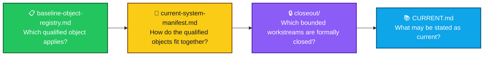

<div align="center">

# ALLIS — Acceptance Closeout

### Final acceptance records for bounded ALLIS workstreams

<br>


<br>

**Kidd’s Technical Services · ALLIS**

</div>

---

> [!IMPORTANT]
> This folder is reserved for **final closeout records**.
>
> A closeout record documents the accepted final state of a bounded workstream after its scope, evidence, validation state, residuals, and final authority have been established.

---

# 🎯 Purpose of this folder

The `acceptance/closeout/` directory provides a stable home for **completed workstream closeout records**.

It separates final acceptance from:

- active engineering work;
- working analysis;
- formal models;
- evidence collections;
- runtime correspondence records; and
- current-state summaries.

A closeout document should answer:

> **What workstream closed, what did it establish, what remained bounded, and what final evidence supports that result?**

---

# 🧭 Where closeout fits


The closeout layer records the **accepted result**.

It does not replace the underlying evidence or formal records.

---

# 📁 Planned closeout records

The repository reconciliation plan identifies three bounded workstreams that need dedicated closeout documents.

```text
acceptance/
└── closeout/
    ├── readme.md
    ├── workstream-f-close.md
    ├── dgm-step12-close.md
    └── publication-step17-close.md
```

At this stage, this `readme.md` establishes the folder structure and document standard.

The individual closeout files should be added only when each final record is drafted and reviewed.

---

# 🟢 Planned: Workstream F closeout

**Planned file**

```text
workstream-f-close.md
```

The final closeout record should capture:

- F1–F5 closed;
- 5/5 proofs;
- formal close;
- qualified source baseline;
- close eligibility;
- formal close authority;
- final scope boundary.

Qualified Workstream-F baseline:

```text
65b9f7dbd594ec9d225152aabd705eefc9216dbb
```

The closeout should preserve the distinction between:

```text
eligible to close
    ≠
formally closed
```

---

# 🟠 Planned: DGM Step-12 closeout

**Planned file**

```text
dgm-step12-close.md
```

The final closeout record should capture:

- the bounded production authorized-adoption formal model;
- 12 propositions;
- 11 proven;
- 1 disproven;
- 0 unadjudicated;
- `T12D-A` — Machine-Checked;
- `T12D-B` — Correspondence-Verified;
- `T12D-C` — Correspondence-Verified;
- `P12C-09` — Machine-Checked Disproven;
- eight residuals;
- seven explicit non-promotions;
- final Step-12 seal;
- `SYSTEM_PROVEN=NO`.

The closeout should preserve both successful and negative formal results.

```text
disproven
    ≠
unfinished
```

---

# 🟦 Planned: Publication Step-17 closeout

**Planned file**

```text
publication-step17-close.md
```

The final closeout record should capture:

- Steps 0–17 green;
- 25/25 completion criteria;
- final network continuity green;
- governed publication endpoint complete;
- Evidence & Governance Portal live at the final observation;
- publication ID;
- publication SHA-256;
- frontend build;
- no production mutation during final closeout;
- fixed-goal closure;
- no automatic Step 18.

The closeout should preserve:

```text
new capability
    ⇒
new governed workstream
```

---

# 🧱 Closeout document standard

Each closeout file should use a consistent structure.

```text
1. Workstream
2. Scope
3. Closeout question
4. Qualified object(s)
5. Acceptance criteria
6. Validation state
7. Correspondence state
8. Final result
9. Final evidence / seal
10. Residuals
11. Non-promotions
12. Negative results, if any
13. Successor rule
14. Supported public claim
```

This makes closeout records easy to compare without forcing different workstreams into the same technical model.

---

# 🔒 Closeout rules

## 1. Closeout is scope-bound

```text
workstream closed
    ≠
whole system proven
```

A closeout is authoritative for the workstream it names.

---

## 2. Closeout preserves residuals

A workstream can close successfully while retaining explicit limits.

Residuals remain part of the accepted result.

---

## 3. Negative results remain visible

A disproven proposition is part of the formal record.

Closeout should preserve it rather than omit it.

---

## 4. Runtime observations remain time-specific

```text
runtime correspondence at close
    ≠
permanent runtime correspondence
```

If a claim-bearing runtime object changes, renewed correspondence may be required.

---

## 5. Closed workstreams do not silently expand

A new capability should receive:

- new scope;
- new authority;
- new acceptance criteria; and
- a new closeout record when complete.

---

# 🧩 Relationship to the acceptance layer



| Document | Primary question |
|---|---|
| `baseline-object-registry.md` | Which qualified reference object applies to this scope? |
| `current-system-manifest.md` | How do qualified objects and correspondence relationships fit together? |
| `closeout/readme.md` | What belongs in the final acceptance-closeout layer? |
| `CURRENT.md` | What does the accepted technical record support now? |

---

# 📚 Related acceptance records

- [`../current-system-manifest.md`](../current-system-manifest.md) — composite current-system object and correspondence manifest
- [`../baseline-object-registry.md`](../baseline-object-registry.md) — role-scoped baseline and reference-object registry
- [`../../CURRENT.md`](../../CURRENT.md) — current qualified technical state

Existing bounded evidence and formal records remain in their own directories until the corresponding closeout summaries are added.

---

# 🧾 Folder status

<div align="center">

### `acceptance/closeout/`

**READY FOR FINAL CLOSEOUT RECORDS**

<br>

Planned:

`workstream-f-close.md`

`dgm-step12-close.md`

`publication-step17-close.md`

</div>

---

# Governing principle

> **A closeout records the accepted final state of a bounded workstream without expanding that result beyond its defined scope.**
