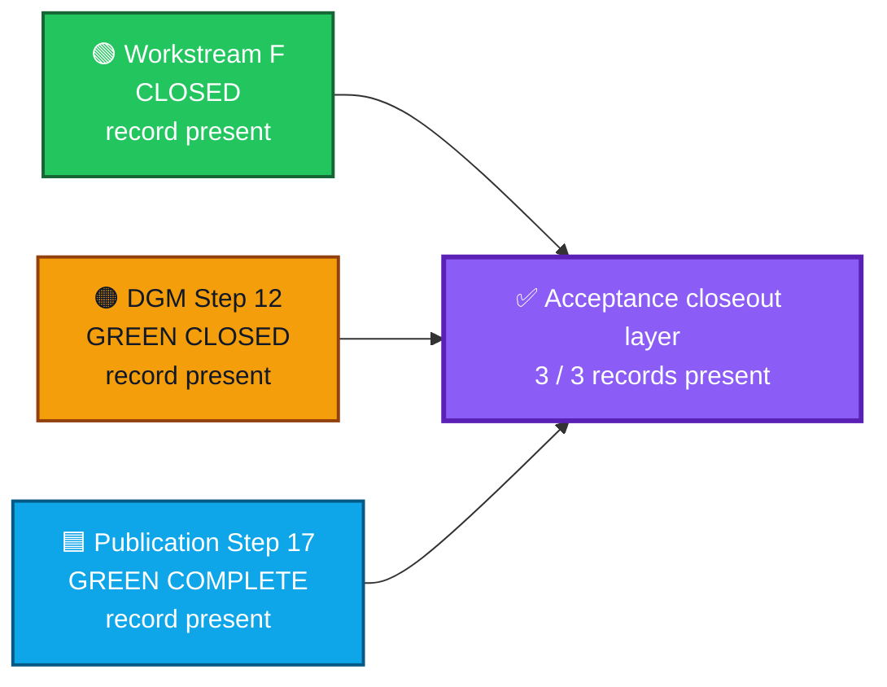
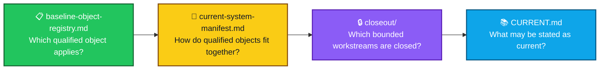

<div align="center">

# ALLIS — Acceptance Closeout

### Final acceptance records for bounded ALLIS workstreams

<br>


<br>

**Kidd’s Technical Services · ALLIS**

</div>

---

> [!IMPORTANT]
> This folder contains the **final closeout records** for the three bounded ALLIS workstreams represented in the current acceptance layer.
>
> A closeout record documents the accepted final state of a workstream after its scope, evidence, validation state, residuals, correspondence, and final authority have been established.
>
> Later successor work may close or produce evidence in another repository layer. Those successor records are linked here for continuity, but they do **not** rewrite the historical Workstream-F, Step-12, or Step-17 closeouts.

---

# 🎯 Purpose of this folder

The `acceptance/closeout/` directory provides a stable home for **completed workstream closeout records**.

It separates final acceptance from:

- active engineering work;
- working analysis;
- formal models;
- evidence collections;
- runtime correspondence records; and
- current-state summaries.

A closeout document answers:

> **What workstream closed, what did it establish, what remained bounded, and what final evidence supports that result?**

---

# 🧭 Where closeout fits


The closeout layer records the **accepted result**.

It does not replace the underlying evidence, formal models, or correspondence records.

---

# 📁 Closeout records

Current directory structure:

```text
acceptance/
└── closeout/
    ├── README.md
    ├── workstream-f-close.md
    ├── dgm-step12-close.md
    └── publication-step17-close.md
```

| Record | Status | Purpose |
|---|---|---|
| [`workstream-f-close.md`](workstream-f-close.md) | ✅ **Present** | Formal Workstream-F close |
| [`dgm-step12-close.md`](dgm-step12-close.md) | ✅ **Present** | Bounded Step-12 formal/correspondence close |
| [`publication-step17-close.md`](publication-step17-close.md) | ✅ **Present** | Governed-publication fixed-goal close |

## Successor records outside this directory

The later Step-12 successor work is recorded in other technical layers rather than by rewriting the historical acceptance closeout.

| Successor record | Location | Relationship to this closeout layer |
|---|---|---|
| 🟪 **Lean R1 workstream closeout** | [`../../formal-verification/authorized-adoption/lean/workstream-closeout-r1.md`](../../formal-verification/authorized-adoption/lean/workstream-closeout-r1.md) | Later proof-assistant workstream close; preserves historical Step-12 classifications |
| 🟨 **Post-A8 DGM theorem correspondence registry R1** | [`../../evidence/governed-evolution/post-a8-theorem-correspondence-registry-r1.md`](../../evidence/governed-evolution/post-a8-theorem-correspondence-registry-r1.md) | Later current correspondence evidence; does not replace the Step-12 closeout |

> [!NOTE]
> The post-A8 registry is currently a **successor evidence record**, not a fourth acceptance closeout file in this directory.
>
> Therefore the folder status remains:
>
> ```text
> CLOSEOUT_RECORDS=3_OF_3_PRESENT
> ```

---

# 🟢 Workstream F closeout

**File**

[`workstream-f-close.md`](workstream-f-close.md)

Final state:

```text
F1=CLOSED
F2=CLOSED
F3=CLOSED
F4=CLOSED
F5=CLOSED

WORKSTREAM_F_PROOFS_CLOSED=5
WORKSTREAM_F_PROOF_TARGET=5

WORKSTREAM_F_FORMAL_STATE_TRANSITION=PASS
WORKSTREAM_F_FORMAL_CLOSE=PASS

WORKSTREAM_F_STATUS=CLOSED
```

Qualified Workstream-F baseline:

```text
65b9f7dbd594ec9d225152aabd705eefc9216dbb
```

The closeout preserves the distinction between:

```text
eligible to close
    ≠
formally closed
```

and records that the sealed formal-close authority was consumed exactly once before the `OPEN → CLOSED` transition.

Further Workstream-F proof execution is not authorized under the consumed close authority.

---

# 🟠 DGM Step-12 closeout

**File**

[`dgm-step12-close.md`](dgm-step12-close.md)

Final state:

```text
STEP_12=GREEN_CLOSED_WITH_EXPLICIT_RESIDUALS
```

Formal object:

```text
DGM_PRODUCTION_AUTHORIZED_ADOPTION_MODEL_V1
```

Production source:

```text
20c8cbe175781c8a1c05d65c03977859ceca884a
```

Proposition result:

```text
12 total
11 proven
1 disproven
0 open
```

Principal validation states:

```text
T12D-A   = MACHINE_CHECKED
T12D-B   = CORRESPONDENCE_VERIFIED
T12D-C   = CORRESPONDENCE_VERIFIED
P12C-09  = MACHINE_CHECKED_DISPROVEN
```

The closeout also preserves:

- 15 formal obligations;
- 0 unadjudicated obligations;
- 11/11 NBB source correspondence;
- 11/11 worker source correspondence;
- public trust correspondence;
- governance-view correspondence;
- eight explicit residuals;
- seven explicit non-promotions;
- the preserved `claimed-but-not-terminalized` counterexample;
- the final Step-12 seal; and
- `SYSTEM_PROVEN=NO`.

A disproven proposition remains part of the accepted formal result.

```text
disproven
    ≠
unfinished
```

---

# 🟪 Step-12 successor records

The sealed Step-12 closeout above remains the authoritative record of what was established at the Step-12 close boundary.

Later work added two distinct successor layers.

## Lean R1 proof-assistant closeout

The later Lean R1 workstream independently formalized and kernel-checked the principal Step-12 result set.

Closeout:

[`../../formal-verification/authorized-adoption/lean/workstream-closeout-r1.md`](../../formal-verification/authorized-adoption/lean/workstream-closeout-r1.md)

That workstream closed with:

```text
LOCAL_LEAN_WORKSTREAM_R1=CLOSED
```

and preserved the historical boundary that, at the Lean R1 close itself:

```text
LEAN_TO_PRODUCTION_SOURCE_CORRESPONDENCE=NOT_YET_ESTABLISHED
LEAN_TO_PRODUCTION_RUNTIME_CORRESPONDENCE=NOT_YET_ESTABLISHED
```

Those statements remain historically correct for that closed workstream.

## Post-A8 DGM successor correspondence evidence

A later post-A8 revalidation then established a newer bounded correspondence observation for the same stable Step-12 production-source identity.

Evidence record:

[`../../evidence/governed-evolution/post-a8-theorem-correspondence-registry-r1.md`](../../evidence/governed-evolution/post-a8-theorem-correspondence-registry-r1.md)

Current bounded result:

```text
CURRENT_POST_A8_DGM_SOURCE_TO_RUNTIME_CORRESPONDENCE=PASS_11_OF_11
```

with current theorem-specific live revalidation supporting:

```text
T12D-B = CORRESPONDENCE_VERIFIED
T12D-C = CORRESPONDENCE_VERIFIED
```

while:

```text
T12D-A = MACHINE_CHECKED
```

because no positive authorized-apply production observation was executed.

The post-A8 evidence does not change:

```text
P12C-09 = MACHINE_CHECKED_DISPROVEN
```

and does not establish:

```text
PRODUCTION_MUTATION_SAFETY_THEOREM_PROVEN=YES
WHOLE_SYSTEM_SAFETY_THEOREM_PROVEN=YES
SYSTEM_PROVEN=YES
```

The controlling boundaries remain:

```text
PRODUCTION_MUTATION_SAFETY_THEOREM_PROVEN=NO
WHOLE_SYSTEM_SAFETY_THEOREM_PROVEN=NO
SYSTEM_PROVEN=NO
```

> [!IMPORTANT]
> **Successor evidence is additive.**
>
> The historical [`dgm-step12-close.md`](dgm-step12-close.md) remains unchanged as the Step-12 closeout at its own seal boundary. The Lean R1 closeout and post-A8 correspondence registry answer later questions and must not be used to retroactively rewrite that historical close.

---

# 🟦 Publication Step-17 closeout

**File**

[`publication-step17-close.md`](publication-step17-close.md)

Final state:

```text
STEP17_STATUS=GREEN_ALLIS_LIVE_PUBLICATION_ENDPOINT_COMPLETE

ALL_STEPS_0_THROUGH_17=GREEN
FINAL_CRITERIA=25_OF_25_PASS
FINAL_NETWORK_CONTINUITY=GREEN

OVERALL_GOAL=GREEN_COMPLETE
```

Final publication identity:

```text
allis-publication-step6-retention-v2
```

Publication SHA-256:

```text
d6ab63522f9080fae440578ebbb6ed42140595155c9a30253f5b8eeeef8009b7
```

Frontend build:

```text
5By6R3CWTM7NDXc-4lmSi
```

The closeout establishes, within the fixed publication goal:

- Steps 0–17 green;
- 25/25 completion criteria;
- final network continuity green;
- governed publication endpoint complete;
- Evidence & Governance Portal live at the final observation;
- immutable publication identity;
- direct/public publication-body correspondence;
- strict read-only public boundary;
- no public mutation endpoint;
- publication-service isolation;
- loopback-only publication service;
- authorized public routing;
- GUI publication consumption without unrestricted direct ALLIS access;
- restart persistence;
- rollback demonstration;
- source → publication → HTTP → GUI correspondence;
- final completion-manifest verification; and
- no production mutation during final closeout.

The fixed-goal successor rule is:

```text
new capability
    ⇒
new governed workstream
```

There is no automatic Step 18 for the completed fixed goal.

---

# 🌈 Closeout status



All three planned bounded acceptance closeout records are now present.

The closeout index also links the later Lean R1 closeout and post-A8 DGM correspondence evidence so current readers can follow the successor evidence chain without altering the three historical acceptance closeouts.

---

# ↔️ Closeout comparison

| Property | 🟢 Workstream F | 🟠 DGM Step 12 | 🟦 Publication Step 17 |
|---|---|---|---|
| Final state | `CLOSED` | `GREEN_CLOSED_WITH_EXPLICIT_RESIDUALS` | `GREEN_COMPLETE` |
| Primary object | Qualified F baseline | Production DGM formal/source object | Governed publication reference set |
| Core acceptance result | F1–F5 · 5/5 proofs | 12 propositions · 15 formal obligations | 25/25 fixed-goal criteria |
| Formal negative result | — | `P12C-09` disproven | — |
| Correspondence emphasis | Qualified close lineage | Model → source → runtime | Source → publication → HTTP → GUI |
| Runtime observation | Not the close authority | Point-in-time NBB/worker correspondence | Point-in-time publication/network/GUI correspondence |
| Successor rule | Separate next-scope authority | New workstream before stronger promotion | New workstream for new capability |
| Whole-system proof | ❌ | ❌ | ❌ |

---

# 🧱 Closeout document standard

Each closeout file follows the same general structure while preserving workstream-specific evidence.

```text
1. Workstream
2. Scope
3. Closeout question
4. Qualified object(s)
5. Acceptance criteria
6. Validation state
7. Correspondence state
8. Final result
9. Final evidence / seal
10. Residuals
11. Non-promotions
12. Negative results, if any
13. Successor rule
14. Supported public claim
```

This makes closeout records comparable without forcing different workstreams into the same technical model.

---

# 🔒 Closeout rules

## 1. Closeout is scope-bound

```text
workstream closed
    ≠
whole system proven
```

A closeout is authoritative for the workstream it names.

---

## 2. Closeout preserves residuals

A workstream can close successfully while retaining explicit limits.

Residuals remain part of the accepted result.

---

## 3. Negative results remain visible

A disproven proposition is part of the formal record.

Closeout preserves it rather than removing or silently weakening it.

---

## 4. Runtime observations remain time-specific

```text
runtime correspondence at close
    ≠
permanent runtime correspondence
```

If a claim-bearing runtime object changes, renewed correspondence may be required.

---

## 5. Closed workstreams do not silently expand

A new capability should receive:

- new scope;
- new authority;
- new acceptance criteria; and
- a new closeout record when complete.

---

## 6. Successor records do not rewrite predecessor closes

```text
later proof
    ≠
retroactive rewrite of historical close
```

```text
later runtime correspondence
    ≠
replacement of earlier seal-time evidence
```

The Step-12 closeout remains true to the state established when it was sealed.

The later Lean R1 closeout and post-A8 correspondence registry are additive successor records.

---

# 🧩 Relationship to the acceptance layer



| Document | Primary question |
|---|---|
| `baseline-object-registry.md` | Which qualified reference object applies to this scope? |
| `current-system-manifest.md` | How do qualified objects and correspondence relationships fit together? |
| `closeout/README.md` | Which bounded workstreams have final closeout records? |
| `CURRENT.md` | What does the accepted technical record support now? |

---

# 📚 Closeout records

- [`workstream-f-close.md`](workstream-f-close.md) — formal Workstream-F close
- [`dgm-step12-close.md`](dgm-step12-close.md) — bounded production DGM formal/correspondence close
- [`publication-step17-close.md`](publication-step17-close.md) — governed-publication fixed-goal close

# 📚 Successor closeout and evidence records

- [`../../formal-verification/authorized-adoption/lean/workstream-closeout-r1.md`](../../formal-verification/authorized-adoption/lean/workstream-closeout-r1.md) — later Step-12 Lean R1 proof-assistant closeout
- [`../../evidence/governed-evolution/post-a8-theorem-correspondence-registry-r1.md`](../../evidence/governed-evolution/post-a8-theorem-correspondence-registry-r1.md) — later post-A8 bounded DGM theorem-correspondence evidence

# 📚 Related acceptance records

- [`../current-system-manifest.md`](../current-system-manifest.md) — composite current-system object and correspondence manifest
- [`../baseline-object-registry.md`](../baseline-object-registry.md) — role-scoped baseline and reference-object registry
- [`../../CURRENT.md`](../../CURRENT.md) — current qualified technical state

The detailed evidence, formal models, and correspondence records remain in their dedicated repository directories.

> [!NOTE]
> No separate post-A8 acceptance closeout file has been added to `acceptance/closeout/` in this reconciliation pass. The current post-A8 record is linked as successor evidence.

---

# ⚪ System-level boundary

The closeout layer now contains three completed bounded records.

Their combined existence does not create a whole-system theorem.

```text
WORKSTREAM_F_STATUS=CLOSED

STEP_12=GREEN_CLOSED_WITH_EXPLICIT_RESIDUALS

LEAN_R1_SUCCESSOR_CLOSEOUT=CLOSED

POST_A8_DGM_THEOREM_CORRESPONDENCE_REGISTRY_R1=PASS

PUBLICATION_STEP_17=GREEN_COMPLETE

SYSTEM_PROVEN=NO
```

Each result remains authoritative within its own documented scope.

---

# 🧾 Folder status

<div align="center">

### `acceptance/closeout/`

# **3 OF 3 CLOSEOUT RECORDS PRESENT**

<br>

✅ `workstream-f-close.md`

✅ `dgm-step12-close.md`

✅ `publication-step17-close.md`

<br>

### Successor records linked outside this directory

🟪 `formal-verification/authorized-adoption/lean/workstream-closeout-r1.md`

🟨 `evidence/governed-evolution/post-a8-theorem-correspondence-registry-r1.md`

<br>

## **CLOSEOUT LAYER COMPLETE**

</div>

---

# Governing principle

> **A closeout records the accepted final state of a bounded workstream without expanding that result beyond its defined scope.**
>
> **Later successor closeouts and evidence extend the record forward; they do not rewrite the state that an earlier closeout truthfully sealed.**
