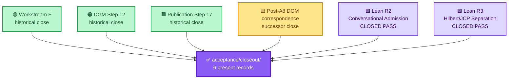

<div align="center">

# ALLIS — Acceptance Closeout

### Final acceptance records for bounded ALLIS workstreams

<br>


<br>

**Kidd's Technical Services · ALLIS**

</div>

---

> [!IMPORTANT]
> This folder contains bounded acceptance closeout records.
>
> The historical Workstream-F, DGM Step-12, and Publication Step-17 closeouts remain unchanged in their original scopes.
>
> Later successor closeouts are additive.
>
> The Lean R2 Conversational Admission and Lean R3 Hilbert/JCP Separation closeouts are now present as their own bounded acceptance records.
>
> A later conversational-frontdoor closeout should be linked here **only after that closeout actually exists**.

---

# 🎯 Purpose of this folder

The `acceptance/closeout/` directory provides a stable home for completed workstream closeout records.

It separates final acceptance from:

- active engineering work;
- working analysis;
- formal models;
- evidence collections;
- runtime correspondence records;
- production-state evidence; and
- current-state summaries.

A closeout document answers:

> **What bounded workstream closed, what did it establish, what remained outside scope, and what evidence supports that accepted result?**

---

# 🧭 Where closeout fits


```mermaid
flowchart LR
    A["🔧 Engineering work"]:::work
    B["🧾 Evidence"]:::evidence
    C["📐 Formal / acceptance analysis"]:::formal
    D["🔗 Correspondence where required"]:::corr
    E["✅ Final adjudication"]:::final
    F["🔒 CLOSEOUT RECORD"]:::close
    G["📚 Current-state documentation"]:::current

    A --> B --> C --> D --> E --> F --> G

    classDef work fill:#dbeafe,stroke:#2563eb,color:#172554,stroke-width:2px;
    classDef evidence fill:#bae6fd,stroke:#0284c7,color:#0c4a6e,stroke-width:2px;
    classDef formal fill:#ddd6fe,stroke:#7c3aed,color:#3b0764,stroke-width:2px;
    classDef corr fill:#fde68a,stroke:#ca8a04,color:#713f12,stroke-width:2px;
    classDef final fill:#bbf7d0,stroke:#16a34a,color:#14532d,stroke-width:2px;
    classDef close fill:#22c55e,stroke:#166534,color:#ffffff,stroke-width:3px;
    classDef current fill:#facc15,stroke:#854d0e,color:#111827,stroke-width:2px;
```

The closeout layer records the accepted result.

It does not replace the underlying evidence, formal models, or correspondence records.

---

# 📁 Closeout records

Current verified directory set:

```text
acceptance/
└── closeout/
    ├── README.md
    ├── workstream-f-close.md
    ├── dgm-step12-close.md
    ├── post-a8-dgm-correspondence-close.md
    ├── lean-conversational-admission-r2-close.md
    ├── lean-hilbert-jcp-separation-r3-close.md
    └── publication-step17-close.md
```

| Record | Status | Purpose |
|---|---|---|
| [`workstream-f-close.md`](workstream-f-close.md) | ✅ **Present** | Formal Workstream-F close |
| [`dgm-step12-close.md`](dgm-step12-close.md) | ✅ **Present** | Historical bounded Step-12 formal/correspondence close |
| [`post-a8-dgm-correspondence-close.md`](post-a8-dgm-correspondence-close.md) | ✅ **Present** | Successor acceptance close for later bounded post-A8 DGM correspondence |
| [`lean-conversational-admission-r2-close.md`](lean-conversational-admission-r2-close.md) | ✅ **Present** | Bounded Lean R2 Conversational Admission proof-workstream close |
| [`lean-hilbert-jcp-separation-r3-close.md`](lean-hilbert-jcp-separation-r3-close.md) | ✅ **Present** | Bounded Lean R3 Hilbert/JCP Separation proof-workstream close |
| [`publication-step17-close.md`](publication-step17-close.md) | ✅ **Present** | Governed-publication fixed-goal close |

---

# 🟢 Workstream F closeout

**File**

[`workstream-f-close.md`](workstream-f-close.md)

Final state:

```text
F1=CLOSED
F2=CLOSED
F3=CLOSED
F4=CLOSED
F5=CLOSED

WORKSTREAM_F_PROOFS_CLOSED=5
WORKSTREAM_F_PROOF_TARGET=5

WORKSTREAM_F_STATUS=CLOSED
```

Qualified Workstream-F baseline:

```text
65b9f7dbd594ec9d225152aabd705eefc9216dbb
```

This historical closeout remains unchanged.

---

# 🟠 DGM Step-12 closeout

**File**

[`dgm-step12-close.md`](dgm-step12-close.md)

Final state:

```text
STEP_12=GREEN_CLOSED_WITH_EXPLICIT_RESIDUALS
```

Formal object:

```text
DGM_PRODUCTION_AUTHORIZED_ADOPTION_MODEL_V1
```

Production source:

```text
20c8cbe175781c8a1c05d65c03977859ceca884a
```

Final result:

```text
12 total propositions
11 proven
1 disproven
0 open
```

Principal current validation states remain:

```text
T12D-A   = MACHINE_CHECKED
T12D-B   = CORRESPONDENCE_VERIFIED
T12D-C   = CORRESPONDENCE_VERIFIED
P12C-09  = MACHINE_CHECKED_DISPROVEN
```

System-level boundaries remain:

```text
PRODUCTION_MUTATION_SAFETY_THEOREM_PROVEN=NO
WHOLE_SYSTEM_SAFETY_THEOREM_PROVEN=NO
SYSTEM_PROVEN=NO
```

---

# 🟨 Post-A8 DGM correspondence successor closeout

**File**

[`post-a8-dgm-correspondence-close.md`](post-a8-dgm-correspondence-close.md)

This is a successor acceptance record.

It does not rewrite the historical Step-12 closeout.

Current bounded state includes:

```text
CURRENT_POST_A8_DGM_SOURCE_TO_RUNTIME_CORRESPONDENCE=PASS_11_OF_11

T12D_A_CURRENT_VALIDATION_LEVEL=MACHINE_CHECKED
T12D_B_CURRENT_VALIDATION_LEVEL=CORRESPONDENCE_VERIFIED
T12D_C_CURRENT_VALIDATION_LEVEL=CORRESPONDENCE_VERIFIED
P12C_09_CURRENT_VALIDATION_LEVEL=MACHINE_CHECKED_DISPROVEN
```

and preserves:

```text
REAL_PRODUCTION_AUTHORIZATION_ISSUED=NO
REAL_PRODUCTION_AUTHORIZATION_CONSUMED=NO
REAL_PRODUCTION_DGM_PATCH_APPLICATION=NO
```

---

# 🟪 Lean R2 Conversational Admission closeout

**File**

[`lean-conversational-admission-r2-close.md`](lean-conversational-admission-r2-close.md)

Final accepted state:

```text
LEAN_R2_CONVERSATIONAL_ADMISSION_CLOSEOUT=CLOSED_PASS
```

Principal result:

```text
PRINCIPAL_CHECKS=6_OF_6
KERNEL_CHECKED=6_OF_6
PROOF_HOLES=0
FINAL_THEOREM_LEVEL_AXIOM_DEPENDENCIES=0_OF_6
FINAL_PROPEXT_DEPENDENCIES=0_OF_6
```

The accepted theorem family is:

```text
TCHAT_A_server_derived_authenticated_identity

TCHAT_B_browser_identity_is_nonauthoritative

TCHAT_C_canonical_scalar_user_id_not_invented

TCHAT_D_distinct_authenticated_sessions_remain_identity_isolated

TCHAT_E_ordinary_chat_does_not_create_governance_authority

TCHAT_F_ordinary_chat_does_not_authorize_hpeople_secret_disclosure
```

Qualified R2 identity:

```text
branch =
formal-verification/lean-conversational-admission-r2

HEAD =
c1a18b2e5fbe2e288d8b91dafe18668392bc787d

tree =
e325bfdd78cd6903dbfb3a8c15130af26de5cd9f
```

The closeout preserves the proof-history distinction:

```text
initial propext dependencies = 6/6
final propext dependencies = 0/6
```

and:

```text
FORMAL_WORKSTREAM_CLOSED=YES
PRODUCTION_AUTHORITY_GRANTED=NO
SYSTEM_PROVEN=NO
```

Related evidence:

[`../../evidence/conversational-admission/r2-qualification.md`](../../evidence/conversational-admission/r2-qualification.md)

Related correspondence:

- [`../../correspondence/conversational-admission/model-to-source.md`](../../correspondence/conversational-admission/model-to-source.md)
- [`../../correspondence/conversational-admission/source-to-runtime.md`](../../correspondence/conversational-admission/source-to-runtime.md)

---

# 🟪 Lean R3 Hilbert/JCP Separation closeout

**File**

[`lean-hilbert-jcp-separation-r3-close.md`](lean-hilbert-jcp-separation-r3-close.md)

Final accepted state:

```text
LEAN_R3_HILBERT_JCP_SEPARATION_CLOSEOUT=CLOSED_PASS
```

Principal result:

```text
FINAL_CHECKS=14_OF_14
KERNEL_CHECKED=14_OF_14
PROOF_HOLES=0
FINAL_THEOREM_LEVEL_AXIOM_DEPENDENCIES=0_OF_14
FINAL_PROPEXT_DEPENDENCIES=0_OF_14
```

Qualified R3 identity:

```text
branch =
formal-verification/hilbert-jcp-separation-r3

HEAD =
6f4a7de303e2d80c3d94a28a8d82e696387bf4b2

tree =
f5ffcb3fd693cbed60c1bd9dc966f868472707d4
```

The accepted current JCP state is:

```text
CURRENT_JCP_BUILDER=build_judge_context_v2

CURRENT_JCP_TOP_LEVEL_FIELD_COUNT=4

CURRENT_JCP_FIELDS:
schema_version
request_context
approved_evidence
wv_deliberative_context
```

Current admission state:

```text
STATIC_H_GEO_PATH_QUALIFIED=YES

H_GEO_CURRENT_JCP_ADMISSION=NO

H_P_CURRENT_JCP_ADMISSION=NO

H_PEOPLE_CURRENT_JCP_ADMISSION=NO
```

The closeout preserves:

```text
FUTURE_LIVE_H_GEO_ADMISSION_PROVED=NO

LIVE_HILBERT_JCP_INTEGRATION_COMPLETE=NO

H384_FORMALIZATION_COMPLETE=NO

PRODUCTION_AUTHORITY_GRANTED=NO

SYSTEM_PROVEN=NO
```

Related evidence:

[`../../evidence/hilbert-jcp-separation/r3-qualification.md`](../../evidence/hilbert-jcp-separation/r3-qualification.md)

Related correspondence:

- [`../../correspondence/hilbert-jcp-separation/model-to-source.md`](../../correspondence/hilbert-jcp-separation/model-to-source.md)
- [`../../correspondence/hilbert-jcp-separation/source-to-runtime.md`](../../correspondence/hilbert-jcp-separation/source-to-runtime.md)

---

# 🟦 Publication Step-17 closeout

**File**

[`publication-step17-close.md`](publication-step17-close.md)

Final state:

```text
STEP17_STATUS=GREEN_ALLIS_LIVE_PUBLICATION_ENDPOINT_COMPLETE

ALL_STEPS_0_THROUGH_17=GREEN
FINAL_CRITERIA=25_OF_25_PASS
FINAL_NETWORK_CONTINUITY=GREEN

OVERALL_GOAL=GREEN_COMPLETE
```

Final publication identity:

```text
allis-publication-step6-retention-v2
```

Publication SHA-256:

```text
d6ab63522f9080fae440578ebbb6ed42140595155c9a30253f5b8eeeef8009b7
```

Historical Step-17 frontend build:

```text
5By6R3CWTM7NDXc-4lmSi
```

This historical closeout remains unchanged.

---

# 🧮 Closeout status

The acceptance closeout directory currently contains:

```text
HISTORICAL_BOUNDED_CLOSEOUTS=3

SUCCESSOR_DGM_CORRESPONDENCE_CLOSEOUTS=1

LEAN_R2_CLOSEOUTS=1

LEAN_R3_CLOSEOUTS=1

TOTAL_CLOSEOUT_FILES_PRESENT=6
```

The six files are:

```text
workstream-f-close.md

dgm-step12-close.md

post-a8-dgm-correspondence-close.md

lean-conversational-admission-r2-close.md

lean-hilbert-jcp-separation-r3-close.md

publication-step17-close.md
```

---

# 🧠 Front-door closeout boundary

The current repository contains supporting production and correspondence records for the conversational front door, including:

```text
evidence/conversational-frontdoor/current-production-state.md

correspondence/conversational-path/gateway-to-synthesis.md
```

Those are **not** substituted here for an acceptance closeout.

The closeout index must follow:

```text
front-door evidence exists
    ≠
front-door acceptance closeout exists
```

Therefore:

```text
CONVERSATIONAL_FRONTDOOR_CLOSEOUT_LINK_ADDED=NO
```

until a bounded front-door acceptance closeout file is actually created and admitted.

This prevents the closeout index from pointing to a future or inferred object.

---

# ↔️ Closeout relationship model


```mermaid
flowchart TB
    F["🟢 Workstream F<br/>historical close"]:::hist
    D["🟠 DGM Step 12<br/>historical close"]:::hist
    P["🟦 Publication Step 17<br/>historical close"]:::hist

    X["🟨 Post-A8 DGM correspondence<br/>successor close"]:::succ

    R2["🟪 Lean R2<br/>Conversational Admission<br/>CLOSED PASS"]:::lean
    R3["🟪 Lean R3<br/>Hilbert/JCP Separation<br/>CLOSED PASS"]:::lean

    C["✅ acceptance/closeout/<br/>6 present records"]:::close

    F --> C
    D --> C
    P --> C
    X --> C
    R2 --> C
    R3 --> C

    classDef hist fill:#bbf7d0,stroke:#16a34a,color:#14532d,stroke-width:2px;
    classDef succ fill:#fde68a,stroke:#ca8a04,color:#713f12,stroke-width:2px;
    classDef lean fill:#ddd6fe,stroke:#7c3aed,color:#3b0764,stroke-width:2px;
    classDef close fill:#8b5cf6,stroke:#5b21b6,color:#ffffff,stroke-width:3px;
```

R2 and R3 are not retroactive edits to the three historical workstreams.

They are newer bounded first-class closeout objects.

---

# 🧱 Closeout document standard

Each closeout file should preserve:

```text
1. Workstream
2. Scope
3. Closeout question
4. Qualified object(s)
5. Acceptance criteria
6. Validation state
7. Correspondence state
8. Final result
9. Final evidence / seal
10. Residuals
11. Non-promotions
12. Negative results, if any
13. Successor rule
14. Supported public claim
```

Different workstreams may satisfy those fields differently.

The standard does not force different technical domains into one model.

---

# 🔒 Closeout rules

## 1. Closeout is scope-bound

```text
workstream closed
    ≠
whole system proven
```

---

## 2. Closeout preserves residuals

A successful closeout may retain explicit limits.

---

## 3. Negative results remain visible

A disproven proposition remains part of the accepted formal record.

---

## 4. Runtime correspondence remains time-specific

```text
runtime correspondence at close
    ≠
permanent runtime correspondence
```

---

## 5. Closed workstreams do not silently expand

A new capability requires its own scope, evidence, authority, and acceptance criteria.

---

## 6. Successor records do not rewrite predecessor closes

```text
later proof
    ≠
retroactive rewrite
```

```text
later runtime correspondence
    ≠
replacement of predecessor seal-time evidence
```

---

## 7. Evidence is not a closeout

```text
evidence file exists
    ≠
acceptance closeout exists
```

This rule is why conversational-frontdoor production evidence is not yet listed as a closeout record.

---

# 🧩 Relationship to the acceptance layer

| Document | Primary question |
|---|---|
| `baseline-object-registry.md` | Which qualified reference object applies to this scope? |
| `current-system-manifest.md` | How do the current qualified objects and correspondence relationships fit together? |
| `closeout/README.md` | Which bounded workstreams have actual closeout records? |
| `CURRENT.md` | What does the accepted technical record support now? |

---

# 📚 Closeout records

- [`workstream-f-close.md`](workstream-f-close.md) — historical formal Workstream-F close
- [`dgm-step12-close.md`](dgm-step12-close.md) — historical bounded production DGM formal/correspondence close
- [`post-a8-dgm-correspondence-close.md`](post-a8-dgm-correspondence-close.md) — successor bounded DGM correspondence close
- [`lean-conversational-admission-r2-close.md`](lean-conversational-admission-r2-close.md) — Lean R2 Conversational Admission close
- [`lean-hilbert-jcp-separation-r3-close.md`](lean-hilbert-jcp-separation-r3-close.md) — Lean R3 Hilbert/JCP Separation close
- [`publication-step17-close.md`](publication-step17-close.md) — historical governed-publication fixed-goal close

# 📚 Related successor proof and evidence records

- [`../../formal-verification/authorized-adoption/lean/workstream-closeout-r1.md`](../../formal-verification/authorized-adoption/lean/workstream-closeout-r1.md) — Lean R1 proof-assistant closeout
- [`../../evidence/governed-evolution/post-a8-theorem-correspondence-registry-r1.md`](../../evidence/governed-evolution/post-a8-theorem-correspondence-registry-r1.md) — post-A8 DGM theorem-correspondence evidence
- [`../../evidence/conversational-admission/r2-qualification.md`](../../evidence/conversational-admission/r2-qualification.md) — R2 public-safe qualification evidence
- [`../../evidence/hilbert-jcp-separation/r3-qualification.md`](../../evidence/hilbert-jcp-separation/r3-qualification.md) — R3 public-safe qualification evidence

# 📚 Related current production/correspondence records

- [`../../evidence/conversational-frontdoor/current-production-state.md`](../../evidence/conversational-frontdoor/current-production-state.md) — current front-door production evidence
- [`../../correspondence/conversational-path/gateway-to-synthesis.md`](../../correspondence/conversational-path/gateway-to-synthesis.md) — qualified observed downstream conversational path

These two front-door records are supporting evidence/correspondence records.

They are not listed as a front-door closeout.

---

# ⚪ System-level boundary

The current closeout set does not create a whole-system theorem.

```text
WORKSTREAM_F_STATUS=CLOSED

STEP_12=GREEN_CLOSED_WITH_EXPLICIT_RESIDUALS

LEAN_R1_SUCCESSOR_CLOSEOUT=CLOSED

POST_A8_DGM_CORRESPONDENCE_SUCCESSOR_CLOSEOUT=PRESENT

LEAN_R2_CONVERSATIONAL_ADMISSION_CLOSEOUT=CLOSED_PASS

LEAN_R3_HILBERT_JCP_SEPARATION_CLOSEOUT=CLOSED_PASS

PUBLICATION_STEP_17=GREEN_COMPLETE

CONVERSATIONAL_FRONTDOOR_CLOSEOUT_LINK_ADDED=NO

SYSTEM_PROVEN=NO
```

---

# 🧾 Folder status

<div align="center">

### `acceptance/closeout/`

# **6 CLOSEOUT FILES PRESENT**

<br>

### Historical bounded acceptance closeouts

✅ `workstream-f-close.md`

✅ `dgm-step12-close.md`

✅ `publication-step17-close.md`

### Successor / later bounded closeouts

✅ `post-a8-dgm-correspondence-close.md`

✅ `lean-conversational-admission-r2-close.md`

✅ `lean-hilbert-jcp-separation-r3-close.md`

<br>

### Front-door closeout

⏳ **Not indexed until an actual closeout file exists**

<br>

## **SYSTEM_PROVEN=NO**

</div>

---

# Governing principle

> **A closeout records the accepted final state of a bounded workstream without expanding that result beyond its defined scope.**
>
> **Later successor closeouts extend the record forward; they do not rewrite earlier closeouts.**
>
> **Evidence and correspondence are not promoted into an acceptance closeout merely because they exist.**
