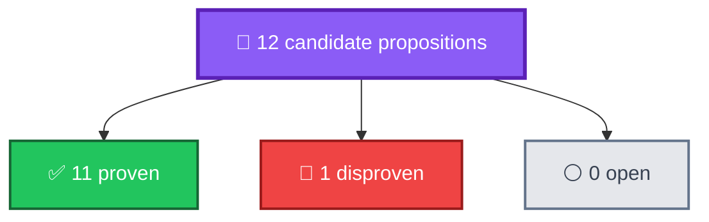
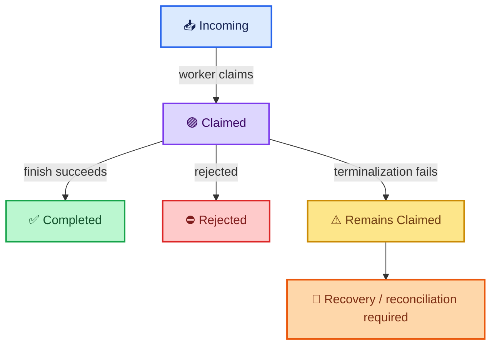
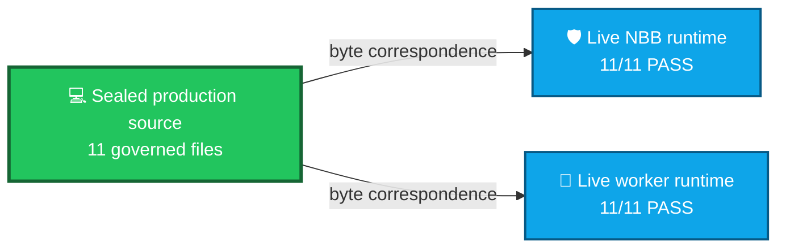
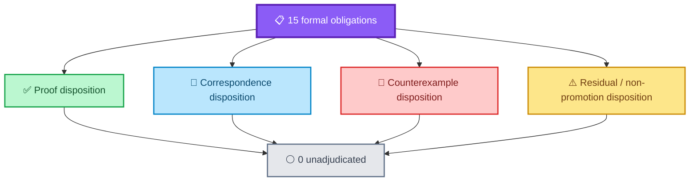
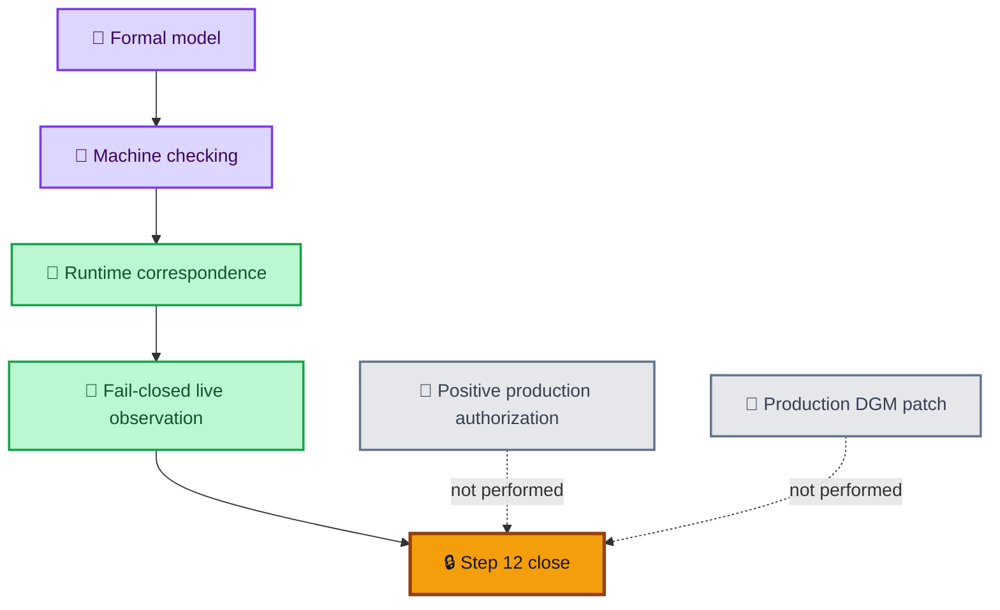
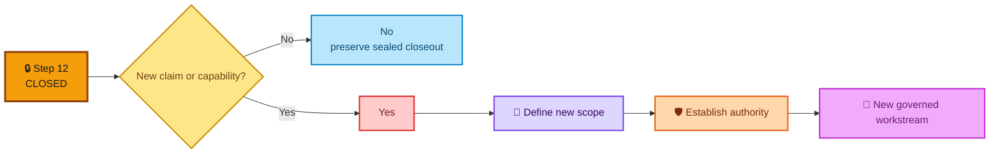
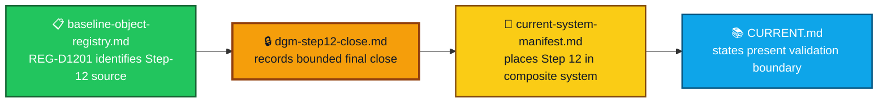

<div align="center">

# ALLIS — DGM Step 12 Closeout

### Production DGM formal verification and runtime correspondence

**Final state: `GREEN_CLOSED_WITH_EXPLICIT_RESIDUALS`**

<br>


<br>

**Kidd’s Technical Services · ALLIS**

</div>

---

> [!IMPORTANT]
> Step 12 is **closed**.
>
> It established a bounded formal and correspondence record for the production DGM authorized-adoption path. Eleven candidate propositions were proven, one was disproven, all fifteen formal obligations received an explicit disposition, selected theorems were correspondence-verified against the deployed runtime, and eight residuals plus seven non-promotions were preserved in the final seal.

---

# 👀 Final result at a glance

| Closeout field | Final state |
|---|---|
| **Workstream** | Production DGM Formal Verification and Runtime Correspondence |
| **Step** | `12` |
| **Formal object** | `DGM_PRODUCTION_AUTHORIZED_ADOPTION_MODEL_V1` |
| **Production source commit** | `20c8cbe175781c8a1c05d65c03977859ceca884a` |
| **Formal source domain** | Sealed 11-file production authorized-adoption source set |
| **Candidate propositions** | `12` |
| **Proven** | `11` |
| **Disproven** | `1` |
| **Open / unadjudicated propositions** | `0` |
| **Formal obligations** | `15` |
| **Unadjudicated obligations** | `0` |
| **NBB source correspondence** | `11/11 PASS` |
| **Worker source correspondence** | `11/11 PASS` |
| **Public trust** | `PASS` |
| **Governance view** | `PASS` |
| **Final status** | **`GREEN_CLOSED_WITH_EXPLICIT_RESIDUALS`** |
| **Whole-system proof** | **`SYSTEM_PROVEN=NO`** |

Final seal:

```text
b00a954a924d3aa3490a5bcb8d4473da2b6885b8c41e116cf03545fee975c23b
```

Final scope:

```text
BOUNDED_PRODUCTION_AUTHORIZED_ADOPTION_
FORMAL_MODEL_AND_ESTABLISHED_CORRESPONDENCE_ONLY
```

---

# 🎯 Closeout question

Step 12 answers:

> **Can the production DGM authorized-adoption path be represented as an exact bounded formal object, adjudicated against its sealed production source, and tied to selected live-runtime behavior without promoting the result beyond the evidence?**

Final answer:

```text
YES
```

The workstream closes because every defined Step-12 obligation received an explicit disposition.

That includes:

- proven propositions;
- correspondence-verified propositions;
- one preserved counterexample;
- explicit residuals; and
- explicit non-promotions.

---

# 🌈 Step-12 closeout path

```mermaid
flowchart LR
    A["💻 Seal exact production source<br/>11 governed files"]:::source
    B["📐 Construct formal object<br/>DGM_PRODUCTION_AUTHORIZED_ADOPTION_MODEL_V1"]:::formal
    C["🧪 Adjudicate 12 propositions"]:::test
    D["✅ 11 proven"]:::proven
    E["🔴 1 disproven"]:::disproven
    F["🔗 Bind model → source → runtime"]:::corr
    G["🧾 Preserve residuals + non-promotions"]:::residual
    H["🔒 Final seal<br/>GREEN_CLOSED_WITH_EXPLICIT_RESIDUALS"]:::close

    A --> B --> C
    C --> D
    C --> E
    D --> F
    E --> F
    F --> G --> H

    classDef source fill:#22c55e,stroke:#166534,color:#ffffff,stroke-width:2px;
    classDef formal fill:#8b5cf6,stroke:#5b21b6,color:#ffffff,stroke-width:2px;
    classDef test fill:#0ea5e9,stroke:#075985,color:#ffffff,stroke-width:2px;
    classDef proven fill:#86efac,stroke:#15803d,color:#14532d,stroke-width:2px;
    classDef disproven fill:#fecaca,stroke:#dc2626,color:#7f1d1d,stroke-width:2px;
    classDef corr fill:#f0abfc,stroke:#c026d3,color:#701a75,stroke-width:2px;
    classDef residual fill:#fde68a,stroke:#ca8a04,color:#713f12,stroke-width:2px;
    classDef close fill:#f59e0b,stroke:#92400e,color:#111827,stroke-width:3px;
```



---

# 📐 Formal object

The controlling Step-12 formal object is:

```text
DGM_PRODUCTION_AUTHORIZED_ADOPTION_MODEL_V1
```

Its source authority is the sealed 11-file production source set at:

```text
20c8cbe175781c8a1c05d65c03977859ceca884a
```

The modeled path is:


This model covers the **authorized-adoption path**.

It does not model every ALLIS behavior.

---

# 🧮 Proposition adjudication

Step 12 evaluated twelve candidate propositions.

```text
N_total      = 12
N_proven     = 11
N_disproven  = 1
N_open       = 0
```

Therefore:

```text
12 = 11 + 1 + 0
```

Every candidate proposition received an explicit disposition.



---

# 🤖 T12D-A — successful authorized application

The principal bounded production theorem is:

```text
successful authorized application
    ⇒
authorization validation
AND target validity
AND prestate correspondence
AND fresh one-time authorization
AND spent-state reservation
AND durable receipt correspondence
```

Formally, the success event implies:

```text
V_auth
AND
V_target
AND
V_pre
AND
V_once
AND
S_spent
AND
R_receipt
```

## Final validation

```text
T12D-A = MACHINE_CHECKED
```

The theorem was established through machine-executed source-structure checking and bounded execution over the sealed production model.

It was **not** promoted to `CORRESPONDENCE_VERIFIED`.

Why?

```text
source theorem = established
source/runtime byte correspondence = established
live positive authorized apply = not observed
```

Therefore:

```text
T12D-A
    ≠
CORRESPONDENCE_VERIFIED
```

A real positive production authorization and mutation were deliberately not performed during Step 12.

---

# 🔗 T12D-B — invalid authorization fails closed

The second principal theorem is:

```text
InvalidAuthorization
    ⇒
no AuthorizedSpoolPublication
```

Within the modeled NBB publication path:

```text
authorization invalid
    ⇒
publish does not occur
```

This property was:

- proven against the sealed production source model; and
- observed through the live production fail-closed boundary.

Final validation:

```text
T12D-B = CORRESPONDENCE_VERIFIED
```

---

# 🔗 T12D-C — empty incoming spool cannot apply

The third principal theorem is:

```text
NoIncomingRecord
    ⇒
NoWorkerClaim
    ⇒
NoAuthorizedApply
```

The property was proven in the source model and matched the observed production empty-spool behavior.

Final validation:

```text
T12D-C = CORRESPONDENCE_VERIFIED
```

---

# 🔴 P12C-09 — terminal totality disproven

The proposed unconditional terminal-totality property was:

```text
claimed
    ⇒
completed OR rejected
```

The bounded model produced a valid counterexample:

```text
claimed
AND terminalization failure
    ⇒
claimed
```

A record can remain in the claimed state when final terminalization fails.

Final validation:

```text
P12C-09 = MACHINE_CHECKED_DISPROVEN
```



A narrower candidate theorem could require successful terminalization.

Step 12 did **not** silently replace the disproven proposition with that weaker statement.

The counterexample remains part of the accepted formal record.

---

# 📊 Final validation registry

| Object / claim | Final validation |
|---|---|
| `DGM_PRODUCTION_AUTHORIZED_ADOPTION_MODEL_V1` | Correspondence-verified for deployed identity and observed boundaries |
| `T12D-A` | 🤖 `MACHINE_CHECKED` |
| `T12D-B` | 🔗 `CORRESPONDENCE_VERIFIED` |
| `T12D-C` | 🔗 `CORRESPONDENCE_VERIFIED` |
| `P12C-09` | 🔴 `MACHINE_CHECKED_DISPROVEN` |
| Historical D1R5 theorem | Proven in original historical bounded domain |
| Production Mutation Safety Theorem | `NOT_PROVEN` |
| Whole-System Safety Theorem | `NOT_PROVEN` |
| `SYSTEM_PROVEN` | `NO` |

---

# 🔗 Formal-to-source correspondence

Let:

```text
F = formal production model
S = sealed production source
```

Step 12 established that the formal object was derived from and cryptographically bound to the exact sealed 11-file production source model.

Within the bounded authorized-adoption domain:

```text
C_FS(F, S) = PASS
```


---

# 🖥️ Source-to-runtime correspondence

The sealed production source was compared against both deployed runtime paths.

```text
NBB source correspondence:
11 / 11 = PASS

Worker source correspondence:
11 / 11 = PASS
```



This correspondence is bounded to the inspected deployment state at the final seal.

---

# 🔑 Trust correspondence

The sealed production public verification trust object is:

```text
SHA-256:
4809a1af3dd8fad1767dc5a8a9d67aa763388a055e00ec818c15f9fe0321fbb5
```

At final Step-12 revalidation:

```text
Public trust = PASS
```

Both the NBB and worker verification state corresponded to the sealed trust anchor.

The public trust object permits verification.

It does not grant private signing authority.

```text
can verify
    ≠
can mint authorization
```

---

# 🧭 Governance correspondence

The sealed production governance view is:

```text
SHA-256:
26523c0bad40ff06a75c62a802f20195295534764dce45cfa6acdcdaecc3fcc2
```

At the final seal:

```text
Governance view = PASS
```

The inspected NBB governance state matched the sealed governance object.

The governance object represents governed state.

It does not independently create mutation authority.

---

# 🌐 Correspondence criterion

For a theorem to advance from source-level machine checking to runtime correspondence, Step 12 requires three pieces:

```text
machine-checked theorem
AND
source/runtime correspondence
AND
relevant live observation
```


Applied to the three principal theorems:

| Theorem | Machine checked | Source/runtime correspondence | Relevant live observation | Final level |
|---|---:|---:|---:|---|
| `T12D-A` | ✅ | ✅ | ❌ positive path not observed | `MACHINE_CHECKED` |
| `T12D-B` | ✅ | ✅ | ✅ invalid-auth fail-closed observed | `CORRESPONDENCE_VERIFIED` |
| `T12D-C` | ✅ | ✅ | ✅ empty-spool behavior observed | `CORRESPONDENCE_VERIFIED` |

---

# 🧾 Fifteen formal obligations

Step 12 carried:

```text
N_obligations = 15
```

At final seal:

```text
N_unadjudicated = 0
```

This does **not** mean every proposition was true.

It means every obligation received an explicit disposition.



The key distinction is:

```text
unadjudicated = 0
```

while:

```text
residuals = 8
```

A residual is not an unanswered obligation.

It is a preserved boundary on the final claim.

---

# ⚠️ Eight residuals

Step 12 closed with eight explicit residuals.

## `R12F-01` — Positive production path

A real positive production authorization was not published, consumed, or applied.

```text
Classification:
NOT_OBSERVED
```

---

## `R12F-02` — Terminalization

`P12C-09` was disproven.

A claimed record can remain claimed when terminalization fails.

```text
Classification:
DISPROVEN
```

---

## `R12F-03` — General production mutation safety

The bounded authorized-adoption theorem does not establish a universal production-mutation safety theorem.

```text
Classification:
NOT_PROVEN
```

---

## `R12F-04` — Whole-system safety

The formal object models the authorized-adoption path rather than the entire ALLIS architecture.

```text
Classification:
NOT_PROVEN
```

---

## `R12F-05` — Historical D1R5 domain

The predecessor theorem remains legitimate historical evidence but is not directly promotable into the current production domain.

```text
Classification:
HISTORICAL_ONLY
```

---

## `R12F-06` — Bounded formal domain

The formal model covers the sealed 11-file authorized-adoption path rather than all platform behavior.

```text
Classification:
BOUNDED_DOMAIN
```

---

## `R12F-07` — Point-in-time correspondence

Runtime correspondence is established for the sealed and revalidated deployment state.

It is not a perpetual assertion that future deployment states cannot drift.

```text
Classification:
POINT_IN_TIME_BINDING
```

---

## `R12F-08` — External authority

The NBB and worker verify and consume external authorization but do not independently mint or sign private authorization authority.

```text
Classification:
EXTERNAL_TO_RUNTIME_MODEL
```

---

# 🚫 Seven explicit non-promotions

The final closeout deliberately does **not** promote these stronger claims:

1. `T12D-A` is **not** Correspondence-Verified.
2. `P12C-09` terminal totality is **not** valid.
3. The historical D1R5 theorem is **not** directly promoted to the current production domain.
4. A general production mutation safety theorem is **not** proven.
5. A whole-system safety theorem is **not** proven.
6. `SYSTEM_PROVEN` remains `NO`.
7. A real production authorized apply has **not** been observed.

These are part of the formal closeout.

They are not omissions.

---

# 🖥️ Final runtime state at seal

At final Step-12 sealing:

| Runtime / evidence item | Final state |
|---|---|
| NBB source correspondence | ✅ `11/11 PASS` |
| Worker source correspondence | ✅ `11/11 PASS` |
| Public trust | ✅ `PASS` |
| Governance view | ✅ `PASS` |
| NBB health | ✅ `PASS` |
| Worker health | ✅ `PASS` |
| Host health | ✅ `PASS` |
| Authorized spool | ✅ `PASS_EMPTY` |

No real production authorization was issued or consumed during Step 12.

No production DGM patch was applied during Step 12.

```text
REAL_PRODUCTION_AUTHORIZATION_PUBLICATION=NOT_PERFORMED
REAL_PRODUCTION_AUTHORIZATION_CONSUMPTION=NOT_PERFORMED
REAL_PRODUCTION_DGM_PATCH_APPLICATION=NOT_PERFORMED
```

---

# 🔒 No positive production mutation in Step 12

The closeout intentionally separates verification from live positive mutation.



That choice is why `T12D-A` remains `MACHINE_CHECKED` rather than `CORRESPONDENCE_VERIFIED`.

---

# 🧷 Authorization boundary

The bounded model preserves an important authority rule:

```text
NBB verifies external authorization
Worker verifies / consumes external authorization
```

but:

```text
NBB does not mint private authorization authority
Worker does not mint private authorization authority
```

Authorization issuance remains outside the modeled runtime path.

This is the basis of:

```text
R12F-08 = EXTERNAL_TO_RUNTIME_MODEL
```

---

# 🧬 Semantic commitment boundary

The corrected authorized-adoption model treats the candidate authorization context as a semantic object, not merely a signature container.

The bounded candidate envelope includes authority-relevant fields such as:

```text
proposal
target
expected prestate
candidate content
evaluation
scores
expected tests
```

The security rule is:

> **Every authority-bearing semantic input must be committed where the authorization decision depends on it.**

A valid signature over an incomplete semantic object does not establish authority over omitted decision-bearing semantics.

---

# 🕒 Correspondence is time-specific

Step-12 correspondence is a relation among:

```text
formal model
sealed source
observed runtime
live bounded behavior
time of observation
```

The closeout establishes correspondence for the sealed and revalidated deployment state.

It does not claim:

```text
correspondence at final seal
    ⇒
correspondence forever
```

If a claim-bearing runtime object changes, affected correspondence must be re-established.

---

# 🕰️ Historical D1R5 boundary

The historical theorem source anchor is distinct from the current production source anchor.

Historical source anchor:

```text
35f1aa5586e1a23e1ab88f4d757c451b44506893
```

Current Step-12 production source:

```text
20c8cbe175781c8a1c05d65c03977859ceca884a
```

The two theorem domains are not treated as interchangeable.

```text
historical theorem domain
    ≠
current production theorem domain
```

The historical D1R5 theorem remains valid within its original bounded domain.

It is not directly promoted into the current production domain.

---

# 🎯 Final scientific interpretation

Step 12 establishes the following bounded result:

> The production DGM authorized-adoption architecture has an explicit formal object constructed from the exact sealed production source. Twelve candidate propositions were adjudicated; eleven were proven and one was disproven. The principal successful-application theorem is machine-checked. Two fail-closed theorems are correspondence-verified against the deployed runtime. The exact eleven governed production files correspond in both the NBB and worker runtime environments, while public trust and governance state also correspond to their sealed objects at the final observation.

At the same time, Step 12 does **not** establish:

```text
ProductionMutationSafetyTheorem = Proven
```

or:

```text
WholeSystemSafetyTheorem = Proven
```

or:

```text
SYSTEM_PROVEN = YES
```

The final system-level statements remain:

```text
PRODUCTION_MUTATION_SAFETY_THEOREM_PROVEN=NO
WHOLE_SYSTEM_SAFETY_THEOREM_PROVEN=NO
SYSTEM_PROVEN=NO
```

---

# 🔐 Final disposition

Controlling state:

```text
STATE=
STEP12_FINAL_THEOREM_AND_FORMAL_CORRESPONDENCE_
SEALED_GREEN_WITH_EXPLICIT_RESIDUALS
```

Controlling Step-12 status:

```text
STEP_12=GREEN_CLOSED_WITH_EXPLICIT_RESIDUALS
```

Final seal SHA-256:

```text
b00a954a924d3aa3490a5bcb8d4473da2b6885b8c41e116cf03545fee975c23b
```

Final seal scope:

```text
BOUNDED_PRODUCTION_AUTHORIZED_ADOPTION_
FORMAL_MODEL_AND_ESTABLISHED_CORRESPONDENCE_ONLY
```

No additional promotion is authorized merely by completion of Step 12.

Controlling next-action state:

```text
NONE_STEP12_COMPLETE_DEFINE_NEXT_WORKSTREAM_BEFORE_FURTHER_PROMOTION
```

---

# 🔄 Successor rule

Step 12 is complete.

A new capability, theorem domain, runtime mutation path, or stronger production claim requires a separately defined workstream.



---

# 🧩 Relationship to acceptance records



## Related records

- [`README.md`](README.md) — acceptance-closeout folder guide
- [`../baseline-object-registry.md`](../baseline-object-registry.md) — role-scoped baseline registry
- [`../current-system-manifest.md`](../current-system-manifest.md) — composite qualified-object manifest
- [`../../formal-verification/authorized-adoption/formal-model.md`](../../formal-verification/authorized-adoption/formal-model.md) — bounded formal model
- [`../../formal-verification/authorized-adoption/theorem-registry.md`](../../formal-verification/authorized-adoption/theorem-registry.md) — theorem states
- [`../../formal-verification/authorized-adoption/counterexample-registry.md`](../../formal-verification/authorized-adoption/counterexample-registry.md) — preserved counterexample
- [`../../correspondence/authorized-adoption/model-to-source.md`](../../correspondence/authorized-adoption/model-to-source.md) — formal/source correspondence
- [`../../correspondence/authorized-adoption/source-to-runtime.md`](../../correspondence/authorized-adoption/source-to-runtime.md) — source/runtime correspondence
- [`../../evidence/governed-evolution/residuals.md`](../../evidence/governed-evolution/residuals.md) — residuals and non-promotions
- [`../../evidence/governed-evolution/step12-final-seal.md`](../../evidence/governed-evolution/step12-final-seal.md) — final Step-12 seal
- [`../../CURRENT.md`](../../CURRENT.md) — current qualified technical state

---

# 📦 Normalized closeout record

```yaml
dgm_step12_closeout:
  workstream: production_dgm_formal_verification_and_runtime_correspondence
  step: 12

  formal_object: DGM_PRODUCTION_AUTHORIZED_ADOPTION_MODEL_V1

  source:
    commit: 20c8cbe175781c8a1c05d65c03977859ceca884a
    governed_source_files: 11

  proposition_state:
    total: 12
    proven: 11
    disproven: 1
    open: 0

  principal_results:
    T12D_A: MACHINE_CHECKED
    T12D_B: CORRESPONDENCE_VERIFIED
    T12D_C: CORRESPONDENCE_VERIFIED
    P12C_09: MACHINE_CHECKED_DISPROVEN

  correspondence:
    formal_to_source: PASS
    nbb_source_files: 11_of_11_PASS
    worker_source_files: 11_of_11_PASS
    public_trust: PASS
    governance_view: PASS

  trust:
    public_key_sha256: 4809a1af3dd8fad1767dc5a8a9d67aa763388a055e00ec818c15f9fe0321fbb5

  governance:
    view_sha256: 26523c0bad40ff06a75c62a802f20195295534764dce45cfa6acdcdaecc3fcc2

  formal_obligations:
    total: 15
    unadjudicated: 0

  runtime_at_seal:
    nbb_health: PASS
    worker_health: PASS
    host_health: PASS
    authorized_spool: PASS_EMPTY
    real_production_authorization_publication: NOT_PERFORMED
    real_production_authorization_consumption: NOT_PERFORMED
    real_production_dgm_patch_application: NOT_PERFORMED

  residuals:
    count: 8
    R12F_01: NOT_OBSERVED
    R12F_02: DISPROVEN
    R12F_03: NOT_PROVEN
    R12F_04: NOT_PROVEN
    R12F_05: HISTORICAL_ONLY
    R12F_06: BOUNDED_DOMAIN
    R12F_07: POINT_IN_TIME_BINDING
    R12F_08: EXTERNAL_TO_RUNTIME_MODEL

  non_promotions:
    count: 7

  final:
    status: GREEN_CLOSED_WITH_EXPLICIT_RESIDUALS
    seal_sha256: b00a954a924d3aa3490a5bcb8d4473da2b6885b8c41e116cf03545fee975c23b
    scope: BOUNDED_PRODUCTION_AUTHORIZED_ADOPTION_FORMAL_MODEL_AND_ESTABLISHED_CORRESPONDENCE_ONLY
    next_action: NONE_STEP12_COMPLETE_DEFINE_NEXT_WORKSTREAM_BEFORE_FURTHER_PROMOTION

  system_boundary:
    production_mutation_safety_theorem_proven: false
    whole_system_safety_theorem_proven: false
    system_proven: false
```

> [!NOTE]
> This YAML block is a human-readable normalized view of the closeout. The sealed formal, correspondence, and evidence records remain the authority for the Step-12 result.

---

# 🧾 Final closeout statement

<div align="center">

### 📐 Formal object
**`DGM_PRODUCTION_AUTHORIZED_ADOPTION_MODEL_V1`**

### 🧪 Proposition adjudication
**12 total · 11 proven · 1 disproven · 0 open**

### 📋 Formal obligations
**15 total · 0 unadjudicated**

### 🔗 Source/runtime correspondence
**NBB 11/11 PASS · Worker 11/11 PASS**

### 🔑 Trust + governance
**PASS · PASS**

### ⚠️ Residuals
**8 preserved**

### 🚫 Non-promotions
**7 preserved**

### 🔒 Final Step-12 status
# `GREEN_CLOSED_WITH_EXPLICIT_RESIDUALS`

### ⚪ Whole-system proof
# `SYSTEM_PROVEN=NO`

</div>

---

# Governing closeout principles

> **A bounded theorem remains bounded after close.**

> **A disproven proposition remains part of the accepted formal record.**

> **Zero unadjudicated obligations does not mean zero residuals.**

> **Machine-Checked and Correspondence-Verified are distinct validation levels.**

> **Runtime correspondence is time-specific.**

> **Verification authority does not create authorization authority.**

> **Step 12 did not perform a positive production DGM mutation.**

> **Completion of Step 12 does not authorize a stronger system-level claim.**
