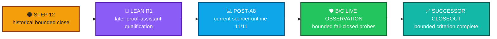

<div align="center">

# ALLIS — Post-A8 DGM Correspondence Closeout

### Successor closeout for the bounded DGM source/runtime and theorem-specific correspondence revalidation

**Closeout determination: COMPLETE FOR THE BOUNDED POST-A8 CORRESPONDENCE CRITERION**

<br>


<br>

**Kidd’s Technical Services · ALLIS**

</div>

---

> [!IMPORTANT]
> This is a **successor closeout** for the bounded post-A8 DGM correspondence work.
>
> It does **not** rewrite or replace the historical Step-12 closeout, the Step-12 final seal, or the Lean R1 closeout.
>
> The historical records remain authoritative for what they established at their own close/seal boundaries. This record closes the later post-A8 correspondence criterion using successor evidence.

---

# 👀 Closeout in one view

| Closeout field | Current bounded state |
|---|---|
| Formal object | `DGM_PRODUCTION_AUTHORIZED_ADOPTION_MODEL_V1` |
| Production source commit | `20c8cbe175781c8a1c05d65c03977859ceca884a` |
| Production source tree | `8d0840f076e84b4033ff398f602fb81a6d6e29f2` |
| Canonical theorem-relevant source set | `11` files |
| Immutable source identity | `PASS_11_OF_11` |
| Current NBB source/runtime correspondence | `PASS_11_OF_11` |
| Current worker source/runtime correspondence | `PASS_11_OF_11` |
| Combined current source/runtime correspondence | `PASS_11_OF_11` |
| `T12D-A` | `MACHINE_CHECKED` |
| `T12D-B` | `CORRESPONDENCE_VERIFIED` |
| `T12D-C` | `CORRESPONDENCE_VERIFIED` |
| `P12C-09` | `MACHINE_CHECKED_DISPROVEN` |
| Current correspondence-verified proposition count | `2` |
| Real production authorization issued | `NO` |
| Real production authorization consumed | `NO` |
| Real production DGM patch application | `NO` |
| Production-mutation safety theorem proven | `NO` |
| Whole-system safety theorem proven | `NO` |
| Whole system proven | `SYSTEM_PROVEN=NO` |

The controlling current source/runtime result is:

```text
CURRENT_POST_A8_DGM_SOURCE_TO_RUNTIME_CORRESPONDENCE=PASS_11_OF_11
```

The current theorem vector is:

```text
T12D-A = MACHINE_CHECKED
T12D-B = CORRESPONDENCE_VERIFIED
T12D-C = CORRESPONDENCE_VERIFIED
P12C-09 = MACHINE_CHECKED_DISPROVEN
```

---

# 🎯 Closeout question

This successor workstream answers:

> **After the historical Step-12 close and later Lean R1 proof-assistant qualification, does the same bounded theorem-relevant DGM source still correspond to the observed current NBB and worker runtimes, and do the safely observable theorem-specific B/C fail-closed behaviors still correspond?**

For the bounded criterion evaluated here:

```text
YES
```

The current correspondence-verified proposition count is:

```text
CURRENT_CORRESPONDENCE_VERIFIED_COUNT=2
```

Those propositions are:

```text
T12D-B
T12D-C
```

The positive authorized-application path required to promote `T12D-A` was deliberately not executed.

---

# 🕰️ Evidence chronology



The chronology is controlling:

```text
historical Step-12 close
    ↓
later Lean R1 qualification
    ↓
post-A8 current source/runtime revalidation
    ↓
post-A8 theorem-specific B/C live observation
    ↓
this successor closeout
```

No predecessor closeout is rewritten by this sequence.

---

# 📐 Formal and proof relationship

The bounded formal object remains:

```text
DGM_PRODUCTION_AUTHORIZED_ADOPTION_MODEL_V1
```

The later Lean R1 work independently kernel-checked the principal Step-12 result set.

The supported principal Lean results are:

```text
T12D_A_LEAN_KERNEL_CHECKED=YES
T12D_B_LEAN_KERNEL_CHECKED=YES
T12D_C_LEAN_KERNEL_CHECKED=YES

P12C_09_LOGICAL_RESULT=DISPROVEN
P12C_09_COUNTEREXAMPLE_LEAN_KERNEL_CHECKED=YES
```

The qualified principal theorem-level axiom report is:

```text
T12D_A_AXIOMS=NONE
T12D_B_AXIOMS=NONE
T12D_C_AXIOMS=NONE
P12C_09_AXIOMS=NONE
```

The Lean R1 closeout correctly preserved that Lean-to-production correspondence had not yet been established at the time Lean R1 closed.

This post-A8 closeout does not rewrite that historical fact.

Instead:

```text
Lean R1
    =
later proof-assistant qualification

post-A8 correspondence work
    =
later implementation/runtime bridge
```

---

# 💻 Current source/runtime result

The theorem-relevant production source remains anchored to:

```text
SOURCE_COMMIT=
20c8cbe175781c8a1c05d65c03977859ceca884a

SOURCE_TREE=
8d0840f076e84b4033ff398f602fb81a6d6e29f2

CANONICAL_SOURCE_SET_CARDINALITY=11
```

The immutable source identity revalidation result is:

```text
IMMUTABLE_SOURCE_IDENTITY=PASS_11_OF_11
```

Current runtime correspondence is:

```text
NBB_SOURCE_TO_RUNTIME_CORRESPONDENCE=PASS_11_OF_11

WORKER_SOURCE_TO_RUNTIME_CORRESPONDENCE=PASS_11_OF_11

CURRENT_POST_A8_DGM_SOURCE_TO_RUNTIME_CORRESPONDENCE=PASS_11_OF_11
```

This is a point-in-time correspondence result.

It does not guarantee correspondence for every future source or runtime state.

---

# 🛡️ T12D-B — current correspondence-verified result

The bounded claim is:

```text
invalid external authorization
    ⇒
no authorized-spool publication
```

The later post-A8 live observation exercised the current validation/publication boundary using deliberately invalid authorization material.

Observed bounded result:

```text
T12D_B_LIVE_OBSERVATION=PASS
T12D_B_POST_A8_CORRESPONDENCE_VERIFIED=YES
T12D_B_POST_A8_VALIDATION_LEVEL=CORRESPONDENCE_VERIFIED
```

The fail-closed postconditions included:

```text
no authorized-spool publication
no authorization consumption
no receipt
```

Therefore the current validation remains:

```text
T12D-B = CORRESPONDENCE_VERIFIED
```

---

# 📴 T12D-C — current correspondence-verified result

The bounded claim is:

```text
empty authorized incoming spool
    ⇒
no worker claim
    ⇒
no authorized apply
```

The later post-A8 worker observation preserved an empty incoming/claimed state and did not create work merely to make the observation pass.

Observed bounded result:

```text
T12D_C_LIVE_OBSERVATION=PASS
T12D_C_POST_A8_CORRESPONDENCE_VERIFIED=YES
T12D_C_POST_A8_VALIDATION_LEVEL=CORRESPONDENCE_VERIFIED
```

The fail-closed postconditions included:

```text
no worker claim
no authorization consumption
no receipt
no authorized apply
```

Therefore the current validation remains:

```text
T12D-C = CORRESPONDENCE_VERIFIED
```

---

# 🚧 T12D-A — intentionally not promoted

`T12D-A` is formally proven and later Lean kernel checked.

Its theorem-relevant source participates in the current 11/11 source/runtime correspondence.

But current correspondence verification for `T12D-A` would require a positive authorized-application live observation.

That path was deliberately not executed.

```text
T12D_A_POSITIVE_AUTHORIZED_APPLY_EXECUTED=NO
T12D_A_CURRENT_CORRESPONDENCE_VERIFIED=NO
T12D_A_CURRENT_VALIDATION_LEVEL=MACHINE_CHECKED
```

Therefore:

```text
T12D-A = MACHINE_CHECKED
```

The success of the B/C correspondence work does not promote A.

---

# 🔴 P12C-09 — preserved negative result

The proposed unconditional terminal-totality property remains disproven.

The current supported negative-result record is:

```text
P12C_09_LOGICAL_RESULT=DISPROVEN
P12C_09_COUNTEREXAMPLE_LEAN_KERNEL_CHECKED=YES
P12C_09_CURRENT_VALIDATION_LEVEL=MACHINE_CHECKED_DISPROVEN
```

The preserved counterexample remains part of the accepted evidence chain.

The refined replacement proposition remains separate and unpromoted.

Therefore:

```text
P12C-09 = MACHINE_CHECKED_DISPROVEN
```

---

# 📊 Bounded promotion count

This successor workstream supports current `CORRESPONDENCE_VERIFIED` status for exactly:

```text
2
```

propositions:

```text
T12D-B
T12D-C
```

Expressed as the current registry value:

```text
CURRENT_CORRESPONDENCE_VERIFIED_COUNT=2
```

This count does not include `T12D-A`.

It does not convert the negative P12C-09 result into a positive theorem.

---

# 🔐 Production-action boundary

The post-A8 revalidation was deliberately bounded.

It did not require or perform a real positive production authorization or DGM mutation.

```text
REAL_PRODUCTION_AUTHORIZATION_ISSUED=NO
REAL_PRODUCTION_AUTHORIZATION_CONSUMED=NO
REAL_PRODUCTION_DGM_PATCH_APPLICATION=NO
```

Therefore this closeout does not create:

```text
production mutation authority
```

and does not establish:

```text
PRODUCTION_MUTATION_SAFETY_THEOREM_PROVEN=YES
```

The controlling boundary remains:

```text
PRODUCTION_MUTATION_SAFETY_THEOREM_PROVEN=NO
```

---

# 🌐 Whole-system boundary

The bounded post-A8 correspondence result does not establish a theorem over the whole ALLIS platform.

It does not establish:

```text
WHOLE_SYSTEM_SAFETY_THEOREM_PROVEN=YES
```

The controlling boundary remains:

```text
WHOLE_SYSTEM_SAFETY_THEOREM_PROVEN=NO
SYSTEM_PROVEN=NO
```

This closeout concerns only the bounded theorem-relevant DGM authorized-adoption domain.

---

# 🧱 Source-byte correspondence is not behavioral proof

The post-A8 work preserves a required distinction:

```text
source/runtime bytes correspond
    ≠
theorem-specific behavior observed
```

The current criterion for the B/C promotion required:

```text
machine-checked theorem
    +
current source/runtime correspondence
    +
current theorem-specific live observation
```

Conceptually:

```text
MC(T,S) AND C_SR(S,R) AND LiveObs(T,R)
```

This is why B/C could reach current `CORRESPONDENCE_VERIFIED` status while A remained `MACHINE_CHECKED`.

---

# 🕒 Observation-specific boundary

The current source/runtime result belongs to the post-A8 observation epoch.

It is not perpetual.

```text
corresponded during this qualification
    ≠
guaranteed correspondence forever
```

A theorem-relevant change to source identity, runtime bytes, authorization behavior, spool behavior, or another claim-bearing boundary requires fresh revalidation before the current correspondence claim is carried forward.

---

# 🌐 A8 frontend/private-context separation

The label **post-A8** identifies the observation epoch for this DGM correspondence work.

It does not mean the A8 frontend/private-context surface is the DGM theorem runtime.

```text
A8 frontend/private context
    ≠
DGM theorem runtime
```

Likewise:

```text
A8 private user context
    ≠
H_people current runtime authority
```

This closeout does not admit an A8 production build/deployment identity and does not create H_people runtime correspondence.

Those remain separate evidence questions.

---

# 🧾 Closeout determination

The bounded post-A8 DGM correspondence criterion is complete.

The closeout state is accurately summarized as:

```text
POST_A8_DGM_THEOREM_CORRESPONDENCE_REGISTRY_R1=PASS

CURRENT_POST_A8_DGM_SOURCE_TO_RUNTIME_CORRESPONDENCE=PASS_11_OF_11

T12D_A_CURRENT_VALIDATION_LEVEL=MACHINE_CHECKED

T12D_B_CURRENT_VALIDATION_LEVEL=CORRESPONDENCE_VERIFIED

T12D_C_CURRENT_VALIDATION_LEVEL=CORRESPONDENCE_VERIFIED

P12C_09_CURRENT_VALIDATION_LEVEL=MACHINE_CHECKED_DISPROVEN

CURRENT_CORRESPONDENCE_VERIFIED_COUNT=2

REAL_PRODUCTION_AUTHORIZATION_ISSUED=NO
REAL_PRODUCTION_AUTHORIZATION_CONSUMED=NO
REAL_PRODUCTION_DGM_PATCH_APPLICATION=NO

PRODUCTION_MUTATION_SAFETY_THEOREM_PROVEN=NO
WHOLE_SYSTEM_SAFETY_THEOREM_PROVEN=NO

SYSTEM_PROVEN=NO
```

No additional theorem promotion is implied by this closeout.

No production action is authorized by this closeout.

No historical closeout is rewritten by this closeout.

---

# 🔗 Relationship to predecessor and successor records

This closeout should be read in chronology with:

- [Historical DGM Step-12 closeout](dgm-step12-close.md)
- [Lean R1 proof-assistant closeout](../../formal-verification/authorized-adoption/lean/workstream-closeout-r1.md)
- [Post-A8 DGM theorem correspondence registry R1](../../evidence/governed-evolution/post-a8-theorem-correspondence-registry-r1.md)
- [Authorized-adoption model → source correspondence](../../correspondence/authorized-adoption/model-to-source.md)
- [Authorized-adoption source → runtime correspondence](../../correspondence/authorized-adoption/source-to-runtime.md)
- [Current theorem registry](../../formal-verification/authorized-adoption/theorem-registry.md)
- [Current counterexample registry](../../formal-verification/authorized-adoption/counterexample-registry.md)

The chronology is:

```text
dgm-step12-close.md
    ↓
lean/workstream-closeout-r1.md
    ↓
post-a8-theorem-correspondence-registry-r1.md
    ↓
post-a8-dgm-correspondence-close.md
```

The historical Step-12 closeout remains unchanged.

The Lean R1 closeout remains unchanged.

The public-safe post-A8 registry remains the evidence record for the successor observation.

This file records acceptance-layer closure of that bounded successor correspondence criterion.

---

# ✅ Final bounded status

<div align="center">

### 💻 CURRENT SOURCE/RUNTIME
# `PASS_11_OF_11`

### 🔗 CURRENT CORRESPONDENCE-VERIFIED PROPOSITIONS
# **2**

**`T12D-B` · `T12D-C`**

### 🚧 POSITIVE APPLY
**`T12D-A = MACHINE_CHECKED`**

**positive authorized apply not executed**

### 🔴 PRESERVED NEGATIVE RESULT
**`P12C-09 = MACHINE_CHECKED_DISPROVEN`**

### 🔐 REAL PRODUCTION AUTHORIZATION / PATCH
# **NO**

### ⚪ WHOLE-SYSTEM BOUNDARY
# `SYSTEM_PROVEN=NO`

</div>

---

# Governing closeout statement

> **The post-A8 DGM correspondence work closes successfully for its bounded criterion because the theorem-relevant source was revalidated against the observed current runtimes, B/C received the required theorem-specific live observations, A remained deliberately unpromoted without a positive production apply, and the P12C-09 disproof remained preserved.**

> **Successor evidence strengthens the current bounded record without rewriting the historical Step-12 or Lean R1 closeouts.**

> **Evidence may justify a claim. It does not create authority beyond the claim that was actually earned.**
