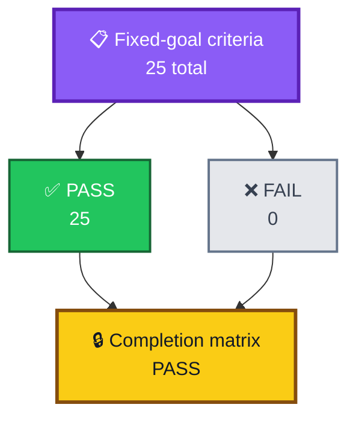
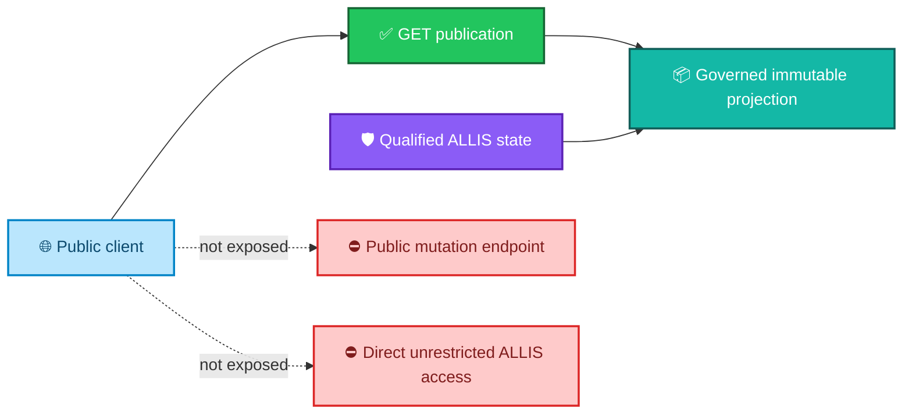
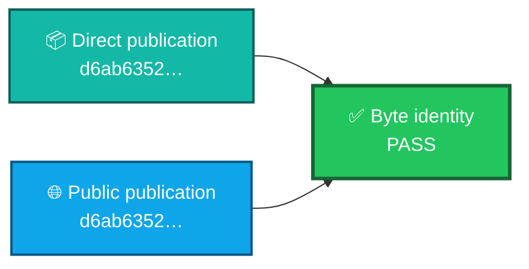
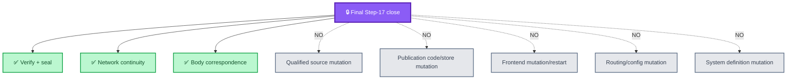
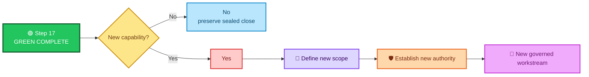
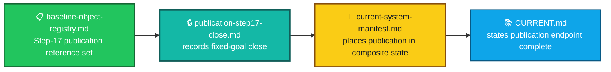

<div align="center">

# ALLIS — Publication Step 17 Closeout

### Governed public publication, network continuity, and Evidence & Governance Portal close

**Final state: `GREEN_COMPLETE`**

<br>


<br>

**Kidd’s Technical Services · ALLIS**

</div>

---

> [!IMPORTANT]
> Publication Step 17 is **complete**.
>
> Steps 0–17 are green, the fixed-goal completion matrix is 25/25 PASS, final network continuity is green, the governed publication endpoint is complete, the Evidence & Governance Portal was live at the final observation, and the final completion seal verified without modifying production during closeout.

---

# 👀 Final result at a glance

| Closeout field | Final state |
|---|---|
| **Step range** | `0–17` |
| **All steps** | ✅ `GREEN` |
| **Completion matrix** | ✅ `25 / 25 PASS` |
| **Failure count** | `0` |
| **Final network continuity** | ✅ `GREEN` |
| **Live publication endpoint** | ✅ `COMPLETE` |
| **Evidence & Governance Portal** | ✅ `LIVE` at final observation |
| **Publication ID** | `allis-publication-step6-retention-v2` |
| **Publication SHA-256** | `d6ab63522f9080fae440578ebbb6ed42140595155c9a30253f5b8eeeef8009b7` |
| **Publication payload SHA-256** | `04ebb5bc1f97cbf56b8722fea9bcc7e7303cac2f5b467510d7a821d84d4a3c3c` |
| **Frontend build** | `5By6R3CWTM7NDXc-4lmSi` |
| **Direct/public body correspondence** | ✅ `PASS` |
| **Final completion manifest verification** | ✅ `PASS` |
| **Overall goal** | **`GREEN_COMPLETE`** |
| **Production repair required** | `NO` |
| **Further implementation authority for fixed goal** | `NONE_REQUIRED_FOR_FIXED_GOAL` |

---

# 🎯 Closeout question

Step 17 answers:

> **Did the fixed-goal ALLIS publication path reach a governed, immutable, read-only public state with validated provenance, protected routing, GUI consumption, rollback and restart evidence, direct/public correspondence, and final network continuity—without requiring production mutation during final closeout?**

Final answer:

```text
YES
```

The controlling completion state is:

```text
STEP17_STATUS=GREEN_ALLIS_LIVE_PUBLICATION_ENDPOINT_COMPLETE
STEPS_0_THROUGH_17_GREEN=YES
OVERALL_GOAL_COMPLETE=YES
OVERALL_GOAL=GREEN_COMPLETE
```

---

# 🌐 Final publication path


Final public publication route:

```text
https://allis.pro/api/publication/latest
```

The public GUI consumes the governed publication through that publication boundary rather than receiving unrestricted direct access to ALLIS.

---

# 📦 Final publication identity

## Publication ID

```text
allis-publication-step6-retention-v2
```

## Publication SHA-256

```text
d6ab63522f9080fae440578ebbb6ed42140595155c9a30253f5b8eeeef8009b7
```

## Payload SHA-256

```text
04ebb5bc1f97cbf56b8722fea9bcc7e7303cac2f5b467510d7a821d84d4a3c3c
```

## Frontend build

```text
5By6R3CWTM7NDXc-4lmSi
```

These identities define the bounded final Step-17 observation.

They do not identify the complete ALLIS source tree or every runtime component.

---

# 🧾 Fixed-goal completion matrix

The final completion matrix reached:

```text
FINAL_CRITERION_COUNT=25
FINAL_CRITERION_PASS_COUNT=25
FINAL_CRITERION_FAILURE_COUNT=0
FINAL_FIXED_GOAL_COMPLETION_MATRIX=PASS
```

The final close output reports:

```text
FINAL_CRITERIA=25_OF_25_PASS
```



---

# ✅ Final completion domains

The final result reports the following completion domains as green:

| Domain | Final state |
|---|---|
| Public GET endpoint | 🟢 `GREEN` |
| Frozen schema validation | 🟢 `GREEN` |
| Reference resolution | 🟢 `GREEN` |
| Source and authority provenance | 🟢 `GREEN` |
| Publication integrity and identity | 🟢 `GREEN` |
| Immutable publication retention | 🟢 `GREEN` |
| Privacy and eligibility governance | 🟢 `GREEN` |
| Fail-closed behavior | 🟢 `GREEN` |
| Strict read-only publication boundary | 🟢 `GREEN` |
| No public mutation endpoint | 🟢 `GREEN` |
| Publication service isolation | 🟢 `GREEN` |
| Publication service loopback-only | 🟢 `GREEN` |
| Authorized Caddy routing | 🟢 `GREEN` |
| GUI live endpoint consumption | 🟢 `GREEN` |
| GUI no direct ALLIS access | 🟢 `GREEN` |
| GUI epistemic-state preservation | 🟢 `GREEN` |
| Restart persistence | 🟢 `GREEN` |
| Rollback demonstration | 🟢 `GREEN` |
| Source → publication → HTTP → GUI | 🟢 `GREEN` |
| Authorized infrastructure continuity | 🟢 `GREEN` |

These top-level domains summarize the bounded fixed-goal result. The controlling completion authority remains the 25-of-25 matrix and its sealed evidence.

---

# 🔒 Read-only public boundary

A central Step-17 result is that public availability does not create public mutation authority.



The final matrix records:

```text
STRICT_READ_ONLY_PUBLICATION_BOUNDARY=GREEN
NO_PUBLIC_MUTATION_ENDPOINT=GREEN
GUI_NO_DIRECT_ALLIS_ACCESS=GREEN
```

The public layer is a governed projection.

It is not a general-purpose control channel into ALLIS.

---

# 🛡️ Publication authority and provenance

Step 17 treats publication as an authority boundary.

A state object does not become publicly publishable merely because it exists.

The completed path preserves:

```text
qualified state
    ↓
publication eligibility
    ↓
validated publication object
    ↓
immutable retained publication
    ↓
authorized read-only route
    ↓
public evidence / GUI
```

The final matrix records:

```text
SOURCE_AND_AUTHORITY_PROVENANCE=GREEN
PUBLICATION_INTEGRITY_AND_IDENTITY=GREEN
IMMUTABLE_PUBLICATION_RETENTION=GREEN
PRIVACY_AND_ELIGIBILITY_GOVERNANCE=GREEN
```

---

# 🔐 Service isolation

The publication service was validated as a separately bounded public-read component.

The final matrix records:

```text
PUBLICATION_SERVICE_ISOLATION=GREEN
PUBLICATION_SERVICE_LOOPBACK_ONLY=GREEN
CADDY_AUTHORIZED_ROUTING=GREEN
```

The loopback boundary is important:

```text
publication service
    listens locally
        ↓
authorized public route
        ↓
public HTTPS
```

rather than:

```text
publication service
    directly exposed on wildcard/public listener
```

---

# 🔁 Loopback criterion

The final fixed-goal matrix required explicit loopback-only evidence.

The sealed state established:

```text
LOOPBACK_CRITERION_RESOLVED=PASS
```

with:

```text
recorded loopback listener count = 1
recorded wildcard listener count = 0
sealed loopback-only evidence = PASS
```

This repair corrected the **evidence-source crosswalk** for the loopback criterion.

It did not require production repair.

---

# 🌍 Final network continuity

The final continuity recovery completed on the first recovery attempt.

```text
PUBLIC_CONTINUITY_ATTEMPT=1
DNS_RC=0
PUBLICATION_CURL_RC=0
PUBLICATION_STATUS=200
GUI_CURL_RC=0
GUI_STATUS=200
PUBLIC_CONTINUITY_ATTEMPT_RESULT=PASS
```

Final result:

```text
PUBLIC_CONTINUITY_RECOVERED=YES
SUCCESSFUL_PUBLIC_CONTINUITY_ATTEMPT=1
PUBLIC_NETWORK_CONTINUITY=PASS
FINAL_NETWORK_CONTINUITY=GREEN
```


---

# 🔗 Direct/public body correspondence

The local/direct publication and public publication were compared by SHA-256.

```text
FINAL_DIRECT_SHA256=
d6ab63522f9080fae440578ebbb6ed42140595155c9a30253f5b8eeeef8009b7

FINAL_PUBLIC_SHA256=
d6ab63522f9080fae440578ebbb6ed42140595155c9a30253f5b8eeeef8009b7
```

Final result:

```text
FINAL_DIRECT_PUBLIC_BODY_CORRESPONDENCE=PASS
```



At the final observation boundary, the public publication body matched the sealed direct publication identity.

---

# 🌦️ Network failure adjudication

A prior final continuity attempt encountered a DNS timeout.

The fixed-goal matrix itself was already complete.

The later bounded continuity recovery established:

```text
NETWORK_FAILURE_CLASSIFICATION=
TRANSIENT_EXTERNAL_NAME_RESOLUTION_FAILURE_RECOVERED

FIXED_GOAL_MATRIX_25_OF_25=PASS
NETWORK_CONTINUITY_RECOVERY=PASS
PRODUCTION_REPAIR_REQUIRED=NO
TRANSIENT_DNS_ADJUDICATION=PASS
```

The recovered network state therefore did **not** require a production change.

The final close records the recovered state:

```text
FINAL_NETWORK_CONTINUITY=GREEN
```

---

# 🧪 Local production continuity

Before the final public continuity check, local production continuity passed.

Observed state included:

```text
FRONTEND_ACTIVE=active
FRONTEND_BUILD=5By6R3CWTM7NDXc-4lmSi

PUBLICATION_ACTIVE=active

DIRECT_PUBLICATION_STATUS=200
DIRECT_PUBLICATION_SHA256=
d6ab63522f9080fae440578ebbb6ed42140595155c9a30253f5b8eeeef8009b7

LOCAL_PRODUCTION_CONTINUITY=PASS
```

The final public check then established continuity through the public network path.

---

# 🔎 GUI consumption

The final publication closeout establishes:

```text
GUI_LIVE_ENDPOINT_CONSUMPTION=GREEN
GUI_NO_DIRECT_ALLIS_ACCESS=GREEN
GUI_EPISTEMIC_STATE_PRESERVATION=GREEN
```



```mermaid
flowchart LR
    A["🧠 Qualified / published state"]:::state
    B["📦 Governed publication"]:::publication
    C["🌐 Public GET endpoint"]:::endpoint
    D["🔎 Evidence & Governance Portal"]:::gui

    X["⛔ Direct ALLIS control access"]:::blocked

    A --> B --> C --> D
    D -. "not granted" .-> X

    classDef state fill:#8b5cf6,stroke:#5b21b6,color:#ffffff,stroke-width:2px;
    classDef publication fill:#14b8a6,stroke:#115e59,color:#ffffff,stroke-width:2px;
    classDef endpoint fill:#0ea5e9,stroke:#075985,color:#ffffff,stroke-width:2px;
    classDef gui fill:#f0abfc,stroke:#c026d3,color:#701a75,stroke-width:2px;
    classDef blocked fill:#fecaca,stroke:#dc2626,color:#7f1d1d,stroke-width:2px;
```

This preserves the distinction between:

```text
view governed evidence
    ≠
control ALLIS directly
```

---

# ♻️ Restart persistence and rollback

The fixed-goal completion matrix records:

```text
RESTART_PERSISTENCE=GREEN
ROLLBACK_DEMONSTRATION=GREEN
```

These results establish that the bounded publication architecture was tested for:

- persistence across restart; and
- physical rollback/restoration behavior.

The final close narrative also records continuity of the prior sealed evidence used by the completed path.

---

# 🧾 Final completion seal

Step 17 created and verified the final completion manifest:

```text
STEP17_FINAL_MANIFEST_CREATED=PASS
STEP17_FINAL_MANIFEST_VERIFICATION=PASS
```

The final verification included the completed Step-17 report, fixed-goal criteria, browser evidence, loopback repair evidence, network continuity evidence, direct/public publication objects, public headers, and final audit.

Predecessor seal continuity also passed:

```text
STEP16_FINAL_SEAL_AFTER_COMPLETION=PASS
STEP17_R1A_SEAL_AFTER_COMPLETION=PASS
```

This preserves the evidence chain into the final Step-17 close.

---

# 📚 Authoritative closeout artifacts

The engineering close records identify these final artifacts:

```text
docs/publication/STEP17_FINAL_COMPLETION.md
docs/publication/STEP17_FINAL_SHA256SUMS.txt

build/step17/r2r2/step17-final-audit.json
build/step17/r2r1/final-fixed-goal-criteria-r1.json
```

The final SHA-256 manifest also verified the supporting evidence set used by the close.

This public closeout summarizes those records without replacing them.

---

# 🔒 Final nonmutation boundary

The final Step-17 closeout was read-only with respect to production state.

```text
SUDO_INVOKED=NO

QUALIFIED_SOURCE_MODIFIED=NO

PUBLICATION_CODE_MODIFIED=NO
PUBLICATION_STORE_MODIFIED=NO
PUBLICATION_SERVICE_RESTARTED=NO

FRONTEND_SOURCE_MODIFIED=NO
FRONTEND_RUNTIME_MODIFIED=NO
FRONTEND_RESTARTED=NO

CADDYFILE_MODIFIED=NO
CADDY_RELOADED=NO

CLOUDFLARED_MODIFIED=NO
SYSTEMD_DEFINITION_MODIFIED=NO
```



The fixed goal therefore reached final close **without using final closeout as an excuse to alter production**.

---

# 🧱 What Step 17 establishes

Within the fixed publication goal, Step 17 establishes:

- public GET publication;
- frozen schema validation;
- reference resolution;
- source and authority provenance;
- publication integrity and identity;
- immutable publication retention;
- privacy and publication-eligibility governance;
- fail-closed behavior;
- strict read-only publication boundary;
- no public mutation endpoint;
- publication service isolation;
- loopback-only publication service;
- authorized Caddy routing;
- live GUI publication consumption;
- no unrestricted GUI-to-ALLIS access;
- GUI epistemic-state preservation;
- restart persistence;
- rollback demonstration;
- source → publication → HTTP → GUI correspondence;
- authorized infrastructure continuity;
- final public network continuity;
- direct/public publication-body correspondence;
- final evidence-manifest verification; and
- production nonmutation during final closeout.

The final close narrative also reports Landlock runtime provenance among the demonstrated governance/security properties of the completed publication architecture.

---

# ⚪ What Step 17 does not establish

This closeout is bounded to the completed publication fixed goal.

It does not establish:

- unrestricted public access to internal ALLIS state;
- public write authority;
- a public mutation endpoint;
- automatic authority for new publication contents;
- automatic authority for expanded GUI functions;
- automatic authority for write-capable workflows;
- automatic authority for Ms. Allis interaction through this public boundary;
- permanent future network correspondence;
- whole-system proof.

The fixed-goal close does not alter:

```text
SYSTEM_PROVEN=NO
```

---

# 🕒 Point-in-time runtime meaning

Step-17 runtime and network observations are time-specific.

The final close establishes that, at the final sealed observation:

```text
publication service = active
frontend = active
direct publication = HTTP 200
public publication = HTTP 200
GUI /evidence = HTTP 200
direct/public body correspondence = PASS
network continuity = GREEN
```

It does not assert that future runtime state can never change.

A later claim-bearing runtime or publication change requires renewed qualification and correspondence.

---

# 🛡️ Fixed-goal authority boundary

The final result states:

```text
FURTHER_IMPLEMENTATION_AUTHORITY=
NONE_REQUIRED_FOR_FIXED_GOAL
```

This means the defined fixed goal is complete.

It does **not** mean unlimited future implementation authority exists.

The stronger successor rule is:

```text
new capability
    ⇒
new governed workstream
```

Examples of new scope include:

- new publication contents;
- new public claims;
- expanded GUI functions;
- write-capable workflows;
- Ms. Allis interaction;
- additional endpoints;
- broader authority surfaces.

Each belongs in a new workstream with its own:

- scope;
- authority;
- acceptance criteria;
- evidence; and
- closeout.

---

# 🚫 No Step 18 for this fixed goal

<div align="center">

# **NO STEP 18**

### for the completed Step-17 fixed goal

</div>

The final engineering record is explicit:

```text
There is no Step 18 for this fixed goal.
```

The proper post-close state is to preserve the sealed evidence.

Do not continue modifying the workstream simply because additional capability is possible.



---

# 🧩 Relationship to acceptance records



## Related records

- [`README.md`](README.md) — acceptance-closeout folder guide
- [`../baseline-object-registry.md`](../baseline-object-registry.md) — role-scoped baseline and publication reference registry
- [`../current-system-manifest.md`](../current-system-manifest.md) — composite qualified-object manifest
- [`../../CURRENT.md`](../../CURRENT.md) — current qualified technical state
- [`../../README.md`](../../README.md) — ALLIS repository front door

The publication evidence and correspondence packages provide the lower-level records behind this closeout.

---

# 📦 Normalized closeout record

```yaml
publication_step17_closeout:
  step: 17
  scope: governed_publication_fixed_goal

  completion:
    steps_0_through_17: GREEN
    final_criteria_total: 25
    final_criteria_pass: 25
    final_criteria_fail: 0
    final_network_continuity: GREEN
    overall_goal: GREEN_COMPLETE

  publication:
    id: allis-publication-step6-retention-v2
    sha256: d6ab63522f9080fae440578ebbb6ed42140595155c9a30253f5b8eeeef8009b7
    payload_sha256: 04ebb5bc1f97cbf56b8722fea9bcc7e7303cac2f5b467510d7a821d84d4a3c3c

  frontend:
    build: 5By6R3CWTM7NDXc-4lmSi

  public_state:
    live_publication_endpoint: COMPLETE
    evidence_governance_portal: LIVE_AT_FINAL_OBSERVATION
    publication_http_status: 200
    gui_http_status: 200

  correspondence:
    direct_sha256: d6ab63522f9080fae440578ebbb6ed42140595155c9a30253f5b8eeeef8009b7
    public_sha256: d6ab63522f9080fae440578ebbb6ed42140595155c9a30253f5b8eeeef8009b7
    direct_public_body: PASS
    source_to_publication_to_http_to_gui: GREEN

  network:
    public_continuity_recovered: true
    successful_recovery_attempt: 1
    failure_classification: TRANSIENT_EXTERNAL_NAME_RESOLUTION_FAILURE_RECOVERED
    production_repair_required: false

  seal:
    final_manifest_created: PASS
    final_manifest_verification: PASS
    step16_predecessor_seal_continuity: PASS
    step17_r1a_predecessor_seal_continuity: PASS

  nonmutation:
    sudo_invoked: false
    qualified_source_modified: false
    publication_code_modified: false
    publication_store_modified: false
    publication_service_restarted: false
    frontend_source_modified: false
    frontend_runtime_modified: false
    frontend_restarted: false
    caddyfile_modified: false
    caddy_reloaded: false
    cloudflared_modified: false
    systemd_definition_modified: false

  post_close:
    further_implementation_authority_for_fixed_goal: NONE_REQUIRED_FOR_FIXED_GOAL
    automatic_step18: false
    new_capability_requires_new_governed_workstream: true

  system_boundary:
    system_proven: false
```

> [!NOTE]
> This YAML block is a human-readable normalized view of the closeout. The sealed publication, audit, criteria, network-continuity, and SHA-256 evidence records remain the authority for the completed Step-17 result.

---

# 🧾 Final closeout statement

<div align="center">

### ✅ Steps
**0–17 GREEN**

### 📋 Completion matrix
**25 / 25 PASS**

### 🌍 Final network continuity
**GREEN**

### 📦 Publication
**`allis-publication-step6-retention-v2`**

### 🔗 Direct/public correspondence
**PASS**

### 🔎 Evidence & Governance Portal
**LIVE at final observation**

### 🔒 Production during final closeout
**UNMODIFIED**

### 🟢 Overall goal
# `GREEN_COMPLETE`

### 🚫 Successor state
# **NO STEP 18 FOR THIS FIXED GOAL**

</div>

---

# Governing closeout principles

> **Public availability does not create public mutation authority.**

> **Publication is a governed projection, not unrestricted ALLIS access.**

> **An immutable publication identity remains distinct from the runtime that serves it.**

> **Direct/public correspondence is time-specific.**

> **A transient external network failure does not require production repair when the sealed production state remains valid and continuity later passes.**

> **Final closeout verification must not manufacture success by mutating production.**

> **The fixed goal is complete. New capability requires a new governed workstream.**
