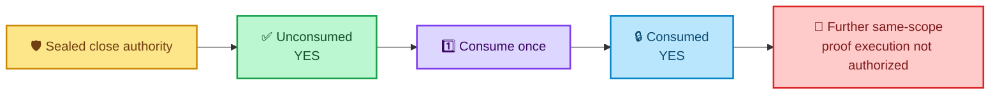
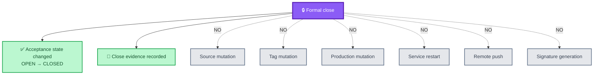
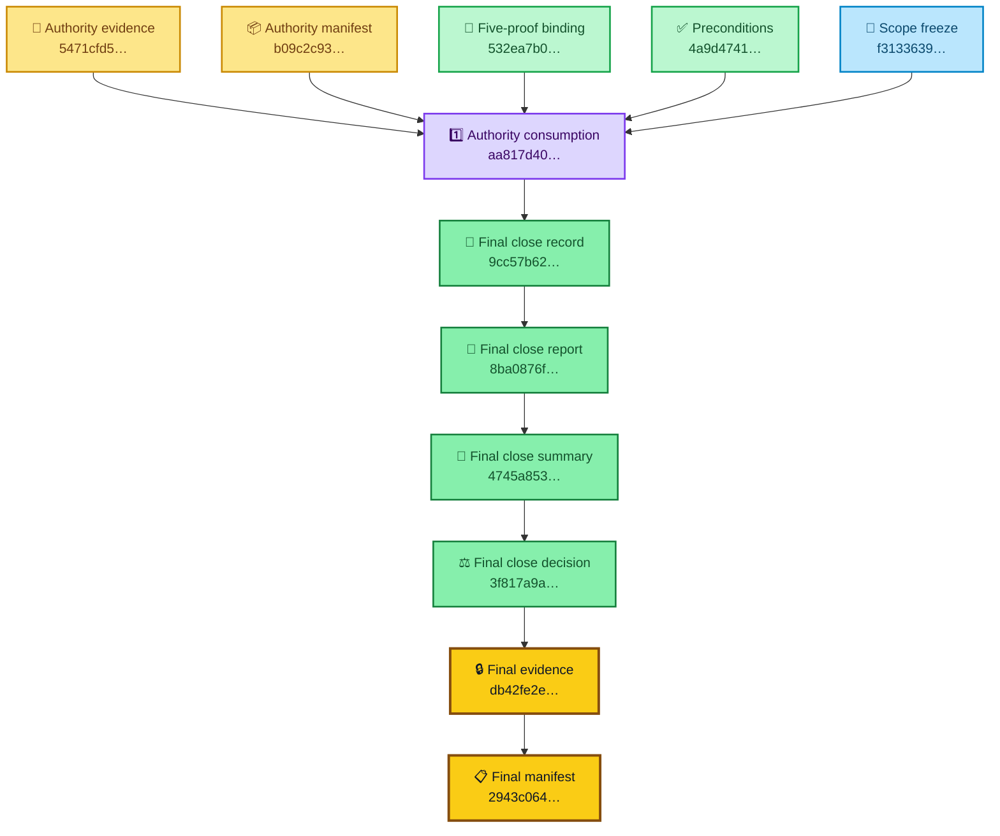
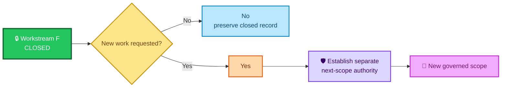
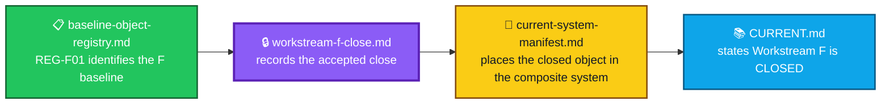

<div align="center">

# ALLIS — Workstream F Closeout

### Formal acceptance close for Workstream F

**Final state: `CLOSED`**

<br>


<br>

**Kidd’s Technical Services · ALLIS**

</div>

---

> [!IMPORTANT]
> Workstream F is **formally closed**.
>
> The five proof obligations were complete, close eligibility was established, the sealed one-time close authority was consumed exactly once, the formal state transition from `OPEN` to `CLOSED` passed, and the qualified source remained unchanged through final revalidation.

---

# 👀 Final result at a glance

| Closeout field | Final state |
|---|---|
| **Pre-state** | `OPEN` |
| **Authorized post-state** | `CLOSED` |
| **F1** | ✅ `CLOSED` |
| **F2** | ✅ `CLOSED` |
| **F3** | ✅ `CLOSED` |
| **F4** | ✅ `CLOSED` |
| **F5** | ✅ `CLOSED` |
| **Proofs closed** | `5` |
| **Proof target** | `5` |
| **Close eligible** | `YES` |
| **Formal state transition** | `PASS` |
| **Formal close** | `PASS` |
| **Final Workstream-F status** | **`CLOSED`** |
| **Further Workstream-F proof execution authorized** | `NO` |

Final successor state:

```text
WORKSTREAM_F_COMPLETE_AWAIT_SEPARATE_NEXT_SCOPE_AUTHORITY
```

---

# 🌈 Closeout path


### In plain English

Workstream F did not close merely because the proof count reached 5/5.

The close record distinguishes:

```text
proof obligations complete
    ↓
close eligibility established
    ↓
formal-close authority verified
    ↓
one-time authority consumed
    ↓
state transition executed
    ↓
CLOSED
```

That separation preserves the ALLIS rule:

> **State does not become authority merely because it exists.**

---

# 🎯 Closeout question

This closeout answers:

> **Did Workstream F satisfy its five-proof close preconditions and complete the authorized formal transition from `OPEN` to `CLOSED` against the qualified source?**

Final answer:

```text
YES
```

Supported by:

```text
WORKSTREAM_F_PROOFS_CLOSED=5
WORKSTREAM_F_PROOF_TARGET=5
WORKSTREAM_F_CLOSE_ELIGIBLE=YES
WORKSTREAM_F_FORMAL_STATE_TRANSITION=PASS
WORKSTREAM_F_FORMAL_CLOSE=PASS
WORKSTREAM_F_STATUS=CLOSED
```

---

# 💻 Qualified source

The formal close was bound to the qualified source below.

```text
Branch:
remediation/active-source-baseline-20260902

HEAD:
65b9f7dbd594ec9d225152aabd705eefc9216dbb

Tag:
stage10-auth-identity-65b9f7dbd594
```

## Initial source verification

```text
CURRENT_BRANCH=remediation/active-source-baseline-20260902
CURRENT_HEAD=65b9f7dbd594ec9d225152aabd705eefc9216dbb
CURRENT_TAG_TARGET=65b9f7dbd594ec9d225152aabd705eefc9216dbb
QUALIFIED_SOURCE_BINDING=PASS
```

## Final source revalidation

```text
FINAL_BRANCH=remediation/active-source-baseline-20260902
FINAL_HEAD=65b9f7dbd594ec9d225152aabd705eefc9216dbb
FINAL_TAG_TARGET=65b9f7dbd594ec9d225152aabd705eefc9216dbb
FINAL_QUALIFIED_SOURCE_UNCHANGED=PASS
```

The source identity therefore remained stable across the formal-close operation.

---

# 🧾 Five-proof close preconditions

Workstream F entered formal close with all five proof obligations complete.

```text
WORKSTREAM_F_PROOFS_CLOSED=5
WORKSTREAM_F_PROOF_TARGET=5
```

The sealed five-proof chain was bound by:

```text
WORKSTREAM_F_FIVE_PROOF_CHAIN_BINDING_SHA256=
532ea7b0959939d9ee389541187874314b76f4f5f8142ec676c521bafcf7440c
```

Binding result:

```text
WORKSTREAM_F_FIVE_PROOF_CHAIN_BINDING=PASS
```

Formal-close preconditions:

```text
WORKSTREAM_F_FORMAL_CLOSE_PRECONDITIONS_SHA256=
4a9d4741fc710a61664967bb038c200a0b18d89c5c9ddb68da2a2fbc24817ba0
```

Result:

```text
WORKSTREAM_F_FORMAL_CLOSE_PRECONDITIONS=PASS
WORKSTREAM_F_FORMAL_CLOSE_PRECONDITION_BINDING=PASS
```

---

# 📐 Formal-close scope

The formal-close scope was frozen before execution.

```text
WORKSTREAM_F_FORMAL_CLOSE_SCOPE_SHA256=
f3133639004c5e2ab9de2bfdd59d20e0c77f6f3ee56f3376230054ebc1c27af5

WORKSTREAM_F_FORMAL_CLOSE_SCOPE_ROW_COUNT=6
```

Scope result:

```text
WORKSTREAM_F_FORMAL_CLOSE_SCOPE_FREEZE=PASS
```

The associated policy freeze also passed:

```text
WORKSTREAM_F_FORMAL_CLOSE_POLICY_FREEZE=PASS
```

This closeout applies to that bounded, sealed Workstream-F close scope.

---

# 🛡️ Formal-close authority

Workstream F used a dedicated formal-close authority rather than deriving close permission from the proof state alone.

## Sealed authority package

```text
WORKSTREAM_F_FORMAL_CLOSE_AUTHORITY_EVIDENCE_SHA256=
5471cfd516348d3203b94f8547b0cc212b9ddedcb5850beea527db11c0f4a8d0

WORKSTREAM_F_FORMAL_CLOSE_AUTHORITY_MANIFEST_SHA256=
b09c2c93f503fec22455e1d4a359edeedc30d3029bc651c05ed7c4023f4279a6

WORKSTREAM_F_FORMAL_CLOSE_AUTHORITY_ARTIFACT_COUNT=7
```

Authority results:

```text
WORKSTREAM_F_FORMAL_CLOSE_AUTHORITY=PASS
WORKSTREAM_F_FORMAL_CLOSE_AUTHORITY_PROVENANCE=PASS
WORKSTREAM_F_FORMAL_CLOSE_AUTHORITY_DECISION=PASS
SEALED_WORKSTREAM_F_FORMAL_CLOSE_AUTHORITY_BINDING=PASS
```

## Close authorization

Before execution:

```text
WORKSTREAM_F_CLOSE_ELIGIBLE=YES
WORKSTREAM_F_FORMAL_CLOSE_AUTHORIZATION=YES
MAX_WORKSTREAM_F_FORMAL_CLOSE_EXECUTION_COUNT=1
WORKSTREAM_F_STATUS=OPEN
```

The authority was therefore:

- scoped to the formal Workstream-F close;
- bound to the sealed close evidence;
- limited to one execution;
- authorized to transition `OPEN → CLOSED`.

---

# 1️⃣ One-time authority consumption

The close authority was confirmed unconsumed before the state transition.

```text
WORKSTREAM_F_FORMAL_CLOSE_AUTHORITY_UNCONSUMED=YES
```

It was then consumed exactly once.

```text
WORKSTREAM_F_FORMAL_CLOSE_AUTHORITY_CONSUMPTION_SHA256=
aa817d40cac62d3aa3490a5c0b3d9010b6e9ace6fecfc6dc304264a77656d8

WORKSTREAM_F_FORMAL_CLOSE_AUTHORITY_CONSUMED=YES
WORKSTREAM_F_FORMAL_CLOSE_EXECUTION_COUNT=1
```



This provides a durable replay boundary for the close operation.

---

# 🔄 Formal state transition

The authorized transition was:

```text
WORKSTREAM_F_PRE_STATE=OPEN
WORKSTREAM_F_AUTHORIZED_POST_STATE=CLOSED
```

Execution result:

```text
WORKSTREAM_F_FORMAL_STATE_TRANSITION=PASS
WORKSTREAM_F_FORMAL_CLOSE=PASS
```

The transition record identity is:

```text
WORKSTREAM_F_FORMAL_CLOSE_RECORD_SHA256=
9cc57b62c709f4bc1a8914ceec4cbfcd9be57d71687eb5eabeae764d77d1967a
```

The final formal-close report identity is:

```text
WORKSTREAM_F_FORMAL_CLOSE_REPORT_SHA256=
8ba0876ffb7b398f07b9f7979880c48e3f91db883f16166eb23863816d1987ab
```

Recording result:

```text
WORKSTREAM_F_FORMAL_CLOSE_RECORDING=PASS
```

---

# 🔒 Nonmutation close boundary

The formal-close operation was a state-transition and evidence-recording operation.

It did not modify the qualified source or production runtime.

```text
SIGNATURE_GENERATION_THIS_GATE=NO
TAG_MUTATION_THIS_GATE=NO
SOURCE_MUTATION_THIS_GATE=NO
SOURCE_PROMOTION_THIS_GATE=NO
PRODUCTION_MUTATION_THIS_GATE=NO
SERVICE_RESTART_THIS_GATE=NO
REMOTE_PUSH_THIS_GATE=NO
```



The close therefore changed **Workstream-F acceptance state**, not the underlying source or deployed runtime.

---

# 🧾 Final close seal

The final Workstream-F close seal contains five sealed entries.

```text
ARTIFACT_SEAL_ENTRY_COUNT=5
```

## Final evidence identity

```text
EVIDENCE_FINAL_SHA256=
db42fe2e569d22a2b2a774118aa6931d732143211c5895a71b393e0a55fe3b03
```

## Final manifest identity

```text
MANIFEST_SHA256=
2943c06467c1235931b8f1d68304a366f84e8a934dc039957b2de2fd7303c461
```

## Final close record

```text
WORKSTREAM_F_FINAL_CLOSE_RECORD_SHA256=
9cc57b62c709f4bc1a8914ceec4cbfcd9be57d71687eb5eabeae764d77d1967a
```

## Final close report

```text
WORKSTREAM_F_FINAL_CLOSE_REPORT_SHA256=
8ba0876ffb7b398f07b9f7979880c48e3f91db883f16166eb23863816d1987ab
```

## Final close summary

```text
WORKSTREAM_F_FINAL_CLOSE_SUMMARY_SHA256=
4745a853383ee56570154544b3c918a343ae7f79902383a78e124bc1646be2bb
```

## Final close decision

```text
WORKSTREAM_F_FINAL_CLOSE_DECISION_SHA256=
3f817a9ab1d024094157140b7673b042765fd415f9a0351aa972227f7828b9c0
```

---

# 🧭 Closeout evidence map



---

# 📋 Final closure tracker

```text
F1=CLOSED
F2=CLOSED
F3=CLOSED
F4=CLOSED
F5=CLOSED

WORKSTREAM_F_PROOFS_CLOSED=5
WORKSTREAM_F_PROOF_TARGET=5
WORKSTREAM_F_CLOSE_ELIGIBLE=YES

WORKSTREAM_F_FORMAL_STATE_TRANSITION=PASS
WORKSTREAM_F_FORMAL_CLOSE=PASS

WORKSTREAM_F_STATUS=CLOSED

FURTHER_WORKSTREAM_F_PROOF_EXECUTION_AUTHORIZED=NO

NEXT_STEP=WORKSTREAM_F_COMPLETE_AWAIT_SEPARATE_NEXT_SCOPE_AUTHORITY

CONVERGENCE_WORKSTREAM_F_FORMAL_CLOSE_V1=COMPLETE
```

---

# 🚫 Post-close authority

Workstream F is no longer an open proof-execution scope.

The final record states:

```text
FURTHER_WORKSTREAM_F_PROOF_EXECUTION_AUTHORIZED=NO
```

and:

```text
NEXT_STEP=WORKSTREAM_F_COMPLETE_AWAIT_SEPARATE_NEXT_SCOPE_AUTHORITY
```

That means later work requires **separate authority for a separate scope**.



---

# 🎯 What this closeout establishes

The Workstream-F closeout establishes that:

- the qualified source binding passed;
- all five Workstream-F proof obligations were closed;
- the proof target was 5/5;
- close eligibility was established;
- the formal-close scope was frozen;
- the formal-close policy freeze passed;
- the formal-close authority passed;
- authority provenance and decision checks passed;
- the sealed close authority was unconsumed before execution;
- the close authority was consumed exactly once;
- the authorized state transition was `OPEN → CLOSED`;
- the formal state transition passed;
- the formal close passed;
- final close recording passed;
- final qualified-source revalidation passed;
- Workstream F ended in `CLOSED`;
- further Workstream-F proof execution is not authorized under the consumed close authority.

---

# ⚪ What this closeout does not establish

This closeout is bounded to Workstream F.

It does not, by itself, establish:

- whole-system formal proof;
- universal production safety;
- current correspondence for every ALLIS runtime path;
- equivalence between the Workstream-F qualified source and later source objects;
- authority for a new workstream;
- permission to rerun the consumed formal close.

The repository-level whole-system boundary remains:

```text
SYSTEM_PROVEN=NO
```

---

# 🧩 Relationship to current acceptance records



## Related records

- [`README.md`](README.md) — acceptance-closeout folder guide
- [`../baseline-object-registry.md`](../baseline-object-registry.md) — role-scoped baseline registry
- [`../current-system-manifest.md`](../current-system-manifest.md) — composite qualified-object manifest
- [`../../CURRENT.md`](../../CURRENT.md) — current technical state
- [`../../README.md`](../../README.md) — ALLIS repository front door

---

# 📦 Normalized closeout record

```yaml
workstream_f_closeout:
  workstream: F
  final_status: CLOSED

  qualified_source:
    branch: remediation/active-source-baseline-20260902
    head: 65b9f7dbd594ec9d225152aabd705eefc9216dbb
    tag: stage10-auth-identity-65b9f7dbd594
    final_revalidation: PASS

  proof_state:
    f1: CLOSED
    f2: CLOSED
    f3: CLOSED
    f4: CLOSED
    f5: CLOSED
    proofs_closed: 5
    proof_target: 5
    close_eligible: true

  authority:
    pre_state: OPEN
    authorized_post_state: CLOSED
    max_execution_count: 1
    authority_binding: PASS
    authority_unconsumed_before_execution: true
    authority_consumed: true
    execution_count: 1
    consumption_sha256: aa817d40cac62d3f89784e9a2c0b3d9010b6e9ace6fecfc6dc304264a77656d8

  close_result:
    formal_state_transition: PASS
    formal_close: PASS
    recording: PASS
    convergence: COMPLETE

  nonmutation:
    signature_generation: false
    tag_mutation: false
    source_mutation: false
    source_promotion: false
    production_mutation: false
    service_restart: false
    remote_push: false

  final_seal:
    artifact_count: 5
    evidence_sha256: db42fe2e569d22a2b2a774118aa6931d732143211c5895a71b393e0a55fe3b03
    manifest_sha256: 2943c06467c1235931b8f1d68304a366f84e8a934dc039957b2de2fd7303c461
    record_sha256: 9cc57b62c709f4bc1a8914ceec4cbfcd9be57d71687eb5eabeae764d77d1967a
    report_sha256: 8ba0876ffb7b398f07b9f7979880c48e3f91db883f16166eb23863816d1987ab
    summary_sha256: 4745a853383ee56570154544b3c918a343ae7f79902383a78e124bc1646be2bb
    decision_sha256: 3f817a9ab1d024094157140b7673b042765fd415f9a0351aa972227f7828b9c0

  post_close:
    further_workstream_f_proof_execution_authorized: false
    next_step: WORKSTREAM_F_COMPLETE_AWAIT_SEPARATE_NEXT_SCOPE_AUTHORITY

  system_boundary:
    system_proven: false
```

> [!NOTE]
> This YAML block is a human-readable normalized view of the closeout. The sealed close artifacts remain the evidence authority for the recorded transition.

---

# 🧾 Final closeout statement

<div align="center">

### ✅ F1 · F2 · F3 · F4 · F5
**CLOSED**

### ✅ Proof obligations
**5 / 5**

### ✅ Formal state transition
**PASS**

### ✅ Formal close
**PASS**

### 🔒 Final Workstream-F status

# `CLOSED`

### 🚫 Further Workstream-F proof execution

# `NOT AUTHORIZED`

### 🛡️ Successor rule

**Separate next-scope authority required**

</div>

---

# Governing closeout principles

> **Proof completion establishes close eligibility; it does not create close authority.**

> **The formal close uses a separately sealed, one-time authority.**

> **The close authority was consumed exactly once.**

> **The qualified source remained unchanged through final revalidation.**

> **The close changed Workstream-F acceptance state, not production source or runtime state.**

> **Workstream F is closed. New scope requires new authority.**
