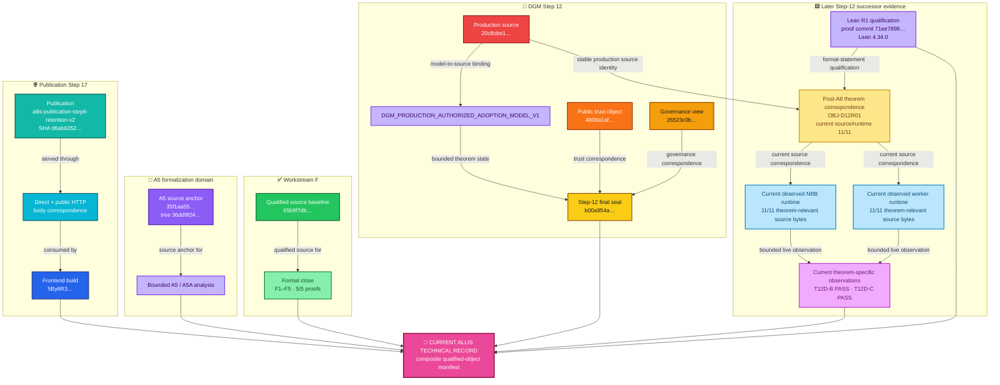
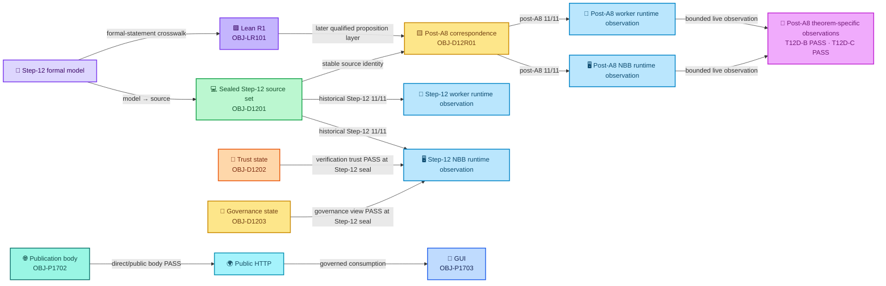
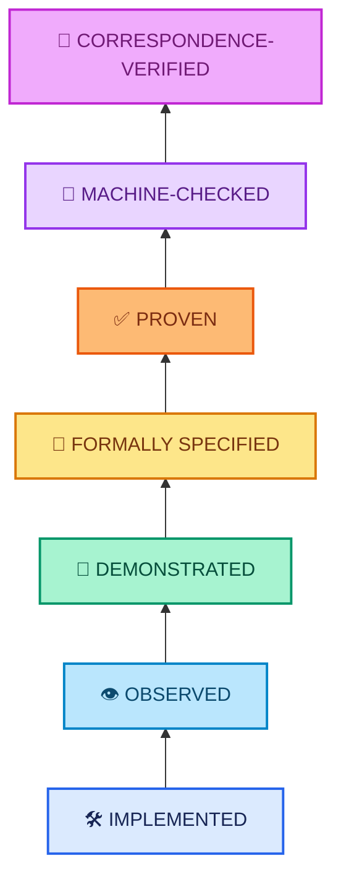
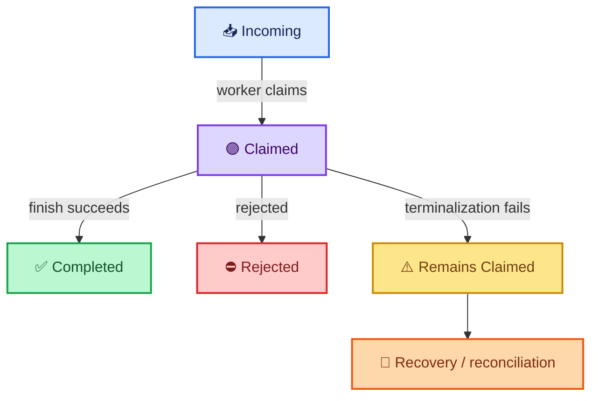

<div align="center">

# ALLIS — Current System Manifest

### Qualified objects, authority roles, and correspondence relationships

**Current technical manifest · September 2026**

<br>


<br>

**Kidd’s Technical Services · ALLIS**

</div>

---

> [!IMPORTANT]
> This manifest identifies the **qualified objects that support the current ALLIS technical record** and the **explicit relationships established among them**.
>
> It does not reduce ALLIS to one commit, one runtime image, one theorem, or one publication artifact.

---

# 👀 Manifest at a glance

The current ALLIS technical record is a **composite system manifest**.

Different objects establish different kinds of technical authority:

| Object class | What it establishes |
|---|---|
| ✅ **Qualified source** | Which implementation object is admitted for a bounded workstream |
| 📐 **Proof/source anchor** | Which source object a bounded formal analysis refers to |
| 🔐 **Production source** | Which production implementation a formal/correspondence package binds |
| 🟪 **Proof-assistant qualification** | Which later proof object independently kernel-checked a bounded proposition set |
| 🟨 **Correspondence reference set** | Which source/runtime/live-observation epoch supports a current bounded correspondence claim |
| 🔑 **Trust object** | Which verification trust state was sealed and compared |
| 🧭 **Governance object** | Which governance state was sealed and compared |
| 🧾 **Evidence seal** | Which completed bounded evidence state identifies a workstream close |
| 🌐 **Publication object** | Which immutable public projection was served |
| 🖥️ **Frontend object** | Which frontend build consumed the governed publication at the final observation |

The governing rule is:

> **An object is authoritative only for the role and scope established by its qualification record.**

---

# 🧩 Current System Object Graph

The manifest is a graph of qualified objects and established relationships.



### How to read the graph

The diagram shows **established roles and relationships**.

It does **not** claim that these three source identities form a single replacement chain:

```text
65b9f7db…
35f1aa55…
20c8cbe1…
```

Each source object belongs to a different bounded technical role.

No source object silently inherits the authority of another.

The later Lean R1 and post-A8 nodes are **successor evidence objects**, not replacements for the historical Step-12 source or final seal. The Lean object qualifies the translated formal proposition set; the post-A8 correspondence object revalidates the stable Step-12 source against a newer observed runtime epoch and theorem-specific live observations.

---

# 🏷️ Manifest object classes

Each manifest entry uses one primary object class.

| Class | Meaning |
|---|---|
| `QUALIFIED_SOURCE` | Source object admitted for a bounded acceptance or qualification scope |
| `PROOF_SOURCE_ANCHOR` | Source identity used to anchor a bounded formal analysis |
| `PRODUCTION_SOURCE` | Production implementation identity used by a bounded formal/correspondence package |
| `PROOF_ASSISTANT_QUALIFICATION` | Later qualified proof-assistant object over a bounded formal proposition set |
| `CORRESPONDENCE_REFERENCE_SET` | Bounded successor evidence object tying stable source identity to a named runtime/live-observation epoch |
| `TRUST_OBJECT` | Sealed public verification trust identity |
| `GOVERNANCE_OBJECT` | Sealed governance-state identity |
| `EVIDENCE_SEAL` | Immutable identity for a closed bounded evidence state |
| `PUBLICATION_OBJECT` | Governed immutable public projection |
| `FRONTEND_BUILD` | Frontend build identity observed in the qualified publication path |

These classes describe **roles**, not maturity rankings.

A `PRODUCTION_SOURCE` is not automatically stronger than a `QUALIFIED_SOURCE`; it answers a different question.

---

# 📋 Current object registry

| ID | Object | Class | Identity | Workstream | State |
|---|---|---|---|---|---|
| `OBJ-F01` | Workstream-F qualified baseline | `QUALIFIED_SOURCE` | `65b9f7dbd594ec9d225152aabd705eefc9216dbb` | Workstream F | **CLOSED source authority** |
| `OBJ-A501` | A5 source anchor | `PROOF_SOURCE_ANCHOR` | `35f1aa5586e1a23e1ab88f4d757c451b44506893` | A5 / mathematical audit | **Qualified anchor** |
| `OBJ-D1201` | Step-12 production DGM source | `PRODUCTION_SOURCE` | `20c8cbe175781c8a1c05d65c03977859ceca884a` | DGM Step 12 | **Closed bounded source** |
| `OBJ-LR101` | Lean R1 proof-assistant qualification | `PROOF_ASSISTANT_QUALIFICATION` | proof commit `71ee78982c918145ca73850170a4c2a8a447170d` | Step-12 successor proof layer | **CLOSED / PASS** |
| `OBJ-D12R01` | Post-A8 DGM theorem correspondence registry R1 | `CORRESPONDENCE_REFERENCE_SET` | `POST_A8_DGM_THEOREM_CORRESPONDENCE_REGISTRY_R1` · source tree `8d0840f0…` | Step-12 successor correspondence | **PASS · current B/C correspondence verified** |
| `OBJ-D1202` | Step-12 public trust object | `TRUST_OBJECT` | `4809a1af3dd8fad1767dc5a8a9d67aa763388a055e00ec818c15f9fe0321fbb5` | DGM Step 12 | **Correspondence PASS at final seal** |
| `OBJ-D1203` | Step-12 governance view | `GOVERNANCE_OBJECT` | `26523c0bad40ff06a75c62a802f20195295534764dce45cfa6acdcdaecc3fcc2` | DGM Step 12 | **Correspondence PASS at final seal** |
| `OBJ-D1204` | Step-12 final evidence seal | `EVIDENCE_SEAL` | `b00a954a924d3aa3490a5bcb8d4473da2b6885b8c41e116cf03545fee975c23b` | DGM Step 12 | **GREEN_CLOSED_WITH_EXPLICIT_RESIDUALS** |
| `OBJ-P1701` | Step-17 publication | `PUBLICATION_OBJECT` | ID `allis-publication-step6-retention-v2` | Publication Step 17 | **GREEN COMPLETE** |
| `OBJ-P1702` | Step-17 publication body | `PUBLICATION_OBJECT` | SHA-256 `d6ab63522f9080fae440578ebbb6ed42140595155c9a30253f5b8eeeef8009b7` | Publication Step 17 | **Direct/public correspondence PASS** |
| `OBJ-P1703` | Step-17 frontend build | `FRONTEND_BUILD` | `5By6R3CWTM7NDXc-4lmSi` | Publication Step 17 | **Observed at final seal** |

---

# ✅ `OBJ-F01` — Workstream-F qualified baseline

<div align="center">


</div>

## Identity

```text
Branch:
remediation/active-source-baseline-20260902

HEAD:
65b9f7dbd594ec9d225152aabd705eefc9216dbb

Tag:
stage10-auth-identity-65b9f7dbd594
```

## Role

`OBJ-F01` is the qualified source object for the formal Workstream-F close.

Workstream F records:

```text
F1 = CLOSED
F2 = CLOSED
F3 = CLOSED
F4 = CLOSED
F5 = CLOSED

proofs = 5 / 5

WORKSTREAM_F_STATUS = CLOSED
```

## Authority scope

This object establishes the source authority used for the bounded Workstream-F acceptance state.

## Supported statement

> **Workstream F is formally closed against its qualified source object.**

## Scope boundary

`OBJ-F01` does not automatically identify:

- the later A5 proof/source anchor;
- the Step-12 production DGM source;
- the Step-17 publication object; or
- the complete ALLIS runtime.

---

# 📐 `OBJ-A501` — A5 proof/source anchor

<div align="center">


</div>

## Identity

```text
HEAD:
35f1aa5586e1a23e1ab88f4d757c451b44506893

Tree:
36dd9f2425db4b23bacfce1cb258603cace25f1b
```

## Role

`OBJ-A501` anchors the later bounded A5 formal/wiring analysis.

The A5 record freezes and analyzes a bounded source domain rather than redefining the complete ALLIS production baseline.

## Authority scope

This object is authoritative for the source identity used by that bounded formalization tract.

## Supported statement

> **The A5 bounded formal analysis is anchored to the identified committed source object.**

## Scope boundary

No automatic equivalence is asserted between:

```text
OBJ-F01
    and
OBJ-A501
```

or between:

```text
OBJ-A501
    and
OBJ-D1201
```

Any stronger source-equivalence claim requires its own correspondence evidence.

---

# 🔐 `OBJ-D1201` — Step-12 production DGM source

<div align="center">


</div>

## Identity

```text
20c8cbe175781c8a1c05d65c03977859ceca884a
```

## Formal object

```text
DGM_PRODUCTION_AUTHORIZED_ADOPTION_MODEL_V1
```

## Role

`OBJ-D1201` is the controlling production source identity for the bounded Step-12 authorized-adoption formal and correspondence package.

The sealed source domain contains:

```text
11 governed production source files
```

The Step-12 record establishes model-to-source binding to that sealed set and reports runtime source correspondence for both NBB and worker execution paths.

## Supported statement

> **The Step-12 bounded authorized-adoption formal object is tied to the identified production source commit and its sealed governed source set.**

## Scope boundary

`OBJ-D1201` is not a source identity for every ALLIS subsystem.

---

# 🟪 `OBJ-LR101` — Lean R1 proof-assistant qualification

<div align="center">


</div>

## Identity

Qualified proof commit:

```text
71ee78982c918145ca73850170a4c2a8a447170d
```

Final local metadata head:

```text
beceb3ee44fd5c33eaf689a5abe086e5e9c67911
```

Pinned toolchain:

```text
leanprover/lean4:v4.34.0
```

## Role

`OBJ-LR101` identifies the later Lean R1 qualification object for the principal Step-12 result set.

The qualified principal results are:

```text
T12D_A_LEAN_KERNEL_CHECKED=YES
T12D_B_LEAN_KERNEL_CHECKED=YES
T12D_C_LEAN_KERNEL_CHECKED=YES
P12C_09_LEAN_KERNEL_CHECKED=YES
```

The qualified theorem-level axiom report is:

```text
T12D_A_AXIOMS=NONE
T12D_B_AXIOMS=NONE
T12D_C_AXIOMS=NONE
P12C_09_AXIOMS=NONE
```

## Supported statement

> **The principal Step-12 governance propositions received a later independent Lean 4.34.0 kernel-checked qualification layer, while preserving the historical Step-12 validation labels.**

## Scope boundary

The Lean R1 closeout itself correctly records:

```text
LEAN_TO_PRODUCTION_SOURCE_CORRESPONDENCE=NOT_YET_ESTABLISHED
LEAN_TO_PRODUCTION_RUNTIME_CORRESPONDENCE=NOT_YET_ESTABLISHED
```

for that **closed R1 workstream**.

Those historical statements remain true to the workstream's seal boundary.

`OBJ-LR101` therefore does not replace `OBJ-D1201` and does not itself become production runtime authority.

The later production implementation bridge is represented separately by `OBJ-D12R01`.

See the [Lean R1 workstream closeout](../formal-verification/authorized-adoption/lean/workstream-closeout-r1.md).

---

# 🟨 `OBJ-D12R01` — Post-A8 DGM theorem correspondence registry R1

<div align="center">


</div>

## Identity

Registry object:

```text
POST_A8_DGM_THEOREM_CORRESPONDENCE_REGISTRY_R1
```

Controlling production source:

```text
20c8cbe175781c8a1c05d65c03977859ceca884a
```

Source tree:

```text
8d0840f076e84b4033ff398f602fb81a6d6e29f2
```

## Role

`OBJ-D12R01` identifies the later post-A8 bounded DGM theorem-correspondence observation epoch.

It does not define a replacement source.

It revalidates the relationship between the stable `OBJ-D1201` production source and the current observed theorem-relevant NBB and worker runtimes.

## Current source/runtime state

```text
IMMUTABLE_SOURCE_IDENTITY=PASS_11_OF_11

NBB_SOURCE_TO_RUNTIME_CORRESPONDENCE=PASS_11_OF_11

WORKER_SOURCE_TO_RUNTIME_CORRESPONDENCE=PASS_11_OF_11

CURRENT_POST_A8_DGM_SOURCE_TO_RUNTIME_CORRESPONDENCE=PASS_11_OF_11
```

## Current theorem-specific observation state

```text
T12D_B_CURRENT_LIVE_OBSERVATION=PASS
T12D_B_CURRENT_VALIDATION_LEVEL=CORRESPONDENCE_VERIFIED

T12D_C_CURRENT_LIVE_OBSERVATION=PASS
T12D_C_CURRENT_VALIDATION_LEVEL=CORRESPONDENCE_VERIFIED
```

`T12D-A` remains:

```text
T12D_A_CURRENT_CORRESPONDENCE_VERIFIED=NO
T12D_A_CURRENT_VALIDATION_LEVEL=MACHINE_CHECKED
```

because no positive authorized-apply production observation was executed.

`P12C-09` remains:

```text
P12C_09_CURRENT_VALIDATION_LEVEL=MACHINE_CHECKED_DISPROVEN
```

## Supported statement

> **The bounded theorem-relevant DGM source was revalidated post-A8 against the current observed NBB and worker runtimes at 11/11 source-byte correspondence, and the theorem-specific live behavior required for `T12D-B` and `T12D-C` was re-observed.**

## Scope boundary

The post-A8 revalidation did not issue or consume real production authorization and did not apply a real production DGM patch.

The controlling boundaries remain:

```text
REAL_PRODUCTION_AUTHORIZATION_ISSUED=NO
REAL_PRODUCTION_AUTHORIZATION_CONSUMED=NO
REAL_PRODUCTION_DGM_PATCH_APPLICATION=NO

PRODUCTION_MUTATION_SAFETY_THEOREM_PROVEN=NO
WHOLE_SYSTEM_SAFETY_THEOREM_PROVEN=NO
SYSTEM_PROVEN=NO
```

See the [Post-A8 DGM theorem correspondence registry R1](../evidence/governed-evolution/post-a8-theorem-correspondence-registry-r1.md).

---

# 🔑 `OBJ-D1202` — Step-12 public trust object

<div align="center">


</div>

## Identity

```text
SHA-256:
4809a1af3dd8fad1767dc5a8a9d67aa763388a055e00ec818c15f9fe0321fbb5
```

## Role

`OBJ-D1202` identifies the public verification trust object used by the bounded Step-12 production verification path.

## Correspondence state

```text
PUBLIC_TRUST = PASS
```

at the Step-12 final seal.

## Supported statement

> **The inspected production verification trust state corresponded to the sealed public trust object at the Step-12 final observation.**

## Scope boundary

Possession or publication of this public verification object does not grant private signing authority.

```text
can verify authority
    ≠
can create authority
```

---

# 🧭 `OBJ-D1203` — Step-12 governance view

<div align="center">


</div>

## Identity

```text
SHA-256:
26523c0bad40ff06a75c62a802f20195295534764dce45cfa6acdcdaecc3fcc2
```

## Role

`OBJ-D1203` identifies the sealed governance object used at the Step-12 NBB boundary.

## Correspondence state

The final Step-12 record establishes:

```text
Governance view = PASS
```

for the inspected NBB governance view.

## Supported statement

> **The live NBB governance view inspected at Step-12 final seal matched the sealed governance object.**

## Scope boundary

A governance view can represent governed state without creating mutation authority.

```text
governance state exists
    ≠
authorization exists
```

---

# 🧾 `OBJ-D1204` — Step-12 final evidence seal

<div align="center">


</div>

## Identity

```text
SHA-256:
b00a954a924d3aa3490a5bcb8d4473da2b6885b8c41e116cf03545fee975c23b
```

## Final Step-12 status

```text
GREEN_CLOSED_WITH_EXPLICIT_RESIDUALS
```

## Formal result

```text
12 propositions
11 proven
1 disproven
0 unadjudicated
```

Principal validation states:

| Proposition | State |
|---|---|
| `T12D-A` | 🤖 `MACHINE_CHECKED` |
| `T12D-B` | 🔗 `CORRESPONDENCE_VERIFIED` |
| `T12D-C` | 🔗 `CORRESPONDENCE_VERIFIED` |
| `P12C-09` | 🔴 `MACHINE_CHECKED_DISPROVEN` |

## Residual state

The Step-12 close preserves eight explicit residuals and seven explicit non-promotions.

The controlling system-level boundary remains:

```text
PRODUCTION_MUTATION_SAFETY_THEOREM_PROVEN=NO

WHOLE_SYSTEM_SAFETY_THEOREM_PROVEN=NO

SYSTEM_PROVEN=NO
```

## Supported statement

> **The bounded Step-12 authorized-adoption workstream is closed with all formal obligations adjudicated and its residual claim boundaries preserved.**

---

# 🌐 `OBJ-P1701` — Step-17 publication

<div align="center">


</div>

## Identity

```text
Publication ID:
allis-publication-step6-retention-v2
```

## Role

`OBJ-P1701` is the governed public publication object for the completed Step-17 fixed goal.

## Final workstream state

```text
Steps 0–17:
GREEN

Completion criteria:
25 / 25 PASS

Final network continuity:
GREEN

ALLIS_LIVE_PUBLICATION_ENDPOINT:
COMPLETE

ALLIS_EVIDENCE_GOVERNANCE_PORTAL:
LIVE at final sealed observation
```

## Supported statement

> **The Step-17 fixed goal completed a governed read-only publication path from qualified state to public evidence and GUI consumption.**

## Scope boundary

Publication does not expose unrestricted internal ALLIS state.

---

# 🧾 `OBJ-P1702` — Step-17 publication body

<div align="center">


</div>

## Identity

```text
SHA-256:
d6ab63522f9080fae440578ebbb6ed42140595155c9a30253f5b8eeeef8009b7
```

## Role

`OBJ-P1702` identifies the immutable publication body used for the final direct/public correspondence check.

## Correspondence state

At the final Step-17 closeout:

```text
direct publication HTTP = 200
public publication HTTP = 200
direct/public publication body = identical
final network continuity = PASS
```

## Supported statement

> **The direct and public publication bodies corresponded to the same sealed publication identity at final Step-17 verification.**

## Scope boundary

This is a point-in-time correspondence result.

A future publication-body change requires a new identity and renewed correspondence.

---

# 🖥️ `OBJ-P1703` — Step-17 frontend build

<div align="center">


</div>

## Identity

```text
5By6R3CWTM7NDXc-4lmSi
```

## Role

`OBJ-P1703` identifies the frontend build observed during final Step-17 continuity and GUI verification.

## Correspondence state

The Step-17 close establishes that the GUI consumed the governed publication through the authorized public path without unrestricted direct ALLIS access.

## Supported statement

> **The identified frontend build consumed the governed publication at the final Step-17 observation boundary.**

## Scope boundary

This build identifier is not an identity for the complete ALLIS runtime.

---

# 🔗 Correspondence registry

The manifest records only explicit correspondence relationships.



## Explicit correspondence edges

| Edge | From | To | State | Scope |
|---|---|---|---|---|
| `EDGE-01` | Step-12 formal model | `OBJ-D1201` sealed production source set | **ESTABLISHED** | Model → source |
| `EDGE-02` | `OBJ-D1201` source set | Step-12 NBB runtime source | **11/11 PASS** | Historical Step-12 point-in-time source → runtime |
| `EDGE-03` | `OBJ-D1201` source set | Step-12 worker runtime source | **11/11 PASS** | Historical Step-12 point-in-time source → runtime |
| `EDGE-04` | `OBJ-D1202` sealed public trust | Inspected production verification trust | **PASS** | Step-12 point-in-time trust correspondence |
| `EDGE-05` | `OBJ-D1203` sealed governance view | Inspected NBB governance view | **PASS** | Step-12 point-in-time governance correspondence |
| `EDGE-06` | `OBJ-P1702` direct publication body | Public publication body | **PASS** | Step-17 publication correspondence |
| `EDGE-07` | Governed public publication | `OBJ-P1703` GUI | **PASS** | Step-17 publication → GUI consumption |
| `EDGE-08` | Step-12 formal proposition set | `OBJ-LR101` Lean R1 qualification | **DOCUMENTED / KERNEL CHECKED** | Formal statement → later proof-assistant qualification |
| `EDGE-09` | `OBJ-D1201` stable source set | Post-A8 NBB runtime source | **11/11 PASS** | Successor post-A8 point-in-time source → runtime |
| `EDGE-10` | `OBJ-D1201` stable source set | Post-A8 worker runtime source | **11/11 PASS** | Successor post-A8 point-in-time source → runtime |
| `EDGE-11` | Post-A8 NBB/worker runtime | `T12D-B` live observation | **PASS** | Invalid authorization fail-closed observation |
| `EDGE-12` | Post-A8 worker runtime | `T12D-C` live observation | **PASS** | Empty-spool non-application observation |

> [!IMPORTANT]
> `EDGE-02` and `EDGE-03` remain the historical Step-12 runtime-correspondence edges. `EDGE-09` and `EDGE-10` are later successor observations of the same stable theorem-relevant source identity against a newer runtime epoch. The historical edges are not rewritten or deleted.

---

# 🚫 Relationships this manifest does not assert

The absence of an edge is meaningful.

This manifest does **not** assert:

```text
OBJ-F01 == OBJ-A501
```

It does not assert:

```text
OBJ-A501 == OBJ-D1201
```

It does not assert:

```text
Workstream-F close
    ⇒
Step-12 production source equivalence
```

It does not assert:

```text
Lean R1 proof-assistant qualification
    ⇒
automatic production-source or runtime correspondence
```

It does not assert:

```text
post-A8 source/runtime byte identity
    ⇒
theorem-specific behavior without live observation
```

It does not assert:

```text
Step-12 bounded theorem
    ⇒
whole-system theorem
```

It does not assert:

```text
Step-17 publication correspondence
    ⇒
unrestricted internal ALLIS access
```

It does not assert:

```text
point-in-time runtime correspondence
    ⇒
permanent runtime correspondence
```

This is intentional.

> **Manifest edges are explicit. Unrecorded relationships are not inferred.**

---

# 🪜 Validation status across the manifest



A manifest object can support more than one validation level, depending on the claim.

The validation level belongs to the **claim and evidence relationship**, not to the object name by itself.

---

# 📊 Workstream closeout registry

| Workstream | Close state | Primary manifest objects | Current boundary |
|---|---|---|---|
| ✅ **Workstream F** | `CLOSED` | `OBJ-F01` | Bounded acceptance close |
| 🔐 **DGM Step 12** | `GREEN_CLOSED_WITH_EXPLICIT_RESIDUALS` | `OBJ-D1201`–`OBJ-D1204` | Historical bounded authorized-adoption formal/correspondence package |
| 🟪 **Lean R1** | `CLOSED / PASS` | `OBJ-LR101` | Later proof-assistant qualification of the principal Step-12 result set |
| 🟨 **Post-A8 DGM correspondence** | `PASS` | `OBJ-D12R01` | Successor current source/runtime + theorem-specific B/C revalidation |
| 🌐 **Publication Step 17** | `GREEN_COMPLETE` | `OBJ-P1701`–`OBJ-P1703` | Bounded governed-publication fixed goal |

Closed workstreams remain valid within their documented scope.

```text
closed
    ≠
scope expanded
```

```text
green
    ≠
whole system proven
```

---

# 🎯 Manifest claim boundaries

The manifest supports the following current top-level statements.

| Claim | Support |
|---|---|
| Workstream F is closed | `OBJ-F01` + Workstream-F close |
| The bounded Step-12 authorized-adoption workstream is closed with explicit residuals | `OBJ-D1201`–`OBJ-D1204` |
| The principal Step-12 result set later received Lean-kernel qualification | `OBJ-LR101` + Lean R1 closeout |
| T12D-B and T12D-C are currently correspondence-verified | `OBJ-D12R01` + current post-A8 11/11 source/runtime correspondence + theorem-specific live observations |
| T12D-A remains machine-checked, not correspondence-verified | `OBJ-LR101` + `OBJ-D12R01`; positive authorized apply not executed |
| P12C-09 is disproven and the negative result is preserved | Step-12 counterexample record + `OBJ-LR101` Lean-kernel-checked disproof |
| Step-17 publication fixed goal is complete | `OBJ-P1701`–`OBJ-P1703` |
| Direct/public publication-body correspondence passed | `OBJ-P1702` |
| The GUI consumed the governed publication at final Step-17 observation | `OBJ-P1703` + Step-17 correspondence |
| Runtime correspondence is time-specific | Step-12 and Step-17 correspondence records |
| `SYSTEM_PROVEN=NO` | Step-12 residual/non-promotion boundary |

The manifest does not support stronger whole-system claims.

---

# ⚪ Current system-level nonclaim

<div align="center">

## Whole-system proof

# `SYSTEM_PROVEN=NO`

</div>

This does not invalidate closed workstreams.

It states the current scope of the evidence.

The bounded formal and correspondence work establishes meaningful technical results without promoting them into a universal theorem over every ALLIS component, runtime path, side effect, external dependency, or state transition.

---

# 👤 Private-state boundary in the manifest

The public manifest contains **no current H_people runtime object**.

That omission is deliberate.

The current public record supports the architectural private-state boundary:

```text
person-linked state exists
    ≠
identity authority established
    ≠
use authority established
    ≠
disclosure authority established
    ≠
publication authority established
```

Historical Gate05c source and runtime evidence remains part of the engineering provenance, but it is not promoted here into a current runtime-authoritative H_people object.

A future H_people runtime object should enter this manifest only after its own:

- source qualification;
- authority qualification;
- runtime observation;
- required correspondence; and
- public-safe evidence record.

> [!NOTE]
> Later A8 frontend/private-context work is not automatically an H_people runtime object and is not the DGM theorem runtime. This manifest does **not** add an A8 current frontend/private-context object until an exact sealed A8 production identity is admitted from its own closeout evidence. If admitted later, it should be added as a separate current frontend/private-context object rather than overwriting historical `OBJ-P1703`.

---

# 🔄 Manifest update rule

A manifest object changes only when its evidence authority changes.

```mermaid
flowchart LR
    A["🔧 Claim-bearing object changes"]:::change
    B["🧾 Capture new evidence"]:::evidence
    C["🛡️ Requalify scope + authority"]:::qualify
    D["🔗 Re-run required correspondence"]:::corr
    E["✅ Issue new seal / identity"]:::seal
    F["📋 Update manifest"]:::manifest

    A --> B --> C --> D --> E --> F

    classDef change fill:#fecaca,stroke:#dc2626,color:#7f1d1d,stroke-width:2px;
    classDef evidence fill:#bae6fd,stroke:#0284c7,color:#0c4a6e,stroke-width:2px;
    classDef qualify fill:#fde68a,stroke:#ca8a04,color:#713f12,stroke-width:2px;
    classDef corr fill:#ddd6fe,stroke:#7c3aed,color:#3b0764,stroke-width:2px;
    classDef seal fill:#bbf7d0,stroke:#16a34a,color:#14532d,stroke-width:2px;
    classDef manifest fill:#facc15,stroke:#854d0e,color:#111827,stroke-width:2px;
```



Changes that can require a new manifest identity or correspondence state include:

- source commit or tree change;
- runtime image or mounted-source change;
- trust-anchor change;
- governance-object change;
- candidate/authorization semantic change;
- publication-body change;
- frontend-build change;
- public-routing change; or
- addition of a new protected transition.

---

# 🕒 Correspondence is time-specific

The manifest distinguishes object identity from runtime persistence.

```text
object identity
    =
stable identity of the sealed object
```

```text
runtime correspondence
    =
evidence that an inspected runtime matched the object
at a defined observation boundary
```

Therefore:

```text
correspondence at seal time
    ≠
guaranteed correspondence at every future time
```

A changed runtime requires renewed correspondence for affected claims.

The post-A8 DGM record is an example of that rule being applied: the stable `OBJ-D1201` source identity was retained, while a newer current NBB/worker runtime epoch earned fresh 11/11 correspondence and separate B/C live-observation evidence.

---

# 🔐 Semantic completeness

The Step-12 authorization model preserves a second manifest-level rule:

> **Cryptographic validity does not replace semantic completeness.**

Where an authorization decision depends on an authority-bearing semantic input, that input belongs inside the committed authorization context.

The bounded candidate envelope includes:

```text
proposal
target
expected prestate
candidate content
evaluation
scores
expected tests
```

A signature can authenticate the object that was signed.

It does not authenticate an omitted authority-bearing field.

---

# 🧯 Recovery semantics

The current Step-12 formal record disproves unconditional terminal totality.



The manifest therefore preserves:

```text
claimed
    ≠
guaranteed terminal
```

This is a current formal boundary, not an unresolved theorem.

---

# 📦 Human-readable normalized manifest

The following compact view summarizes the registered objects and relationships.

```yaml
allis_current_system_manifest:
  status: COMPOSITE

  objects:
    - id: OBJ-F01
      class: QUALIFIED_SOURCE
      identity: 65b9f7dbd594ec9d225152aabd705eefc9216dbb
      role: workstream_f_qualified_baseline
      state: CLOSED

    - id: OBJ-A501
      class: PROOF_SOURCE_ANCHOR
      identity: 35f1aa5586e1a23e1ab88f4d757c451b44506893
      tree: 36dd9f2425db4b23bacfce1cb258603cace25f1b
      role: a5_bounded_formalization_anchor

    - id: OBJ-D1201
      class: PRODUCTION_SOURCE
      identity: 20c8cbe175781c8a1c05d65c03977859ceca884a
      role: step12_authorized_adoption_source
      state: GREEN_CLOSED_WITH_EXPLICIT_RESIDUALS

    - id: OBJ-LR101
      class: PROOF_ASSISTANT_QUALIFICATION
      qualified_proof_commit: 71ee78982c918145ca73850170a4c2a8a447170d
      metadata_head: beceb3ee44fd5c33eaf689a5abe086e5e9c67911
      lean_toolchain: leanprover/lean4:v4.34.0
      role: step12_principal_result_set_lean_r1
      state: CLOSED_PASS

    - id: OBJ-D12R01
      class: CORRESPONDENCE_REFERENCE_SET
      identity: POST_A8_DGM_THEOREM_CORRESPONDENCE_REGISTRY_R1
      source_commit: 20c8cbe175781c8a1c05d65c03977859ceca884a
      source_tree: 8d0840f076e84b4033ff398f602fb81a6d6e29f2
      role: post_a8_bounded_dgm_theorem_correspondence
      state: PASS
      source_runtime_correspondence: PASS_11_OF_11
      correspondence_verified:
        - T12D-B
        - T12D-C
      not_promoted:
        - T12D-A

    - id: OBJ-D1202
      class: TRUST_OBJECT
      sha256: 4809a1af3dd8fad1767dc5a8a9d67aa763388a055e00ec818c15f9fe0321fbb5
      role: step12_public_verification_trust
      correspondence: PASS_AT_FINAL_SEAL

    - id: OBJ-D1203
      class: GOVERNANCE_OBJECT
      sha256: 26523c0bad40ff06a75c62a802f20195295534764dce45cfa6acdcdaecc3fcc2
      role: step12_nbb_governance_view
      correspondence: PASS_AT_FINAL_SEAL

    - id: OBJ-D1204
      class: EVIDENCE_SEAL
      sha256: b00a954a924d3aa3490a5bcb8d4473da2b6885b8c41e116cf03545fee975c23b
      role: step12_final_evidence_state
      state: GREEN_CLOSED_WITH_EXPLICIT_RESIDUALS

    - id: OBJ-P1701
      class: PUBLICATION_OBJECT
      identity: allis-publication-step6-retention-v2
      role: governed_public_projection
      state: GREEN_COMPLETE

    - id: OBJ-P1702
      class: PUBLICATION_OBJECT
      sha256: d6ab63522f9080fae440578ebbb6ed42140595155c9a30253f5b8eeeef8009b7
      role: step17_publication_body
      correspondence: DIRECT_PUBLIC_BODY_PASS

    - id: OBJ-P1703
      class: FRONTEND_BUILD
      identity: 5By6R3CWTM7NDXc-4lmSi
      role: step17_gui_build
      observation: FINAL_STEP17_SEAL

  explicit_edges:
    - model_to_step12_source
    - step12_source_to_nbb_runtime_historical
    - step12_source_to_worker_runtime_historical
    - step12_formal_statements_to_lean_r1
    - step12_source_to_post_a8_nbb_runtime
    - step12_source_to_post_a8_worker_runtime
    - post_a8_runtime_to_t12d_b_live_observation
    - post_a8_runtime_to_t12d_c_live_observation
    - trust_object_to_verification_runtime
    - governance_object_to_nbb_governance_view
    - direct_publication_to_public_publication
    - public_publication_to_gui

  system_boundary:
    system_proven: false
    whole_system_safety_theorem_proven: false
    production_mutation_safety_theorem_proven: false
```

> [!NOTE]
> This YAML block is a **human-readable normalized summary**, not a standalone machine-authority artifact.

---

# 📚 Related repository records

## Current state

- [`../CURRENT.md`](../CURRENT.md) — current qualified state and validation summary
- [`../README.md`](../README.md) — public front door and architectural orientation

## Qualified baseline

- [`qualified-baseline/README.md`](qualified-baseline/README.md)
- [`qualified-baseline/qualified-baseline-manifest.md`](qualified-baseline/qualified-baseline-manifest.md)

## Step-12 formal verification

- [`../formal-verification/authorized-adoption/formal-model.md`](../formal-verification/authorized-adoption/formal-model.md)
- [`../formal-verification/authorized-adoption/theorem-registry.md`](../formal-verification/authorized-adoption/theorem-registry.md)
- [`../formal-verification/authorized-adoption/counterexample-registry.md`](../formal-verification/authorized-adoption/counterexample-registry.md)
- [`../formal-verification/authorized-adoption/lean/workstream-closeout-r1.md`](../formal-verification/authorized-adoption/lean/workstream-closeout-r1.md)

## Step-12 correspondence

- [`../correspondence/README.md`](../correspondence/README.md)
- [`../correspondence/authorized-adoption/model-to-source.md`](../correspondence/authorized-adoption/model-to-source.md)
- [`../correspondence/authorized-adoption/source-to-runtime.md`](../correspondence/authorized-adoption/source-to-runtime.md)
- [`../evidence/governed-evolution/post-a8-theorem-correspondence-registry-r1.md`](../evidence/governed-evolution/post-a8-theorem-correspondence-registry-r1.md)

## Step-12 evidence

- [`../evidence/governed-evolution/README.md`](../evidence/governed-evolution/README.md)
- [`../evidence/governed-evolution/source-identity.md`](../evidence/governed-evolution/source-identity.md)
- [`../evidence/governed-evolution/trust-anchor.md`](../evidence/governed-evolution/trust-anchor.md)
- [`../evidence/governed-evolution/governance-view.md`](../evidence/governed-evolution/governance-view.md)
- [`../evidence/governed-evolution/post-a8-theorem-correspondence-registry-r1.md`](../evidence/governed-evolution/post-a8-theorem-correspondence-registry-r1.md)
- [`../evidence/governed-evolution/residuals.md`](../evidence/governed-evolution/residuals.md)
- [`../evidence/governed-evolution/step12-final-seal.md`](../evidence/governed-evolution/step12-final-seal.md)

---

# 🧭 Manifest maintenance rules

1. **Keep object roles separate.**  
   Do not replace the composite manifest with one global commit identifier.

2. **Record explicit edges only.**  
   Do not infer correspondence between objects that have no qualified relationship.

3. **Preserve point-in-time runtime semantics.**  
   Runtime correspondence must name its observation or seal boundary.

4. **Preserve closed workstream scope.**  
   A later workstream may build on an earlier close without rewriting its bounded result.

5. **Represent successor evidence as successor objects and edges.**  
   Later proof-assistant qualification or renewed runtime correspondence must not silently replace the historical source, seal, or observation it builds upon.

6. **Issue new identities after claim-bearing changes.**  
   Changed source, trust, governance, publication, frontend, or authorization semantics may require requalification.

7. **Keep system-level nonclaims visible.**  
   Successful bounded results do not change `SYSTEM_PROVEN=NO` without a separate whole-system proof.

8. **Keep public and private authority separate.**  
   Public documentation may identify hashes, proofs, correspondence, and public trust objects without publishing private keys, credentials, or local source.

---

# 🧾 Manifest summary

<div align="center">

### ✅ `OBJ-F01`
**Workstream-F qualified source · CLOSED**

### 📐 `OBJ-A501`
**A5 proof/source anchor · BOUNDED FORMALIZATION**

### 🔐 `OBJ-D1201`–`OBJ-D1204`
**DGM Step 12 · GREEN CLOSED WITH EXPLICIT RESIDUALS**

### 🟪 `OBJ-LR101`
**Lean R1 · CLOSED / PASS**

### 🟨 `OBJ-D12R01`
**Post-A8 DGM correspondence · PASS · current B/C correspondence verified**

### 🌐 `OBJ-P1701`–`OBJ-P1703`
**Publication Step 17 · GREEN COMPLETE**

<br>

### 🔗 Explicit correspondence
**model → source · historical Step-12 source → runtime · formal statements → Lean R1 · post-A8 source → current runtime · current runtime → B/C live observations · trust → runtime · governance → runtime · publication → public HTTP → GUI**

<br>

### ⚪ Whole-system proof
# `SYSTEM_PROVEN=NO`

</div>

---

# Governing principles

> **State does not become authority merely because it exists.**

> **Every manifest object has a role, scope, and evidence boundary.**

> **Manifest relationships are explicit; unrecorded relationships are not inferred.**

> **Successor evidence adds new objects and edges; it does not rewrite historical seals.**

> **Correspondence is time-specific.**

> **A closed workstream does not imply whole-system proof.**

> **The current ALLIS technical record is a composite of qualified objects and established correspondence.**
