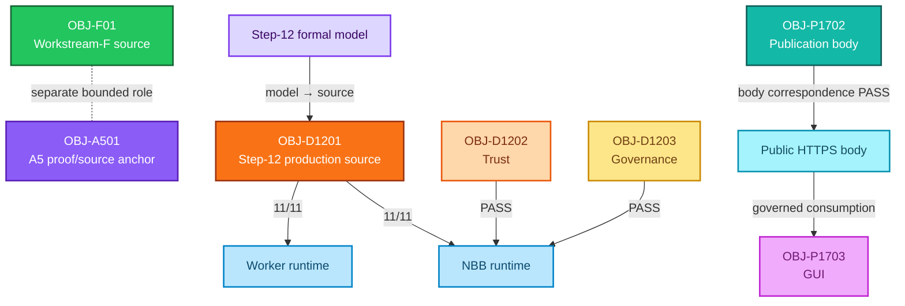

<div align="center">

# ALLIS — Qualified Baseline Manifest

### Composite acceptance record for qualified source, proof, production, trust, governance, publication, and runtime-reference objects

<br>


<br>

**Kidd’s Technical Services · ALLIS**

</div>

---

> [!IMPORTANT]
> ALLIS does not have one source commit that can serve as the universal current baseline for every technical claim.
>
> The current accepted technical record is a **composite of qualified objects**, each with its own role, scope, authority, evidence, and correspondence state.

---

# 👀 Current baseline model

The current ALLIS baseline is role-scoped.

```text
Workstream-F qualified source
    65b9f7db…

A5 proof/source anchor
    35f1aa55…

Step-12 production DGM source
    20c8cbe1…

Step-12 trust + governance + final evidence identities
    4809a1af…
    26523c0b…
    b00a954a…

Step-17 governed publication + public runtime references
    allis-publication-step6-retention-v2
    d6ab6352…
    04ebb5bc…
    5By6R3…
```

No one object silently inherits the role of another.

---

# 🎯 Purpose

This manifest answers:

> **Which qualified object applies to which technical scope, and how do those objects participate in the current accepted ALLIS record?**

It does not attempt to turn several separately qualified objects into one artificial source identity.

The manifest preserves:

- exact object identity;
- object role;
- workstream;
- bounded scope;
- qualification or close state;
- supporting seal or evidence;
- correspondence state;
- stronger claims not supported;
- successor/revalidation conditions.

The governing distinction is:

```text
qualified object
    ≠
evidence about that object
    ≠
formal claim about that object
    ≠
authority to perform an action
```

---

# 🧩 Composite qualified-state model

```mermaid
flowchart TB
    ROOT["📋 ALLIS CURRENT ACCEPTANCE STATE<br/>COMPOSITE"]:::root

    F["✅ Workstream-F qualified source<br/>OBJ-F01<br/>65b9f7db…"]:::f
    A["📐 A5 proof/source anchor<br/>OBJ-A501<br/>35f1aa55…"]:::a
    D["🔐 Step-12 production source<br/>OBJ-D1201<br/>20c8cbe1…"]:::d
    T["🔑 Step-12 trust<br/>OBJ-D1202<br/>4809a1af…"]:::trust
    V["🧭 Step-12 governance<br/>OBJ-D1203<br/>26523c0b…"]:::gov
    S["🧾 Step-12 final seal<br/>OBJ-D1204<br/>b00a954a…"]:::seal

    P["📦 Step-17 publication<br/>OBJ-P1701<br/>allis-publication-step6-retention-v2"]:::p
    B["#️⃣ Publication body<br/>OBJ-P1702<br/>d6ab6352…"]:::body
    G["🔎 Frontend build<br/>OBJ-P1703<br/>5By6R3…"]:::gui

    F --> ROOT
    A --> ROOT
    D --> ROOT
    T --> ROOT
    V --> ROOT
    S --> ROOT
    P --> ROOT
    B --> ROOT
    G --> ROOT

    classDef root fill:#facc15,stroke:#854d0e,color:#111827,stroke-width:4px;
    classDef f fill:#22c55e,stroke:#166534,color:#ffffff,stroke-width:2px;
    classDef a fill:#8b5cf6,stroke:#5b21b6,color:#ffffff,stroke-width:2px;
    classDef d fill:#f97316,stroke:#9a3412,color:#ffffff,stroke-width:2px;
    classDef trust fill:#fed7aa,stroke:#ea580c,color:#7c2d12,stroke-width:2px;
    classDef gov fill:#fde68a,stroke:#ca8a04,color:#713f12,stroke-width:2px;
    classDef seal fill:#ddd6fe,stroke:#7c3aed,color:#3b0764,stroke-width:2px;
    classDef p fill:#14b8a6,stroke:#115e59,color:#ffffff,stroke-width:2px;
    classDef body fill:#0ea5e9,stroke:#075985,color:#ffffff,stroke-width:2px;
    classDef gui fill:#f0abfc,stroke:#c026d3,color:#701a75,stroke-width:2px;
```



This graph is a **registry of qualified roles**.

It is not a claim that all objects are source-equivalent.

---

# 📋 Current baseline-object registry

| ID | Object | Class | Primary identity | Scope | Current state |
|---|---|---|---|---|---|
| `OBJ-F01` | Workstream-F qualified baseline | `QUALIFIED_SOURCE` | `65b9f7dbd594ec9d225152aabd705eefc9216dbb` | Workstream-F acceptance | **CLOSED** |
| `OBJ-A501` | A5 proof/source anchor | `PROOF_SOURCE_ANCHOR` | `35f1aa5586e1a23e1ab88f4d757c451b44506893` | A5/A5A bounded formalization | **QUALIFIED ANCHOR** |
| `OBJ-D1201` | Step-12 production DGM source | `PRODUCTION_SOURCE` | `20c8cbe175781c8a1c05d65c03977859ceca884a` | Authorized-adoption formal/correspondence package | **GREEN CLOSED WITH RESIDUALS** |
| `OBJ-D1202` | Step-12 public trust | `TRUST_OBJECT` | `4809a1af3dd8fad1767dc5a8a9d67aa763388a055e00ec818c15f9fe0321fbb5` | Production verification trust | **PASS at final seal** |
| `OBJ-D1203` | Step-12 governance view | `GOVERNANCE_OBJECT` | `26523c0bad40ff06a75c62a802f20195295534764dce45cfa6acdcdaecc3fcc2` | NBB governance correspondence | **PASS at final seal** |
| `OBJ-D1204` | Step-12 final evidence state | `EVIDENCE_SEAL` | `b00a954a924d3aa3490a5bcb8d4473da2b6885b8c41e116cf03545fee975c23b` | Step-12 final bounded evidence | **GREEN_CLOSED_WITH_EXPLICIT_RESIDUALS** |
| `OBJ-P1701` | Step-17 publication | `PUBLICATION_OBJECT` | `allis-publication-step6-retention-v2` | Governed public publication | **GREEN_COMPLETE** |
| `OBJ-P1702` | Step-17 publication body | `PUBLICATION_OBJECT` | `d6ab63522f9080fae440578ebbb6ed42140595155c9a30253f5b8eeeef8009b7` | Direct/public publication body | **Correspondence PASS** |
| `OBJ-P1703` | Step-17 frontend build | `FRONTEND_BUILD` | `5By6R3CWTM7NDXc-4lmSi` | Evidence & Governance Portal | **Observed at final Step-17 seal** |

---

# Why there is no single universal baseline commit

The former manifest treated:

```text
35f1aa5586e1a23e1ab88f4d757c451b44506893
```

as though it were the current source referent for the entire accepted system.

That is too broad.

The current record contains at least four distinct reference roles:

```text
QUALIFIED SOURCE
PROOF SOURCE ANCHOR
PRODUCTION SOURCE
PUBLICATION / RUNTIME REFERENCE SET
```

Those roles answer different questions.

```text
Which source was formally closed for Workstream F?
    → OBJ-F01

Which source anchors the bounded A5 formalization?
    → OBJ-A501

Which production source controls Step-12 authorized adoption?
    → OBJ-D1201

Which publication/runtime identities control the Step-17 public path?
    → OBJ-P1701 / OBJ-P1702 / OBJ-P1703
```

A role-scoped answer is more precise than forcing every question through one commit.

---

# 🟢 `OBJ-F01` — Workstream-F qualified baseline

## Identity

```text
Branch:
remediation/active-source-baseline-20260902

HEAD:
65b9f7dbd594ec9d225152aabd705eefc9216dbb

Tag:
stage10-auth-identity-65b9f7dbd594
```

## Role

`OBJ-F01` is the qualified source object used by the formal Workstream-F acceptance and close process.

## Final Workstream-F state

```text
F1=CLOSED
F2=CLOSED
F3=CLOSED
F4=CLOSED
F5=CLOSED

WORKSTREAM_F_PROOFS_CLOSED=5
WORKSTREAM_F_PROOF_TARGET=5

WORKSTREAM_F_FORMAL_STATE_TRANSITION=PASS
WORKSTREAM_F_FORMAL_CLOSE=PASS

WORKSTREAM_F_STATUS=CLOSED
```

## Authority boundary

```text
FURTHER_WORKSTREAM_F_PROOF_EXECUTION_AUTHORIZED=NO
```

and:

```text
NEXT_STEP=
WORKSTREAM_F_COMPLETE_AWAIT_SEPARATE_NEXT_SCOPE_AUTHORITY
```

The closed workstream does not create open-ended authority for later proof or implementation work.

## Supported statement

> **Workstream F is formally closed against the qualified source object identified by `65b9f7db…`.**

## Not established

`OBJ-F01` is not automatically:

- the A5 proof/source anchor;
- the Step-12 production source;
- the Step-17 publication identity;
- the current frontend build;
- a whole-system source hash.

---

# 📐 `OBJ-A501` — A5 proof/source anchor

## Identity

```text
Branch:
remediation/bbb-fail-closed-20260830T212059Z

HEAD:
35f1aa5586e1a23e1ab88f4d757c451b44506893

Tree:
36dd9f2425db4b23bacfce1cb258603cace25f1b
```

## Role

`OBJ-A501` anchors the bounded A5/A5A formalization tract.

It is not the universal current ALLIS source baseline.

It is authoritative for the source identity of the bounded formal objects derived in that tract.

---

# A5 frozen protected-source domain

The A5 lineage preserves a static protected-root domain:

```text
|P_source| = 85
```

This is a frozen measurement domain.

It does not claim that every possible protected operation in the complete system universe has been enumerated.

The qualified lower-bound obligation relation contains:

```text
|R_qualified| = 4
```

root/component pairs.

The governing boundary remains:

```text
R_qualified
    ≠
R_complete
```

No complete global relation `R(p)` is claimed from that result.

---

# A5 directed source graph

For the four qualified root/component pairs, A5 constructs frozen intraprocedural directed control-flow graphs.

Final bounded graph counts:

```text
qualified root/component pairs = 4

CFG nodes = 102
CFG edges = 107

unsupported control flow = 0
```

Each of the four qualified governance components binds exactly once into its corresponding source CFG.

Canonical graph identity:

```text
QUALIFIED_PAIR_DIRECTED_SOURCE_GRAPH_SHA256=
08327d6fc77a1c5d18fd1d086b71b0ad95aa0cd86db652052e33cc3e0296cb66
```

This is a graph identity.

It is not a theorem.

---

# A5 effect-candidate reduction

The frozen graph initially yields:

```text
76 broad effect candidates
```

The sealed A5A semantic reduction separates them into:

```text
47 source-bound / structural candidates
29 unresolved source symbols
```

Therefore:

```text
effect candidate
    ≠
final protected effect sink
```

The 29 unresolved source symbols are not automatically counterexamples.

The 47 source-bound/structural candidates are not automatically the final protected-effect set.

---

# A5 graph-hash provenance close

The canonical A5 graph hash remains:

```text
08327d6fc77a1c5d18fd1d086b71b0ad95aa0cd86db652052e33cc3e0296cb66
```

A later A5A review metadata hash differed because its analyzer used a literal two-byte `\0` representation rather than the one-byte NUL used by the canonical A5 graph derivation.

The closeout established:

```text
A5A_GRAPH_HASH_ESCAPE_MISMATCH_EXACTLY_ESTABLISHED=YES

A5A_HASH_MISMATCH_SCOPE=REVIEW_METADATA_ONLY

A5A_SEMANTIC_REDUCTION_INVALIDATED_BY_HASH_MISMATCH=NO

MATHAUDIT09A5A2V2_RESULT=COMPLETE
```

The mismatch did not replace the canonical A5 graph identity.

---

# A5 current proof boundary

The latest bounded A5/A5A state preserves:

```text
QUALIFIED_PAIR_DIRECTED_SOURCE_GRAPH_FROZEN=YES

EFFECT_SINK_SET_FROZEN=NO

REQUIRED_GOVERNANCE_COMPONENT_SET_FROZEN=NO

GLOBAL_DIRECTED_WIRING_GRAPH_FROZEN=NO

DOMINATOR_OR_CUT_TEST_PERFORMED=NO

MATHEMATICAL_PROOF_PERFORMED=NO

MACHINE_CHECKED_THEOREM=NO

SOURCE_CORRESPONDENT=NO

RUNTIME_CORRESPONDENT=NO

SYSTEM_PROVEN=NO
```

The next bounded step is:

```text
MATHAUDIT09A5B_ADJUDICATE_EFFECT_SINKS_
USING_CANONICAL_A5_GRAPH_HASH_AND_SEALED_A5A_REDUCTION
```

So the A5 object is a **qualified proof/source anchor with substantial structural evidence**, not a completed whole-system theorem.

---

# A5 validation sequence

The appropriate bounded sequence is:

```mermaid
flowchart LR
    A["📌 Qualified source anchor<br/>35f1aa55…"]:::source
    B["🧊 Protected domain frozen"]:::freeze
    C["🕸️ Directed CFG frozen<br/>102 nodes · 107 edges"]:::graph
    D["🧮 Effect candidates<br/>76 → 47 + 29"]:::reduce
    E["🔍 Effect-sink adjudication"]:::future
    F["📐 Dominance / cut theorem"]:::future
    G["🤖 Machine-checked theorem"]:::future
    H["🔗 Source correspondence"]:::future
    I["🖥️ Runtime correspondence"]:::future

    A --> B --> C --> D --> E --> F --> G --> H --> I

    classDef source fill:#8b5cf6,stroke:#5b21b6,color:#ffffff,stroke-width:3px;
    classDef freeze fill:#ddd6fe,stroke:#7c3aed,color:#3b0764,stroke-width:2px;
    classDef graph fill:#c4b5fd,stroke:#7c3aed,color:#3b0764,stroke-width:2px;
    classDef reduce fill:#e9d5ff,stroke:#9333ea,color:#581c87,stroke-width:2px;
    classDef future fill:#fde68a,stroke:#ca8a04,color:#713f12,stroke-width:2px;
```

Current position is before effect-sink adjudication and the final dominance/cut theorem.

---

# 🔐 `OBJ-D1201` — Step-12 production DGM source

## Identity

```text
20c8cbe175781c8a1c05d65c03977859ceca884a
```

## Formal object

```text
DGM_PRODUCTION_AUTHORIZED_ADOPTION_MODEL_V1
```

## Role

`OBJ-D1201` is the controlling production source identity for the bounded Step-12 authorized-adoption formal and correspondence package.

The sealed domain contains:

```text
11 governed production source files
```

This source object is distinct from both `OBJ-F01` and `OBJ-A501`.

---

# Step-12 final state

```text
GREEN_CLOSED_WITH_EXPLICIT_RESIDUALS
```

Final evidence seal:

```text
b00a954a924d3aa3490a5bcb8d4473da2b6885b8c41e116cf03545fee975c23b
```

Controlling scope:

```text
BOUNDED_PRODUCTION_AUTHORIZED_ADOPTION_FORMAL_MODEL_AND_ESTABLISHED_CORRESPONDENCE_ONLY
```

The seal closes that scope.

It does not enlarge it.

---

# Step-12 proposition state

```text
12 propositions
11 proven
1 disproven
0 unadjudicated
```

Principal result states:

```text
T12D-A = MACHINE_CHECKED

T12D-B = CORRESPONDENCE_VERIFIED

T12D-C = CORRESPONDENCE_VERIFIED

P12C-09 = MACHINE_CHECKED_DISPROVEN
```

The `P12C-09` counterexample remains part of the accepted evidence record.

---

# Step-12 formal obligations

```text
15 formal obligations
15 adjudicated
0 unadjudicated
```

This does not mean:

```text
all propositions true
```

and it does not mean:

```text
no residuals remain
```

Step 12 preserves both:

```text
8 explicit residuals

7 explicit non-promotions
```

---

# Step-12 source/runtime correspondence

At final Step-12 seal:

```text
NBB source correspondence:
11 / 11 PASS

Worker source correspondence:
11 / 11 PASS
```

Additional bounded runtime state:

```text
Public trust     PASS
Governance view  PASS
NBB health       PASS
Worker health    PASS
Host health      PASS
Authorized spool PASS_EMPTY
```

These are point-in-time observations.

---

# 🔑 `OBJ-D1202` — Step-12 public trust object

## Identity

```text
SHA-256:
4809a1af3dd8fad1767dc5a8a9d67aa763388a055e00ec818c15f9fe0321fbb5
```

## Role

This object identifies the public verification trust state used by the bounded Step-12 production verification path.

Final correspondence:

```text
PUBLIC_TRUST=PASS
```

at the Step-12 final seal.

The controlling distinction is:

```text
can verify authority
    ≠
can create authority
```

Publication of the verification object does not expose or grant private signing authority.

---

# 🧭 `OBJ-D1203` — Step-12 governance view

## Identity

```text
SHA-256:
26523c0bad40ff06a75c62a802f20195295534764dce45cfa6acdcdaecc3fcc2
```

## Role

This object identifies the sealed governance-view state used by the bounded Step-12 NBB governance path.

Final correspondence:

```text
Governance view = PASS
```

The controlling distinction is:

```text
governance state exists
    ≠
authority to act exists
```

---

# 🧾 `OBJ-D1204` — Step-12 final evidence state

## Identity

```text
SHA-256:
b00a954a924d3aa3490a5bcb8d4473da2b6885b8c41e116cf03545fee975c23b
```

## Role

`OBJ-D1204` identifies the final bounded Step-12 evidence state.

It binds the formal result, residuals, non-promotions, source correspondence, trust state, governance state, and close disposition.

It does not turn those bounded results into a universal ALLIS theorem.

---

# Step-12 residual boundary

The eight residuals are:

| ID | Residual | Classification |
|---|---|---|
| `R12F-01` | Positive production path | `NOT_OBSERVED` |
| `R12F-02` | Terminalization | `DISPROVEN` |
| `R12F-03` | General production mutation safety | `NOT_PROVEN` |
| `R12F-04` | Whole-system safety | `NOT_PROVEN` |
| `R12F-05` | Historical D1R5 domain | `HISTORICAL_ONLY` |
| `R12F-06` | Bounded formal domain | `BOUNDED_DOMAIN` |
| `R12F-07` | Point-in-time correspondence | `POINT_IN_TIME_BINDING` |
| `R12F-08` | External authority | `EXTERNAL_TO_RUNTIME_MODEL` |

The accepted result therefore includes its boundaries.

---

# Step-12 whole-system non-promotions

The controlling statements remain:

```text
PRODUCTION_MUTATION_SAFETY_THEOREM_PROVEN=NO

WHOLE_SYSTEM_SAFETY_THEOREM_PROVEN=NO

SYSTEM_PROVEN=NO
```

These are explicit accepted non-promotions.

They are not missing documentation.

---

# 🌐 `OBJ-P1701` — Step-17 governed publication

## Identity

```text
allis-publication-step6-retention-v2
```

## Role

`OBJ-P1701` identifies the governed immutable publication object for the completed Step-17 fixed goal.

Final Step-17 state:

```text
ALL_STEPS_0_THROUGH_17=GREEN

FINAL_CRITERIA=25_OF_25_PASS

FINAL_NETWORK_CONTINUITY=GREEN

OVERALL_GOAL=GREEN_COMPLETE

ALLIS_LIVE_PUBLICATION_ENDPOINT=COMPLETE

ALLIS_EVIDENCE_GOVERNANCE_PORTAL=LIVE
```

The publication object is not raw qualified ALLIS state.

It is a governed outward projection.

---

# #️⃣ `OBJ-P1702` — Step-17 publication body

## Identity

```text
SHA-256:
d6ab63522f9080fae440578ebbb6ed42140595155c9a30253f5b8eeeef8009b7
```

Publication payload SHA-256:

```text
04ebb5bc1f97cbf56b8722fea9bcc7e7303cac2f5b467510d7a821d84d4a3c3c
```

These are separate integrity surfaces.

```text
publication-body SHA
    ≠
payload SHA
```

At final Step-17 observation:

```text
FINAL_DIRECT_SHA256=
d6ab63522f9080fae440578ebbb6ed42140595155c9a30253f5b8eeeef8009b7

FINAL_PUBLIC_SHA256=
d6ab63522f9080fae440578ebbb6ed42140595155c9a30253f5b8eeeef8009b7

FINAL_DIRECT_PUBLIC_BODY_CORRESPONDENCE=PASS
```

This is a point-in-time correspondence result.

---

# 🔎 `OBJ-P1703` — Step-17 frontend build

## Identity

```text
5By6R3CWTM7NDXc-4lmSi
```

## Role

This identifies the frontend build observed during final Step-17 GUI and continuity verification.

The final Step-17 package establishes:

```text
GUI_LIVE_ENDPOINT_CONSUMPTION=GREEN

GUI_NO_DIRECT_ALLIS_ACCESS=GREEN

GUI_EPISTEMIC_STATE_PRESERVATION=GREEN
```

The frontend build is not the publication identity and is not an identity for the complete ALLIS runtime.

---

# Step-17 serving boundary

Final bounded runtime state includes:

```text
STRICT_READ_ONLY_PUBLICATION_BOUNDARY=GREEN

NO_PUBLIC_MUTATION_ENDPOINT=GREEN

PUBLICATION_SERVICE_ISOLATION=GREEN

PUBLICATION_SERVICE_LOOPBACK_ONLY=GREEN

CADDY_AUTHORIZED_ROUTING=GREEN
```

Final listener evidence:

```text
loopback listeners = 1

wildcard listeners = 0

listener = 127.0.0.1:8096
```

The public path is read-only.

It does not create public mutation authority.

---

# Step-17 publication path


The first node is intentionally described as **qualified controlled state**, not one universal source commit.

---

# Step-17 network continuity

Final recovery observation:

```text
DNS_RC=0

PUBLICATION_STATUS=200

GUI_STATUS=200

PUBLIC_CONTINUITY_RECOVERED=YES

PUBLIC_NETWORK_CONTINUITY=PASS
```

The prior `/evidence` DNS timeout was finally classified as:

```text
TRANSIENT_EXTERNAL_NAME_RESOLUTION_FAILURE_RECOVERED
```

with:

```text
PRODUCTION_REPAIR_REQUIRED=NO
```

The recovered final state does not erase the earlier failure observation.

---

# Step-17 final evidence close

Final evidence state:

```text
FINAL_CRITERION_COUNT=25
FINAL_CRITERION_PASS_COUNT=25
FINAL_CRITERION_FAILURE_COUNT=0

FINAL_FIXED_GOAL_COMPLETION_MATRIX=PASS

STEP17_FINAL_AUDIT=PASS

STEP17_FINAL_MANIFEST_CREATED=PASS
STEP17_FINAL_MANIFEST_VERIFICATION=PASS
```

Predecessor continuity:

```text
STEP16_FINAL_SEAL_AFTER_COMPLETION=PASS

STEP17_R1A_SEAL_AFTER_COMPLETION=PASS
```

The fixed Step-17 goal has no automatic successor step.

```text
FURTHER_IMPLEMENTATION_AUTHORITY=
NONE_REQUIRED_FOR_FIXED_GOAL
```

A new capability requires a new governed workstream.

---

# 🔗 Composite correspondence model

The current accepted state is not a linear source history.

It is a graph of scoped objects and established relationships.



The absence of an edge is meaningful.

---

# Explicit correspondence edges

| Edge | From | To | State | Scope |
|---|---|---|---|---|
| `EDGE-01` | Step-12 formal model | `OBJ-D1201` sealed production source set | **ESTABLISHED** | Model → source |
| `EDGE-02` | `OBJ-D1201` source set | NBB runtime source | **11/11 PASS** | Point-in-time source → runtime |
| `EDGE-03` | `OBJ-D1201` source set | Worker runtime source | **11/11 PASS** | Point-in-time source → runtime |
| `EDGE-04` | `OBJ-D1202` public trust | Inspected production verification trust | **PASS** | Point-in-time trust correspondence |
| `EDGE-05` | `OBJ-D1203` governance object | Inspected NBB governance view | **PASS** | Point-in-time governance correspondence |
| `EDGE-06` | `OBJ-P1702` direct publication body | Public publication body | **PASS** | Step-17 publication correspondence |
| `EDGE-07` | Governed public publication | `OBJ-P1703` GUI | **PASS** | Step-17 publication → GUI consumption |

No source-equivalence edge is asserted between `OBJ-F01`, `OBJ-A501`, and `OBJ-D1201`.

---

# Relationships this manifest does not assert

The manifest does not assert:

```text
OBJ-F01 == OBJ-A501
```

It does not assert:

```text
OBJ-A501 == OBJ-D1201
```

It does not assert:

```text
OBJ-F01 == OBJ-D1201
```

It does not assert:

```text
35f1aa…
    =
current universal ALLIS baseline
```

It does not assert:

```text
publication identity
    =
source identity
```

It does not assert:

```text
frontend build
    =
complete runtime identity
```

It does not assert:

```text
Step-12 bounded theorem
    ⇒
whole-system theorem
```

It does not assert:

```text
Step-17 public correspondence
    ⇒
permanent future correspondence
```

---

# 🧠 Qualification is role-scoped

The word `qualified` should always answer:

```text
qualified for what?
```

Examples:

```text
OBJ-F01
    qualified for Workstream-F acceptance

OBJ-A501
    qualified as A5 proof/source anchor

OBJ-D1201
    controlling production source for Step-12 bounded formal/correspondence work

OBJ-P1701 / OBJ-P1702 / OBJ-P1703
    qualified publication/runtime reference objects for final Step-17 claims
```

A qualified object can be authoritative for one role without being the complete current-system source identity.

---

# Validation levels remain claim-specific

ALLIS uses the hierarchy:

```text
Implemented
    ↓
Observed
    ↓
Demonstrated
    ↓
Formally Specified
    ↓
Proven
    ↓
Machine-Checked
    ↓
Correspondence-Verified
```

The object itself does not have one universal validation level.

Validation level belongs to:

```text
claim
+
object
+
evidence
+
scope
+
correspondence state
```

For example:

```text
A5 graph identity
    = demonstrated / sealed structural identity

T12D-A
    = MACHINE_CHECKED

T12D-B / T12D-C
    = CORRESPONDENCE_VERIFIED

Step-17 direct/public body relation
    = correspondence PASS at final observation
```

---

# Measurement methodology

The original qualified-baseline record introduced a useful measurement discipline.

That discipline remains valid, but measurements must now name the **specific object or source domain** to which they apply.

A measurement record should define:

```text
domain
unit of analysis
inclusion rule
exclusion rule
procedure
value
evidence
interpretation boundary
reference object
```

A numerical value without those definitions is not a scientifically interpretable ALLIS metric.

---

# Formal objects are not automatically theorems

A frozen:

```text
graph
relation
state space
predicate set
canonical hash
```

establishes an object on which reasoning can operate.

It does not by itself prove a theorem.

For A5:

```text
graph constructed
    ≠
effect-sink set adjudicated

effect candidates reduced
    ≠
dominance theorem proven

theorem eventually proven
    ≠
source correspondence automatically established

source correspondence
    ≠
runtime correspondence automatically established
```

This rule applies across the composite baseline.

---

# Architecture counts remain architecture counts

The previously documented governed-modification architecture includes:

```text
23 connector positions
across
3 governed stages
```

for:

```text
69 stage-level units
```

These values are architecture counts associated with the relevant documented source/model domain.

They are not generalized performance measurements.

```text
configured architecture
    ≠
runtime execution
```

Any current use of these counts should retain its original measurement definition and source binding.

---

# Bounded theorem families remain bounded

A formal implication such as:

```text
MFS ⇒ (D23 ∧ G)
```

or its bounded fail-closed counterpart:

```text
(¬D23 ∨ ¬G) ⇒ ¬MFS
```

is meaningful only inside the formal model that defines:

```text
MFS
D23
G
```

A theorem label without:

- symbol definitions;
- assumptions;
- modeled domain;
- proof method;
- proof artifact;
- source binding;
- correspondence state;

is not enough to promote the result.

---

# Bounded BBB dominance result

The historical bounded static result:

```text
BBB_NON_DOMINANCE_BOUNDED_STATIC_PROOF_ESTABLISHED=YES

BBB_DOMINATES_COPY2_MUTATION_SINK=NO
```

remains a bounded proposition about its modeled graph.

It does not imply:

```text
PRODUCTION_MUTATION_SAFETY_THEOREM_PROVEN=YES
```

or:

```text
SYSTEM_PROVEN=YES
```

A local non-dominance result does not independently establish global system unsafety.

The graph and assumptions remain part of the claim.

---

# Runtime observation procedures remain scoped

A bounded historical observation procedure recorded:

```text
authorized steps = 8
executed steps   = 8

nonzero returns  = 0
stderr steps     = 0
```

with no recorded scope expansion or prohibited activity.

That result characterizes the authorized observation procedure.

It does not establish generalized runtime correctness.

```text
8 / 8 observation steps completed
    ⇏
system correctness
```

---

# Acceptance and current-system manifest

This file is the acceptance-layer **qualified baseline manifest**.

It should be read with:

```text
acceptance/baseline-object-registry.md
```

and:

```text
acceptance/current-system-manifest.md
```

Their roles differ.

```text
qualified-baseline-manifest.md
    =
Why these objects qualify for their respective baseline/reference roles

baseline-object-registry.md
    =
Which qualified reference object applies to a scope

current-system-manifest.md
    =
How accepted objects and correspondence relationships fit together now
```

---

# Acceptance flow


---

# Evidence and acceptance are different

Acceptance records which bounded state has been admitted.

Evidence records what supports that admission.

Examples:

```text
acceptance/qualified-baseline/
    qualification roles and accepted reference objects

evidence/governed-evolution/
    Step-12 source, trust, governance, residual, and seal evidence

evidence/publication/
    Step-17 publication identity, runtime boundary,
    network continuity, and final-close evidence
```

Acceptance does not replace evidence.

---

# Correspondence and acceptance are different

A qualified object may exist without every possible correspondence relation being established.

For A5:

```text
qualified proof/source anchor exists
```

while:

```text
runtime correspondence = not established
```

For Step 12:

```text
source correspondence = established
```

for the bounded 11-file source path at final observation.

For Step 17:

```text
publication → public HTTP → GUI correspondence = established
```

at the final observation boundary.

Qualification and correspondence must remain separate fields.

---

# Point-in-time correspondence

Runtime correspondence is temporal.

For an object `O` and runtime `R` at observation boundary `τ`:

```math
C_{OR}^{\tau}(O,R)=1
```

does not imply:

```math
\forall t>\tau,\; C_{OR}^{t}(O,R)=1
```

without renewed evidence.

This applies to:

- source/runtime correspondence;
- trust correspondence;
- governance correspondence;
- listener state;
- publication serving;
- network continuity;
- GUI consumption;
- direct/public body identity.

---

# Baseline replacement is role-specific

A new source revision does not silently replace every object in this manifest.

Instead ask:

```text
Which role changed?
```

If Workstream-F source authority changes:

```text
requalify OBJ-F01 successor
```

If the A5 source anchor changes:

```text
rebind affected formal objects and proof artifacts
```

If the Step-12 production source changes:

```text
renew model/source/runtime correspondence as required
```

If publication content changes:

```text
issue new publication identity and integrity evidence
```

If the frontend build changes:

```text
re-establish affected GUI correspondence
```

Requalification follows the changed claim surface.

---

# No chronology-based inheritance

A later object is not automatically a universal successor simply because it is newer.

Likewise, an earlier object is not automatically stale merely because later work exists.

The relevant rule is:

```text
current applicability
    =
role
+
scope
+
authority
+
evidence
+
correspondence
+
supersession state
```

not:

```text
highest timestamp wins
```

---

# Qualification does not erase historical objects

Historical qualified objects remain part of the research record.

A later role-specific successor should:

- receive its own identity;
- name its scope;
- state whether it supersedes an earlier object for that role;
- preserve the earlier evidence;
- trigger revalidation where affected.

Do not rewrite the identity of an older object to make it describe a later state.

---

# Minimum qualified-object record

Every baseline/reference object should allow a reviewer to answer:

```text
What is the object?

What role does it serve?

What exact identity binds it?

What workstream owns it?

What domain does it cover?

What evidence qualifies it?

What close or seal applies?

What correspondence has been established?

At what observation boundary?

What stronger claim is not supported?

What future change requires requalification?
```

If those questions cannot be answered, the object is not documented precisely enough for baseline use.

---

# Qualification record template

```yaml
qualified_object:
  id: OBJ-...
  class: ...
  role: ...
  identity: ...
  workstream: ...
  scope: ...
  qualification_state: ...
  evidence: ...
  correspondence: ...
  observation_boundary: ...
  supported_claim: ...
  stronger_claim_not_supported: ...
  successor_rule: ...
```

---

# 📦 Normalized composite baseline manifest

```yaml
allis_qualified_baseline_manifest:

  model:
    type: COMPOSITE_ROLE_SCOPED
    single_global_baseline_commit: false
    current_system_is_one_source_object: false

  objects:

    - id: OBJ-F01
      class: QUALIFIED_SOURCE
      role: workstream_f_qualified_baseline
      identity:
        branch: remediation/active-source-baseline-20260902
        head: 65b9f7dbd594ec9d225152aabd705eefc9216dbb
        tag: stage10-auth-identity-65b9f7dbd594
      state: CLOSED
      proofs_closed: 5
      proof_target: 5
      further_workstream_f_proof_execution_authorized: false

    - id: OBJ-A501
      class: PROOF_SOURCE_ANCHOR
      role: a5_bounded_formalization_anchor
      identity:
        branch: remediation/bbb-fail-closed-20260830T212059Z
        head: 35f1aa5586e1a23e1ab88f4d757c451b44506893
        tree: 36dd9f2425db4b23bacfce1cb258603cace25f1b
      structural_state:
        protected_roots: 85
        qualified_pairs: 4
        cfg_nodes: 102
        cfg_edges: 107
        unsupported_control_flow: 0
        canonical_graph_sha256: 08327d6fc77a1c5d18fd1d086b71b0ad95aa0cd86db652052e33cc3e0296cb66
        broad_effect_candidates: 76
        source_bound_or_structural_candidates: 47
        unresolved_source_symbols: 29
      proof_boundary:
        effect_sink_set_frozen: false
        global_directed_wiring_graph_frozen: false
        dominator_or_cut_test_performed: false
        mathematical_proof_performed: false
        machine_checked_theorem: false
        source_correspondent: false
        runtime_correspondent: false

    - id: OBJ-D1201
      class: PRODUCTION_SOURCE
      role: step12_authorized_adoption_source
      identity: 20c8cbe175781c8a1c05d65c03977859ceca884a
      formal_object: DGM_PRODUCTION_AUTHORIZED_ADOPTION_MODEL_V1
      governed_source_files: 11
      state: GREEN_CLOSED_WITH_EXPLICIT_RESIDUALS

    - id: OBJ-D1202
      class: TRUST_OBJECT
      role: step12_public_verification_trust
      sha256: 4809a1af3dd8fad1767dc5a8a9d67aa763388a055e00ec818c15f9fe0321fbb5
      correspondence: PASS_AT_FINAL_SEAL

    - id: OBJ-D1203
      class: GOVERNANCE_OBJECT
      role: step12_nbb_governance_view
      sha256: 26523c0bad40ff06a75c62a802f20195295534764dce45cfa6acdcdaecc3fcc2
      correspondence: PASS_AT_FINAL_SEAL

    - id: OBJ-D1204
      class: EVIDENCE_SEAL
      role: step12_final_evidence_state
      sha256: b00a954a924d3aa3490a5bcb8d4473da2b6885b8c41e116cf03545fee975c23b
      state: GREEN_CLOSED_WITH_EXPLICIT_RESIDUALS

    - id: OBJ-P1701
      class: PUBLICATION_OBJECT
      role: step17_governed_publication
      identity: allis-publication-step6-retention-v2
      state: GREEN_COMPLETE

    - id: OBJ-P1702
      class: PUBLICATION_OBJECT
      role: step17_publication_body
      sha256: d6ab63522f9080fae440578ebbb6ed42140595155c9a30253f5b8eeeef8009b7
      payload_sha256: 04ebb5bc1f97cbf56b8722fea9bcc7e7303cac2f5b467510d7a821d84d4a3c3c
      direct_public_correspondence: PASS_AT_FINAL_OBSERVATION

    - id: OBJ-P1703
      class: FRONTEND_BUILD
      role: step17_evidence_governance_portal
      identity: 5By6R3CWTM7NDXc-4lmSi
      live_publication_consumption: PASS_AT_FINAL_OBSERVATION

  correspondence_edges:
    - id: EDGE-01
      from: step12_formal_model
      to: OBJ-D1201
      state: ESTABLISHED

    - id: EDGE-02
      from: OBJ-D1201
      to: nbb_runtime_source
      state: 11_OF_11_PASS
      point_in_time: true

    - id: EDGE-03
      from: OBJ-D1201
      to: worker_runtime_source
      state: 11_OF_11_PASS
      point_in_time: true

    - id: EDGE-04
      from: OBJ-D1202
      to: production_verification_trust
      state: PASS
      point_in_time: true

    - id: EDGE-05
      from: OBJ-D1203
      to: nbb_governance_view
      state: PASS
      point_in_time: true

    - id: EDGE-06
      from: OBJ-P1702
      to: public_publication_body
      state: PASS
      point_in_time: true

    - id: EDGE-07
      from: governed_publication
      to: OBJ-P1703
      state: PASS
      point_in_time: true

  non_equivalences:
    obj_f01_equals_obj_a501: false
    obj_a501_equals_obj_d1201: false
    obj_f01_equals_obj_d1201: false
    publication_identity_equals_source_identity: false
    frontend_build_equals_complete_runtime_identity: false

  system_boundary:
    production_mutation_safety_theorem_proven: false
    whole_system_safety_theorem_proven: false
    system_proven: false
```

> [!NOTE]
> This YAML is a human-readable normalization of the acceptance model. The controlling authority remains the qualified evidence, closeout, formal-verification, and correspondence records associated with each object.

---

# Related acceptance records

- [`../baseline-object-registry.md`](../baseline-object-registry.md) — role-scoped baseline/reference registry
- [`../current-system-manifest.md`](../current-system-manifest.md) — composite current qualified-object and correspondence manifest
- [`../closeout/workstream-f-close.md`](../closeout/workstream-f-close.md) — Workstream-F formal close
- [`../closeout/dgm-step12-close.md`](../closeout/dgm-step12-close.md) — Step-12 bounded formal/correspondence close
- [`../closeout/publication-step17-close.md`](../closeout/publication-step17-close.md) — Step-17 publication fixed-goal close
- [`../../CURRENT.md`](../../CURRENT.md) — current supported technical state

---

# Related evidence records

## Step 12

- [`../../evidence/governed-evolution/source-identity.md`](../../evidence/governed-evolution/source-identity.md)
- [`../../evidence/governed-evolution/trust-anchor.md`](../../evidence/governed-evolution/trust-anchor.md)
- [`../../evidence/governed-evolution/governance-view.md`](../../evidence/governed-evolution/governance-view.md)
- [`../../evidence/governed-evolution/residuals.md`](../../evidence/governed-evolution/residuals.md)
- [`../../evidence/governed-evolution/step12-final-seal.md`](../../evidence/governed-evolution/step12-final-seal.md)

## Step 17

- [`../../evidence/publication/publication-identity.md`](../../evidence/publication/publication-identity.md)
- [`../../evidence/publication/runtime-boundary.md`](../../evidence/publication/runtime-boundary.md)
- [`../../evidence/publication/network-continuity.md`](../../evidence/publication/network-continuity.md)
- [`../../evidence/publication/step17-final-close.md`](../../evidence/publication/step17-final-close.md)

---

# Related correspondence records

## Authorized adoption

- [`../../correspondence/authorized-adoption/model-to-source.md`](../../correspondence/authorized-adoption/model-to-source.md)
- [`../../correspondence/authorized-adoption/source-to-runtime.md`](../../correspondence/authorized-adoption/source-to-runtime.md)

## Publication

- [`../../correspondence/publication/source-to-publication-to-http-to-gui.md`](../../correspondence/publication/source-to-publication-to-http-to-gui.md)

---

# Current qualification summary

<div align="center">

### ✅ `OBJ-F01`

**Workstream-F qualified source**

`65b9f7db…`

**CLOSED**

<br>

### 📐 `OBJ-A501`

**A5 proof/source anchor**

`35f1aa55…`

**BOUNDED FORMALIZATION**

<br>

### 🔐 `OBJ-D1201`–`OBJ-D1204`

**Step-12 production source + trust + governance + evidence seal**

**GREEN CLOSED WITH EXPLICIT RESIDUALS**

<br>

### 🌐 `OBJ-P1701`–`OBJ-P1703`

**Step-17 publication + publication body + frontend build**

**GREEN COMPLETE**

<br>

### Composite current state

# **ROLE-SCOPED · NOT ONE UNIVERSAL COMMIT**

<br>

### Whole-system boundary

# `SYSTEM_PROVEN=NO`

</div>

---

# Guiding principles

> **The current ALLIS baseline is a composite of qualified objects, not one universal source commit.**

> **A source object is authoritative only for the scope for which it was qualified or admitted.**

> **Workstream-F source authority, A5 proof-source authority, Step-12 production-source authority, and Step-17 publication identity are different roles.**

> **The absence of a correspondence edge is meaningful; equivalence is not inferred.**

> **A qualified source anchor can support a formal object without becoming a whole-system source identity.**

> **A completed bounded workstream remains bounded after closure.**

> **Publication identity is not source identity.**

> **Runtime correspondence is point-in-time.**

> **A seal preserves the evidence state; it does not enlarge the scope of the underlying claim.**

> **A new claim-bearing source, publication, runtime, trust, or governance change requires role-appropriate requalification or renewed correspondence.**

> **Strong bounded results do not change `SYSTEM_PROVEN=NO` without a separate whole-system proof.**
