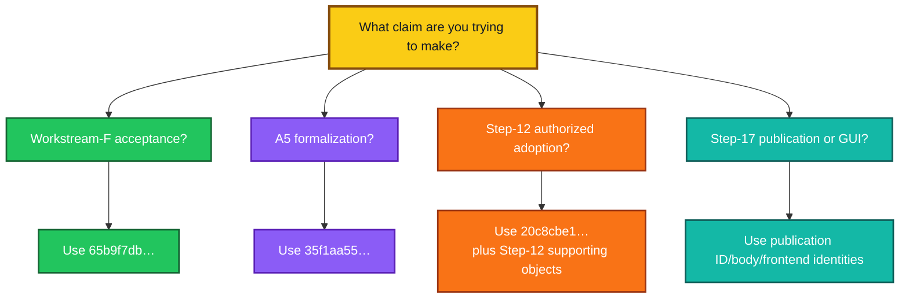
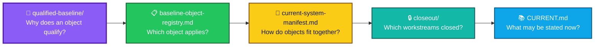
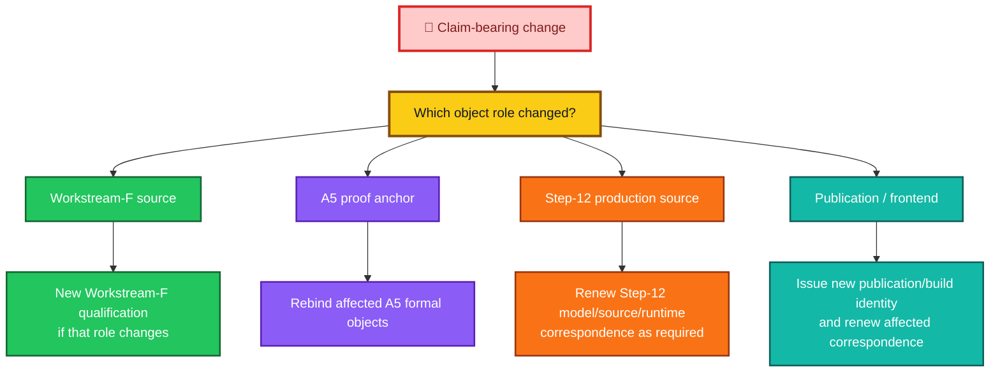

<div align="center">

# ALLIS — Qualified Baseline

### Acceptance-layer guide to role-scoped qualified objects and immutable baseline records

<br>


<br>

**Kidd’s Technical Services · ALLIS**

</div>

---

> [!IMPORTANT]
> This directory does not define one Git commit as the universal ALLIS baseline.
>
> ALLIS uses **role-scoped qualified objects**. A source object, proof anchor, production source, publication object, or runtime-reference object is authoritative only for the scope in which it was qualified, accepted, or correspondence-verified.

---

# 👀 Start here

Use this directory when you need to answer:

> **What object was qualified for this technical role, and what acceptance boundary applies to it?**

The short answer is:

```text
qualified-baseline/
    explains WHY an object qualifies for a role

baseline-object-registry.md
    tells you WHICH object applies to a scope

current-system-manifest.md
    shows HOW the accepted objects fit together now

closeout/
    records WHICH bounded workstreams reached final state

CURRENT.md
    states WHAT the accepted technical record supports now
```

---

# 📁 Directory contents

The qualified-baseline directory currently contains:

```text
acceptance/
└── qualified-baseline/
    ├── README.md
    └── qualified-baseline-manifest.md
```

That is intentional.

This README does **not** list planned or hypothetical acceptance files as though they already exist.

Detailed measurement, mathematics, formal-verification, correspondence, evidence, and closeout records remain in their own repository layers.

---

# 📌 Primary document

Read:

[`qualified-baseline-manifest.md`](qualified-baseline-manifest.md)

for the composite qualification record.

It explains:

- the Workstream-F qualified baseline;
- the A5 proof/source anchor;
- the Step-12 production DGM source;
- the Step-12 trust and governance objects;
- the Step-12 final evidence seal;
- the Step-17 publication identity;
- the Step-17 publication-body identity;
- the Step-17 frontend build;
- the explicit correspondence relationships among accepted objects;
- the relationships that are **not** asserted;
- the requalification rules for future claim-bearing changes.

The manifest is the authoritative entry point for this directory.

---

# 🧩 Object-role separation

ALLIS currently uses several separately qualified reference objects.

```mermaid
flowchart TB
    Q["📚 QUALIFIED BASELINE LAYER"]:::root

    F["✅ Workstream-F source<br/>65b9f7db…"]:::f
    A["📐 A5 proof/source anchor<br/>35f1aa55…"]:::a
    D["🔐 Step-12 production source<br/>20c8cbe1…"]:::d
    T["🔑 Step-12 trust object<br/>4809a1af…"]:::trust
    V["🧭 Step-12 governance object<br/>26523c0b…"]:::gov
    P["📦 Step-17 publication<br/>allis-publication-step6-retention-v2"]:::p
    B["#️⃣ Step-17 publication body<br/>d6ab6352…"]:::body
    G["🔎 Step-17 frontend build<br/>5By6R3…"]:::gui

    F --> Q
    A --> Q
    D --> Q
    T --> Q
    V --> Q
    P --> Q
    B --> Q
    G --> Q

    classDef root fill:#facc15,stroke:#854d0e,color:#111827,stroke-width:4px;
    classDef f fill:#22c55e,stroke:#166534,color:#ffffff,stroke-width:2px;
    classDef a fill:#8b5cf6,stroke:#5b21b6,color:#ffffff,stroke-width:2px;
    classDef d fill:#f97316,stroke:#9a3412,color:#ffffff,stroke-width:2px;
    classDef trust fill:#fed7aa,stroke:#ea580c,color:#7c2d12,stroke-width:2px;
    classDef gov fill:#fde68a,stroke:#ca8a04,color:#713f12,stroke-width:2px;
    classDef p fill:#14b8a6,stroke:#115e59,color:#ffffff,stroke-width:2px;
    classDef body fill:#0ea5e9,stroke:#075985,color:#ffffff,stroke-width:2px;
    classDef gui fill:#f0abfc,stroke:#c026d3,color:#701a75,stroke-width:2px;
```



The diagram is a role map.

It is not a source-equivalence graph.

---

# Current role map

| Role | Qualified reference | Scope |
|---|---|---|
| **Workstream-F qualified source** | `65b9f7dbd594ec9d225152aabd705eefc9216dbb` | Formal Workstream-F acceptance and close |
| **A5 proof/source anchor** | `35f1aa5586e1a23e1ab88f4d757c451b44506893` | Bounded A5/A5A formalization |
| **Step-12 production source** | `20c8cbe175781c8a1c05d65c03977859ceca884a` | Authorized-adoption formal and correspondence package |
| **Step-12 public trust** | `4809a1af3dd8fad1767dc5a8a9d67aa763388a055e00ec818c15f9fe0321fbb5` | Production verification trust |
| **Step-12 governance view** | `26523c0bad40ff06a75c62a802f20195295534764dce45cfa6acdcdaecc3fcc2` | NBB governance correspondence |
| **Step-17 publication** | `allis-publication-step6-retention-v2` | Governed public publication |
| **Step-17 publication body** | `d6ab63522f9080fae440578ebbb6ed42140595155c9a30253f5b8eeeef8009b7` | Direct/public publication-body correspondence |
| **Step-17 frontend build** | `5By6R3CWTM7NDXc-4lmSi` | Final Evidence & Governance Portal observation |

Each object answers a different technical question.

---

# Why `35f1aa…` is not the universal current baseline

The earlier qualified-baseline documentation treated:

```text
35f1aa5586e1a23e1ab88f4d757c451b44506893
```

as the common source object for the full qualification sequence.

That source remains important.

Its current role is narrower and clearer:

```text
35f1aa…
    =
A5 proof/source anchor
```

not:

```text
35f1aa…
    =
the one current ALLIS source baseline
```

The A5 object is authoritative for the bounded formalization tied to that source.

It does not silently identify:

- Workstream-F source authority;
- Step-12 production source;
- Step-17 publication state;
- the current frontend build;
- the complete ALLIS runtime.

---

# Workstream-F qualified source

The Workstream-F acceptance source is:

```text
Branch:
remediation/active-source-baseline-20260902

HEAD:
65b9f7dbd594ec9d225152aabd705eefc9216dbb

Tag:
stage10-auth-identity-65b9f7dbd594
```

Its bounded final state is:

```text
F1=CLOSED
F2=CLOSED
F3=CLOSED
F4=CLOSED
F5=CLOSED

WORKSTREAM_F_PROOFS_CLOSED=5
WORKSTREAM_F_PROOF_TARGET=5

WORKSTREAM_F_STATUS=CLOSED
```

The closed state applies to Workstream F.

It does not redefine every later ALLIS object.

---

# A5 proof/source anchor

The A5 source anchor is:

```text
HEAD:
35f1aa5586e1a23e1ab88f4d757c451b44506893

Tree:
36dd9f2425db4b23bacfce1cb258603cace25f1b
```

Its bounded formalization includes:

```text
85 protected roots

4 qualified root/component pairs

102 CFG nodes
107 CFG edges
0 unsupported control flow

76 broad effect candidates
47 source-bound / structural candidates
29 unresolved source symbols
```

Canonical graph SHA-256:

```text
08327d6fc77a1c5d18fd1d086b71b0ad95aa0cd86db652052e33cc3e0296cb66
```

The current A5 boundary still includes:

```text
EFFECT_SINK_SET_FROZEN=NO

GLOBAL_DIRECTED_WIRING_GRAPH_FROZEN=NO

DOMINATOR_OR_CUT_TEST_PERFORMED=NO

MATHEMATICAL_PROOF_PERFORMED=NO

MACHINE_CHECKED_THEOREM=NO

SOURCE_CORRESPONDENT=NO

RUNTIME_CORRESPONDENT=NO
```

So A5 is a qualified proof/source anchor, not a completed universal system theorem.

---

# Step-12 production source

The bounded Step-12 authorized-adoption workstream uses:

```text
20c8cbe175781c8a1c05d65c03977859ceca884a
```

for:

```text
DGM_PRODUCTION_AUTHORIZED_ADOPTION_MODEL_V1
```

Its final state is:

```text
GREEN_CLOSED_WITH_EXPLICIT_RESIDUALS
```

The source domain contains:

```text
11 governed production source files
```

The Step-12 source role is independent of both the Workstream-F source and the A5 anchor.

---

# Step-12 supporting objects

The Step-12 acceptance state also depends on separately identified objects.

## Public verification trust

```text
SHA-256:
4809a1af3dd8fad1767dc5a8a9d67aa763388a055e00ec818c15f9fe0321fbb5
```

## Governance view

```text
SHA-256:
26523c0bad40ff06a75c62a802f20195295534764dce45cfa6acdcdaecc3fcc2
```

## Final evidence seal

```text
SHA-256:
b00a954a924d3aa3490a5bcb8d4473da2b6885b8c41e116cf03545fee975c23b
```

These objects are part of the Step-12 acceptance record.

They are not source commits.

---

# Step-17 publication reference set

The Step-17 fixed goal is represented by publication and runtime-reference identities.

## Publication ID

```text
allis-publication-step6-retention-v2
```

## Publication body SHA-256

```text
d6ab63522f9080fae440578ebbb6ed42140595155c9a30253f5b8eeeef8009b7
```

## Payload SHA-256

```text
04ebb5bc1f97cbf56b8722fea9bcc7e7303cac2f5b467510d7a821d84d4a3c3c
```

## Frontend build

```text
5By6R3CWTM7NDXc-4lmSi
```

The final bounded Step-17 state is:

```text
FINAL_CRITERIA=25_OF_25_PASS

FINAL_NETWORK_CONTINUITY=GREEN

OVERALL_GOAL=GREEN_COMPLETE
```

These are not forced into a Git-source-baseline model because that is not what they are.

---

# 🧭 How to choose the correct object



If the claim spans more than one object, use the relevant correspondence record.

Do not infer equivalence merely because the objects appear in the same acceptance manifest.

---

# 🔗 Parent acceptance records

This directory is only one part of the acceptance layer.

The two parent records that organize the current composite state are:

## [`../baseline-object-registry.md`](../baseline-object-registry.md)

Use this file to answer:

> **Which qualified reference object applies to this scope?**

The registry assigns stable roles to qualified objects.

It prevents one source identity from being reused outside its supported domain.

---

## [`../current-system-manifest.md`](../current-system-manifest.md)

Use this file to answer:

> **How do the accepted objects and established correspondence relationships fit together now?**

The manifest records:

- qualified objects;
- trust objects;
- governance objects;
- evidence seals;
- publication objects;
- frontend identity;
- explicit correspondence edges;
- missing or prohibited equivalence claims;
- current system-level boundaries.

---

# Acceptance navigation



---

# Qualified baseline vs baseline-object registry

These two records are closely related but not interchangeable.

```text
qualified-baseline-manifest.md
    =
qualification rationale and role boundaries
```

```text
baseline-object-registry.md
    =
scope-to-object lookup
```

For example:

```text
Question:
Which source controls the Step-12 authorized-adoption package?

Registry answer:
OBJ-D1201 / 20c8cbe…

Manifest answer:
why OBJ-D1201 is the correct Step-12 production-source role
and what that role does not imply
```

---

# Qualified baseline vs current-system manifest

Likewise:

```text
qualified-baseline-manifest.md
    =
what qualifies for a role
```

while:

```text
current-system-manifest.md
    =
how qualified and accepted objects relate in the current system record
```

The current-system manifest is a composition map.

The qualified-baseline manifest is a qualification map.

---

# Qualified baseline vs closeout

The closeout layer answers a different question:

> **Did the bounded workstream reach its accepted final state?**

Current closeout records are maintained under:

```text
acceptance/closeout/
```

including:

- `workstream-f-close.md`
- `dgm-step12-close.md`
- `publication-step17-close.md`

A source can be qualified before a workstream is closed.

A closed workstream can retain explicit residuals.

Qualification and closeout are therefore separate records.

---

# Qualified baseline vs evidence

Evidence answers:

> **What record supports the claim?**

Qualification answers:

> **Which object is the claim about?**

For example:

```text
qualified object:
OBJ-D1201
```

may be supported by:

```text
evidence/governed-evolution/
```

while:

```text
qualified publication:
OBJ-P1701 / OBJ-P1702
```

may be supported by:

```text
evidence/publication/
```

The accepted object and its supporting evidence remain distinct.

---

# Qualified baseline vs correspondence

Correspondence answers:

> **Does one representation match or bind to another representation?**

Examples include:

```text
formal model
    ↔
Step-12 production source
```

```text
Step-12 production source
    ↔
observed NBB runtime
```

```text
direct publication body
    ↔
public publication body
```

```text
governed publication
    ↔
GUI consumption
```

A qualified object may exist even when a later correspondence stage remains unestablished.

---

# The absence of an edge is meaningful

This directory does not assert:

```text
65b9f7db…
    =
35f1aa55…
```

It does not assert:

```text
35f1aa55…
    =
20c8cbe1…
```

It does not assert:

```text
65b9f7db…
    =
20c8cbe1…
```

It does not assert:

```text
publication identity
    =
source identity
```

It does not assert:

```text
frontend build
    =
complete runtime identity
```

If a relationship is required for a claim, it must be supported by an explicit correspondence record.

---

# 🕒 Historical baselines are immutable records

A later qualified object does not rewrite an earlier one.

Historical baselines and reference objects remain part of the research record with their original:

- identity;
- scope;
- qualification state;
- evidence;
- assumptions;
- residuals;
- correspondence state;
- accepted conclusions.

The rule is:

```text
new qualified object
    ≠
rewrite old qualified object
```

Instead:

```text
old object
    remains immutable historical record

new object
    receives new identity

relationship
    is documented explicitly

affected claims
    are re-evaluated
```

---

# Historical does not mean invalid

A historical baseline can remain valid for the claim it originally supported.

For example:

```text
historical qualified source
    may remain authoritative
    for its historical bounded proof
```

even when:

```text
a later production source
    controls a later workstream
```

A later object does not retroactively change:

- the earlier source tree;
- the earlier proof domain;
- the earlier evidence;
- the earlier outcome;
- the earlier residuals.

---

# Supersession is role-specific

A successor only supersedes an earlier object for the role explicitly assigned to it.

Example:

```text
new production DGM source
    may supersede
old production DGM source
```

for future Step-12-like production claims.

That does not automatically supersede:

```text
Workstream-F historical acceptance source
```

or:

```text
A5 proof/source anchor
```

or:

```text
a sealed historical publication object
```

Supersession is not global by default.

---

# Baseline replacement rule

When a claim-bearing object changes:

```text
1. issue or identify the new immutable object identity
2. name the role it serves
3. name the scope it covers
4. identify any predecessor for that same role
5. preserve the predecessor record
6. re-evaluate affected measurements
7. re-evaluate affected formal models
8. re-evaluate affected proofs
9. renew correspondence where required
10. update the registry and current-system manifest
```

Do not overwrite the prior record to make it describe the new object.

---

# 🔄 Role-specific requalification



Requalification follows the changed claim surface.

---

# Current validation hierarchy

ALLIS distinguishes:

```text
Implemented
    ↓
Observed
    ↓
Demonstrated
    ↓
Formally Specified
    ↓
Proven
    ↓
Machine-Checked
    ↓
Correspondence-Verified
```

These levels describe **claims supported by evidence**.

They are not object classes.

A single qualified object may support claims at different validation levels.

---

# Qualification does not imply proof

A qualified object answers:

```text
what exact object is being studied?
```

It does not automatically answer:

```text
what has been proved about that object?
```

Therefore:

```text
qualified
    ≠
measured

measured
    ≠
formally specified

formally specified
    ≠
proven

proven
    ≠
source-correspondence verified

source-correspondence verified
    ≠
runtime-correspondence verified

bounded runtime correspondence
    ≠
whole-system proof
```

---

# Measurement results remain source-bound

Measurements associated with a qualified object should continue to state:

```text
reference object
domain
unit of analysis
inclusion rule
exclusion rule
procedure
result
evidence
interpretation boundary
```

Do not carry a measurement from one qualified object to another merely because the objects are related historically.

---

# Formal objects remain source-bound

Likewise, a formal object should identify its qualified source anchor.

For A5:

```text
35f1aa…
```

anchors its bounded graph and reduction work.

For Step 12:

```text
20c8cbe…
```

anchors the bounded production authorized-adoption formal/correspondence package.

Those formal domains are not merged merely because both concern ALLIS.

---

# Runtime observations remain time-specific

A runtime correspondence result has an observation boundary.

```text
correspondence passed at time τ
    ≠
correspondence guaranteed for all future time
```

This applies to:

- source/runtime correspondence;
- trust state;
- governance state;
- publication listener state;
- network continuity;
- GUI consumption;
- direct/public publication-body correspondence.

A claim-bearing runtime change may require renewed evidence.

---

# Publication identities remain immutable historical objects

A new publication should receive a new publication identity or integrity record.

Do not rewrite:

```text
allis-publication-step6-retention-v2
```

to describe a later publication object.

A later publication may supersede it as the current public object.

The earlier publication remains an immutable historical evidence object.

The same principle applies to its SHA-256 identity.

---

# Frontend builds remain independently identifiable

A new frontend build does not change the identity of an earlier build.

If a later build becomes current:

```text
new build identity
    +
new observation
    +
renewed publication/GUI correspondence where required
```

should be recorded.

Do not repurpose an earlier build identifier.

---

# Public documentation does not replace local source

This repository documents:

- accepted object identities;
- public-safe hashes;
- formal results;
- evidence states;
- correspondence states;
- claim boundaries;
- closeout status.

It does not require publishing private implementation source, private keys, credentials, or other sensitive operational material.

A public baseline record identifies the object and evidence boundary without turning the repository into a source-code mirror.

---

# What belongs in this directory

A document belongs in `acceptance/qualified-baseline/` when its primary purpose is to define or explain:

- qualification of a reference object;
- role-specific baseline identity;
- qualification boundaries;
- immutable historical-baseline treatment;
- requalification rules;
- relationship between qualified objects and the parent acceptance layer.

---

# What does not belong in this directory

Do not use this folder for:

```text
raw execution transcripts
```

Use evidence/provenance storage.

Do not use it for:

```text
formal theorem development
```

Use `formal-verification/`.

Do not use it for:

```text
mathematical graph construction
```

Use `mathematics/` or the applicable formal record.

Do not use it for:

```text
model-to-source or source-to-runtime proofs
```

Use `correspondence/`.

Do not use it for:

```text
workstream final-close records
```

Use `acceptance/closeout/`.

Do not use it for:

```text
current public claim inventory
```

Use `claims/` and `CURRENT.md`.

---

# No placeholder file tree

This README deliberately avoids presenting nonexistent files such as:

```text
qualification-method.md
measurement-registry.md
formal-model-registry.md
theorem-registry.md
correspondence-status.md
residuals-and-non-promotions.md
```

as though they are already part of this directory.

If a future repository change creates one of those files, it can be added to this README when it actually exists and has a defined role.

Repository documentation should describe the repository that exists.

---

# Repository layer boundaries

```text
acceptance/
    admitted qualified objects
    composite current state
    bounded closeout

measurements/
    empirical definitions and reproducibility

mathematics/
    mathematical objects and structures

formal-verification/
    theorem statements, proof status,
    specifications, model checks,
    counterexamples

correspondence/
    model ↔ source ↔ runtime
    publication ↔ HTTP ↔ GUI

evidence/
    source identities
    observations
    hashes
    residuals
    validation bundles
    final seals

claims/
    allowed claims
    nonclaims
    residual boundaries
```

The qualified-baseline directory is not intended to duplicate those layers.

---

# Reading path for a reviewer

For a fast current-state review:

```text
1. ../../CURRENT.md
2. ../current-system-manifest.md
3. ../baseline-object-registry.md
4. qualified-baseline-manifest.md
```

For a specific workstream:

```text
baseline-object-registry.md
        ↓
identify the correct object
        ↓
qualified-baseline-manifest.md
        ↓
understand its qualification role
        ↓
relevant closeout
        ↓
relevant evidence
        ↓
relevant correspondence
```

---

# Reading path for Workstream F

```text
../baseline-object-registry.md
        ↓
OBJ-F01
        ↓
qualified-baseline-manifest.md
        ↓
../closeout/workstream-f-close.md
```

Use that path for Workstream-F acceptance questions.

---

# Reading path for A5

```text
../baseline-object-registry.md
        ↓
OBJ-A501
        ↓
qualified-baseline-manifest.md
        ↓
A5/A5A mathematics and formal evidence
```

Use that path for bounded A5 source/formalization questions.

Do not use the Step-12 production source as a substitute for the A5 anchor unless explicit correspondence establishes that relationship.

---

# Reading path for Step 12

```text
../baseline-object-registry.md
        ↓
OBJ-D1201–OBJ-D1204
        ↓
qualified-baseline-manifest.md
        ↓
../closeout/dgm-step12-close.md
        ↓
../../evidence/governed-evolution/
        ↓
../../correspondence/authorized-adoption/
```

Use that path for authorized-adoption formal and runtime claims.

---

# Reading path for Step 17

```text
../baseline-object-registry.md
        ↓
OBJ-P1701–OBJ-P1703
        ↓
qualified-baseline-manifest.md
        ↓
../closeout/publication-step17-close.md
        ↓
../../evidence/publication/
        ↓
../../correspondence/publication/
```

Use that path for governed-publication, network, and GUI claims.

---

# Current acceptance boundaries

The current record supports strong bounded results.

It still preserves:

```text
PRODUCTION_MUTATION_SAFETY_THEOREM_PROVEN=NO

WHOLE_SYSTEM_SAFETY_THEOREM_PROVEN=NO

SYSTEM_PROVEN=NO
```

These are system-level boundaries.

They do not invalidate:

```text
WORKSTREAM_F_STATUS=CLOSED
```

or:

```text
STEP_12=GREEN_CLOSED_WITH_EXPLICIT_RESIDUALS
```

or:

```text
PUBLICATION_STEP_17=GREEN_COMPLETE
```

Each result remains valid within its own scope.

---

# Historical record policy

Historical qualified objects must remain auditable.

For each historical object, preserve enough information to recover:

```text
identity
role
scope
qualification state
supporting evidence
formal results
correspondence state
residuals
supersession relationship
```

Do not silently edit a historical object so that it appears to have supported a later result.

---

# Supersession record

Where one object supersedes another for the same role, document:

```yaml
supersession:
  predecessor: <old object>
  successor: <new object>
  role: <specific role>
  effective_scope: <scope>
  predecessor_preserved: true
  affected_claims_revalidated: <true|false|not_required>
  correspondence_renewed: <true|false|not_required>
```

Supersession is an explicit relationship.

It is not inferred from chronology.

---

# Minimum qualification record

A qualified baseline/reference record should let a reviewer determine:

```text
What object is this?

What role does it serve?

What exact immutable identity binds it?

What workstream owns it?

What scope does it cover?

What evidence qualifies it?

What close or seal applies?

What correspondence has been established?

At what observation boundary?

What stronger claim remains unsupported?

Has another object superseded it for this same role?
```

If those questions cannot be answered, the record is incomplete.

---

# Update rule

Update this README only when the structure or navigation of the qualified-baseline layer changes.

Examples:

- a new qualified-baseline document is actually added;
- a new role class is adopted;
- the parent registry path changes;
- the current-system manifest path changes;
- a historical-baseline archive is added;
- the qualification policy changes.

Do not rewrite this README merely because a runtime observation changes.

Runtime observations belong in the relevant evidence and correspondence records.

---

# Naming rule

New Markdown filenames in this layer should use:

```text
lowercase-words-separated-by-hyphens.md
```

Examples:

```text
qualified-baseline-manifest.md
historical-baseline-index.md
```

`README.md` retains the conventional repository filename.

Avoid introducing new underscore-separated filenames into this layer.

---

# 📦 Normalized directory contract

```yaml
allis_qualified_baseline_directory:

  purpose:
    identify_role_scoped_qualified_objects: true
    explain_qualification_boundaries: true
    preserve_historical_baselines: true

  current_files:
    - README.md
    - qualified-baseline-manifest.md

  parent_acceptance_records:
    baseline_object_registry:
      path: ../baseline-object-registry.md
      question: which_qualified_object_applies_to_this_scope

    current_system_manifest:
      path: ../current-system-manifest.md
      question: how_accepted_objects_and_correspondence_fit_together_now

  object_model:
    single_global_baseline_commit: false
    role_scoped_objects: true
    implicit_source_equivalence: false
    chronology_based_supersession: false

  historical_record_policy:
    overwrite_historical_baseline: false
    preserve_original_identity: true
    preserve_original_scope: true
    preserve_original_evidence: true
    preserve_original_residuals: true
    require_explicit_role_specific_supersession: true

  active_reference_roles:
    workstream_f:
      identity: 65b9f7dbd594ec9d225152aabd705eefc9216dbb

    a5:
      identity: 35f1aa5586e1a23e1ab88f4d757c451b44506893

    step12_production:
      identity: 20c8cbe175781c8a1c05d65c03977859ceca884a

    step17_publication:
      publication_id: allis-publication-step6-retention-v2
      publication_sha256: d6ab63522f9080fae440578ebbb6ed42140595155c9a30253f5b8eeeef8009b7
      frontend_build: 5By6R3CWTM7NDXc-4lmSi

  system_boundary:
    production_mutation_safety_theorem_proven: false
    whole_system_safety_theorem_proven: false
    system_proven: false
```

> [!NOTE]
> This YAML block is a navigation and documentation contract. The underlying qualification, evidence, closeout, formal-verification, and correspondence records remain authoritative for their respective claims.

---

# Related acceptance records

- [`qualified-baseline-manifest.md`](qualified-baseline-manifest.md) — composite role-scoped qualification manifest
- [`../baseline-object-registry.md`](../baseline-object-registry.md) — scope-to-object registry
- [`../current-system-manifest.md`](../current-system-manifest.md) — composite accepted-object and correspondence map
- [`../closeout/readme.md`](../closeout/readme.md) — bounded closeout index
- [`../closeout/workstream-f-close.md`](../closeout/workstream-f-close.md) — Workstream-F close
- [`../closeout/dgm-step12-close.md`](../closeout/dgm-step12-close.md) — Step-12 close
- [`../closeout/publication-step17-close.md`](../closeout/publication-step17-close.md) — Step-17 publication close
- [`../../CURRENT.md`](../../CURRENT.md) — current supported technical state

---

# Related evidence and correspondence

## Governed evolution

- [`../../evidence/governed-evolution/`](../../evidence/governed-evolution/)
- [`../../correspondence/authorized-adoption/`](../../correspondence/authorized-adoption/)

## Publication

- [`../../evidence/publication/`](../../evidence/publication/)
- [`../../correspondence/publication/source-to-publication-to-http-to-gui.md`](../../correspondence/publication/source-to-publication-to-http-to-gui.md)

---

# 🧾 Qualified-baseline summary

<div align="center">

### This directory does not define

# **ONE UNIVERSAL ALLIS COMMIT**

<br>

### It defines and explains

# **ROLE-SCOPED QUALIFIED OBJECTS**

<br>

### Current principal roles

✅ **Workstream F**  
`65b9f7db…`

📐 **A5 proof/source anchor**  
`35f1aa55…`

🔐 **Step-12 production source**  
`20c8cbe1…`

🌐 **Step-17 publication reference set**  
`allis-publication-step6-retention-v2`

<br>

### Historical policy

# **PRESERVE · DO NOT OVERWRITE**

<br>

### Whole-system boundary

# `SYSTEM_PROVEN=NO`

</div>

---

# Guiding principles

> **Qualification is role-scoped.**

> **No single source commit silently becomes the baseline for every ALLIS claim.**

> **A qualified object remains distinct from the evidence, proofs, and correspondence produced about it.**

> **The baseline-object registry determines which object applies to a scope.**

> **The current-system manifest determines how accepted objects fit together.**

> **A missing correspondence edge must not be inferred.**

> **A later object does not rewrite an earlier qualified object.**

> **Historical baselines remain immutable research records.**

> **Supersession is explicit and role-specific.**

> **Repository documentation should describe files that exist, not planned files as though they already exist.**

> **A closed bounded workstream does not become a whole-system proof.**
