<div align="center">

# ALLIS — Authority Planes

### How state crosses governed boundaries without turning capability, evidence, or computation into permission

<br>


<br>

**Kidd’s Technical Services · ALLIS**

</div>

---

> [!IMPORTANT]
> The organizing rule of the ALLIS authority architecture is:
>
> # **State does not become authority merely because it exists.**
>
> Information can exist, a model can reason, a candidate can score well, a theorem can hold, a service can be capable of acting, or qualified state can exist internally without any of those facts independently creating authority for the next protected transition.

---

# 👀 The architecture in one view

ALLIS is easier to understand as a sequence of **governed boundary crossings** than as a list of software services.

```mermaid
flowchart TB
    A["👤 PRIVATE / EXTERNAL STATE<br/>people · place · time · information · services"]:::private

    B["🛡️ INWARD AUTHORITY PLANE<br/>identity · provenance · use · disclosure"]:::inward

    C["🧠 GOVERNED COMPUTATION PLANE<br/>reasoning · evidence · spatial/temporal context"]:::compute

    D["🧪 CANDIDATE / EVALUATED STATE<br/>useful does not mean authorized"]:::candidate

    E["🔐 GOVERNED WRITE PLANE<br/>semantic commitment · authorization · target/prestate · one-use controls"]:::write

    F["✅ QUALIFIED / CONTROLLED STATE<br/>accepted state under defined authority"]:::qualified

    G["🌐 OUTWARD AUTHORITY PLANE<br/>publication eligibility · minimization · projection authority"]:::outward

    H["📦 GOVERNED READ / PUBLICATION PLANE<br/>immutable projection · read-only service · authorized route"]:::read

    I["🔎 PUBLIC EVIDENCE / GUI<br/>review without unrestricted ALLIS access"]:::public

    A --> B --> C --> D --> E --> F --> G --> H --> I

    classDef private fill:#ec4899,stroke:#9d174d,color:#ffffff,stroke-width:2px;
    classDef inward fill:#f97316,stroke:#9a3412,color:#ffffff,stroke-width:2px;
    classDef compute fill:#7c3aed,stroke:#4c1d95,color:#ffffff,stroke-width:2px;
    classDef candidate fill:#0ea5e9,stroke:#075985,color:#ffffff,stroke-width:2px;
    classDef write fill:#ef4444,stroke:#991b1b,color:#ffffff,stroke-width:2px;
    classDef qualified fill:#16a34a,stroke:#14532d,color:#ffffff,stroke-width:2px;
    classDef outward fill:#eab308,stroke:#854d0e,color:#111827,stroke-width:2px;
    classDef read fill:#14b8a6,stroke:#115e59,color:#ffffff,stroke-width:2px;
    classDef public fill:#2563eb,stroke:#1e3a8a,color:#ffffff,stroke-width:2px;
```

The architecture asks a different question at every boundary.

```text
Can ALLIS see this?
    ≠
May ALLIS use this?

Can ALLIS reason about this?
    ≠
May ALLIS act on this?

Can ALLIS generate a candidate?
    ≠
May ALLIS apply the candidate?

Does qualified state exist?
    ≠
May that state be disclosed or published?

Is something public?
    ≠
Does the public interface gain backend control authority?
```

Those distinctions are not implementation details.

They are the authority model.

---

# 🧭 What “authority plane” means

An authority plane is a **logical control boundary** that determines whether state may cross from one governance condition into another.

It is not necessarily:

- one process;
- one service;
- one container;
- one API;
- one file;
- one cryptographic object; or
- one human actor.

A plane can be implemented by several mechanisms acting together.

Conversely, one service can participate in more than one architectural concern without collapsing those concerns into a single permission.

The architecture therefore describes:

```text
what transition is being considered
+
what authority is required
+
what evidence or state is relevant
+
what must remain separate
```

rather than simply:

```text
which program runs next
```

---

# 🧱 The four non-equivalences

Four distinctions organize the entire model.

| Principle | Meaning |
|---|---|
| 🛡️ **State ≠ authority** | A state object does not authorize its own use, disclosure, mutation, or promotion. |
| 🔐 **Capability ≠ permission** | A component that technically can act is not automatically permitted to act. |
| 🧾 **Evidence ≠ execution authority** | Evidence can justify a claim without authorizing a transition. |
| 🔗 **Correspondence ≠ permanence** | A runtime or publication that matched once must be revalidated after claim-bearing change. |

A fifth distinction follows naturally:

```text
workstream completion
    ≠
successor-work authority
```

A closed scope does not create permission to extend itself.

---

# 🛡️ Authority is transition-specific

ALLIS does not treat authority as a universal flag attached to a user, service, model, or organization.

Authority is evaluated for an **exact transition**.

Conceptually:

```text
Authority =
    actor / source
  + subject / resource
  + requested operation
  + purpose
  + recipient where relevant
  + policy
  + provenance
  + time
  + current state
  + exact scope
```

The same actor can therefore be:

```text
authorized for operation A
```

and simultaneously:

```text
not authorized for operation B
```

This is intentional.

---

# 🧬 The authority stack

ALLIS separates several concepts that ordinary application designs often combine.

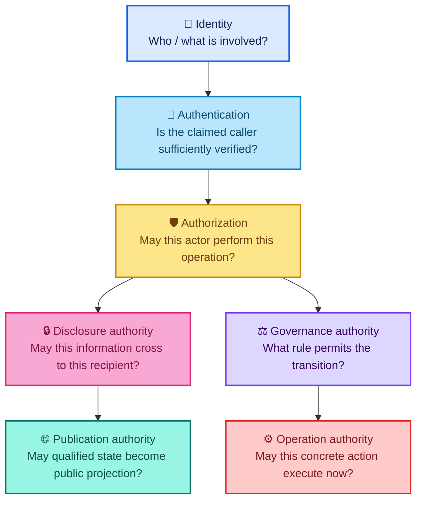

These relationships can interact.

They do not collapse.

```text
identity
    ≠
authentication
    ≠
authorization
    ≠
disclosure authority
    ≠
governance authority
    ≠
operation authority
    ≠
publication authority
```

---

# 👤 Plane 1 — Private and external state

The first plane contains state that exists **before ALLIS is permitted to treat it as ordinary governed computational context**.

Examples include:

- person-linked information;
- external records;
- community observations;
- GIS and place information;
- service responses;
- research sources;
- institutional information;
- private memory;
- claims submitted by a caller.

Existence is not admission.

```text
information exists
    ≠
information is verified
    ≠
information is authorized for this use
```

This is especially important for person-linked state.

---

# 🛡️ Plane 2 — Inward authority

The inward authority plane governs **admission, use, and disclosure scope before protected state enters broader computation**.

It asks questions such as:

```text
What is this information?
Who or what does it concern?
Where did it come from?
Who is requesting its use?
Is identity sufficiently established?
Is the purpose authorized?
Is this recipient authorized?
Is disclosure permitted?
Is retention permitted?
Is the state still temporally valid?
```

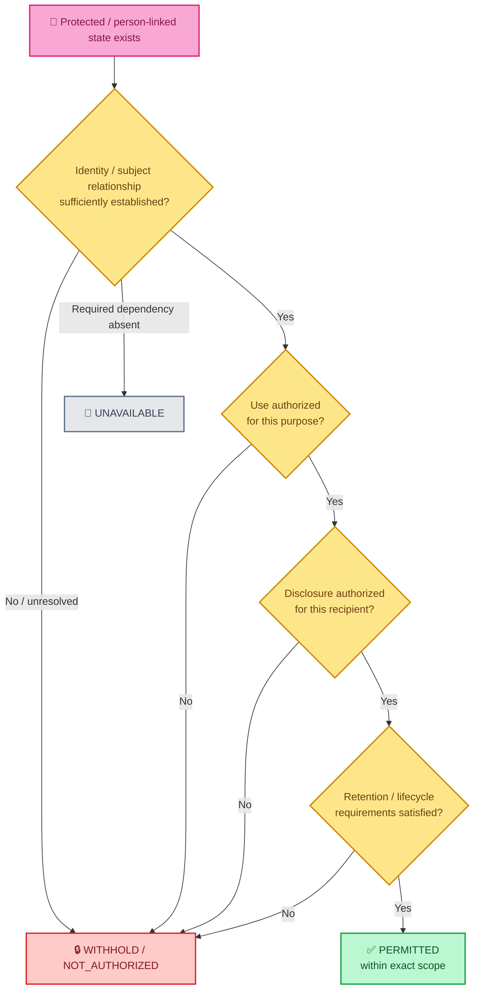

The controlling privacy distinction is:

```text
private state exists
    ≠
identity authority exists
    ≠
use authority exists
    ≠
disclosure authority exists
    ≠
retention authority exists
    ≠
public publication authority exists
```

> **Private state does not become shared state merely because ALLIS can see it.**

---

# 🧠 Plane 3 — Governed computation

Once state is admitted for a defined purpose, ALLIS can perform governed computation.

This plane can include:

- semantic reasoning;
- evidence comparison;
- geographic reasoning;
- temporal reasoning;
- provenance analysis;
- retrieval;
- synthesis;
- evaluation;
- candidate generation;
- structured uncertainty;
- claim analysis.

But computational success is deliberately non-authoritative.

A result can be:

- useful;
- plausible;
- internally consistent;
- spatially relevant;
- well-supported by evidence;
- generated by a qualified component;

and still lack authority to:

- become durable protected state;
- become a verified public fact;
- become person-linked memory;
- disclose private information;
- modify production state;
- trigger an external operation;
- publish itself.

```text
reasoning result
    ≠
authority object
```

---

# 💬 Ms. Allis lives on the intelligence-facing side of this architecture

Ms. Allis is an analytical and advisory intelligence that can operate through ALLIS.

She is not synonymous with ALLIS.

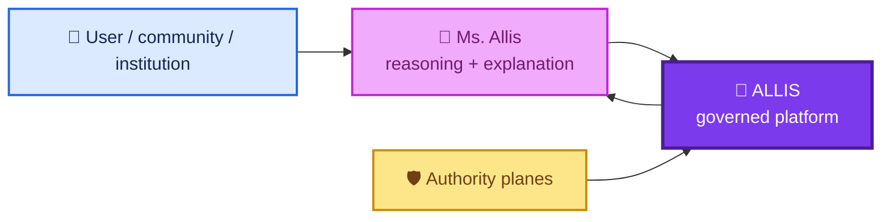

A conversational request can create:

```text
a question
a proposed task
a candidate action
```

It does not automatically create:

```text
system authority
disclosure authority
production mutation authority
institutional authority
```

Reasoning is not self-authorization.

---

# 🧪 Plane 4 — Candidate and evaluated state

A candidate is a proposed transition.

Examples can include:

- a proposed system change;
- a candidate policy;
- a candidate response;
- an evaluated artifact;
- a proposed publication object;
- a proposed external operation.

Candidate generation and evaluation belong before authority.

```text
candidate generated
    ≠
candidate evaluated
    ≠
candidate authorized
    ≠
candidate applied
```

A high score, passing evaluation, or successful test can contribute evidence.

None of those results makes the candidate its own authority.

---

# 🔐 Plane 5 — Governed write authority

The write plane governs transitions that **change protected state**.

The Step-12 production DGM authorized-adoption path is a concrete bounded example of this architecture.

```mermaid
flowchart LR
    A["💡 Candidate proposed"]:::c1
    B["🧪 Candidate evaluated"]:::c2
    C["🧾 Exact authority-bearing<br/>semantics committed"]:::c3
    D["🛡️ Independent authorization"]:::c4
    E["🎯 Target + expected prestate<br/>validated"]:::c5
    F["1️⃣ One-use / replay controls"]:::c6
    G["🔧 Governed application"]:::c7
    H["✅ Poststate checks"]:::c8
    I["🧾 Durable receipt"]:::c9

    A --> B --> C --> D --> E --> F --> G --> H --> I

    classDef c1 fill:#bfdbfe,stroke:#2563eb,color:#172554,stroke-width:2px;
    classDef c2 fill:#a5f3fc,stroke:#0891b2,color:#164e63,stroke-width:2px;
    classDef c3 fill:#ddd6fe,stroke:#7c3aed,color:#3b0764,stroke-width:2px;
    classDef c4 fill:#fecaca,stroke:#dc2626,color:#7f1d1d,stroke-width:2px;
    classDef c5 fill:#fed7aa,stroke:#ea580c,color:#7c2d12,stroke-width:2px;
    classDef c6 fill:#fde68a,stroke:#ca8a04,color:#713f12,stroke-width:2px;
    classDef c7 fill:#bbf7d0,stroke:#16a34a,color:#14532d,stroke-width:2px;
    classDef c8 fill:#86efac,stroke:#15803d,color:#14532d,stroke-width:2px;
    classDef c9 fill:#99f6e4,stroke:#0f766e,color:#134e4a,stroke-width:2px;
```

The core distinction is:

```text
CandidateEnvelope
    ≠
AuthorizationEnvelope
```

The candidate cannot authorize itself.

The evaluator cannot silently become the signer merely because it judged the candidate acceptable.

The worker cannot mint the external authority it is responsible for verifying.

---

# 🧷 Semantic commitment completeness

Cryptographic validity is necessary.

It is not sufficient if decision-bearing semantics are missing from the committed object.

The current bounded DGM model represents a candidate envelope containing semantic context including:

```text
proposal
target
expected prestate
candidate content
evaluation
scores
expected tests
```

The governing rule is:

> **Every authority-bearing semantic input must be committed where the authorization decision depends on it.**

Conceptually:

```text
AuthorizationDecision = f(X1, X2, X3, ...)
```

If:

```text
Xi affects AuthorizationDecision
```

then:

```text
Xi must be inside the cryptographic commitment
```

A valid signature over an incomplete semantic object proves authorization only for what was actually committed.

It cannot authorize omitted semantics by implication.

---

# 🔑 Verification authority is not signing authority

The Step-12 architecture provides a concrete example.

The runtime can verify an authorization object.

That does not mean the runtime has authority to mint the private authorization itself.

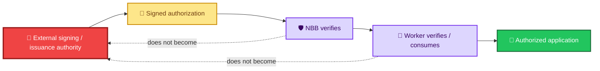

Therefore:

```text
can verify
    ≠
can sign

can consume
    ≠
can mint

runtime correspondence
    ≠
runtime sovereignty
```

---

# 1️⃣ One-use and replay authority

Authority can be valid and still become unavailable after use.

That means authority itself has lifecycle state.

A simplified model is:

```text
issued
    ↓
valid for exact scope
    ↓
available / unspent
    ↓
reserved / consumed
    ↓
spent
```

A spent authority object does not regain permission merely because the underlying candidate still exists.

This is why ALLIS distinguishes:

```text
candidate existence
    ≠
fresh authorization availability
```

and:

```text
previous authorization
    ≠
replay permission
```

---

# 🎯 Target and prestate are part of authority

A permission to modify one target or one expected state is not a general permission to modify another.

The write plane therefore separates:

```text
authorization valid
```

from:

```text
authorization valid for this target
```

and:

```text
authorization valid for this expected prestate
```

A useful mental model is:

```text
authorization
    =
who / what
+ exact target
+ exact transition
+ expected state
+ temporal / replay condition
+ committed semantics
```

---

# ✅ Plane 6 — Qualified / controlled state

After a governed transition succeeds, ALLIS can hold qualified or controlled state.

But qualification is still not universal authority.

Qualified state means:

```text
accepted under a defined scope
```

not:

```text
permitted for every downstream use
```

For example:

```text
qualified internal state
    ≠
publicly publishable state
```

and:

```text
qualified evidence
    ≠
authority to mutate production
```

and:

```text
closed workstream
    ≠
authority to start the next workstream
```

---

# 🌐 Plane 7 — Outward publication authority

The outward authority plane governs the transition:

```text
qualified internal state
    ↓
publicly eligible projection
```

This boundary asks:

```text
Is this state eligible for publication?
What exact fields may be projected?
What privacy or disclosure rules apply?
What provenance must travel with the projection?
What uncertainty must remain visible?
Which publication identity is being created?
Which route is authorized to expose it?
```

Publication authority is separate from write authority.

A state can be properly written internally and still be ineligible for public exposure.

---

# 🔄 The inward and outward boundaries are architectural duals

The inward boundary asks:

> **May this state enter this governed context?**

The outward boundary asks:

> **May this qualified state leave through this governed projection?**

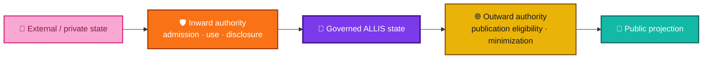

The symmetry is important:

```text
state does not enter automatically
```

and:

```text
state does not leave automatically
```

---

# 📦 Plane 8 — Governed read / publication plane

Once publication eligibility is established, ALLIS can produce a governed public projection.

The Step-17 publication architecture is the current bounded example.

```mermaid
flowchart LR
    A["✅ Qualified controlled state"]:::q
    B["🛡️ Publication eligibility"]:::e
    C["📦 Immutable publication"]:::p
    D["🔒 Isolated loopback-only<br/>read service"]:::s
    E["🚦 Authorized route"]:::r
    F["🌐 Public HTTPS publication"]:::h
    G["🔎 Evidence & Governance Portal"]:::g

    A --> B --> C --> D --> E --> F --> G

    classDef q fill:#bbf7d0,stroke:#16a34a,color:#14532d,stroke-width:2px;
    classDef e fill:#fde68a,stroke:#ca8a04,color:#713f12,stroke-width:2px;
    classDef p fill:#a7f3d0,stroke:#059669,color:#064e3b,stroke-width:2px;
    classDef s fill:#ddd6fe,stroke:#7c3aed,color:#3b0764,stroke-width:2px;
    classDef r fill:#fed7aa,stroke:#ea580c,color:#7c2d12,stroke-width:2px;
    classDef h fill:#bae6fd,stroke:#0284c7,color:#0c4a6e,stroke-width:2px;
    classDef g fill:#f0abfc,stroke:#c026d3,color:#701a75,stroke-width:2px;
```

The current bounded publication architecture preserves:

```text
qualified internally
    ≠
publication eligible
    ≠
published
    ≠
publicly routed
    ≠
unrestricted backend access
```

At the final Step-17 observation, the public plane was read-only.

Public availability did not create public mutation authority.

---

# 🔐 The read plane is not the write plane

The two directions are intentionally symmetric but not identical.

| 🔐 Governed write plane | 🌐 Governed read plane |
|---|---|
| Candidate exists | Qualified internal state exists |
| Candidate evaluated | Publication eligibility evaluated |
| Authority-bearing semantics committed | Public projection fields selected |
| Independent authorization required | Publication authority required |
| Target/prestate checked | Publication scope/minimization checked |
| One-use/replay controls | Immutable publication identity |
| Protected state can change | Protected state is projected outward |
| Durable mutation receipt | Public body/provenance identity |
| No self-authorization | No self-publication |
| Worker cannot mint its own authority | GUI cannot gain backend write authority |

> **Neither direction is automatic. Both require a governed boundary crossing.**

---

# 🔎 Plane 9 — Public evidence and GUI

The public interface sits **after** publication authority.

It can present governed state.

It does not become an independent authority source.

The current public pattern is:

```text
ALLIS controlled state
    ↓
publication eligibility
    ↓
immutable publication
    ↓
read-only public route
    ↓
Evidence & Governance Portal
```

The GUI can help a person:

- review current published state;
- inspect provenance;
- understand validation status;
- see bounded claims;
- distinguish established from unresolved results.

The GUI does not manufacture:

- system-administrator authority;
- production write authority;
- signing authority;
- disclosure authority beyond the published projection;
- legal authority;
- institutional authority;
- whole-system proof.

---

# ↔️ Three protected crossings

The architecture can be reduced to three major protected crossings.

```mermaid
flowchart LR
    A["👤 External / private state"]:::a
    B["🛡️ CROSSING 1<br/>Admission authority"]:::b
    C["🧠 Governed computation<br/>+ candidate state"]:::c
    D["🔐 CROSSING 2<br/>Write authority"]:::d
    E["✅ Qualified state"]:::e
    F["🌐 CROSSING 3<br/>Publication authority"]:::f
    G["🔎 Public evidence"]:::g

    A --> B --> C --> D --> E --> F --> G

    classDef a fill:#f9a8d4,stroke:#db2777,color:#831843,stroke-width:2px;
    classDef b fill:#f97316,stroke:#9a3412,color:#ffffff,stroke-width:3px;
    classDef c fill:#7c3aed,stroke:#4c1d95,color:#ffffff,stroke-width:2px;
    classDef d fill:#ef4444,stroke:#991b1b,color:#ffffff,stroke-width:3px;
    classDef e fill:#22c55e,stroke:#166534,color:#ffffff,stroke-width:2px;
    classDef f fill:#eab308,stroke:#854d0e,color:#111827,stroke-width:3px;
    classDef g fill:#2563eb,stroke:#1e3a8a,color:#ffffff,stroke-width:2px;
```

### Crossing 1 — Admission

```text
May this state be used here?
```

### Crossing 2 — Protected transition

```text
May this candidate change protected state?
```

### Crossing 3 — Publication

```text
May this controlled state become public evidence?
```

Each crossing uses different authority.

Passing one crossing does not pre-authorize the next.

---

# 🧾 Evidence is a cross-cutting plane, not a substitute for authority

Evidence moves alongside state and authority.

It can support:

- a factual claim;
- a qualification decision;
- an authorization decision;
- a proof;
- a correspondence result;
- a publication decision.

But:

```text
evidence
    ≠
authority
```

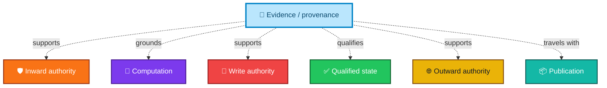

Strong evidence can justify an action.

It does not execute the action merely by being strong.

---

# 🔗 Correspondence is another cross-cutting plane

Formal truth, source identity, runtime state, publication identity, and GUI display are different objects.

ALLIS therefore treats correspondence as explicit.

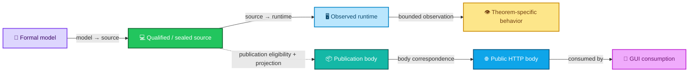

One established edge does not create every other edge.

```text
formal proof
    ≠
source correspondence

source correspondence
    ≠
runtime correspondence

runtime source match
    ≠
theorem-specific live observation

internal qualified state
    ≠
public publication

public publication
    ≠
permanent future publication correspondence
```

The current DGM record now contains two distinct correspondence epochs:

```text
historical Step-12 correspondence
    ≠
current post-A8 correspondence observation
```

The later post-A8 observation revalidates the same stable theorem-relevant source identity against a newer observed runtime. It does not rewrite the historical Step-12 seal.

For current B/C claims, the evidence chain is:

```text
qualified theorem / formal result
    +
current source/runtime correspondence
    +
current theorem-specific live observation
```

For A, the first two elements are present but the positive live authorized-apply observation is not.

---

# 🕒 Authority and correspondence both have time

Temporal state matters in two different ways.

## Authority can expire or be consumed

Examples:

```text
valid now
spent after use
expired later
not valid before start
```

## Correspondence can drift

A runtime that matched at a seal boundary can change.

A public publication that matched a sealed body can later be replaced.

Therefore:

```text
authority valid at time τ
    ≠
authority valid forever
```

and:

```text
correspondence at time τ
    ≠
correspondence forever
```

Time is not metadata around authority.

It can be part of authority itself.

---

# ⚖️ Human and institutional authority remain distinct

ALLIS can support human and institutional decision-making.

It does not absorb the independent authority of those institutions.

Examples include:

- government agencies;
- universities;
- nonprofit organizations;
- community organizations;
- courts;
- regulators;
- landowners;
- professional authorities.

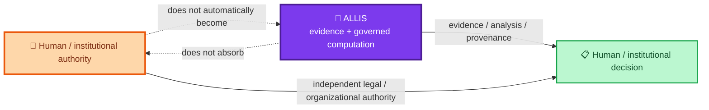

The architecture preserves:

```text
observation
    ≠
verified fact

local knowledge
    ≠
institutional authority

participation
    ≠
competency

competency
    ≠
unrestricted system authority

system evidence
    ≠
government / academic / legal decision authority
```

---

# 🏘️ Community governance is not automatically technical authority

Community participation can contribute:

- observation;
- local knowledge;
- stewardship;
- governed feedback;
- evaluation;
- competency-based roles.

But status in a community process does not automatically grant:

- ALLIS administrator authority;
- production mutation authority;
- universal fact-validation authority;
- institutional authority;
- government authority;
- private disclosure authority.

Likewise:

```text
ALLIS technical authority
    ≠
community governance authority
```

MountainShares, The Commons, Community Champions, and deployment programs can interact with ALLIS without becoming synonymous with the ALLIS technical authority model.

---

# 🗺️ Geographic state is not jurisdiction

Location matters deeply in ALLIS.

It does not automatically create authority.

```text
this event is near place X
    ≠
ALLIS has authority over place X
```

```text
this record concerns property Y
    ≠
ALLIS has property authority over Y
```

```text
this person is located in jurisdiction Z
    ≠
ALLIS automatically knows every legal rule that governs Z
```

Geographic state provides context.

Jurisdictional or institutional authority remains separately established.

---

# 🧪 Validation is not authority

The ALLIS validation ladder is:

```text
IMPLEMENTED
    ↓
OBSERVED
    ↓
DEMONSTRATED
    ↓
FORMALLY SPECIFIED
    ↓
PROVEN
    ↓
MACHINE-CHECKED
    ↓
CORRESPONDENCE-VERIFIED
```

Those labels answer:

> **How strongly is this claim supported?**

They do not answer:

> **Is this protected operation authorized right now?**

A theorem can be true and still lack operation authority.

A runtime can correspond and still lack publication authority.

A workstream can close and still lack successor authority.

---

# 🔒 Fail-closed outcomes are semantically distinct

Missing authority does not always mean the same thing.

| Outcome | Meaning |
|---|---|
| ⛔ `BLOCKED / DENIED` | The requested transition is prohibited. |
| 🔒 `WITHHELD / NOT_AUTHORIZED` | State can exist, but authority for this use or disclosure is absent. |
| 📴 `UNAVAILABLE` | A required dependency or qualified state cannot currently be reached. |
| 🟡 `GOVERNED_DEGRADED` | A bounded reduced mode is permitted without pretending full operation. |
| ❓ `UNRESOLVED` | Required evidence or authority has not yet been adjudicated. |
| ➖ `NOT_APPLICABLE` | The lane or transition does not apply to this request. |

The common rule is:

> **Missing authority must never be silently converted into permission.**

A companion architecture record should define these semantics in greater depth:

```text
architecture/fail-closed-semantics.md
```

---

# 🧮 Current bounded evidence mapped to the planes

The architecture is broader than any one workstream.

Current engineering evidence nevertheless provides concrete examples of several planes.

| Plane / boundary | Current bounded evidence |
|---|---|
| 🟢 Acceptance / qualified state | Workstream F formally `CLOSED` |
| 🔐 Write authority | DGM Step 12 authorized-adoption model |
| 🧷 Semantic commitment | Candidate-envelope commitment repair represented in formal model |
| 🔑 Verification vs signing | NBB/worker verify external authorization; issuance remains external to modeled runtime |
| 1️⃣ Replay / one-use | Step-12 one-time authorization semantics |
| 🔗 Write-plane correspondence | Historical Step-12 model→source and runtime evidence plus current post-A8 NBB/worker `PASS_11_OF_11`; B/C theorem-specific live observations revalidated |
| 🌐 Outward/publication authority | Step-17 publication eligibility and governed projection |
| 📦 Read/publication plane | Immutable publication; isolated loopback service; authorized route |
| 🔎 Public interface | Evidence & Governance Portal at final observation |
| 🔗 Read-plane correspondence | Direct publication body = public body; GUI consumption demonstrated |
| ⚪ Whole-system theorem | `SYSTEM_PROVEN=NO` |

This table is an evidence map.

It does not convert the architectural document itself into proof.

---

# 🟠 Step 12 as a bounded write-plane example

Step 12 is important because it formalizes a current production authorized-adoption path.

Formal object:

```text
DGM_PRODUCTION_AUTHORIZED_ADOPTION_MODEL_V1
```

Production source:

```text
20c8cbe175781c8a1c05d65c03977859ceca884a
```

Final state:

```text
GREEN_CLOSED_WITH_EXPLICIT_RESIDUALS
```

Principal theorem states:

```text
T12D-A = MACHINE_CHECKED
T12D-B = CORRESPONDENCE_VERIFIED
T12D-C = CORRESPONDENCE_VERIFIED
P12C-09 = MACHINE_CHECKED_DISPROVEN
```

## Current evidence note

The architectural meaning of the write plane has **not** changed.

The evidence basis has become stronger and more current.

The historical Step-12 `MACHINE_CHECKED` classification retains its original Step-12 meaning: machine-executed source-structure checks plus bounded execution evidence.

A later Lean 4.34.0 R1 workstream independently formalized and kernel-checked the principal Step-12 result set. That later proof-assistant layer is successor evidence; it does **not** retroactively redefine the historical Step-12 label.

The current post-A8 source/runtime relationship is:

```text
IMMUTABLE_SOURCE_IDENTITY=PASS_11_OF_11
NBB_SOURCE_TO_RUNTIME_CORRESPONDENCE=PASS_11_OF_11
WORKER_SOURCE_TO_RUNTIME_CORRESPONDENCE=PASS_11_OF_11
CURRENT_POST_A8_DGM_SOURCE_TO_RUNTIME_CORRESPONDENCE=PASS_11_OF_11
```

For `T12D-B`, the later live revalidation observed a deliberately invalid authorization signature being rejected without authorized-spool publication, authorization consumption, or receipt creation.

For `T12D-C`, the later live revalidation observed an empty spool remaining non-applying: no worker claim, authorization consumption, receipt, or authorized apply occurred.

Those current observations support:

```text
T12D-B = CORRESPONDENCE_VERIFIED
T12D-C = CORRESPONDENCE_VERIFIED
```

For `T12D-A`, current source/runtime correspondence is present, but the positive authorized-apply production observation was deliberately not executed.

Therefore:

```text
T12D-A = MACHINE_CHECKED
```

remains the current validation level.

No real production authorization was issued or consumed and no production DGM patch was applied during those bounded post-A8 probes.

See:

- [Lean R1 workstream closeout](../formal-verification/authorized-adoption/lean/workstream-closeout-r1.md)
- [Post-A8 DGM theorem correspondence registry R1](../evidence/governed-evolution/post-a8-theorem-correspondence-registry-r1.md)

The architectural lesson is not:

```text
write plane = universally proven
```

The lesson is:

```text
a protected write path can be decomposed into
candidate
+ semantic commitment
+ authorization
+ target / prestate
+ replay state
+ controlled application
+ receipt
+ correspondence
```

with each claim held to its own evidence boundary.

---

# 🔴 The write plane includes recovery state

Step 12 disproved unconditional terminal totality.

A claimed record can remain claimed if terminalization fails.

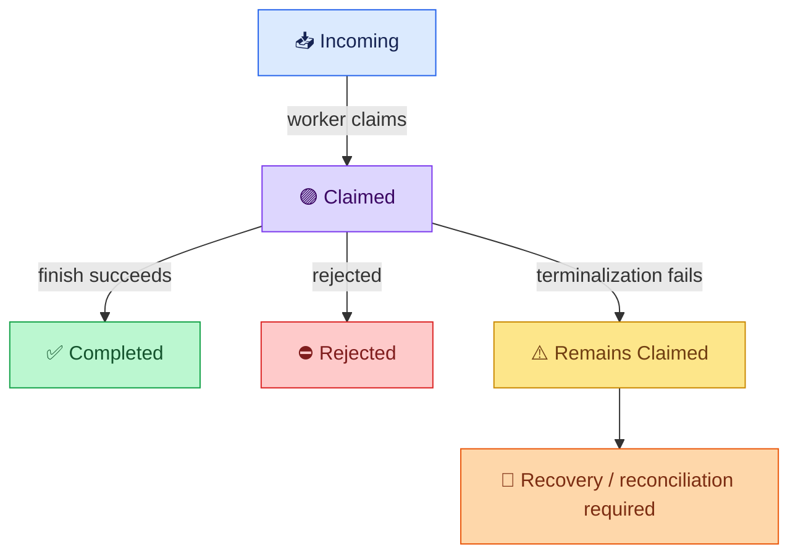

That counterexample changes the architecture documentation.

The correct model includes a recoverable nonterminal claimed state.

It does not pretend:

```text
claimed
    ⇒
completed or rejected
```

unconditionally.

---

# 🟦 Step 17 as a bounded read-plane example

Step 17 provides the current bounded example of controlled outward publication.

Final fixed-goal state:

```text
Steps 0–17 = GREEN
Final criteria = 25 / 25 PASS
Final network continuity = GREEN
Overall goal = GREEN_COMPLETE
```

Publication identity:

```text
allis-publication-step6-retention-v2
```

Publication SHA-256:

```text
d6ab63522f9080fae440578ebbb6ed42140595155c9a30253f5b8eeeef8009b7
```

Frontend build:

```text
5By6R3CWTM7NDXc-4lmSi
```

The bounded result demonstrates:

- immutable publication identity;
- strict read-only publication boundary;
- no public mutation endpoint;
- service isolation;
- loopback-only service exposure;
- authorized routing;
- GUI publication consumption;
- no unrestricted direct GUI→ALLIS access;
- direct/public publication-body correspondence;
- point-in-time network continuity.

The architectural lesson is:

```text
publicly visible
    ≠
publicly mutable
```

---

# 🧭 Write plane and read plane are dual governance problems

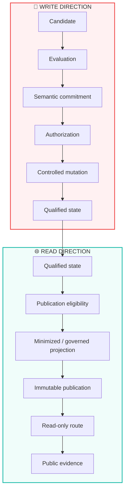

The write plane protects:

```text
what may change inside
```

The read plane protects:

```text
what may leave outside
```

The inward plane protects:

```text
what may enter governed use
```

Together they form the primary authority geometry of ALLIS.

---

# 🧭 Authority can be visualized as a membrane system

A useful conceptual picture is:

```text
                    PUBLIC / EXTERNAL WORLD

         ┌──────────────────────────────────────┐
         │       OUTWARD AUTHORITY MEMBRANE     │
         │  publication eligibility / disclosure│
         └──────────────────┬───────────────────┘
                            │
                    QUALIFIED STATE
                            │
         ┌──────────────────┴───────────────────┐
         │          WRITE AUTHORITY MEMBRANE    │
         │ authorization / semantics / replay   │
         └──────────────────┬───────────────────┘
                            │
                  CANDIDATE / REASONING
                            │
         ┌──────────────────┴───────────────────┐
         │       INWARD AUTHORITY MEMBRANE      │
         │ identity / provenance / use / privacy│
         └──────────────────┬───────────────────┘
                            │
                    PRIVATE / EXTERNAL STATE
```

The membranes do not make state disappear.

They constrain the ways state may cross.

---

# 🔁 Authority provenance

An authority object should be traceable.

At minimum, an authority claim should be answerable in terms of:

```text
Who or what issued it?
For which transition?
For which subject / target?
Under which policy?
For what purpose?
For which recipient if disclosure is involved?
For what time window?
Was it already consumed?
Which semantics did it bind?
Which evidence supports its validity?
```

Authority without provenance is not equivalent to governed authority.

This is why ALLIS preserves:

> **Authority itself has provenance.**

---

# 🧾 Receipts and evidence do not retroactively create authority

A receipt can show that a transition occurred.

It does not prove that the transition was authorized unless the receipt is tied to the relevant authorization evidence.

Likewise:

```text
action succeeded technically
    ≠
action was authorized
```

and:

```text
receipt exists
    ≠
all governance requirements were satisfied
```

Receipts belong in the evidence chain.

Authority belongs before the protected transition.

---

# 🧱 Workstream authority is also bounded

Authority planes apply not only inside runtime behavior but also to the engineering program.

Examples:

## Workstream F

```text
5 / 5 proofs complete
    ⇒
eligible to close
```

but:

```text
eligible to close
    ≠
formal close authority
```

A separate one-time close authority was required.

After close:

```text
FURTHER_WORKSTREAM_F_PROOF_EXECUTION_AUTHORIZED=NO
```

## Step 12

```text
Step 12 complete
    ≠
next workstream authorized
```

## Step 17

```text
fixed goal complete
    ≠
automatic Step 18
```

The same principle applies at every scale:

> **A state transition requires authority for that transition.**

---

# 🧠 Why ALLIS does not use “agent can do X” as an authority model

A capability-centered model tends to ask:

```text
Can the component execute this tool / API / mutation?
```

ALLIS asks a different question:

```text
May this exact transition occur
under the current evidence,
identity,
policy,
provenance,
scope,
and authority state?
```

That difference matters because:

```text
technical capability
    ≠
permission
```

An intelligent component can propose.

A governed architecture decides whether the proposal can cross a protected boundary.

---

# 📍 Place, time, and authority

ALLIS treats spatial and temporal context as first-class state.

They can influence authority.

For example:

```text
same actor
+ same operation
+ different place
```

can be a different governance question.

Likewise:

```text
same authority object
+ different time
```

can produce a different validity result.

But geographic and temporal relevance do not themselves create authority.

```text
location context
    ≠
jurisdiction

time context
    ≠
permission
```

They are inputs to the authority decision.

---

# 🔬 Architecture vs proof

This document defines architectural relationships.

It does not claim that every plane has the same validation level.

```text
architectural requirement
    ≠
implemented control
    ≠
observed runtime behavior
    ≠
formal theorem
    ≠
machine-checked result
    ≠
correspondence-verified result
```

The current evidence supports some bounded planes more strongly than others.

Detailed claim status belongs in:

```text
claims/claim-registry.md
claims/nonclaims-and-residuals.md
```

Detailed evidence belongs in the relevant workstream evidence and closeout records.

> [!NOTE]
> This reconciliation does **not** admit a current A8 frontend/private-context identity into the authority-plane model. No exact sealed A8 production identity is being inferred here. A future A8 private-context record, if admitted from sealed evidence, belongs on the inward/private application boundary and must remain distinct from both H_people runtime authority and the DGM theorem runtime.

---

# ⚪ Current system boundary

The authority-plane architecture does not imply a whole-system proof.

The controlling system-level statements remain:

```text
PRODUCTION_MUTATION_SAFETY_THEOREM_PROVEN=NO

WHOLE_SYSTEM_SAFETY_THEOREM_PROVEN=NO

SYSTEM_PROVEN=NO
```

This is compatible with:

```text
Workstream F = CLOSED
Step 12 = GREEN_CLOSED_WITH_EXPLICIT_RESIDUALS
Publication Step 17 = GREEN_COMPLETE
```

A bounded green result remains bounded.

---

# 🚦 Boundary failure should preserve meaning

When an authority check does not succeed, ALLIS should preserve the reason rather than flattening all outcomes into “false.”

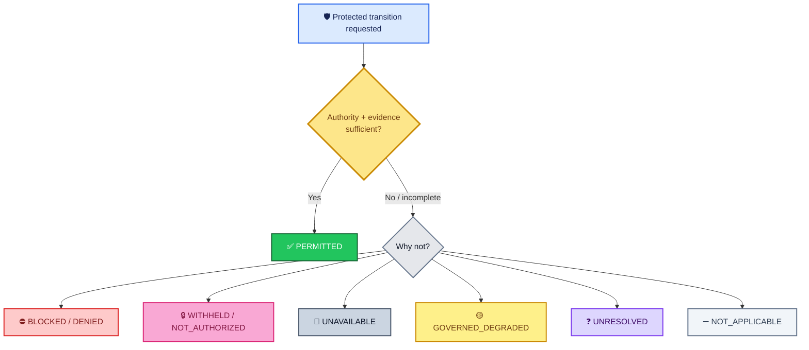

This prevents:

```text
missing authority
    ⇒
assume permission
```

and prevents:

```text
missing data
    ⇒
assume success
```

---

# 🧩 Relationship to other architecture records

`authority-planes.md` answers:

> **Where are the major governed authority crossings in ALLIS, and what must remain separate at each crossing?**

Other architecture records answer different questions.

| Record | Primary question |
|---|---|
| `architecture/authority-planes.md` | Where does authority gate state transition and disclosure? |
| `architecture/fail-closed-semantics.md` | What do safe non-success states mean? |
| `architecture/private-state/h-people-boundary.md` | How is person-linked/private state governed? |
| `architecture/system-boundary/allis-system-boundary.md` | What is inside and outside ALLIS? |
| `architecture/trust-and-authority/trust-and-authority-overview.md` | How do identity, authentication, authorization, disclosure, governance, and operation authority differ? |
| `architecture/state-models/state-model-overview.md` | What kinds of state exist and how do they transition? |
| `architecture/deployment-model/deployment-model-overview.md` | How can ALLIS be instantiated without a deployment defining the platform? |

---

# 🧾 Relationship to acceptance and claims

Architecture describes the control model.

Acceptance says which bounded objects and workstreams reached accepted states.

Claims say what those accepted states permit the documentation to assert.

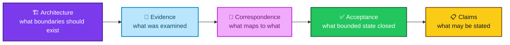

No layer substitutes for another.

---

# 📚 Related repository records

## Current state

- [`../CURRENT.md`](../CURRENT.md)
- [`../README.md`](../README.md)

## Acceptance

- [`../acceptance/current-system-manifest.md`](../acceptance/current-system-manifest.md)
- [`../acceptance/baseline-object-registry.md`](../acceptance/baseline-object-registry.md)
- [`../acceptance/closeout/README.md`](../acceptance/closeout/README.md)

## Claims

- [`../claims/claim-registry.md`](../claims/claim-registry.md)
- [`../claims/nonclaims-and-residuals.md`](../claims/nonclaims-and-residuals.md)

## Existing architecture

- [`system-boundary/allis-system-boundary.md`](system-boundary/allis-system-boundary.md)
- [`trust-and-authority/trust-and-authority-overview.md`](trust-and-authority/trust-and-authority-overview.md)
- [`state-models/state-model-overview.md`](state-models/state-model-overview.md)
- [`deployment-model/deployment-model-overview.md`](deployment-model/deployment-model-overview.md)

## Step-12 bounded write-plane records

- [`../formal-verification/authorized-adoption/formal-model.md`](../formal-verification/authorized-adoption/formal-model.md)
- [`../formal-verification/authorized-adoption/theorem-registry.md`](../formal-verification/authorized-adoption/theorem-registry.md)
- [`../formal-verification/authorized-adoption/lean/workstream-closeout-r1.md`](../formal-verification/authorized-adoption/lean/workstream-closeout-r1.md)
- [`../correspondence/authorized-adoption/model-to-source.md`](../correspondence/authorized-adoption/model-to-source.md)
- [`../correspondence/authorized-adoption/source-to-runtime.md`](../correspondence/authorized-adoption/source-to-runtime.md)
- [`../evidence/governed-evolution/post-a8-theorem-correspondence-registry-r1.md`](../evidence/governed-evolution/post-a8-theorem-correspondence-registry-r1.md)
- [`../acceptance/closeout/dgm-step12-close.md`](../acceptance/closeout/dgm-step12-close.md)

## Step-17 bounded read-plane record

- [`../acceptance/closeout/publication-step17-close.md`](../acceptance/closeout/publication-step17-close.md)

---

# 📦 Normalized architecture model

```yaml
allis_authority_planes:

  governing_rules:
    state_does_not_create_authority: true
    capability_does_not_create_permission: true
    evidence_does_not_create_execution_authority: true
    workstream_completion_does_not_create_successor_authority: true
    authority_has_provenance: true
    authority_is_transition_specific: true

  inward_plane:
    direction: external_or_private_to_governed_use
    concerns:
      - identity
      - authentication
      - provenance
      - use_authority
      - disclosure_authority
      - retention_scope
      - recipient_scope
      - temporal_validity
    fail_closed_when_authority_absent: true

  computation_plane:
    may:
      - reason
      - retrieve
      - compare_evidence
      - use_spatial_context
      - use_temporal_context
      - evaluate
      - propose_candidates
    does_not_self_authorize:
      - protected_mutation
      - private_disclosure
      - public_publication
      - external_action

  candidate_plane:
    candidate_exists_equals_authorized: false
    evaluation_pass_equals_authorized: false

  write_plane:
    protected_direction: candidate_to_controlled_state
    requires:
      - semantic_commitment
      - independent_authorization
      - target_validation
      - prestate_validation
      - temporal_or_replay_validity
      - controlled_application
      - receipt_or_evidence
    verifier_equals_signer: false
    candidate_equals_authorization: false

  controlled_state:
    qualified_equals_publication_eligible: false
    qualified_equals_universal_authority: false

  outward_plane:
    direction: controlled_state_to_public_projection
    requires:
      - publication_eligibility
      - disclosure_or_privacy_scope
      - projection_minimization
      - provenance
      - publication_identity
      - authorized_route

  read_plane:
    public_mutation_authority: false
    unrestricted_gui_backend_access: false
    publication_is_governed_projection: true
    runtime_correspondence_is_point_in_time: true

  cross_cutting:
    evidence:
      creates_authority_by_itself: false
    correspondence:
      formal_to_source: separate
      source_to_runtime: separate
      runtime_to_live_observation: separate
      publication_to_public_http: separate
      public_http_to_gui: separate
      permanent_without_revalidation: false

  human_and_institutional_authority:
    remains_independent: true
    absorbed_by_allis: false

  current_bounded_examples:
    workstream_f:
      status: CLOSED
    dgm_step12:
      role: bounded_write_plane_example
      status: GREEN_CLOSED_WITH_EXPLICIT_RESIDUALS
      historical_machine_checked_meaning_preserved: true
      later_lean_r1_qualification_recorded_separately: true
      current_post_a8_source_runtime_correspondence: PASS_11_OF_11
      current_theorem_status:
        T12D-A: MACHINE_CHECKED
        T12D-B: CORRESPONDENCE_VERIFIED
        T12D-C: CORRESPONDENCE_VERIFIED
        P12C-09: MACHINE_CHECKED_DISPROVEN
      positive_authorized_apply_executed_post_a8: false
    publication_step17:
      role: bounded_read_plane_example
      status: GREEN_COMPLETE

  system_boundary:
    production_mutation_safety_theorem_proven: false
    whole_system_safety_theorem_proven: false
    system_proven: false
```

> [!NOTE]
> This YAML block is a human-readable architectural normalization. It does not replace workstream-local evidence, formal models, correspondence records, or acceptance seals.

---

# 🧾 Authority-plane summary

<div align="center">

### 👤 INWARD
**May this state enter governed use?**

↓

### 🧠 COMPUTE
**What does the state mean?**

↓

### 🧪 CANDIDATE
**What transition is proposed?**

↓

### 🔐 WRITE
**May protected state change?**

↓

### ✅ QUALIFIED
**What state has been accepted under defined authority?**

↓

### 🌐 OUTWARD
**May qualified state leave through a governed projection?**

↓

### 📦 READ / PUBLICATION
**What may be exposed through the read-only public boundary?**

↓

### 🔎 PUBLIC EVIDENCE
**What may people inspect without gaining unrestricted backend authority?**

<br>

# `STATE ≠ AUTHORITY`

# `CAPABILITY ≠ PERMISSION`

# `EVIDENCE ≠ EXECUTION AUTHORITY`

# `SYSTEM_PROVEN=NO`

</div>

---

# Governing authority principles

> **State does not become authority merely because it exists.**

> **A transition requires authority for that transition.**

> **Authority itself has provenance.**

> **Private state does not become shared state merely because ALLIS can see it.**

> **A candidate does not authorize itself.**

> **A component capable of applying a change does not thereby acquire authority to mint the authorization it verifies.**

> **Every authority-bearing semantic input must be committed where the authorization decision depends on it.**

> **Qualified internal state does not publish itself.**

> **Public availability does not create public mutation authority.**

> **Human and institutional authority remain independent where those authorities properly belong.**

> **Correspondence is relationship-specific and time-specific.**

> **Later proof and correspondence evidence can strengthen the evidence basis without changing the authority-plane architecture or rewriting historical closes.**

> **A closed workstream does not authorize its own successor.**

> **Claims remain limited to the evidence, authority, scope, source, runtime, and correspondence that actually support them.**
