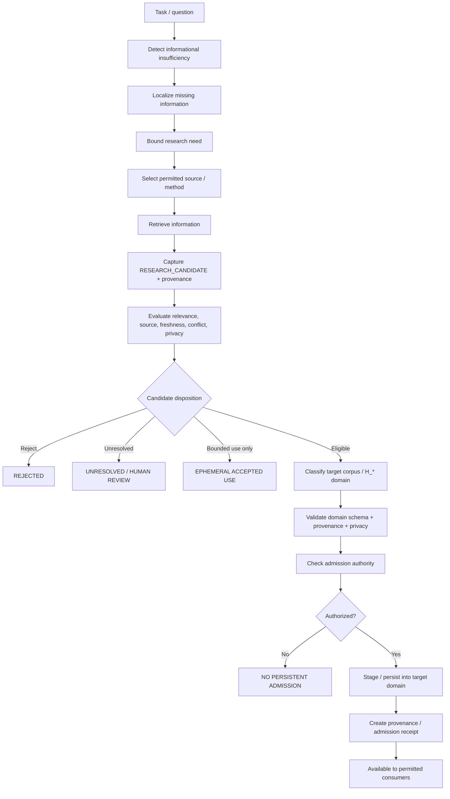
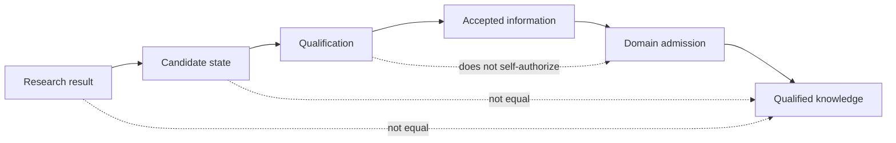

<div align="center">

# ALLIS — Automated Learning Graph

### Intended governed path from informational insufficiency to bounded research, candidate evidence, qualification, and domain-specific corpus/Hilbert admission

<br>


<br>

**Kidd's Technical Services · ALLIS**

</div>

---

> [!IMPORTANT]
> This document defines the **intended Automated Learning Graph**.
>
> It is an architecture and qualification target.
>
> It does **not** state that automated web research, research-to-corpus ingestion, or autonomous persistent learning is currently qualified.
>
> Current status remains:
>
> ```text
> AUTOMATED_LEARNING_WEB_RESEARCH_QUALIFIED=NO
>
> RESEARCH_TO_CORPUS_INGESTION_QUALIFIED=NO
> ```
>
> The governing rule is:
>
> ```text
> research result
>     ≠
> qualified knowledge
>     ≠
> admitted persistent state
> ```

---

# 1. Purpose

The Automated Learning Graph is intended to let ALLIS identify when the current knowledge available to a bounded task is insufficient, determine what information is missing, conduct only the research needed to address that insufficiency, evaluate the resulting candidate information, and route accepted information into the correct governed corpus or H_* domain.

The graph is not intended to:

- browse indiscriminately;
- persist everything it finds;
- convert search results directly into truth;
- create authority from model confidence;
- insert material into every corpus;
- rewrite protected state;
- silently alter JCP;
- turn conversational output into permanent system knowledge.

---

# 2. Core graph

The intended high-level flow is:

```text
task / question / system need
    ↓
detect informational insufficiency
    ↓
identify missing information
    ↓
bound research need
    ↓
select permitted research method/source class
    ↓
retrieve candidate information
    ↓
capture provenance
    ↓
evaluate candidate
    ↓
reject / retain as unresolved / accept
    ↓
if accepted:
select proper corpus / H_* domain
    ↓
apply domain-specific admission rules
    ↓
persist or stage under authority
    ↓
make available to permitted consumers
```

The key state distinction is:

```text
retrieved information
    ↓
candidate state
    ↓
qualification
    ↓
accepted information
    ↓
domain-specific admission
    ↓
qualified persistent state
```

No stage should be skipped.

---

# 3. Informational insufficiency

The Automated Learning Graph begins with a bounded determination that the current information is insufficient for a defined purpose.

Use:

```text
INFORMATIONAL_INSUFFICIENCY
```

rather than:

```text
model curiosity
```

The graph should ask:

- What task is being attempted?
- What information is currently available?
- What material question cannot be answered from qualified available information?
- Is the missing information necessary or merely interesting?
- Can the task proceed safely without it?
- Is external research permitted for this task?
- Would a narrower uncertainty statement be preferable to research?

---

# 4. Insufficiency is not failure

A knowledge gap is a valid system state.

Preserve:

```text
information missing
    ≠
system malfunction
```

and:

```text
information missing
    ≠
permission to invent
```

The system should be able to return:

```text
INSUFFICIENT_INFORMATION
```

without manufacturing a fact.

---

# 5. Gap localization

Once insufficiency is detected, the system should localize the gap.

Conceptually:

```text
available qualified information
    +
task requirements
    ↓
missing-information delta
```

The gap should identify:

```text
subject

question

time period

geographic scope

required precision

required provenance

affected domain

why the missing information matters
```

This gap object is the basis for bounded research.

---

# 6. Research-need object

The system should create a bounded research-need record rather than an open-ended research instruction.

Recommended fields:

```text
research_need_id

triggering_task

missing_fact_or_relation

subject_scope

temporal_scope

geographic_scope

required_source_quality

allowed_source_classes

prohibited_source_classes

maximum_research_scope

freshness_requirement

target_domain

persistence_intent

authority_context
```

This object should be auditable.

---

# 7. Research should be minimum necessary

The research scope should satisfy:

```text
minimum necessary to resolve the identified gap
```

not:

```text
collect everything related to the topic
```

This limits:

- privacy exposure;
- irrelevant ingestion;
- source contamination;
- cost;
- false confidence;
- uncontrolled system growth.

---

# 8. Research selection

The graph should determine the appropriate research mode.

Possible modes may include:

```text
READ_ONLY_WEB_RESEARCH

QUALIFIED_PUBLIC_DATABASE_QUERY

GOVERNED_API_QUERY

LOCAL_CORPUS_RETRIEVAL

HUMAN_REVIEW_REQUEST

NO_RESEARCH_ALLOWED
```

The method must be chosen from policy and task requirements.

The model should not create a new access class merely because information would be useful.

---

# 9. Read-only research boundary

The first planned external-research mode should be read-only.

Preserve:

```text
research
    =
information acquisition
```

not:

```text
research
    =
external mutation
```

A web-research component should not:

- create external accounts;
- post content;
- alter external records;
- authorize transactions;
- accept legal terms;
- persist privileged material into a public system;
- take unrelated external actions.

Those would require separate authority and architecture.

---

# 10. Candidate research result

Every research result enters ALLIS first as:

```text
RESEARCH_CANDIDATE
```

not:

```text
QUALIFIED_KNOWLEDGE
```

A candidate may contain:

```text
content

source

URL / source identifier

retrieval time

publication time if available

author / organization

source class

quoted or extracted evidence

transformation history

research-need linkage
```

The graph must retain the difference between the source material and any model-generated summary of it.

---

# 11. Provenance is mandatory

Candidate state should carry sufficient provenance to answer:

```text
Where did this come from?

When was it retrieved?

What was the source?

What did the source actually say?

What transformations were applied?

Why was it retrieved?

Which gap was it intended to address?
```

If required provenance cannot be established:

```text
QUALIFIED_ADMISSION=BLOCKED
```

The candidate may remain unresolved evidence, but it should not silently become persistent qualified knowledge.

---

# 12. Candidate-state separation

The architecture should maintain a distinct candidate state.

Conceptually:

```text
research_candidates/
```

or an equivalent governed state class.

Candidate state should be separate from:

```text
qualified corpus

qualified H_* projection

public knowledge

protected private state
```

The storage implementation may differ.

The semantic separation must remain.

---

# 13. Candidate evaluation

A candidate should be evaluated against the research need.

Evaluation should consider:

```text
relevance

source authority

source independence

currency

scope match

internal consistency

conflicting evidence

provenance completeness

privacy implications

domain fit

precision

confidence / uncertainty
```

No single score should automatically grant admission.

---

# 14. Research result can remain unresolved

The graph must support:

```text
UNRESOLVED
```

as a legitimate result.

Examples:

- credible sources disagree;
- source is stale;
- geographic scope mismatches;
- provenance is incomplete;
- source is secondary where primary evidence is required;
- information is suggestive but not sufficient;
- identity correspondence cannot be established.

Preserve:

```text
uncertain
    ≠
false
```

and:

```text
uncertain
    ≠
qualified
```

---

# 15. Candidate dispositions

Recommended candidate dispositions:

```text
REJECTED

UNRESOLVED

NEEDS_HUMAN_REVIEW

ACCEPTED_FOR_BOUNDED_USE

ELIGIBLE_FOR_DOMAIN_ADMISSION
```

Do not use:

```text
ACCEPTED
```

without saying accepted for what.

---

# 16. Research confidence is not authority

A high-confidence research result does not create permission to persist it.

Preserve:

```text
confidence
    ≠
authority
```

and:

```text
source credibility
    ≠
admission authority
```

Admission requires a separate governed transition.

---

# 17. Domain routing

After candidate qualification, determine the correct target domain.

Possible destinations include:

```text
public factual corpus

technical evidence corpus

H_geo

H_p

H_people PUBLIC

H_people PRIVATE

H_commons

H_App

temporal projection

research-only archive

no persistent destination
```

The graph must not use a generic:

```text
memory
```

destination for all accepted information.

---

# 18. Domain selection must be semantic

The target should be selected from what the information **means**, not merely its vector similarity.

Examples:

```text
geographic fact
    →
possible H_geo / geographic corpus
```

```text
civic/government fact
    →
possible H_p / civic corpus
```

```text
person-specific protected fact
    →
H_people governed path
```

```text
community governance aggregate
    →
possible H_commons
```

The final domain requires separate domain rules.

---

# 19. H_geo routing

Candidate information may be eligible for H_geo only if its semantics are geographic/spatial and its H_geo admission contract is satisfied.

Review:

```text
source geography

coordinate / geometry quality

spatial reference

geographic scope

time

precision

provenance

authority
```

Current R3 boundary remains:

```text
H_GEO_CURRENT_JCP_ADMISSION=NO
```

Research-to-H_geo admission does not imply H_geo-to-JCP admission.

---

# 20. H_p routing

Civic/government information may be eligible for H_p only under its separate governed civic-query contract.

Do not treat:

```text
public government information
```

as automatically:

```text
H_p qualified state
```

The H_p producer, persistence, retrieval, and authority contracts must first be established.

---

# 21. H_people routing

Person-linked information requires stronger controls.

Candidate person information must not enter H_people merely because it is publicly discoverable.

The graph should consider:

```text
subject identity

source legitimacy

privacy class

purpose

minimum necessary

provenance

retention

disclosure implications

legal/governance authority
```

H_people SECRET rules remain separate.

---

# 22. H_people SECRET boundary

Research does not grant authority to create or disclose H_people SECRET state.

Preserve:

```text
publicly discoverable person information
    ≠
H_people SECRET admission authority
```

and:

```text
research result
    ≠
identity correspondence authority
```

The permanent SECRET disclosure boundary remains independently governed.

---

# 23. H_people PRIVATE boundary

A private contextual fact may be eligible for private use under a separately qualified contract.

That does not imply:

```text
SECRET
```

and does not imply:

```text
PUBLIC
```

Tier assignment should be explicit.

---

# 24. H_commons routing

Community/aggregate information may be a candidate for H_commons only after current H_commons semantics are requalified.

Legacy Commons formal material is not enough by itself.

Current rule:

```text
legacy H_commons evidence
    ≠
current automatic admission contract
```

---

# 25. H_App routing

Application-specific learned state may belong to H_App only after H_App semantics are defined and its persistence/authority contract is qualified.

Do not use H_App as a catch-all destination for information that does not fit elsewhere.

---

# 26. Research-only archive

Some accepted research may remain:

```text
RESEARCH_ONLY
```

rather than entering a production corpus.

This is appropriate when the information is useful for analysis or future review but does not yet meet domain-admission requirements.

Preserve:

```text
accepted for research reference
    ≠
production knowledge
```

---

# 27. No-persistence outcome

A successful research task may legitimately end with:

```text
NO_PERSISTENCE
```

For example:

- one-time current information;
- volatile market/weather/event state;
- user-requested answer not suitable for corpus;
- privacy-sensitive material;
- insufficient authority;
- low-value ephemeral fact.

Learning should not be equated with saving everything.

---

# 28. Domain admission gate

Before persistent admission, require:

```text
candidate qualified

target domain identified

schema valid

provenance complete

privacy classification valid

authority present

duplicate/conflict handling complete

persistence policy permits

domain-specific quality threshold met
```

Only then:

```text
DOMAIN_ADMISSION_ELIGIBLE=YES
```

Eligibility is still not self-executing authority.

---

# 29. Admission state machine

Recommended states:

```text
RETRIEVED
    ↓
CANDIDATE
    ↓
EVALUATED
    ↓
ACCEPTED_FOR_BOUNDED_USE
    ↓
ADMISSION_ELIGIBLE
    ↓
AUTHORIZED
    ↓
PERSISTED
```

Failure branches:

```text
REJECTED

UNRESOLVED

WITHHELD

HUMAN_REVIEW_REQUIRED

EXPIRED
```

A failed transition should not silently jump to `PERSISTED`.

---

# 30. Persistence receipt

Any governed persistent admission should create a record sufficient to reconstruct:

```text
what was admitted

from which candidate

from which source

under which authority

into which domain

when

under which schema / producer version
```

This record should support later invalidation or supersession where applicable.

---

# 31. Duplicate handling

The Automated Learning Graph must define what happens when candidate information overlaps existing state.

Possible outcomes:

```text
DUPLICATE_NO_CHANGE

CONFIRMS_EXISTING

UPDATES_EXISTING

SUPERSEDES_EXISTING

CONFLICTS_WITH_EXISTING

REQUIRES_HUMAN_REVIEW
```

Do not overwrite simply because the new result is more recent.

---

# 32. Conflict handling

Conflicting credible candidates should remain visible as conflict until resolved.

Preserve:

```text
two sources disagree
    ≠
average the claims
```

and:

```text
newer source
    ≠
automatically correct
```

Conflict resolution must be domain-specific.

---

# 33. Temporal validity

Every research candidate should be evaluated for time.

Record:

```text
retrieval_time

source_publication_time

event_time

valid_from

valid_until

freshness_requirement
```

A candidate may be accurate historically but unsuitable as current state.

---

# 34. Geographic validity

When location matters, record:

```text
geographic scope

precision

jurisdiction

coordinate reference where relevant

generalization

source geography
```

A source about one population or geography must not be treated as current evidence for another without explicit justification.

---

# 35. Information-class boundary

Research may produce different information classes:

```text
fact

claim

opinion

forecast

estimate

observation

legal text

policy

measurement

derived inference
```

The candidate should retain that class.

Do not transform:

```text
source opinion
```

into:

```text
system fact
```

through ingestion.

---

# 36. Source-quality class

Recommended source classes:

```text
PRIMARY_OFFICIAL

PRIMARY_RESEARCH

AUTHORITATIVE_DATA

SECONDARY_HIGH_QUALITY

SECONDARY_GENERAL

COMMUNITY_REPORT

UNVERIFIED

UNKNOWN
```

The target domain may require minimum source classes.

---

# 37. Transformation lineage

If candidate content is summarized, extracted, geocoded, embedded, normalized, or otherwise transformed, record the lineage.

Conceptually:

```text
source
    ↓
extract
    ↓
normalize
    ↓
summarize
    ↓
embed
    ↓
candidate domain object
```

Each transformation may introduce uncertainty.

---

# 38. Embedding is not qualification

Future research candidates may be embedded for retrieval.

Preserve:

```text
embedding generated
    ≠
knowledge qualified
```

and:

```text
vector stored temporarily
    ≠
domain admission complete
```

The H384 mathematical carrier does not provide epistemic qualification.

---

# 39. H384 relationship

Future candidate embeddings may use the planned:

```text
H384 := Fin 384 → ℝ
```

carrier.

That establishes a mathematical representation only.

It does not determine:

- source credibility;
- semantic domain;
- privacy;
- authority;
- truth;
- persistence;
- JCP admission.

---

# 40. Automated research and JCP

The research graph should not write directly into JCP.

Preserve:

```text
research candidate
    ≠
JCP context
```

Any information later used in conversation must pass through the appropriate qualified domain/projection and current JCP/conversational admission rules.

---

# 41. Automated research and cognition

Cognition may identify a knowledge gap.

Cognition may propose a bounded research need.

That does not mean cognition may authorize the research or persist the result unless the relevant authority contract permits it.

Preserve:

```text
cognition detects insufficiency
    ≠
cognition owns admission authority
```

---

# 42. Automated research and conversation

Ordinary conversation may trigger identification of insufficient information.

The expected bounded flow is:

```text
conversation
    ↓
insufficiency detected
    ↓
research need
    ↓
research candidate
    ↓
qualified bounded answer
```

Persistence remains separate.

A user answer may be produced from current research without making the result durable system knowledge if the policy allows bounded ephemeral use.

---

# 43. Ephemeral research answer

The architecture should support:

```text
RESEARCH_FOR_CURRENT_RESPONSE
```

without:

```text
PERSIST_TO_CORPUS
```

This is important for current events and volatile information.

The candidate may support one response while remaining nonpersistent.

---

# 44. Persistent learning is a separate transition

A result used in one answer does not automatically become learned persistent state.

Preserve:

```text
used in response
    ≠
learned durably
```

and:

```text
helpful
    ≠
admission authorized
```

---

# 45. Research failure

If research fails:

```text
information gap remains
```

The graph should not fabricate a successful learning state.

Preserve:

```text
RESEARCH_FAILURE
    →
INFORMATION_GAP_REMAINS
```

not:

```text
RESEARCH_FAILURE
    →
ASSUME_ANSWER
```

---

# 46. Provenance failure

If provenance fails:

```text
candidate cannot be promoted
```

Recommended result:

```text
PROVENANCE_INSUFFICIENT

ADMISSION=BLOCKED
```

The source material may remain available for audit if permitted.

---

# 47. Admission failure

If domain admission fails:

```text
candidate remains candidate / unresolved
```

It does not become persistent qualified Hilbert state.

Preserve:

```text
FAILED_ADMISSION
    ≠
PERSISTED_QUALIFIED_STATE
```

---

# 48. Authority failure

If authority is absent:

```text
NO_AUTHORITY
    →
NO_PERSISTENT_ADMISSION
```

Even perfect evidence does not create its own permission.

---

# 49. Privacy failure

If privacy classification or minimum-necessary transformation cannot be established:

```text
WITHHOLD
```

or:

```text
HUMAN_REVIEW_REQUIRED
```

rather than defaulting to conversational or persistent use.

---

# 50. Accuracy review

Domain admission should define accuracy in context.

Examples:

```text
H_geo:
spatial precision / temporal currency / geometry validity

H_p:
civic source correctness / jurisdiction / date / provenance

H_people:
identity correspondence / subject isolation / provenance / recipient scope

technical corpus:
version / source identity / runtime relevance
```

There is no single universal research-accuracy threshold.

---

# 51. Human review

The graph should allow escalation to human review.

Candidate conditions include:

```text
high-impact conflict

privacy ambiguity

identity ambiguity

legal/governance uncertainty

source disagreement

novel domain

schema mismatch

authority uncertainty
```

Automated learning should not be forced to resolve every case autonomously.

---

# 52. Candidate expiry

Candidate research state should have expiry/refresh semantics where appropriate.

Possible fields:

```text
candidate_expires_at

refresh_after

stale_after

permanent_historical_record
```

Ephemeral candidate state should not linger indefinitely without classification.

---

# 53. Research audit trail

Each research episode should be reconstructable.

Record:

```text
research_need_id

trigger

queries / source requests

sources consulted

candidates created

candidates rejected

candidate accepted

admission decision

final destination

authority record

receipts
```

This makes automated learning auditable rather than opaque.

---

# 54. Learning graph and publication

Persistent qualified state is not automatically public.

Preserve:

```text
qualified internal knowledge
    ≠
governed publication
```

Publication remains its own governed transition.

---

# 55. Learning graph and DGM

Research and corpus admission are not DGM authorized adoption unless a specific DGM-governed transition applies.

Preserve:

```text
research-to-corpus admission
    ≠
DGM package adoption by default
```

The authority architecture should identify when DGM is relevant rather than assuming every state transition uses the same mechanism.

---

# 56. Learning graph and model training

This architecture describes governed information acquisition and corpus/Hilbert state admission.

It does not imply:

```text
foundation-model weight training
```

or:

```text
self-modifying model weights
```

The term "learning" here refers to governed system knowledge/state acquisition unless a future workstream defines another meaning.

---

# 57. No autonomous self-expansion claim

The graph should not be described as:

```text
AI autonomously expanding itself
```

The intended architecture is bounded and authority-mediated.

A more precise description is:

```text
system detects a bounded information gap
    ↓
permitted research is conducted
    ↓
candidate evidence is evaluated
    ↓
authorized information may be admitted to a defined domain
```

---

# 58. Graph stages

Recommended stage identifiers:

```text
ALG-01 NEED_DETECTION

ALG-02 GAP_LOCALIZATION

ALG-03 RESEARCH_SCOPE

ALG-04 SOURCE_SELECTION

ALG-05 RETRIEVAL

ALG-06 CANDIDATE_CAPTURE

ALG-07 PROVENANCE_VALIDATION

ALG-08 EVIDENCE_EVALUATION

ALG-09 DOMAIN_CLASSIFICATION

ALG-10 AUTHORITY_CHECK

ALG-11 DOMAIN_ADMISSION

ALG-12 PERSISTENCE_RECEIPT

ALG-13 CONSUMER_AVAILABILITY
```

These are architecture identifiers, not yet formal theorem names.

---

# 59. Graph diagram



---

# 60. Separation diagram



The important semantic rule is:

```text
candidate
    ≠
qualified knowledge
```

---

# 61. Target-domain map

A future domain router may produce values such as:

```text
PUBLIC_CORPUS

TECHNICAL_EVIDENCE

H_GEO

H_P

H_PEOPLE_PUBLIC

H_PEOPLE_PRIVATE

H_COMMONS

H_APP

TEMPORAL_PROJECTION

RESEARCH_ONLY

NO_PERSISTENCE
```

Each destination requires its own admission contract.

---

# 62. Research candidate schema

Recommended conceptual schema:

```yaml
research_candidate:
  candidate_id:
  research_need_id:

  content:
  information_class:

  source:
    identifier:
    source_class:
    author:
    publisher:
    publication_time:
    retrieval_time:

  scope:
    subject:
    temporal:
    geographic:

  provenance:
    original_material:
    transformations: []

  evaluation:
    relevance:
    freshness:
    conflict_status:
    privacy_status:
    uncertainty:

  disposition:
    status:

  target_domain:
    candidate:

  authority:
    admission_authorized: false
```

---

# 63. Research-need schema

```yaml
research_need:
  id:
  trigger:
  task:
  insufficiency:
  required_information:
  subject_scope:
  temporal_scope:
  geographic_scope:
  required_source_quality:
  allowed_source_classes: []
  prohibited_source_classes: []
  maximum_scope:
  intended_use:
  target_domain_candidate:
```

---

# 64. Admission record schema

```yaml
learning_admission:
  candidate_id:
  target_domain:

  qualification:
    provenance_pass:
    relevance_pass:
    freshness_pass:
    privacy_pass:
    domain_schema_pass:
    conflict_resolution:

  authority:
    authority_id:
    permitted_transition:

  persistence:
    status:
    object_id:
    schema_version:
    producer_version:
    admitted_at:

  receipt:
    immutable_record:
```

---

# 65. Current-status flags

The architecture must retain:

```text
AUTOMATED_LEARNING_WEB_RESEARCH_QUALIFIED=NO

RESEARCH_TO_CORPUS_INGESTION_QUALIFIED=NO

H384_FORMALIZATION_COMPLETE=NO

COGNITION_THEOREM_FAMILY_COMPLETE=NO

KYC_LOCATION_CONTEXT_USE_QUALIFIED=NO

LIVE_HILBERT_JCP_INTEGRATION_COMPLETE=NO

SYSTEM_PROVEN=NO
```

The Automated Learning Graph is the roadmap for qualifying some of those future transitions.

It is not evidence that they are already complete.

---

# 66. Successor formal targets

A future Lean/formal family could eventually address bounded properties such as:

```text
candidate_state_is_not_qualified_knowledge

failed_provenance_blocks_admission

failed_authority_blocks_persistence

domain_admission_requires_matching_domain

rejected_candidate_is_not_persisted_as_qualified_state

unresolved_candidate_is_not_persisted_as_qualified_state

accepted_ephemeral_use_does_not_imply_persistence

qualified_research_does_not_self_authorize_jcp_admission
```

These are candidate theorem areas only.

Exact formal statements should follow the source/implementation contract.

---

# 67. Source implementation sequence

Recommended engineering sequence:

```text
1. define insufficiency object

2. define bounded research-need object

3. qualify read-only research source adapter

4. define research-candidate schema

5. implement provenance capture

6. implement evaluation/disposition state machine

7. define target-domain router

8. qualify one target corpus first

9. implement authority-gated admission

10. implement immutable admission receipt

11. verify no failed candidate enters qualified corpus

12. then expand domain by domain
```

Do not begin with unrestricted multi-domain ingestion.

---

# 68. First target corpus

The safest first persistent target should be a bounded, non-sensitive technical/research corpus with:

- clear public-source rules;
- strong provenance;
- no H_people SECRET material;
- no live JCP admission;
- easy rollback/invalidation;
- clear duplicate/conflict handling.

This should be selected during implementation qualification rather than assumed by this architecture document.

---

# 69. Domain-by-domain expansion

After one corpus is qualified:

```text
public/technical corpus
    ↓
H_geo
    ↓
H_p
    ↓
other domains
```

may be considered based on evidence.

H_people should remain a separately governed track because of identity/privacy implications.

---

# 70. Final architecture statement

```text
AUTOMATED_LEARNING_GRAPH=INTENDED_ARCHITECTURE

START=INFORMATIONAL_INSUFFICIENCY

GAP_LOCALIZATION_REQUIRED=YES

BOUNDED_RESEARCH_NEED_REQUIRED=YES

READ_ONLY_RESEARCH_FIRST=YES

RESEARCH_RESULT_INITIAL_STATE=CANDIDATE

RESEARCH_CANDIDATE_EQUALS_QUALIFIED_KNOWLEDGE=NO

PROVENANCE_REQUIRED_FOR_PROMOTION=YES

AUTHORITY_REQUIRED_FOR_PERSISTENCE=YES

DOMAIN_ROUTING_REQUIRED=YES

FAILED_ADMISSION_PERSISTS_AS_QUALIFIED_STATE=NO

ACCEPTED_EPHEMERAL_USE_IMPLIES_PERSISTENCE=NO

RESEARCH_TO_JCP_DIRECT_WRITE=NO

AUTOMATED_LEARNING_WEB_RESEARCH_QUALIFIED=NO

RESEARCH_TO_CORPUS_INGESTION_QUALIFIED=NO

SYSTEM_PROVEN=NO
```

---

# Governing principles

> **The graph begins with a defined information gap, not unconstrained curiosity.**

> **Research is bounded to the minimum information needed to address that gap.**

> **Every research result begins as candidate state.**

> **Candidate state is not qualified knowledge.**

> **Provenance failure blocks promotion.**

> **Research confidence does not create authority.**

> **Accepted information must be routed to the domain that matches its semantics and governance.**

> **Persistence is a separate governed transition.**

> **A result may support one response without becoming durable system knowledge.**

> **H_geo, H_p, H_people, H_commons, H_App, and other domains retain separate admission rules.**

> **Research does not write directly into JCP.**

> **Failed or unresolved candidates do not become qualified persistent state.**

> **Automated research and research-to-corpus ingestion remain future qualification work.**

> **SYSTEM_PROVEN remains NO.**
