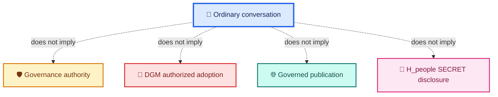

<div align="center">

# ALLIS — Conversational Front-Door Boundary

### Current ordinary conversational path for ALLIS/allis.pro, separate from governed publication, DGM authorized adoption, protected mutation, and future Hilbert/learning work

<br>


<br>

**Kidd's Technical Services · ALLIS**

</div>

---

> [!IMPORTANT]
> This document describes the **ordinary ALLIS conversational front door**.
>
> It is not the DGM authorized-adoption path.
>
> It is not the governed-publication path.
>
> It is not a protected H_people SECRET-disclosure path.
>
> It is not authority to mutate, adopt, publish, or govern merely because a user is authenticated or a conversation succeeds.

---

# 1. Current conversational path

The current ordinary ALLIS conversational path is:

```text
authenticated browser / session
    ↓
POST /api/chat
    ↓
Unified Gateway
    ↓
cognition / JCP boundary
    ↓
BBB / llm20production
    ↓
LM Synthesizer
    ↓
response
```

In compact form:

```text
authenticated browser/session
-> /api/chat
-> Unified Gateway
-> cognition / JCP
-> BBB / llm20production
-> LM synthesizer
-> response
```

This is the conversational path documented here.

---

# 2. System identity

This boundary belongs to:

```text
ALLIS
    →
allis.pro
```

It does not describe:

```text
Ms. Allis
    →
mountainshares.us
```

Preserve:

```text
ALLIS / allis.pro
    ≠
Ms. Allis / mountainshares.us
```

The two systems may share architectural ideas or governed infrastructure concepts.

They are not the same conversational surface.

---

# 3. What this boundary is for

The conversational front door exists to permit an authenticated user to submit an ordinary conversational request and receive a governed response through the current ALLIS conversational stack.

Its purpose is:

```text
conversation admission
    ↓
current conversational reasoning / synthesis
    ↓
response
```

Its purpose is not:

```text
conversation admission
    ↓
governance authority
```

and not:

```text
conversation admission
    ↓
protected write authority
```

and not:

```text
conversation admission
    ↓
publication authority
```

---

# 4. Authentication boundary

The trusted conversational identity originates from the authenticated server-side session.

The browser does not become identity authority merely because it sends request content.

The current rule is:

```text
server-authenticated session
    =
trusted conversational identity source
```

while:

```text
browser-supplied identity-like content
    ≠
trusted conversational identity source
```

and:

```text
ordinary browser message
    ≠
authority to choose another user identity
```

This boundary is the implementation-facing counterpart of the qualified R2 Conversational Admission workstream.

---

# 5. `/api/chat` boundary

The current server-side conversational admission route is:

```text
POST /api/chat
```

Its bounded role is:

1. require the applicable authenticated server-side session;
2. derive trusted identity server-side;
3. accept ordinary conversational content;
4. construct the request forwarded to the Unified Gateway;
5. preserve absence of a canonical scalar user ID where none has been established;
6. return the governed Gateway response.

The important ordering is:

```text
authenticate
    ↓
derive server-side identity
    ↓
accept ordinary browser content
    ↓
forward conversational request
```

not:

```text
browser claims identity
    ↓
server trusts claim
```

---

# 6. Current identity carriage

The qualified conversational path carries:

```text
authenticated_user
```

as server-derived identity metadata.

Where no separately established canonical scalar user ID exists, the bounded qualified path preserves:

```text
user_id: null
```

This means:

```text
missing canonical scalar identity
    ≠
permission to invent one
```

The server-derived identity object is not automatically equivalent to:

- governance authority;
- H_people SECRET-disclosure authority;
- JCP content;
- model content;
- publication authority.

---

# 7. Unified Gateway boundary

The `/api/chat` path forwards the ordinary request into the Unified Gateway.

The Gateway is the current integration boundary for the ordinary conversational request.

The qualified Gateway path includes the conversational payload and the current downstream reasoning/synthesis chain.

The Gateway may carry:

```text
authenticated_user
```

but the qualified source path does not use that identity object to create governance authority.

The retained R2/Gateway correspondence established that:

```text
process_unified
    accepts authenticated_user
```

while:

```text
process_unified
    does not read authenticated_user
```

and:

```text
authenticated_user
    is not forwarded downstream as model content
```

and:

```text
authenticated_user
    does not enter JCP
```

This preserves the distinction between:

```text
identity metadata
```

and:

```text
reasoning content
```

---

# 8. Cognition / JCP boundary

The current conversational reasoning path passes through the present cognition/JCP boundary.

This document uses:

```text
cognition / JCP
```

to describe the current reasoning-context boundary between Gateway admission and downstream synthesis.

The current JCP is constructed by:

```text
build_judge_context_v2
```

and has exactly four top-level fields:

```text
schema_version
request_context
approved_evidence
wv_deliberative_context
```

The current JCP does not admit:

```text
H_geo
H_p
H_people
```

as live fields.

That current nonadmission is preserved by the qualified R3 Hilbert/JCP Separation workstream.

---

# 9. Current JCP boundary is not future Hilbert admission

The current ordinary conversational JCP is not a placeholder for implied Hilbert state.

Preserve:

```text
current JCP
    =
four explicit top-level fields
```

and:

```text
missing Hilbert admission
    =
nonadmission
```

not:

```text
missing Hilbert field
    =
implicitly available
```

A qualified static H_geo path exists separately.

That does not alter the current conversational JCP.

```text
static H_geo qualification
    ≠
live ordinary-chat JCP admission
```

---

# 10. Cognition boundary

The current architecture also contains cognition-related source topology.

For conversational purposes, cognition must remain distinguished from authority.

A cognition stage may:

- evaluate;
- compose;
- transform;
- reason;
- produce a candidate packet or reasoning result.

It does not thereby gain authority to:

- adopt;
- mutate protected state;
- disclose protected SECRET state;
- publish;
- change JCP admission rules;
- authorize itself.

The governing principle is:

```text
cognitive capability
    ≠
operational authority
```

---

# 11. BBB boundary

The current ordinary conversational path proceeds through BBB before downstream synthesis completes.

Conceptually:

```text
Gateway
    ↓
BBB
    ↓
ensemble / llm20production
```

BBB remains part of the bounded conversational processing chain.

A BBB pass or response is not itself governance authority.

Likewise, BBB failure or outage belongs to conversational failure handling, not to DGM adoption semantics.

---

# 12. `llm20production` boundary

The current ensemble service is named:

```text
llm20production
```

The name is a service convention.

It should not be interpreted as a theorem that the runtime must literally contain exactly twenty participating models.

Preserve:

```text
llm20production
    =
service / ensemble path name
```

not:

```text
runtime cardinality theorem = 20
```

The current production Gateway observation completed through the dynamically sized ensemble service named `llm20production`.

---

# 13. LM Synthesizer boundary

The LM Synthesizer is the final synthesis stage in the current conversational chain.

Conceptually:

```text
BBB / llm20production outputs
    ↓
LM Synthesizer
    ↓
response
```

The synthesizer produces the conversational response.

It does not create governance authority merely by synthesizing content.

It also does not gain protected publication or mutation authority solely because it is the final response-producing stage.

---

# 14. Response boundary

The ordinary conversational response is the outward result of the current chat path.

The result is:

```text
conversation response
```

not:

```text
governed publication object
```

unless a separate publication path explicitly creates one.

That distinction matters.

A response may be returned to the authenticated conversational caller without becoming:

- public evidence;
- adopted system state;
- persistent Hilbert state;
- a governance decision;
- a DGM-authorized mutation;
- a Step-17 publication object.

---

# 15. Ordinary conversation is not DGM authorized adoption

The DGM authorized-adoption path is a separate protected transition system.

The ordinary conversational path does not become DGM merely because it passes through governed components.

Preserve:

```text
ordinary conversation
    ≠
DGM authorized adoption
```

The DGM domain governs transitions such as:

```text
external package
    ↓
validation
    ↓
authorized spool
    ↓
worker claim
    ↓
authorized apply
    ↓
terminal state
```

That is not the `/api/chat` path.

---

# 16. Ordinary conversation is not governed publication

The publication path is also separate.

Preserve:

```text
conversation response
    ≠
public publication object
```

and:

```text
/api/chat response
    ≠
Step-17 publication
```

A publication transition requires its own evidence, authority, projection, and serving boundary.

Ordinary conversation does not silently cross that boundary.

---

# 17. Ordinary conversation is not protected mutation authority

The current conversational path does not create general protected-write authority.

Preserve:

```text
authenticated conversation
    ≠
protected mutation authority
```

and:

```text
successful reasoning
    ≠
permission to write protected state
```

and:

```text
synthesized response
    ≠
permission to adopt state
```

---

# 18. Ordinary conversation is not governance authority

The qualified R2 theorem family establishes the bounded formal rule:

```text
ordinary authenticated chat
    does not create
governance authority
```

Therefore:

```text
AUTHENTICATED_CONVERSATION
    ≠
GOVERNANCE_AUTHORITY
```

This is not a UI convention.

It is a trust-boundary property.

---

# 19. Ordinary conversation is not H_people SECRET disclosure authority

R2 also establishes:

```text
ordinary authenticated chat
    does not authorize
H_people SECRET disclosure
```

Therefore:

```text
authenticated user
    ≠
automatic H_people SECRET disclosure authority
```

The H_people SECRET tier remains separately governed.

---

# 20. Current H_people relation to the conversational path

The ordinary conversational path must distinguish:

```text
private conversational continuity
```

from:

```text
H_people SECRET identity correspondence
```

and from:

```text
protected disclosure authority
```

The current bounded ordinary chat path does not turn the H_people SECRET tier into ordinary conversational context.

Authentication alone does not cross that boundary.

---

# 21. Current H_geo relation to the conversational path

A qualified static H_geo path exists.

It is not currently admitted to ordinary conversational JCP.

Therefore:

```text
H_geo static qualification = YES

H_geo current live JCP admission = NO
```

The current conversational front door must preserve both statements.

---

# 22. Current H_p relation to the conversational path

H_p is a separate governed civic-query/Hilbert projection.

It is not a current ordinary-chat JCP field.

Therefore:

```text
H_p current JCP admission = NO
```

The presence of H_p elsewhere in ALLIS does not silently make it part of ordinary conversation.

---

# 23. Current path diagram

```mermaid
flowchart LR
    A["🔐 Authenticated browser / session"]:::auth
    B["🌐 POST /api/chat"]:::front
    C["🚪 Unified Gateway"]:::gateway
    D["🧠 Cognition / JCP"]:::context
    E["🛡️ BBB"]:::bbb
    F["🤖 llm20production"]:::llm
    G["🧩 LM Synthesizer"]:::synth
    H["💬 Response"]:::response

    A --> B
    B --> C
    C --> D
    D --> E
    E --> F
    F --> G
    G --> H

    classDef auth fill:#dcfce7,stroke:#16a34a,color:#14532d,stroke-width:2px;
    classDef front fill:#dbeafe,stroke:#2563eb,color:#172554,stroke-width:2px;
    classDef gateway fill:#ccfbf1,stroke:#0f766e,color:#134e4a,stroke-width:2px;
    classDef context fill:#ede9fe,stroke:#7c3aed,color:#3b0764,stroke-width:2px;
    classDef bbb fill:#fef3c7,stroke:#d97706,color:#78350f,stroke-width:2px;
    classDef llm fill:#fce7f3,stroke:#db2777,color:#831843,stroke-width:2px;
    classDef synth fill:#e0f2fe,stroke:#0284c7,color:#0c4a6e,stroke-width:2px;
    classDef response fill:#dcfce7,stroke:#16a34a,color:#14532d,stroke-width:2px;
```



---

# 24. Authority separation diagram



---

# 25. Current operational path vs future work

The current conversational path is operationally distinct from future architecture.

## Current bounded path

```text
authenticated session
    ↓
/api/chat
    ↓
Unified Gateway
    ↓
current cognition / JCP boundary
    ↓
BBB / llm20production
    ↓
LM Synthesizer
    ↓
response
```

## Future work not implied by this path

The current path does not imply completion of:

```text
live H_geo JCP admission

H384 formalization

typed H_* projection interfaces

cognition theorem family

automated learning / web research qualification

research-to-corpus ingestion

KYC-location contextual use

whole-system proof
```

---

# 26. Conversational success does not promote future architecture

Even if an ordinary conversation succeeds end to end:

```text
conversation succeeded
```

does not imply:

```text
future Hilbert integration complete
```

or:

```text
automated learning qualified
```

or:

```text
research-to-corpus ingestion qualified
```

or:

```text
DGM completion claimed
```

Each future domain requires its own qualification.

---

# 27. Fail-closed conversational identity rule

If trusted server-side authenticated identity is absent, browser content must not fill the gap.

Preserve:

```text
no trusted authenticated session
    ⇒
no trusted conversational identity
```

not:

```text
no trusted authenticated session
    ⇒
use browser-provided identity
```

This is a current R2 boundary.

---

# 28. Fail-closed JCP admission rule

If a Hilbert domain does not have a current JCP field/admission path:

```text
missing admission
    ⇒
NONADMITTED
```

not:

```text
missing admission
    ⇒
implicitly available
```

This is the current R3 boundary.

---

# 29. Response semantics

The expected success shape of the ordinary path is:

```text
authenticated conversational request
    ↓
governed processing
    ↓
synthesized response
```

Failure in one of the conversational processing layers should not be rewritten as a successful complete answer if the underlying governed path did not support that outcome.

This belongs to conversational fail-closed semantics.

It remains distinct from DGM terminalization semantics.

---

# 30. Current source correspondence anchors

The current front-door boundary is supported by the conversational source/correspondence record around:

```text
app/api/chat/route.js

lib/server-auth.js

app/ask/ConversationClient.jsx

Unified Gateway ChatPayload

/chat

process_unified

build_judge_context_v2
```

These source objects/functions belong to different portions of the conversational path.

No one object alone proves the entire path.

---

# 31. Current runtime correspondence

Later production Gateway qualification established a real bounded `/chat` execution through:

```text
BBB
    ↓
llm20production
    ↓
LM Synthesizer
```

The production Gateway source matched the qualified candidate source identity.

That production observation is supporting runtime correspondence evidence.

It is not a new Lean theorem.

It is not a whole-system proof.

---

# 32. Browser/UI boundary

The server-side conversational route and Gateway path were qualified independently of the eventual browser conversational UI completion.

Therefore preserve the distinction:

```text
server-side conversational path qualified
    ≠
every browser conversational UX path proven
```

A browser-facing implementation must still preserve the same server-derived identity and `/api/chat` boundary.

---

# 33. Route identity

The canonical ordinary conversational route is:

```text
/api/chat
```

Do not substitute:

```text
/chatlight
```

as the current canonical ordinary conversational front-door route.

`/api/chat/async` is also a separate route and should not be treated as identical to the ordinary `/api/chat` boundary without separate qualification.

---

# 34. Current path matrix

| Stage | Current role | Authority created? |
|---|---|---:|
| Authenticated browser/session | caller has an authenticated server-side session | NO governance authority |
| `/api/chat` | ordinary server-side conversational admission | NO |
| Unified Gateway | current integration/routing boundary | NO |
| cognition / JCP | current reasoning/context boundary | NO adoption authority |
| BBB | bounded conversational processing gate | NO |
| `llm20production` | ensemble reasoning path | NO |
| LM Synthesizer | response synthesis | NO |
| response | conversational output to caller | NO publication/adoption authority by itself |

---

# 35. Current formal support

The current front-door architecture is supported by two separate qualified formal domains.

## R2 — Conversational Admission

R2 establishes:

```text
server-derived identity
browser identity non-authority
no invented canonical scalar user ID
authenticated-session isolation
ordinary chat creates no governance authority
ordinary chat authorizes no H_people SECRET disclosure
```

## R3 — Hilbert/JCP Separation

R3 establishes:

```text
current JCP = exactly four top-level fields
current Hilbert admission = NO
H_geo current JCP admission = NO
H_p current JCP admission = NO
H_people current JCP admission = NO
static H_geo qualification does not self-authorize live admission
```

Neither domain is a whole-system proof.

---

# 36. Nonclaims

This document does **not** claim:

```text
SYSTEM_PROVEN=YES
```

It does not claim:

```text
WHOLE_SYSTEM_SAFETY_PROVEN=YES
```

It does not claim:

```text
AUTHENTICATED_CHAT=GOVERNANCE_AUTHORITY
```

It does not claim:

```text
CONVERSATION_RESPONSE=GOVERNED_PUBLICATION
```

It does not claim:

```text
CONVERSATION_SUCCESS=DGM_ADOPTION
```

It does not claim:

```text
H_GEO_LIVE_JCP_ADMISSION=YES
```

It does not claim:

```text
H_PEOPLE_SECRET_DISCLOSURE_AUTHORIZED_BY_CHAT=YES
```

It does not claim:

```text
AUTOMATED_LEARNING_WEB_RESEARCH_QUALIFIED=YES
```

---

# 37. Revalidation rule

The front-door boundary should be revalidated if claim-bearing changes occur to:

```text
authentication/session semantics

/api/chat

server-auth

authenticated_user

user_id

Gateway ChatPayload

/chat

process_unified

cognition/JCP composition

build_judge_context_v2

BBB integration

llm20production integration

LM Synthesizer integration

response routing

H_geo/H_p/H_people admission behavior
```

A successful old path does not automatically qualify a changed new path.

---

# 38. Normalized boundary record

```yaml
conversational_frontdoor:
  system:
    name: ALLIS
    surface: allis.pro

  separate_system:
    name: Ms. Allis
    surface: mountainshares.us
    same_system: false

  current_path:
    - authenticated_browser_session
    - /api/chat
    - Unified_Gateway
    - cognition_JCP
    - BBB
    - llm20production
    - LM_Synthesizer
    - response

  authentication:
    trusted_identity_source: server_authenticated_session
    browser_identity_authoritative: false
    canonical_scalar_user_id_may_be_invented: false

  api_chat:
    ordinary_conversation_route: /api/chat
    canonical_chatlight_route: false
    async_route_is_same_boundary: false

  gateway:
    carries_authenticated_user: true
    authenticated_user_is_governance_authority: false
    authenticated_user_enters_jcp: false
    authenticated_user_becomes_model_input: false

  jcp:
    builder: build_judge_context_v2
    field_count: 4
    fields:
      - schema_version
      - request_context
      - approved_evidence
      - wv_deliberative_context
    H_geo_admitted: false
    H_p_admitted: false
    H_people_admitted: false

  downstream:
    BBB: current
    llm20production: current
    LM_Synthesizer: current

  authority:
    ordinary_chat_creates_governance_authority: false
    ordinary_chat_is_dgm_authorized_adoption: false
    ordinary_chat_is_governed_publication: false
    ordinary_chat_authorizes_hpeople_secret_disclosure: false
    response_is_protected_state_mutation: false

  future_not_implied:
    live_H_geo_JCP_integration_complete: false
    H384_formalization_complete: false
    cognition_theorem_family_complete: false
    automated_learning_web_research_qualified: false
    research_to_corpus_ingestion_qualified: false
    KYC_location_context_use_qualified: false

  whole_system:
    system_proven: false
```

---

# 39. Final boundary statement

```text
ALLIS_CONVERSATIONAL_FRONTDOOR=CURRENT

SURFACE=allis.pro

ORDINARY_CONVERSATIONAL_ROUTE=/api/chat

TRUSTED_IDENTITY_SOURCE=SERVER_AUTHENTICATED_SESSION

BROWSER_IDENTITY_AUTHORITY=NO

PATH:
authenticated_browser_session
-> /api/chat
-> Unified_Gateway
-> cognition_JCP
-> BBB
-> llm20production
-> LM_Synthesizer
-> response

ORDINARY_CHAT_CREATES_GOVERNANCE_AUTHORITY=NO

ORDINARY_CHAT_IS_DGM_ADOPTION=NO

ORDINARY_CHAT_IS_GOVERNED_PUBLICATION=NO

ORDINARY_CHAT_AUTHORIZES_HPEOPLE_SECRET_DISCLOSURE=NO

CURRENT_JCP_FIELD_COUNT=4

H_GEO_CURRENT_JCP_ADMISSION=NO

H_P_CURRENT_JCP_ADMISSION=NO

H_PEOPLE_CURRENT_JCP_ADMISSION=NO

SYSTEM_PROVEN=NO
```

---

# Governing principles

> **Ordinary conversation is a governed conversational path, not a governance-authority path.**

> **Authentication establishes conversational identity; it does not mint adoption, publication, mutation, or SECRET-disclosure authority.**

> **The browser supplies conversational content; trusted identity remains server-derived.**

> **The Unified Gateway integrates the current conversational path without converting identity metadata into authority.**

> **The current cognition/JCP boundary remains the qualified four-field JCP, not an implied Hilbert context.**

> **BBB, `llm20production`, and the LM Synthesizer participate in response production; they do not become DGM adoption or publication authority by doing so.**

> **A conversational response is not a governed-publication object merely because it was synthesized successfully.**

> **Future Hilbert, learning, research, and protected-location paths remain separate successor work.**

> **SYSTEM_PROVEN remains NO.**
