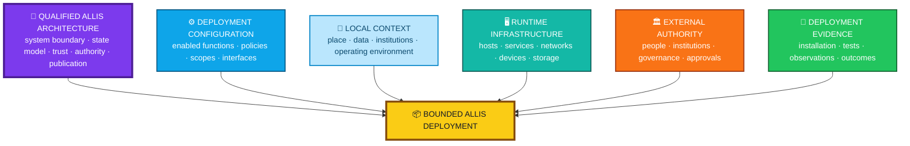
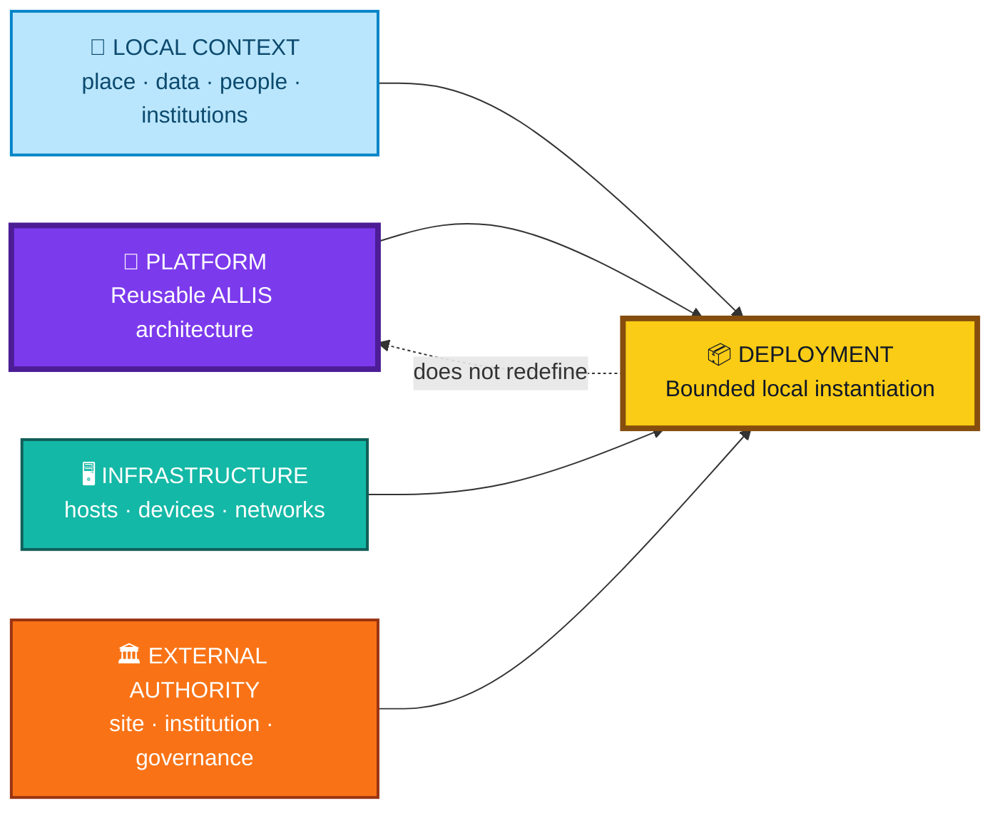
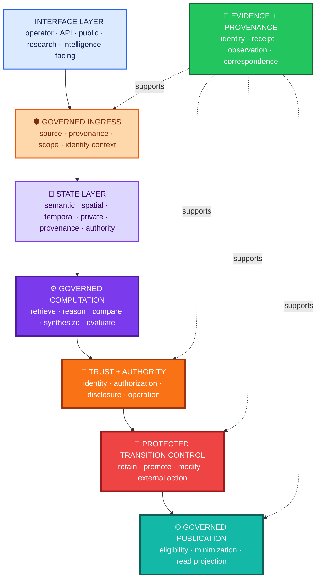
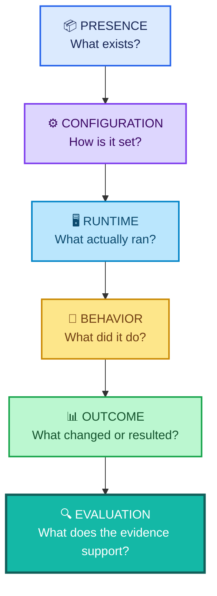
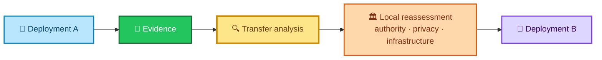

<div align="center">

# ALLIS — Deployment Model Overview

### How ALLIS moves from qualified architecture into a bounded real-world environment without allowing a site, project, partner, grant, or infrastructure pattern to redefine the platform

<br>


<br>

**Kidd’s Technical Services · ALLIS**

</div>

---

> [!IMPORTANT]
> An ALLIS deployment is a **bounded instantiation of the governed platform**.
>
> A deployment can add local geography, data, infrastructure, devices, interfaces, operators, institutions, policies, and programs.
>
> Those deployment-specific elements do **not** become the definition of ALLIS merely because one deployment uses them.

---

# 👀 Deployment model at a glance

| Layer | Role | Becomes universal ALLIS architecture automatically? |
|---|---|---|
| 🧠 **ALLIS architecture** | Governing platform rules and system boundaries | **Yes — this is the platform layer** |
| ⚙️ **Deployment configuration** | Local choices about enabled functions and policies | **No** |
| 📍 **Local context** | Geography, organizations, data, place, users | **No** |
| 🖥️ **Runtime infrastructure** | Hosts, networks, devices, storage, services | **No** |
| 🏛️ **External authority** | Site, institutional, legal, community authority | **No — remains external** |
| 🧾 **Deployment evidence** | Installation, runtime, behavior, outcome evidence | **No — remains deployment-scoped** |
| 📦 **Deployment** | Combined bounded instantiation | **No — instantiates ALLIS** |

The governing equation is:

```text
ALLIS architecture
    +
deployment configuration
    +
local context
    +
runtime infrastructure
    +
external authority
    +
deployment evidence
    =
bounded ALLIS deployment
```

and:

```text
bounded ALLIS deployment
    ≠
definition of ALLIS
```

---

# 🌈 Deployment architecture in one view



---

# 🎯 Purpose

This document defines the **generic ALLIS deployment model**.

It answers:

```text
How is ALLIS instantiated in a real environment?

Which parts belong to the platform?

Which parts belong only to the deployment?

How does local authority remain external?

How do deployment status and deployment evidence differ?

How can a deployment be evaluated without becoming the definition of ALLIS?

How can one deployment inform another without implying automatic transfer?
```

Project-specific deployment examples belong in separate documents.

---

# 1. Document status

```text
Document role:
Architecture

Scope:
Generic ALLIS deployment structure

Project-specific geography:
Excluded from this generic architecture file

Implementation status:
Deployment-specific

Runtime status:
Established separately for each deployment

Formal status:
Not inferred from architecture alone

Whole-system proof:
Not implied by deployment success
```

Core rule:

> **A deployment instantiates ALLIS; it does not redefine ALLIS.**

---

# 2. Platform vs deployment

The most important separation is:

```text
PLATFORM
    =
generic governed computational architecture
```

versus:

```text
DEPLOYMENT
    =
one bounded instantiation of that architecture
```

The platform defines reusable governance and computational structure.

The deployment supplies local context.

---

# 3. What belongs to the platform

The generic platform includes architectural rules for:

- system boundaries;
- state representation;
- protected-state admission;
- governed computation;
- trust and authority;
- governed write;
- fail-closed behavior;
- publication;
- evidence;
- correspondence.

These rules can apply across deployments.

---

# 4. What belongs to the deployment

A deployment can add:

- local geography;
- local data;
- local institutions;
- devices;
- networks;
- interfaces;
- field equipment;
- local policies;
- operating procedures;
- maintenance practices;
- deployment-specific authority;
- local public content;
- local evaluation.

These are deployment context unless separately promoted into the generic architecture.

---

# 5. Platform/deployment boundary



---

# 6. Deployment boundary

A deployment is bounded by:

```text
configuration
environment
authority
infrastructure
time
evidence
```

The boundary can be geographic.

It can also be organizational, technical, research-specific, or service-specific.

---

# 7. Deployment identity

A deployment should be distinguishable from:

- another deployment;
- a test environment;
- an earlier configuration;
- a later configuration;
- a research simulation;
- a public demonstration;
- a production environment.

A useful deployment identity can include:

```text
deployment ID
environment
configuration version
qualified-object references
runtime identity
observation window
```

---

# 8. Generic deployment stack



Not every deployment requires every optional lane.

Any lane that is used must preserve the applicable ALLIS boundary.

---

# 9. Governed ingress

Incoming state should preserve enough context to answer:

```text
Where did this come from?

What scope applies?

When was it acquired?

Which place does it concern?

Whom does it concern?

What authority applies?

What evidence status applies?
```

Availability does not create truth or permission.

---

# 10. Inward protected-state admission

Where protected state is used:

```text
incoming state
    ↓
provenance
    ↓
identity / subject relationship where required
    ↓
purpose / use authority
    ↓
recipient / disclosure authority
    ↓
retention / temporal validity
    ↓
admitted scoped state
```

Local access does not bypass this architecture.

---

# 11. State representation

A deployment can use any applicable ALLIS state domain:

```text
semantic
geographic
temporal
person-linked
memory/provenance
evidence
governance/authority
lifecycle
publication
```

Not every deployment needs every domain.

---

# 12. Geographic state is deployment-scoped

A place-based deployment can define:

- sites;
- routes;
- nodes;
- buildings;
- local boundaries;
- viewsheds;
- service areas;
- field observations.

Those are local state.

They do not become universal platform geography.

---

# 13. Semantic state is deployment-scoped

A deployment can include:

- local knowledge;
- project terminology;
- institutional records;
- heritage content;
- operating instructions;
- public information.

Those sources retain provenance and scope.

---

# 14. Temporal state is deployment-scoped

Deployments can have:

- installation periods;
- maintenance schedules;
- evaluation periods;
- service windows;
- authority expiry;
- publication dates;
- field seasons.

Time remains part of the deployment state.

---

# 15. Governed computation

A deployment can perform:

- retrieval;
- spatial reasoning;
- temporal reasoning;
- semantic reasoning;
- evidence comparison;
- synthesis;
- evaluation;
- candidate generation.

Computation remains distinct from protected transition authority.

---

# 16. Candidate state in a deployment

A deployment can generate candidate:

- responses;
- actions;
- state changes;
- publications;
- maintenance tasks;
- memory updates;
- field decisions.

Candidate state does not self-authorize.

---

# 17. Governed write plane

Where protected state can change, the deployment must preserve the write boundary.


A deployment can omit write capability.

If it includes write capability, local convenience does not replace authority.

---

# 18. Qualified state remains scoped

A deployment can qualify state for a local role.

```text
qualified locally
    ≠
universal ALLIS state
```

Qualification remains tied to:

- role;
- deployment;
- scope;
- evidence;
- time.

---

# 19. Governed publication plane

Where a deployment exposes public or shared state:


Publication is a projection.

It is not a raw export of local internal state.

---

# 20. Read plane and write plane remain separate

```text
public read
    ≠
public write
```

```text
local interface access
    ≠
protected mutation authority
```

```text
kiosk can display
    ≠
kiosk can administer
```

```text
GUI can retrieve
    ≠
GUI can mutate
```

---

# 21. Interface layer

A deployment can use:

- web applications;
- APIs;
- operator interfaces;
- kiosks;
- public displays;
- research tools;
- field applications;
- intelligence-facing services.

Interfaces are deployment surfaces.

They are not the platform definition.

---

# 22. Ms. Allis in a deployment

Where Ms. Allis is present:

```text
Ms. Allis
    =
intelligence-facing service
```

She can:

- interpret requests;
- request governed context;
- reason over authorized state;
- explain evidence;
- generate candidates.

She does not become:

- the deployment itself;
- local governance;
- institutional authority;
- publication authority;
- production write authority.

---

# 23. Deployment configuration

Configuration can include:

- enabled services;
- local scopes;
- data sources;
- state domains;
- identity requirements;
- recipient restrictions;
- retention policy;
- interface settings;
- external integrations;
- publication rules;
- measurement settings.

Configuration remains deployment-specific.

---

# 24. Configuration does not become architecture automatically

```text
deployment config
    ≠
ALLIS architecture
```

A platform-level change should move through:

```text
proposal
    ↓
engineering review
    ↓
implementation
    ↓
qualification
    ↓
architecture update
```

before being treated as generic ALLIS.

---

# 25. External authority domain

A deployment can be governed by external actors such as:

- property owners;
- municipalities;
- universities;
- nonprofits;
- agencies;
- research institutions;
- community bodies;
- infrastructure providers.

ALLIS can consume scoped authority.

It does not absorb the institution itself.

---

# 26. External authority remains external

```text
municipal approval
    ≠
ALLIS technical authority
```

```text
site ownership
    ≠
ALLIS publication authority
```

```text
federal authority
    ≠
ALLIS source authority
```

```text
community participation
    ≠
system administration
```

---

# 27. Authority map

| Authority domain | Example question | Remains deployment-specific? |
|---|---|---|
| 🏛️ Site authority | Who may install here? | **Yes** |
| 👤 Identity authority | Who is this subject/operator? | **Yes, implementation binding can vary** |
| 🔒 Disclosure authority | Who may receive protected state? | **Yes** |
| 🔐 Operation authority | Who may perform this protected transition? | **Yes** |
| 🌐 Publication authority | Who may approve outward projection? | **Yes** |
| 🧠 ALLIS architecture | What generic authority distinctions apply? | **Platform-level** |

---

# 28. Infrastructure layer

A deployment can use:

- physical servers;
- virtual machines;
- cloud infrastructure;
- edge nodes;
- radios;
- sensors;
- kiosks;
- relays;
- storage;
- network tunnels;
- local networks.

No one infrastructure layout defines ALLIS.

---

# 29. Hardware is not architecture

```text
device count
    ≠
platform definition
```

```text
network topology
    ≠
platform definition
```

```text
one vendor
    ≠
platform requirement
```

---

# 30. Infrastructure topology can vary

Valid deployment patterns can include:

```text
single-host

multi-service

edge + central

offline-first

local-network

hybrid network

public-read/private-compute

field-node + central analysis
```

The architecture remains functional, not hardware-bound.

---

# 31. Local operations

Deployment-specific operations can include:

- device inspection;
- software maintenance;
- node replacement;
- service restart;
- configuration updates;
- rollback;
- field verification;
- incident response.

These are operational practices.

They do not become generic ALLIS architecture automatically.

---

# 32. Maintenance state

A field deployment can track:

```text
available
degraded
offline
scheduled_for_repair
replaced
retired
```

Those states belong to local operations.

---

# 33. Recovery

A deployment can require recovery for:

- service failure;
- network outage;
- failed state transition;
- publication rollback;
- device loss;
- configuration drift.

Recovery need does not create recovery authority.

---

# 34. Rollback

Where rollback is supported, document:

```text
rollback target
authority
prestate
expected poststate
evidence
validation method
```

Rollback is a governed transition.

---

# 35. Deployment status ladder

<div align="center">

### Deployment maturity is explicit

</div>


No later status is inferred from an earlier one.

---

# 36. Concept

`CONCEPT` means the deployment idea exists.

It does not establish:

- approval;
- authority;
- funding;
- installation;
- testing.

---

# 37. Proposed

`PROPOSED` means the deployment is defined enough to be reviewed.

```text
proposed
    ≠
approved
```

---

# 38. Approved

`APPROVED` means an applicable decision-maker accepted a bounded proposal.

```text
approved
    ≠
technical operation authority
```

---

# 39. Authorized

`AUTHORIZED` means the applicable authority permits a defined deployment action.

```text
authorized
    ≠
installed
```

---

# 40. Installed

`INSTALLED` means a physical or logical component is present.

```text
installed
    ≠
configured
```

---

# 41. Configured

`CONFIGURED` means local settings have been applied.

```text
configured
    ≠
tested
```

---

# 42. Tested

`TESTED` means a defined test ran.

```text
tested
    ≠
operational
```

---

# 43. Observed

`OBSERVED` means runtime behavior was directly observed.

Observation should identify:

- time;
- configuration;
- environment;
- conditions.

---

# 44. Operational

`OPERATIONAL` means the deployment is being used within an authorized scope.

It does not imply:

- universal reliability;
- proof;
- evaluation;
- replicability.

---

# 45. Evaluated

`EVALUATED` means deployment evidence has been analyzed against defined metrics or questions.

Evaluation should identify:

- period;
- population or operating environment;
- metrics;
- method;
- limitations.

---

# 46. Replication-supported

`REPLICATION_SUPPORTED` means evidence supports a bounded transfer conclusion.

It does not mean:

```text
copy exactly everywhere
```

---

# 47. Status is multidimensional

A deployment can be:

```text
hardware = INSTALLED

software = CONFIGURED

network = TESTED

publication = OPERATIONAL

H_people current runtime authority = NOT_PROMOTED
H_people current runtime correspondence = NOT_ESTABLISHED

outcome evaluation = NOT_STARTED
```

One overall label should not erase these dimensions.

> [!NOTE]
> The `H_people` lines above refer specifically to the current public runtime-authority/correspondence state for the H_people private-state lane.
>
> They do **not** classify every possible private-state capability as unavailable, and they do not admit a separate A8 application-private-context deployment surface in this document.
>
> A separate application-private-context capability, if later admitted from exact sealed evidence, must be documented as its own deployment surface rather than used to promote H_people to operational status.

---

# 48. Evidence architecture



Each layer supports a different claim.

---

# 49. Presence evidence

Presence establishes that a component exists.

Examples:

- service installed;
- device present;
- interface deployed;
- file configured.

Presence does not establish correct operation.

---

# 50. Configuration evidence

Configuration establishes what settings were applied.

It does not prove the runtime used them.

---

# 51. Runtime evidence

Runtime evidence can include:

- process identity;
- service state;
- network listener;
- image identity;
- mounted source;
- route state;
- response.

Runtime evidence is time-specific.

---

# 52. Behavioral evidence

Behavioral evidence can establish:

- successful read;
- denied write;
- fail-closed handling;
- publication correspondence;
- recovery behavior;
- field response.

Behavior remains bounded by test conditions.

---

# 53. Outcome evidence

Outcome evidence addresses whether the deployment accomplished the intended result.

Examples can include:

- service availability;
- local information access;
- maintenance response;
- user participation;
- safety improvement;
- research result;
- operational efficiency.

Technical operation does not automatically prove outcome.

---

# 54. Evaluation evidence

Evaluation interprets evidence against defined metrics.

It should preserve:

```text
what was measured
how it was measured
over what period
under what conditions
with what limitations
```

---

# 55. Architecture-to-runtime correspondence


Each edge answers a separate question.

---

# 56. Correspondence is point-in-time

```text
runtime corresponds at τ
    ≠
runtime corresponds forever
```

Claim-bearing deployment changes can require renewed evidence.

---

# 57. Change classes that can require revalidation

Examples include:

- source identity;
- runtime image;
- configuration;
- trust object;
- governance object;
- network route;
- publication body;
- frontend build;
- device firmware;
- identity provider;
- private-state policy.

---

# 58. Deployment evidence package

A deployment evidence package can include:

```text
deployment identity
configuration identity
authority record
privacy record
runtime inventory
test record
observation record
publication evidence
maintenance evidence
evaluation
residuals
```

Not every deployment requires every category.

---

# 59. Fail-closed deployment semantics

Deployments should use the standard ALLIS classes:

| State | Deployment meaning |
|---|---|
| ⛔ `BLOCKED / DENIED` | A governing rule prohibits the transition |
| 🔒 `WITHHELD / NOT_AUTHORIZED` | Protected state exists but cannot be used/disclosed |
| 📴 `UNAVAILABLE` | Required dependency cannot currently be obtained |
| 🟡 `GOVERNED_DEGRADED` | A bounded reduced mode is separately permitted |
| ❓ `UNRESOLVED` | Required evidence/authority is incomplete |
| ➖ `NOT_APPLICABLE` | The lane does not apply |
| ⏱️ `TIMED_OUT` | Applicable operation exceeded deadline |
| 📭 `PASS_EMPTY` | Valid empty governed state |
| 🟣 `CLAIMED` | Work claimed but not necessarily terminal |

---

# 60. Degraded operation

A deployment can continue in a reduced mode only where policy permits.

```text
dependency failed
    ≠
permission to bypass governance
```

---

# 61. Offline operation

Offline capability can preserve bounded local functions while live dependencies remain unavailable.

Example:

```text
cached public information
    =
available
```

while:

```text
live external verification
    =
UNAVAILABLE
```

The deployment should preserve both states.

---

# 62. Local operators

Deployments may assign:

- operators;
- technicians;
- maintainers;
- observers;
- researchers;
- community stewards.

Role assignment is local.

Authority remains scoped.

---

# 63. Human stewardship

A deployment can use human stewardship for:

- observation;
- maintenance;
- reporting;
- training;
- public introduction;
- local feedback;
- evaluation.

Human participation supports deployment.

It does not become the platform itself.

---

# 64. Community programs do not define ALLIS

```text
community stewardship program
    ≠
ALLIS
```

A deployment can use a community program.

Another deployment can use a different model.

---

# 65. Institutional partnerships do not define ALLIS

```text
partner organization
    ≠
ALLIS architecture
```

Partnerships can support deployment authority, operations, research, funding, or evaluation.

---

# 66. Grants do not define architecture

A grant can fund:

- devices;
- installation;
- training;
- internet;
- evaluation;
- local services.

Grant scope remains project scope.

---

# 67. Budget does not define system capability

```text
deployment budget
    ≠
ALLIS capability boundary
```

A budget does not define universal cost or universal hardware.

---

# 68. Geography does not define platform boundary

```text
deployment geography
    ≠
ALLIS boundary
```

Place matters to the deployment.

It does not become the platform definition.

---

# 69. Pilot does not equal platform

```text
pilot
    ≠
ALLIS
```

A pilot can test one bounded use case.

---

# 70. Pilot does not equal production evidence

```text
pilot success
    ≠
universal production evidence
```

---

# 71. Demonstration does not equal replication

```text
worked here
    ≠
will work everywhere
```

Replication requires transfer analysis.

---

# 72. Replication architecture



---

# 73. Replication asks four questions

```text
What is platform architecture?

What is deployment-specific?

Which evidence transfers?

Which evidence must be renewed?
```

---

# 74. Technical reproducibility vs responsible transfer

> **Technology can be reproducible without a deployment being automatically transferable.**

A new environment can require new:

- site authority;
- institutional approval;
- infrastructure;
- privacy analysis;
- network study;
- maintenance plan;
- data source review;
- evaluation.

---

# 75. What can transfer

Potentially reusable patterns can include:

- authority mapping;
- deployment documentation;
- evidence structure;
- publication boundary;
- spatial planning method;
- maintenance framework;
- testing method;
- operator training framework.

Transfer still requires evidence.

---

# 76. What remains local

Local elements can include:

- device count;
- node placement;
- site permissions;
- institutional partners;
- geography;
- public content;
- funding;
- maintenance roles;
- interface form.

---

# 77. Deployment examples belong in a separate layer

This generic architecture file intentionally excludes project-specific geography and program details.

Examples belong under:

```text
architecture/deployment-model/examples/
```

Current example:

[`examples/new-river-gorge-deployment-example.md`](examples/new-river-gorge-deployment-example.md)

---

# 78. Why the split matters

The split protects both documents.

The generic file remains reusable.

The project example remains specific.

```text
generic model
    =
how ALLIS deployments work

deployment example
    =
how one project applies the model
```

---

# 79. What a deployment example should contain

A project-specific example can identify:

- geography;
- project phases;
- authority;
- partners;
- local data;
- local infrastructure;
- local human roles;
- project status;
- project evidence;
- residuals.

---

# 80. What a deployment example should not do

It should not redefine:

- ALLIS system boundary;
- universal state model;
- universal authority model;
- universal hardware;
- universal geography;
- universal partner structure.

---

# 81. Project repository boundary

Project repositories should own project artifacts such as:

- budgets;
- grants;
- letters;
- partner agreements;
- site maps;
- installation plans;
- training materials;
- project evaluation.

The ALLIS architecture repository can link to them where appropriate.

---

# 82. Deployment profile

A generic deployment profile can be represented as:

```yaml
deployment_profile:
  id: <deployment-id>

  platform:
    allis: true
    qualified_references: []

  status:
    stage: <CONCEPT|PROPOSED|APPROVED|AUTHORIZED|INSTALLED|CONFIGURED|TESTED|OBSERVED|OPERATIONAL|EVALUATED|REPLICATION_SUPPORTED>

  scope:
    geography: <deployment-specific>
    institutions: []
    use_cases: []

  configuration:
    enabled_services: []
    enabled_state_domains: []
    interfaces: []

  authority:
    external_domains: []
    operation_roles: []
    publication_roles: []

  privacy:
    person_linked_state_enabled: false
    retention_policy: <deployment-specific>

  infrastructure:
    hosts: []
    networks: []
    devices: []

  publication:
    enabled: false
    routes: []

  evidence:
    presence: []
    configuration: []
    runtime: []
    behavior: []
    outcomes: []
    evaluation: []
```

This is a documentation model, not a required runtime schema.

---

# 83. Deployment closeout

A deployment workstream can close when its own acceptance criteria are complete.

A closeout should identify:

```text
what was authorized
what was installed
what was configured
what was tested
what was observed
what was evaluated
what remains
what is not claimed
```

---

# 84. Deployment residuals

A deployment can close with residuals.

Examples:

- future phase not authorized;
- path not observed;
- evaluation incomplete;
- dependency unavailable;
- replication not established.

Residuals remain visible.

---

# 85. Closeout does not create whole-system proof

```text
deployment complete
    ≠
SYSTEM_PROVEN
```

```text
deployment successful
    ≠
universal deployment theorem
```

---

# 86. Deployment-state matrix

| Dimension | Example states |
|---|---|
| Project | concept · proposed · approved |
| Authority | absent · valid · expired · revoked |
| Infrastructure | absent · installed · configured |
| Runtime | stopped · running · degraded |
| Network | unavailable · reachable · observed |
| Publication | ineligible · eligible · served |
| Evaluation | not started · active · complete |
| Replication | not assessed · bounded support |

Deployment status is multidimensional.

---

# 87. Generic deployment invariants

```text
Deployment
    ↛
ALLISDefinition
```

```text
LocalConfiguration
    ↛
UniversalArchitecture
```

```text
LocalAuthority
    ↛
GlobalAuthority
```

```text
Installed
    ↛
Tested
```

```text
Tested
    ↛
Operational
```

```text
Operational
    ↛
Evaluated
```

```text
Evaluated
    ↛
UniversallyReplicable
```

```text
PublicRead
    ↛
PublicWrite
```

---

# 88. Generic deployment anti-patterns

Avoid:

```text
our first deployment uses X
therefore ALLIS requires X
```

```text
this location approved Y
therefore every deployment may use Y
```

```text
the project has funding
therefore the deployment is operational
```

```text
the equipment is installed
therefore the outcome is demonstrated
```

```text
the pilot succeeded
therefore replication is guaranteed
```

---

# 89. Generic deployment positive pattern

Prefer:

```text
generic ALLIS architecture
    +
named deployment context
    +
explicit configuration
    +
explicit authority
    +
explicit evidence
    +
explicit status
    +
explicit residuals
    =
bounded deployment claim
```

---

# 90. Relationship to system boundary

Use:

[`../system-boundary/allis-system-boundary.md`](../system-boundary/allis-system-boundary.md)

for:

> **Where does ALLIS begin and end?**

The deployment model explains how that boundary is instantiated.

---

# 91. Relationship to state model

Use:

[`../state-models/state-model-overview.md`](../state-models/state-model-overview.md)

for:

> **What state classes exist inside ALLIS?**

The deployment chooses which applicable state classes are enabled.

---

# 92. Relationship to trust and authority

Use:

[`../trust-and-authority/trust-and-authority-overview.md`](../trust-and-authority/trust-and-authority-overview.md)

for:

> **What constitutes valid authority?**

The deployment binds those concepts to local actors and institutions.

---

# 93. Relationship to authority planes

Use:

[`../authority-planes.md`](../authority-planes.md)

for:

- inward protected-state admission;
- governed write authority;
- outward publication authority.

---

# 94. Relationship to fail-closed semantics

Use:

[`../fail-closed-semantics.md`](../fail-closed-semantics.md)

for the meaning of:

```text
BLOCKED / DENIED
WITHHELD / NOT_AUTHORIZED
UNAVAILABLE
GOVERNED_DEGRADED
UNRESOLVED
NOT_APPLICABLE
TIMED_OUT
PASS_EMPTY
CLAIMED
```

---

# 95. Relationship to private-state architecture

Use:

[`../private-state/h-people-boundary.md`](../private-state/h-people-boundary.md)

when a deployment handles person-linked protected state.

Not every deployment must enable H_people.

---

# 96. Relationship to acceptance

Acceptance answers:

```text
Which qualified objects support current ALLIS claims?
```

A deployment references those objects.

A deployment does not automatically create a new qualified source baseline.

---

# 97. Relationship to evidence

Evidence answers:

```text
What actually exists and happened in this deployment?
```

Architecture describes what the deployment model requires.

---

# 98. Relationship to correspondence

Correspondence answers:

```text
Does architecture/source/configuration/runtime/publication/interface align?
```

That relationship remains explicit and time-bound.

---

# 99. Relationship to project repositories

A project repository owns the project.

The architecture repository owns the generic deployment model.

That separation prevents a project from becoming ALLIS by documentation accident.

---

# 100. Naming rule

New files in this deployment-model layer should use:

```text
lowercase-words-separated-by-hyphens.md
```

Examples:

```text
deployment-model-overview.md
new-river-gorge-deployment-example.md
deployment-evidence-profile.md
```

---

# 101. Normalized generic deployment model

```yaml
allis_deployment_model:

  governing_rule:
    deployment_instantiates_allis: true
    deployment_redefines_allis: false

  platform:
    architecture_is_generic: true
    system_boundary_is_project_specific: false

  deployment:
    bounded: true
    requires_identity: true

  local_context:
    may_include:
      - geography
      - local_data
      - institutions
      - infrastructure
      - interfaces
      - local_policies
      - operators
      - maintenance
      - local_programs
    automatically_becomes_platform_architecture: false

  authority:
    external_authority_remains_external: true
    institutional_authority_equals_allis_technical_authority: false

  protected_boundaries:
    inward_admission: true
    write_plane_where_used: true
    outward_publication_where_used: true

  interfaces:
    create_authority: false

  status:
    ordered_terms:
      - CONCEPT
      - PROPOSED
      - APPROVED
      - AUTHORIZED
      - INSTALLED
      - CONFIGURED
      - TESTED
      - OBSERVED
      - OPERATIONAL
      - EVALUATED
      - REPLICATION_SUPPORTED

    infer_later_status_from_earlier_status: false

  evidence:
    separate:
      - presence
      - configuration
      - runtime
      - behavior
      - outcome
      - evaluation

  degraded_operation:
    preserve_semantic_reason: true
    bypass_protected_control: false

  replication:
    automatic: false
    requires_transfer_analysis: true
    requires_local_reassessment: true

  examples:
    directory: architecture/deployment-model/examples/
    define_allis: false
```

> [!NOTE]
> This YAML is a human-readable architecture normalization. It is not a runtime configuration file.

---

# 102. Generic deployment contract

A deployment should be able to answer:

```text
Which ALLIS architecture does this deployment reference?

What is the deployment identity?

What is the geographic or organizational scope?

Which services are enabled?

Which state domains are used?

Which external authorities apply?

Which protected transitions are enabled?

Which interfaces exist?

Which infrastructure is present?

What has been installed?

What has been tested?

What has been observed?

What has been evaluated?

What evidence supports each status?

What remains unresolved?

What is explicitly project-specific?
```

---

# 103. Compact deployment model

```text
ALLIS
    =
generic governed computational platform

deployment
    =
ALLIS architecture
+ local configuration
+ local context
+ infrastructure
+ external authority
+ evidence
```

The distinction is:

```text
PLATFORM
    ≠
PROJECT
```

---

# 🧾 Deployment-model summary

<div align="center">

### 🧠 ALLIS

**generic governed platform**

↓

### ⚙️ DEPLOYMENT CONFIGURATION

**local choices**

↓

### 📍 LOCAL CONTEXT

**place · data · institutions · users**

↓

### 🖥️ RUNTIME INFRASTRUCTURE

**hosts · services · networks · devices**

↓

### 🏛️ EXTERNAL AUTHORITY

**remains external**

↓

### 🧾 DEPLOYMENT EVIDENCE

**presence · configuration · runtime · behavior · outcomes**

↓

### 📦 BOUNDED DEPLOYMENT

<br>

### Project-specific examples live separately.

[`examples/new-river-gorge-deployment-example.md`](examples/new-river-gorge-deployment-example.md)

<br>

# `DEPLOYMENT ≠ ALLIS`

</div>

---

# Governing principles

> **A deployment instantiates ALLIS; it does not redefine ALLIS.**

> **Local configuration does not become universal architecture automatically.**

> **Deployment geography does not become the platform boundary.**

> **Deployment partners do not become the definition of ALLIS.**

> **A grant, pilot, community program, or field network remains deployment context.**

> **External authority remains external to ALLIS technical authority.**

> **Interfaces expose capability; they do not create authority.**

> **Installed does not mean tested.**

> **Tested does not mean operational.**

> **Operational does not mean evaluated.**

> **Evaluated does not mean universally replicable.**

> **Public read does not create public write authority.**

> **Deployment evidence remains scoped to the configuration, environment, and observation that produced it.**

> **Replication requires transfer analysis and local reassessment.**
