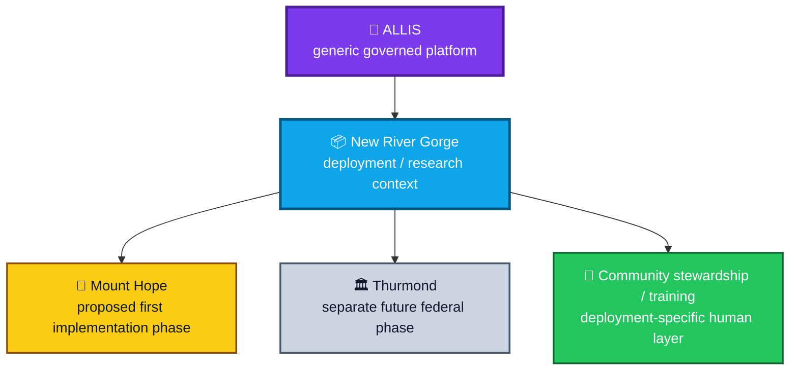

<div align="center">

# ALLIS — New River Gorge Deployment Example

### A project-specific illustration of the generic ALLIS deployment model

<br>


<br>

**Kidd’s Technical Services · ALLIS**

</div>

---

> [!IMPORTANT]
> This document is a **deployment example**.
>
> It describes one bounded project context in which ALLIS may be instantiated.
>
> It does not define the ALLIS platform, universal ALLIS hardware, universal ALLIS geography, or universal deployment requirements.

---

# 👀 Relationship to ALLIS



The hierarchy is:

```text
ALLIS
    ↓
platform

New River Gorge project
    ↓
deployment / research context

Mount Hope
    ↓
proposed first implementation phase

Thurmond
    ↓
separate future federal phase
```

---

# 🎯 Purpose

This example shows how the generic deployment architecture can be applied to a real place-based project without allowing project-specific details to become platform definitions.

The example separates:

- ALLIS architecture;
- project concept;
- local geography;
- local infrastructure;
- local partners;
- local stewardship;
- project status;
- future phases.

---

# 1. Project role

The New River Gorge Safety & Heritage Mesh Pilot is a documented **deployment and research context** for ALLIS.

Its role is to explore how governed computational, location-intelligence, public-information, field-observation, and community-stewardship concepts can be instantiated in a place-based environment.

It is not:

```text
the definition of ALLIS
```

---

# 2. Current project framing

The existing project framing separates:

```text
Mount Hope
    =
proposed first implementation phase
```

from:

```text
Thurmond
    =
separate future federal phase
```

This distinction should remain explicit in deployment documentation.

---

# 3. Why the phases remain separate

Mount Hope and Thurmond can differ in:

- land or site authority;
- institutional approval;
- infrastructure;
- deployment configuration;
- data;
- operating environment;
- privacy requirements;
- maintenance;
- funding;
- evaluation;
- public access;
- federal involvement.

A successful or approved action in one phase does not automatically authorize the other.

---

# 4. Mount Hope as a deployment context

Mount Hope can provide deployment-specific context such as:

- local geography;
- local heritage information;
- public-information access;
- local infrastructure;
- community participation;
- site-specific interfaces;
- local maintenance;
- field observation;
- community evaluation.

Those elements belong to the Mount Hope deployment context.

---

# 5. Mount Hope does not define ALLIS

```text
Mount Hope geography
    ≠
ALLIS geography
```

```text
Mount Hope hardware
    ≠
universal ALLIS hardware
```

```text
Mount Hope community model
    ≠
universal ALLIS governance
```

```text
Mount Hope grant scope
    ≠
ALLIS system boundary
```

---

# 6. Thurmond as a separate future phase

Thurmond should remain documented as a distinct deployment/federal phase.

It can require its own:

- authority;
- site permissions;
- institutional relationships;
- infrastructure plan;
- configuration;
- data;
- operating plan;
- evidence;
- evaluation;
- maintenance plan.

---

# 7. Mount Hope status does not transfer to Thurmond

```text
Mount Hope proposed
    ≠
Thurmond proposed under identical authority
```

```text
Mount Hope approved action
    ≠
Thurmond approved action
```

```text
Mount Hope installed infrastructure
    ≠
Thurmond installed infrastructure
```

Every site retains its own deployment state.

---

# 8. Deployment-specific human stewardship

The project can include a human stewardship or Community Champion layer.

That layer can support:

- community introduction;
- observation;
- reporting;
- field participation;
- training;
- maintenance support;
- local feedback;
- evaluation.

Human stewardship is a deployment program.

It is not the ALLIS platform itself.

---

# 9. Community participation and authority

Participation does not automatically create:

- system administration authority;
- private-state authority;
- publication authority;
- institutional authority;
- engineering authority.

Roles should remain scoped.

---

# 10. Deployment-specific infrastructure

A place-based deployment can use infrastructure such as:

- wireless nodes;
- relays;
- kiosks;
- local networks;
- public access points;
- field devices;
- local servers;
- replacement equipment.

Those are deployment choices.

They do not become mandatory ALLIS components merely because they are useful here.

---

# 11. Topology is local

A local network can be shaped by:

- terrain;
- building placement;
- visibility;
- power;
- maintenance access;
- network range;
- public access;
- land ownership.

This makes topology deployment-specific.

---

# 12. Location intelligence can support deployment planning

ALLIS-related deployment planning can use spatial analysis for:

- candidate node locations;
- route analysis;
- coverage;
- visibility;
- maintenance access;
- local context.

The resulting topology remains project-specific evidence.

---

# 13. Field operations are deployment-specific

A project can establish local operational practices such as:

- numbered equipment;
- replacement stock;
- maintenance assignments;
- inspection cycles;
- repair procedures;
- outage response;
- field verification.

Those practices belong to the deployment operations layer.

---

# 14. Public information is deployment-specific content

A deployment can publish local content such as:

- heritage information;
- trail information;
- public instructions;
- site context;
- community information.

Local content does not become universal ALLIS content.

---

# 15. Local publication still uses the generic outward boundary

The deployment relationship remains:

```text
qualified local state
    ↓
publication eligibility
    ↓
privacy / minimization
    ↓
public-safe provenance
    ↓
governed publication
    ↓
public interface
```

A local project does not bypass publication governance because the information is intended for the community.

---

# 16. Deployment-specific authority map

A New River Gorge project can involve authority from different actors.

Examples can include:

- property owner;
- municipality;
- nonprofit;
- federal agency;
- institution;
- service provider;
- project operator.

Each authority applies only within its own scope.

---

# 17. External authority remains external

```text
municipal support
    ≠
ALLIS engineering authority
```

```text
federal site authority
    ≠
ALLIS publication authority
```

```text
nonprofit program role
    ≠
private-state disclosure authority
```

```text
community participation
    ≠
system administration
```

---

# 18. Project status should remain precise

Project documentation should use the generic deployment status ladder:

```text
concept
proposed
approved
authorized
installed
configured
tested
observed
operational
evaluated
replication-supported
```

Do not skip stages in public wording.

---

# 19. Proposal is not installation

A deployment concept or grant proposal can be technically mature while remaining uninstalled.

```text
well-designed
    ≠
installed
```

---

# 20. Installation is not outcome evidence

Even after installation:

```text
installed
    ≠
evaluated
```

The project should collect separate operational and outcome evidence.

---

# 21. Project evidence categories

A place-based project can collect:

```text
site evidence

authority evidence

installation evidence

configuration evidence

runtime evidence

network evidence

maintenance evidence

public-interface evidence

community feedback

evaluation evidence
```

Each category supports different claims.

---

# 22. Project-specific residuals

Examples of project residuals can include:

- future-site approval;
- uninstalled infrastructure;
- incomplete local measurement;
- unavailable external dependency;
- pending partner decision;
- pending evaluation.

Residuals should remain visible instead of being merged into a broad project status.

---

# 23. Mount Hope evidence should remain Mount Hope evidence

A Mount Hope result can support:

```text
Mount Hope deployment claim
```

It should not automatically be promoted into:

```text
Thurmond deployment claim
```

or:

```text
universal ALLIS deployment claim
```

---

# 24. Thurmond evidence should remain Thurmond evidence

Likewise, future Thurmond evidence should remain tied to:

- its authority;
- its geography;
- its configuration;
- its observation period;
- its federal context.

---

# 25. Cross-site comparison

A later research program can compare deployments.

The comparison should distinguish:

```text
what is shared because it is ALLIS architecture
```

from:

```text
what differs because it is local deployment context
```

---

# 26. Replication question

The project can eventually help answer:

> **Which deployment patterns can transfer to another community, and which must be redesigned locally?**

That is a research and evaluation question.

It is not answered by architecture alone.

---

# 27. What may transfer

Potentially transferable patterns can include:

- governed deployment methodology;
- documentation structure;
- authority mapping;
- evidence collection;
- maintenance concepts;
- publication boundary;
- spatial planning methods;
- training structures.

Transfer requires evidence.

---

# 28. What may remain local

Local elements can include:

- node locations;
- site partners;
- community roles;
- hardware count;
- funding structure;
- trail content;
- federal requirements;
- public interfaces;
- maintenance assignments.

---

# 29. Project repository role

Project-specific artifacts should remain in the project repository or project-owned evidence layer.

Examples include:

- budgets;
- grants;
- letters of support;
- partner agreements;
- local maps;
- site plans;
- equipment plans;
- installation records;
- evaluation plans;
- training materials.

The ALLIS architecture repository can link to those artifacts where needed.

---

# 30. Why this separation matters

Without separation, a reader could incorrectly infer:

```text
ALLIS
=
New River Gorge mesh project
```

or:

```text
ALLIS
=
Mount Hope deployment
```

or:

```text
ALLIS
=
Thurmond deployment
```

None of those are correct.

---

# 31. Correct relationship

```text
ALLIS
    =
governed computational platform

New River Gorge project
    =
place-based deployment / research context

Mount Hope
    =
proposed first implementation phase

Thurmond
    =
separate future federal phase
```

---

# 32. Project-specific deployment profile

A deployment profile can look like:

```yaml
deployment_example:
  project: new-river-gorge-safety-heritage-mesh

  relationship_to_allis:
    type: deployment_and_research_context
    defines_allis: false

  phases:
    mount_hope:
      role: proposed_first_implementation_phase
      status: project_specific

    thurmond:
      role: separate_future_federal_phase
      status: project_specific

  local_context:
    geography_specific: true
    local_content_specific: true
    infrastructure_specific: true

  community_stewardship:
    enabled_as_project_program: true
    creates_system_authority_automatically: false

  authority:
    site_specific: true
    institution_specific: true
    transfers_between_sites_automatically: false

  evidence:
    must_remain_site_scoped: true

  replication:
    automatic: false
```

This is a documentation example, not a runtime schema.

---

# 33. Architecture links

For the generic deployment model, read:

- [`../deployment-model-overview.md`](../deployment-model-overview.md)

For the broader ALLIS architecture, use:

```text
architecture/system-boundary/
architecture/state-models/
architecture/trust-and-authority/
architecture/authority-planes.md
architecture/fail-closed-semantics.md
```

---

# 🧾 Example summary

<div align="center">

### 🧠 ALLIS

**platform**

↓

### 📦 NEW RIVER GORGE PROJECT

**deployment / research context**

↙︎　　　　　　　　　↘︎

### 📍 MOUNT HOPE

**proposed first implementation phase**

### 🏛️ THURMOND

**separate future federal phase**

<br>

### 👥 Community stewardship

**project-specific human layer**

<br>

# None of these deployment-specific elements redefine ALLIS.

</div>

---

# Governing principles

> **The New River Gorge project is a deployment context, not the definition of ALLIS.**

> **Mount Hope is a site-specific phase, not the platform boundary.**

> **Thurmond remains a separate future phase with its own authority and evidence needs.**

> **Community stewardship supports deployment; it does not create unrestricted technical authority.**

> **Local hardware and network topology remain deployment-specific.**

> **Local project evidence stays scoped to the site and observation that produced it.**

> **Replication requires evidence and local reassessment.**
