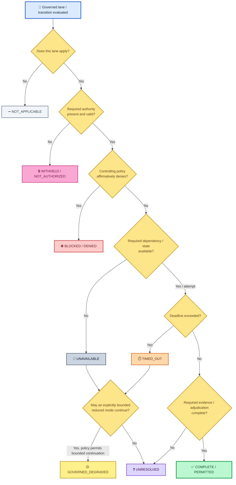
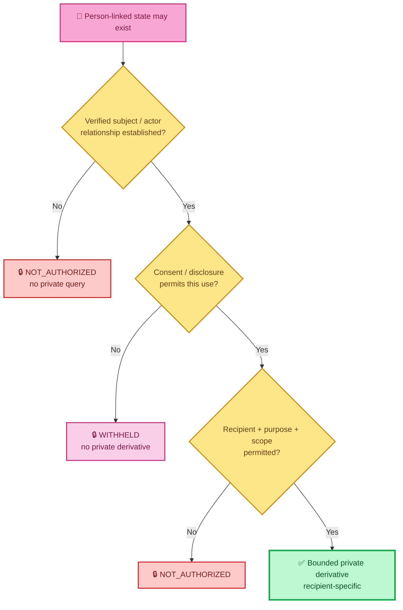
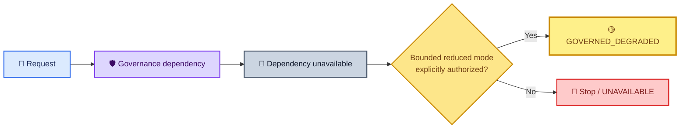
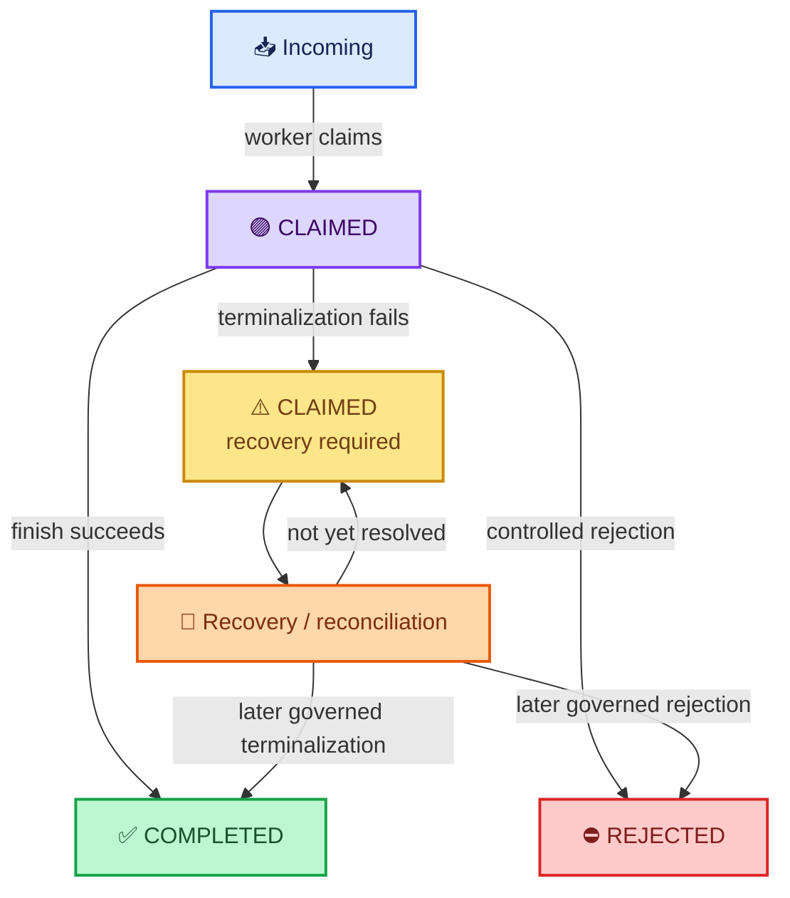
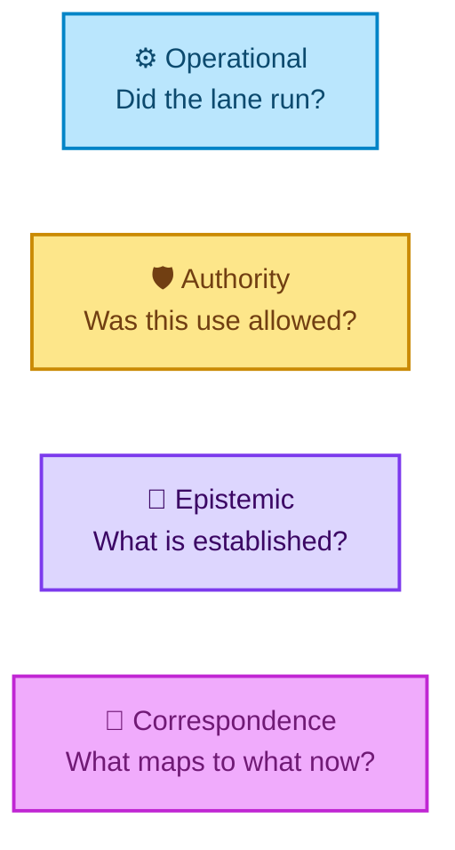
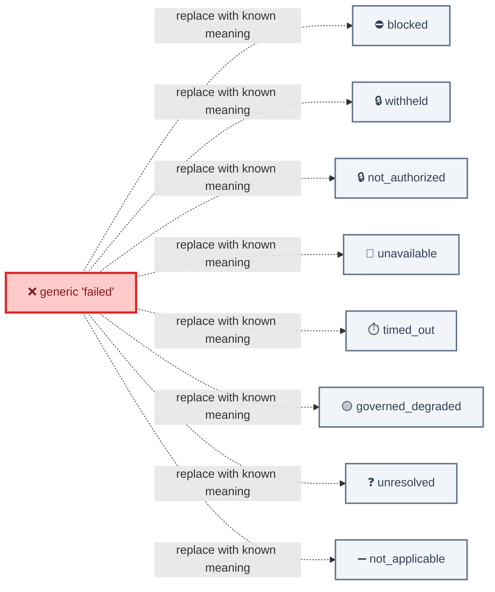
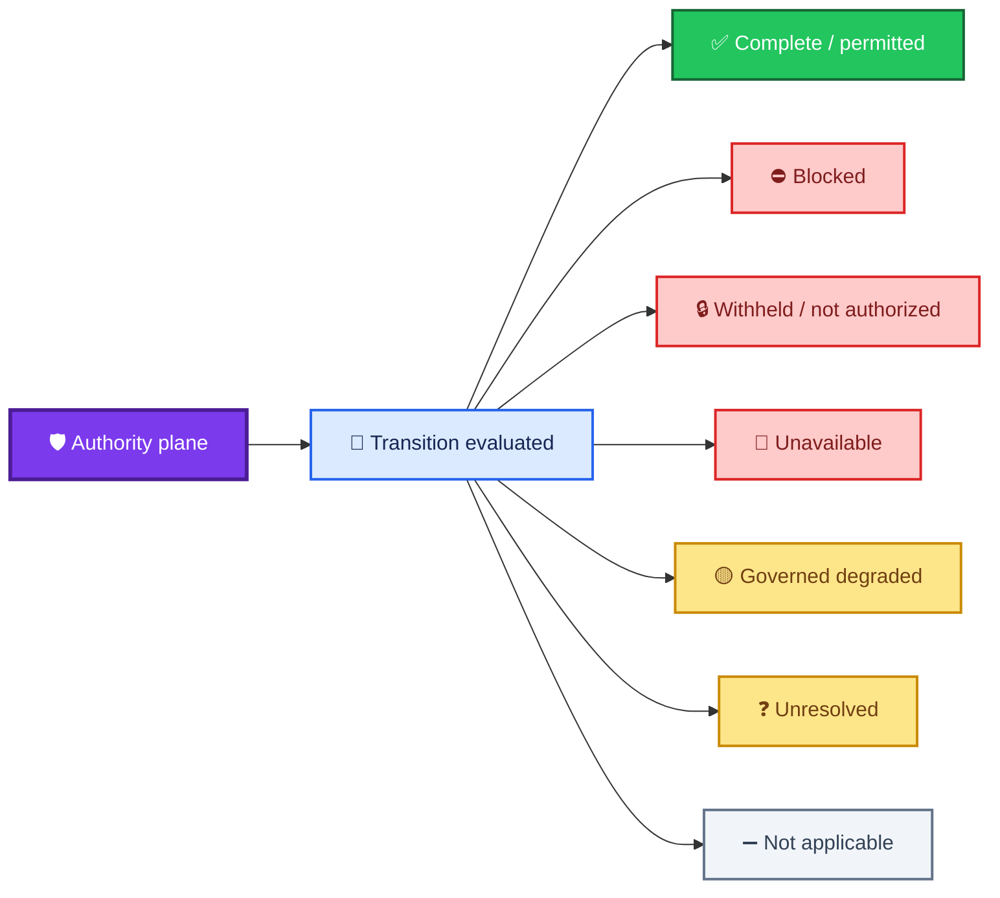

<div align="center">

# ALLIS — Fail-Closed Semantics

### Standard meanings for safe non-success, bounded degradation, unavailable state, unresolved state, and recovery

<br>


<br>

**Kidd’s Technical Services · ALLIS**

</div>

---

> [!IMPORTANT]
> **Fail-closed does not mean “return one generic failure state.”**
>
> ALLIS preserves the meaning of *why* a transition did not proceed.
>
> A denied transition, withheld private state, unavailable dependency, timed-out lane, governed degraded result, unresolved claim, not-applicable lane, empty spool, and claimed-but-not-terminalized record are different states and must not be collapsed into one another.

---

# 👀 The semantic contract

The canonical cross-system safe non-success classes are:

| Semantic class | Core meaning |
|---|---|
| ⛔ **`BLOCKED / DENIED`** | A controlling rule made an affirmative negative decision: the requested transition is prohibited. |
| 🔒 **`WITHHELD / NOT_AUTHORIZED`** | State may exist, but the caller, purpose, recipient, or operation lacks authority to receive or use it. |
| 📴 **`UNAVAILABLE`** | A required dependency, qualified object, or result cannot currently be obtained. |
| 🟡 **`GOVERNED_DEGRADED`** | A policy-approved reduced mode may continue while preserving the missing or failed dependency explicitly. |
| ❓ **`UNRESOLVED`** | Required evidence, authority, or adjudication is incomplete; the system cannot yet make the stronger determination. |
| ➖ **`NOT_APPLICABLE`** | The lane, rule, or transition does not apply to the request. |

A seventh operational condition is preserved where supported:

| Lane-level condition | Core meaning |
|---|---|
| ⏱️ **`TIMED_OUT`** | The lane was applicable and attempted, but did not return within its governed deadline. |

And two important **state conditions** are explicitly not failures:

| State condition | Core meaning |
|---|---|
| 📭 **`EMPTY` / `PASS_EMPTY`** | The governed container or spool is valid and empty; no work exists to claim or apply. |
| 🟣 **`CLAIMED` recovery state** | Work was claimed, but a terminal transition may not have completed; recovery or reconciliation is required. |

---

# 🚫 The rule this document prevents

ALLIS must not perform semantic laundering such as:

```text
unavailable
    → complete
```

or:

```text
withheld
    → no data
```

or:

```text
not authorized
    → unavailable
```

or:

```text
timed out
    → denied
```

or:

```text
not applicable
    → successful evidence
```

or:

```text
claimed
    → completed
```

because a downstream consumer prefers fewer states.

The semantic state must remain at least as precise as the evidence permits.

---

# 🧭 One decision tree



This is an architectural decision model, not a claim that every runtime component currently implements this exact branching form.

---

# ⛔ `BLOCKED / DENIED`

## Definition

`BLOCKED / DENIED` means an authoritative rule produced a **known negative decision** for the requested transition.

Examples include:

- constitutional or policy denial;
- explicit ethical or governance denial;
- authorization decision `deny`;
- a mutation request prohibited by the governing rule;
- publication explicitly disallowed by policy.

```text
request understood
+ controlling rule reached
+ decision = deny
    ⇒
BLOCKED / DENIED
```

## What it means

The system knows enough to say:

> **This transition must not proceed.**

This is stronger than unavailability.

It is not:

```text
we could not check
```

It is:

```text
we checked the controlling condition
and the answer was no
```

## Expected effect

```text
protected transition = NO
```

The system may still return:

- a safe explanation;
- a reason code;
- non-sensitive provenance;
- an audit event;
- a bounded alternative where policy separately permits one.

It must not perform the prohibited transition.

---

# 🔒 `WITHHELD / NOT_AUTHORIZED`

These two states belong to the same protected-information family but carry different emphasis.

## `NOT_AUTHORIZED`

`NOT_AUTHORIZED` means the actor, purpose, scope, recipient, or operation lacks the authority required for this use.

Examples:

```text
actor ≠ verified subject
missing private-read scope
unsupported purpose
recipient outside disclosure scope
operation not granted
```

The semantic statement is:

> **The requested use is outside the established authority.**

## `WITHHELD`

`WITHHELD` means information can exist and may even be known to the protected subsystem, but must not be returned, propagated, or exposed into the requested lane.

Examples:

```text
consent does not permit disclosure
record is restricted
private derivative is not permitted for this recipient
sensitivity rule requires redaction
```

The semantic statement is:

> **The state is intentionally not disclosed.**

## Why the distinction matters

```text
NOT_AUTHORIZED
    emphasizes the requester's missing permission

WITHHELD
    emphasizes the protected state remaining behind the boundary
```

Neither should be rendered as:

```text
no such data exists
```

unless the architecture intentionally uses a non-disclosure response that does not reveal existence.

---

# 👤 Private-state example



This preserves:

```text
information exists
    ≠
identity established
    ≠
use authorized
    ≠
disclosure authorized
    ≠
retention authorized
```

---

# 📴 `UNAVAILABLE`

## Definition

`UNAVAILABLE` means an applicable dependency, service, qualified object, or result cannot currently be obtained.

Examples include:

- service unreachable;
- required endpoint unavailable;
- required qualified state absent;
- upstream dependency error;
- invalid response that prevents reliable use;
- required evidence source cannot be reached.

```text
lane applies
+ no affirmative policy denial
+ required dependency/result not usable
    ⇒
UNAVAILABLE
```

## It is not denial

```text
UNAVAILABLE
    ≠
DENIED
```

The system has not necessarily determined that the operation is prohibited.

It has determined that it **cannot safely establish the required condition now**.

## It is not success

```text
UNAVAILABLE
    ≠
COMPLETE
```

A generic failure must not be normalized to success merely to satisfy downstream schema expectations.

---

# ⏱️ `TIMED_OUT`

## Definition

`TIMED_OUT` is an explicit operational status for an applicable lane that exceeded its governed deadline.

```text
lane applies
+ request attempted
+ deadline exceeded
    ⇒
TIMED_OUT
```

This is more informative than generic `UNAVAILABLE`.

## Relationship to the canonical classes

At lane level, preserve:

```text
TIMED_OUT
```

when the schema supports it.

At a higher aggregate level, policy may classify the overall result as:

```text
GOVERNED_DEGRADED
```

or:

```text
UNAVAILABLE
```

depending on whether bounded continuation is authorized.

The timeout itself must remain visible in the lane evidence.

---

# 🟡 `GOVERNED_DEGRADED`

## Definition

`GOVERNED_DEGRADED` means the full path is not available, but policy explicitly permits a **bounded reduced mode** that does not bypass the unavailable or failed governance dependency.

This is not ordinary fallback.

It is governed continuation.

```text
required/full capability unavailable
+ reduced mode is separately allowed
+ missing condition remains explicit
+ protected transition is not falsely promoted
    ⇒
GOVERNED_DEGRADED
```

## Example structure



## The key prohibition

```text
dependency unavailable
    ⇒
silently bypass dependency
```

is **not** governed degradation.

That is an authority failure.

A governed degraded result must preserve:

- what was unavailable;
- which capability was reduced;
- why continuation remained permitted;
- what stronger result is not being claimed.

---

# ❓ `UNRESOLVED`

## Definition

`UNRESOLVED` means the system does not yet have enough adjudicated evidence or authority to produce the stronger semantic result.

Examples include:

- evidence conflict not yet resolved;
- authority relationship not yet established;
- provenance chain incomplete;
- claim maturity insufficient;
- review or formal adjudication still open;
- a recovery process has not yet determined the terminal state.

```text
question applies
+ not denied
+ not safely complete
+ determination remains open
    ⇒
UNRESOLVED
```

## It is not failure

An unresolved proposition may later become:

```text
PROVEN
DISPROVEN
AUTHORIZED
DENIED
WITHHELD
NOT_APPLICABLE
```

depending on the missing adjudication.

The system must not pre-decide the outcome.

---

# ➖ `NOT_APPLICABLE`

## Definition

`NOT_APPLICABLE` means the lane or rule is outside the semantic scope of the current request.

Examples:

- a research lane for a non-research request;
- a person-linked lane where no person-linked context is relevant;
- an optional subsystem that does not apply to the requested operation;
- a transition rule for a different object type.

```text
lane does not apply
    ⇒
NOT_APPLICABLE
```

## It is not unavailable

```text
NOT_APPLICABLE
    ≠
UNAVAILABLE
```

Nothing required is missing.

The lane simply does not belong in the decision.

## It is not substantive success

```text
NOT_APPLICABLE
    ≠
evidence supporting the requested claim
```

A not-applicable lane can be validly skipped without becoming affirmative evidence.

---

# 📭 `EMPTY / PASS_EMPTY`

A valid empty state deserves its own treatment.

Step-12 provides a concrete example:

```text
authorized spool = PASS_EMPTY
```

This means:

```text
spool exists
+ structure / permissions / binding valid
+ zero incoming records
    ⇒
healthy empty state
```

It does **not** mean:

```text
service unavailable
```

and it does not mean:

```text
authorization denied
```

The bounded worker theorem preserves:

```text
NoIncomingRecord
    ⇒
NoWorkerClaim
    ⇒
NoAuthorizedApply
```

So an empty spool is a safe operational condition.

The later post-A8 live observation revalidated this condition against the current bounded DGM runtime: incoming remained empty, no worker claim occurred, no authorization was consumed, no receipt was created, and no authorized apply occurred.

That newer observation strengthens the current `T12D-C` correspondence record without changing the semantic meaning of `PASS_EMPTY`.

---

# 🟣 `CLAIMED` is not automatically terminal

Step 12 disproved unconditional terminal totality.

The proposed property:

```text
claimed
    ⇒
completed OR rejected
```

is false within the bounded architecture.

The counterexample is:

```text
claimed
+ terminalization failure
    ⇒
claimed
```

Therefore `claimed` must be represented as a possible recovery state.



The architecture must not manufacture terminality for convenience.

---

# 🔴 `DISPROVEN` is not `UNRESOLVED`

This distinction matters in formal work.

```text
UNRESOLVED
    =
the question is not yet adjudicated
```

```text
DISPROVEN
    =
the proposition was adjudicated and a valid counterexample exists
```

For `P12C-09`:

```text
MACHINE_CHECKED_DISPROVEN
```

is a terminal epistemic result for that exact proposition.

A later repaired or narrower theorem would be a **new proposition**.

It would not retroactively convert the original result to unresolved or proven.

---

# 🧮 Operational state and epistemic state must remain separate

ALLIS uses status words in different domains.

A runtime lane can be:

```text
UNAVAILABLE
```

while a claim about that lane can be:

```text
UNRESOLVED
```

or:

```text
NOT_OBSERVED
```

A theorem can be:

```text
DISPROVEN
```

while the service involved is operationally:

```text
COMPLETE
```

Therefore:

```text
runtime status
    ≠
claim maturity
    ≠
formal proposition state
    ≠
authority state
```

Do not reuse one semantic code as a substitute for another domain.

---

# 🧬 Four semantic dimensions

A robust ALLIS result can be understood across four independent dimensions.



Examples:

| Scenario | Operational | Authority | Epistemic | Correspondence |
|---|---|---|---|---|
| Private record exists but caller lacks scope | complete subsystem | `NOT_AUTHORIZED` | existence may remain undisclosed | N/A |
| BBB service unavailable, reduced response allowed | `UNAVAILABLE` lane | bounded continuation authorized | no full-path claim | point-in-time |
| Empty DGM spool | `PASS_EMPTY` | no apply authority consumed | no incoming record | `T12D-C` correspondence-verified · current post-A8 live revalidation |
| Invalid DGM authorization signature | validation path active | invalid authority rejected | fail-closed behavior observed | `T12D-B` correspondence-verified · current post-A8 live revalidation |
| Claimed record terminalization fails | worker active | recovery authority required | P12C-09 disproven | bounded source/model |
| Public DNS timeout | public path `UNAVAILABLE/TIMED_OUT` at attempt | no production mutation authority implied | production fault not established | later recovery required |
| Research lane irrelevant | `NOT_APPLICABLE` | no authority question needed | no research evidence generated | N/A |

---

# 🔐 Fail-closed at the inward boundary

For protected/person-linked state, safe behavior means:

```text
missing identity authority
    ⇒
no private query
```

```text
missing disclosure authority
    ⇒
WITHHELD
```

```text
missing purpose / scope authority
    ⇒
NOT_AUTHORIZED
```

```text
private state unavailable
    ⇒
do not invent continuity
```

The system should not replace missing protected context with an assertion that the context does not exist.

---

# 🔐 Fail-closed at the write boundary

For protected mutation:

```text
invalid authorization
    ⇒
no authorized-spool publication
```

```text
no incoming record
    ⇒
no worker claim
    ⇒
no authorized apply
```

```text
spent / unavailable one-use authority
    ⇒
no replay
```

```text
target / prestate mismatch
    ⇒
no authorized application
```

A failed or missing prerequisite does not become implicit permission.

## Current post-A8 live examples

The later post-A8 DGM correspondence work revalidated two concrete fail-closed paths against the current theorem-relevant runtime.

### `T12D-B` — invalid authorization fails closed

The live validation/publication path received a structurally valid candidate/authorization package with a deliberately invalid cryptographic signature.

Observed result:

```text
invalid signature
    ⇒
authorization rejected
    ⇒
no authorized-spool publication
    ⇒
no authorization consumption
    ⇒
no receipt creation
```

The bounded current live result was:

```text
T12D_B_CURRENT_LIVE_OBSERVATION=PASS
T12D_B_POST_A8_VALIDATION_LEVEL=CORRESPONDENCE_VERIFIED
```

This is a current concrete example of:

```text
invalid authorization
    ≠
permission to publish authorized work
```

### `T12D-C` — empty spool remains non-applying

The live worker was observed with an empty incoming/claimed state across the bounded observation window.

Observed result:

```text
empty incoming spool
    ⇒
no worker claim
    ⇒
no authorization consumption
    ⇒
no receipt creation
    ⇒
no authorized apply
```

The bounded current live result was:

```text
T12D_C_CURRENT_LIVE_OBSERVATION=PASS
T12D_C_POST_A8_VALIDATION_LEVEL=CORRESPONDENCE_VERIFIED
```

This is a current concrete example of:

```text
PASS_EMPTY
    ≠
UNAVAILABLE
    ≠
DENIED
```

and:

```text
no work available
    ⇒
no protected apply
```

### `T12D-A` remains separate

The current source/runtime correspondence is `PASS_11_OF_11`, and the later Lean R1 work independently kernel-checked the bounded authorized-application proposition.

However, the positive authorized-apply production path was **not executed** during the post-A8 revalidation.

Therefore the current status remains:

```text
T12D-A = MACHINE_CHECKED
```

and is not promoted to `CORRESPONDENCE_VERIFIED`.

### Production-action boundary

These post-A8 probes did **not** issue or consume real production authorization and did **not** apply a production DGM patch.

```text
REAL_PRODUCTION_AUTHORIZATION_ISSUED=NO
REAL_PRODUCTION_AUTHORIZATION_CONSUMED=NO
REAL_PRODUCTION_DGM_PATCH_APPLICATION=NO
```

The current source/runtime relationship used for the bounded live observations was:

```text
CURRENT_POST_A8_DGM_SOURCE_TO_RUNTIME_CORRESPONDENCE=PASS_11_OF_11
```

See:

- [Lean R1 workstream closeout](../formal-verification/authorized-adoption/lean/workstream-closeout-r1.md)
- [Post-A8 DGM theorem correspondence registry R1](../evidence/governed-evolution/post-a8-theorem-correspondence-registry-r1.md)

---

# 🌐 Fail-closed at the publication boundary

For public projection:

```text
internal state exists
    ≠
publication eligible
```

If publication requirements are not met, safe behavior is:

```text
no governed publication
```

not:

```text
publish best effort
```

The Step-17 architecture also establishes:

```text
public read access
    ≠
public mutation authority
```

So a public GUI or endpoint cannot create backend write authority simply because the data is visible.

---

# 🌍 Network failure is not automatically production failure

Step 17 provides an important classification example.

A public continuity attempt encountered a DNS timeout.

That observation did not justify:

```text
production is broken
```

The later bounded recovery showed:

```text
DNS_RC=0
publication HTTP=200
GUI HTTP=200
direct/public body correspondence=PASS
FINAL_NETWORK_CONTINUITY=GREEN
PRODUCTION_REPAIR_REQUIRED=NO
```

The earlier event was therefore classified as:

```text
TRANSIENT_EXTERNAL_NAME_RESOLUTION_FAILURE_RECOVERED
```

This demonstrates why `UNAVAILABLE` must not be silently promoted into a deeper causal diagnosis.

---

# 🟡 Degraded is not denied

Consider:

```text
dependency unavailable
```

If policy permits a reduced, non-bypassing mode:

```text
GOVERNED_DEGRADED
```

can be correct.

If policy says the transition must stop:

```text
UNAVAILABLE
```

or an appropriate blocked result may be correct.

But:

```text
dependency unavailable
    ≠
policy denied
```

The reason must be preserved.

---

# 🔒 Withheld is not unavailable

This distinction is especially important for privacy.

```text
WITHHELD
```

can mean:

```text
the protected system has state
but disclosure is intentionally suppressed
```

while:

```text
UNAVAILABLE
```

means:

```text
the required state or dependency cannot be obtained
```

A public-facing interface may intentionally avoid revealing which private condition applies.

Internally, however, the governance record should preserve the correct semantic class where policy permits.

---

# ➖ Not applicable is not optional failure

If a lane does not apply, it should not be penalized as though it failed.

```text
NOT_APPLICABLE
```

means:

```text
this path is outside the current request
```

It should not inflate:

- failure counts;
- degraded counts;
- missing-dependency alerts;
- negative authority findings.

Nor should it count as substantive evidence for a claim.

---

# ⏱️ Timeout is not generic unavailable when the distinction is known

If the system knows the reason is deadline expiration, preserve:

```text
TIMED_OUT
```

at the lane level.

This supports:

- latency diagnosis;
- deadline policy;
- retry policy;
- bounded degradation;
- reproducible audits.

Higher-level aggregation may map that lane to `UNAVAILABLE` or `GOVERNED_DEGRADED`, but the raw lane meaning should remain recoverable.

---

# 🧾 Reason codes preserve causality

A status says **what class of state occurred**.

A reason code says **why**.

For example:

```text
status = governed_degraded
reason = bbb_unavailable
```

is more informative than:

```text
status = failed
```

Likewise:

```text
status = blocked
reason = constitutional_denied
```

should remain distinct from:

```text
status = governed_degraded
reason = governance_finalization_unavailable
```

The architectural pattern is:

```text
semantic class
+ reason code
+ blocked_by / dependency where safe
+ time
+ correlation identity
```

without leaking protected content.

---

# 📋 Canonical semantic table

| State | Applicable? | Authority known? | Dependency usable? | Can bounded work continue? | Protected transition allowed? | Meaning |
|---|---:|---:|---:|---:|---:|---|
| ✅ `COMPLETE` | Yes | Yes where required | Yes | Yes | Only if separately authorized | Lane completed |
| ⛔ `BLOCKED / DENIED` | Yes | **Known negative** | Maybe | Usually no | **No** | Rule prohibits transition |
| 🔒 `NOT_AUTHORIZED` | Yes | **Absent / insufficient** | Maybe | Only outside protected use | **No** | Caller/use lacks authority |
| 🔒 `WITHHELD` | Yes | Disclosure not permitted | State may exist | Possibly elsewhere | **No disclosure** | Protected state retained |
| 📴 `UNAVAILABLE` | Yes | Not necessarily decided | **No / unusable** | Policy-dependent | No unsupported transition | Required capability/result unavailable |
| ⏱️ `TIMED_OUT` | Yes | Not necessarily decided | Deadline exceeded | Policy-dependent | No unsupported transition | Applicable attempt exceeded deadline |
| 🟡 `GOVERNED_DEGRADED` | Yes | Reduced mode authorized | Partial | **Yes, bounded** | Only within reduced authority | Safe reduced operation |
| ❓ `UNRESOLVED` | Yes | Not fully adjudicated | Maybe | Usually no stronger promotion | No inferred permission | Decision remains open |
| ➖ `NOT_APPLICABLE` | **No** | N/A | N/A | N/A | N/A | Lane does not apply |
| 📭 `PASS_EMPTY` | Yes | N/A until work exists | **Healthy** | Yes | No work to apply | Valid empty state |
| 🟣 `CLAIMED` recovery | Yes | Prior claim occurred | Partial / terminalization failed | Recovery only | No invented terminal result | Nonterminal recovery state |

---

# 🧱 Top-level outcome vs lane-level status

The earlier gateway architecture distinguishes **aggregate outcomes** from **lane statuses**.

A controlled aggregate outcome can be:

```text
complete
governed_degraded
blocked
```

while individual lanes can preserve:

```text
complete
unavailable
timed_out
withheld
not_authorized
not_applicable
```

This separation is valuable.

Example:

```text
overall outcome = governed_degraded

lane BBB = unavailable
lane H_people = withheld
lane research = not_applicable
lane constitutional = complete
```

The aggregate result communicates the safe operating mode.

The lane states preserve the exact reasons.

---

# 🚫 Avoid a generic `failed` state

A generic state such as:

```text
failed
```

throws away meaning unless every consumer has a precise shared definition for it.

Prefer the narrower semantic class.



If the cause is genuinely unknown, the architecture should use an explicitly supported unknown/unresolved mechanism rather than silently choosing a false semantic state.

---

# 🧭 Status selection rules

## Rule 1 — Prefer the narrowest supported meaning

If the system knows the request was denied:

```text
DENIED
```

is better than:

```text
UNAVAILABLE
```

If it knows the dependency timed out:

```text
TIMED_OUT
```

is better than generic:

```text
UNAVAILABLE
```

at the evidence-bearing lane.

---

## Rule 2 — Never promote missing evidence to success

```text
no result
    ≠
complete
```

```text
missing authority
    ≠
allow
```

```text
no evidence
    ≠
healthy
```

---

## Rule 3 — Never infer denial from technical absence

```text
service unavailable
    ≠
policy denied
```

---

## Rule 4 — Never infer data absence from withholding

```text
WITHHELD
    ≠
NO_RECORD_EXISTS
```

---

## Rule 5 — Preserve not-applicable as scope information

```text
not_applicable
    ≠
failure
```

and:

```text
not_applicable
    ≠
affirmative evidence
```

---

## Rule 6 — Degraded operation requires explicit permission

```text
fallback exists
    ≠
fallback authorized
```

A reduced path is `GOVERNED_DEGRADED` only when its reduced behavior is itself permitted.

---

## Rule 7 — Recovery states must remain nonterminal until terminalized

```text
claimed
    ≠
completed
```

```text
claimed
    ≠
rejected
```

until the governed terminal transition actually occurs.

---

# 🧠 Semantic invariants

The fail-closed model can be summarized with several invariants.

```text
MissingAuthority(x)
    ⇒
not PermitProtectedTransition(x)
```

```text
Denied(x)
    ⇒
not ExecuteProtectedTransition(x)
```

```text
Unavailable(x)
    ⇒
not AssertSuccessfulUse(x)
```

```text
Withheld(x)
    ⇒
not DiscloseProtectedState(x)
```

```text
NotApplicable(x)
    ⇒
not TreatAsFailure(x)
```

```text
GovernedDegraded(x)
    ⇒
ReducedModeExplicitlyAuthorized(x)
```

```text
Claimed(x) ∧ TerminalizationFailure(x)
    ⇒
Claimed(x)
```

These are architectural semantics.

Specific runtime proof levels remain documented in the relevant evidence and formal records.

---

# 🔗 Fail-closed and claim maturity

Fail-closed semantics also apply to documentation.

If evidence supports only:

```text
OBSERVED
```

the repository must not silently report:

```text
PROVEN
```

If a theorem is:

```text
MACHINE_CHECKED
```

without the relevant live observation, the repository must not report:

```text
CORRESPONDENCE_VERIFIED
```

If a proposition is:

```text
DISPROVEN
```

the repository must not hide it as:

```text
UNRESOLVED
```

This is epistemic fail-closed behavior:

> **When stronger evidence is absent, retain the lower supported claim rather than promote it.**

The current DGM theorem record is a concrete example:

```text
T12D-A = MACHINE_CHECKED
T12D-B = CORRESPONDENCE_VERIFIED
T12D-C = CORRESPONDENCE_VERIFIED
P12C-09 = MACHINE_CHECKED_DISPROVEN
```

`T12D-B` and `T12D-C` have current post-A8 theorem-specific live observations.

`T12D-A` does not have a positive authorized-apply production observation, so it remains at the lower supported level rather than being promoted.

The negative `P12C-09` result remains adjudicated and is not relabeled as unresolved.

---

# 🔗 Fail-closed and correspondence

If a required correspondence edge is missing:

```text
formal model
    ?↔
source
```

or:

```text
source
    ?↔
runtime
```

or:

```text
publication
    ?↔
public body
```

the system should not infer the edge.

The correct documentation state can be:

```text
UNRESOLVED
NOT_ESTABLISHED
OUTSIDE_AUDITED_SCOPE
```

depending on the evidence model.

The absence of a correspondence check is not a correspondence pass.

For the bounded DGM theorem domain, the repository now records two observation epochs:

```text
historical Step-12 correspondence
    ≠
current post-A8 correspondence revalidation
```

The current post-A8 source/runtime result is:

```text
CURRENT_POST_A8_DGM_SOURCE_TO_RUNTIME_CORRESPONDENCE=PASS_11_OF_11
```

For `T12D-B` and `T12D-C`, that current source/runtime match is paired with a current theorem-specific live observation.

For `T12D-A`, the current source/runtime match exists, but the required positive live authorized-apply observation does not.

---

# 🔒 Fail-closed and successor authority

A completed workstream does not automatically authorize its successor.

Workstream F:

```text
CLOSED
```

but:

```text
FURTHER_WORKSTREAM_F_PROOF_EXECUTION_AUTHORIZED=NO
```

Step 12:

```text
COMPLETE
```

but:

```text
DEFINE_NEXT_WORKSTREAM_BEFORE_FURTHER_PROMOTION
```

Step 17:

```text
GREEN_COMPLETE
```

but:

```text
NO STEP 18 FOR THIS FIXED GOAL
```

This is authority-level fail-closed behavior.

---

# 🧪 Examples by authority plane

## Inward / privacy plane

| Condition | Correct semantic result |
|---|---|
| Verified subject mismatch | `NOT_AUTHORIZED` |
| Consent does not permit use | `WITHHELD` |
| Private-memory service unreachable | `UNAVAILABLE` |
| Lane irrelevant to request | `NOT_APPLICABLE` |
| Private dependency times out | `TIMED_OUT` |
| Safe response can proceed without private context under policy | `GOVERNED_DEGRADED` |

## Governed write plane

| Condition | Correct semantic result |
|---|---|
| Authorization invalid | `BLOCKED / DENIED` · current post-A8 `T12D-B` live example |
| Authorization missing / not valid for target | `NOT_AUTHORIZED` |
| Empty incoming spool | `PASS_EMPTY` · current post-A8 `T12D-C` live example |
| Worker claims record and finish succeeds | `COMPLETED` |
| Controlled rejection | `REJECTED / BLOCKED` as defined by local state machine |
| Finish/terminalization fails after claim | remain `CLAIMED`; recovery required |

## Governed publication plane

| Condition | Correct semantic result |
|---|---|
| State not publication-eligible | no publication / `NOT_AUTHORIZED` or `WITHHELD` by cause |
| Required publication dependency unreachable | `UNAVAILABLE` |
| Public continuity deadline exceeded | `TIMED_OUT` at observation |
| Public route later recovers without production repair | recovered continuity; prior event remains historical |
| Public GUI has no write route | read-only boundary, not degraded |
| Publication lane does not apply | `NOT_APPLICABLE` |

---

# 🧾 Auditability requirements

A fail-closed state should be explainable without leaking protected content.

Where appropriate, retain:

```text
semantic status
reason code
policy/build version
correlation identity
responsible boundary / dependency
timestamp
relevant qualified object identity
```

For private lanes, do **not** persist protected content merely to explain why it was withheld.

The audit record can preserve:

```text
h_people = withheld
reason = disclosure_scope_not_met
```

without preserving the private material itself.

---

# 🔐 Privacy-safe error semantics

Privacy requires special care because detailed error messages can themselves leak state.

The architecture therefore distinguishes:

```text
internal semantic precision
```

from:

```text
external disclosure detail
```

Internally, a lane may know:

```text
WITHHELD
```

Externally, policy may permit only:

```text
not available for this request
```

That does not change the internal governance meaning.

It changes what may be disclosed about the meaning.

---

# 🌐 Public interfaces must not lie about uncertainty

A public or research interface should prefer explicit states such as:

```text
Unavailable
Not proven
Outside audited scope
Not authorized
Unresolved
```

over misleading defaults such as:

```text
Healthy
Passed
Approved
Canonical
Complete
```

when the required evidence is absent.

The interface is downstream of authority and evidence.

It must not invent success to make the display simpler.

---

# ⚪ Whole-system claim boundary

Fail-closed semantics are an architectural control model. They do not, by themselves, establish a universal production-safety theorem or whole-system proof.

The current repository boundary remains:

```text
PRODUCTION_MUTATION_SAFETY_THEOREM_PROVEN=NO

WHOLE_SYSTEM_SAFETY_THEOREM_PROVEN=NO

SYSTEM_PROVEN=NO
```

A bounded fail-closed behavior can be demonstrated or correspondence-verified without silently promoting every ALLIS path to the same validation level.

---

# 🧩 Relationship to authority planes

`architecture/authority-planes.md` answers:

> **Where does state cross governed authority boundaries?**

This document answers:

> **What does it mean when a governed boundary does not produce ordinary success?**



---

# 🧩 Relationship to state models

The state-model architecture should preserve these semantics rather than flattening them.

In particular, it should include:

- publication eligibility/projection state;
- the six canonical safe non-success classes;
- explicit timeout where supported;
- healthy empty state;
- claimed-but-not-terminalized recovery state;
- terminal `completed` and `rejected` states only when actually reached.

A state machine should not assume terminality merely because the ideal path has a terminal transition.

---

# 🧩 Relationship to private-state architecture

The private-state boundary should use these semantics precisely.

Recommended distinctions:

```text
identity cannot be established
    → NOT_AUTHORIZED / UNRESOLVED by exact cause and policy

consent/disclosure does not permit release
    → WITHHELD

required private service unreachable
    → UNAVAILABLE

private lane irrelevant
    → NOT_APPLICABLE

safe non-private response still permitted
    → GOVERNED_DEGRADED where policy explicitly allows
```

The dedicated private-state document should preserve the exact public-safe boundary without exposing private implementation details.

---

# 📚 Related repository records

## Architecture

- [`authority-planes.md`](authority-planes.md) — governed authority crossings
- [`system-boundary/allis-system-boundary.md`](system-boundary/allis-system-boundary.md)
- [`trust-and-authority/trust-and-authority-overview.md`](trust-and-authority/trust-and-authority-overview.md)
- [`state-models/state-model-overview.md`](state-models/state-model-overview.md)
- `private-state/h-people-boundary.md` — planned public-safe private-state boundary

## Claims

- [`../claims/claim-registry.md`](../claims/claim-registry.md)
- [`../claims/nonclaims-and-residuals.md`](../claims/nonclaims-and-residuals.md)

## Acceptance

- [`../acceptance/closeout/dgm-step12-close.md`](../acceptance/closeout/dgm-step12-close.md)
- [`../acceptance/closeout/publication-step17-close.md`](../acceptance/closeout/publication-step17-close.md)

## Formal verification

- [`../formal-verification/authorized-adoption/theorem-registry.md`](../formal-verification/authorized-adoption/theorem-registry.md)
- [`../formal-verification/authorized-adoption/counterexample-registry.md`](../formal-verification/authorized-adoption/counterexample-registry.md)
- [`../formal-verification/authorized-adoption/lean/workstream-closeout-r1.md`](../formal-verification/authorized-adoption/lean/workstream-closeout-r1.md)

## Current DGM correspondence evidence

- [`../evidence/governed-evolution/post-a8-theorem-correspondence-registry-r1.md`](../evidence/governed-evolution/post-a8-theorem-correspondence-registry-r1.md)

---

# 📦 Normalized semantic model

```yaml
allis_fail_closed_semantics:

  governing_rule:
    missing_authority_never_becomes_permission: true
    missing_data_never_becomes_success: true
    semantic_reason_is_preserved: true

  canonical_cross_system_states:

    BLOCKED_DENIED:
      meaning: controlling_policy_or_authority_made_known_negative_decision
      protected_transition_allowed: false
      implies_dependency_unavailable: false

    WITHHELD:
      meaning: protected_state_not_disclosed
      state_may_exist: true
      disclosure_allowed: false

    NOT_AUTHORIZED:
      meaning: actor_purpose_recipient_or_operation_lacks_required_authority
      protected_transition_allowed: false

    UNAVAILABLE:
      meaning: required_dependency_state_or_result_not_currently_usable
      policy_denial_implied: false
      success_implied: false

    GOVERNED_DEGRADED:
      meaning: explicitly_authorized_bounded_reduced_mode
      full_capability_claimed: false
      missing_dependency_remains_explicit: true

    UNRESOLVED:
      meaning: required_evidence_authority_or_adjudication_incomplete
      stronger_claim_allowed: false

    NOT_APPLICABLE:
      meaning: lane_or_rule_does_not_apply
      failure: false
      substantive_success_evidence: false

  explicit_lane_state:
    TIMED_OUT:
      meaning: applicable_attempt_exceeded_governed_deadline
      preserve_at_lane_level: true
      possible_aggregate_states:
        - UNAVAILABLE
        - GOVERNED_DEGRADED

  healthy_nonwork_state:
    PASS_EMPTY:
      meaning: valid_empty_container_or_spool
      unavailable: false
      denied: false
      work_to_apply: false

  recovery_state:
    CLAIMED:
      may_remain_nonterminal_after_terminalization_failure: true
      completed_implied: false
      rejected_implied: false
      requires_recovery_or_reconciliation: true

  current_bounded_dgm_examples:
    source_runtime_correspondence: PASS_11_OF_11
    T12D-B:
      condition: invalid_authorization_signature
      live_observation: PASS
      validation_level: CORRESPONDENCE_VERIFIED
      authorized_spool_publication: false
      authorization_consumed: false
      receipt_created: false
    T12D-C:
      condition: empty_incoming_spool
      live_observation: PASS
      validation_level: CORRESPONDENCE_VERIFIED
      worker_claim: false
      authorization_consumed: false
      receipt_created: false
      authorized_apply: false
    T12D-A:
      validation_level: MACHINE_CHECKED
      positive_authorized_apply_executed: false
    production_action_boundary:
      real_production_authorization_issued: false
      real_production_authorization_consumed: false
      real_production_dgm_patch_application: false

  aggregate_gateway_pattern:
    outcomes:
      - complete
      - governed_degraded
      - blocked
    lane_statuses:
      - complete
      - unavailable
      - timed_out
      - withheld
      - not_authorized
      - not_applicable

  prohibited_normalizations:
    unavailable_to_complete: true
    withheld_to_no_data_exists: true
    not_authorized_to_unavailable: true
    timed_out_to_denied: true
    not_applicable_to_success_evidence: true
    claimed_to_completed_without_terminalization: true

  system_boundary:
    production_mutation_safety_theorem_proven: false
    whole_system_safety_theorem_proven: false
    system_proven: false
```

> [!NOTE]
> This YAML block is a human-readable architecture normalization. Workstream-local schemas, runtime evidence, formal results, and acceptance records remain authoritative within their own bounded scope.

---

# 🧾 Fail-closed summary

<div align="center">

### ⛔ `BLOCKED / DENIED`
**The answer is known, and the transition is prohibited.**

### 🔒 `WITHHELD / NOT_AUTHORIZED`
**Protected state or action is outside the permitted disclosure/use scope.**

### 📴 `UNAVAILABLE`
**A required dependency or qualified result cannot currently be obtained.**

### ⏱️ `TIMED_OUT`
**The applicable lane exceeded its governed deadline.**

### 🟡 `GOVERNED_DEGRADED`
**A separately authorized reduced mode can continue without pretending full operation.**

### ❓ `UNRESOLVED`
**The required evidence or authority has not yet been adjudicated.**

### ➖ `NOT_APPLICABLE`
**The lane does not apply to this request.**

### 📭 `PASS_EMPTY`
**The governed state is valid and empty.**

### 🟣 `CLAIMED`
**A real nonterminal recovery state when terminalization has not completed.**

<br>

# **MISSING AUTHORITY ≠ PERMISSION**

# **MISSING DATA ≠ SUCCESS**

# **DEGRADED ≠ BYPASSED**

# **CLAIMED ≠ TERMINAL**

</div>

---

# Governing fail-closed principles

> **Fail-closed preserves meaning; it does not flatten every safe stop into the same word.**

> **A known denial is different from an unavailable dependency.**

> **Withholding protected state is different from claiming that no state exists.**

> **A timeout is evidence about time, not proof of policy denial.**

> **Governed degradation requires explicit permission for the reduced mode.**

> **Not applicable is neither failure nor affirmative evidence.**

> **An unresolved state must not be promoted merely to simplify downstream handling.**

> **A healthy empty state is not an outage.**

> **A claimed record remains claimed when terminalization fails; the architecture must preserve recovery state.**

> **Missing authority must never be silently converted into permission.**

> **Missing evidence must never be silently converted into proof.**

> **A current source/runtime match does not become correspondence-verified behavior without the theorem-specific live observation required by the claim.**

> **The strongest safe result is the most specific result the evidence and authority actually support.**
