<div align="center">

# ALLIS — H_people Private-State Boundary

### Public-safe architecture for person-linked state, private continuity, disclosure authority, minimization, and controlled private projection

<br>


<br>

**Kidd’s Technical Services · ALLIS**

</div>

---

> [!IMPORTANT]
> H_people is a **protected person-linked-state boundary**.
>
> Private state does not become ordinary computational context, durable common state, public evidence, or publishable state merely because it exists or because a caller claims an identity.
>
> The boundary requires independently established identity and use authority, separately enforced disclosure authority, temporal and retention validity, recipient scope, purpose scope, provenance, and minimization before any private derivative can cross.

---

# 👀 The boundary in one view

```mermaid
flowchart LR
    A["👤 PRIVATE / PERSON-LINKED STATE"]:::private
    B["🔐 Verified identity / subject relationship"]:::identity
    C["🛡️ Use authority"]:::authority
    D["🔒 Disclosure authority"]:::disclosure
    E["⏱️ Retention + temporal validity"]:::time
    F["🎯 Recipient + purpose + scope"]:::scope
    G["✂️ Minimization"]:::min
    H["💬 Authorized private projection<br/>recipient-specific · in-memory · bounded"]:::projection
    I["🧠 Authorized private recipient"]:::recipient

    A --> B --> C --> D --> E --> F --> G --> H --> I

    classDef private fill:#f9a8d4,stroke:#db2777,color:#831843,stroke-width:3px;
    classDef identity fill:#dbeafe,stroke:#2563eb,color:#172554,stroke-width:2px;
    classDef authority fill:#fde68a,stroke:#ca8a04,color:#713f12,stroke-width:2px;
    classDef disclosure fill:#fecdd3,stroke:#e11d48,color:#881337,stroke-width:2px;
    classDef time fill:#fed7aa,stroke:#ea580c,color:#7c2d12,stroke-width:2px;
    classDef scope fill:#ddd6fe,stroke:#7c3aed,color:#3b0764,stroke-width:2px;
    classDef min fill:#a7f3d0,stroke:#059669,color:#064e3b,stroke-width:2px;
    classDef projection fill:#f0abfc,stroke:#c026d3,color:#701a75,stroke-width:3px;
    classDef recipient fill:#bae6fd,stroke:#0284c7,color:#0c4a6e,stroke-width:2px;
```

Every arrow is governed.

Nothing in this chain self-authorizes the next step.

---

# 🎯 Purpose

This document explains the public-safe architecture of the H_people/private-state boundary.

It answers:

> **How can ALLIS use bounded person-linked continuity when explicitly authorized without allowing private state to leak into common packets, public evidence, public retrieval, shared reasoning lanes, or durable governance records?**

It also answers:

> **What may the public repository say about historical H_people mechanisms without pretending that historical implementation evidence is current runtime authority?**

This document intentionally describes:

- the authority model;
- the privacy membrane;
- allowed and prohibited data flows;
- safe durable metadata;
- recipient-specific private projection;
- retention and staging boundaries;
- fail-closed behavior;
- historical/current separation.

It intentionally does **not** publish:

- real identities;
- private-memory records;
- direct subject identifiers;
- credentials;
- private keys;
- tokens;
- certificates;
- cookies;
- real private prompts or responses;
- source-record contents;
- private ledger contents;
- private collection contents;
- private endpoint credentials.

---

# 🧱 Six separations that define H_people

The architecture begins with six non-equivalences.

```text
information exists
    ≠
identity established
```

```text
identity established
    ≠
use authorized
```

```text
use authorized
    ≠
disclosure authorized
```

```text
disclosure authorized
    ≠
retention authorized
```

```text
retention authorized
    ≠
public publication authorized
```

```text
private continuity available to one authorized recipient
    ≠
private continuity available to every downstream system
```

These are the H_people boundary.

---

# 👤 What H_people means

H_people is the ALLIS architectural lane for **governed person-linked/private continuity state**.

It is not:

- a public knowledge base;
- a generic user-profile channel;
- a durable common packet field;
- a public evidence source;
- a permission to expose raw memory;
- an automatic identity system;
- a global authorization source;
- a reason to persist private conversation content into shared infrastructure.

The architectural purpose is narrower:

```text
preserve useful private continuity
without converting private state into shared state
```

---

# 🛡️ H_people is an inward authority boundary

The H_people boundary sits on the inward side of the broader ALLIS authority architecture.

```mermaid
flowchart LR
    P["👤 Private / person-linked state"]:::private
    H["🔐 H_people authority boundary"]:::h
    C["🧠 Governed computation"]:::compute
    W["🔐 Governed write plane"]:::write
    Q["✅ Qualified controlled state"]:::qualified
    O["🌐 Outward publication authority"]:::out

    P --> H --> C --> W --> Q --> O

    classDef private fill:#f9a8d4,stroke:#db2777,color:#831843,stroke-width:2px;
    classDef h fill:#ec4899,stroke:#9d174d,color:#ffffff,stroke-width:3px;
    classDef compute fill:#7c3aed,stroke:#4c1d95,color:#ffffff,stroke-width:2px;
    classDef write fill:#ef4444,stroke:#991b1b,color:#ffffff,stroke-width:2px;
    classDef qualified fill:#22c55e,stroke:#166534,color:#ffffff,stroke-width:2px;
    classDef out fill:#eab308,stroke:#854d0e,color:#111827,stroke-width:2px;
```

Passing H_people does not pre-authorize:

- production mutation;
- durable memory promotion;
- research use;
- public evidence;
- public publication;
- external disclosure.

Each later transition has its own authority requirements.

---

# 🔐 Identity must come from an independent authority path

Caller-provided fields are not sufficient identity authority.

The architecture requires a **verified upstream identity envelope or equivalent independently verified identity result**.

The central rule is:

```text
request says "I am X"
    ≠
verified subject relationship = X
```

Synthetic request fields, user-entered identifiers, or ordinary message content must not be treated as authoritative identity.

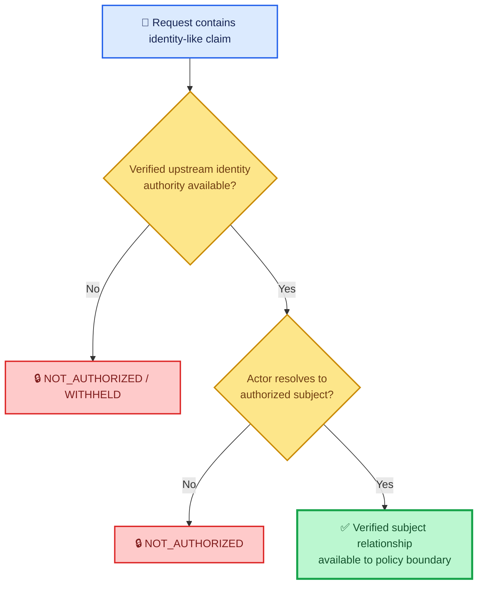

No verified identity means no private continuity query.

---

# 🛡️ Identity is not use authority

Even after identity is established, the requested use must be independently authorized.

Conceptually:

```text
VerifiedSubject(actor, subject)
AND
ScopeAllows(operation)
AND
PurposeAllows(operation)
AND
PolicyAllows(operation)
```

must be satisfied before private-state use can advance.

A valid subject relationship does not create universal access to all person-linked state.

---

# 🔒 Use authority is not disclosure authority

Disclosure is its own decision.

The system must ask:

```text
May this information be shown
to this recipient
for this purpose
at this sensitivity
in this form
at this time?
```

That is different from asking:

```text
May the system internally know or retrieve this state?
```

A private store may be permitted to hold state while a requested recipient is not permitted to receive it.

```text
retrieval authority
    ≠
disclosure authority
```

---

# 🎯 Recipient-specific authority

A private derivative must be bound to a specific allowed recipient class or equivalent recipient policy.

The architecture must not treat:

```text
authorized for recipient A
```

as:

```text
authorized for recipients A, B, C, D...
```

The historical candidate design used a narrow recipient-specific projection concept.

The public architectural rule is:

> **Private continuity crosses only to the exact recipient authorized for the exact purpose and scope.**

---

# ⏱️ Time is part of private authority

H_people authority is temporal.

The boundary can depend on:

- envelope expiration;
- replay protection;
- record expiration;
- revocation;
- review status;
- retention state;
- staging state;
- purpose validity;
- consent validity;
- current policy version.

Therefore:

```text
authorized once
    ≠
authorized forever
```

and:

```text
record once valid
    ≠
record currently eligible
```

---

# 🧾 Provenance is required before private state advances

Person-linked state needs traceable provenance.

A private-memory record or derivative should not advance merely because content exists.

Relevant provenance can include:

- source-record identity;
- ownership relationship;
- subject relationship;
- staging origin;
- review state;
- consent state;
- temporal state;
- revocation state;
- promotion lineage.

The architecture distinguishes:

```text
content present
    ≠
content provenance sufficient
```

This is especially important for staged records.

---

# 🧪 Staged private state is not promoted private memory

Staging is a candidate state.

It is not final durable admission.

```mermaid
flowchart LR
    A["📝 Candidate private record"]:::candidate
    B["📦 Staged"]:::staged
    C["🧾 Provenance review"]:::review
    D["🛡️ Consent + scope + ownership<br/>+ time + policy"]:::authority
    E["✅ Eligible for explicit promotion"]:::eligible
    F["🔒 Controlled promotion"]:::promote
    G["💾 Durable private memory"]:::memory

    X["⛔ Remain staged / reject / expire"]:::stop

    A --> B --> C --> D
    D -- "Pass" --> E --> F --> G
    D -- "Fail / incomplete" --> X

    classDef candidate fill:#dbeafe,stroke:#2563eb,color:#172554,stroke-width:2px;
    classDef staged fill:#ddd6fe,stroke:#7c3aed,color:#3b0764,stroke-width:2px;
    classDef review fill:#fde68a,stroke:#ca8a04,color:#713f12,stroke-width:2px;
    classDef authority fill:#fed7aa,stroke:#ea580c,color:#7c2d12,stroke-width:2px;
    classDef eligible fill:#a7f3d0,stroke:#059669,color:#064e3b,stroke-width:2px;
    classDef promote fill:#22c55e,stroke:#166534,color:#ffffff,stroke-width:2px;
    classDef memory fill:#14b8a6,stroke:#115e59,color:#ffffff,stroke-width:3px;
    classDef stop fill:#fecaca,stroke:#dc2626,color:#7f1d1d,stroke-width:2px;
```

The central rule is:

```text
staged
    ≠
promoted
```

No direct auto-promotion should bypass the admission policy.

---

# 🔄 Retention is separate from disclosure

A record can be:

```text
retention-authorized
```

while:

```text
disclosure-not-authorized
```

or:

```text
disclosure-authorized for one request
```

while:

```text
future retention not authorized
```

These are different rights and lifecycle decisions.

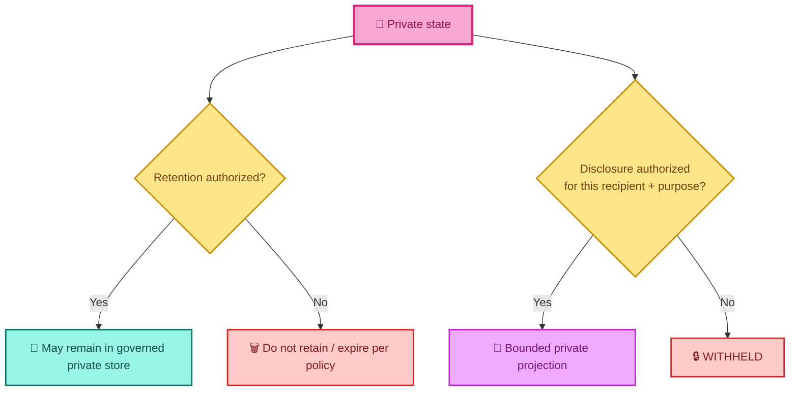

One branch does not authorize the other.

---

# ✂️ Minimization happens before private handoff

Authorization does not justify sending every available private record.

The private projection should contain only what is necessary for the permitted purpose.

```text
authorized source set
    ↓
policy filtering
    ↓
current / non-revoked / reviewed records
    ↓
purpose filtering
    ↓
recipient filtering
    ↓
size / content minimization
    ↓
bounded private projection
```

Minimization is not optional decoration.

It is part of the disclosure boundary.

---

# 💬 Authorized private projection

The historical candidate design used the concept of an **authorized private projection**.

Publicly, the architecture can be represented as:

```text
AuthorizedPrivateProjection:
    recipient = exact authorized internal recipient
    delivery = in-memory / request-bounded
    purpose = explicit permitted purpose
    expiry = bounded
    content = minimized private continuity
```

The important properties are:

- non-durable;
- recipient-specific;
- purpose-specific;
- time-bounded;
- minimized;
- created only after authority checks;
- excluded from common/shared/public paths.

The private projection is **not** a common packet field.

---

# 🧠 Private projection and Ms. Allis / model context

A private projection can support bounded conversational continuity for an authorized intelligence recipient.

That does not make private continuity:

- public evidence;
- factual authority for public claims;
- available to every reasoning service;
- durable common context;
- unrestricted training/research context;
- available to public search or RAG;
- publishable.

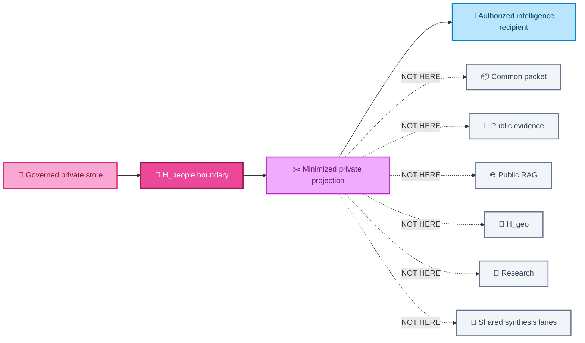

---

# 🚫 Private derivative exclusion list

Unless a separately authorized private scope explicitly establishes otherwise, the private derivative must not enter:

```text
common governance packet
governance writer payload
ordinary logs
BBB
W&V
Consciousness Bridge
LM Synthesizer
public RAG
H_geo
research lanes
public evidence
public publication
shared telemetry
durable audit content
```

Those lanes may receive privacy-safe status and reason metadata.

They do not receive the private continuity content itself.

---

# 📦 Durable packet boundary

A durable packet can be:

- replicated;
- retained;
- inspected;
- backed up;
- governed;
- audited.

That makes it the wrong place for raw private continuity.

The public-safe durable packet pattern is:

```text
schema / version identity
random packet or correlation identity
timestamp
policy / build identity
overall outcome
controlled reason codes
lane statuses
privacy-safe decision metadata
```

It should not contain:

```text
user prompt
model response
direct subject identifier
raw authorization scopes
raw consent value
raw purpose value
private continuity text
private record count
private sensitivity label
private source locator
private memory payload
```

where those values would create unnecessary durable private state.

---

# 🧾 Safe metadata vs private content

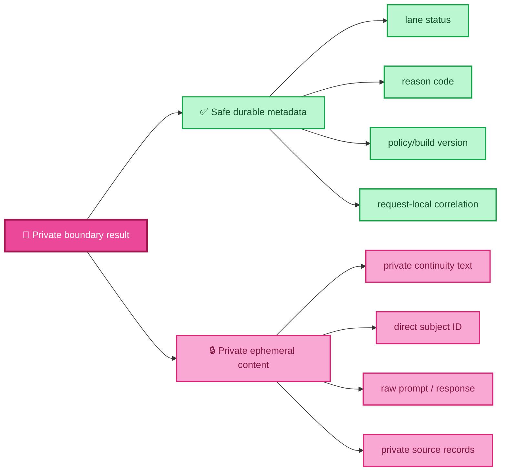

The two streams have different retention rules.

---

# 🧾 Public claims must not silently depend on private continuity

The H_people derivative is private conversational context.

It is not public evidence.

Therefore:

```text
private continuity derivative
    ≠
public evidentiary source
```

and:

```text
private memory
    ≠
public claim provenance
```

A public claim that needs evidence must rely on evidence that is itself authorized for that evidentiary use.

Private continuity cannot silently become a public citation path.

---

# 🔐 Common packet rule

The common packet should carry:

```text
h_people.status
authorization decision class where safe
privacy-safe reason code
```

It should not carry:

```text
raw private continuity
direct subject identity
private source records
private source count
private sensitivity detail
raw identity authority metadata
```

This allows system-wide governance without system-wide private disclosure.

---

# 📊 H_people lane statuses

The private lane should use the same fail-closed semantic discipline as the broader system.

| H_people status | Meaning |
|---|---|
| ✅ `complete` | Required authority exists and a bounded permitted H_people operation completed. |
| 🔒 `withheld` | Private state may exist, but disclosure is not permitted. |
| 🔒 `not_authorized` | Actor, subject relationship, purpose, scope, or recipient lacks required authority. |
| 📴 `unavailable` | Required private dependency or qualified state cannot currently be reached. |
| ⏱️ `timed_out` | Applicable private dependency exceeded its governed deadline. |
| ➖ `not_applicable` | H_people does not apply to this request. |

A higher-level response may be:

```text
complete
governed_degraded
blocked
```

while the H_people lane retains its exact private-state status.

---

# 🔒 Fail-closed examples

## Subject mismatch

```text
actor does not resolve to verified subject
    ⇒
NOT_AUTHORIZED
    ⇒
no private query
```

## Missing private-read scope

```text
required private scope absent
    ⇒
NOT_AUTHORIZED
    ⇒
no private query
```

## Unsupported purpose

```text
purpose outside policy
    ⇒
NOT_AUTHORIZED
```

## Consent does not permit disclosure

```text
consent / disclosure rule fails
    ⇒
WITHHELD
    ⇒
no private derivative
```

## Restricted record

```text
record restricted
    ⇒
WITHHELD or redacted from projection
```

## Expired or revoked record

```text
record expired / revoked
    ⇒
excluded
```

## Private dependency unavailable

```text
required H_people dependency unavailable
    ⇒
UNAVAILABLE
```

If policy explicitly permits a safe response without private continuity:

```text
overall outcome may be GOVERNED_DEGRADED
```

while:

```text
H_people remains unavailable / withheld
```

The missing private lane must not be reported as complete.

---

# 🧠 Safe degraded operation does not bypass privacy

A system can sometimes answer a request without using private continuity.

That can be a valid degraded mode.

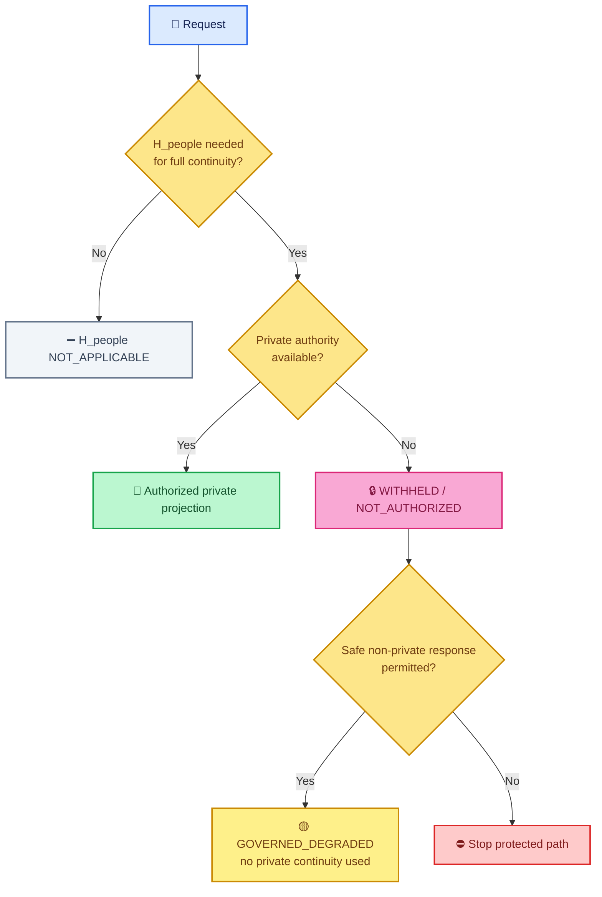

Degraded operation means:

```text
continue without the private lane
```

not:

```text
ignore the private authority failure and use the data anyway
```

---

# 🔁 Replay protection and private authority

A verified authority envelope should not be reusable indefinitely.

The architecture should account for:

- expiry;
- nonce / replay state;
- one-request scope;
- subject binding;
- recipient binding;
- purpose binding.

Therefore:

```text
previously valid private authority
    ≠
currently replayable authority
```

---

# 🔐 Subject reference propagation

When a verified internal subject relationship is required for an authorized private handoff, downstream propagation should use only the minimum internal reference necessary for that permitted purpose.

It should not:

- overwrite valid authorized identity with arbitrary anonymous identity where identity is required;
- broadcast raw subject IDs to unrelated services;
- store direct identity in the durable common packet;
- expose identity to public evidence.

This gives the system two simultaneous responsibilities:

```text
do not erase required verified identity
```

and:

```text
do not over-disclose identity
```

---

# 🧾 Privacy-safe auditing

H_people needs auditability without durable private-content leakage.

A safe audit can preserve:

```text
request-local correlation identity
H_people lane status
authorization decision class
controlled reason code
policy version
build version
timestamp
```

It should not require storing:

```text
private continuity text
raw message
raw response
direct subject ID
raw private-memory source record
private record count
sensitivity details not needed for audit
```

---

# 🪵 Logs are also a disclosure boundary

Ordinary application logs must not become an accidental private-memory store.

Unsafe patterns include logging:

- full judge/common packets containing private content;
- request bodies;
- prompt previews;
- private derivatives;
- subject identifiers;
- authorization tokens;
- private source locators.

Debugging convenience is not disclosure authority.

```text
debug capability
    ≠
permission to emit private state
```

---

# 🔬 Research is not an implied private recipient

Research can be valuable.

That does not make research a default recipient of H_people continuity.

```text
private continuity
    ↛
research
```

unless a separately authorized research scope exists for the exact data, purpose, retention, and disclosure conditions.

The default public-safe architecture keeps H_people out of ordinary research lanes.

---

# 📍 H_geo is not a private-state sink

Geographic reasoning can be part of ALLIS.

That does not mean person-linked private continuity should be copied into H_geo.

```text
person has location-linked context
    ≠
private continuity may enter H_geo
```

Where geographic context is legitimately needed, the system should use the smallest authorized derivative appropriate to that separate purpose.

The current public boundary does not treat H_geo as a general H_people recipient.

---

# 🌐 Public RAG is outside the private boundary

Public retrieval and public knowledge paths should use public/approved sources.

They should not receive the private derivative.

```text
H_people private projection
    ↛
public RAG
```

The inverse also matters:

```text
public RAG result
    ≠
private identity authority
```

The two lanes have different trust and disclosure properties.

---

# 🧪 BBB, W&V, Bridge, and Synthesizer are not automatic private recipients

A service participating in reasoning or governance does not become entitled to raw private continuity merely because it sits downstream.

The boundary rule is:

```text
service participates in pipeline
    ≠
service authorized to receive H_people derivative
```

Unless a separately governed private scope exists, these lanes receive privacy-safe H_people status/reason metadata rather than the private derivative.

---

# 🧠 Candidate intelligence does not own private memory

Even an authorized intelligence recipient receives a bounded projection.

It does not gain ownership or universal reuse rights over the source state.

```text
authorized private projection
    ≠
source private memory
```

```text
authorized for this request
    ≠
authorized for future requests
```

```text
authorized to use
    ≠
authorized to retain
```

---

# 💾 Private write / promotion is a separate transition

Retrieving private continuity and writing new durable private memory are different operations.

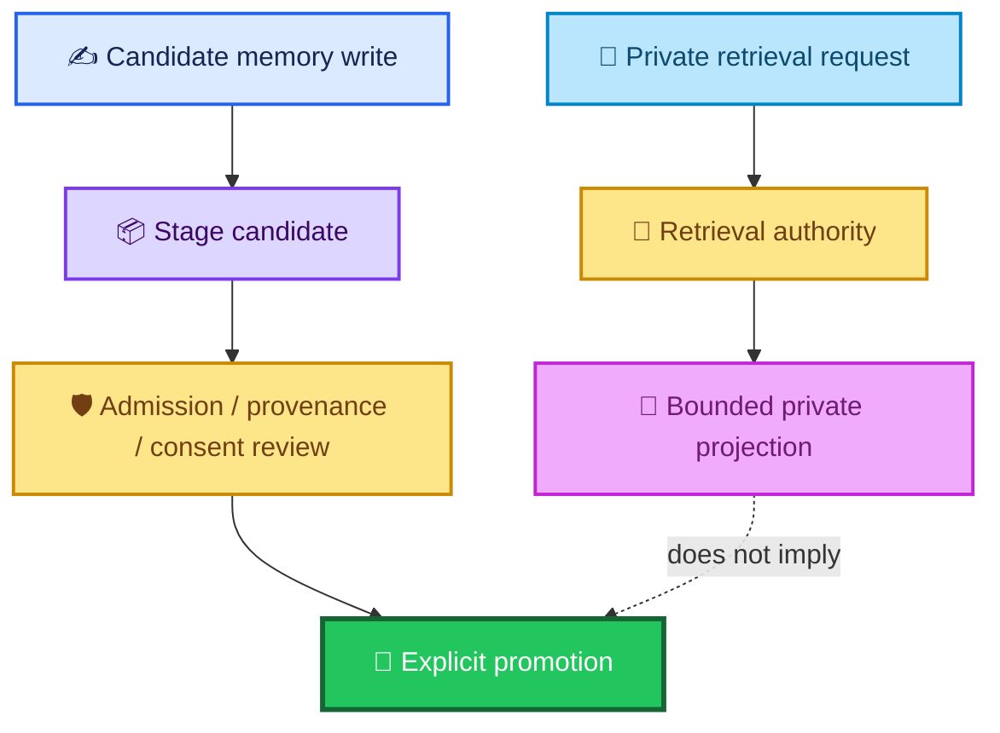

A conversation turn should not directly become durable private memory without the write-side governance path.

---

# 🚫 Raw private-store bypasses are architectural violations

The H_people architecture requires private storage access to pass through the governed adapter/policy boundary.

A direct helper or alternate code path that can retrieve or write the private store outside the boundary is unsafe until:

- all call sites are reviewed;
- the path is removed;
- or it is converted into an explicit fail-closed path.

This principle is architectural:

```text
governed boundary exists
    +
unguarded bypass exists
    ⇒
boundary not complete
```

The public document does not need to expose internal helper names or storage implementation details to preserve this rule.

---

# 🛑 Private promotion must never be inferred from staging volume

The number of staged records does not create admission authority.

```text
many staged records
    ≠
records should be promoted
```

```text
old staged records
    ≠
records should be promoted
```

```text
records technically importable
    ≠
records are policy-eligible
```

Promotion requires record-level or policy-defined admission evidence.

---

# 🔄 Private-state lifecycle

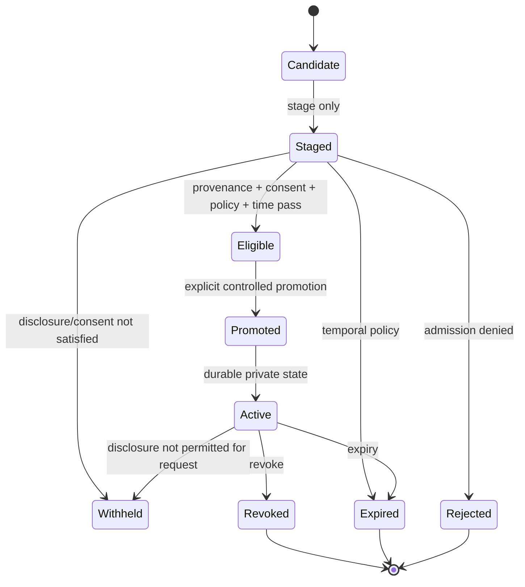

This is a conceptual lifecycle.

It does not assert that every historical implementation used these exact state names.

---

# 🔑 Historical subject-key mechanisms

Historical Gate05c evidence included a subject-key lifecycle for:

```text
challenge
enrollment
revocation
```

These mechanisms are important provenance because they show that subject-bound identity/authority concepts were implemented in a bounded historical source/runtime context.

But the public claim is deliberately limited.

```text
historical subject-key source/routes existed
    ≠
current H_people runtime authority exists
```

---

# 🕰️ Historical runtime is not current runtime authority

The historical runtime inventory resolved an important ambiguity.

At that observation:

```text
AUTH_SERVICE_CONTAINER_COUNT=2
EXACT_AUTH_RUNNING_COUNT=0
EXACT_AUTH_STOPPED_COUNT=2

AUTH_RUNTIME_INVENTORY_CLASS=
AUTH_SERVICE_EXISTS_BUT_NOT_RUNNING
```

The active posture was:

```text
ACTIVE_HPEOPLE_POSTURE=KEEP_FAIL_CLOSED_503
```

and:

```text
PRODUCTION_PROMOTION=NOT_AUTHORIZED
```

This means:

- auth had existed historically;
- the observed auth runtime was not running;
- current H_people authority was not promoted from that historical evidence;
- fail-closed posture remained the correct public/current interpretation.

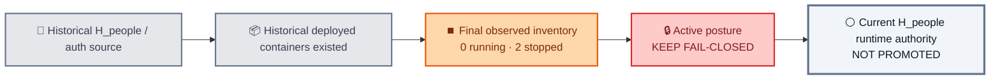

---

# ⚪ Current public claim boundary

The current public architecture supports these statements:

```text
H_people private-state boundary is architecturally defined.
```

```text
Historical bounded H_people / subject-key evidence exists.
```

```text
Private state requires independent identity/use/disclosure authority.
```

```text
Private continuity must not enter common/public lanes automatically.
```

```text
Current H_people runtime authority is not promoted from historical runtime evidence.
```

It does **not** support:

```text
current H_people runtime correspondence = established
```

or:

```text
historical auth service = current active private-state authority
```

or:

```text
private continuity is currently available to every ALLIS interaction
```

---

# 🧾 Historical source identity is provenance, not current authority

Historical evidence can include:

- sealed source;
- tags;
- route definitions;
- stopped containers;
- runtime inventories;
- old image identities;
- historical test results.

Those objects remain valuable evidence.

But:

```text
historical source identity
    ≠
current runtime identity
```

and:

```text
historical runtime identity
    ≠
current runtime authority
```

A current runtime claim would require a current qualified object and current correspondence evidence.

---

# 🔗 Correspondence requirements for a future current-runtime claim

To advance H_people from architectural/historical evidence to current runtime correspondence, a future governed workstream would need to establish the relevant edges.


The historical record cannot silently substitute for those current edges.

---

# 🧪 Future test classes

A future H_people qualification workstream should test at least these semantic classes.

## Authority tests

```text
verified owner + valid consent + valid scope
    → bounded private derivative eligible

actor differs from verified subject
    → NOT_AUTHORIZED

missing private-read scope
    → NOT_AUTHORIZED

unsupported purpose
    → NOT_AUTHORIZED

consent false / disclosure denied
    → WITHHELD
```

## Record tests

```text
restricted record
    → withheld / redacted

expired record
    → excluded

revoked record
    → excluded

staged record
    → not durable active memory

unreviewed provenance
    → no promotion
```

## Packet tests

```text
raw private message in common durable packet
    → packet construction rejected

raw private response in common durable packet
    → packet construction rejected

private derivative used as public claim evidence
    → rejected

privacy-safe lane status
    → permitted
```

## Routing tests

```text
authorized projection
    → only exact private recipient

BBB / W&V / Bridge / Synthesizer / public RAG / H_geo / research / public evidence
    → no private derivative
```

---

# 🧪 Negative tests are first-class evidence

The private-state boundary is not demonstrated only by a successful authorized retrieval.

It also requires evidence that forbidden paths do not leak private state.

Examples:

- denied identity performs no private query;
- denied consent performs no private query;
- wrong recipient receives no private derivative;
- raw private data cannot enter common packet;
- public claim cannot cite private derivative;
- restricted records are not projected;
- expired/revoked records are excluded;
- staging does not auto-promote;
- public lanes receive no private derivative.

These are containment claims.

They require their own evidence.

---

# 🔒 No raw private continuity in public evidence

The strongest public-safe statement is simple:

> **Public evidence can describe the privacy boundary without containing the private state protected by that boundary.**

That means repository evidence can safely include:

- architecture;
- status enums;
- hash identities;
- policy decisions;
- redacted test results;
- non-sensitive route classes;
- container counts;
- current/historical classification;
- pass/fail evidence.

It should not contain:

- private continuity content;
- real subject IDs;
- private source-record payloads;
- tokens;
- credentials;
- private collection data;
- private conversation contents.

---

# 🪪 Identity metadata also needs minimization

Even identity authority metadata can itself become sensitive.

A durable common record should avoid unnecessary persistence of:

- direct subject identifier;
- issuer details where not needed;
- raw scope lists;
- raw consent values;
- exact private-source references.

The system may need those values temporarily to make the authority decision.

That does not mean they should be durably copied into every downstream object.

---

# 🧾 Decision metadata can cross where content cannot

A useful pattern is:

```text
PRIVATE CONTENT
    stays inside protected path

SAFE DECISION METADATA
    may cross into common governance
```

For example:

```text
h_people.status = withheld
reason_code = disclosure_not_authorized
```

may be safe where:

```text
h_people.private_text = ...
```

is not.

This allows observability without disclosure.

---

# 🧠 H_people and ordinary conversation

The architecture allows a future authorized system to use private continuity to improve conversational continuity.

But the private data remains:

```text
non-public
recipient-specific
purpose-specific
request-bounded
non-evidentiary for public claims
```

That means an intelligence layer can use private continuity to understand context without treating the continuity itself as publicly provable fact.

---

# 🧩 H_people and evidence

Private continuity can still be evidence for a private decision where the policy explicitly permits that role.

But the evidence class must remain explicit.

For example:

```text
private continuity
    may support private contextual reasoning
```

does not imply:

```text
private continuity
    may support public factual publication
```

Evidence authority is purpose-bound too.

---

# 🧭 H_people and the outward publication plane

The private-state boundary and publication boundary are architectural duals.

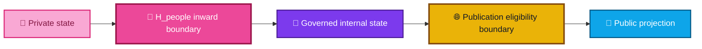

The inward boundary asks:

> **May this private state enter this governed internal use?**

The outward boundary asks:

> **May this qualified internal state leave as public projection?**

Passing the first does not imply passing the second.

---

# ⚖️ Human authority remains outside the private store

Private memory does not override the rights or authority of the person it concerns.

The architecture should preserve:

- consent;
- revocation;
- scope;
- recipient;
- purpose;
- time;
- retention policy.

A model's desire for continuity does not outrank those controls.

```text
better personalization
    ≠
greater disclosure authority
```

---

# 🧱 Public architecture vs private implementation

This repository document describes **the boundary contract**, not secret implementation topology.

Public architecture should explain:

- what must be verified;
- what may cross;
- what may not cross;
- how fail-closed behavior works;
- what historical evidence means;
- what current claims remain bounded.

Public architecture does not need to expose:

- credentials;
- secrets;
- private storage internals;
- real private records;
- subject identities;
- operational secrets;
- sensitive internal endpoints.

This keeps the architecture reviewable without turning the documentation into a privacy leak.

---

# 🔗 Relationship to fail-closed semantics

The H_people boundary uses the semantics defined in:

```text
architecture/fail-closed-semantics.md
```

Key mappings:

| H_people condition | Semantic result |
|---|---|
| Actor/subject mismatch | `NOT_AUTHORIZED` |
| Required private scope missing | `NOT_AUTHORIZED` |
| Unsupported purpose | `NOT_AUTHORIZED` |
| Disclosure/consent does not permit release | `WITHHELD` |
| Private dependency unavailable | `UNAVAILABLE` |
| Private dependency exceeds deadline | `TIMED_OUT` |
| H_people irrelevant | `NOT_APPLICABLE` |
| Safe response can continue without private context under explicit policy | overall `GOVERNED_DEGRADED` |

The boundary never converts absent authority into private access.

---

# 🔗 Relationship to authority planes

The H_people boundary is the concrete private-state form of the inward authority plane.

```text
architecture/authority-planes.md
    ↓
defines the general inward authority geometry

architecture/private-state/h-people-boundary.md
    ↓
defines the person-linked/private-state form of that boundary
```

The private-state document does not replace the general authority model.

It specializes it.

---

# 🔗 Relationship to claims

The current claims layer should preserve:

```text
PRIV-001:
private/person-linked state requires identity/use/disclosure authority
before crossing common/public boundaries
```

and:

```text
PRIV-002:
historical Gate05c evidence is not current H_people runtime authority
```

The corresponding nonclaims include:

```text
private state exists
    ≠
identity authority
```

```text
identity authority
    ≠
disclosure authority
```

```text
disclosure authority
    ≠
retention authority
```

```text
historical runtime
    ≠
current runtime authority
```

---

# 🔗 Relationship to current-system documentation

The current-system manifest can include H_people as an architectural boundary without claiming a current live H_people runtime object.

That distinction is important.

```text
architecture present in documentation
    ≠
current runtime correspondence established
```

The current manifest should not invent a runtime edge where none has been qualified.

---

# ⚪ Whole-system boundary

The H_people architectural boundary does not establish a whole-system proof.

The controlling system statements remain:

```text
PRODUCTION_MUTATION_SAFETY_THEOREM_PROVEN=NO

WHOLE_SYSTEM_SAFETY_THEOREM_PROVEN=NO

SYSTEM_PROVEN=NO
```

A strong privacy architecture is not a substitute for whole-system formal proof.

---

# 📦 Normalized architecture model

```yaml
h_people_private_state_boundary:

  purpose:
    protect_person_linked_state: true
    allow_bounded_private_continuity_when_authorized: true
    prevent_private_state_from_entering_common_or_public_lanes_automatically: true

  governing_non_equivalences:
    information_exists_equals_identity_established: false
    identity_equals_use_authority: false
    use_authority_equals_disclosure_authority: false
    disclosure_authority_equals_retention_authority: false
    retention_authority_equals_publication_authority: false
    one_recipient_authority_equals_all_recipient_authority: false

  inward_authority:
    require_independently_verified_identity: true
    trust_caller_supplied_identity_as_authority: false
    require_subject_relationship: true
    require_use_scope: true
    require_purpose_scope: true
    require_disclosure_authority: true
    require_temporal_validity: true
    require_retention_validity_where_applicable: true
    require_recipient_scope: true
    require_minimization: true

  authorized_private_projection:
    durable: false
    recipient_specific: true
    purpose_specific: true
    request_bounded: true
    time_bounded: true
    minimized: true
    public_evidence: false
    common_packet_content: false

  prohibited_default_recipients:
    common_packet: true
    governance_writer_private_content: true
    ordinary_logs: true
    bbb: true
    w_and_v: true
    bridge: true
    synthesizer: true
    public_rag: true
    h_geo: true
    research: true
    public_evidence: true
    public_publication: true

  durable_metadata:
    may_include:
      - privacy_safe_lane_status
      - controlled_reason_code
      - policy_version
      - build_version
      - request_local_correlation
      - timestamp
    must_not_require:
      - raw_private_continuity
      - raw_prompt
      - raw_response
      - direct_subject_identifier
      - raw_private_source_record
      - raw_scope_or_consent_payload

  private_memory_write:
    stage_before_promotion: true
    direct_auto_promotion: false
    promotion_requires:
      - provenance
      - ownership_or_subject_relationship
      - consent
      - scope
      - temporal_validity
      - policy_admission
      - explicit_controlled_promotion

  fail_closed:
    subject_mismatch: NOT_AUTHORIZED
    missing_private_scope: NOT_AUTHORIZED
    unsupported_purpose: NOT_AUTHORIZED
    disclosure_not_permitted: WITHHELD
    private_dependency_unavailable: UNAVAILABLE
    timeout: TIMED_OUT
    irrelevant_lane: NOT_APPLICABLE
    reduced_non_private_response:
      allowed_only_when_policy_explicitly_permits: true
      aggregate_state: GOVERNED_DEGRADED

  historical_runtime:
    bounded_subject_key_mechanisms_existed: true
    final_observed_auth_service_running_count: 0
    final_observed_auth_service_stopped_count: 2
    runtime_class: AUTH_SERVICE_EXISTS_BUT_NOT_RUNNING
    active_hpeople_posture: KEEP_FAIL_CLOSED_503
    production_promotion_authorized: false

  current_claim_boundary:
    private_state_architecture_defined: true
    historical_hpeople_evidence_exists: true
    current_hpeople_runtime_authority_promoted: false
    current_hpeople_runtime_correspondence_established: false

  system_boundary:
    production_mutation_safety_theorem_proven: false
    whole_system_safety_theorem_proven: false
    system_proven: false
```

> [!NOTE]
> This YAML block is a public-safe architectural normalization. Historical source, runtime, policy, test, and provenance records remain the evidence authority for their bounded claims. No private content is reproduced here.

---

# 📚 Related repository records

## Architecture

- [`../authority-planes.md`](../authority-planes.md) — general authority geometry
- [`../fail-closed-semantics.md`](../fail-closed-semantics.md) — standardized safe non-success states
- [`../system-boundary/ALLIS_SYSTEM_BOUNDARY.md`](../system-boundary/ALLIS_SYSTEM_BOUNDARY.md)
- [`../trust-and-authority/TRUST_AND_AUTHORITY_OVERVIEW.md`](../trust-and-authority/TRUST_AND_AUTHORITY_OVERVIEW.md)
- [`../state-models/STATE_MODEL_OVERVIEW.md`](../state-models/STATE_MODEL_OVERVIEW.md)

## Claims

- [`../../claims/CLAIM_REGISTRY.md`](../../claims/CLAIM_REGISTRY.md)
- [`../../claims/NONCLAIMS_AND_RESIDUALS.md`](../../claims/NONCLAIMS_AND_RESIDUALS.md)

## Current and acceptance

- [`../../CURRENT.md`](../../CURRENT.md)
- [`../../acceptance/current-system-manifest.md`](../../acceptance/current-system-manifest.md)
- [`../../acceptance/baseline-object-registry.md`](../../acceptance/baseline-object-registry.md)

---

# 🧾 H_people boundary summary

<div align="center">

### 👤 PRIVATE STATE
**may exist**

↓

### 🔐 IDENTITY
**must be independently established**

↓

### 🛡️ USE AUTHORITY
**must permit this purpose and operation**

↓

### 🔒 DISCLOSURE AUTHORITY
**must permit this recipient**

↓

### ⏱️ TEMPORAL / RETENTION
**must still be valid**

↓

### ✂️ MINIMIZATION
**only necessary private continuity crosses**

↓

### 💬 PRIVATE PROJECTION
**recipient-specific · in-memory · request-bounded**

<br>

# **PRIVATE STATE ≠ COMMON STATE**

# **IDENTITY ≠ DISCLOSURE AUTHORITY**

# **DISCLOSURE ≠ RETENTION AUTHORITY**

# **HISTORICAL RUNTIME ≠ CURRENT RUNTIME AUTHORITY**

# **SYSTEM_PROVEN=NO**

</div>

---

# Governing private-state principles

> **Private state does not become usable merely because it exists.**

> **Caller-provided identity claims are not identity authority.**

> **Identity authority does not create disclosure authority.**

> **Disclosure authority does not create retention authority.**

> **Authority for one recipient does not create authority for every downstream service.**

> **Private continuity should be minimized before it crosses the protected boundary.**

> **A private derivative belongs in a recipient-specific, bounded handoff—not in the common durable packet.**

> **Safe governance metadata may cross where private content may not.**

> **Staged private state does not auto-promote into durable memory.**

> **Private retrieval authority does not create private write authority.**

> **Public evidence must not silently depend on private continuity.**

> **Historical subject-key and auth evidence remains provenance; it does not silently become current H_people runtime authority.**

> **When identity or disclosure authority is absent, H_people remains fail-closed.**

> **The public architecture can explain the privacy boundary without exposing the private state it protects.**
