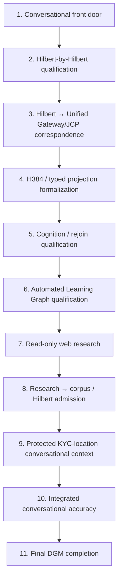

<div align="center">

# ALLIS — Post-Conversational Qualification Roadmap

### Intended engineering sequence from the current conversational front door through Hilbert qualification, cognition, governed learning, protected contextual use, integrated accuracy, and final DGM completion

<br>


<br>

**Kidd's Technical Services · ALLIS**

</div>

---

> [!IMPORTANT]
> This document makes the intended engineering order explicit.
>
> It is a **sequenced roadmap**, not a claim that the later phases are already implemented or qualified.
>
> The controlling sequence is:
>
> ```text
> conversational front door
> -> Hilbert-by-Hilbert qualification
> -> Hilbert <-> Unified Gateway/JCP correspondence
> -> H384 / typed projection formalization
> -> cognition/rejoin qualification
> -> Automated Learning Graph qualification
> -> read-only web research
> -> research -> corpus/Hilbert admission
> -> protected KYC-location conversational context
> -> integrated conversational accuracy
> -> final DGM completion
> ```
>
> Current status remains:
>
> ```text
> SYSTEM_PROVEN=NO
> FULL_DGM_COMPLETION_CLAIMED=NO
> ```

---

# 1. Purpose

The purpose of this roadmap is to prevent future ALLIS work from being pursued as disconnected feature development.

The next engineering program is intended to proceed as a dependency-aware sequence in which each later stage relies on contracts established earlier.

The roadmap therefore distinguishes:

```text
current qualified conversational path
```

from:

```text
future formalization
```

from:

```text
future runtime integration
```

from:

```text
final DGM completion
```

---

# 2. Roadmap summary

The intended sequence is:

```text
1. conversational front door

2. Hilbert-by-Hilbert qualification

3. Hilbert <-> Unified Gateway/JCP correspondence

4. H384 / typed projection formalization

5. cognition/rejoin qualification

6. Automated Learning Graph qualification

7. read-only web research

8. research -> corpus/Hilbert admission

9. protected KYC-location conversational context

10. integrated conversational accuracy

11. final DGM completion
```

The order is intentional.

---

# 3. Current starting point — conversational front door

The current ordinary ALLIS conversational path is:

```text
authenticated browser/session
-> /api/chat
-> Unified Gateway
-> cognition / JCP
-> BBB / llm20production
-> LM Synthesizer
-> response
```

This is the baseline from which post-conversational qualification proceeds.

---

# 4. Current front-door authority boundary

The conversational path does not itself create:

```text
governance authority

DGM adoption authority

publication authority

protected-state mutation authority

H_people SECRET disclosure authority
```

Preserve:

```text
ordinary conversation
    ≠
governance/adoption authority
```

---

# 5. Current formal foundation

The current roadmap begins with three already-qualified formal domains:

```text
R1 — Authorized Production Adoption

R2 — Conversational Admission

R3 — Hilbert/JCP Separation
```

R2 establishes the bounded identity/admission rules for ordinary chat.

R3 establishes the current four-field JCP and current H_geo/H_p/H_people nonadmission state.

---

# 6. Current R3 control point

The current JCP is:

```text
schema_version
request_context
approved_evidence
wv_deliberative_context
```

Current admission state:

```text
H_geo = NO

H_p = NO

H_people = NO
```

This is the formal starting boundary for the next Hilbert work.

---

# 7. Phase 1 — conversational front-door closeout

Before moving deeper into future architecture, preserve the current front-door record as an independently documented baseline.

Required evidence:

```text
server-derived authenticated identity

/api/chat

Unified Gateway

current cognition/JCP boundary

BBB / llm20production

LM Synthesizer

response
```

The front door is the current operational reference path.

---

# 8. Phase 1 success condition

Phase 1 is sufficient when the repository can state:

```text
ORDINARY_CONVERSATIONAL_PATH_DOCUMENTED=YES

SERVER_DERIVED_IDENTITY_BOUNDARY_DOCUMENTED=YES

GOVERNANCE_AUTHORITY_SEPARATED_FROM_CHAT=YES

CURRENT_JCP_BOUNDARY_DOCUMENTED=YES
```

without claiming whole-system proof.

---

# 9. Phase 2 — Hilbert-by-Hilbert qualification

The next major engineering phase is not "connect all Hilberts."

It is:

```text
qualify each named H_* object independently
```

For every projection inspect:

```text
intended semantics

exact source

runtime

producer

consumer

dimensional / embedding contract

persistence

retrieval

authority

Gateway relationship

JCP relationship

conversational use

accuracy

correspondence

residuals
```

---

# 10. Phase 2 target projections

Initial review set:

```text
H_App

H_civic

H_commons

H_geo

H_p

H_people

H_state

H_t

H_time
```

These objects do not currently have equal maturity.

Do not flatten them into one "Hilbert layer."

---

# 11. Phase 2 key rule

Use:

```text
governed typed projection / view / architectural state domain
```

as the default classification.

Do not use:

```text
linear subspace
```

until closure/subspace properties are proved.

---

# 12. Phase 2 success condition

Each reviewed H_* object should leave with one explicit disposition, for example:

```text
QUALIFIED_STATIC_ONLY

QUALIFIED_SEPARATE_PATH

QUALIFIED_FOR_RETRIEVAL

QUALIFIED_FOR_CONVERSATIONAL_PROJECTION

ELIGIBLE_FOR_JCP_SUCCESSOR_DESIGN

HISTORICAL_ONLY

RESEARCH_ONLY

UNRESOLVED
```

---

# 13. Phase 3 — Hilbert <-> Unified Gateway/JCP correspondence

After projection semantics are clear, establish exact correspondence between each qualified projection and the current Gateway/JCP architecture.

This phase asks:

```text
Does Gateway know this projection?

Does Gateway retrieve it?

Does Gateway receive it as metadata?

Does Gateway make it reasoning input?

Does JCP admit it?

If not admitted, how is nonadmission enforced?
```

---

# 14. Phase 3 must preserve R3

No projection may be treated as live JCP state merely because it is qualified elsewhere.

Preserve:

```text
qualified projection
    ≠
JCP-admitted projection
```

Current R3 state remains controlling until a successor qualification changes it.

---

# 15. Phase 3 explicit source targets

The correspondence work should bind to exact source objects such as:

```text
Unified Gateway payload schemas

process_unified

build_judge_context_v2

current JCP field literals

projection-specific retrieval/admission functions
```

The exact source must control the claim.

---

# 16. Phase 3 success condition

For each projection:

```text
GATEWAY_RELATIONSHIP=KNOWN

JCP_RELATIONSHIP=KNOWN

MODEL_TO_SOURCE=PASS_OR_EXPLICITLY_NONE

SOURCE_TO_RUNTIME=PASS_OR_NOT_CURRENT

NONADMISSION_OR_ADMISSION=EXPLICIT
```

---

# 17. Phase 4 — H384 formalization

Once the Hilbert inventory is bounded, formalize the shared 384-dimensional mathematical carrier.

Target:

```text
H384 := Fin 384 -> Real
```

The planned theorem family should cover:

```text
standard vector-space structure

standard inner product

induced norm

L2 metric

finite-dimensional completeness

normalization predicates
```

---

# 18. Phase 4 does not prove named subspaces

Preserve:

```text
H384 is a valid common carrier
    ≠
H_geo is a subspace

H384 is a valid common carrier
    ≠
H_people is a subspace
```

Named H_* closure remains separate.

---

# 19. Phase 4 success condition

Target closeout:

```text
H384_CARRIER_FORMALIZED=YES

H384_INNER_PRODUCT_FORMALIZED=YES

H384_NORM_FORMALIZED=YES

H384_L2_METRIC_FORMALIZED=YES

H384_FINITE_DIMENSIONAL=YES

H384_COMPLETE=YES

H384_NORMALIZATION_PREDICATE_DEFINED=YES
```

with zero proof holes and no unexpected theorem-level axiom dependencies.

---

# 20. Phase 5 — typed projection interfaces

After the common carrier is clear, formalize the typed projection/view interface layer.

The interface should encode:

```text
identity

semantics

carrier relation

source

runtime

producer

consumer

privacy

authority

persistence

retrieval

Gateway relation

JCP relation

conversational use

accuracy

correspondence

residuals
```

---

# 21. Why typed projections precede deeper integration

Typed interfaces provide a common vocabulary without requiring premature algebraic claims.

They allow:

```text
H_geo
H_p
H_people
H_commons
H_App
...
```

to share an interface while retaining different:

```text
privacy

authority

persistence

retrieval

conversational semantics
```

---

# 22. Phase 5 success condition

The repository should be able to describe every qualified H_* object through the same high-level contract while preserving projection-specific semantics.

---

# 23. Phase 6 — cognition/rejoin qualification

The next major runtime/formal target is the cognition composition path:

```text
prefrontal result
+
iContainers result
+
psychology result
    ↓
cognition stage
    ↓
cognition evaluate
    ↓
cognition emit
    ↓
llm_packet
    ↓
Gateway/JCP
    ↓
ensemble
    ↓
LM Synthesizer
```

---

# 24. Cognition classification

This work is:

```text
WIRING_REWIRING_ONLY
```

not:

```text
new parallel cognition system
```

and not:

```text
new sandbox requirement
```

---

# 25. Cognition theorem target

The next Lean family should formalize:

```text
typed producer contributions

stage validity

evaluation validity

emit validity

bounded llm_packet

excluded raw state

authority noncreation

current JCP boundary preservation

downstream ensemble/synthesizer rejoin
```

---

# 26. Phase 6 success condition

A cognition closeout should establish:

```text
COGNITION_THEOREM_FAMILY_COMPLETE=YES
```

only after:

```text
formal model
model-to-source
source-to-runtime
bounded live observation
```

are all separately addressed.

---

# 27. Phase 7 — Automated Learning Graph qualification

Once current conversation and cognition are formally coherent, qualify the Automated Learning Graph.

The intended process is:

```text
detect informational insufficiency

localize missing information

bound research need

retrieve candidate information

preserve provenance

evaluate candidate

route accepted information

admit only under authority
```

---

# 28. Phase 7 core separation

Preserve:

```text
research result
    ≠
qualified knowledge
```

and:

```text
candidate evidence
    ≠
persistent state
```

The Automated Learning Graph should formalize these distinctions.

---

# 29. Phase 7 success condition

The architecture should have a qualified state machine for:

```text
NEED_DETECTION

GAP_LOCALIZATION

RESEARCH_SCOPE

RETRIEVAL

CANDIDATE_CAPTURE

PROVENANCE_VALIDATION

EVALUATION

DOMAIN_CLASSIFICATION

AUTHORITY_CHECK

ADMISSION
```

---

# 30. Phase 8 — read-only web research

After the learning graph is defined, qualify the external research mechanism.

Target behavior:

```text
approximately every five minutes
    ↓
evaluate pending bounded research needs
```

not:

```text
unbounded continuous crawling
```

---

# 31. Read-only invariant

External research must preserve:

```text
EXTERNAL_SIDE_WRITES=NO
```

The mechanism should be capable of:

```text
search

fetch

read API

read document
```

without mutating external systems.

---

# 32. Conversational fallback

When internal corpus knowledge is insufficient:

```text
corpus
    ↓
insufficiency
    ↓
bounded read-only research
    ↓
candidate
    ↓
current-response eligibility
```

A candidate may support the current response without being persisted.

---

# 33. Phase 8 provenance requirements

Every result should preserve:

```text
source

URL / identifier

publication/update date

retrieval date

query

research-need ID

temporal scope

geographic scope

transformation lineage
```

---

# 34. Phase 8 success condition

Only after implementation/runtime qualification should:

```text
AUTOMATED_LEARNING_WEB_RESEARCH_QUALIFIED=YES
```

be considered.

Until then it remains:

```text
NO
```

---

# 35. Phase 9 — research -> corpus/Hilbert admission

After research retrieval is qualified, separately qualify persistent admission.

The controlling path is:

```text
web result
    ↓
research candidate
    ↓
evaluation
    ↓
admitted corpus state
    ↓
projection-specific qualification
    ↓
qualified Hilbert state
```

---

# 36. Phase 9 core distinction

Preserve exactly:

```text
web result
!= trusted fact
!= admitted corpus state
!= qualified Hilbert state
```

This is a structural trust boundary.

---

# 37. Corpus admission requirements

Before persistent corpus admission:

```text
source identity

provenance

temporal scope

geographic scope

privacy

schema

duplicate/conflict handling

authority

admission receipt
```

must be explicit.

---

# 38. Hilbert admission requirements

Corpus state may only become qualified H_* state through that projection's own:

```text
semantic contract

producer

carrier/embedding contract

authority

persistence/retrieval rules

formal correspondence
```

---

# 39. Phase 9 success condition

Only after a bounded ingestion implementation is qualified should:

```text
RESEARCH_TO_CORPUS_INGESTION_QUALIFIED=YES
```

be considered.

No global multi-Hilbert ingestion claim should be made from one corpus closeout.

---

# 40. Phase 10 — protected KYC-location conversational context

After ordinary conversational, projection, and ingestion boundaries are mature, qualify protected location context.

The protected source remains:

```text
KYC / H_people SECRET
```

---

# 41. Location mechanism

The intended bounded path is:

```text
precise authoritative SECRET location
    ↓
authorized minimum-necessary projection
    ↓
derived conversational context
    ↓
response reasoning
```

Preserve:

```text
use
    ≠
disclosure
```

---

# 42. Public-state boundary

Also preserve:

```text
location used in response
    ≠
location made PUBLIC
```

and:

```text
location used
    ≠
location persisted
```

unless separately authorized.

---

# 43. Phase 10 success condition

Only after exact source, subject correspondence, precision reduction, use/disclosure separation, persistence, audit, and runtime behavior are qualified should:

```text
KYC_LOCATION_CONTEXT_USE_QUALIFIED=YES
```

be considered.

---

# 44. Phase 11 — integrated conversational accuracy

After the major contextual and learning pathways are qualified, evaluate conversational accuracy as an integrated property.

This phase should not reduce accuracy to a single model score.

It should measure the correctness of the assembled system path.

---

# 45. Integrated accuracy dimensions

The accuracy phase should examine:

```text
identity correctness

context correctness

JCP correctness

retrieval relevance

source provenance

temporal correctness

geographic correctness

cognition composition correctness

ensemble reasoning correctness

synthesis fidelity

privacy/disclosure correctness

authority correctness

response factuality
```

---

# 46. Accuracy must be path-aware

A response may be linguistically good and still be architecturally inaccurate if:

```text
wrong identity used

stale source used

wrong geography used

protected state disclosed

research claim treated as trusted fact

wrong projection admitted

unsupported JCP context inserted
```

Therefore integrated conversational accuracy must include architecture correctness.

---

# 47. Accuracy and source correspondence

The accuracy phase should distinguish:

```text
model output quality
```

from:

```text
source/context correctness
```

and from:

```text
authority correctness
```

All three matter.

---

# 48. Accuracy and temporal scope

For time-sensitive claims:

```text
correct source
    +
wrong date
    =
incorrect answer
```

Temporal scope must be part of evaluation.

---

# 49. Accuracy and geographic scope

Likewise:

```text
correct rule
    +
wrong jurisdiction
    =
incorrect answer
```

Geographic scope belongs in the accuracy model.

---

# 50. Accuracy and protected state

A response can be factually correct but governance-incorrect if it reveals protected data.

Therefore accuracy must include:

```text
correct non-disclosure
```

where required.

---

# 51. Accuracy qualification outputs

The integrated accuracy phase should produce:

```text
test corpus

scenario families

expected outputs

expected withheld outputs

identity-isolation tests

temporal tests

geographic tests

retrieval tests

cognition tests

research fallback tests

protected-context tests

failure-mode tests
```

---

# 52. Phase 11 success condition

Integrated accuracy should be called qualified only when:

```text
factual correctness

context correctness

authority correctness

privacy correctness

source correspondence

runtime correspondence
```

are all tested at the required scope.

---

# 53. Phase 12 — final DGM completion

Final DGM completion comes after the conversational, Hilbert, cognition, learning, research, protected-state, and accuracy tracks are sufficiently qualified.

It is not the first step.

It is the capstone.

---

# 54. Why DGM comes last in this roadmap

The existing DGM Step-12 / Lean R1 work formally qualified the authorized-adoption model.

But the broader historical project intent also includes:

```text
Hilberts completed

Unified Gateway connected

accuracy demonstrated
```

before claiming broader DGM completion.

Therefore final DGM completion should consume the matured outputs of the prior phases.

---

# 55. Current DGM boundaries

Preserve current status:

```text
FULL_DGM_COMPLETION_CLAIMED=NO

PRODUCTION_MUTATION_SAFETY_THEOREM_PROVEN=NO

WHOLE_SYSTEM_SAFETY_THEOREM_PROVEN=NO

SYSTEM_PROVEN=NO
```

The existing R1/Step-12 theorem family remains valid in its bounded domain.

---

# 56. Final DGM completion target

The eventual final DGM phase should reconcile:

```text
authorized adoption

current conversational path

Hilbert qualification

Gateway/JCP correspondence

cognition rejoin

automated learning

research ingestion

protected private-state use

integrated accuracy
```

without collapsing those domains into one undifferentiated theorem.

---

# 57. Final DGM completion should not rewrite historical evidence

Preserve:

```text
R1 result remains R1

R2 result remains R2

R3 result remains R3
```

A final DGM closeout should reference them as predecessor evidence.

It should not rewrite their historical claims.

---

# 58. Roadmap dependency graph



---

# 59. Dependency rule

The roadmap is sequenced because later phases rely on earlier semantics.

Examples:

```text
cannot qualify H_* conversational use
before H_* semantics are known
```

```text
cannot qualify research-to-Hilbert admission
before Hilbert admission contracts exist
```

```text
cannot evaluate integrated accuracy
before the integrated path exists
```

```text
cannot claim final DGM completion
before predecessor domains are closed
```

---

# 60. Parallel work boundary

Some engineering may proceed in parallel where dependencies permit.

For example:

```text
H384 carrier formalization
```

may advance while:

```text
H_geo exact source inventory
```

is being completed.

But the final closeouts must still respect dependency order.

Parallel investigation is not the same as skipping prerequisites.

---

# 61. Evidence rule

Every phase should preserve:

```text
scope

source identity

runtime identity where applicable

formal result

correspondence

live observation

residuals

nonclaims
```

No roadmap phase should close on architecture prose alone.

---

# 62. Formal proof rule

Where Lean is used:

```text
clean build

zero proof holes

#print axioms review

unexpected theorem-level axiom dependencies = qualification failure
```

remain the standard.

Compilation alone is not enough.

---

# 63. Correspondence rule

For implementation-bearing theorems:

```text
formal theorem
    ↓
model-to-source
    ↓
source-to-runtime
    ↓
live observation
```

must remain separate layers.

---

# 64. Authority rule

Across the entire roadmap:

```text
available
    ≠
verified

verified
    ≠
authorized use

qualified
    ≠
admitted

admitted
    ≠
published

used
    ≠
disclosed

candidate
    ≠
trusted knowledge
```

These distinctions are permanent architecture constraints.

---

# 65. Publication remains separate

The roadmap does not merge conversational response with publication.

Preserve:

```text
response
    ≠
governed publication
```

Publication remains a separate authority path.

---

# 66. H_people remains special

H_people remains tiered:

```text
SECRET

PRIVATE

PUBLIC
```

Later conversational context work must not flatten those tiers.

---

# 67. Automated learning remains bounded

Automated learning should not be described as autonomous self-expansion.

The intended form is:

```text
bounded insufficiency
    ↓
bounded research
    ↓
candidate evidence
    ↓
governed admission
```

---

# 68. H384 remains mathematical substrate

The planned H384 carrier provides common geometry.

It does not itself create:

```text
semantic truth

authority

privacy classification

JCP admission

corpus admission
```

Those remain separate.

---

# 69. Cognition remains reasoning, not authority

Cognition may:

```text
stage

evaluate

emit
```

It does not thereby gain:

```text
adoption authority

publication authority

SECRET disclosure authority

persistent learning authority
```

---

# 70. Integrated accuracy remains bounded

Even after an accuracy phase closes:

```text
tested conversational accuracy
    ≠
whole-system theorem
```

unless a separate whole-system proof is actually established.

---

# 71. Final roadmap flags

```text
CONVERSATIONAL_FRONTDOOR_DOCUMENTED=YES

LEAN_R2_CONVERSATIONAL_ADMISSION_QUALIFIED=YES

LEAN_R3_HILBERT_JCP_SEPARATION_QUALIFIED=YES

HILBERT_BY_HILBERT_QUALIFICATION_COMPLETE=NO

HILBERT_GATEWAY_JCP_CORRESPONDENCE_COMPLETE=NO

H384_FORMALIZATION_COMPLETE=NO

TYPED_PROJECTION_FORMALIZATION_COMPLETE=NO

COGNITION_THEOREM_FAMILY_COMPLETE=NO

AUTOMATED_LEARNING_GRAPH_QUALIFIED=NO

AUTOMATED_LEARNING_WEB_RESEARCH_QUALIFIED=NO

RESEARCH_TO_CORPUS_INGESTION_QUALIFIED=NO

KYC_LOCATION_CONTEXT_USE_QUALIFIED=NO

INTEGRATED_CONVERSATIONAL_ACCURACY_QUALIFIED=NO

FULL_DGM_COMPLETION_CLAIMED=NO

SYSTEM_PROVEN=NO
```

---

# 72. Normalized roadmap record

```yaml
post_conversational_qualification_roadmap:
  status: ACTIVE_ROADMAP

  sequence:
    - conversational_frontdoor
    - hilbert_by_hilbert_qualification
    - hilbert_gateway_jcp_correspondence
    - h384_and_typed_projection_formalization
    - cognition_rejoin_qualification
    - automated_learning_graph_qualification
    - read_only_web_research
    - research_to_corpus_hilbert_admission
    - protected_kyc_location_conversational_context
    - integrated_conversational_accuracy
    - final_dgm_completion

  current:
    conversational_frontdoor_documented: true
    lean_r2_conversational_admission_qualified: true
    lean_r3_hilbert_jcp_separation_qualified: true

  pending:
    hilbert_by_hilbert_qualification_complete: false
    hilbert_gateway_jcp_correspondence_complete: false
    h384_formalization_complete: false
    typed_projection_formalization_complete: false
    cognition_theorem_family_complete: false
    automated_learning_graph_qualified: false
    automated_learning_web_research_qualified: false
    research_to_corpus_ingestion_qualified: false
    kyc_location_context_use_qualified: false
    integrated_conversational_accuracy_qualified: false
    full_dgm_completion_claimed: false

  permanent_rules:
    conversation_equals_governance_authority: false
    qualified_projection_equals_jcp_admission: false
    web_result_equals_trusted_fact: false
    admitted_corpus_equals_qualified_hilbert_state: false
    use_equals_disclosure: false
    system_proven: false
```

---

# 73. Final roadmap statement

```text
POST_CONVERSATIONAL_QUALIFICATION_ROADMAP=DEFINED

SEQUENCE:

conversational_front_door
-> hilbert_by_hilbert_qualification
-> hilbert_unified_gateway_jcp_correspondence
-> H384_typed_projection_formalization
-> cognition_rejoin_qualification
-> automated_learning_graph_qualification
-> read_only_web_research
-> research_to_corpus_hilbert_admission
-> protected_kyc_location_conversational_context
-> integrated_conversational_accuracy
-> final_DGM_completion

CURRENT_FRONTDOOR=DOCUMENTED

HILBERT_QUALIFICATION_COMPLETE=NO

H384_FORMALIZATION_COMPLETE=NO

COGNITION_THEOREM_FAMILY_COMPLETE=NO

AUTOMATED_LEARNING_WEB_RESEARCH_QUALIFIED=NO

RESEARCH_TO_CORPUS_INGESTION_QUALIFIED=NO

KYC_LOCATION_CONTEXT_USE_QUALIFIED=NO

INTEGRATED_CONVERSATIONAL_ACCURACY_QUALIFIED=NO

FULL_DGM_COMPLETION_CLAIMED=NO

SYSTEM_PROVEN=NO
```

---

# Governing principles

> **The conversational front door is the operational starting point, not the end of qualification.**

> **Hilbert objects are qualified one at a time before deeper integration.**

> **Projection qualification and Gateway/JCP admission are separate.**

> **H384 formalizes shared mathematical geometry; typed projections preserve domain semantics without premature subspace claims.**

> **Cognition rejoin qualification follows the actual prefrontal + iContainers + psychology → stage/evaluate/emit → llm_packet path.**

> **Automated learning begins with informational insufficiency, not unrestricted autonomous exploration.**

> **Read-only research and persistent ingestion are separate trust boundaries.**

> **Web result != trusted fact != admitted corpus state != qualified Hilbert state.**

> **Protected KYC location may support minimum-necessary contextual use without becoming disclosed or PUBLIC.**

> **Integrated conversational accuracy must evaluate facts, context, provenance, authority, privacy, time, and geography together.**

> **Final DGM completion is a capstone that consumes predecessor qualification; it does not replace those predecessor records.**

> **SYSTEM_PROVEN remains NO.**
