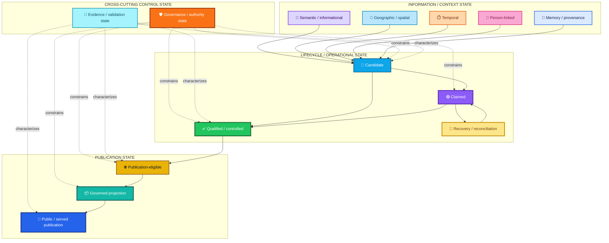
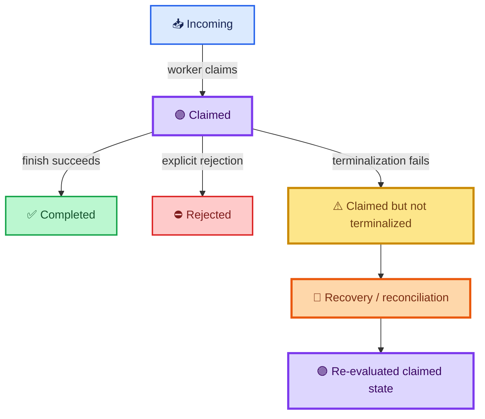
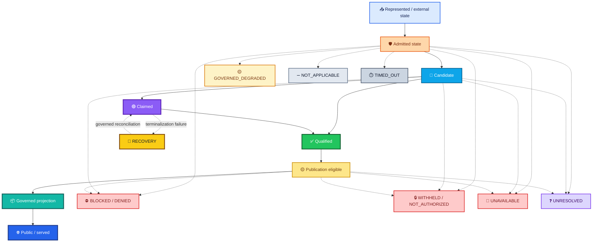

<div align="center">

# ALLIS — State Model Overview

### How semantic, spatial, temporal, private, evidentiary, lifecycle, authority, recovery, and publication state remain distinct without turning state into permission

<br>


<br>

**Kidd’s Technical Services · ALLIS**

</div>

---

> [!IMPORTANT]
> ALLIS represents many kinds of state.
>
> **State does not become authority merely because it exists.**
>
> A record can exist without being verified. A candidate can exist without being authorized. A claimed item can exist without being terminal. Qualified state can exist without being publishable. Publication-eligible state can exist without being published. Public state can exist without creating write authority.

---

# 👀 The state model in one view



The diagram separates three questions:

```text
What state exists?

What lifecycle state is it in?

What authority, evidence, or publication condition applies to it?
```

Those are different dimensions.

---

# 🎯 Purpose

This document defines the high-level state architecture of **ALLIS — the Artificial Learning and Location Intelligence System**.

It explains:

- semantic and informational state;
- geographic and spatial state;
- temporal state;
- person-linked state;
- memory and provenance state;
- governance and authority state;
- evidence and validation state;
- candidate state;
- claimed state;
- recovery state;
- qualified / controlled state;
- publication-eligibility state;
- governed projection state;
- public publication state;
- fail-closed semantic states;
- state-transition rules;
- the boundary between state and authority.

This document defines architecture.

It does not claim that every architectural state has identical implementation, runtime, formal-verification, or correspondence maturity.

---

# 1. Document status

```text
Document role:
Architecture

Primary scope:
State classes, lifecycle state, protected transition state,
publication state, recovery state, fail-closed state

Formal status:
Architectural definitions unless separately formalized

Runtime status:
Not inferred from architecture alone

Whole-system proof:
SYSTEM_PROVEN=NO
```

The controlling rule is:

> **A state model can define a state before every implementation path for that state has reached the same validation level.**

---

# 2. State in ALLIS

ALLIS treats state as more than stored data.

State can describe:

```text
what something means

where it applies

when it applies

whom it concerns

where it came from

what evidence supports it

what lifecycle condition it is in

what authority constrains its use

whether it is qualified

whether it is eligible for publication

whether it has been projected or publicly served

whether recovery is required
```

No single field answers all of those questions.

---

# 3. Two layers of state

The state model is easier to understand if it separates:

```text
CONTENT / CONTEXT STATE
```

from:

```text
CONTROL / LIFECYCLE STATE
```

Content/context state describes the information itself.

Control/lifecycle state describes:

- how that information is being used;
- where it is in a process;
- what evidence state applies;
- whether it is qualified;
- whether it is publication-eligible;
- whether recovery is required;
- whether a protected transition may occur.

---

# 4. The original six architectural domains remain

The six original high-level domains remain useful:

```text
1. semantic and informational state
2. geographic and spatial state
3. temporal state
4. person-linked state
5. memory and provenance state
6. governance and authority state
```

The extension does not discard them.

It adds lifecycle, publication, evidence, and recovery state around them.

---

# 5. Why lifecycle state is separate

A semantic object can simultaneously be:

```text
geographically scoped

temporally current

person-linked

provenance-bearing

candidate

claimed

unresolved

not publication-eligible
```

These are not competing labels.

They describe different dimensions of the same governed object.

---

# 6. State is multidimensional

A useful conceptual representation is:

```text
StateObject =
    content state
  + spatial state
  + temporal state
  + subject state
  + provenance state
  + evidence state
  + lifecycle state
  + authority constraints
  + publication state
```

This is an architectural decomposition.

It does not require one physical object or schema to contain every field.

---

# 7. State does not equal authority

The central invariant is:

```text
state
    ≠
authority
```

More specifically:

```text
state exists
    ≠
state may be used
```

```text
state is verified
    ≠
state may be disclosed
```

```text
candidate exists
    ≠
candidate may be applied
```

```text
claim is qualified
    ≠
claim may be published
```

```text
publication exists
    ≠
public caller may mutate internal state
```

---

# 8. Authority is itself state—but a special kind

Authority can be represented as state.

That does not mean every state object is authority.

```text
AuthorityState ⊂ GovernedState
```

but:

```text
GovernedState
    ≠
AuthorityState
```

Authority has:

- provenance;
- scope;
- target;
- operation;
- time;
- lifecycle;
- revocation;
- replay state.

It is cross-cutting control state.

---

# 9. Semantic and informational state

Semantic and informational state represents:

- meaning;
- concepts;
- entities;
- relationships;
- retrieved context;
- inferred relationships;
- analytical outputs;
- interpretations.

It supports questions such as:

```text
What does this mean?

What is relevant?

What concepts are related?

What interpretation is supported?
```

---

# 10. Semantic state boundary

Semantic relevance does not establish:

- truth;
- authority;
- geographic correctness;
- temporal currency;
- publication eligibility;
- private disclosure authority.

```text
relevant
    ≠
verified
```

---

# 11. Geographic and spatial state

Geographic and spatial state represents:

- coordinates;
- places;
- mapped features;
- topology;
- route relationships;
- distance;
- proximity;
- visibility relationships;
- place-linked observations.

It answers:

> **Where does this state apply?**

---

# 12. Geographic state boundary

A spatial relationship does not establish:

```text
ownership

jurisdiction

institutional authority

permission

factual correctness
```

Location provides context.

It does not create authority.

---

# 13. Temporal state

Temporal state represents:

- timestamps;
- duration;
- recency;
- sequence;
- effective period;
- expiration;
- scheduling;
- retention period;
- observation window;
- lifecycle time.

It answers:

> **When is this state valid, applicable, current, expired, or scheduled?**

---

# 14. Temporal state affects other state classes

Time can affect:

```text
evidence currency

authority validity

consent

retention

publication currency

correspondence

replay validity

recovery urgency
```

Therefore time is not merely metadata.

---

# 15. Temporal state does not prove execution

A schedule can exist without executing.

An expiry can be declared without being enforced.

A future transition can be planned without occurring.

```text
declared temporal rule
    ≠
observed temporal behavior
```

---

# 16. Person-linked state

Person-linked state represents information associated with an identifiable person or subject.

It can include:

- identity relationships;
- subject-specific memory;
- permissions;
- consent conditions;
- disclosure restrictions;
- recipient scope;
- private provenance;
- sensitivity.

This state is protected.

---

# 17. Person-linked state is not ordinary shared context

```text
person-linked
    ≠
common
```

```text
retrievable
    ≠
disclosable
```

```text
retained
    ≠
reusable for all purposes
```

```text
available to one recipient
    ≠
available to all recipients
```

---

# 18. Person-linked state can have its own lifecycle

A private record can be:

```text
staged
current
revoked
expired
retained
withheld
authorized for one purpose
not authorized for another purpose
```

These states coexist with the record’s semantic content.

---

# 19. Memory and provenance state

Memory and provenance state records retained information together with context about:

- source;
- acquisition time;
- transformation history;
- subject relationship;
- evidence lineage;
- authority context;
- confidence;
- validation;
- lifecycle.

Memory is not an unrestricted reusable pool.

---

# 20. Retained does not mean promoted

```text
retained
    ≠
qualified
```

```text
remembered
    ≠
verified
```

```text
stored
    ≠
authorized for disclosure
```

```text
historical
    ≠
current
```

---

# 21. Provenance state

Provenance answers:

```text
Where did this come from?

What transformed it?

Which object did it derive from?

Which evidence supports it?

What scope traveled with it?

What authority context applied?
```

Provenance can support trust.

It does not itself become authority.

---

# 22. Evidence and validation state

Evidence state describes what level of support applies to a claim, object, relationship, or runtime observation.

ALLIS uses the hierarchy:

```text
Implemented
    ↓
Observed
    ↓
Demonstrated
    ↓
Formally Specified
    ↓
Proven
    ↓
Machine-Checked
    ↓
Correspondence-Verified
```

This hierarchy describes **claims**.

It is not an authority hierarchy.

---

# 23. Evidence state and content state are different

A content object can remain unchanged while its evidence state changes.

For example:

```text
same claim
    ↓
new observation
    ↓
stronger evidence state
```

Likewise:

```text
same publication
    ↓
new correspondence observation
    ↓
updated correspondence evidence
```

---

# 24. Evidence state does not create permission

```text
machine-checked
    ≠
authorized to execute
```

```text
correspondence-verified
    ≠
authorized to publish
```

```text
strong evidence
    ≠
operation authority
```

Evidence controls what may be claimed.

Authority controls what may be done.

---

# 25. Governance and authority state

Governance and authority state represents whether a protected transition is permitted within a defined scope.

It can describe:

- eligibility;
- authorization;
- recipient scope;
- operation scope;
- target;
- expected prestate;
- time;
- revocation;
- replay state;
- publication authority.

Authority state can itself have provenance.

---

# 26. Authority state is cross-cutting

Authority state constrains transitions involving:

```text
semantic state
geographic state
temporal state
person-linked state
memory state
candidate state
qualified state
publication state
```

It is not another content store.

---

# 27. Candidate state

Candidate state is generated or proposed state that has not yet crossed every required protected transition.

Examples include:

- candidate claim;
- candidate response;
- candidate memory promotion;
- candidate state change;
- candidate policy;
- candidate publication;
- candidate external action.

---

# 28. Candidate is not qualified

```text
candidate
    ≠
qualified
```

A candidate can be:

- useful;
- plausible;
- evaluated;
- high scoring;
- syntactically valid;

without being accepted into qualified state.

---

# 29. Candidate is not authorized

```text
candidate
    ≠
authority
```

The candidate cannot become its own permission object.

---

# 30. Candidate state can be evaluated

Candidate state can accumulate:

- evaluation results;
- evidence;
- scores;
- test results;
- provenance;
- target identity;
- expected prestate.

Those properties can support authorization.

They do not replace it.

---

# 31. Claimed state

`CLAIMED` is a lifecycle state indicating that work has been taken by a worker or process for further handling.

It is not necessarily terminal.

```text
incoming
    → claimed
```

does not imply:

```text
claimed
    → completed
```

---

# 32. Claimed is neither completed nor rejected

A claimed item can later become:

```text
Completed
```

or:

```text
Rejected
```

or remain:

```text
Claimed
```

if terminalization fails.

This third case must remain explicit.

---

# 33. Claimed-but-not-terminalized recovery state

The current bounded Step-12 formal work disproves unconditional terminal totality.

Therefore the architecture preserves:

```text
Claimed
    ↓
terminalization fails
    ↓
Claimed remains nonterminal
    ↓
Recovery / reconciliation required
```

---

# 34. Recovery-state diagram



---

# 35. Recovery is a state domain, not an error message

Recovery state can carry:

- claimed object identity;
- authority identity;
- reservation state;
- receipt state;
- expected poststate;
- failure reason;
- retry eligibility;
- reconciliation status.

Recovery is a governed lifecycle condition.

---

# 36. Recovery does not invent terminality

The system must not convert:

```text
CLAIMED
```

into:

```text
COMPLETED
```

simply because a terminal state is easier for downstream handling.

---

# 37. Recovery can require authority

A recovery action can itself be protected.

Examples:

```text
release reservation

retry application

mark rejected

restore prestate

reconcile receipt

reissue authority
```

The existence of a recovery need does not authorize the recovery operation.

---

# 38. Completed state

`COMPLETED` indicates that the defined transition reached its accepted terminal condition.

It does not mean:

```text
whole system complete
```

or:

```text
all related claims proven
```

Completion is scoped.

---

# 39. Rejected state

`REJECTED` indicates a terminal negative disposition for the applicable lifecycle.

It can result from:

- policy rejection;
- candidate rejection;
- validation failure;
- explicit governance decision.

Rejected should not be confused with unavailable or unresolved.

---

# 40. Qualified / controlled state

Qualified state is state admitted into a controlled accepted role under a defined scope.

Examples can include:

- qualified source;
- qualified proof object;
- qualified production source;
- qualified publication state;
- accepted evidence state.

---

# 41. Qualified does not mean universal

```text
qualified for role A
    ≠
qualified for every role
```

Qualification is role-scoped.

---

# 42. Qualified does not mean publication-eligible

This is a key publication-state distinction.

```text
qualified internally
    ≠
eligible for public projection
```

A qualified object can remain internal.

---

# 43. Publication eligibility state

Publication eligibility describes whether qualified state is permitted to cross the outward publication boundary.

It can depend on:

- privacy;
- disclosure;
- minimization;
- public claim status;
- provenance;
- evidence maturity;
- scope;
- publication policy;
- route policy.

---

# 44. Publication eligibility is state, not authority by itself

The system can record:

```text
publication_eligible = true
```

as a state condition.

That does not mean the field itself creates authority.

The governing rule remains:

```text
eligibility state
    ≠
authority source
```

Publication authority must still have a valid governing basis.

---

# 45. Publication-ineligible state

Qualified state can be explicitly:

```text
NOT_PUBLICATION_ELIGIBLE
```

because:

- private content is present;
- provenance is insufficient;
- claim state is unresolved;
- disclosure is not permitted;
- minimization is incomplete;
- public route is not authorized.

This is not a failure of qualification.

It is a separate outward-state decision.

---

# 46. Publication eligibility and privacy

Private state can be:

```text
valid
qualified
use-authorized internally
```

while:

```text
not publication-eligible
```

This is expected.

---

# 47. Publication eligibility and evidence maturity

A claim can be public-safe while still requiring its evidence maturity to remain visible.

For example:

```text
Observed
```

should not become:

```text
Proven
```

during publication projection.

Eligibility includes preserving the correct claim state.

---

# 48. Publication projection state

A governed publication projection is a selected outward representation of qualified internal state.

It can contain:

- permitted public fields;
- public-safe provenance;
- evidence status;
- uncertainty;
- publication identity;
- integrity identity.

It should exclude protected fields not authorized for public release.

---

# 49. Projection is not raw internal state

```text
governed projection
    ≠
raw state dump
```

Projection is selective.

---

# 50. Projection does not erase provenance

A public projection should carry enough public-safe provenance to support its claims.

Internal-only provenance can remain protected.

---

# 51. Projection does not erase uncertainty

If internal state is:

```text
UNRESOLVED
```

the projection must not silently present:

```text
COMPLETE
```

If evidence is:

```text
OBSERVED
```

the projection must not silently present:

```text
PROVEN
```

---

# 52. Publication identity state

A governed publication should have a stable identity distinct from:

- source commit;
- runtime identity;
- frontend build;
- internal state object.

This allows the publication itself to be audited.

---

# 53. Publication body state

A publication body can have its own integrity identity.

Conceptually:

```text
publication object
    +
publication-body hash
    +
payload hash where separately defined
```

These identity surfaces can support correspondence.

---

# 54. Served publication state

A publication object can exist without being publicly reachable.

Therefore:

```text
publication exists
    ≠
publication served
```

Served publication state includes:

- route;
- listener;
- network availability;
- response status;
- body identity;
- point-in-time observation.

---

# 55. Public publication state is temporal

```text
publicly reachable at τ
    ≠
publicly reachable forever
```

Public availability is point-in-time state.

---

# 56. GUI consumption state

A publication can be publicly reachable without being consumed by the intended GUI.

Therefore:

```text
public HTTP state
    ≠
GUI consumption state
```

GUI consumption is a separate correspondence/lifecycle observation.

---

# 57. Publication state model

```mermaid
flowchart LR
    Q["✅ Qualified internal state"]:::qualified
    E["🟡 Publication eligibility"]:::eligible
    M["✂️ Minimized public projection"]:::projection
    I["#️⃣ Immutable publication identity"]:::identity
    S["🔒 Served read-only publication"]:::served
    H["🌐 Public HTTP body"]:::http
    G["🔎 GUI consumption"]:::gui

    Q --> E --> M --> I --> S --> H --> G

    classDef qualified fill:#22c55e,stroke:#166534,color:#ffffff,stroke-width:3px;
    classDef eligible fill:#fde68a,stroke:#ca8a04,color:#713f12,stroke-width:2px;
    classDef projection fill:#14b8a6,stroke:#115e59,color:#ffffff,stroke-width:3px;
    classDef identity fill:#a5f3fc,stroke:#0891b2,color:#164e63,stroke-width:2px;
    classDef served fill:#ddd6fe,stroke:#7c3aed,color:#3b0764,stroke-width:2px;
    classDef http fill:#bae6fd,stroke:#0284c7,color:#0c4a6e,stroke-width:2px;
    classDef gui fill:#f0abfc,stroke:#c026d3,color:#701a75,stroke-width:2px;
```



Each edge requires its own evidence and, where protected, its own authority.

---

# 58. Publication state and write state are different

```text
public publication
    ≠
write authority
```

A public read plane does not become a public write plane.

---

# 59. Publication state can outlive current runtime state

A sealed publication identity can remain historically valid even if:

- the route changes;
- the service stops;
- the frontend changes;
- the publication is superseded.

This separates:

```text
durable publication identity
```

from:

```text
current serving state
```

---

# 60. Superseded publication state

A newer publication can supersede an older publication for the current public role.

The older publication remains an immutable historical object.

```text
superseded
    ≠
deleted from history
```

---

# 61. Fail-closed state is not one state

Fail-closed behavior preserves the reason a protected transition did not proceed.

The canonical semantic classes are:

```text
BLOCKED / DENIED

WITHHELD / NOT_AUTHORIZED

UNAVAILABLE

GOVERNED_DEGRADED

UNRESOLVED

NOT_APPLICABLE
```

An additional operational condition is:

```text
TIMED_OUT
```

And two important lifecycle conditions are:

```text
PASS_EMPTY

CLAIMED
```

---

# 62. Why these states must remain distinct

These states answer different questions.

```text
Was the action prohibited?

Was protected state withheld?

Was a dependency missing?

Was a reduced mode explicitly allowed?

Was the result not yet adjudicated?

Did the lane not apply?

Did an applicable lane exceed its deadline?

Was there simply no work?

Was work claimed but not terminalized?
```

One generic `FAILED` state cannot answer those questions.

---

# 63. `BLOCKED / DENIED`

Core meaning:

> **A controlling rule made an affirmative negative decision.**

Examples:

- policy says no;
- operation prohibited;
- target forbidden;
- publication disallowed.

This is a known negative governance decision.

---

# 64. `BLOCKED / DENIED` is not unresolved

```text
DENIED
    ≠
UNRESOLVED
```

Denied means the rule was sufficiently known to make a negative decision.

Unresolved means the stronger decision could not yet be made.

---

# 65. `WITHHELD / NOT_AUTHORIZED`

Core meaning:

> **Protected state may exist, but the requested actor, purpose, recipient, or operation lacks authority to receive or use it.**

Examples:

- private subject relationship not established;
- missing disclosure scope;
- unsupported purpose;
- recipient not permitted.

---

# 66. Withheld does not mean no data

```text
WITHHELD
    ≠
NO_DATA
```

A privacy-preserving external response can avoid confirming existence.

Internally, the semantic state should remain precise.

---

# 67. `UNAVAILABLE`

Core meaning:

> **A required dependency, qualified object, or result cannot currently be obtained.**

Examples:

- service unavailable;
- required evidence source unreachable;
- required qualified object missing at runtime.

---

# 68. Unavailable does not mean denied

```text
UNAVAILABLE
    ≠
DENIED
```

The system did not necessarily make a policy judgment.

The dependency was not available.

---

# 69. `GOVERNED_DEGRADED`

Core meaning:

> **A separately authorized reduced mode may continue while preserving the missing condition explicitly.**

A degraded state requires policy support.

It is not:

```text
control failed, so continue anyway
```

---

# 70. Degraded preserves missing state

Example:

```text
private continuity lane = UNAVAILABLE

safe non-private response = allowed

overall result = GOVERNED_DEGRADED
```

The private lane does not become complete.

---

# 71. `UNRESOLVED`

Core meaning:

> **Required evidence, authority, or adjudication is incomplete.**

This can apply to:

- claim state;
- authority state;
- correspondence state;
- provenance state;
- publication eligibility.

---

# 72. Unresolved is an honest state

```text
UNRESOLVED
    ≠
ERROR
```

It is a legitimate epistemic state.

---

# 73. `NOT_APPLICABLE`

Core meaning:

> **The lane, rule, or transition does not apply to this request.**

Examples:

- no private state requested;
- publication rule irrelevant to internal computation;
- location lane irrelevant to non-spatial request.

---

# 74. Not applicable is not success

```text
NOT_APPLICABLE
    ≠
PASS
```

A control that did not apply was not exercised successfully.

---

# 75. `TIMED_OUT`

Core meaning:

> **The lane applied and was attempted, but did not complete within its governed deadline.**

A timeout can lead to:

- stop;
- unavailable;
- governed degraded;

depending on policy.

---

# 76. Timeout is not denial

```text
TIMED_OUT
    ≠
DENIED
```

No policy denial should be inferred from elapsed time alone.

---

# 77. `PASS_EMPTY`

Core meaning:

> **The governed container is valid and empty.**

Examples:

- no authorized work in spool;
- no pending item to claim.

```text
PASS_EMPTY
    ≠
UNAVAILABLE
```

and:

```text
PASS_EMPTY
    ≠
ERROR
```

---

# 78. Empty state can be healthy

No work is sometimes the correct state.

A healthy empty queue should not be turned into failure merely because nothing happened.

---

# 79. `CLAIMED`

Core meaning:

> **Work has been claimed, but terminal completion is not guaranteed.**

This is a nonterminal lifecycle state.

---

# 80. Claimed is not a failure class

`CLAIMED` is not equivalent to:

```text
FAILED
```

It can be a normal intermediate state.

It becomes a recovery concern only when terminalization does not complete.

---

# 81. Fail-closed semantic table

| State | What it means | What it does not mean |
|---|---|---|
| ⛔ `BLOCKED / DENIED` | Rule affirmatively prohibits transition | Dependency missing |
| 🔒 `WITHHELD / NOT_AUTHORIZED` | Protected use/disclosure lacks authority | Data does not exist |
| 📴 `UNAVAILABLE` | Required dependency/result cannot be obtained | Policy denied request |
| 🟡 `GOVERNED_DEGRADED` | Reduced mode separately permitted | Missing lane succeeded |
| ❓ `UNRESOLVED` | Evidence/authority/adjudication incomplete | Negative decision |
| ➖ `NOT_APPLICABLE` | Lane/rule does not apply | Control passed |
| ⏱️ `TIMED_OUT` | Applicable attempt exceeded deadline | Policy denied |
| 📭 `PASS_EMPTY` | Healthy empty governed state | Failure |
| 🟣 `CLAIMED` | Nonterminal claimed work | Completed |

---

# 82. Semantic laundering is prohibited

The state model must not convert:

```text
UNAVAILABLE
    → COMPLETE
```

```text
WITHHELD
    → NO_DATA
```

```text
NOT_AUTHORIZED
    → UNAVAILABLE
```

```text
TIMED_OUT
    → DENIED
```

```text
NOT_APPLICABLE
    → PASS
```

```text
CLAIMED
    → COMPLETED
```

simply because a downstream system wants fewer states.

---

# 83. Aggregate state and lane state are separate

A multi-lane computation can have:

```text
overall result = GOVERNED_DEGRADED
```

while one lane is:

```text
UNAVAILABLE
```

and another is:

```text
COMPLETE
```

Do not overwrite lane state with aggregate state.

---

# 84. Aggregate success does not erase bounded failure

A successful overall response can coexist with:

- withheld private lane;
- unavailable external lane;
- not-applicable spatial lane;
- unresolved claim lane.

The aggregate should not erase the component evidence.

---

# 85. State transition vs authority decision

A state transition is what changes.

An authority decision is one condition controlling whether the transition may occur.

```text
transition
    ≠
authority
```

For example:

```text
candidate
    → qualified
```

is a state transition.

The authorization object governing that transition is separate.

---

# 86. State transition model

```mermaid
flowchart LR
    E["📥 External / represented state"]:::external
    A["🛡️ Admitted state"]:::admitted
    C["🧪 Candidate"]:::candidate
    CL["🟣 Claimed"]:::claimed
    Q["✅ Qualified"]:::qualified
    PE["🟡 Publication eligible"]:::eligible
    P["📦 Projected"]:::projected
    PUB["🌐 Public"]:::public

    E -->|"inward admission"| A
    A -->|"governed computation"| C
    C -->|"claim / work reservation"| CL
    C -->|"qualified without worker claim where applicable"| Q
    CL -->|"terminal success"| Q
    Q -->|"publication eligibility"| PE
    PE -->|"governed projection"| P
    P -->|"served / routed"| PUB

    CL -. "terminalization failure" .-> R["🔧 Recovery"]:::recovery
    R -. "reconcile" .-> CL

    classDef external fill:#dbeafe,stroke:#2563eb,color:#172554,stroke-width:2px;
    classDef admitted fill:#fed7aa,stroke:#ea580c,color:#7c2d12,stroke-width:2px;
    classDef candidate fill:#0ea5e9,stroke:#075985,color:#ffffff,stroke-width:2px;
    classDef claimed fill:#8b5cf6,stroke:#5b21b6,color:#ffffff,stroke-width:3px;
    classDef qualified fill:#22c55e,stroke:#166534,color:#ffffff,stroke-width:3px;
    classDef eligible fill:#fde68a,stroke:#ca8a04,color:#713f12,stroke-width:2px;
    classDef projected fill:#14b8a6,stroke:#115e59,color:#ffffff,stroke-width:3px;
    classDef public fill:#2563eb,stroke:#1e3a8a,color:#ffffff,stroke-width:3px;
    classDef recovery fill:#facc15,stroke:#854d0e,color:#111827,stroke-width:3px;
```



The arrows are protected transitions where applicable.

The nodes are states.

---

# 87. Admission state

State that crosses the inward boundary can become admitted for a specific purpose and scope.

```text
admitted
    ≠
universally trusted
```

It can remain:

- user-provided;
- externally attributed;
- private;
- unresolved;
- purpose-limited.

---

# 88. Admitted state preserves epistemic status

Example:

```text
user says X
```

can be admitted as:

```text
user-provided statement X
```

without becoming:

```text
verified fact X
```

---

# 89. Transition conditions remain explicit

A protected transition can depend on:

- provenance;
- identity;
- authorization;
- evidence;
- policy;
- recipient;
- temporal validity;
- target;
- prestate;
- replay state;
- publication eligibility.

The next state must not be inferred solely because the previous state exists.

---

# 90. Promotion state

Promotion is a transition from a lower-governance state into a higher-governance state.

Examples:

```text
candidate memory
    → retained memory
```

```text
candidate claim
    → qualified claim
```

```text
qualified claim
    → publication-eligible claim
```

Promotion requires whatever authority applies to that transition.

---

# 91. Staged state

A staged object exists but is not yet fully promoted.

Examples can include:

- candidate private record;
- candidate evidence;
- candidate state update;
- candidate publication.

```text
staged
    ≠
qualified
```

---

# 92. Staging volume does not create promotion authority

A large number of staged records does not make promotion more authorized.

```text
more candidates
    ≠
more authority
```

---

# 93. Revoked state

A previously permitted object can become revoked.

Revocation can affect:

- authority;
- private-state use;
- retention;
- publication eligibility;
- access;
- operation.

Historical existence remains.

Current permission changes.

---

# 94. Expired state

An object can remain valid as historical evidence while no longer being current for operational use.

```text
historically valid
    ≠
currently valid
```

---

# 95. Superseded state

A successor object can supersede an earlier object for a specific role.

The predecessor remains historically identifiable.

Supersession is role-specific.

---

# 96. Historical state

Historical state is state preserved for provenance, evidence, or research.

Historical does not necessarily mean:

```text
invalid
```

It means:

```text
not the controlling current object for this role
```

where supersession has occurred.

---

# 97. Current state

Current state is not simply the newest state.

Current applicability depends on:

```text
role
scope
authority
evidence
correspondence
supersession
time
```

---

# 98. State age and state authority are different

A newer record can be less authoritative than an older sealed record.

An older qualified object can remain authoritative for its historical proof domain.

Chronology alone does not establish current authority.

---

# 99. Point-in-time correspondence state

A correspondence relation can be:

```text
PASS_AT_τ
```

without being:

```text
PASS_FOREVER
```

Correspondence state is temporal.

---

# 100. Durable identity and transient runtime state

Separate:

```text
durable identity:
source commit
publication ID
publication hash
evidence seal
```

from:

```text
runtime state:
service active
listener present
DNS resolves
GUI reachable
runtime source matches
```

Both matter.

They answer different questions.

---

# 101. State correspondence

Correspondence can connect:

```text
formal model
    ↔
source
```

```text
source
    ↔
runtime
```

```text
publication
    ↔
public HTTP body
```

```text
public publication
    ↔
GUI consumption
```

Correspondence is a relationship state.

It is not object identity.

---

# 102. Correspondence state does not create authority

```text
source corresponds to runtime
    ≠
runtime authorized to mutate
```

```text
publication corresponds to GUI
    ≠
GUI authorized to write
```

---

# 103. Evidence state does not erase lifecycle state

A claimed object can be:

```text
machine-observed
```

and still remain:

```text
CLAIMED
```

Better evidence about the object does not terminalize it.

---

# 104. Authority state does not erase evidence state

An authorized operation can still involve:

```text
unresolved broader claim
```

Authority answers whether the transition may occur.

Evidence answers what can be asserted.

---

# 105. Publication state does not erase source state

A publication is not the source object.

```text
publication ID
    ≠
source commit
```

```text
publication body
    ≠
complete internal state
```

---

# 106. GUI state does not erase publication state

The GUI is a consumer.

```text
GUI build
    ≠
publication identity
```

The two should remain separately identifiable.

---

# 107. Read state and write state are separate

A state being readable does not mean it is writable.

```text
READABLE
    ≠
WRITABLE
```

The read plane and write plane have separate authority.

---

# 108. Public state does not become common internal state

Publication is an outward projection.

It does not mean every internal component should use the public projection as its new internal source of truth.

---

# 109. Private state does not become public state through aggregation

Aggregating private data does not automatically make it public-safe.

Publication eligibility still requires the applicable privacy and minimization decision.

---

# 110. Computed state

Computed state is produced by governed computation.

It can be:

- derived;
- inferred;
- synthesized;
- scored;
- classified.

Computed does not mean verified.

---

# 111. Inferred state

Inferred state should preserve that it was inferred.

```text
inferred
    ≠
observed
```

---

# 112. Observed state

Observed state is tied to an observation event.

It should carry:

- observation source;
- time;
- conditions;
- scope.

Observation does not imply permanence.

---

# 113. Demonstrated state

A demonstrated result has stronger bounded evidence than simple observation.

It still remains bounded by the demonstration conditions.

---

# 114. Proven state

A proven proposition belongs to a formal domain.

It does not automatically make every runtime object:

```text
proven
```

Formal proof and runtime state are distinct.

---

# 115. Machine-checked state

Machine checking can establish a stronger validation level for a formal claim.

It still requires source/runtime correspondence before being carried to implementation/runtime claims where that relationship matters.

---

# 116. Correspondence-verified state

Correspondence-verified is the strongest level in the current repository validation hierarchy.

It means the required representation relationship was established for the bounded claim.

It does not mean:

```text
all future states correspond automatically
```

---

# 117. Disproven state

A proposition can be:

```text
MACHINE_CHECKED_DISPROVEN
```

This is different from:

```text
UNRESOLVED
```

Disproven is an adjudicated negative result.

---

# 118. Disproven is not failed evidence

A counterexample is evidence.

The architecture must preserve it.

---

# 119. State and claim status

A claim can have state such as:

```text
candidate
supported
observed
demonstrated
proven
disproven
unresolved
historical-only
bounded-domain
point-in-time
```

These states describe the claim.

They do not create operational authority.

---

# 120. State and workstream status

A workstream can be:

```text
open
closed
green_complete
closed_with_residuals
```

Workstream state is separate from:

- source state;
- theorem state;
- runtime state;
- publication state.

---

# 121. Closed does not mean whole system complete

```text
workstream closed
    ≠
SYSTEM_PROVEN
```

A closed workstream preserves its bounded scope.

---

# 122. Residual state

A residual is an explicitly preserved boundary after adjudication.

Examples include:

```text
NOT_OBSERVED
DISPROVEN
NOT_PROVEN
HISTORICAL_ONLY
BOUNDED_DOMAIN
POINT_IN_TIME_BINDING
EXTERNAL_TO_RUNTIME_MODEL
```

Residual state is not equivalent to unresolved.

---

# 123. Residuals can be fully adjudicated

```text
unadjudicated = 0
```

can coexist with:

```text
residuals > 0
```

because residuals can themselves be adjudicated boundary states.

---

# 124. `NOT_OBSERVED`

This means the expected bounded event was not observed in the relevant evidence set.

It does not automatically mean impossible.

---

# 125. `NOT_PROVEN`

This means the stronger theorem was not established.

It does not automatically mean false.

---

# 126. `HISTORICAL_ONLY`

This means the result remains valid within a historical domain but is not promoted as current authority.

---

# 127. `BOUNDED_DOMAIN`

This means the result applies only to the explicitly modeled or qualified scope.

---

# 128. `POINT_IN_TIME_BINDING`

This means correspondence was established at a bounded observation point.

It is not a perpetual guarantee.

---

# 129. `EXTERNAL_TO_RUNTIME_MODEL`

This means a required authority or function exists outside the modeled runtime boundary.

External does not mean absent.

---

# 130. Residual vs fail-closed outcome

Residuals describe research/validation boundaries.

Fail-closed states describe runtime or transition semantics.

Do not collapse:

```text
NOT_PROVEN
```

into:

```text
DENIED
```

or:

```text
UNRESOLVED
```

without evidence.

---

# 131. State aggregation

ALLIS can aggregate multiple state dimensions.

A result can be:

```text
semantic = relevant
spatial = applicable
temporal = current
private = not applicable
evidence = observed
lifecycle = candidate
authority = not yet established
publication = not eligible
```

No one field replaces the others.

---

# 132. State vector example

```yaml
state_example:
  semantic:
    relevance: high

  geographic:
    scope: applicable

  temporal:
    status: current

  person_linked:
    status: NOT_APPLICABLE

  provenance:
    source_known: true

  evidence:
    level: OBSERVED

  lifecycle:
    state: CANDIDATE

  authority:
    operation_authorized: false

  publication:
    eligible: false
    projected: false
```

This is a conceptual example, not a required runtime schema.

---

# 133. Private-state vector example

```yaml
private_state_example:
  person_linked:
    exists: true
    subject_relationship: VERIFIED

  use:
    purpose_authorized: true

  disclosure:
    recipient_authorized: true
    minimized: true

  retention:
    authorized: false

  lifecycle:
    delivery: REQUEST_LOCAL

  publication:
    eligible: false
```

This shows that:

```text
private use authorized
    ≠
retention authorized
    ≠
publication authorized
```

---

# 134. Claimed-recovery vector example

```yaml
claimed_recovery_example:
  lifecycle:
    state: CLAIMED
    terminal: false

  application:
    performed: unknown_or_partial

  receipt:
    complete: false

  recovery:
    required: true

  authority:
    retry_authorized: false
```

The need for recovery does not create retry authority.

---

# 135. Publication-state vector example

```yaml
publication_state_example:
  internal:
    qualified: true

  eligibility:
    publication_eligible: true

  projection:
    minimized: true
    provenance_preserved: true
    uncertainty_preserved: true

  publication:
    immutable_identity_present: true

  serving:
    route_authorized: true

  public_observation:
    reachable_at_observation: true

  write:
    public_mutation_authority: false
```

This makes the read/write boundary explicit.

---

# 136. Fail-closed vector example

```yaml
fail_closed_example:
  lane:
    applicable: true

  dependency:
    available: false

  semantic_state:
    result: UNAVAILABLE

  degraded_mode:
    separately_authorized: true

  aggregate:
    result: GOVERNED_DEGRADED
```

The lane remains unavailable.

The aggregate can still continue in a bounded degraded mode.

---

# 137. State transition preconditions

A transition can require:

```text
source state condition

evidence condition

authority condition

policy condition

temporal condition

recipient condition

target condition

prestate condition
```

These are transition preconditions.

They are not the next state itself.

---

# 138. State transition postconditions

A protected transition can produce:

```text
new state

new lifecycle state

new authority lifecycle state

new receipt

new evidence

new publication identity

new recovery obligation
```

Postconditions should remain explicit.

---

# 139. State-transition receipt

A receipt can preserve:

- transition identity;
- authority identity;
- prestate;
- requested operation;
- result;
- poststate;
- time;
- evidence.

A receipt is evidence of transition.

It is not transition authority.

---

# 140. State transition atomicity is claim-specific

This architecture does not assume every transition is globally atomic.

Where atomicity matters, it must be:

- specified;
- implemented;
- measured;
- proved;
- correspondence-verified;

as required by the claim.

---

# 141. State model and fail-closed behavior

Fail-closed semantics sit inside the state model because safe non-success must remain representable.

A system that can represent only:

```text
success
failure
```

cannot preserve the distinctions ALLIS requires.

---

# 142. State model and privacy

Privacy depends on state separation.

Private content, safe decision metadata, and public projection must be independently representable.

```text
private content
    ≠
safe metadata
    ≠
public projection
```

---

# 143. State model and trust

Trust and authority are represented as cross-cutting state.

But they remain subject to:

- provenance;
- time;
- scope;
- revocation;
- replay;
- operation.

---

# 144. State model and publication

Publication requires its own state chain:

```text
qualified
    ↓
eligible
    ↓
projected
    ↓
identified
    ↓
served
    ↓
publicly observed
    ↓
consumed by GUI
```

Each state answers a different question.

---

# 145. State model and correspondence

Correspondence itself can be modeled as state:

```text
NOT_ESTABLISHED
ESTABLISHED
PASS_AT_OBSERVATION
FAILED
SUPERSEDED
REQUIRES_REVALIDATION
```

Exact status vocabulary belongs to the correspondence layer.

The architectural principle is that correspondence is explicit.

---

# 146. State model and supersession

A successor object can change:

```text
current role
```

without changing:

```text
historical identity
```

Therefore both must remain representable.

---

# 147. State model and immutability

Some state objects are intended to remain immutable after issuance or sealing.

Examples:

- qualified source identity;
- evidence seal;
- publication identity;
- historical baseline.

Immutability is an object property.

It does not mean the entire system stops changing.

---

# 148. Mutable state

Other state is expected to change:

- runtime health;
- network continuity;
- claim lifecycle;
- authority availability;
- replay state;
- recovery state.

The model must distinguish durable identity from mutable observation.

---

# 149. State model and deployment

A deployment implements some subset of state classes and transitions.

A deployment does not redefine the ALLIS state architecture.

---

# 150. State model and Ms. Allis

Ms. Allis can consume governed state and produce candidate state.

She does not independently determine all state transitions.

Conceptually:

```text
authorized context
    ↓
Ms. Allis reasoning
    ↓
candidate explanation / candidate action
    ↓
ALLIS transition governance
```

---

# 151. Ms. Allis does not own authority state

Ms. Allis can reason about authority.

She does not become the authority source merely because she can describe or request a transition.

---

# 152. Ms. Allis does not own publication state

A generated explanation can remain:

```text
candidate public content
```

until the outward publication transition is satisfied.

---

# 153. Ms. Allis and private state

An authorized private projection can be made available to an intelligence-facing service.

That private projection does not become:

- common durable state;
- public evidence;
- publication state;
- general research state.

---

# 154. Current Step-12 example

Step 12 provides a bounded example of lifecycle and authority state.

Relevant state distinctions include:

```text
incoming
authorized-spool state
claimed
completed
rejected
claimed-but-not-terminalized
receipt state
authority freshness / one-use state
```

The architecture generalizes these state distinctions.

---

# 155. Step-12 terminalization boundary

The current record preserves:

```text
P12C-09
=
MACHINE_CHECKED_DISPROVEN
```

for unconditional terminal totality.

Therefore:

```text
Claimed
    ≠
guaranteed Completed or Rejected
```

The state model must include recovery.

---

# 156. Step-12 positive-path boundary

A machine-checked positive path does not become:

```text
live positive production application observed
```

unless that observation exists.

Evidence state remains separate from formal state.

---

# 157. Current Step-17 example

Step 17 provides a bounded example of publication-state progression.

```text
qualified state
    ↓
publication eligibility
    ↓
immutable publication
    ↓
isolated read service
    ↓
authorized route
    ↓
public HTTP publication
    ↓
GUI consumption
```

The architecture generalizes this progression.

---

# 158. Step-17 publication identity

The current bounded publication reference includes:

```text
publication ID:
allis-publication-step6-retention-v2
```

with separately recorded publication integrity and frontend identities in the evidence layer.

This is an example of publication-state identity.

---

# 159. Step-17 network state

Final network continuity reached:

```text
GREEN
```

at the bounded final observation.

That does not mean:

```text
network state = GREEN forever
```

Network state remains temporal.

---

# 160. Current H_people boundary

The architecture includes person-linked state and private admission/disclosure states.

Current public documentation should not infer current runtime-authoritative H_people status from historical implementation evidence alone.

State-model completeness is not runtime correspondence.

---

# 161. Architecture does not equal implementation

```text
state class defined
    ≠
state class implemented everywhere
```

```text
transition defined
    ≠
transition observed
```

```text
recovery state defined
    ≠
recovery path correspondence-verified
```

---

# 162. Implementation does not equal proof

A runtime can implement a state machine without the corresponding theorem being proven.

---

# 163. Proof does not equal runtime state

A theorem about a formal state machine does not establish that the runtime currently occupies the matching state.

Correspondence is required where the claim depends on it.

---

# 164. Public documentation and state identity

Public documentation can safely expose:

- state-class definitions;
- public-safe object identities;
- evidence maturity;
- publication identity;
- fail-closed semantic meanings;
- bounded lifecycle states.

It need not expose sensitive private content or live authorization artifacts.

---

# 165. State naming rule

State names should describe the semantic condition, not just implementation mechanics.

Prefer:

```text
WITHHELD
UNAVAILABLE
CLAIMED
PUBLICATION_ELIGIBLE
QUALIFIED
```

over ambiguous names such as:

```text
ERROR_2
STATE_7
FAILED_GENERIC
```

---

# 166. State names should not hide governance

A state called:

```text
READY
```

is ambiguous if it actually means:

```text
ready for evaluation
```

rather than:

```text
authorized to execute
```

Use names that preserve the governance boundary.

---

# 167. State names should not hide evidence maturity

A field called:

```text
verified=true
```

can be ambiguous if “verified” could mean:

- syntax checked;
- source identified;
- proof passed;
- runtime corresponds;
- signature valid.

Use the most precise supported state.

---

# 168. State transitions should be explicit

Prefer:

```text
candidate
    → publication_eligible
```

only when the actual transition exists.

Do not infer:

```text
qualified
    → public
```

without the intermediate publication boundary.

---

# 169. State transition failures should be explicit

A failed transition should preserve:

```text
from state
requested transition
reason
authority state
resulting state
recovery requirement
```

---

# 170. State-machine incompleteness should remain visible

If a transition path is not fully specified, use:

```text
UNRESOLVED
```

or another exact boundary.

Do not invent a default terminal state.

---

# 171. No hidden default promotion

The model rejects:

```text
if no rule says no, promote
```

for protected transitions.

Protected promotion requires positive authority where required.

---

# 172. No hidden default disclosure

The model rejects:

```text
if data exists, disclose
```

for private/protected state.

---

# 173. No hidden default publication

The model rejects:

```text
if qualified, publish
```

Publication eligibility and publication authority remain separate.

---

# 174. No hidden default retry

The model rejects:

```text
if claimed transition failed, retry automatically
```

where retry authority is required.

Recovery can be governed.

---

# 175. No hidden default replay

A consumed authority object does not become valid again because the state machine returns to a previous candidate state.

Authority lifecycle is separate from candidate lifecycle.

---

# 176. No hidden default permanence

A current state does not become permanent merely because it was sealed once.

```text
runtime state
network state
correspondence state
```

can change.

---

# 177. State-model invariants

The architecture preserves:

```text
StateExists
    ↛
AuthorityExists
```

```text
Candidate
    ↛
Qualified
```

```text
Claimed
    ↛
Terminal
```

```text
Qualified
    ↛
PublicationEligible
```

```text
PublicationEligible
    ↛
Published
```

```text
Published
    ↛
WriteAuthorized
```

```text
PrivateState
    ↛
PublicState
```

```text
Observed
    ↛
Proven
```

---

# 178. State and authority invariant

The strongest recurring rule is:

```text
state classification
    describes
what is true about the state

authority
    governs
what transition may occur
```

Do not swap them.

---

# 179. State and evidence invariant

Likewise:

```text
evidence state
    governs
what may be claimed

authority state
    governs
what may be done
```

---

# 180. State and publication invariant

```text
publication state
    governs
what is outwardly represented

internal state
    remains
the governed internal object
```

A projection is not the whole internal state.

---

# 181. State and recovery invariant

```text
recovery required
    ≠
retry authorized
```

The recovery state records need.

Authority still controls action.

---

# 182. State and fail-closed invariant

```text
safe non-success
    must preserve
why the transition did not proceed
```

That is the semantic contract.

---

# 183. State and time invariant

```text
current at τ
    ≠
current forever
```

Temporal validity applies to:

- runtime;
- authority;
- correspondence;
- publication serving;
- private disclosure;
- evidence.

---

# 184. State and provenance invariant

A state transition should not erase where the state came from.

Provenance should remain recoverable to the extent required by the claim and privacy boundary.

---

# 185. State and supersession invariant

A new object can become current without changing the historical identity of the old object.

---

# 186. State and role invariant

The same object can be:

```text
qualified for role A
```

but:

```text
not qualified for role B
```

Role is part of state interpretation.

---

# 187. State and scope invariant

A state can be valid within:

```text
scope S
```

without being valid globally.

---

# 188. State and privacy invariant

A private record can remain valid while disclosure is withheld.

Validity and disclosure are different state dimensions.

---

# 189. State and public-read invariant

A public object can be safely readable while remaining non-writable.

Readability does not grant mutation authority.

---

# 190. State lifecycle summary



Not every object travels through every node.

The diagram defines available architectural state classes.

---

# 191. State-class matrix

| State class | Primary question |
|---|---|
| Semantic | What does this mean? |
| Geographic | Where does it apply? |
| Temporal | When is it valid/current? |
| Person-linked | Whom does it concern? |
| Memory/provenance | Where did it come from and how has it been retained/transformed? |
| Evidence | What support/validation applies? |
| Authority | What protected transition is permitted? |
| Candidate | What is proposed? |
| Claimed | What work has been taken but not necessarily terminalized? |
| Recovery | What nonterminal condition requires reconciliation? |
| Qualified | What state has been accepted for a role? |
| Publication eligibility | What qualified state may cross outward? |
| Projection | What public-safe subset has been constructed? |
| Public/served | What governed projection is actually reachable? |

---

# 192. Fail-closed matrix

| State | Governing question |
|---|---|
| `BLOCKED / DENIED` | Did a rule affirmatively prohibit the transition? |
| `WITHHELD / NOT_AUTHORIZED` | Does protected state exist but lack authority for this use/disclosure? |
| `UNAVAILABLE` | Can the required dependency/result currently be obtained? |
| `GOVERNED_DEGRADED` | Is a bounded reduced mode separately permitted? |
| `UNRESOLVED` | Is required evidence/authority/adjudication incomplete? |
| `NOT_APPLICABLE` | Does this lane or rule apply? |
| `TIMED_OUT` | Did an applicable attempt exceed its deadline? |
| `PASS_EMPTY` | Is the governed container healthy but empty? |
| `CLAIMED` | Has work been taken without guaranteed terminalization? |

---

# 193. Publication-state matrix

| Publication state | Meaning |
|---|---|
| `QUALIFIED_INTERNAL` | Accepted internally for a defined role |
| `PUBLICATION_ELIGIBLE` | Permitted to proceed toward outward projection |
| `PROJECTED` | Public-safe minimized representation constructed |
| `IDENTIFIED` | Immutable publication identity assigned |
| `SERVED` | Read-only publication service exposes object |
| `PUBLICLY_OBSERVED` | Public route returned publication at observation time |
| `GUI_CONSUMED` | Intended GUI consumed governed publication |

These are distinct states.

---

# 194. Recovery-state matrix

| Recovery state | Meaning |
|---|---|
| `CLAIMED` | Work reserved/claimed |
| `TERMINALIZATION_PENDING` | Final state not yet recorded |
| `TERMINALIZATION_FAILED` | Completion/rejection transition failed |
| `RECOVERY_REQUIRED` | Reconciliation needed |
| `RECOVERY_AUTHORITY_PENDING` | Recovery need known, authority not yet established |
| `RECOVERY_IN_PROGRESS` | Authorized reconciliation executing |
| `RECOVERED` | Reconciliation completed under defined rule |

This matrix is architectural.

Exact runtime vocabulary can differ by bounded implementation.

---

# 195. Authority-state matrix

| Authority state | Meaning |
|---|---|
| `ABSENT` | No applicable authority object available |
| `UNRESOLVED` | Authority status not sufficiently adjudicated |
| `VALID` | Authority object valid within scope |
| `FRESH` | Valid and available for use |
| `RESERVED` | Bound to an in-progress operation |
| `CONSUMED` | Used for the protected transition |
| `SPENT` | Cannot authorize replay |
| `EXPIRED` | Temporal validity ended |
| `REVOKED` | Previously valid authority withdrawn |

Authority-state vocabulary belongs to the authority layer.

This table shows how it interacts with the state model.

---

# 196. State composition

A governed object should be understandable through composition.

Conceptually:

```text
ObjectState =
    domain state
  + lifecycle state
  + evidence state
  + authority state
  + publication state
  + temporal state
  + provenance state
```

No one dimension should silently stand in for another.

---

# 197. State machine vs object identity

A state machine describes lifecycle.

Object identity describes which object is moving through it.

```text
state machine
    ≠
object identity
```

---

# 198. State identity vs source identity

A current lifecycle state does not change the historical source identity of the object.

---

# 199. State identity vs publication identity

The publication projection receives its own identity.

Do not reuse source identity as publication identity.

---

# 200. State identity vs frontend identity

The GUI build has its own identity.

The GUI is a consumer, not the publication.

---

# 201. State and immutable evidence

A final evidence seal can preserve the state that was observed at closeout.

It does not freeze all future runtime state.

---

# 202. State and closeout

Closeout can establish:

```text
workstream = CLOSED
```

while preserving:

```text
residuals
non-promotions
point-in-time correspondence
```

Closeout state and proof completeness are different.

---

# 203. State and residuals

Residuals can remain after close.

This is not contradictory.

```text
closed
    ≠
nothing remains bounded
```

---

# 204. State and successor work

A closed workstream does not automatically create:

```text
NEXT_WORK_AUTHORIZED
```

Successor authority is separate state.

---

# 205. State and external institutions

An external institution can have:

```text
institutional authority state
```

that remains external to ALLIS technical authority.

The system can ingest the decision as an authority artifact where governed.

---

# 206. State and community governance

Community governance can influence authorized transitions.

It remains a distinct authority domain unless explicitly represented inside a bounded ALLIS authority object.

---

# 207. State and research

Research state can include:

- hypothesis;
- candidate theorem;
- measured result;
- disproven proposition;
- unresolved proposition;
- historical result.

Research state should not become production authority.

---

# 208. State and thesis material

Thesis material can explain intellectual lineage.

It does not become current implementation authority by being newer or more detailed.

Research/explanatory state and operational state remain separate.

---

# 209. State and public documentation

Public documentation can describe current state without exposing private implementation details.

The documentation state is not the runtime state itself.

It is a public representation of supported technical claims.

---

# 210. State-model update rule

Update this document when architecture changes, for example when:

- a new state class is introduced;
- a lifecycle transition changes;
- publication eligibility changes;
- recovery semantics change;
- fail-closed semantic classes change;
- evidence maturity hierarchy changes;
- read/write state separation changes;
- private-state lifecycle changes.

A runtime observation alone does not necessarily require an architecture rewrite.

---

# 211. Revalidation after claim-bearing state changes

Claim-bearing changes can require renewed evidence when:

- source identity changes;
- runtime image changes;
- trust state changes;
- governance state changes;
- authority lifecycle changes;
- publication identity changes;
- frontend build changes;
- route state changes;
- private-state policy changes.

State architecture can remain stable while correspondence must be renewed.

---

# 212. Relationship to system boundary

Use:

```text
architecture/system-boundary/allis-system-boundary.md
```

to understand where these state classes sit relative to:

- inward admission;
- computation;
- governed write;
- qualified state;
- publication;
- public read.

---

# 213. Relationship to authority planes

Use:

```text
architecture/authority-planes.md
```

to understand which protected transitions require distinct authority.

This state model defines the states on either side of those crossings.

---

# 214. Relationship to trust and authority

Use:

```text
architecture/trust-and-authority/trust-and-authority-overview.md
```

for:

- identity;
- authentication;
- authorization;
- disclosure;
- semantic commitment;
- replay;
- authority provenance;
- publication authority.

This document keeps those authority conditions separate from state classification.

---

# 215. Relationship to fail-closed semantics

Use:

```text
architecture/fail-closed-semantics.md
```

for the full semantic contract covering:

```text
BLOCKED / DENIED
WITHHELD / NOT_AUTHORIZED
UNAVAILABLE
GOVERNED_DEGRADED
UNRESOLVED
NOT_APPLICABLE
TIMED_OUT
PASS_EMPTY
CLAIMED
```

This document integrates those states into the lifecycle model.

---

# 216. Relationship to H_people

Use:

```text
architecture/private-state/h-people-boundary.md
```

for the full person-linked/private-state admission, disclosure, retention, and projection architecture.

This document defines person-linked state as one governed state domain.

---

# 217. Relationship to acceptance

Acceptance answers:

```text
Which state/object is admitted as qualified/current for a role?
```

The state model answers:

```text
What kinds of state and lifecycle conditions can exist?
```

---

# 218. Relationship to evidence

Evidence answers:

```text
What supports the state or claim?
```

The state model answers:

```text
What state is being represented?
```

---

# 219. Relationship to correspondence

Correspondence answers:

```text
Do two representations match?
```

The state model answers:

```text
What state does each representation claim to be in?
```

---

# 220. Relationship to formal verification

Formal verification can model selected state spaces and transitions.

This architecture does not claim every state class is already fully formalized.

---

# 221. Formalization rule

If a state becomes part of a theorem, the theorem should define:

- state variables;
- transition relation;
- preconditions;
- postconditions;
- invariants;
- terminal states;
- recovery states;
- excluded states.

Architectural naming alone is not a formal proof.

---

# 222. State-space completeness

A formal state machine should not omit a reachable state merely because the state is inconvenient.

The `CLAIMED` recovery case is the key example.

If runtime can remain claimed, formal state space must represent it.

---

# 223. Publication-state completeness

Likewise, a publication model should distinguish:

```text
qualified
eligible
projected
identified
served
publicly observed
GUI consumed
```

where the claim depends on those stages.

---

# 224. Fail-closed-state completeness

A formal or runtime state machine that collapses:

```text
WITHHELD
UNAVAILABLE
UNRESOLVED
DENIED
```

into one generic state loses governance meaning.

---

# 225. State-model anti-patterns

Avoid:

```text
state exists ⇒ permission exists
```

```text
claimed ⇒ terminal
```

```text
qualified ⇒ publish
```

```text
published ⇒ writable
```

```text
withheld ⇒ no data
```

```text
unavailable ⇒ denied
```

```text
unresolved ⇒ failed
```

```text
not applicable ⇒ passed
```

---

# 226. State-model positive patterns

Prefer:

```text
state identified
+
lifecycle identified
+
evidence identified
+
authority identified
+
publication condition identified
+
time/provenance preserved
```

before making a stronger claim.

---

# 227. Normalized ALLIS state model

```yaml
allis_state_model:

  governing_rule:
    state_equals_authority: false

  content_domains:
    semantic_informational: true
    geographic_spatial: true
    temporal: true
    person_linked: true
    memory_provenance: true

  cross_cutting_domains:
    governance_authority: true
    evidence_validation: true

  lifecycle_states:
    - REPRESENTED
    - ADMITTED
    - CANDIDATE
    - CLAIMED
    - QUALIFIED
    - COMPLETED
    - REJECTED
    - RECOVERY_REQUIRED

  publication_states:
    - QUALIFIED_INTERNAL
    - PUBLICATION_ELIGIBLE
    - PROJECTED
    - IDENTIFIED
    - SERVED
    - PUBLICLY_OBSERVED
    - GUI_CONSUMED

  safe_non_success:
    canonical_classes:
      - BLOCKED_DENIED
      - WITHHELD_NOT_AUTHORIZED
      - UNAVAILABLE
      - GOVERNED_DEGRADED
      - UNRESOLVED
      - NOT_APPLICABLE
      - TIMED_OUT

  special_state_conditions:
    - PASS_EMPTY
    - CLAIMED

  recovery:
    claimed_implies_terminal: false
    terminalization_failure_representable: true
    recovery_requires_explicit_state: true
    recovery_need_implies_retry_authority: false

  publication:
    qualified_implies_publication_eligible: false
    publication_eligible_implies_published: false
    published_implies_write_authority: false
    projection_is_raw_internal_state: false
    uncertainty_must_be_preserved: true
    provenance_must_be_preserved_as_required: true

  evidence:
    authority_from_evidence_alone: false
    validation_hierarchy:
      - IMPLEMENTED
      - OBSERVED
      - DEMONSTRATED
      - FORMALLY_SPECIFIED
      - PROVEN
      - MACHINE_CHECKED
      - CORRESPONDENCE_VERIFIED

  temporal:
    point_in_time_state_is_permanent: false

  private_state:
    person_linked_equals_common_state: false
    retrieval_equals_disclosure: false
    private_equals_publication_eligible: false

  invariants:
    - STATE_DOES_NOT_CREATE_AUTHORITY
    - CANDIDATE_DOES_NOT_SELF_QUALIFY
    - CLAIMED_DOES_NOT_IMPLY_TERMINAL
    - QUALIFIED_DOES_NOT_IMPLY_PUBLICATION_ELIGIBLE
    - PUBLICATION_ELIGIBLE_DOES_NOT_IMPLY_PUBLISHED
    - PUBLISHED_DOES_NOT_IMPLY_WRITE_AUTHORITY
    - FAIL_CLOSED_REASON_MUST_BE_PRESERVED

  repository_boundary:
    production_mutation_safety_theorem_proven: false
    whole_system_safety_theorem_proven: false
    system_proven: false
```

> [!NOTE]
> This YAML is a human-readable architecture normalization. It is not a runtime schema, database definition, authority artifact, or formal state-machine proof.

---

# 228. Current whole-system boundary

The current architecture supports strong bounded workstream results.

The repository-wide proof boundary remains:

```text
PRODUCTION_MUTATION_SAFETY_THEOREM_PROVEN=NO

WHOLE_SYSTEM_SAFETY_THEOREM_PROVEN=NO

SYSTEM_PROVEN=NO
```

This does not invalidate:

- Workstream-F closure;
- Step-12 bounded formal results;
- Step-17 publication completion;
- private-state architecture;
- current correspondence results.

It preserves their scope.

---

# 229. Compact state model

```text
CONTENT STATE
semantic · spatial · temporal · person-linked · memory/provenance

        +

CONTROL STATE
evidence · governance · authority

        +

LIFECYCLE STATE
represented · admitted · candidate · claimed · qualified · recovery

        +

PUBLICATION STATE
eligible · projected · identified · served · public · GUI-consumed
```

No dimension should silently stand in for another.

---

# 230. Core state distinctions

```text
represented
    ≠
verified
```

```text
verified
    ≠
authorized
```

```text
candidate
    ≠
qualified
```

```text
claimed
    ≠
terminal
```

```text
qualified
    ≠
publication eligible
```

```text
publication eligible
    ≠
published
```

```text
published
    ≠
writable
```

```text
state
    ≠
authority
```

---

# 🧾 State-model summary

<div align="center">

### 🧠 CONTENT / CONTEXT STATE

**semantic · geographic · temporal · person-linked · memory / provenance**

↓

### 🛡️ CONTROL STATE

**evidence · governance · authority**

↓

### 🧪 CANDIDATE STATE

**proposed ≠ qualified**

↓

### 🟣 CLAIMED STATE

**claimed ≠ terminal**

↓

### 🔧 RECOVERY STATE

**terminalization failure remains representable**

↓

### ✅ QUALIFIED STATE

**qualified ≠ publication eligible**

↓

### 🟡 PUBLICATION ELIGIBILITY

**eligible ≠ published**

↓

### 📦 GOVERNED PROJECTION

**projection ≠ raw internal state**

↓

### 🌐 PUBLIC / SERVED STATE

**public ≠ writable**

<br>

### Safe non-success remains distinct

**DENIED · WITHHELD · UNAVAILABLE · DEGRADED · UNRESOLVED · NOT_APPLICABLE · TIMED_OUT**

<br>

# `STATE ≠ AUTHORITY`

# `SYSTEM_PROVEN=NO`

</div>

---

# Governing principles

> **State does not become authority merely because it exists.**

> **Evidence state governs what may be claimed; authority state governs what may be done.**

> **Candidate state does not qualify itself.**

> **Claimed state is not guaranteed to become Completed or Rejected.**

> **A claimed-but-not-terminalized record remains a real recovery state.**

> **Recovery need does not create retry authority.**

> **Qualified internal state does not create publication eligibility automatically.**

> **Publication eligibility does not create publication automatically.**

> **A governed publication is a projection, not a raw export of internal state.**

> **Public state does not create backend write authority.**

> **Fail-closed states preserve why a protected transition did not proceed.**

> **Blocked, withheld, unavailable, degraded, unresolved, and not applicable are not synonyms.**

> **Point-in-time runtime state does not become permanent state.**

> **Historical identity and current role remain separately representable.**

> **A bounded workstream state does not become a whole-system proof.**
