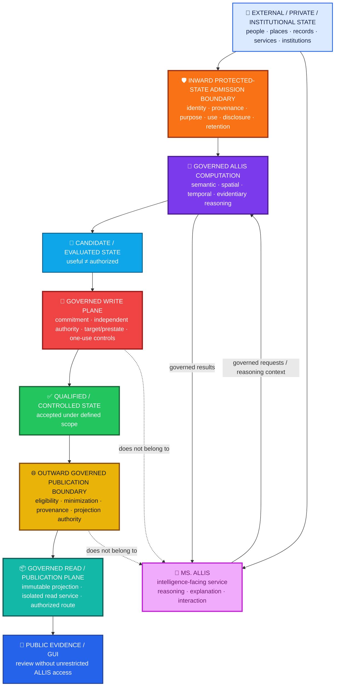
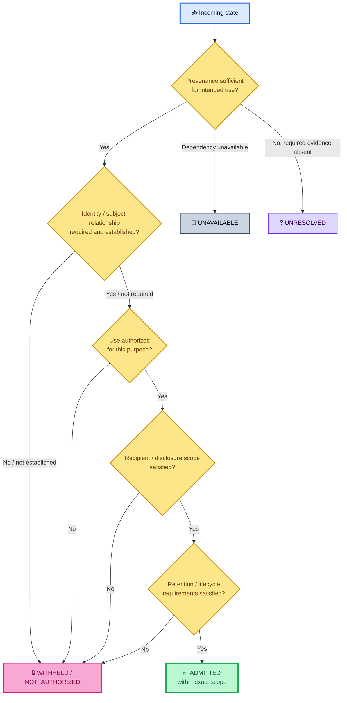
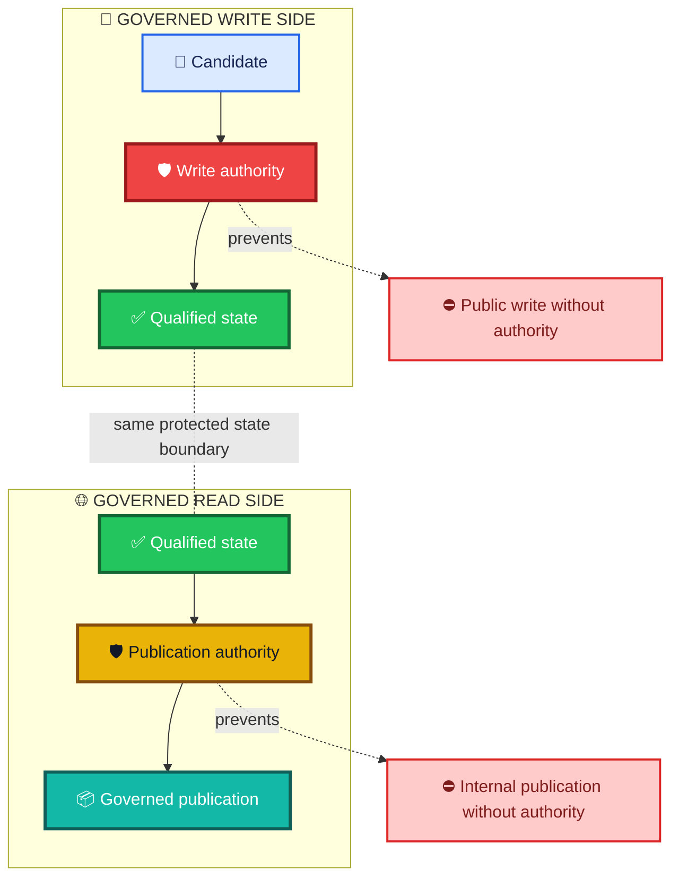
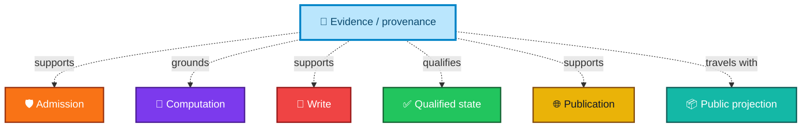
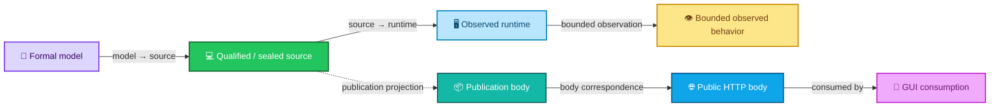
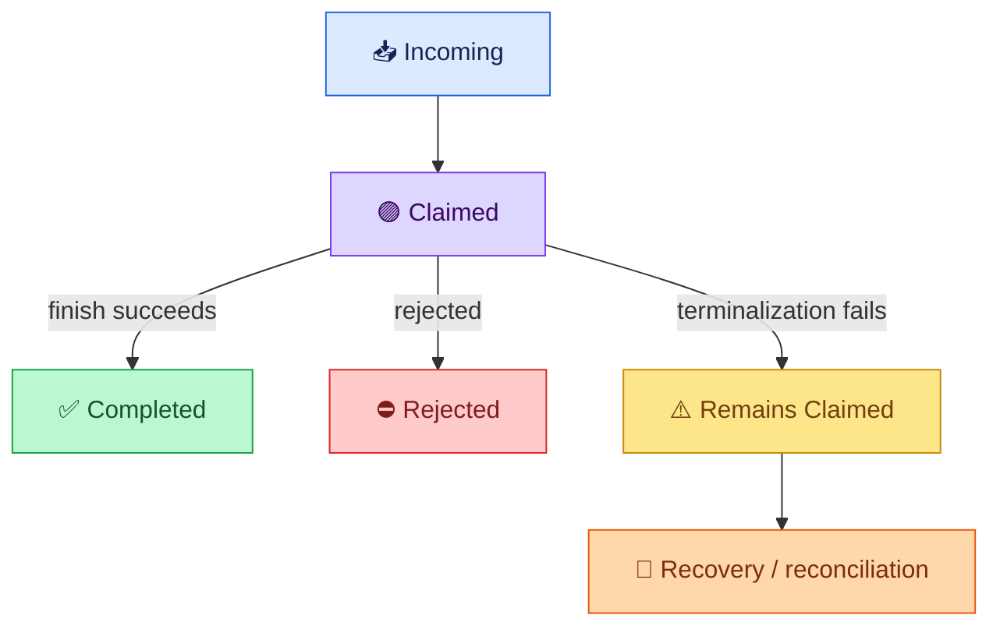

<div align="center">

# ALLIS — System Boundary

### Where governed state enters, changes, leaves, and becomes intelligible without collapsing computation into authority

<br>


<br>

**Kidd’s Technical Services · ALLIS**

</div>

---

> [!IMPORTANT]
> ALLIS is a **governed computational platform**.
>
> It is not one model, one agent, one GUI, one database, one container, one deployment, or one conversational persona.
>
> The system boundary is defined by the governed transitions ALLIS controls:
>
> **what state may enter, what state may be used, what state may change, what state may leave, and what authority is required at each crossing.**

---

# 👀 The system boundary in one view



The diagram is intentionally asymmetric around the center.

The system can:

```text
admit state
reason over state
propose state
change protected state
qualify state
project state
publish state
```

but no step automatically authorizes the next one.

---

# 🎯 Purpose

This document defines the architectural boundary of **ALLIS — the Artificial Learning and Location Intelligence System**.

It answers five questions:

```text
What is inside the ALLIS boundary?

What remains outside the ALLIS boundary?

What may cross the boundary?

Which protected transitions require separate authority?

Where does Ms. Allis sit relative to the governed platform?
```

It is an architecture document.

It does not replace:

```text
acceptance/
claims/
formal-verification/
correspondence/
evidence/
```

for current implementation status, formal claims, proof state, correspondence, or workstream closure.

---

# 1. Boundary definition

ALLIS is a governed computational platform for:

- artificial learning;
- location intelligence;
- semantic reasoning;
- temporal reasoning;
- evidence-aware analysis;
- governed memory;
- protected-state handling;
- controlled state transition;
- governed publication.

The boundary includes mechanisms that:

- receive and classify state;
- preserve provenance and scope;
- determine whether protected state may enter a governed context;
- perform governed computation;
- generate and evaluate candidate state;
- determine whether protected state may change;
- control promotion and durable write;
- determine whether qualified state may leave as a public projection;
- preserve publication identity;
- expose read-only governed publication;
- preserve evidence and correspondence about protected transitions.

The system boundary is **functional**.

A component is inside the boundary because of the governed role it performs, not merely because it is:

- in one repository;
- in one container;
- on one host;
- in one cloud;
- in one deployment;
- owned by one organization;
- visible in one GUI.

---

# 2. The governing boundary rule

The system architecture is organized around one rule:

> **State does not become authority merely because it exists.**

That rule applies in every direction.

```text
private state exists
    ≠
private state may be used
```

```text
information is available
    ≠
information is verified
```

```text
reasoning succeeds
    ≠
reasoning is authorized to act
```

```text
candidate passes evaluation
    ≠
candidate is authorized to write
```

```text
qualified state exists
    ≠
qualified state may be published
```

```text
public state exists
    ≠
public interface has backend write authority
```

---

# 3. The three protected crossings

The complete system boundary can be reduced to three major protected crossings.

```mermaid
flowchart LR
    A["👤 External / private state"]:::ext
    B["🛡️ CROSSING 1<br/>PROTECTED ADMISSION"]:::in
    C["🧠 Governed computation<br/>+ candidate state"]:::core
    D["🔐 CROSSING 2<br/>GOVERNED WRITE"]:::write
    E["✅ Qualified state"]:::qual
    F["🌐 CROSSING 3<br/>GOVERNED PUBLICATION"]:::out
    G["🔎 Public evidence / read plane"]:::pub

    A --> B --> C --> D --> E --> F --> G

    classDef ext fill:#f9a8d4,stroke:#db2777,color:#831843,stroke-width:2px;
    classDef in fill:#f97316,stroke:#9a3412,color:#ffffff,stroke-width:3px;
    classDef core fill:#7c3aed,stroke:#4c1d95,color:#ffffff,stroke-width:2px;
    classDef write fill:#ef4444,stroke:#991b1b,color:#ffffff,stroke-width:3px;
    classDef qual fill:#22c55e,stroke:#166534,color:#ffffff,stroke-width:2px;
    classDef out fill:#eab308,stroke:#854d0e,color:#111827,stroke-width:3px;
    classDef pub fill:#14b8a6,stroke:#115e59,color:#ffffff,stroke-width:2px;
```



## Crossing 1 — protected-state admission

```text
May this state enter this governed context?
```

## Crossing 2 — governed write

```text
May this candidate change protected state?
```

## Crossing 3 — governed publication

```text
May this qualified state leave through this governed projection?
```

Each crossing has different authority.

Passing one does not pre-authorize the next.

---

# 4. What is inside the ALLIS boundary

The ALLIS boundary contains the computational mechanisms that represent state, evaluate permitted use, control protected transitions, and preserve evidence about those transitions.

## 4.1 Governed state representation

ALLIS can represent and relate:

- semantic state;
- geographic state;
- spatial relationships;
- temporal state;
- evidence state;
- provenance state;
- governed memory;
- person-linked state;
- candidate state;
- authority state;
- governance state;
- publication state;
- correspondence state.

These state classes can interact.

They are not interchangeable.

---

# 4.2 Governed computation

Inside the boundary, ALLIS can perform:

- retrieval;
- semantic reasoning;
- spatial reasoning;
- temporal reasoning;
- evidence comparison;
- provenance analysis;
- synthesis;
- evaluation;
- uncertainty representation;
- claim analysis;
- candidate generation.

Computation remains non-authoritative by default.

```text
computed
    ≠
authorized
```

---

# 4.3 Protected transition controls

The boundary includes controls for:

- identity verification;
- caller authentication;
- authorization;
- purpose scope;
- recipient scope;
- disclosure authority;
- retention authority;
- publication authority;
- operation authority;
- target validation;
- expected-prestate validation;
- one-use / replay control;
- promotion;
- mutation;
- durable receipt generation;
- fail-closed handling.

These controls can span multiple services.

The system boundary is defined by their logical role.

---

# 5. What remains outside the ALLIS boundary

ALLIS interacts with people, institutions, services, and deployment environments that do not become part of the core governed computational system merely because they interact with it.

Examples include:

- human users;
- community members;
- community governance structures;
- universities;
- research partners;
- government agencies;
- courts;
- regulators;
- nonprofits;
- commercial organizations;
- landowners;
- external data providers;
- field devices;
- deployment programs;
- pilot sites;
- public users.

Their authority remains external unless an explicit governed interface admits a specific authority artifact or decision into a defined ALLIS transition.

---

# 6. External authority remains external

ALLIS can verify or consume an external authority object.

That does not mean ALLIS creates the authority itself.

```text
can verify
    ≠
can mint
```

```text
can consume
    ≠
can sign
```

```text
can reason about law or policy
    ≠
possesses legal authority
```

```text
can support a human decision
    ≠
becomes the human decision-maker
```

Human and institutional authority remains independent.

---

# 7. Inward protected-state admission boundary

The inward boundary governs whether external or protected state may enter a governed computational context.

This is broader than ingestion.

It is an **admission decision**.



Admission can be:

- complete;
- withheld;
- not authorized;
- unavailable;
- unresolved;
- not applicable;
- governed degraded where policy explicitly permits bounded continuation.

The semantic reason must not be erased.

---

# 8. Admission is not verification

State can be admitted for one purpose without becoming universally verified.

For example:

```text
user-submitted information
    may be admitted as
    user-provided context
```

without becoming:

```text
independently verified evidence
```

Likewise:

```text
external service result
    may be admitted as
    attributed external data
```

without becoming:

```text
ALLIS-verified fact
```

The system must preserve epistemic status.

---

# 9. H_people is a protected inward boundary

Person-linked state requires stronger separation.

The architecture preserves:

```text
information exists
    ≠
identity established
```

```text
identity established
    ≠
use authorized
```

```text
use authorized
    ≠
disclosure authorized
```

```text
disclosure authorized
    ≠
retention authorized
```

```text
retention authorized
    ≠
public publication authorized
```

This means private continuity is not ordinary shared context.

---

# 10. Private projection remains recipient-specific

Where private continuity is authorized, the architecture can create a bounded private projection.

Conceptually:

```text
private source state
    ↓
verified identity / subject relationship
    ↓
use authority
    ↓
disclosure authority
    ↓
recipient + purpose + time
    ↓
minimization
    ↓
authorized private projection
```

That projection is not automatically available to:

- public RAG;
- public evidence;
- shared synthesis;
- H_geo;
- research lanes;
- common durable packets;
- publication;
- unrelated models or services.

---

# 11. Safe durable metadata vs private content

The system can retain privacy-safe decision metadata without retaining private continuity content in common state.

```text
safe durable metadata:
    lane status
    reason code
    policy/build identity
    request-local correlation
```

is different from:

```text
private content:
    raw prompt
    direct subject identifier
    private memory text
    raw consent value
    source records
    private continuity derivative
```

The two streams have different disclosure and retention rules.

---

# 12. Governed computation plane

Once state is admitted for a defined purpose, ALLIS can compute over it.

This plane includes:

```text
reasoning
retrieval
spatial analysis
temporal analysis
evidence comparison
provenance analysis
synthesis
evaluation
candidate generation
```

It does not independently include authority to:

```text
write protected state
publish protected state
retain private state
disclose private state
perform an external institutional act
```

Reasoning is a capability.

Authority is a separate state.

---

# 13. Candidate state is not committed state

A computational result can become a candidate.

Examples:

- proposed system change;
- proposed publication;
- proposed memory update;
- proposed policy update;
- proposed external action;
- proposed claim;
- proposed response.

The architecture preserves:

```text
candidate generated
    ≠
candidate evaluated
    ≠
candidate authorized
    ≠
candidate applied
```

---

# 14. The governed write plane

The write plane governs transitions that **change protected state**.

It sits between:

```text
candidate / evaluated state
```

and:

```text
qualified / controlled state
```

This is the central mutation boundary.

```mermaid
flowchart LR
    A["💡 Candidate"]:::candidate
    B["🧪 Evaluation"]:::eval
    C["🧾 Authority-bearing semantics<br/>committed"]:::commit
    D["🛡️ Independent authorization"]:::auth
    E["🎯 Target + expected prestate<br/>validated"]:::target
    F["1️⃣ Fresh / one-use authority<br/>replay controlled"]:::one
    G["🔧 Governed application"]:::apply
    H["✅ Poststate validation"]:::post
    I["🧾 Durable receipt / evidence"]:::receipt

    A --> B --> C --> D --> E --> F --> G --> H --> I

    classDef candidate fill:#dbeafe,stroke:#2563eb,color:#172554,stroke-width:2px;
    classDef eval fill:#bae6fd,stroke:#0284c7,color:#0c4a6e,stroke-width:2px;
    classDef commit fill:#ddd6fe,stroke:#7c3aed,color:#3b0764,stroke-width:2px;
    classDef auth fill:#fecaca,stroke:#dc2626,color:#7f1d1d,stroke-width:2px;
    classDef target fill:#fed7aa,stroke:#ea580c,color:#7c2d12,stroke-width:2px;
    classDef one fill:#fde68a,stroke:#ca8a04,color:#713f12,stroke-width:2px;
    classDef apply fill:#22c55e,stroke:#166534,color:#ffffff,stroke-width:3px;
    classDef post fill:#86efac,stroke:#15803d,color:#14532d,stroke-width:2px;
    classDef receipt fill:#99f6e4,stroke:#0f766e,color:#134e4a,stroke-width:2px;
```



---

# 15. Capability does not create write authority

The write plane preserves:

```text
component can modify state
    ≠
component may modify state
```

```text
worker can apply change
    ≠
worker may mint the authority
```

```text
evaluation passes
    ≠
authorization exists
```

```text
authorization exists
    ≠
authorization applies to this target
```

```text
authorization valid once
    ≠
authorization reusable forever
```

---

# 16. Candidate and authorization are separate objects

The architecture distinguishes:

```text
CandidateEnvelope
```

from:

```text
AuthorizationEnvelope
```

The candidate cannot self-authorize.

The evaluator cannot silently become the signer because evaluation succeeded.

The worker cannot silently become the authority issuer because it can verify and consume an authority object.

---

# 17. Semantic commitment completeness

Cryptographic validity is not enough if decision-bearing semantics are omitted from the committed object.

Where authorization depends on an authority-bearing input, the input belongs inside the committed authorization context.

Conceptually:

```text
AuthorizationDecision = f(X1, X2, X3, ...)
```

If:

```text
Xi changes the authorization decision
```

then:

```text
Xi must be committed
```

The current bounded authorized-adoption model includes candidate semantics such as:

```text
proposal
target
expected prestate
candidate content
evaluation
scores
expected tests
```

The general architecture rule is broader:

> **Authorization must bind the semantics on which the authorization decision depends.**

---

# 18. Target and prestate are part of write authority

An authorization for:

```text
target A
```

does not authorize:

```text
target B
```

An authorization for:

```text
expected prestate X
```

does not silently authorize:

```text
unexpected prestate Y
```

The write boundary therefore evaluates:

```text
who / what
+
exact operation
+
exact target
+
expected prestate
+
time
+
replay state
+
committed semantics
```

---

# 19. One-use and replay control

Authority has lifecycle state.

A simplified lifecycle is:

```text
issued
    ↓
valid
    ↓
fresh / available
    ↓
reserved / consumed
    ↓
spent
```

A spent authority object does not regain permission because the candidate still exists.

```text
candidate still present
    ≠
fresh authorization still available
```

---

# 20. Qualified / controlled state

After a governed write transition succeeds, protected state can become qualified or controlled state.

Qualification means:

```text
accepted under a defined scope
```

not:

```text
permitted for every downstream use
```

Therefore:

```text
qualified internally
    ≠
publicly publishable
```

```text
qualified evidence
    ≠
production mutation authority
```

```text
closed workstream
    ≠
successor-work authority
```

---

# 21. Outward governed publication boundary

The outward boundary governs the transition:

```text
qualified internal state
    ↓
publicly eligible projection
```

This is a separate protected crossing.

It asks:

```text
Is this state eligible for publication?

Which fields may leave?

What private or protected fields must remain inside?

What minimization is required?

What provenance must travel with the projection?

What uncertainty must remain visible?

What publication identity is created?

What route may expose it?
```

---

# 22. Publication authority is not write authority

A state can be properly written internally and still be ineligible for publication.

```text
write-authorized
    ≠
publication-authorized
```

Likewise:

```text
publication-authorized
    ≠
write-authorized
```

The two planes use different authority.

---

# 23. Outward projection is selective

Publication is a projection.

It is not a raw dump of qualified internal state.

```mermaid
flowchart LR
    Q["✅ Qualified controlled state"]:::q
    E["🛡️ Publication eligibility"]:::e
    M["✂️ Minimization / field selection"]:::m
    P["🧾 Provenance + uncertainty"]:::prov
    I["📦 Immutable publication identity"]:::pub
    R["🚦 Authorized read route"]:::route
    G["🔎 Public evidence / GUI"]:::gui

    Q --> E --> M --> P --> I --> R --> G

    classDef q fill:#bbf7d0,stroke:#16a34a,color:#14532d,stroke-width:2px;
    classDef e fill:#fde68a,stroke:#ca8a04,color:#713f12,stroke-width:2px;
    classDef m fill:#a7f3d0,stroke:#059669,color:#064e3b,stroke-width:2px;
    classDef prov fill:#ddd6fe,stroke:#7c3aed,color:#3b0764,stroke-width:2px;
    classDef pub fill:#14b8a6,stroke:#115e59,color:#ffffff,stroke-width:3px;
    classDef route fill:#fed7aa,stroke:#ea580c,color:#7c2d12,stroke-width:2px;
    classDef gui fill:#bfdbfe,stroke:#2563eb,color:#172554,stroke-width:2px;
```



---

# 24. Publication does not erase provenance

A public projection should preserve enough provenance to support its public claim role.

This does not mean all internal provenance must become public.

The outward boundary determines which provenance:

- is required;
- is public-safe;
- supports the published claim;
- must remain internal.

---

# 25. Publication does not erase uncertainty

If the internal claim state is:

```text
unresolved
```

a public projection must not silently convert it into:

```text
proven
```

If evidence is:

```text
observed
```

the publication layer must not silently label it:

```text
machine-checked
```

The outward boundary preserves epistemic state.

---

# 26. Governed read / publication plane

After publication authority is satisfied, the system can expose a governed read path.

The current bounded publication architecture demonstrates a pattern of:

```text
qualified state
    ↓
publication eligibility
    ↓
immutable publication
    ↓
isolated read service
    ↓
authorized route
    ↓
public HTTPS
    ↓
Evidence & Governance Portal
```

The architecture-level meaning is:

```text
publicly readable
    ≠
publicly writable
```

---

# 27. Read plane and write plane are architectural duals

The write plane and read plane are intentionally symmetric.

They are not identical.

| 🔐 Governed write plane | 🌐 Governed read plane |
|---|---|
| Candidate state exists | Qualified state exists |
| Candidate is evaluated | Publication eligibility is evaluated |
| Authority-bearing semantics are committed | Public fields are selected and minimized |
| Independent operation authority is required | Independent publication authority is required |
| Target and prestate are validated | Projection scope and provenance are validated |
| Replay / one-use state is checked | Immutable publication identity is issued |
| Protected internal state may change | Qualified state may leave as projection |
| Poststate and receipt are recorded | Publication body and provenance are recorded |
| Worker cannot mint its own authority | GUI cannot acquire backend write authority |
| No self-authorization | No self-publication |

> **Neither direction is automatic. Both are governed boundary crossings.**

---

# 28. Read/write symmetry in one view



The center object is qualified controlled state.

The write side governs **how it may change**.

The read side governs **how it may leave**.

---

# 29. The read plane cannot become the write plane by convenience

A public interface may be technically capable of sending a request.

That does not create permission to mutate protected state.

```text
GUI can call an endpoint
    ≠
GUI has write authority
```

```text
public user can request change
    ≠
change is authorized
```

```text
publication route exists
    ≠
mutation route exists
```

```text
publicly visible state
    ≠
publicly editable state
```

---

# 30. The write plane cannot bypass the read boundary

A successful internal write does not automatically make the changed state public.

```text
write committed
    ≠
publication eligible
```

```text
new qualified state
    ≠
new public publication
```

The outward boundary must still evaluate the new state.

---

# 31. Ms. Allis is an intelligence-facing service

**Ms. Allis is not the ALLIS system.**

Ms. Allis is an intelligence-facing service that can:

- receive a human or institutional request;
- request governed context;
- reason over authorized context;
- explain results;
- present uncertainty;
- construct candidate tasks or actions;
- request governed operations through ALLIS interfaces.

She does not independently own:

- the inward authority plane;
- H_people identity authority;
- disclosure authority;
- production mutation authority;
- signing authority;
- governance authority;
- publication authority;
- institutional or legal authority.

---

# 32. Ms. Allis in the system geometry

```mermaid
flowchart LR
    U["👤 User / community / institution"]:::user

    M["💬 Ms. Allis<br/>intelligence-facing service"]:::ms

    C["🧠 Governed ALLIS computation"]:::core

    IN["🛡️ Inward admission"]:::in
    W["🔐 Governed write plane"]:::write
    O["🌐 Outward publication"]:::out

    Q["✅ Qualified state"]:::q
    P["📦 Public projection"]:::p

    U --> M
    M -->|"request / context request / candidate"| C
    C -->|"governed result"| M

    IN --> C
    C --> W --> Q --> O --> P

    M -. "does not own" .-> IN
    M -. "does not own" .-> W
    M -. "does not own" .-> O

    classDef user fill:#dbeafe,stroke:#2563eb,color:#172554,stroke-width:2px;
    classDef ms fill:#f0abfc,stroke:#c026d3,color:#701a75,stroke-width:3px;
    classDef core fill:#7c3aed,stroke:#4c1d95,color:#ffffff,stroke-width:3px;
    classDef in fill:#f97316,stroke:#9a3412,color:#ffffff,stroke-width:2px;
    classDef write fill:#ef4444,stroke:#991b1b,color:#ffffff,stroke-width:2px;
    classDef out fill:#eab308,stroke:#854d0e,color:#111827,stroke-width:2px;
    classDef q fill:#22c55e,stroke:#166534,color:#ffffff,stroke-width:2px;
    classDef p fill:#14b8a6,stroke:#115e59,color:#ffffff,stroke-width:2px;
```



Ms. Allis is where a person can experience intelligence.

ALLIS is the governed platform that constrains what that intelligence can admit, use, change, retain, disclose, and publish.

---

# 33. A conversation does not create system authority

A user can say:

```text
change this
publish this
remember this
send this
use my private history
```

and Ms. Allis can interpret the request.

That request becomes:

```text
a requested transition
```

not:

```text
proof that the transition is authorized
```

The applicable boundary must still evaluate it.

---

# 34. Ms. Allis can propose; ALLIS governs

A useful separation is:

```text
Ms. Allis:
    understand
    reason
    explain
    propose
    request
```

```text
ALLIS:
    admit
    authorize
    constrain
    qualify
    write
    retain
    publish
    preserve evidence
```

This is not a claim that every implementation uses exactly one service for each function.

It is the architectural responsibility split.

---

# 35. Private context and Ms. Allis

A private projection can be made available to an authorized intelligence recipient.

That does not make private continuity:

- common state;
- public evidence;
- public RAG;
- research context;
- publication content;
- unrestricted model context.

If Ms. Allis receives private continuity, the projection remains:

- recipient-specific;
- purpose-specific;
- minimized;
- time-bounded;
- governed.

---

# 36. Ms. Allis does not become a private-memory authority

Receiving an authorized private projection does not allow Ms. Allis to:

```text
promote it to durable memory
```

or:

```text
share it with another lane
```

or:

```text
publish it
```

unless those transitions independently satisfy their own authority boundaries.

---

# 37. Ms. Allis does not become publication authority

Ms. Allis may prepare or propose a public explanation.

That does not make the explanation a governed publication automatically.

```text
generated explanation
    ≠
authorized public projection
```

The outward boundary still controls publication.

---

# 38. Public GUI is also not ALLIS itself

The Evidence & Governance Portal is a public read surface.

It is not:

- the complete ALLIS runtime;
- a production write interface;
- the authority source;
- the complete evidence system;
- the complete research system;
- Ms. Allis.

The system boundary distinguishes service presentation from core governed computation.

---

# 39. Evidence is cross-cutting

Evidence can support every protected boundary.



Evidence can justify an action.

It does not execute or authorize the action by itself.

---

# 40. Correspondence is cross-cutting

Formal model, source, runtime, publication, HTTP body, and GUI are different representations.

The boundary architecture therefore relies on explicit correspondence where a claim crosses representations.



One correspondence edge does not imply every other edge.

---

# 41. Architecture is not validation status

This document defines how ALLIS is architecturally bounded.

It does not claim every path is currently:

- implemented;
- deployed;
- observed;
- demonstrated;
- formally specified;
- proven;
- machine-checked;
- correspondence-verified.

The validation hierarchy remains:

```text
Implemented
    ↓
Observed
    ↓
Demonstrated
    ↓
Formally Specified
    ↓
Proven
    ↓
Machine-Checked
    ↓
Correspondence-Verified
```

Current validation status belongs in the acceptance, claims, evidence, formal-verification, and correspondence layers.

---

# 42. Fail-closed behavior is part of the boundary

A protected transition that cannot establish the required authority or dependency must not silently become success.

Canonical safe non-success classes include:

```text
BLOCKED / DENIED
WITHHELD / NOT_AUTHORIZED
UNAVAILABLE
GOVERNED_DEGRADED
UNRESOLVED
NOT_APPLICABLE
TIMED_OUT
```

The system preserves the reason.

---

# 43. Semantic laundering is prohibited

The architecture must not convert:

```text
WITHHELD
    → no data exists
```

or:

```text
NOT_AUTHORIZED
    → UNAVAILABLE
```

or:

```text
TIMED_OUT
    → DENIED
```

or:

```text
UNRESOLVED
    → COMPLETE
```

or:

```text
CLAIMED
    → COMPLETED
```

simply because a downstream interface prefers fewer states.

---

# 44. `PASS_EMPTY` is not failure

A valid empty spool or governed container can be healthy.

```text
PASS_EMPTY
    ≠
UNAVAILABLE
```

```text
PASS_EMPTY
    ≠
DENIED
```

```text
PASS_EMPTY
    ≠
ERROR
```

This distinction matters on the write side.

---

# 45. Claimed state can require recovery

A record can be claimed without reaching terminal state.



The system boundary must preserve this recovery state rather than invent terminality.

---

# 46. Time is part of the boundary

Authority can expire.

Records can expire.

Consent can change.

Publication can change.

Runtime correspondence can drift.

Therefore:

```text
authorized once
    ≠
authorized forever
```

```text
corresponded once
    ≠
corresponds forever
```

```text
published once
    ≠
current forever
```

Temporal state is part of authority and correspondence.

---

# 47. Boundary crossings are scope-specific

A transition may be allowed for:

```text
actor A
resource X
purpose P
recipient R
operation O
time τ
```

without being allowed for:

```text
actor A
resource X
purpose Q
recipient S
operation O2
time τ2
```

Authority is not a global permission bit.

---

# 48. External institutional authority and ALLIS authority remain separate

ALLIS can support:

- government decisions;
- university research;
- nonprofit governance;
- community decisions;
- regulatory review;
- preservation analysis;
- operational planning.

It does not automatically acquire the legal or institutional authority of those entities.

Likewise, an institution does not automatically receive ALLIS technical authority merely because it is an authorized institution in another domain.

---

# 49. Deployment is not the system definition

A deployment can implement part of ALLIS.

It does not define ALLIS.

Examples can include:

- one community network;
- one public evidence portal;
- one research environment;
- one field deployment;
- one pilot;
- one local node set.

The system boundary remains functional and governance-based.

---

# 50. One deployment can omit valid architecture

A deployment may not use:

- H_people;
- public publication;
- a GUI;
- a particular external service;
- a particular location-intelligence source.

That does not remove those capabilities from the architecture.

It means the deployment uses a bounded subset.

---

# 51. One deployment can add external context without expanding the core boundary

A deployment may integrate:

- sensors;
- local GIS;
- municipal systems;
- university systems;
- public datasets;
- field nodes;
- community programs.

Those systems remain external unless their functions are explicitly admitted into the governed ALLIS boundary.

---

# 52. Boundary ownership

The boundary can be thought of in four responsibility classes.

| Responsibility | ALLIS owns | External actor owns |
|---|---|---|
| State admission | governed admission logic | source truth / source authority where external |
| Computation | governed reasoning | external institution’s independent judgment |
| Protected mutation | transition enforcement | external authority issuance where applicable |
| Publication | eligibility and governed projection | public interpretation and external action |

The table is architectural.

Exact implementation ownership can vary by deployment.

---

# 53. Boundary interfaces

A boundary interface should make its role explicit.

Examples:

```text
admission interface
    receives protected / external state

computation interface
    requests governed reasoning

write interface
    requests protected state transition

publication interface
    requests or serves governed projection

public read interface
    retrieves public projection
```

Do not use one ambiguous interface to imply all five roles.

---

# 54. Boundary interfaces should preserve provenance

A boundary crossing should preserve enough provenance to answer:

```text
Where did this state come from?

What scope was attached?

Which authority permitted the transition?

Which object was produced?

Which evidence records the transition?

What later use is permitted?
```

This is especially important when data crosses multiple services.

---

# 55. Boundary interfaces should preserve semantic state

A downstream interface should not erase:

- withheld;
- not authorized;
- unavailable;
- unresolved;
- degraded;
- not applicable;
- timed out;
- claimed recovery state;
- disproven;
- historical-only;
- bounded-domain status.

The boundary should become more precise as evidence improves.

It should not become less precise for convenience.

---

# 56. Boundary interfaces should not leak authority

A service that receives:

```text
the result of an authorization decision
```

does not automatically receive:

```text
authority to issue new authorizations
```

A service that receives:

```text
a private projection
```

does not automatically receive:

```text
authority to disclose it further
```

A service that receives:

```text
a public publication
```

does not automatically receive:

```text
authority to change the underlying state
```

---

# 57. Boundary interfaces should fail closed

If the required authority is absent:

```text
do not infer permission
```

If identity is unresolved:

```text
do not infer subject relationship
```

If publication eligibility is unresolved:

```text
do not publish
```

If write authority is stale or spent:

```text
do not apply
```

If private disclosure is not authorized:

```text
withhold
```

---

# 58. Boundary evidence should follow the transition

For protected transitions, evidence should make it possible to reconstruct:

```text
prestate
requested transition
authority basis
decision
result
poststate where applicable
receipt / evidence identity
```

For publication:

```text
qualified source state
publication eligibility
projection identity
publication body
route
public body
GUI consumption
```

The exact evidence format can differ by workstream.

---

# 59. Boundary architecture and current proof state

The architecture supports strong bounded workstream results.

It does not promote them into a universal theorem.

The current repository-wide boundary remains:

```text
PRODUCTION_MUTATION_SAFETY_THEOREM_PROVEN=NO

WHOLE_SYSTEM_SAFETY_THEOREM_PROVEN=NO

SYSTEM_PROVEN=NO
```

That boundary does not invalidate completed workstreams.

It describes the current scope of proof.

---

# 60. Boundary architecture and Workstream F

Workstream F establishes a bounded accepted source state and close.

That result belongs to:

```text
acceptance/
```

It does not define the entire ALLIS boundary.

---

# 61. Boundary architecture and Step 12

The Step-12 authorized-adoption workstream is the current bounded example of the governed write plane.

It demonstrates a production formal/correspondence path with explicit residuals.

It does not establish a universal production-mutation-safety theorem.

---

# 62. Boundary architecture and Step 17

The Step-17 publication workstream is the current bounded example of the governed outward/read plane.

It demonstrates:

```text
qualified state
    ↓
governed publication
    ↓
isolated read service
    ↓
authorized public route
    ↓
public publication
    ↓
GUI consumption
```

It does not grant the public interface unrestricted internal ALLIS access.

---

# 63. The inward boundary is architecturally broader than current H_people runtime claims

The H_people architecture defines how person-linked protected state should cross inward.

Historical implementation evidence exists.

The current public architecture should not infer a current runtime-authoritative H_people deployment merely from historical evidence.

This document therefore describes the **boundary requirement** without promoting historical runtime state into current authority.

---

# 64. Architecture vs implementation vs observation

ALLIS keeps these layers separate:

```text
architecture
    ≠
implementation
    ≠
runtime observation
    ≠
formal proof
    ≠
correspondence
    ≠
acceptance
```

An architecture requirement can be valid before every implementation path reaches the same maturity.

An implementation can exist without current correspondence.

A proof can hold for a model without proving runtime identity.

A runtime can correspond at one time without permanent future correspondence.

---

# 65. Current architecture relationships

The relevant architecture documents now separate concerns as follows:

```text
architecture/system-boundary/
    defines where ALLIS begins and ends

architecture/authority-planes.md
    defines the protected transition planes

architecture/fail-closed-semantics.md
    defines safe non-success meanings

architecture/private-state/h-people-boundary.md
    defines person-linked private-state admission/disclosure membrane

architecture/trust-and-authority/
    defines trust and authority relationships

architecture/state-models/
    defines state classes and transitions

architecture/deployment-model/
    defines implementation/deployment patterns
```

This document is the top-level boundary map.

---

# 66. System boundary vs authority planes

`authority-planes.md` explains the protected transitions in depth.

This document explains where those planes sit relative to:

- external state;
- governed computation;
- qualified state;
- public projection;
- Ms. Allis;
- external institutions.

The two documents should agree without duplicating each other.

---

# 67. System boundary vs H_people boundary

`h-people-boundary.md` explains person-linked private-state handling in depth.

This document only needs to establish:

```text
H_people sits on the inward protected-state admission side
```

and:

```text
passing H_people does not pre-authorize write or publication
```

---

# 68. System boundary vs fail-closed semantics

`fail-closed-semantics.md` defines the exact meaning of non-success states.

This document establishes the boundary rule:

> **A protected transition does not proceed when its required authority or dependency is not established.**

The semantic reason remains explicit.

---

# 69. System boundary vs acceptance

The acceptance layer answers:

```text
Which objects and workstreams are accepted now?
```

The system-boundary layer answers:

```text
What architectural roles and protected crossings exist?
```

Do not use architecture language to promote an unvalidated implementation.

---

# 70. System boundary vs correspondence

Correspondence answers:

```text
Did representation A correspond to representation B?
```

The system boundary answers:

```text
Why does that correspondence matter to a protected crossing?
```

Examples:

```text
model → source
source → runtime
publication → HTTP
HTTP → GUI
```

remain explicit edges.

---

# 71. System boundary vs public interface

The public interface is downstream of publication authority.

It should expose:

- governed public evidence;
- provenance;
- validation state;
- publication identity;
- safe uncertainty;
- bounded claims.

It should not expose:

- private person-linked continuity;
- unrestricted internal state;
- private signing material;
- production mutation capability;
- hidden authority objects;
- sensitive credentials.

---

# 72. System boundary vs Ms. Allis

Ms. Allis is upstream of some human-facing requests and downstream of governed computational results.

She is not the authority boundary.

She is not the write plane.

She is not the publication plane.

She is not the entire state model.

She is an intelligence-facing service operating through the governed system.

---

# 73. Compact boundary matrix

| Boundary | Input | Governing question | Output |
|---|---|---|---|
| 🛡️ Inward protected-state admission | External/private state | May this state enter this context? | Admitted scoped state or safe non-success |
| 🧠 Governed computation | Admitted state | What can be reasoned, compared, or proposed? | Result / candidate / uncertainty |
| 🔐 Governed write plane | Candidate state | May this candidate change protected state? | Qualified poststate + receipt, or safe non-success |
| 🌐 Outward publication boundary | Qualified state | May this state leave as public projection? | Publication object or safe non-success |
| 📦 Governed read plane | Publication object | May this projection be served through this route? | Read-only public body |
| 💬 Ms. Allis | Governed context/results | How should intelligence interact and explain? | Human-facing reasoning / candidate requests |

---

# 74. Compact authority matrix

| Capability | Does it create authority? |
|---|---|
| Information exists | **No** |
| State is retrievable | **No** |
| Model can reason | **No** |
| Candidate scores well | **No** |
| Candidate passes tests | **No** |
| Worker can apply change | **No** |
| Public key can verify | **No signing authority** |
| State is qualified | **No publication authority** |
| Publication is public | **No write authority** |
| Ms. Allis can explain | **No system authority** |
| External institution has authority | **Not automatically ALLIS technical authority** |

---

# 75. Compact read/write symmetry matrix

| Write-side question | Read-side dual |
|---|---|
| Is the candidate eligible for protected change? | Is qualified state eligible for public projection? |
| Is operation authority valid? | Is publication authority valid? |
| Is exact target/prestate correct? | Is exact projection scope correct? |
| Is authorization fresh and one-use? | Is publication identity immutable and current for this route? |
| Can the worker apply? | Can the read service expose? |
| What poststate resulted? | What public body resulted? |
| What receipt proves the transition? | What publication identity/provenance proves the projection? |
| Does the worker gain signing authority? **No** | Does the GUI gain backend write authority? **No** |

---

# 76. Compact Ms. Allis boundary matrix

| Ms. Allis can | Ms. Allis does not automatically |
|---|---|
| Interpret requests | Verify identity |
| Request governed context | Create disclosure authority |
| Reason over authorized context | Mint write authority |
| Explain evidence | Create evidence authority |
| Propose candidate actions | Apply protected mutations |
| Propose public explanation | Authorize publication |
| Use authorized private projection | Retain or redistribute it freely |
| Surface uncertainty | Upgrade unresolved state to proven |

---

# 77. Boundary invariants

The architecture preserves these invariants:

```text
ExternalState
    ↛
GovernedUse
without AdmissionAuthority
```

```text
Candidate
    ↛
ProtectedMutation
without WriteAuthority
```

```text
QualifiedState
    ↛
PublicProjection
without PublicationAuthority
```

```text
PublicProjection
    ↛
ProtectedMutation
```

```text
MsAllisRequest
    ↛
SystemAuthority
```

```text
PrivateProjection
    ↛
CommonPublicState
```

```text
Evidence
    ↛
ExecutionAuthority
```

---

# 78. Boundary update rule

A system-boundary update is warranted when the architecture changes, for example when:

- a new protected crossing is introduced;
- a new state class receives a distinct authority boundary;
- a new public/private transition is introduced;
- Ms. Allis gains a new governed interface role;
- a new write or publication plane is introduced;
- the read/write responsibility split changes;
- an external institutional authority is admitted in a new way.

A runtime patch alone does not necessarily require an architecture-boundary change.

---

# 79. Revalidation after claim-bearing implementation change

Even when the architecture is unchanged, claim-bearing implementation changes may require renewed evidence.

Examples:

```text
source changes
runtime image changes
trust object changes
governance object changes
authorization semantics change
publication body changes
frontend build changes
public route changes
private-state admission changes
```

Revalidation belongs in the relevant evidence and correspondence layers.

---

# 80. Public-safe architecture rule

This document describes enough structure to make the governance model understandable.

It does not require publication of:

- private keys;
- credentials;
- secret tokens;
- sensitive internal addresses;
- private person-linked content;
- private memory payloads;
- unpublished implementation source;
- exploit-relevant operational detail.

Architectural transparency and secret disclosure are different things.

---

# 81. Normalized system-boundary model

```yaml
allis_system_boundary:

  system:
    name: ALLIS
    class: governed_computational_platform
    system_proven: false

  external:
    includes:
      - people
      - institutions
      - external_services
      - external_records
      - field_deployments
      - public_users
    external_authority_remains_external: true

  inward_boundary:
    role: protected_state_admission
    evaluates:
      - provenance
      - identity
      - subject_relationship
      - purpose
      - use_authority
      - recipient_scope
      - disclosure_authority
      - retention
      - temporal_validity
    automatic_admission: false

  computation:
    role: governed_reasoning
    can:
      - retrieve
      - reason
      - compare_evidence
      - analyze_space
      - analyze_time
      - synthesize
      - evaluate
      - generate_candidates
    creates_authority_by_itself: false

  write_plane:
    role: protected_state_transition
    requires:
      - committed_authority_bearing_semantics
      - independent_authorization
      - target_validation
      - expected_prestate_validation
      - fresh_one_use_authority
      - governed_application
      - poststate_validation
      - receipt_or_evidence
    candidate_self_authorizes: false

  qualified_state:
    universal_downstream_authority: false

  outward_boundary:
    role: governed_publication_admission
    evaluates:
      - publication_eligibility
      - minimization
      - disclosure
      - provenance
      - uncertainty
      - projection_scope
      - publication_identity
      - route_authority
    automatic_publication: false

  read_plane:
    role: governed_public_projection
    public_read_implies_public_write: false
    gui_has_unrestricted_backend_authority: false

  ms_allis:
    class: intelligence_facing_service
    is_allis_system: false
    may:
      - interpret_requests
      - request_governed_context
      - reason_over_authorized_context
      - explain_results
      - construct_candidates
    does_not_own:
      - inward_authority
      - private_disclosure_authority
      - write_authority
      - signing_authority
      - publication_authority
      - institutional_authority

  private_state:
    h_people_role: inward_protected_state_boundary
    private_state_is_common_state: false
    private_projection_is_public_evidence: false

  cross_cutting:
    evidence_is_authority: false
    correspondence_is_permanent: false

  repository_boundary:
    production_mutation_safety_theorem_proven: false
    whole_system_safety_theorem_proven: false
    system_proven: false
```

> [!NOTE]
> This YAML block is a human-readable architecture normalization. It is not a runtime policy object or authority artifact.

---

# 82. Related architecture records

- [`../authority-planes.md`](../authority-planes.md) — detailed inward, write, outward, and read authority planes
- [`../fail-closed-semantics.md`](../fail-closed-semantics.md) — canonical safe non-success meanings
- [`../private-state/h-people-boundary.md`](../private-state/h-people-boundary.md) — person-linked private-state boundary
- [`../trust-and-authority/trust-and-authority-overview.md`](../trust-and-authority/trust-and-authority-overview.md) — trust and authority architecture
- [`../state-models/state-model-overview.md`](../state-models/state-model-overview.md) — state model
- [`../deployment-model/deployment-model-overview.md`](../deployment-model/deployment-model-overview.md) — deployment model

---

# 83. Related current-state records

- [`../../CURRENT.md`](../../CURRENT.md) — current supported technical state
- [`../../acceptance/current-system-manifest.md`](../../acceptance/current-system-manifest.md) — composite accepted-object and correspondence graph
- [`../../acceptance/baseline-object-registry.md`](../../acceptance/baseline-object-registry.md) — role-scoped reference-object registry
- [`../../claims/claim-registry.md`](../../claims/claim-registry.md) — supported claim registry
- [`../../claims/nonclaims-and-residuals.md`](../../claims/nonclaims-and-residuals.md) — explicit boundaries and residuals

---

# 84. Related Step-12 records

- [`../../acceptance/closeout/dgm-step12-close.md`](../../acceptance/closeout/dgm-step12-close.md)
- [`../../formal-verification/authorized-adoption/formal-model.md`](../../formal-verification/authorized-adoption/formal-model.md)
- [`../../formal-verification/authorized-adoption/theorem-registry.md`](../../formal-verification/authorized-adoption/theorem-registry.md)
- [`../../correspondence/authorized-adoption/model-to-source.md`](../../correspondence/authorized-adoption/model-to-source.md)
- [`../../correspondence/authorized-adoption/source-to-runtime.md`](../../correspondence/authorized-adoption/source-to-runtime.md)
- [`../../evidence/governed-evolution/`](../../evidence/governed-evolution/)

---

# 85. Related Step-17 records

- [`../../acceptance/closeout/publication-step17-close.md`](../../acceptance/closeout/publication-step17-close.md)
- [`../../correspondence/publication/source-to-publication-to-http-to-gui.md`](../../correspondence/publication/source-to-publication-to-http-to-gui.md)
- [`../../evidence/publication/publication-identity.md`](../../evidence/publication/publication-identity.md)
- [`../../evidence/publication/runtime-boundary.md`](../../evidence/publication/runtime-boundary.md)
- [`../../evidence/publication/network-continuity.md`](../../evidence/publication/network-continuity.md)
- [`../../evidence/publication/step17-final-close.md`](../../evidence/publication/step17-final-close.md)

---

# 🧾 System-boundary summary

<div align="center">

### 👤 EXTERNAL / PRIVATE STATE

↓

### 🛡️ INWARD PROTECTED-STATE ADMISSION

**identity · provenance · use · disclosure · retention**

↓

### 🧠 GOVERNED COMPUTATION

**reasoning · evidence · spatial · temporal**

↓

### 🧪 CANDIDATE STATE

**useful ≠ authorized**

↓

### 🔐 GOVERNED WRITE PLANE

**commitment · independent authority · target/prestate · one-use controls**

↓

### ✅ QUALIFIED / CONTROLLED STATE

↓

### 🌐 OUTWARD GOVERNED PUBLICATION BOUNDARY

**eligibility · minimization · provenance · projection authority**

↓

### 📦 GOVERNED READ PLANE

**immutable publication · read-only route**

↓

### 🔎 PUBLIC EVIDENCE / GUI

<br>

### 💬 MS. ALLIS

**intelligence-facing service**

**not the system itself**

<br>

# `SYSTEM_PROVEN=NO`

</div>

---

# Governing principles

> **State does not become authority merely because it exists.**

> **The inward boundary governs what may enter a governed context.**

> **The write plane governs what may change protected state.**

> **The outward boundary governs what may leave as a public projection.**

> **The read plane is not the write plane.**

> **Qualified internal state does not publish itself.**

> **Public visibility does not create backend control authority.**

> **Private state does not become shared state merely because ALLIS can see it.**

> **Evidence supports transitions; evidence does not become transition authority.**

> **Correspondence is explicit and time-specific.**

> **Ms. Allis is an intelligence-facing service operating through ALLIS, not the ALLIS system itself.**

> **Human and institutional authority remain distinct from ALLIS technical authority.**

> **A bounded green workstream does not become a whole-system theorem.**
