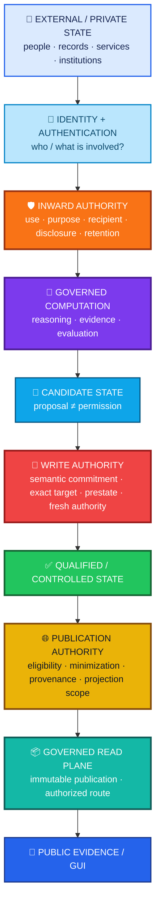
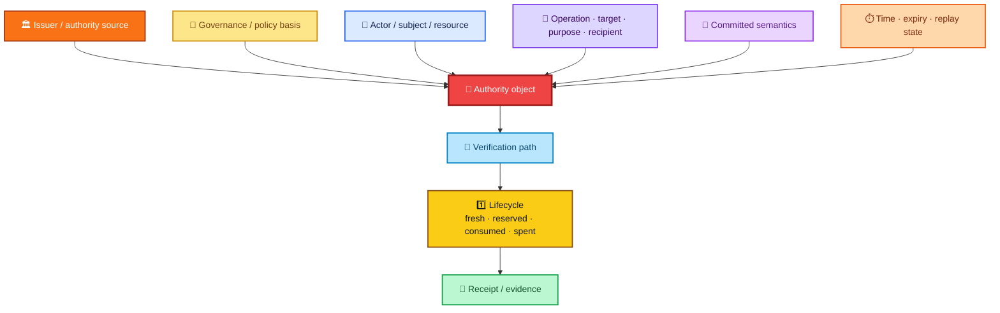
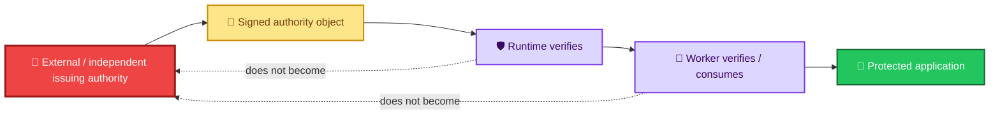
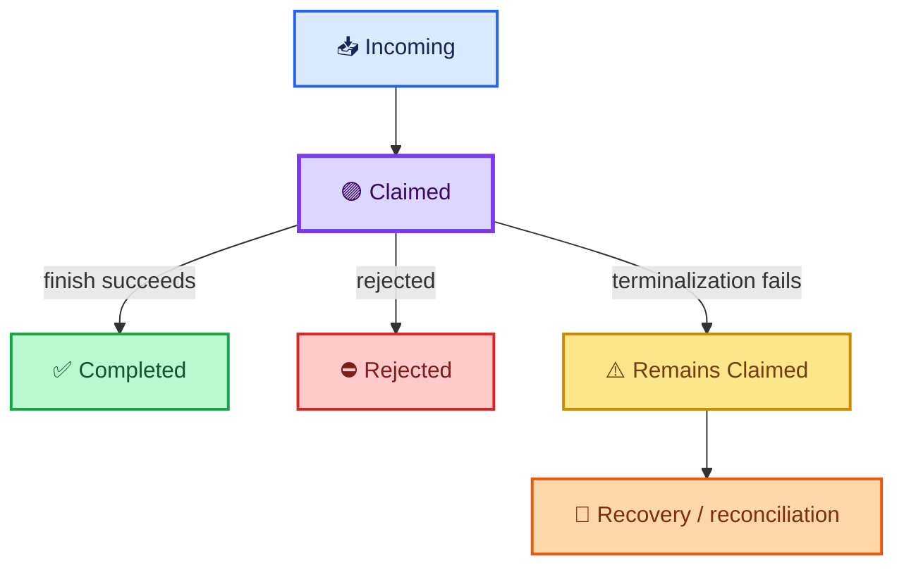
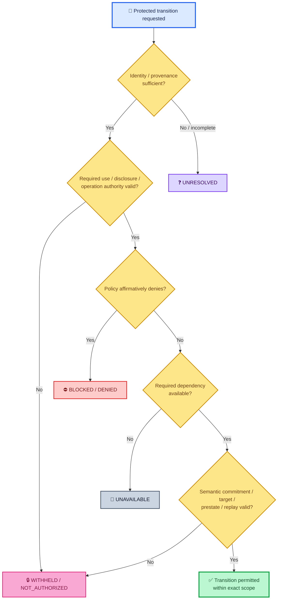

<div align="center">

# ALLIS — Trust and Authority Overview

### How identity, provenance, disclosure, operation authority, semantic commitment, replay control, and publication authority govern protected transitions

<br>


<br>

**Kidd’s Technical Services · ALLIS**

</div>

---

> [!IMPORTANT]
> ALLIS does not treat trust as a single permission attached to a person, service, model, record, or process.
>
> **Authority must be established for the exact protected transition being performed.**
>
> Identity, evidence, prior success, technical capability, qualified state, or possession of information do not independently create permission for the next transition.

---

# 👀 Trust and authority in one view



Every transition asks a different authority question.

```text
Who is this?
    ≠
May this state be used?

May this state be used?
    ≠
May it be disclosed?

May ALLIS reason about it?
    ≠
May ALLIS change protected state?

May protected state change?
    ≠
May the resulting state be published?

May state be published?
    ≠
May the public interface write back?
```

---

# 🎯 Purpose

This document defines the high-level trust and authority architecture of **ALLIS — the Artificial Learning and Location Intelligence System**.

It explains:

- identity;
- authentication;
- authorization;
- disclosure authority;
- retention authority;
- governance authority;
- operation authority;
- semantic commitment;
- authority-object provenance;
- one-use and replay authority;
- inward private-state admission;
- governed write authority;
- outward publication authority;
- fail-closed outcomes;
- evidence/authority separation;
- external institutional authority;
- intelligence-facing services.

This is an architecture document.

It does not claim that every trust path has reached the same level of implementation, runtime correspondence, or formal verification.

---

# 1. Document status

```text
Document role:
Architecture

Primary scope:
Trust, authority, protected transitions, and authority provenance

Formal status:
Architectural definitions unless separately formalized

Runtime status:
Not inferred from architecture alone

Whole-system proof:
SYSTEM_PROVEN=NO
```

The controlling rule is:

> **A transition requires authority for that transition.**

---

# 2. Six foundational separations

ALLIS begins by keeping six concepts separate.

```text
identity
    ≠
authentication
```

```text
authentication
    ≠
authorization
```

```text
authorization
    ≠
disclosure authority
```

```text
disclosure authority
    ≠
operation authority
```

```text
operation authority
    ≠
publication authority
```

```text
evidence
    ≠
authority
```

These distinctions can interact.

They must not collapse.

---

# 3. Trust is not one scalar value

ALLIS does not ask:

```text
Is this actor trusted?
```

as though trust were a single global number.

Instead it asks:

```text
Who or what is involved?

What identity has been established?

What resource or subject is affected?

What operation is requested?

For what purpose?

For which recipient?

Under which policy?

At what time?

Against which current state?

Using which authority object?

Has that authority already been used?

What evidence supports the decision?
```

Trust is therefore **relational and transition-specific**.

---

# 4. Identity

## Definition

Identity represents the relationship between:

- an actor;
- a subject;
- a service;
- a resource;
- an authority issuer;
- an internal reference;
- a request.

Identity can answer:

```text
Who is making the request?

Whom does the information concern?

Which service is acting?

Which subject does this private state belong to?

Which issuer created this authority object?
```

Identity does not answer:

```text
May this transition occur?
```

---

# 5. Authentication

Authentication establishes whether a claimed caller or service identity has been sufficiently verified for the relevant interaction.

It answers:

> **Who or what is making this request?**

It does not answer:

> **What may that caller do?**

Therefore:

```text
authenticated
    ≠
authorized
```

An authenticated caller can still be:

- outside the requested scope;
- the wrong subject;
- the wrong recipient;
- using an unsupported purpose;
- requesting an unauthorized operation;
- attempting to reuse spent authority.

---

# 6. Authorization

Authorization determines whether a recognized actor may perform an exact action within an exact scope.

Conceptually:

```text
Authorization =
    actor
  + subject / resource
  + operation
  + purpose
  + recipient where relevant
  + provenance
  + policy
  + time
  + current state
  + authority lifecycle
```

The same actor can be:

```text
authorized for operation A
```

and simultaneously:

```text
not authorized for operation B
```

This is expected.

---

# 7. Authorization is transition-specific

ALLIS does not treat authorization as a permanent badge.

Examples:

```text
authorized to read
    ≠
authorized to disclose
```

```text
authorized to analyze
    ≠
authorized to retain
```

```text
authorized to retain
    ≠
authorized to modify
```

```text
authorized to modify
    ≠
authorized to publish
```

```text
authorized for subject A
    ≠
authorized for subject B
```

```text
authorized at time τ1
    ≠
authorized at time τ2
```

---

# 8. Authority planes

The trust model operates across three primary protected authority crossings.

```mermaid
flowchart LR
    A["👤 External / private state"]:::a
    B["🛡️ INWARD AUTHORITY<br/>May this state enter / be used?"]:::b
    C["🧠 Governed computation<br/>+ candidate state"]:::c
    D["🔐 WRITE AUTHORITY<br/>May protected state change?"]:::d
    E["✅ Qualified state"]:::e
    F["🌐 PUBLICATION AUTHORITY<br/>May qualified state leave?"]:::f
    G["🔎 Public evidence"]:::g

    A --> B --> C --> D --> E --> F --> G

    classDef a fill:#f9a8d4,stroke:#db2777,color:#831843,stroke-width:2px;
    classDef b fill:#f97316,stroke:#9a3412,color:#ffffff,stroke-width:3px;
    classDef c fill:#7c3aed,stroke:#4c1d95,color:#ffffff,stroke-width:2px;
    classDef d fill:#ef4444,stroke:#991b1b,color:#ffffff,stroke-width:3px;
    classDef e fill:#22c55e,stroke:#166534,color:#ffffff,stroke-width:2px;
    classDef f fill:#eab308,stroke:#854d0e,color:#111827,stroke-width:3px;
    classDef g fill:#14b8a6,stroke:#115e59,color:#ffffff,stroke-width:2px;
```



Passing one plane does not pre-authorize the next.

---

# 9. Inward privacy and disclosure admission

The inward authority plane governs whether external or protected state may enter a governed computational context.

It is not merely:

```text
data ingestion
```

It is:

```text
governed admission
```

The inward boundary can evaluate:

- provenance;
- identity;
- subject relationship;
- use authority;
- purpose;
- recipient scope;
- disclosure authority;
- retention state;
- temporal validity;
- revocation;
- minimization;
- policy.

---

# 10. Existence is not admission

The system may know that state exists without being permitted to use it.

```text
state exists
    ≠
state admitted
```

```text
state retrievable
    ≠
state permitted for this purpose
```

```text
private memory exists
    ≠
private memory available to this recipient
```

This is especially important for person-linked state.

---

# 11. Identity does not create private-state use authority

A request can contain identity-like information.

That is not enough.

```text
request says "I am X"
    ≠
verified subject relationship = X
```

Private-state admission should rely on an independently verified identity result or equivalent trusted upstream authority.

Caller-provided fields must not silently become identity authority.

---

# 12. Private-state use authority

After identity is established, the system still needs authority for the proposed use.

Conceptually:

```text
VerifiedSubject(actor, subject)
AND
ScopeAllows(operation)
AND
PurposeAllows(operation)
AND
PolicyAllows(operation)
```

A verified subject relationship does not create universal access to all person-linked state.

---

# 13. Disclosure authority

Disclosure authority answers:

> **May this protected state cross to this exact recipient for this exact purpose and scope?**

That is different from:

```text
May the system internally retrieve this state?
```

Therefore:

```text
retrieval authority
    ≠
disclosure authority
```

and:

```text
internal visibility
    ≠
recipient visibility
```

---

# 14. Recipient-specific disclosure

Authorization for one recipient does not generalize to all downstream services.

```text
authorized for recipient A
    ≠
authorized for A + B + C + D
```

A private derivative should remain bound to:

- exact recipient;
- exact purpose;
- exact scope;
- exact time;
- exact sensitivity policy.

---

# 15. Retention authority is separate

A record can be:

```text
retention-authorized
```

while:

```text
disclosure-not-authorized
```

or:

```text
disclosure-authorized for one request
```

while:

```text
future retention not authorized
```

Retention and disclosure are separate transition rights.

---

# 16. Private projection

Where private continuity is authorized, ALLIS can conceptually construct a bounded private projection.

```text
AuthorizedPrivateProjection:
    recipient = exact authorized recipient
    purpose = exact permitted purpose
    delivery = request-bounded / in-memory
    expiry = bounded
    content = minimized private continuity
```

The projection should be:

- recipient-specific;
- purpose-specific;
- time-bounded;
- minimized;
- non-durable unless separately authorized;
- excluded from common/public paths.

---

# 17. Private projection is not common state

A private derivative does not automatically belong in:

```text
common packet
governance writer
ordinary logs
public RAG
H_geo
research
public evidence
public publication
shared telemetry
shared synthesis lanes
```

Those lanes may receive privacy-safe status metadata.

They do not receive the private content merely because one authorized recipient did.

---

# 18. Safe metadata vs private content

A privacy-safe common record can preserve:

```text
lane status
reason code
policy / build version
request-local correlation
```

without preserving:

```text
private continuity text
direct subject ID
raw prompt
raw response
private source records
raw consent
raw purpose
private sensitivity detail
```

Trust architecture includes control over what **must not** be durably propagated.

---

# 19. Disclosure authority does not create publication authority

Private disclosure is not public publication.

```text
authorized private recipient
    ≠
public audience
```

```text
private projection permitted
    ≠
public projection permitted
```

The outward publication plane remains separate.

---

# 20. Candidate state

Once state is admitted, ALLIS can reason over it and create candidate state.

Examples:

- candidate response;
- candidate state change;
- candidate memory promotion;
- candidate policy;
- candidate publication;
- candidate external action.

Candidate generation is computational.

It is not authoritative.

---

# 21. Candidate is not authority

```text
candidate exists
    ≠
candidate evaluated
```

```text
candidate evaluated
    ≠
candidate authorized
```

```text
candidate authorized
    ≠
candidate applied
```

A candidate does not become its own permission object.

---

# 22. Governed write authority

Write authority governs transitions that change protected state.

A protected write can require:

```text
candidate
+
evaluation
+
committed semantics
+
independent authorization
+
target validation
+
expected-prestate validation
+
fresh authority
+
one-use / replay protection
+
governed application
+
poststate validation
+
receipt
```

This is the authority path for protected mutation.

---

# 23. Candidate and authorization are separate

The architecture distinguishes:

```text
CandidateEnvelope
```

from:

```text
AuthorizationEnvelope
```

The candidate cannot self-authorize.

The evaluator cannot silently become the signer.

The worker cannot silently become the authority issuer simply because it can verify and consume an authority object.

---

# 24. Semantic commitment completeness

A cryptographic signature proves only what was actually committed.

It does not authorize omitted decision-bearing semantics.

The architectural rule is:

> **Every semantic input that can affect an authorization decision must be inside the committed authorization context when that decision depends on it.**

Conceptually:

```text
AuthorizationDecision = f(X1, X2, X3, ...)
```

If:

```text
Xi can change AuthorizationDecision
```

then:

```text
Xi belongs inside the committed object
```

---

# 25. Cryptographic validity and semantic completeness are separate

An authority object can be:

```text
cryptographically valid
```

while still being:

```text
semantically incomplete
```

for the transition being requested.

Therefore:

```text
valid signature
    ≠
complete authorization semantics
```

and:

```text
complete authorization semantics
    ≠
valid signature
```

Both can be required.

---

# 26. Bounded Step-12 semantic envelope

The current bounded authorized-adoption model binds candidate context including:

```text
proposal
target
expected prestate
candidate content
evaluation
scores
expected tests
```

The architecture does not need every field to have the same role.

The general rule is:

```text
decision-bearing semantic input
    ⇒
must be committed
```

The bounded model includes both `scores` and `expected tests` in the final committed envelope.

This document does not claim that every field independently changes governance in every implementation path.

---

# 27. Why semantic completeness matters

Without semantic completeness, an authority object could verify successfully while authorizing something meaningfully different from what the decision-maker evaluated.

For example:

```text
evaluated target = A
signed target = missing
applied target = B
```

would be cryptographically coherent only if the signature did not bind the actual target.

That would be inadequate for transition authority.

---

# 28. Semantic substitution must fail closed

If a committed semantic field is altered:

```text
target changes
expected prestate changes
candidate content changes
evaluation changes
decision-bearing score changes
```

the original authority must not silently remain valid for the altered transition.

The authorization applies to what was committed.

---

# 29. Target binding

An authorization for:

```text
target A
```

does not authorize:

```text
target B
```

Target identity is part of operation scope.

---

# 30. Expected-prestate binding

An authorization evaluated against:

```text
expected prestate X
```

does not silently authorize application against:

```text
prestate Y
```

This protects against stale or context-shifted application.

---

# 31. Operation binding

Authority for:

```text
operation O1
```

does not imply authority for:

```text
operation O2
```

Even if both operations affect the same resource.

---

# 32. Purpose binding

Authority for:

```text
purpose P
```

does not automatically support:

```text
purpose Q
```

Purpose is especially important for:

- private-state use;
- research use;
- disclosure;
- retention;
- publication.

---

# 33. Recipient binding

Authority can be recipient-specific.

This applies most directly to private disclosure, but the architectural principle is broader:

```text
authorized destination A
    ≠
authorized destination B
```

---

# 34. Temporal binding

Authority can have:

- start time;
- expiry;
- freshness requirement;
- revocation state;
- one-use state;
- replay state.

Time is part of authority.

It is not merely metadata around authority.

---

# 35. One-use authority

Some authority is valid only once.

A simplified lifecycle is:

```text
issued
    ↓
valid
    ↓
fresh / available
    ↓
reserved
    ↓
consumed
    ↓
spent
```

Once spent:

```text
authority still exists as evidence
```

but:

```text
authority no longer permits replay
```

---

# 36. Replay protection

A valid historical authority object is not automatically a valid current authority object.

```text
previously valid
    ≠
currently replayable
```

Replay controls can include:

- nonce state;
- reservation;
- consumption record;
- spent state;
- expiry;
- target/prestate mismatch;
- operation identity;
- candidate identity.

---

# 37. Candidate persistence does not refresh authority

A candidate can remain stored after its authority has been consumed.

Therefore:

```text
candidate still exists
    ≠
fresh authorization exists
```

A retry must not infer fresh permission from candidate persistence.

---

# 38. Re-evaluation does not restore spent authority

Likewise:

```text
candidate still passes evaluation
```

does not mean:

```text
previous spent authorization becomes usable again
```

A new protected transition can require new authority.

---

# 39. Reservation is not completion

Where authority is reserved before application:

```text
reserved
    ≠
applied
```

A reservation can prevent replay while still requiring:

- application;
- poststate verification;
- receipt;
- terminalization.

Lifecycle states must remain distinct.

---

# 40. Authority-object provenance

Authority itself is provenance-bearing state.

An authority object should make it possible to answer:

```text
Who or what issued it?

Under what governance basis?

For which actor?

For which subject or resource?

For which operation?

For which target?

Against which expected prestate?

For which purpose?

For which recipient?

Over what time window?

What semantic object was committed?

How is integrity verified?

Has it been revoked?

Has it been consumed?

What evidence records its lifecycle?
```

Authority without provenance is not sufficiently reviewable.

---

# 41. Authority provenance in one view



---

# 42. Issuer provenance

An authority object should identify or cryptographically bind enough information to establish:

```text
who issued this authority?
```

The runtime should not infer an issuer because the object is located in a trusted-looking directory or arrived through a familiar service.

---

# 43. Governance-basis provenance

Authority should have a governing basis.

Examples can include:

- policy;
- constitutional rule;
- institutional decision;
- signed authorization;
- consent;
- delegated scope;
- workstream-specific authority.

The existence of a decision does not erase the need to know what rule made it valid.

---

# 44. Subject and resource provenance

Authority should be bound to the relevant protected subject or resource.

Examples:

```text
private subject
specific candidate
specific source object
specific publication object
specific target
specific protected state
```

A general-looking authority object should not be stretched to unrelated resources by inference.

---

# 45. Scope provenance

Authority should preserve:

```text
operation
target
purpose
recipient
constraints
```

where those fields matter.

The more protected the transition, the less acceptable vague scope becomes.

---

# 46. Integrity provenance

An authority object can require:

- cryptographic signature;
- hash binding;
- key identity;
- issuer identity;
- public verification key;
- certificate or trust-chain state;
- evidence of non-revocation;
- object identity.

The exact mechanism depends on the transition.

The architectural requirement is that integrity and issuer provenance be reviewable.

---

# 47. Lifecycle provenance

Authority provenance includes what happened **after issuance**.

A complete record can include:

```text
issued
validated
reserved
consumed
spent
rejected
expired
revoked
```

A valid origin does not imply current availability.

---

# 48. Verification authority is not signing authority

A runtime can verify an authorization object without possessing authority to mint the private authorization.



Therefore:

```text
can verify
    ≠
can sign
```

```text
can consume
    ≠
can mint
```

---

# 49. External authority remains external

ALLIS can consume authority from:

- people;
- institutions;
- governance systems;
- legal systems;
- organizations;
- delegated authorities;
- external signing systems.

Receiving an external decision does not cause ALLIS to absorb the institution’s independent authority.

---

# 50. External authority must still be admitted safely

An external institution can be legitimate while a particular authority artifact remains invalid, stale, out of scope, or unverified.

Therefore:

```text
trusted institution
    ≠
every artifact accepted automatically
```

The artifact still needs:

- provenance;
- scope;
- integrity;
- temporal validity;
- operation fit.

---

# 51. Governance authority

Governance authority determines whether a transition satisfies the governing conditions applicable to that transition.

It can apply to:

- private-state admission;
- memory promotion;
- protected mutation;
- disclosure;
- publication;
- external operation.

Governance authority is not merely:

```text
a record that a prior step happened
```

It is:

```text
the rule / decision basis applicable now
```

---

# 52. Operation authority

Operation authority answers:

> **May this concrete protected action execute now?**

This is the final distinction between:

```text
can execute
```

and:

```text
may execute
```

Technical capability is not operation authority.

---

# 53. Operation authority can depend on current state

A valid authority can still fail to apply if the protected state has changed.

Examples:

```text
expected prestate mismatch
target identity mismatch
authority expired
authority spent
candidate identity changed
```

Authority is evaluated against the transition as it exists now.

---

# 54. Operation authority can be narrower than governance eligibility

A candidate can be:

```text
eligible under governance
```

while still lacking:

```text
fresh concrete operation authority
```

Eligibility and executable authority are separate stages.

---

# 55. Outward publication authority

Publication authority governs whether qualified internal state may become an outward public projection.

It asks:

```text
Is the state eligible for publication?

Which fields may leave?

What must remain private?

What minimization is required?

What provenance must accompany the projection?

What uncertainty must remain visible?

What publication identity is created?

Which route may expose it?
```

Publication is a protected transition.

---

# 56. Qualified state does not self-publish

```text
qualified internally
    ≠
publication eligible
```

```text
publication eligible
    ≠
published
```

```text
published
    ≠
publicly writable
```

A qualified object does not create its own publication authority.

---

# 57. Publication authority is not write authority

```text
write-authorized
    ≠
publication-authorized
```

and:

```text
publication-authorized
    ≠
write-authorized
```

The write plane and outward publication plane are separate.

---

# 58. Publication authority requires minimization

The outward projection should contain only what is permitted and necessary for the public purpose.

```text
qualified internal state
    ↓
eligibility
    ↓
field selection
    ↓
minimization
    ↓
provenance / uncertainty
    ↓
publication identity
```

Publication is not a raw export of internal state.

---

# 59. Publication authority must preserve epistemic state

The publication layer must not silently upgrade:

```text
observed
    → proven
```

or:

```text
unresolved
    → complete
```

or:

```text
bounded
    → universal
```

Public visibility does not change the evidence maturity of a claim.

---

# 60. Public publication does not create backend authority

A public interface can retrieve a governed publication.

That does not grant:

- mutation authority;
- signing authority;
- private disclosure authority;
- system-administrator authority;
- unrestricted source access.

```text
public read
    ≠
public write
```

---

# 61. Read/write authority symmetry

The write and read planes are architectural duals.

| 🔐 Write authority | 🌐 Publication authority |
|---|---|
| Candidate exists | Qualified state exists |
| Candidate is evaluated | Publication eligibility is evaluated |
| Semantic commitment is checked | Public projection fields are selected |
| Operation authority is required | Publication authority is required |
| Target/prestate is checked | Projection scope/minimization is checked |
| Freshness/replay is checked | Publication identity is established |
| Internal state may change | Qualified state may leave |
| Receipt records transition | Publication identity/provenance records projection |
| Worker cannot mint authority | GUI cannot gain write authority |

Both are governed transitions.

---

# 62. Evidence and authority

Evidence can support an authority decision.

Evidence is not authority.

```text
evidence
    ≠
authority
```

Likewise:

```text
authority
    ≠
truth
```

and:

```text
execution
    ≠
proof
```

---

# 63. Evidence can justify without authorizing

A strong evidence package can show:

```text
this candidate appears safe
```

without showing:

```text
this candidate is authorized to execute
```

A proof can establish:

```text
property P holds in model M
```

without establishing:

```text
runtime may now perform operation O
```

---

# 64. Authority can permit without proving every related fact

An operation can be authorized even though some broader factual proposition remains unresolved.

That does not make unresolved claims true.

Authority controls transitions.

Evidence controls claims.

---

# 65. Authority-object evidence

Authority itself can be evidence-bearing.

Useful evidence can include:

- issuer identity;
- signature verification;
- object hash;
- issuance time;
- expiry;
- nonce;
- reservation record;
- consumption record;
- target;
- expected prestate;
- committed semantics;
- receipt.

This evidence supports the statement:

```text
this authority object existed and was valid for this scope
```

not:

```text
every operation by this actor is authorized
```

---

# 66. Standard fail-closed outcome classes

Fail-closed behavior does not mean one generic error.

ALLIS preserves the semantic reason that a transition did not proceed.

The canonical safe non-success classes are:

| Class | Meaning |
|---|---|
| ⛔ `BLOCKED / DENIED` | A controlling rule made an affirmative negative decision. |
| 🔒 `WITHHELD / NOT_AUTHORIZED` | Protected state may exist, but the requested actor/purpose/recipient/operation lacks authority. |
| 📴 `UNAVAILABLE` | A required dependency, qualified object, or result cannot currently be obtained. |
| 🟡 `GOVERNED_DEGRADED` | A separately authorized bounded reduced mode may continue. |
| ❓ `UNRESOLVED` | Required evidence, authority, or adjudication is incomplete. |
| ➖ `NOT_APPLICABLE` | The lane or rule does not apply. |
| ⏱️ `TIMED_OUT` | The lane was applicable and attempted but did not complete within its deadline. |

Two important state conditions are also preserved:

| State | Meaning |
|---|---|
| 📭 `EMPTY / PASS_EMPTY` | Valid governed container with no work to perform. |
| 🟣 `CLAIMED` | Work was claimed, but terminalization may still require recovery. |

---

# 67. `BLOCKED / DENIED`

Use `BLOCKED / DENIED` when the system has enough authority and policy information to make a known negative decision.

```text
rule evaluated
+
decision = deny
    ⇒
BLOCKED / DENIED
```

This is not the same as:

```text
we could not determine
```

---

# 68. `WITHHELD / NOT_AUTHORIZED`

Use this family when protected state may exist but the requested use or disclosure lacks authority.

Examples:

```text
actor ≠ verified subject
missing private-read scope
unsupported purpose
recipient outside disclosure scope
consent disallows disclosure
```

This state must not be laundered into:

```text
no data exists
```

---

# 69. `UNAVAILABLE`

Use `UNAVAILABLE` when an applicable dependency or required state cannot currently be obtained.

Examples:

- required service unavailable;
- qualified object unavailable;
- upstream dependency failed;
- required evidence source not reachable.

Unavailable does not mean denied.

---

# 70. `GOVERNED_DEGRADED`

A degraded mode is allowed only where policy separately permits bounded continuation.

For example:

```text
private continuity unavailable
+
safe non-private response permitted
    ⇒
overall GOVERNED_DEGRADED
```

while the private lane remains:

```text
UNAVAILABLE
```

or:

```text
WITHHELD
```

The missing lane is not marked complete.

---

# 71. `UNRESOLVED`

Use `UNRESOLVED` when the system lacks enough evidence, authority, or adjudication to make the stronger determination.

This is not failure by itself.

It is an explicit epistemic boundary.

---

# 72. `NOT_APPLICABLE`

Use `NOT_APPLICABLE` when the lane or rule does not apply.

Do not convert:

```text
NOT_APPLICABLE
```

into:

```text
PASS
```

as though a control had been exercised successfully.

---

# 73. `TIMED_OUT`

Use `TIMED_OUT` when:

```text
lane applies
+
attempt made
+
deadline exceeded
```

A timeout is not automatically:

```text
DENIED
```

or:

```text
UNAVAILABLE
```

The semantic distinction matters.

---

# 74. `PASS_EMPTY`

A valid empty spool or governed queue can be healthy.

```text
PASS_EMPTY
    ≠
UNAVAILABLE
```

```text
PASS_EMPTY
    ≠
DENIED
```

```text
PASS_EMPTY
    ≠
ERROR
```

No work can be a valid state.

---

# 75. `CLAIMED` recovery state

A claimed record may not have reached terminal state.



The trust architecture must preserve the actual lifecycle state.

---

# 76. Semantic laundering is prohibited

Do not silently convert:

```text
UNAVAILABLE
    → COMPLETE
```

```text
WITHHELD
    → NO_DATA
```

```text
NOT_AUTHORIZED
    → UNAVAILABLE
```

```text
TIMED_OUT
    → DENIED
```

```text
NOT_APPLICABLE
    → SUCCESS
```

```text
CLAIMED
    → COMPLETED
```

A simpler UI must not produce a less truthful state model.

---

# 77. Fail closed means do not infer permission

The central fail-closed rule is:

```text
required authority not established
    ⇒
protected transition does not proceed
```

This does not require every non-success state to look identical.

It requires the protected action to remain unavailable until the correct authority condition is satisfied.

---

# 78. Fail-closed admission

For inward private-state admission:

```text
identity unresolved
    ⇒
no private query
```

```text
use authority absent
    ⇒
NOT_AUTHORIZED
```

```text
disclosure authority absent
    ⇒
WITHHELD
```

```text
private dependency unavailable
    ⇒
UNAVAILABLE
```

---

# 79. Fail-closed write

For protected mutation:

```text
authority invalid
    ⇒
no apply
```

```text
authority spent
    ⇒
no replay
```

```text
target mismatch
    ⇒
no apply
```

```text
prestate mismatch
    ⇒
no apply
```

```text
committed semantics mismatch
    ⇒
no apply
```

---

# 80. Fail-closed publication

For outward publication:

```text
publication eligibility absent
    ⇒
do not publish
```

```text
privacy scope unresolved
    ⇒
do not publish protected fields
```

```text
projection identity invalid
    ⇒
do not expose as governed publication
```

```text
route not authorized
    ⇒
do not expose through that route
```

---

# 81. Authority and correspondence are different

An authority object can be valid without proving runtime correspondence.

A runtime can correspond to source without creating authority.

Therefore:

```text
authority validity
    ≠
source/runtime correspondence
```

and:

```text
source/runtime correspondence
    ≠
operation permission
```

---

# 82. Correspondence is time-specific

If an authority-verification path corresponds at time `τ`:

```math
C^{\tau}=1
```

that does not establish:

```math
\forall t>\tau,\; C^t=1
```

without renewed evidence.

This applies to:

- verification keys;
- governance views;
- source/runtime correspondence;
- listener state;
- publication state;
- public routes;
- GUI consumption.

---

# 83. Authority is also time-specific

Authority itself can change over time.

```text
valid at τ1
    ≠
valid at τ2
```

because it may be:

- expired;
- revoked;
- consumed;
- spent;
- superseded;
- invalidated by prestate drift.

---

# 84. Trust state and authority state are not the same

A service can be trusted for one function while lacking authority for another.

Example:

```text
trusted to verify signatures
```

does not imply:

```text
trusted to issue signatures
```

Similarly:

```text
trusted to serve public publication
```

does not imply:

```text
trusted to mutate internal state
```

---

# 85. Verification trust

Verification trust identifies the public or otherwise non-secret material used to verify an authority object.

It can include:

- public key;
- certificate;
- trust-anchor hash;
- algorithm identity;
- verifier configuration.

Verification trust does not expose private signing authority.

---

# 86. Trust-anchor provenance

A trust anchor should be traceable to:

```text
which verification key?
which identity?
which environment?
which seal?
which observation?
```

A key hash without role or environment can be ambiguous.

---

# 86A. Current post-A8 verification-key observation

The current post-A8 DGM observation used the same public verification-key identity recorded by the bounded correspondence harness.

The observed public-key SHA-256 was:

```text
4809a1af3dd8fad1767dc5a8a9d67aa763388a055e00ec818c15f9fe0321fbb5
```

This matching hash is an **observation about the verification trust anchor used by the bounded runtime**.

It does not establish a new trust theorem.

It does not confer private signing authority.

It does not create operation authority.

```text
matching public verification-key identity
    =
bounded trust-anchor observation
```

but:

```text
matching public verification-key identity
    ≠
new trust theorem

matching public verification-key identity
    ≠
private signing authority

matching public verification-key identity
    ≠
operation authority
```

The observation is time-specific and evidence-specific.

A future change to the verification key, verifier configuration, runtime identity, or another claim-bearing trust boundary requires fresh evidence before the current observation is carried forward.

See:

- [Post-A8 DGM theorem correspondence registry R1](../../evidence/governed-evolution/post-a8-theorem-correspondence-registry-r1.md)
- [Authorized-adoption source → runtime correspondence](../../correspondence/authorized-adoption/source-to-runtime.md)
- [Governed-evolution trust-anchor evidence](../../evidence/governed-evolution/trust-anchor.md)

---

# 87. Governance-view provenance

Governance state should likewise preserve identity.

A governance object can answer:

```text
which governance view was inspected?
which version?
which hash?
which runtime saw it?
at what boundary?
```

Governance state exists does not mean:

```text
all transitions permitted
```

---

# 88. Authority-object provenance vs governance-state provenance

These are different.

```text
authority-object provenance
    =
provenance of the concrete permission artifact
```

```text
governance-state provenance
    =
provenance of the governing policy / view used to evaluate transitions
```

Both can matter to one operation.

---

# 89. Authority-object provenance vs evidence provenance

Evidence can show why an authority was issued.

That evidence is not identical to the authority object.

```text
evidence for authority
    ≠
authority itself
```

This separation prevents a strong evidentiary record from being treated as an executable authorization artifact.

---

# 90. Authority-object provenance vs identity provenance

The actor identity and authority issuer identity are also distinct.

```text
actor identity
    ≠
issuer identity
```

An actor can request an operation.

A separate issuer can authorize it.

---

# 91. Authority-object provenance and private disclosure

Private disclosure authority can depend on provenance such as:

- verified subject relation;
- consent state;
- recipient class;
- purpose;
- sensitivity;
- record status;
- retention state;
- expiry;
- revocation.

A private record does not become disclosable merely because it was stored by a trusted system.

---

# 92. Authority-object provenance and publication

Publication authority can depend on:

- qualified source state;
- eligibility decision;
- minimization decision;
- provenance;
- privacy status;
- public claim status;
- publication identity;
- route authority.

A public publication object should preserve enough provenance to support its public claim role.

---

# 93. Authority-object provenance and external action

If ALLIS supports an external action, authority for that action remains distinct from:

- recommendation;
- analysis;
- evidence;
- user request;
- system capability.

External action can require a separately scoped authority object or external human/institutional decision.

---

# 94. Intelligence-facing services

Ms. Allis can reason about, explain, or propose a protected transition.

She does not independently create authority for it.

```text
request
    ≠
authorization
```

```text
reasoning
    ≠
governance approval
```

```text
recommendation
    ≠
external action
```

```text
candidate
    ≠
write authority
```

```text
generated explanation
    ≠
publication authority
```

---

# 95. Ms. Allis and inward authority

A conversational statement does not establish private identity or disclosure authority.

If private continuity is needed, the inward authority path still applies.

Ms. Allis can consume an authorized private projection.

She does not create the authorization by asking for it.

---

# 96. Ms. Allis and write authority

Ms. Allis can propose:

```text
change X
```

or interpret a user's request to do so.

That becomes:

```text
candidate transition
```

not:

```text
authorized mutation
```

The write authority path remains separate.

---

# 97. Ms. Allis and publication authority

Ms. Allis can draft or explain public-facing material.

That output is not automatically a governed ALLIS publication.

The outward publication boundary still determines:

- eligibility;
- field selection;
- privacy;
- provenance;
- claim state;
- publication identity.

---

# 98. Human and institutional authority

ALLIS can support decisions made by:

- courts;
- agencies;
- universities;
- nonprofits;
- communities;
- regulators;
- landowners;
- professional authorities.

It does not absorb those authorities.

```text
ALLIS analysis
    ≠
institutional authority
```

---

# 99. Institutional authority does not automatically become technical authority

An institution can have legal authority over a decision without automatically possessing:

```text
ALLIS production write authority
```

or:

```text
ALLIS signing authority
```

or:

```text
ALLIS private-state disclosure authority
```

Technical authority remains separately governed.

---

# 100. Technical authority does not automatically become institutional authority

Conversely, a technically authorized ALLIS operation does not make ALLIS the legal or institutional decision-maker.

The architecture keeps those domains separate.

---

# 101. Authority inheritance is explicit

Authority should not silently inherit across:

- actors;
- subjects;
- services;
- operations;
- workstreams;
- targets;
- recipients;
- deployments.

If authority is delegated, the delegation itself needs provenance and scope.

---

# 102. Workstream completion does not create successor authority

A closed workstream can establish:

```text
this bounded goal is complete
```

without establishing:

```text
future work is automatically authorized
```

Therefore:

```text
workstream complete
    ≠
successor-work authority
```

---

# 103. Proof does not create operation authority

A formal proof can establish a proposition.

It does not itself authorize a production transition.

```text
theorem true
    ≠
operation authorized
```

This is important even for strong formal results.

---

# 104. Operation success does not create proof

Likewise:

```text
operation succeeded
    ≠
universal property proven
```

Execution evidence and formal proof remain separate.

---

# 105. Public visibility does not create trust inheritance

A public object can be visible to everyone.

That does not mean:

```text
every public consumer is trusted
```

or:

```text
every public consumer gains authority
```

Public availability is a read condition.

---

# 106. Trust and authority matrix

| Question | Governing concept |
|---|---|
| Who is involved? | Identity |
| Is the claimed identity sufficiently verified? | Authentication |
| May the actor perform this scoped operation? | Authorization |
| May protected state be used for this purpose? | Use authority |
| May protected state cross to this recipient? | Disclosure authority |
| May state remain durably stored? | Retention authority |
| Does the governing rule permit the transition? | Governance authority |
| May the concrete protected action execute now? | Operation authority |
| Is this authority object intact and in scope? | Authority-object validation |
| Has this authority already been consumed? | One-use / replay state |
| May qualified state become public projection? | Publication authority |
| May the public interface mutate internal state? | Separate write authority — not implied |

---

# 107. Authority-object validation matrix

A protected write authority object can require evaluation of:

| Dimension | Question |
|---|---|
| Issuer | Who created the authority? |
| Integrity | Is the object cryptographically intact? |
| Actor | Which actor may use it? |
| Operation | Which exact operation is authorized? |
| Target | Which target is authorized? |
| Prestate | Against which expected state? |
| Semantics | What decision-bearing inputs were committed? |
| Purpose | For what purpose? |
| Recipient | For which destination, if relevant? |
| Time | Is it currently valid? |
| Revocation | Has it been revoked? |
| Replay | Has it already been consumed? |
| Governance | What rule or authority basis permits it? |

---

# 108. Inward authority matrix

| Dimension | Admission question |
|---|---|
| Provenance | Where did the state come from? |
| Identity | Who or what does it concern? |
| Subject relationship | Is the requesting actor related to the protected subject as required? |
| Purpose | Is this use permitted? |
| Recipient | Is this recipient allowed? |
| Disclosure | May this content cross? |
| Retention | May the state persist? |
| Time | Is authority still current? |
| Revocation | Has authority or state been revoked? |
| Minimization | Is only necessary private state crossing? |

---

# 109. Publication authority matrix

| Dimension | Publication question |
|---|---|
| Eligibility | May this qualified state be published? |
| Privacy | Is protected/private content excluded? |
| Minimization | Are only allowed fields projected? |
| Claim state | Is uncertainty preserved? |
| Provenance | Does enough public-safe provenance travel with the claim? |
| Identity | What immutable publication identity is created? |
| Integrity | What hash or object identity binds the publication? |
| Route | Which read route may expose it? |
| Read/write split | Does publication remain read-only? |

---

# 110. Standard failure-class matrix

| Outcome | Authority meaning | Transition effect |
|---|---|---|
| `BLOCKED / DENIED` | Known negative rule decision | Stop |
| `WITHHELD / NOT_AUTHORIZED` | Missing authority for protected use/disclosure | Stop protected path |
| `UNAVAILABLE` | Required dependency/state not available | Stop or enter separately authorized degraded mode |
| `GOVERNED_DEGRADED` | Reduced mode separately permitted | Continue within bounded reduced scope |
| `UNRESOLVED` | Evidence/authority incomplete | Do not promote stronger result |
| `NOT_APPLICABLE` | Rule/lane irrelevant | Skip without claiming success |
| `TIMED_OUT` | Applicable attempt exceeded deadline | Preserve timeout; degraded/stop per policy |
| `PASS_EMPTY` | Valid empty governed state | No work; healthy |
| `CLAIMED` | Nonterminal claimed work | Recovery/reconciliation may be needed |

---

# 111. Protected-transition decision model



This is an architectural decision model.

It is not a claim that every runtime component currently executes this exact branching graph.

---

# 112. Authority does not substitute for correspondence

A perfectly formed authority object still needs the implementation path that interprets it correctly.

Therefore:

```text
authority object valid
+
source does something else
=
no justified runtime authority claim
```

Correspondence remains a separate evidence requirement.

---

# 113. Correspondence does not substitute for authority

Likewise:

```text
runtime exactly matches source
```

does not establish:

```text
protected transition authorized
```

A correct implementation can correctly deny an unauthorized transition.

---

# 114. Provenance does not mean public disclosure

Authority provenance should be reviewable.

That does not mean every provenance detail must be public.

Sensitive provenance can remain internal while public-safe identity, hash, status, or scope is disclosed.

---

# 115. Private signing material remains private

Public trust evidence can identify:

- public key;
- algorithm;
- key hash;
- verification status.

It should not expose private signing material.

```text
public verifiability
    ≠
public signing capability
```

---

# 116. Public evidence can identify authority without reproducing it

A public record can say:

```text
authority object verified
issuer identity known
scope known
target known
lifecycle recorded
```

without publishing sensitive live authority artifacts where doing so would weaken controls.

---

# 117. Authority provenance and receipts

A protected transition should produce enough evidence to reconstruct:

```text
what was requested
what authority was used
what state was expected
what decision was made
what happened
what state resulted
what authority lifecycle change occurred
```

Receipts do not create authority retroactively.

They preserve evidence of what occurred.

---

# 118. Receipt correspondence

A receipt can be valuable only if it corresponds to:

- the authority object;
- the candidate;
- the target;
- the actual operation;
- the resulting state.

A receipt disconnected from the transition semantics provides weaker assurance.

---

# 119. Authority and auditability

Auditability should answer:

```text
What protected transition was considered?

Which authority rule applied?

Which authority object was used?

What was its provenance?

What decision was reached?

Did the transition occur?

Was authority consumed?

What evidence remains?
```

Auditability is a design property of trust architecture.

---

# 120. Authority and minimization

Trust is not only about permission to do more.

It also determines how little state should cross.

For private disclosure:

```text
minimum necessary private projection
```

For public publication:

```text
minimum permitted public projection
```

Minimization is an authority consequence.

---

# 121. Authority and purpose limitation

A state object authorized for one purpose should not silently become reusable for another.

```text
purpose-limited authority
    ≠
general-purpose authority
```

This matters for:

- private memory;
- research;
- publication;
- external actions;
- institutional sharing.

---

# 122. Authority and recipient limitation

Similarly:

```text
recipient-limited authority
    ≠
broadcast authority
```

A recipient-specific private projection should not be copied into general shared context.

---

# 123. Authority and retention limitation

```text
may use now
    ≠
may retain forever
```

Retention is its own governed decision.

---

# 124. Authority and revocation

Authority can be revoked.

Revocation means:

```text
previously authorized
```

can become:

```text
no longer authorized
```

Systems must not treat historical validity as perpetual validity.

---

# 125. Authority and supersession

A newer authority can supersede an older authority for a defined scope.

Supersession should be explicit.

```text
newer object
    ≠
automatic universal replacement
```

---

# 126. Authority and delegation

Delegated authority should record:

```text
delegator
delegate
scope
operation
purpose
time
constraints
revocation conditions
```

Delegation is not assumed from organizational hierarchy unless the governing rule explicitly says so.

---

# 127. Authority and service identity

A service identity can establish:

```text
which service is acting
```

It does not establish:

```text
that service may perform every available operation
```

Service authentication and service authorization remain separate.

---

# 128. Authority and model identity

A model can be identifiable.

Model identity does not create:

- production authority;
- publication authority;
- private disclosure authority;
- institutional authority.

A capable model remains subject to system authority boundaries.

---

# 129. Authority and tool capability

A tool can expose a powerful capability.

Capability alone is not permission.

```text
tool supports write
    ≠
write authorized
```

```text
tool supports send
    ≠
send authorized
```

```text
tool supports delete
    ≠
delete authorized
```

---

# 130. Authority and automation

Recurring or automated operations require authority for the automated scope.

A one-time authority object should not silently become:

```text
permanent automation authority
```

Automation introduces additional concerns:

- duration;
- recurrence;
- stop conditions;
- changing state;
- changing recipients;
- revocation.

---

# 131. Authority and external services

An external service can return data or perform an operation.

ALLIS still needs to distinguish:

```text
service capability
```

from:

```text
authority to call service
```

and:

```text
authority for downstream use of returned data
```

---

# 132. Authority and public APIs

A public API can be technically reachable without providing authority for all callers or all operations.

```text
reachable
    ≠
authorized
```

This applies even when the API itself is read-only.

---

# 133. Authority and public publication identity

A governed publication should have an identity distinct from:

- source identity;
- runtime identity;
- frontend build;
- user-facing page identity.

This prevents publication authority from being inferred from unrelated source or GUI state.

---

# 134. Authority and the current publication model

The current bounded publication architecture demonstrates:

```text
qualified controlled state
    ↓
publication eligibility
    ↓
immutable publication
    ↓
isolated read service
    ↓
authorized route
    ↓
public publication
    ↓
GUI consumption
```

The architecture generalizes the authority separation.

The bounded Step-17 result supplies current implementation evidence.

---

# 135. Authority and the current write model

The current bounded authorized-adoption architecture demonstrates:

```text
candidate
    ↓
evaluation
    ↓
committed semantics
    ↓
independent authorization
    ↓
target / prestate
    ↓
fresh one-use authority
    ↓
application
    ↓
receipt
```

The architecture generalizes the authority separation.

The bounded Step-12 result supplies the historical formal/correspondence basis.

Later successor evidence strengthens that bounded record without changing the authority model:

```text
historical Step-12 machine checking
    +
later Lean R1 proof-assistant qualification
    +
current post-A8 source/runtime correspondence
    +
theorem-specific live observation where present
```

Those evidence layers remain different from operation authority.

```text
formal proof
    ≠
operation authority

source/runtime correspondence
    ≠
operation authority

live fail-closed observation
    ≠
permission to execute a protected mutation
```

See:

- [Lean R1 workstream closeout](../../formal-verification/authorized-adoption/lean/workstream-closeout-r1.md)
- [Post-A8 DGM theorem correspondence registry R1](../../evidence/governed-evolution/post-a8-theorem-correspondence-registry-r1.md)

---

# 136. Architecture is not workstream completion

This document may describe a complete trust architecture even where some paths remain:

- unimplemented;
- unobserved;
- unproven;
- not correspondence-verified.

Architecture defines what the boundary means.

Acceptance and evidence define what is currently established.

---

# 137. Validation hierarchy

Use the repository validation hierarchy:

```text
Implemented
    ↓
Observed
    ↓
Demonstrated
    ↓
Formally Specified
    ↓
Proven
    ↓
Machine-Checked
    ↓
Correspondence-Verified
```

Do not promote a trust claim beyond the evidence that supports it.

The hierarchy itself is unchanged by the later Lean work.

Within the bounded Step-12 theorem domain, preserve the evidence-method distinction:

```text
historical Step-12 machine checking
    ≠
later Lean R1 proof-assistant qualification
```

and preserve the correspondence distinction:

```text
proof-assistant qualification
    ≠
source/runtime correspondence
    ≠
theorem-specific live observation
```

These distinctions explain the evidence supporting a validation level.

They do not create a new authority class or a new validation rung.

---

# 138. Current bounded Step-12 example

The Step-12 authorized-adoption workstream provides a bounded current example of trust and operation authority.

It includes:

- production source identity;
- public verification trust identity;
- governance-view identity;
- authorization validity;
- target/prestate correspondence;
- freshness / one-use concepts;
- invalid-authorization no-publication behavior;
- empty-spool no-claim behavior;
- explicit residuals.

The later Lean R1 workstream independently kernel-checked the principal Step-12 proposition set.

The current post-A8 source/runtime relationship is:

```text
IMMUTABLE_SOURCE_IDENTITY=PASS_11_OF_11
NBB_SOURCE_TO_RUNTIME_CORRESPONDENCE=PASS_11_OF_11
WORKER_SOURCE_TO_RUNTIME_CORRESPONDENCE=PASS_11_OF_11
CURRENT_POST_A8_DGM_SOURCE_TO_RUNTIME_CORRESPONDENCE=PASS_11_OF_11
```

The same observation epoch recorded the public verification trust anchor used by the bounded runtime as:

```text
SHA-256:
4809a1af3dd8fad1767dc5a8a9d67aa763388a055e00ec818c15f9fe0321fbb5
```

That matching verification-key identity is **trust-anchor observation evidence**.

It is not a new trust theorem, does not confer signing authority, and does not create operation authority.

The current bounded theorem states are:

```text
T12D-A = MACHINE_CHECKED
T12D-B = CORRESPONDENCE_VERIFIED
T12D-C = CORRESPONDENCE_VERIFIED
P12C-09 = MACHINE_CHECKED_DISPROVEN
```

For `T12D-B`, the current live revalidation observed invalid authorization fail closed: the deliberately invalid signature was rejected without authorized-spool publication, authorization consumption, or receipt creation.

For `T12D-C`, the current live revalidation observed empty-spool non-application: no worker claim, authorization consumption, receipt, or authorized apply occurred.

These are **evidence and correspondence results**.

They do not grant operation authority.

It remains bounded.

---

# 139. Positive production path remains a boundary

The bounded Step-12 record does not establish a real positive production authorization/application observation for the protected write path.

The later post-A8 work revalidated the current theorem-relevant source/runtime relationship, but the positive authorized-apply production path was deliberately not executed.

Therefore:

```text
T12D-A = MACHINE_CHECKED
```

remains the current validation state and must not be promoted to `CORRESPONDENCE_VERIFIED`.

Architecture should not rewrite:

```text
machine-checked positive path
```

as:

```text
live positive production apply observed
```

and must not rewrite:

```text
current source/runtime correspondence
```

as:

```text
current permission to execute
```

The authority model stays stronger than the current observation claim.

---

# 139A. Current post-A8 production-action boundary

The current post-A8 B/C probes were deliberately bounded so that fail-closed behavior could be observed without exercising real protected mutation authority.

The evidence record preserves:

```text
REAL_PRODUCTION_AUTHORIZATION_ISSUED=NO
REAL_PRODUCTION_AUTHORIZATION_CONSUMED=NO
REAL_PRODUCTION_DGM_PATCH_APPLICATION=NO
```

This distinction is central to the trust model.

```text
observing rejection of invalid authority
    ≠
issuing valid production authority
```

```text
observing empty-spool non-application
    ≠
consuming production authority
```

```text
correspondence-verified fail-closed behavior
    ≠
authorized production mutation
```

The current evidence strengthens the bounded trust/correspondence record without transferring or manufacturing operation authority.

---

# 140. Terminalization remains a formal boundary

The bounded Step-12 record disproves unconditional terminal totality.

Therefore:

```text
claimed
```

cannot be silently collapsed into:

```text
completed or rejected
```

The trust architecture preserves recovery state.

---

# 141. Whole-system safety remains unproven

The current bounded work does not establish:

```text
PRODUCTION_MUTATION_SAFETY_THEOREM_PROVEN=YES
```

or:

```text
WHOLE_SYSTEM_SAFETY_THEOREM_PROVEN=YES
```

or:

```text
SYSTEM_PROVEN=YES
```

The architecture can still be valid as architecture.

---

# 142. Current publication example

The Step-17 publication workstream provides a bounded current example of outward publication authority.

It demonstrates:

- publication identity;
- read-only publication boundary;
- isolated serving runtime;
- authorized public route;
- direct/public body correspondence;
- GUI consumption;
- final network continuity;
- no public mutation endpoint.

This does not make every future publication automatically authorized.

---

# 143. Publication correspondence remains time-specific

A publication that corresponded at final Step-17 observation can change later.

Therefore:

```text
correspondence at final observation
    ≠
correspondence forever
```

A claim-bearing publication or route change requires renewed evidence.

---

# 144. H_people architecture and current runtime claims

The private-state architecture defines the required inward authority boundary.

Historical implementation evidence exists.

The public architecture should not convert historical runtime evidence into current runtime-authoritative H_people status unless current qualification and correspondence establish it.

This reconciliation also does **not** infer a current A8 application-private-context authority object from architecture alone.

No exact sealed A8 production identity is being admitted here.

If a future sealed A8 private-context object is admitted, it must remain distinct from:

```text
H_people runtime authority
```

and:

```text
DGM theorem runtime authority
```

unless a separate qualified correspondence record establishes otherwise.

Architecture and current runtime authority remain separate.

---

# 145. Authority failure should preserve reason

A protected transition should fail with the most precise supported semantic class.

Examples:

```text
known policy denial
    → BLOCKED / DENIED
```

```text
missing private disclosure authority
    → WITHHELD / NOT_AUTHORIZED
```

```text
dependency not reachable
    → UNAVAILABLE
```

```text
evidence incomplete
    → UNRESOLVED
```

Precision is part of auditability.

---

# 146. Authority checks should not reveal unnecessary private facts

A fail-closed private response can preserve non-disclosure.

For example, the public-facing response need not reveal whether private data exists if doing so would violate policy.

The internal semantic class can remain precise while the external message is minimized.

---

# 147. Authority and error handling

Operational errors should not be mistaken for governance decisions.

```text
network timeout
    ≠
DENIED
```

```text
service unavailable
    ≠
NOT_AUTHORIZED
```

```text
invalid signature
    ≠
UNAVAILABLE
```

The failure reason must match the evidence.

---

# 148. Authority and degradation

Degraded behavior must itself be authorized.

A system cannot say:

```text
full control failed
so bypass the control
```

Governed degradation means:

```text
full path unavailable
+
policy permits bounded reduced path
+
missing condition remains visible
```

---

# 149. Authority and non-applicability

A lane that does not apply should not be treated as a passed security control.

```text
NOT_APPLICABLE
    ≠
PASS
```

This keeps aggregate evidence honest.

---

# 150. Authority and empty state

No pending authorized work is a valid condition.

```text
authorized spool empty
    ≠
worker failure
```

The architecture distinguishes absence of work from inability to work.

---

# 151. Authority and recovery

A protected transition can require recovery if:

- reservation occurred;
- claim occurred;
- terminalization failed;
- receipt is incomplete;
- state drift is detected.

Recovery itself can require authority.

---

# 152. Authority and receipts do not erase failure

A later successful recovery does not erase the earlier nonterminal state.

Audit history should preserve both.

---

# 153. Authority and public claims

A public claim about trust or authority should identify:

- scope;
- evidence;
- validation level;
- observation boundary;
- residuals;
- non-promotions.

Avoid:

```text
secure
trusted
authorized
verified
```

without saying:

```text
for what
under which scope
against which evidence
at which time
```

---

# 154. Authority terminology

Use these terms consistently.

| Term | Meaning |
|---|---|
| **Identity** | Relationship between actor/subject/service/resource and request/state |
| **Authentication** | Verification of claimed identity |
| **Authorization** | Permission for a scoped operation |
| **Use authority** | Permission to use state for a purpose |
| **Disclosure authority** | Permission to release protected state to a recipient |
| **Retention authority** | Permission to persist protected state |
| **Governance authority** | Rule/policy basis for transition |
| **Operation authority** | Permission for the concrete protected action now |
| **Publication authority** | Permission for qualified state to become public projection |
| **Authority provenance** | Origin, scope, integrity, lifecycle, and evidence of authority |
| **Semantic commitment** | Binding decision-bearing semantics into the authorized object |
| **Replay control** | Preventing already-used authority from authorizing another transition |

---

# 155. Authority anti-patterns

Avoid these architectural mistakes:

```text
identity ⇒ authorization
```

```text
trusted service ⇒ all operations allowed
```

```text
valid signature ⇒ omitted semantics authorized
```

```text
candidate exists ⇒ authority exists
```

```text
prior authorization ⇒ replay allowed
```

```text
private state exists ⇒ private state may be disclosed
```

```text
qualified state exists ⇒ public publication allowed
```

```text
public publication exists ⇒ GUI may mutate backend
```

```text
workstream complete ⇒ next workstream authorized
```

---

# 156. Authority positive patterns

Prefer:

```text
identity verified
+
scope evaluated
+
provenance checked
+
authority object validated
+
semantic commitment complete
+
target/prestate valid
+
freshness/replay valid
+
policy permits
    ⇒
exact transition may proceed
```

and:

```text
qualified state
+
publication eligibility
+
privacy/minimization
+
public-safe provenance
+
publication identity
+
authorized route
    ⇒
governed public projection
```

---

# 157. Normalized trust and authority model

```yaml
allis_trust_and_authority:

  governing_rules:
    state_is_authority: false
    capability_is_permission: false
    evidence_is_authority: false
    prior_completion_creates_successor_authority: false

  identity:
    authentication_is_authorization: false

  inward_authority:
    evaluates:
      - provenance
      - verified_identity
      - subject_relationship
      - purpose
      - use_authority
      - recipient_scope
      - disclosure_authority
      - retention_authority
      - temporal_validity
      - revocation
      - minimization
    private_state_auto_admitted: false

  write_authority:
    requires:
      - candidate_identity
      - evaluation
      - semantic_commitment
      - independent_authorization
      - operation_scope
      - target_binding
      - expected_prestate_binding
      - freshness
      - replay_control
      - governed_application
      - poststate_validation
      - receipt
    candidate_self_authorizes: false

  semantic_commitment:
    rule: decision_bearing_semantics_must_be_committed
    cryptographic_validity_alone_is_sufficient: false

  authority_provenance:
    tracks:
      - issuer
      - governance_basis
      - actor
      - subject_or_resource
      - operation
      - target
      - expected_prestate
      - purpose
      - recipient
      - semantic_commitment
      - issue_time
      - expiry
      - revocation
      - replay_state
      - integrity
      - lifecycle
      - receipt

  one_use_authority:
    lifecycle:
      - issued
      - valid
      - fresh
      - reserved
      - consumed
      - spent
    replay_after_spend: false

  publication_authority:
    evaluates:
      - qualified_state
      - publication_eligibility
      - privacy
      - minimization
      - provenance
      - uncertainty
      - projection_scope
      - publication_identity
      - route_authority
    qualified_state_self_publishes: false
    public_read_implies_write: false

  fail_closed:
    canonical_classes:
      - BLOCKED_DENIED
      - WITHHELD_NOT_AUTHORIZED
      - UNAVAILABLE
      - GOVERNED_DEGRADED
      - UNRESOLVED
      - NOT_APPLICABLE
      - TIMED_OUT
    state_conditions:
      - PASS_EMPTY
      - CLAIMED
    semantic_laundering_allowed: false

  external_authority:
    remains_external: true

  ms_allis:
    is_authority_source_by_default: false
    reasoning_is_authorization: false
    recommendation_is_operation_authority: false
    generated_text_is_publication_authority: false

  validation:
    architecture_is_runtime_proof: false
    correspondence_is_permanent: false
    proof_creates_operation_authority: false
    source_runtime_correspondence_creates_operation_authority: false
    live_observation_creates_operation_authority: false
    historical_step12_machine_checked_meaning_preserved: true
    lean_r1_successor_is_distinct_evidence_method: true
    current_dgm_source_runtime_correspondence: PASS_11_OF_11
    current_dgm_theorem_state:
      T12D-A: MACHINE_CHECKED
      T12D-B: CORRESPONDENCE_VERIFIED
      T12D-C: CORRESPONDENCE_VERIFIED
      P12C-09: MACHINE_CHECKED_DISPROVEN
    post_a8_production_action_boundary:
      real_production_authorization_issued: false
      real_production_authorization_consumed: false
      real_production_dgm_patch_application: false

  private_state_current_boundary:
    current_a8_private_context_authority_admitted_here: false
    application_private_context_equals_h_people_runtime_authority: false
    application_private_context_equals_dgm_theorem_runtime_authority: false

  repository_boundary:
    production_mutation_safety_theorem_proven: false
    whole_system_safety_theorem_proven: false
    system_proven: false
```

> [!NOTE]
> This YAML is a human-readable architecture normalization. It is not itself an authorization artifact, policy engine, runtime configuration, or machine authority object.

---

# 158. Relationship to system boundary

Use:

```text
architecture/system-boundary/allis-system-boundary.md
```

to understand:

> **Where do these authority planes sit relative to the complete ALLIS system boundary?**

This document explains the authority semantics.

The system-boundary document explains the system geometry.

---

# 159. Relationship to authority planes

Use:

```text
architecture/authority-planes.md
```

for the detailed transition-plane model:

```text
inward authority
governed computation
write authority
qualified state
outward authority
governed read plane
```

This overview focuses specifically on the trust and authority semantics that make those crossings meaningful.

---

# 160. Relationship to H_people

Use:

```text
architecture/private-state/h-people-boundary.md
```

for the full person-linked/private-state boundary.

That document owns:

- identity-to-subject handling;
- private use authority;
- disclosure;
- retention;
- recipient-specific projection;
- private minimization;
- durable packet exclusions;
- private fail-closed states.

This overview places those controls inside the broader trust architecture.

---

# 161. Relationship to fail-closed semantics

Use:

```text
architecture/fail-closed-semantics.md
```

for the detailed semantic contract for:

```text
BLOCKED / DENIED
WITHHELD / NOT_AUTHORIZED
UNAVAILABLE
GOVERNED_DEGRADED
UNRESOLVED
NOT_APPLICABLE
TIMED_OUT
PASS_EMPTY
CLAIMED
```

This overview standardizes those classes for trust and authority decisions.

---

# 162. Relationship to state model

The trust model constrains all relevant state domains.

Examples:

```text
semantic state
    can be useful without being authoritative
```

```text
geographic state
    can provide context without granting jurisdiction
```

```text
temporal state
    can determine whether authority remains valid
```

```text
person-linked state
    can require disclosure / retention authority
```

```text
candidate state
    can exist without write authority
```

```text
qualified state
    can exist without publication authority
```

---

# 163. Relationship to correspondence

Correspondence records establish whether:

```text
formal model
    ↔
source
```

```text
source
    ↔
runtime
```

```text
publication body
    ↔
public HTTP body
```

```text
public publication
    ↔
GUI consumption
```

Trust and authority determine whether the transition is permitted.

Correspondence determines whether the implementation representations match the claim.

The bounded DGM record now contains two distinct observation epochs:

```text
historical Step-12 correspondence
    ≠
current post-A8 correspondence revalidation
```

The current post-A8 source/runtime result is:

```text
CURRENT_POST_A8_DGM_SOURCE_TO_RUNTIME_CORRESPONDENCE=PASS_11_OF_11
```

That current runtime match is paired with current theorem-specific live observations for `T12D-B` and `T12D-C`.

It is **not** paired with a positive authorized-apply observation for `T12D-A`.

Therefore:

```text
T12D-B = CORRESPONDENCE_VERIFIED
T12D-C = CORRESPONDENCE_VERIFIED
T12D-A = MACHINE_CHECKED
```

Correspondence remains evidence about representation/behavior.

It does not become operation permission.

See the [Post-A8 DGM theorem correspondence registry R1](../../evidence/governed-evolution/post-a8-theorem-correspondence-registry-r1.md).

---

# 164. Relationship to evidence

Evidence records can support:

- authority-object identity;
- trust-anchor identity;
- governance-view identity;
- formal proof qualification;
- runtime observation;
- publication identity;
- network continuity;
- receipts;
- residuals;
- closeout.

The later Lean R1 workstream adds a distinct proof-assistant qualification layer over the principal Step-12 proposition set.

That successor evidence does not retroactively redefine the historical Step-12 `MACHINE_CHECKED` method, and it does not create authority to execute the modeled transition.

The later post-A8 correspondence record adds current source/runtime and theorem-specific observation evidence for B/C.

That evidence likewise does not become operation authority merely by being strong.

See the [Lean R1 workstream closeout](../../formal-verification/authorized-adoption/lean/workstream-closeout-r1.md).

---

# 165. Relationship to acceptance

Acceptance answers:

```text
which objects and workstreams are admitted as qualified/current?
```

Trust and authority answer:

```text
what may those objects do, under which authority, and through which protected transitions?
```

---

# 166. Relationship to claims

The claim registry should preserve authority scope.

Examples of acceptable wording include:

```text
authorization invalid ⇒ no authorized-spool publication
```

rather than:

```text
all unauthorized mutation is impossible
```

and:

```text
public publication is read-only in the bounded Step-17 path
```

rather than:

```text
all future public paths are permanently read-only
```

---

# 167. Revalidation after authority-bearing change

Revalidation can be required when:

- signing key changes;
- verification trust changes;
- issuer changes;
- operation scope changes;
- target semantics change;
- expected-prestate semantics change;
- candidate envelope changes;
- decision-bearing field changes;
- replay/consumption semantics change;
- private disclosure rules change;
- publication eligibility changes;
- publication body changes;
- route authority changes;
- frontend data flow changes.

Authority-bearing changes should not inherit old correspondence automatically.

---

# 168. Trust-model update rule

Update this document when the architecture changes, for example when:

- a new authority class is added;
- a new protected transition is introduced;
- one-use/replay semantics change;
- a new authority-object provenance requirement is adopted;
- private disclosure architecture changes;
- publication authority architecture changes;
- fail-closed semantic classes change.

Do not rewrite this architecture document merely because one runtime observation changes.

Runtime state belongs in evidence and correspondence.

When a later proof/correspondence epoch materially changes the evidence supporting an architectural example, this document may add a bounded evidence note or reference without redefining the authority semantics.

```text
evidence update
    ≠
authority-model change
```

---

# 169. Current whole-system boundary

The current architecture supports strong bounded results.

The current repository-wide proof boundary remains:

```text
PRODUCTION_MUTATION_SAFETY_THEOREM_PROVEN=NO

WHOLE_SYSTEM_SAFETY_THEOREM_PROVEN=NO

SYSTEM_PROVEN=NO
```

This does not invalidate completed bounded workstreams.

It also does not invalidate:

- the later Lean R1 proof-assistant qualification;
- current post-A8 B/C correspondence revalidation; or
- the current 11/11 DGM source/runtime correspondence observation.

Those remain bounded evidence results.

They do not establish:

```text
PRODUCTION_MUTATION_SAFETY_THEOREM_PROVEN=YES
WHOLE_SYSTEM_SAFETY_THEOREM_PROVEN=YES
SYSTEM_PROVEN=YES
```

It prevents architectural completeness, proof-assistant qualification, or bounded correspondence from being misreported as whole-system proof or current operation authority.

---

# 🧾 Trust and authority summary

<div align="center">

### 🔑 IDENTITY

**Who / what is involved?**

↓

### 🛡️ INWARD AUTHORITY

**May protected state enter or be used?**

**purpose · disclosure · recipient · retention**

↓

### 🧠 GOVERNED COMPUTATION

**reasoning does not self-authorize**

↓

### 🧪 CANDIDATE

**proposal ≠ permission**

↓

### 🔐 WRITE AUTHORITY

**semantic commitment · provenance · exact target · prestate · one-use / replay**

↓

### ✅ QUALIFIED STATE

↓

### 🌐 PUBLICATION AUTHORITY

**eligibility · minimization · provenance · projection scope**

↓

### 📦 GOVERNED READ

**public read ≠ public write**

<br>

### Authority-object lifecycle

**issued → valid → fresh → reserved → consumed → spent**

<br>

### Fail-closed semantics

**DENIED · WITHHELD · UNAVAILABLE · DEGRADED · UNRESOLVED · NOT_APPLICABLE · TIMED_OUT**

<br>

# `SYSTEM_PROVEN=NO`

</div>

---

# Governing principles

> **State does not become authority merely because it exists.**

> **Identity does not become authorization merely because it is verified.**

> **Authority must be established for the exact transition being performed.**

> **Authority itself has provenance.**

> **Cryptographic validity does not replace semantic commitment completeness.**

> **Every decision-bearing semantic input must be committed where the authorization decision depends on it.**

> **A candidate cannot authorize itself.**

> **A verifier does not become the signer merely because it can validate a signature.**

> **Previously valid authority is not automatically replayable authority.**

> **Spent authority remains evidence but no longer grants permission.**

> **Private state does not become shared state merely because the system can retrieve it.**

> **Disclosure authority is recipient-, purpose-, scope-, and time-specific.**

> **Qualified state does not create its own publication authority.**

> **Public read access does not create backend write authority.**

> **Fail-closed behavior preserves the reason a protected transition did not proceed.**

> **Evidence can support authority without becoming authority.**

> **A formal proof can strengthen a claim without creating permission to execute the modeled transition.**

> **Correspondence can validate implementation without creating operation permission.**

> **Current B/C fail-closed correspondence does not grant a positive production authorization path.**

> **Human and institutional authority remain distinct from ALLIS technical authority.**

> **A bounded successful workstream does not become a whole-system theorem.**
