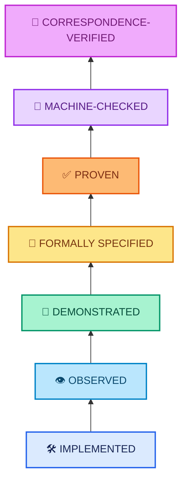
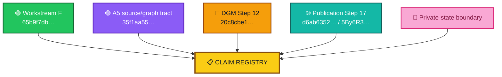

<div align="center">

# ALLIS — Claim Registry

### Current qualified claims, validation levels, evidence boundaries, and stronger claims not supported

**Claim authority index · September 2026**

<br>


<br>

**Kidd’s Technical Services · ALLIS**

</div>

---

> [!IMPORTANT]
> This registry records **what may be claimed, for what scope, at what validation level, against which qualified object, and with which evidence boundary**.
>
> A claim may advance only as far as its evidence supports.

---

# 👀 Registry at a glance

The current registry contains six claim families.

| Family | Purpose | Registered claims |
|---|---|---:|
| 🧭 `SYS` | Current system-level documentation and validation boundaries | 4 |
| 🟢 `WF` | Workstream-F acceptance and close | 5 |
| 📐 `A5` | Bounded mathematical/source-graph tract | 5 |
| 🔐 `DGM` | Step-12 authorized-adoption formal and correspondence results | 12 |
| 🌐 `PUB` | Step-17 governed-publication and GUI results | 8 |
| 👤 `PRIV` | Public-safe private-state claim boundary | 2 |
| **Total** |  | **36 entries including three explicit system-boundary records** |

> [!NOTE]
> The registry uses claim IDs for stable reference. Claim count is secondary to claim scope: one broad sentence is not allowed to absorb several differently validated propositions.

---

# 🪜 Validation model



These levels are not interchangeable.

```text
implemented
    ≠
observed
    ≠
demonstrated
    ≠
formally specified
    ≠
proven
    ≠
machine-checked
    ≠
correspondence-verified
```

The registry also uses lifecycle or adjudication states where the validation ladder is not the right vocabulary:

```text
CLOSED
GREEN_COMPLETE
DISPROVEN
NOT_PROVEN
NOT_OBSERVED
HISTORICAL_ONLY
BOUNDED_DOMAIN
POINT_IN_TIME_BINDING
NOT_APPLICABLE
```

A lifecycle state does not silently become a theorem level.

---

# 🧩 Claim anatomy

Every claim record answers the same questions.

```mermaid
flowchart LR
    A["📝 Claim text"]:::claim
    B["🎯 Scope"]:::scope
    C["🧩 Qualified object"]:::object
    D["🪜 Validation level"]:::validation
    E["🧾 Evidence"]:::evidence
    F["🔗 Correspondence"]:::corr
    G["🕒 Seal / observation"]:::time
    H["🚫 Stronger claim not supported"]:::limit

    A --> B --> C --> D --> E --> F --> G --> H

    classDef claim fill:#dbeafe,stroke:#2563eb,color:#172554,stroke-width:2px;
    classDef scope fill:#bae6fd,stroke:#0284c7,color:#0c4a6e,stroke-width:2px;
    classDef object fill:#bbf7d0,stroke:#16a34a,color:#14532d,stroke-width:2px;
    classDef validation fill:#ddd6fe,stroke:#7c3aed,color:#3b0764,stroke-width:2px;
    classDef evidence fill:#fde68a,stroke:#ca8a04,color:#713f12,stroke-width:2px;
    classDef corr fill:#f0abfc,stroke:#c026d3,color:#701a75,stroke-width:2px;
    classDef time fill:#fed7aa,stroke:#ea580c,color:#7c2d12,stroke-width:2px;
    classDef limit fill:#fecaca,stroke:#dc2626,color:#7f1d1d,stroke-width:2px;
```



---

# 📋 Master claim index

| ID | Claim | Highest supported state | Current |
|---|---|---|---|
| `SYS-001` | Current ALLIS technical state is composite, not represented by one source commit | `DEMONSTRATED` documentation/acceptance fact | ✅ |
| `SYS-002` | Validation levels remain distinct | `FORMALLY DOCUMENTED` | ✅ |
| `SYS-003` | Runtime correspondence is time-specific | `DEMONSTRATED` across Step 12/17 | ✅ |
| `SYS-004` | `SYSTEM_PROVEN=NO` | explicit system boundary | ✅ |
| `WF-001` | Workstream F is formally closed | `CLOSED` | ✅ |
| `WF-002` | Workstream-F close is bound to `65b9f7db…` and source remained unchanged | `DEMONSTRATED` | ✅ |
| `WF-003` | Formal-close authority was consumed exactly once | `DEMONSTRATED` | ✅ |
| `WF-004` | Final Workstream-F close performed no source/production mutation | `OBSERVED / RECORDED` | ✅ |
| `WF-005` | Further F-proof execution is not authorized under the closed scope | `CLOSED` successor rule | ✅ |
| `A5-001` | A5 source anchor is `35f1aa55…` / tree `36dd9f24…` | `QUALIFIED SOURCE ANCHOR` | ✅ |
| `A5-002` | A5 closed four qualified pair CFGs with 102 nodes, 107 edges, 0 unsupported control flow | `DEMONSTRATED` | ✅ |
| `A5-003` | Canonical A5 graph SHA is `08327d6f…` | sealed structural identity | ✅ |
| `A5-004` | A5A reduced 76 broad effect candidates to 47 source-bound/structural + 29 unresolved | `DEMONSTRATED` | ✅ |
| `A5-005` | A5/A5A has not yet reached dominance/cut theorem, mathematical proof, or runtime correspondence | explicit boundary | ✅ |
| `DGM-001` | Step-12 formal object is tied to production source `20c8cbe1…` | `CORRESPONDENCE-VERIFIED` for deployed identity/observed boundaries | ✅ |
| `DGM-002` | 12 propositions: 11 proven, 1 disproven, 0 open | `MACHINE-CHECKED ADJUDICATION` | ✅ |
| `DGM-003` | `T12D-A` | `MACHINE_CHECKED` | ✅ |
| `DGM-004` | `T12D-B` | `CORRESPONDENCE_VERIFIED` | ✅ |
| `DGM-005` | `T12D-C` | `CORRESPONDENCE_VERIFIED` | ✅ |
| `DGM-006` | `P12C-09` unconditional terminal totality | `MACHINE_CHECKED_DISPROVEN` | ✅ |
| `DGM-007` | NBB and worker source correspondence are both 11/11 PASS | `CORRESPONDENCE_VERIFIED` | ✅ |
| `DGM-008` | Public verification trust corresponds to sealed trust object | `CORRESPONDENCE_VERIFIED` | ✅ |
| `DGM-009` | NBB governance view corresponds to sealed governance object | `CORRESPONDENCE_VERIFIED` | ✅ |
| `DGM-010` | 15 formal obligations, 0 unadjudicated | `CLOSED` formal obligation state | ✅ |
| `DGM-011` | Real positive production authorized apply was not observed in Step 12 | `NOT_OBSERVED` boundary | ✅ |
| `DGM-012` | Authority-bearing semantics must be committed where authorization depends on them | `FORMALLY SPECIFIED / DEMONSTRATED` security rule | ✅ |
| `PUB-001` | Steps 0–17 green; fixed goal 25/25 PASS | `GREEN_COMPLETE` | ✅ |
| `PUB-002` | Final publication identity and frontend build are fixed | `OBSERVED / SEALED` | ✅ |
| `PUB-003` | Direct and public publication bodies matched | `CORRESPONDENCE_VERIFIED` | ✅ |
| `PUB-004` | Public boundary is read-only; no public mutation endpoint or unrestricted GUI→ALLIS access | `DEMONSTRATED` | ✅ |
| `PUB-005` | Final public network continuity is green | `OBSERVED / DEMONSTRATED` | ✅ |
| `PUB-006` | Final Step-17 closeout did not mutate production | `OBSERVED / RECORDED` | ✅ |
| `PUB-007` | Live publication endpoint complete; Evidence & Governance Portal live at final observation | `OBSERVED` | ✅ |
| `PUB-008` | No Step 18 exists for this fixed goal; new capability requires new governed workstream | `CLOSED` successor rule | ✅ |
| `PRIV-001` | Private/person-linked state requires identity/use/disclosure authority before crossing public/common boundaries | `FORMALLY DOCUMENTED ARCHITECTURAL RULE` | ✅ |
| `PRIV-002` | Historical Gate05c evidence is not current H_people runtime authority | explicit current claim boundary | ✅ |

---

# 🧭 System-level claims

## `SYS-001` — Current ALLIS state is composite

**Claim**

> The current ALLIS technical record is assembled from separately qualified source, proof, runtime, trust, governance, publication, and frontend objects rather than one universal source commit.

| Field | Record |
|---|---|
| **Scope** | Current repository authority model |
| **Qualified object(s)** | Workstream-F baseline `65b9…`; A5 anchor `35f1…`; Step-12 source `20c8…`; Step-17 publication/runtime identities |
| **Validation level** | `DEMONSTRATED` documentation/acceptance fact |
| **Evidence** | `acceptance/current-system-manifest.md`; `acceptance/baseline-object-registry.md`; bounded closeouts |
| **Correspondence status** | Object-specific; no universal equivalence edge asserted |
| **Observation / seal** | Current September 2026 qualified record |
| **Stronger claim not supported** | One commit identifies all current ALLIS technical authority |

---

## `SYS-002` — Validation levels remain distinct

**Claim**

> ALLIS distinguishes Implemented, Observed, Demonstrated, Formally Specified, Proven, Machine-Checked, and Correspondence-Verified states.

| Field | Record |
|---|---|
| **Scope** | Claim maturity and documentation |
| **Qualified object** | Repository validation model |
| **Validation level** | `FORMALLY DOCUMENTED` |
| **Evidence** | Root/current documentation and workstream validation records |
| **Correspondence status** | Not applicable as a runtime claim |
| **Observation / seal** | Current documentation state |
| **Stronger claim not supported** | A lower validation state automatically inherits every higher state |

---

## `SYS-003` — Correspondence is time-specific

**Claim**

> Runtime correspondence applies to the sealed or observed runtime state and must be revalidated after claim-bearing change.

| Field | Record |
|---|---|
| **Scope** | Runtime/source/publication correspondence |
| **Qualified object(s)** | Step-12 runtime correspondence; Step-17 publication/network correspondence |
| **Validation level** | `DEMONSTRATED` |
| **Evidence** | Step-12 final seal; Step-17 final close |
| **Correspondence status** | `POINT_IN_TIME_BINDING` |
| **Observation / seal** | Respective Step-12 and Step-17 final observations |
| **Stronger claim not supported** | A runtime that matched once is guaranteed to match forever |

---

## `SYS-004` — Whole-system proof is not established

**Claim**

```text
SYSTEM_PROVEN=NO
```

| Field | Record |
|---|---|
| **Scope** | Whole ALLIS system |
| **Qualified object** | Current claim boundary |
| **Validation level** | explicit `NOT_PROVEN` boundary |
| **Evidence** | Step-12 residual/non-promotion state; current acceptance records |
| **Correspondence status** | Not applicable |
| **Observation / seal** | Current September 2026 record |
| **Stronger claim not supported** | `SYSTEM_PROVEN=YES` |

---

# 🟢 Workstream-F claims

## `WF-001` — Workstream F is formally closed

**Claim**

```text
F1=CLOSED
F2=CLOSED
F3=CLOSED
F4=CLOSED
F5=CLOSED

WORKSTREAM_F_PROOFS_CLOSED=5
WORKSTREAM_F_PROOF_TARGET=5

WORKSTREAM_F_FORMAL_STATE_TRANSITION=PASS
WORKSTREAM_F_FORMAL_CLOSE=PASS
WORKSTREAM_F_STATUS=CLOSED
```

| Field | Record |
|---|---|
| **Scope** | Workstream F |
| **Qualified object** | `65b9f7dbd594ec9d225152aabd705eefc9216dbb` |
| **Validation level** | lifecycle state `CLOSED`; close evidence `DEMONSTRATED` |
| **Evidence** | `acceptance/closeout/workstream-f-close.md`; final close record/seal |
| **Correspondence status** | Runtime correspondence not required to state the formal close |
| **Observation / seal** | Final Workstream-F formal close |
| **Stronger claim not supported** | Workstream-F close proves the whole ALLIS system |

---

## `WF-002` — Qualified source remained unchanged through close

**Claim**

> The Workstream-F formal close remained bound to the qualified source and final source revalidation passed.

```text
branch = remediation/active-source-baseline-20260902
HEAD   = 65b9f7dbd594ec9d225152aabd705eefc9216dbb
tag    = stage10-auth-identity-65b9f7dbd594

FINAL_QUALIFIED_SOURCE_UNCHANGED=PASS
```

| Field | Record |
|---|---|
| **Scope** | Workstream-F close source identity |
| **Qualified object** | `65b9…` |
| **Validation level** | `DEMONSTRATED` |
| **Evidence** | final close revalidation; final evidence and manifest seals |
| **Correspondence status** | source identity binding `PASS` |
| **Observation / seal** | Workstream-F final close |
| **Stronger claim not supported** | `65b9…` is the single source baseline for every later ALLIS workstream |

---

## `WF-003` — Formal-close authority was one-use

**Claim**

> The Workstream-F formal-close authority was confirmed unconsumed and then consumed exactly once.

```text
WORKSTREAM_F_FORMAL_CLOSE_AUTHORITY_UNCONSUMED=YES
WORKSTREAM_F_FORMAL_CLOSE_AUTHORITY_CONSUMED=YES
WORKSTREAM_F_FORMAL_CLOSE_EXECUTION_COUNT=1
```

Authority-consumption SHA-256:

```text
aa817d40cac62d3f89784e9a2c0b3d9010b6e9ace6fecfc6dc304264a77656d8
```

| Field | Record |
|---|---|
| **Scope** | Workstream-F formal close transition |
| **Qualified object** | sealed Workstream-F formal-close authority |
| **Validation level** | `DEMONSTRATED` |
| **Evidence** | authority evidence/manifest, consumption record, close record |
| **Correspondence status** | Not a live-runtime correspondence claim |
| **Observation / seal** | Formal-close execution boundary |
| **Stronger claim not supported** | Proof completion itself created close authority |

---

## `WF-004` — Final F close was nonmutating to source/production

**Claim**

> The final Workstream-F close changed acceptance state without source, tag, production, service, remote-push, or signature mutation.

| Field | Record |
|---|---|
| **Scope** | Final Workstream-F close execution |
| **Qualified object** | Workstream-F final close record |
| **Validation level** | `OBSERVED / RECORDED` |
| **Evidence** | nonmutation flags in final close record |
| **Correspondence status** | Not applicable |
| **Observation / seal** | Final Workstream-F close |
| **Stronger claim not supported** | No Workstream-F-related engineering operation ever mutated anything |

---

## `WF-005` — Closed F scope cannot be silently reopened

**Claim**

```text
FURTHER_WORKSTREAM_F_PROOF_EXECUTION_AUTHORIZED=NO

NEXT_STEP=
WORKSTREAM_F_COMPLETE_AWAIT_SEPARATE_NEXT_SCOPE_AUTHORITY
```

| Field | Record |
|---|---|
| **Scope** | Workstream-F successor authority |
| **Qualified object** | final close decision |
| **Validation level** | lifecycle/successor state `CLOSED` |
| **Evidence** | final close summary/decision |
| **Correspondence status** | Not applicable |
| **Observation / seal** | Final Workstream-F close |
| **Stronger claim not supported** | Closed F authority automatically authorizes later proof work |

---

# 📐 A5 / mathematical-source tract claims

## `A5-001` — A5 source anchor

**Claim**

> The bounded A5 proof/source tract is anchored to the committed source object below.

```text
HEAD:
35f1aa5586e1a23e1ab88f4d757c451b44506893

TREE:
36dd9f2425db4b23bacfce1cb258603cace25f1b
```

| Field | Record |
|---|---|
| **Scope** | A5 bounded mathematical/source analysis |
| **Qualified object** | `35f1aa55…` / tree `36dd9f24…` |
| **Validation level** | `QUALIFIED SOURCE ANCHOR` |
| **Evidence** | A5 proof-object source identity |
| **Correspondence status** | Runtime correspondence not established for the A5 theorem tract |
| **Observation / seal** | September 2026 A5 source freeze |
| **Stronger claim not supported** | `35f1…` is the current source baseline for all ALLIS |

---

## `A5-002` — Directed CFG construction closed

**Claim**

> All four qualified root/component pairs bind exactly once into frozen intraprocedural CFGs with 102 nodes, 107 edges, and zero unsupported control flow.

| Field | Record |
|---|---|
| **Scope** | A5 directed source-graph construction |
| **Qualified object** | A5 committed source anchor |
| **Validation level** | `DEMONSTRATED` structural result |
| **Evidence** | A5 sealed graph output |
| **Correspondence status** | Source-graph result only; no runtime correspondence claim |
| **Observation / seal** | A5 close |
| **Stronger claim not supported** | The graph counts prove the final dominance/cut theorem |

---

## `A5-003` — Canonical graph identity

**Claim**

```text
QUALIFIED_PAIR_DIRECTED_SOURCE_GRAPH_SHA256=
08327d6fc77a1c5d18fd1d086b71b0ad95aa0cd86db652052e33cc3e0296cb66
```

| Field | Record |
|---|---|
| **Scope** | A5 canonical frozen directed graph |
| **Qualified object** | A5 graph |
| **Validation level** | sealed structural identity |
| **Evidence** | A5 graph close |
| **Correspondence status** | Not a runtime claim |
| **Observation / seal** | A5 final graph freeze |
| **Stronger claim not supported** | Graph identity itself proves effect-sink correctness |

---

## `A5-004` — A5A semantic reduction

**Claim**

> A5A reduced 76 broad effect candidates to 47 source-bound/structural candidates and 29 unresolved source symbols.

| Field | Record |
|---|---|
| **Scope** | A5A effect-candidate reduction |
| **Qualified object** | canonical A5 graph + sealed A5A reduction |
| **Validation level** | `DEMONSTRATED` |
| **Evidence** | A5A/A5A2V2 close |
| **Correspondence status** | No runtime correspondence |
| **Observation / seal** | `MATHAUDIT09A5A2V2_RESULT=COMPLETE` |
| **Stronger claim not supported** | All 47 source-bound candidates are final protected-effect sinks |

---

## `A5-005` — Mathematical theorem not yet reached

**Claim**

> The A5 tract has not yet established the dominance/cut theorem, mathematical proof, machine-checked theorem, or runtime/system correspondence.

| Field | Record |
|---|---|
| **Scope** | A5 successor proof tract |
| **Qualified object** | A5/A5A bounded records |
| **Validation level** | explicit current boundary |
| **Evidence** | A5A2V2 close and next-step state |
| **Correspondence status** | `NOT_ESTABLISHED` |
| **Observation / seal** | latest A5A2V2 close |
| **Stronger claim not supported** | Protected wiring theorem is already proven or correspondence-verified |

Next bounded step:

```text
MATHAUDIT09A5B_ADJUDICATE_EFFECT_SINKS_
USING_CANONICAL_A5_GRAPH_HASH_AND_SEALED_A5A_REDUCTION
```

---

# 🔐 DGM Step-12 claims

## `DGM-001` — Production authorized-adoption formal object

**Claim**

> The bounded production DGM authorized-adoption path is represented by `DGM_PRODUCTION_AUTHORIZED_ADOPTION_MODEL_V1`, tied to the sealed 11-file production source at commit `20c8cbe…`.

```text
20c8cbe175781c8a1c05d65c03977859ceca884a
```

| Field | Record |
|---|---|
| **Scope** | Production DGM authorized-adoption path |
| **Qualified object** | `DGM_PRODUCTION_AUTHORIZED_ADOPTION_MODEL_V1` + sealed 11-file source |
| **Validation level** | model correspondence verified for deployed identity and observed boundaries |
| **Evidence** | Step-12 formal model, source identity, correspondence, final seal |
| **Correspondence status** | `ESTABLISHED` within bounded path |
| **Observation / seal** | Step-12 final seal |
| **Stronger claim not supported** | The formal object models all ALLIS behavior |

---

## `DGM-002` — Twelve propositions fully adjudicated

**Claim**

```text
12 total
11 proven
1 disproven
0 open
```

| Field | Record |
|---|---|
| **Scope** | Step-12 candidate proposition set |
| **Qualified object** | Step-12 formal model |
| **Validation level** | machine-executed adjudication |
| **Evidence** | theorem registry / final Step-12 report |
| **Correspondence status** | Claim-specific; see `DGM-003`–`DGM-006` |
| **Observation / seal** | Step-12 final seal |
| **Stronger claim not supported** | All twelve propositions were true |

---

## `DGM-003` — T12D-A

**Claim**

> Successful authorized application implies authorization validation, target validity, prestate correspondence, one-time authorization availability, spent-state reservation, and durable receipt correspondence.

Final state:

```text
T12D-A = MACHINE_CHECKED
```

| Field | Record |
|---|---|
| **Scope** | Successful authorized apply in sealed source model |
| **Qualified object** | Step-12 formal model / production source |
| **Validation level** | `MACHINE_CHECKED` |
| **Evidence** | static source analysis + bounded execution |
| **Correspondence status** | positive live path `NOT_OBSERVED`; not correspondence-verified |
| **Observation / seal** | Step-12 final seal |
| **Stronger claim not supported** | A real positive production authorized apply was observed |

---

## `DGM-004` — T12D-B

**Claim**

```text
InvalidAuthorization
    ⇒
no AuthorizedSpoolPublication
```

| Field | Record |
|---|---|
| **Scope** | NBB publication path |
| **Qualified object** | Step-12 formal model + live NBB boundary |
| **Validation level** | `CORRESPONDENCE_VERIFIED` |
| **Evidence** | source proof + live fail-closed observation |
| **Correspondence status** | `PASS` |
| **Observation / seal** | Step-12 final seal |
| **Stronger claim not supported** | Every invalid input in every ALLIS subsystem is universally blocked by this theorem |

---

## `DGM-005` — T12D-C

**Claim**

```text
NoIncomingRecord
    ⇒
NoWorkerClaim
    ⇒
NoAuthorizedApply
```

| Field | Record |
|---|---|
| **Scope** | Worker empty-spool path |
| **Qualified object** | Step-12 formal model + worker runtime |
| **Validation level** | `CORRESPONDENCE_VERIFIED` |
| **Evidence** | source proof + observed empty-spool behavior |
| **Correspondence status** | `PASS` |
| **Observation / seal** | Step-12 final seal |
| **Stronger claim not supported** | All worker non-application conditions are covered by this theorem |

---

## `DGM-006` — P12C-09 disproven

**Claim**

The unconditional proposition:

```text
claimed
    ⇒
completed OR rejected
```

is false for the current bounded architecture.

Valid counterexample:

```text
claimed
AND FinishClaim failure
    ⇒
claimed
```

| Field | Record |
|---|---|
| **Scope** | Claimed-record terminalization |
| **Qualified object** | Step-12 formal model |
| **Validation level** | `MACHINE_CHECKED_DISPROVEN` |
| **Evidence** | counterexample registry / final formal report |
| **Correspondence status** | Not promoted to a runtime theorem |
| **Observation / seal** | Step-12 final seal |
| **Stronger claim not supported** | Every claimed record is guaranteed to terminalize |

---

## `DGM-007` — Production source/runtime correspondence

**Claim**

```text
NBB source correspondence    = 11 / 11 PASS
Worker source correspondence = 11 / 11 PASS
```

| Field | Record |
|---|---|
| **Scope** | Eleven governed production source files |
| **Qualified object** | Step-12 sealed production source set |
| **Validation level** | `CORRESPONDENCE_VERIFIED` |
| **Evidence** | source-to-runtime byte comparison |
| **Correspondence status** | NBB `PASS`; worker `PASS` |
| **Observation / seal** | Step-12 final runtime seal |
| **Stronger claim not supported** | Every future runtime remains byte-identical without revalidation |

---

## `DGM-008` — Public trust correspondence

**Claim**

> The live verification trust state corresponded to the sealed public trust object.

```text
4809a1af3dd8fad1767dc5a8a9d67aa763388a055e00ec818c15f9fe0321fbb5
```

| Field | Record |
|---|---|
| **Scope** | Step-12 public verification trust |
| **Qualified object** | sealed public trust object |
| **Validation level** | `CORRESPONDENCE_VERIFIED` |
| **Evidence** | trust-anchor correspondence |
| **Correspondence status** | `PASS` |
| **Observation / seal** | Step-12 final seal |
| **Stronger claim not supported** | Public verification trust grants private signing authority |

---

## `DGM-009` — Governance-view correspondence

**Claim**

> The inspected NBB governance view matched the sealed governance object.

```text
26523c0bad40ff06a75c62a802f20195295534764dce45cfa6acdcdaecc3fcc2
```

| Field | Record |
|---|---|
| **Scope** | Step-12 NBB governance state |
| **Qualified object** | sealed governance view |
| **Validation level** | `CORRESPONDENCE_VERIFIED` |
| **Evidence** | governance-view revalidation |
| **Correspondence status** | `PASS` |
| **Observation / seal** | Step-12 final seal |
| **Stronger claim not supported** | Governance state itself authorizes mutation |

---

## `DGM-010` — Formal obligations fully disposed

**Claim**

```text
N_obligations   = 15
N_unadjudicated = 0
```

| Field | Record |
|---|---|
| **Scope** | Step-12 formal obligation set |
| **Qualified object** | Step-12 close |
| **Validation level** | lifecycle close state |
| **Evidence** | final formal report |
| **Correspondence status** | Mixed by obligation |
| **Observation / seal** | Step-12 final seal |
| **Stronger claim not supported** | Zero unadjudicated obligations means zero residuals or every proposition true |

---

## `DGM-011` — Positive production path not observed

**Claim**

> Step 12 did not publish, consume, or apply a real positive production authorization and did not apply a production DGM patch.

```text
REAL_PRODUCTION_AUTHORIZATION_PUBLICATION=NOT_PERFORMED
REAL_PRODUCTION_AUTHORIZATION_CONSUMPTION=NOT_PERFORMED
REAL_PRODUCTION_DGM_PATCH_APPLICATION=NOT_PERFORMED
```

| Field | Record |
|---|---|
| **Scope** | Step-12 live positive path |
| **Qualified object** | Step-12 final runtime state |
| **Validation level** | `NOT_OBSERVED` / explicit non-execution record |
| **Evidence** | final runtime seal |
| **Correspondence status** | Positive-path correspondence not established |
| **Observation / seal** | Step-12 final seal |
| **Stronger claim not supported** | `T12D-A` is correspondence-verified |

---

## `DGM-012` — Semantic commitment completeness

**Claim**

> Every authority-bearing semantic input must be cryptographically committed where the authorization decision depends on it.

The corrected candidate envelope includes:

```text
proposal
target
expected prestate
candidate content
evaluation
scores
expected tests
```

The engineering record established that `scores` can affect governed acceptance and are therefore authority-bearing.

| Field | Record |
|---|---|
| **Scope** | DGM candidate/authorization semantics |
| **Qualified object** | corrected Step-12 formal model |
| **Validation level** | `FORMALLY_SPECIFIED / DEMONSTRATED` |
| **Evidence** | semantic-commitment repair + final candidate envelope |
| **Correspondence status** | Included in current bounded formal model |
| **Observation / seal** | Step-12 formal close |
| **Stronger claim not supported** | Every listed candidate field has independently demonstrated equal decision authority |

---

# 🌐 Publication Step-17 claims

## `PUB-001` — Fixed publication goal complete

**Claim**

```text
ALL_STEPS_0_THROUGH_17=GREEN
FINAL_CRITERIA=25_OF_25_PASS
FINAL_NETWORK_CONTINUITY=GREEN
OVERALL_GOAL=GREEN_COMPLETE
```

| Field | Record |
|---|---|
| **Scope** | Step-17 fixed governed-publication goal |
| **Qualified object** | Step-17 completion matrix |
| **Validation level** | lifecycle state `GREEN_COMPLETE` |
| **Evidence** | final criteria matrix, audit, completion report, seal |
| **Correspondence status** | final publication/network correspondence `PASS` |
| **Observation / seal** | Final Step-17 R2-R2 close |
| **Stronger claim not supported** | Every possible future publication capability is complete |

---

## `PUB-002` — Final publication identity

**Claim**

```text
Publication ID:
allis-publication-step6-retention-v2

Publication SHA-256:
d6ab63522f9080fae440578ebbb6ed42140595155c9a30253f5b8eeeef8009b7

Payload SHA-256:
04ebb5bc1f97cbf56b8722fea9bcc7e7303cac2f5b467510d7a821d84d4a3c3c

Frontend build:
5By6R3CWTM7NDXc-4lmSi
```

| Field | Record |
|---|---|
| **Scope** | Final Step-17 publication/GUI observation |
| **Qualified object** | publication reference set |
| **Validation level** | `OBSERVED / SEALED` |
| **Evidence** | final direct/public publication records + frontend build observation |
| **Correspondence status** | See `PUB-003` |
| **Observation / seal** | Final Step-17 close |
| **Stronger claim not supported** | These identities represent every internal ALLIS runtime object |

---

## `PUB-003` — Direct/public publication correspondence

**Claim**

```text
FINAL_DIRECT_SHA256=
d6ab63522f9080fae440578ebbb6ed42140595155c9a30253f5b8eeeef8009b7

FINAL_PUBLIC_SHA256=
d6ab63522f9080fae440578ebbb6ed42140595155c9a30253f5b8eeeef8009b7

FINAL_DIRECT_PUBLIC_BODY_CORRESPONDENCE=PASS
```

| Field | Record |
|---|---|
| **Scope** | Direct publication vs public HTTP publication |
| **Qualified object** | sealed publication body |
| **Validation level** | `CORRESPONDENCE_VERIFIED` |
| **Evidence** | final direct/public publication JSON + SHA comparison |
| **Correspondence status** | `PASS` |
| **Observation / seal** | Final Step-17 R2-R2 close |
| **Stronger claim not supported** | Public body correspondence is guaranteed after future publication change |

---

## `PUB-004` — Public boundary is read-only

**Claim**

> The completed public boundary exposes governed publication through GET semantics without a public mutation endpoint or unrestricted direct GUI access to ALLIS.

```text
STRICT_READ_ONLY_PUBLICATION_BOUNDARY=GREEN
NO_PUBLIC_MUTATION_ENDPOINT=GREEN
GUI_NO_DIRECT_ALLIS_ACCESS=GREEN
```

| Field | Record |
|---|---|
| **Scope** | Step-17 public publication boundary |
| **Qualified object** | publication service + authorized public route + GUI |
| **Validation level** | `DEMONSTRATED` |
| **Evidence** | fixed-goal matrix and final close |
| **Correspondence status** | publication → public HTTP → GUI established |
| **Observation / seal** | Final Step-17 close |
| **Stronger claim not supported** | The public GUI is a general control interface for ALLIS |

---

## `PUB-005` — Final network continuity is green

**Claim**

```text
PUBLIC_NETWORK_CONTINUITY=PASS
FINAL_NETWORK_CONTINUITY=GREEN
```

Final bounded recovery included:

```text
DNS_RC=0
PUBLICATION_STATUS=200
GUI_STATUS=200
PUBLIC_CONTINUITY_ATTEMPT_RESULT=PASS
SUCCESSFUL_PUBLIC_CONTINUITY_ATTEMPT=1
```

| Field | Record |
|---|---|
| **Scope** | Final public network path |
| **Qualified object** | Step-17 final publication/GUI state |
| **Validation level** | `OBSERVED / DEMONSTRATED` |
| **Evidence** | network-continuity attempts/adjudication |
| **Correspondence status** | `PASS` at final observation |
| **Observation / seal** | Step-17 R2-R2 final close |
| **Stronger claim not supported** | Public network availability is guaranteed permanently |

The prior network failure was classified:

```text
TRANSIENT_EXTERNAL_NAME_RESOLUTION_FAILURE_RECOVERED
```

and:

```text
PRODUCTION_REPAIR_REQUIRED=NO
```

---

## `PUB-006` — Final closeout did not mutate production

**Claim**

The final closeout recorded:

```text
SUDO_INVOKED=NO
QUALIFIED_SOURCE_MODIFIED=NO
PUBLICATION_CODE_MODIFIED=NO
PUBLICATION_STORE_MODIFIED=NO
PUBLICATION_SERVICE_RESTARTED=NO
FRONTEND_SOURCE_MODIFIED=NO
FRONTEND_RUNTIME_MODIFIED=NO
FRONTEND_RESTARTED=NO
CADDYFILE_MODIFIED=NO
CADDY_RELOADED=NO
CLOUDFLARED_MODIFIED=NO
SYSTEMD_DEFINITION_MODIFIED=NO
```

| Field | Record |
|---|---|
| **Scope** | Final Step-17 closeout |
| **Qualified object** | final audit and completion seal |
| **Validation level** | `OBSERVED / RECORDED` |
| **Evidence** | final nonmutation block |
| **Correspondence status** | Close verified against unchanged production state |
| **Observation / seal** | Final Step-17 close |
| **Stronger claim not supported** | No earlier Step-17 implementation work changed production |

---

## `PUB-007` — Endpoint and portal live at final observation

**Claim**

```text
ALLIS_LIVE_PUBLICATION_ENDPOINT=COMPLETE
ALLIS_EVIDENCE_GOVERNANCE_PORTAL=LIVE
```

| Field | Record |
|---|---|
| **Scope** | Final Step-17 public state |
| **Qualified object** | publication endpoint + frontend build |
| **Validation level** | `OBSERVED` |
| **Evidence** | final endpoint/GUI HTTP checks and completion audit |
| **Correspondence status** | public publication and GUI continuity `PASS` |
| **Observation / seal** | Final Step-17 close |
| **Stronger claim not supported** | Endpoint/portal status is permanently live without future observation |

---

## `PUB-008` — Fixed-goal successor rule

**Claim**

> There is no Step 18 for the completed fixed goal. New capability requires a new governed workstream.

```text
FURTHER_IMPLEMENTATION_AUTHORITY=
NONE_REQUIRED_FOR_FIXED_GOAL
```

| Field | Record |
|---|---|
| **Scope** | Step-17 fixed goal |
| **Qualified object** | final Step-17 close |
| **Validation level** | lifecycle/successor state `CLOSED` |
| **Evidence** | final completion record |
| **Correspondence status** | Not applicable |
| **Observation / seal** | Final Step-17 close |
| **Stronger claim not supported** | Completion of Step 17 authorizes arbitrary future implementation |

---

# 👤 Private-state claims

## `PRIV-001` — Person-linked state requires authority before use/disclosure

**Claim**

```text
private state exists
    ≠
identity authority exists
    ≠
use authority exists
    ≠
disclosure authority exists
    ≠
public publication authority exists
```

The public architecture supports a fail-closed private-state boundary in which private/person-linked information is withheld when required identity or disclosure authority is absent.

| Field | Record |
|---|---|
| **Scope** | Public-safe H_people/private-state architecture |
| **Qualified object** | current architecture rule + bounded historical evidence |
| **Validation level** | `FORMALLY DOCUMENTED ARCHITECTURAL RULE` |
| **Evidence** | private-state boundary records; historical consent/admission evidence |
| **Correspondence status** | No current H_people runtime correspondence promoted |
| **Observation / seal** | Current public documentation state |
| **Stronger claim not supported** | Current public record proves every H_people runtime implementation path |

---

## `PRIV-002` — Historical H_people runtime is not current runtime authority

**Claim**

> Historical Gate05c source/runtime evidence remains provenance, but it is not promoted into a current runtime-authoritative H_people claim.

| Field | Record |
|---|---|
| **Scope** | H_people current-runtime claim boundary |
| **Qualified object** | historical Gate05c evidence |
| **Validation level** | explicit current non-promotion boundary |
| **Evidence** | historical subject-key/privacy evidence + current state reconciliation |
| **Correspondence status** | current runtime correspondence `NOT_ESTABLISHED` |
| **Observation / seal** | Current September 2026 record |
| **Stronger claim not supported** | Historical auth-service state is current H_people runtime authority |

---

# 🔗 Claim-to-object map



A claim inherits authority only from the object and evidence listed in its own record.

---

# 🚦 Claim promotion rule


The registry does not promote a claim because:

- the source file is newer;
- a component exists;
- a test passed somewhere else;
- a related theorem is stronger;
- a later workstream closed;
- a runtime once corresponded;
- the conclusion is architecturally desirable.

Promotion requires claim-specific evidence.

---

# 🕒 Observation and seal semantics

Claim records distinguish stable identity from time-bound observation.

```text
sealed object identity
    =
identity of the evidence-bearing object
```

```text
runtime observation
    =
what was true at the recorded observation boundary
```

Therefore:

```text
stable source/publication hash
    ≠
permanent runtime guarantee
```

Claims with live-runtime dependence must be re-evaluated after claim-bearing change.

---

# 🚫 Registry-wide stronger claims not supported

The current registry does not support the following statements:

```text
SYSTEM_PROVEN=YES
```

```text
PRODUCTION_MUTATION_SAFETY_THEOREM_PROVEN=YES
```

```text
WHOLE_SYSTEM_SAFETY_THEOREM_PROVEN=YES
```

```text
T12D-A=CORRESPONDENCE_VERIFIED
```

```text
P12C-09=PROVEN
```

```text
A5 dominance/cut theorem = proven
```

```text
A5 runtime correspondence = established
```

```text
historical Gate05c runtime = current H_people runtime authority
```

```text
Step-17 completion = authority for arbitrary new capability
```

These boundaries are preserved in detail in:

```text
claims/NONCLAIMS_AND_RESIDUALS.md
```

---

# 📦 Normalized claim registry

```yaml
allis_claim_registry:
  current_system:
    SYS-001:
      state: CURRENT
      claim: composite_current_technical_record
    SYS-002:
      state: CURRENT
      claim: validation_levels_are_distinct
    SYS-003:
      state: CURRENT
      claim: correspondence_is_time_specific
    SYS-004:
      state: CURRENT
      claim: SYSTEM_PROVEN_NO

  workstream_f:
    WF-001:
      state: CLOSED
      claim: workstream_f_formally_closed
      qualified_source: 65b9f7dbd594ec9d225152aabd705eefc9216dbb
    WF-002:
      state: PASS
      claim: qualified_source_unchanged_through_close
    WF-003:
      state: PASS
      claim: close_authority_consumed_exactly_once
    WF-004:
      state: PASS
      claim: final_close_nonmutating_to_source_and_production
    WF-005:
      state: CLOSED
      claim: separate_next_scope_authority_required

  a5:
    A5-001:
      state: QUALIFIED_ANCHOR
      source: 35f1aa5586e1a23e1ab88f4d757c451b44506893
      tree: 36dd9f2425db4b23bacfce1cb258603cace25f1b
    A5-002:
      state: CLOSED_STRUCTURAL_GRAPH
      qualified_pairs: 4
      cfg_nodes: 102
      cfg_edges: 107
      unsupported_control_flow: 0
    A5-003:
      state: SEALED
      graph_sha256: 08327d6fc77a1c5d18fd1d086b71b0ad95aa0cd86db652052e33cc3e0296cb66
    A5-004:
      state: COMPLETE
      broad_effect_candidates: 76
      source_bound_or_structural: 47
      unresolved_source_symbols: 29
    A5-005:
      state: BOUNDED
      dominance_cut_test: NOT_PERFORMED
      mathematical_proof: NOT_PERFORMED
      runtime_correspondence: NOT_ESTABLISHED

  dgm_step12:
    DGM-001:
      formal_object: DGM_PRODUCTION_AUTHORIZED_ADOPTION_MODEL_V1
      source: 20c8cbe175781c8a1c05d65c03977859ceca884a
    DGM-002:
      propositions:
        total: 12
        proven: 11
        disproven: 1
        open: 0
    DGM-003:
      theorem: T12D-A
      validation: MACHINE_CHECKED
    DGM-004:
      theorem: T12D-B
      validation: CORRESPONDENCE_VERIFIED
    DGM-005:
      theorem: T12D-C
      validation: CORRESPONDENCE_VERIFIED
    DGM-006:
      proposition: P12C-09
      validation: MACHINE_CHECKED_DISPROVEN
    DGM-007:
      nbb_source_correspondence: 11_of_11_PASS
      worker_source_correspondence: 11_of_11_PASS
    DGM-008:
      public_trust_sha256: 4809a1af3dd8fad1767dc5a8a9d67aa763388a055e00ec818c15f9fe0321fbb5
      correspondence: PASS
    DGM-009:
      governance_view_sha256: 26523c0bad40ff06a75c62a802f20195295534764dce45cfa6acdcdaecc3fcc2
      correspondence: PASS
    DGM-010:
      formal_obligations: 15
      unadjudicated: 0
    DGM-011:
      positive_production_authorized_apply: NOT_OBSERVED
    DGM-012:
      semantic_commitment_completeness: CURRENT_RULE

  publication_step17:
    PUB-001:
      steps_0_through_17: GREEN
      criteria: 25_of_25_PASS
      overall_goal: GREEN_COMPLETE
    PUB-002:
      publication_id: allis-publication-step6-retention-v2
      publication_sha256: d6ab63522f9080fae440578ebbb6ed42140595155c9a30253f5b8eeeef8009b7
      payload_sha256: 04ebb5bc1f97cbf56b8722fea9bcc7e7303cac2f5b467510d7a821d84d4a3c3c
      frontend_build: 5By6R3CWTM7NDXc-4lmSi
    PUB-003:
      direct_public_body_correspondence: PASS
    PUB-004:
      strict_read_only_publication_boundary: GREEN
      public_mutation_endpoint: NONE
      gui_direct_allis_access: NO
    PUB-005:
      final_network_continuity: GREEN
    PUB-006:
      final_closeout_production_mutation: NO
    PUB-007:
      live_publication_endpoint: COMPLETE
      evidence_governance_portal: LIVE_AT_FINAL_OBSERVATION
    PUB-008:
      automatic_step18: false
      new_capability_requires_new_governed_workstream: true

  private_state:
    PRIV-001:
      claim: authority_required_before_private_state_use_or_disclosure
    PRIV-002:
      claim: historical_gate05c_not_current_runtime_authority

  system_boundary:
    production_mutation_safety_theorem_proven: false
    whole_system_safety_theorem_proven: false
    system_proven: false
```

> [!NOTE]
> This YAML block is a human-readable normalized index. The evidence-bearing source, formal, closeout, correspondence, and seal records remain the authority for each individual claim.

---

# 📚 Repository relationships

## Current and acceptance

- [`../CURRENT.md`](../CURRENT.md) — current qualified technical state
- [`../acceptance/current-system-manifest.md`](../acceptance/current-system-manifest.md) — composite current-system object graph
- [`../acceptance/baseline-object-registry.md`](../acceptance/baseline-object-registry.md) — qualified object roles
- [`../acceptance/closeout/readme.md`](../acceptance/closeout/readme.md) — bounded closeout index
- [`../acceptance/closeout/workstream-f-close.md`](../acceptance/closeout/workstream-f-close.md)
- [`../acceptance/closeout/dgm-step12-close.md`](../acceptance/closeout/dgm-step12-close.md)
- [`../acceptance/closeout/publication-step17-close.md`](../acceptance/closeout/publication-step17-close.md)

## Step-12 formal and correspondence records

- [`../formal-verification/authorized-adoption/formal-model.md`](../formal-verification/authorized-adoption/formal-model.md)
- [`../formal-verification/authorized-adoption/theorem-registry.md`](../formal-verification/authorized-adoption/theorem-registry.md)
- [`../formal-verification/authorized-adoption/counterexample-registry.md`](../formal-verification/authorized-adoption/counterexample-registry.md)
- [`../correspondence/authorized-adoption/model-to-source.md`](../correspondence/authorized-adoption/model-to-source.md)
- [`../correspondence/authorized-adoption/source-to-runtime.md`](../correspondence/authorized-adoption/source-to-runtime.md)

## Claim boundaries

- [`NONCLAIMS_AND_RESIDUALS.md`](NONCLAIMS_AND_RESIDUALS.md) — global nonclaim and residual index

---

# 🔄 Registry update rule

A claim entry changes only when claim-bearing evidence changes.

```mermaid
flowchart LR
    A["🔧 Claim-bearing change"]:::change
    B["🧾 New evidence"]:::evidence
    C["🎯 Re-evaluate scope"]:::scope
    D["🪜 Reassign validation level"]:::validation
    E["🔗 Re-run correspondence if required"]:::corr
    F["📋 Update claim record"]:::registry

    A --> B --> C --> D --> E --> F

    classDef change fill:#fecaca,stroke:#dc2626,color:#7f1d1d,stroke-width:2px;
    classDef evidence fill:#bae6fd,stroke:#0284c7,color:#0c4a6e,stroke-width:2px;
    classDef scope fill:#fde68a,stroke:#ca8a04,color:#713f12,stroke-width:2px;
    classDef validation fill:#ddd6fe,stroke:#7c3aed,color:#3b0764,stroke-width:2px;
    classDef corr fill:#f0abfc,stroke:#c026d3,color:#701a75,stroke-width:2px;
    classDef registry fill:#22c55e,stroke:#166534,color:#ffffff,stroke-width:3px;
```



Typical triggers include:

- source commit or tree change;
- theorem or counterexample change;
- authority-envelope semantic change;
- runtime image/source change;
- trust-anchor change;
- governance-object change;
- publication-body change;
- frontend-build change;
- public-routing change;
- new live observation;
- new proof;
- new counterexample; or
- new bounded workstream close.

---

# 🧾 Registry summary

<div align="center">

### 🟢 Workstream F
**CLOSED**

### 📐 A5 / A5A
**STRUCTURAL TRACT ADVANCED · FINAL WIRING THEOREM NOT YET CLAIMED**

### 🔐 DGM Step 12
**GREEN CLOSED WITH EXPLICIT RESIDUALS**

### 🌐 Publication Step 17
**GREEN COMPLETE**

### 👤 Private state
**ARCHITECTURAL AUTHORITY BOUNDARY CURRENT · CURRENT H_people RUNTIME AUTHORITY NOT PROMOTED**

<br>

### ⚪ Whole-system proof

# `SYSTEM_PROVEN=NO`

</div>

---

# Governing claim principles

> **A claim advances only as far as its evidence supports.**

> **Claim scope follows the qualified object that supports it.**

> **Closed does not mean whole-system proven.**

> **Machine-Checked does not mean Correspondence-Verified.**

> **A counterexample is evidence, not a documentation failure.**

> **Correspondence is time-specific.**

> **A newer workstream does not silently promote an older claim.**

> **Unrecorded stronger claims are not inferred.**
