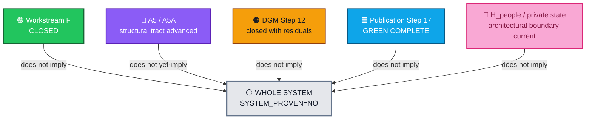
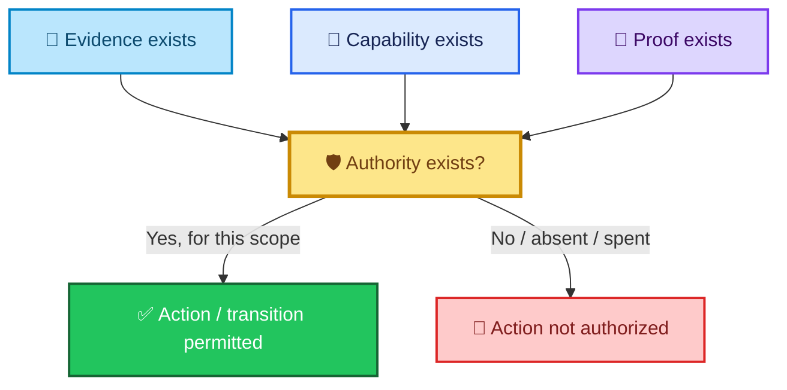
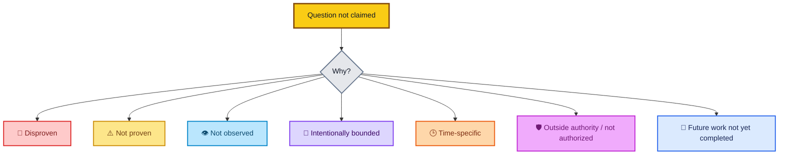

<div align="center">

# ALLIS — Nonclaims and Residuals

### Global claim boundaries, preserved residuals, negative results, and non-promotions

**Current boundary index · September 2026**

<br>


<br>

**Kidd’s Technical Services · ALLIS**

</div>

---

> [!IMPORTANT]
> This document records **what the current ALLIS evidence does not support claiming**.
>
> A nonclaim is not automatically a defect, failure, or unfinished task. It can be a deliberate scientific boundary, a preserved counterexample, a historical-only result, a point-in-time limit, an unobserved path, an authority boundary, or a workstream successor rule.

---

# 👀 Read this first

ALLIS distinguishes:

```text
not observed
≠
disproven
≠
not proven
≠
historical only
≠
bounded domain
≠
point-in-time
≠
outside the runtime model
≠
not authorized
≠
not yet established
```

Those states have different meanings.

A useful shorthand is:

```mermaid
flowchart TB
    A["⚠️ Claim boundary"]:::root

    B["👁️ NOT_OBSERVED<br/>path was not exercised"]:::observe
    C["🔴 DISPROVEN<br/>counterexample exists"]:::disprove
    D["📐 NOT_PROVEN<br/>theorem not established"]:::prove
    E["🕰️ HISTORICAL_ONLY<br/>valid only in prior domain"]:::history
    F["🎯 BOUNDED_DOMAIN<br/>result has limited scope"]:::bounded
    G["🕒 POINT_IN_TIME_BINDING<br/>correspondence is temporal"]:::time
    H["🛡️ EXTERNAL_TO_RUNTIME_MODEL<br/>authority comes from elsewhere"]:::external
    I["🚫 NOT_AUTHORIZED<br/>scope cannot self-expand"]:::auth
    J["🧩 NOT_ESTABLISHED<br/>required evidence stage not reached"]:::pending

    A --> B
    A --> C
    A --> D
    A --> E
    A --> F
    A --> G
    A --> H
    A --> I
    A --> J

    classDef root fill:#facc15,stroke:#854d0e,color:#111827,stroke-width:3px;
    classDef observe fill:#bae6fd,stroke:#0284c7,color:#0c4a6e,stroke-width:2px;
    classDef disprove fill:#fecaca,stroke:#dc2626,color:#7f1d1d,stroke-width:2px;
    classDef prove fill:#fde68a,stroke:#ca8a04,color:#713f12,stroke-width:2px;
    classDef history fill:#e5e7eb,stroke:#64748b,color:#374151,stroke-width:2px;
    classDef bounded fill:#ddd6fe,stroke:#7c3aed,color:#3b0764,stroke-width:2px;
    classDef time fill:#fed7aa,stroke:#ea580c,color:#7c2d12,stroke-width:2px;
    classDef external fill:#f0abfc,stroke:#c026d3,color:#701a75,stroke-width:2px;
    classDef auth fill:#fca5a5,stroke:#b91c1c,color:#7f1d1d,stroke-width:2px;
    classDef pending fill:#dbeafe,stroke:#2563eb,color:#172554,stroke-width:2px;
```



---

# 🎯 Purpose

`claims/nonclaims-and-residuals.md` is the global claim-boundary index for the repository.

Its purpose is to answer:

> **Which stronger statements are deliberately not made, what evidence fixes those limits, and what would have to change before a stronger claim could be considered?**

It complements:

```text
claims/claim-registry.md
```

which answers:

> **What may currently be claimed?**

Together:

```text
claim-registry.md
        +
nonclaims-and-residuals.md
        =
current claim envelope
```

---

# 🧭 Global boundary map



The three completed workstreams remain bounded.

The A5 proof tract remains incomplete at the theorem stage.

The private-state public record remains architectural rather than current-runtime authoritative.

---

# ⚪ Controlling whole-system boundary

The current repository does **not** claim:

```text
PRODUCTION_MUTATION_SAFETY_THEOREM_PROVEN=YES
```

It does **not** claim:

```text
WHOLE_SYSTEM_SAFETY_THEOREM_PROVEN=YES
```

It does **not** claim:

```text
SYSTEM_PROVEN=YES
```

The controlling statements remain:

```text
PRODUCTION_MUTATION_SAFETY_THEOREM_PROVEN=NO

WHOLE_SYSTEM_SAFETY_THEOREM_PROVEN=NO

SYSTEM_PROVEN=NO
```

These are deliberate claim boundaries.

They are not placeholders that disappear because multiple bounded workstreams closed successfully.

---

# 📚 Boundary families

| Family | Type | Current boundary |
|---|---|---|
| `SYS` | Whole-system | Bounded workstreams do not compose automatically into whole-system proof |
| `WF` | Workstream F | Closed scope cannot self-authorize successor proof work |
| `A5` | Mathematical tract | Final effect-sink/dominance theorem not yet established |
| `DGM` | Step 12 | Eight residuals + seven explicit non-promotions |
| `PUB` | Step 17 | Fixed publication goal complete; future capability not automatically authorized |
| `PRIV` | H_people/private state | Historical runtime evidence is not current runtime authority |
| `CORR` | Correspondence | Runtime/publication correspondence is point-in-time |
| `BASE` | Baseline identity | No single source object silently replaces all others |

---

# 🟠 Step-12 residual ledger

Step 12 closed with:

```text
8 residuals
7 explicit non-promotions
15 / 15 obligations adjudicated
0 unadjudicated
```

This distinction is essential:

```text
Unadjudicated = 0
```

and simultaneously:

```text
Residuals = 8
```

A residual is not necessarily an unanswered question.

It can be a fully adjudicated limitation that remains true after closure.

---

# `R12F-01` — Positive production path

### Classification

```text
NOT_OBSERVED
```

### Controlling statement

A real positive production authorization was not published, consumed, or applied during Step 12.

The final record preserves:

```text
REAL_PRODUCTION_AUTHORIZATION_PUBLICATION=NOT_PERFORMED
REAL_PRODUCTION_AUTHORIZATION_CONSUMPTION=NOT_PERFORMED
REAL_PRODUCTION_DGM_PATCH_APPLICATION=NOT_PERFORMED
```

### Meaning

The successful authorized-application theorem was machine-checked over the sealed source model.

The corresponding positive production path was not exercised live during Step 12.

Later successor evidence did not remove this boundary.

The post-A8 revalidation established current theorem-relevant source/runtime correspondence:

```text
CURRENT_POST_A8_DGM_SOURCE_TO_RUNTIME_CORRESPONDENCE=PASS_11_OF_11
```

but deliberately did **not** execute the positive authorized-apply production path:

```text
T12D_A_POSITIVE_AUTHORIZED_APPLY_EXECUTED=NO
T12D_A_CURRENT_CORRESPONDENCE_VERIFIED=NO
```

Therefore the positive-path non-observation remains current, not merely historical to Step 12.

Therefore:

```text
positive path modeled
    ≠
positive path observed live
```

### Claim consequence

```text
T12D-A = MACHINE_CHECKED
```

not:

```text
T12D-A = CORRESPONDENCE_VERIFIED
```

### What would be required to move this boundary

A governed workstream would need to authorize and evidence an appropriate positive live path, then establish theorem-specific correspondence without silently inheriting Step-12 authority.

---

# `R12F-02` — Terminalization

### Classification

```text
DISPROVEN
```

### Controlling statement

The unconditional terminal-totality proposition is false.

The proposed property:

```text
claimed
    ⇒
completed OR rejected
```

has a valid bounded counterexample:

```text
claimed
AND terminalization failure
    ⇒
claimed
```

### Meaning

A claimed record can remain claimed when final terminalization fails.

This is a negative result, not an unresolved one.

### Claim consequence

```text
P12C-09 = MACHINE_CHECKED_DISPROVEN
```

### Stronger claim not supported

```text
every claimed record is guaranteed to reach a terminal state
```

### What would be required to move this boundary

A later architecture could define and prove a narrower or repaired terminalization property.

That would be a new proposition.

It would not erase the historical falsification of `P12C-09`.

---

# `R12F-03` — General production mutation safety

### Classification

```text
NOT_PROVEN
```

### Controlling statement

The bounded authorized-adoption theorem does not establish a universal production-mutation safety theorem.

### Claim consequence

```text
PRODUCTION_MUTATION_SAFETY_THEOREM_PROVEN=NO
```

### Stronger claim not supported

```text
all production mutation paths are proven safe
```

### What would be required to move this boundary

A broader formal domain, explicit mutation-safety property, machine-checkable proof obligations, implementation correspondence, and—where required—runtime correspondence.

---

# `R12F-04` — Whole-system safety

### Classification

```text
NOT_PROVEN
```

### Controlling statement

The Step-12 formal object models the production authorized-adoption path.

It does not model the whole ALLIS architecture.

### Claim consequence

```text
WHOLE_SYSTEM_SAFETY_THEOREM_PROVEN=NO
SYSTEM_PROVEN=NO
```

### Stronger claim not supported

```text
the entire ALLIS system has been formally proven safe
```

---

# `R12F-05` — Historical D1R5 domain

### Classification

```text
HISTORICAL_ONLY
```

### Controlling statement

The predecessor D1R5 theorem remains legitimate historical evidence in its original bounded domain.

It is not directly promoted into the current production Step-12 domain.

### Meaning

```text
historical proof
    ≠
current production proof
```

A changed source, model, scope, or runtime must earn a new correspondence result.

---

# `R12F-06` — Bounded formal domain

### Classification

```text
BOUNDED_DOMAIN
```

### Controlling statement

`DGM_PRODUCTION_AUTHORIZED_ADOPTION_MODEL_V1` covers the sealed 11-file production authorized-adoption path.

It does not represent every ALLIS subsystem or transition.

### Stronger claim not supported

```text
formal model = whole ALLIS architecture
```

---

# `R12F-07` — Point-in-time correspondence

### Classification

```text
POINT_IN_TIME_BINDING
```

### Controlling statement

Step-12 runtime correspondence is established at the final seal boundary.

Conceptually:

```text
C_source-runtime(seal time) = PASS
```

does not imply:

```text
C_source-runtime(all future time) = PASS
```

### Meaning

A changed claim-bearing runtime must earn renewed correspondence.

### Stronger claim not supported

```text
once correspondence-verified
    ⇒
forever correspondence-verified
```

---

# `R12F-08` — External authorization authority

### Classification

```text
EXTERNAL_TO_RUNTIME_MODEL
```

### Controlling statement

The NBB and worker verify and consume external authorization.

They do not independently mint or sign private authorization authority within the bounded Step-12 runtime model.

### Meaning

```text
verification capability
    ≠
signing authority
```

and:

```text
runtime correspondence
    ≠
runtime sovereignty
```

---

# 🚫 Step-12 explicit non-promotions

Seven stronger claims were deliberately not promoted.

## `NP12-01` — T12D-A is not Correspondence-Verified

```text
T12D-A
    ↛
CORRESPONDENCE_VERIFIED
```

Reason:

```text
MachineChecked = YES
CurrentSourceRuntimeCorrespondence = PASS_11_OF_11
PostA8PositiveAuthorizedApplyExecuted = NO
RelevantPositiveLiveObservation = NO
```

The later post-A8 revalidation renewed the source/runtime edge but did **not** execute the positive authorized-apply production path.

Therefore:

```text
T12D-A = MACHINE_CHECKED
```

remains current and is not promoted to `CORRESPONDENCE_VERIFIED`.

---

## `NP12-02` — P12C-09 is not proven

```text
P12C-09
    ↛
PROVEN
```

Reason:

```text
P12C-09 = MACHINE_CHECKED_DISPROVEN
```

The counterexample remains part of the permanent record.

---

## `NP12-03` — Historical D1R5 is not current production proof

```text
historical D1R5
    ↛
current production proof
```

Historical validity is preserved without source-domain inflation.

---

## `NP12-04` — Bounded proof does not establish general production mutation safety

```text
current bounded proof
    ⇏
ProductionMutationSafety
```

---

## `NP12-05` — Bounded proof does not establish whole-system safety

```text
current bounded proof
    ⇏
WholeSystemSafety
```

---

## `NP12-06` — Bounded proof does not establish SYSTEM_PROVEN

```text
current bounded proof
    ⇏
SYSTEM_PROVEN
```

The controlling state remains:

```text
SYSTEM_PROVEN=NO
```

---

## `NP12-07` — Machine-checked positive path is not live-positive-path observation

```text
MachineCheckedPositivePath
    ⇏
LivePositivePathObserved
```

A theorem over the production source model does not manufacture a production event that did not occur.

---

# 🧭 Current post-A8 DGM nonclaims

The later post-A8 work strengthened the current evidence for the bounded DGM theorem domain.

It did **not** expand the theorem domain into a general production-mutation theorem or a whole-system theorem.

The current theorem state remains:

```text
T12D-A = MACHINE_CHECKED
T12D-B = CORRESPONDENCE_VERIFIED
T12D-C = CORRESPONDENCE_VERIFIED
P12C-09 = MACHINE_CHECKED_DISPROVEN
```

## `DGM-NC-07` — Current B/C correspondence does not prove general production-mutation safety

Current post-A8 evidence supports theorem-specific correspondence for `T12D-B` and `T12D-C`.

It does not establish:

```text
PRODUCTION_MUTATION_SAFETY_THEOREM_PROVEN=YES
```

The current controlling state remains:

```text
PRODUCTION_MUTATION_SAFETY_THEOREM_PROVEN=NO
```

The B/C observations are bounded fail-closed observations over the qualified authorized-adoption path.

They do not prove every production mutation path safe.

---

## `DGM-NC-08` — Current B/C correspondence does not prove whole-system safety

Current `T12D-B` / `T12D-C` correspondence verification does not establish:

```text
WHOLE_SYSTEM_SAFETY_THEOREM_PROVEN=YES
```

and does not establish:

```text
SYSTEM_PROVEN=YES
```

The controlling states remain:

```text
WHOLE_SYSTEM_SAFETY_THEOREM_PROVEN=NO
SYSTEM_PROVEN=NO
```

A theorem-specific live observation does not silently widen its formal domain.

---

# 🔴 Why the disproven result remains visible

```mermaid
flowchart LR
    A["📝 Proposed property"]:::claim
    B["📐 Formalized"]:::formal
    C["🤖 Machine checked"]:::check
    D["🔴 Counterexample found"]:::counter
    E["🧾 Preserved as DISPROVEN"]:::preserve
    F["🔧 Later narrower/repaired property<br/>may be studied separately"]:::future

    A --> B --> C --> D --> E --> F

    classDef claim fill:#dbeafe,stroke:#2563eb,color:#172554,stroke-width:2px;
    classDef formal fill:#ddd6fe,stroke:#7c3aed,color:#3b0764,stroke-width:2px;
    classDef check fill:#fde68a,stroke:#ca8a04,color:#713f12,stroke-width:2px;
    classDef counter fill:#fecaca,stroke:#dc2626,color:#7f1d1d,stroke-width:3px;
    classDef preserve fill:#facc15,stroke:#854d0e,color:#111827,stroke-width:2px;
    classDef future fill:#bae6fd,stroke:#0284c7,color:#0c4a6e,stroke-width:2px;
```



A later repair does not turn the original falsified statement into a true historical statement.

The original result remains:

```text
P12C-09 = DISPROVEN
```

---

# 📐 A5 / A5A nonclaims

The A5 tract has advanced beyond domain freezing and graph construction.

Current established structural state includes:

```text
4 qualified root/component pairs
102 CFG nodes
107 CFG edges
0 unsupported control flow

canonical graph SHA-256:
08327d6fc77a1c5d18fd1d086b71b0ad95aa0cd86db652052e33cc3e0296cb66
```

A5A reduced:

```text
76 broad effect candidates
    ↓
47 source-bound / structural candidates
29 unresolved source symbols
```

The latest sealed A5A2V2 result is:

```text
MATHAUDIT09A5A2V2_RESULT=COMPLETE
```

But the tract has **not** yet reached the final wiring theorem.

---

## `A5-NC-01` — Effect-sink set is not yet final

The 47 source-bound/structural candidates are not automatically the final protected-effect sink set.

```text
source-bound candidate
    ≠
final protected effect sink
```

The next bounded step is:

```text
MATHAUDIT09A5B_ADJUDICATE_EFFECT_SINKS_
USING_CANONICAL_A5_GRAPH_HASH_AND_SEALED_A5A_REDUCTION
```

---

## `A5-NC-02` — No dominance/cut theorem yet

Current evidence does not support claiming:

```text
DOMINATOR_OR_CUT_TEST_PERFORMED=YES
```

The dominance/cut stage has not yet been completed.

---

## `A5-NC-03` — No mathematical proof yet

Current evidence does not support:

```text
A5_FINAL_WIRING_THEOREM_PROVEN=YES
```

The tract is structurally prepared for the later theorem.

It is not yet at the theorem.

---

## `A5-NC-04` — No machine-checked theorem yet for this tract

The A5/A5A structural work is not itself the final machine-checked proof.

```text
graph frozen
    ≠
theorem machine-checked
```

---

## `A5-NC-05` — No runtime/system correspondence yet

Current A5 evidence does not establish:

```text
A5_RUNTIME_CORRESPONDENCE=PASS
```

or:

```text
A5_SYSTEM_LEVEL_CLAIM=PROVEN
```

The planned proof progression remains:

```text
A4F1 domain freeze
    ↓
A5 directed CFG freeze
    ↓
A5A semantic reduction
    ↓
A5A provenance closeout
    ↓
A5B effect-sink adjudication
    ↓
dominance / cut theorem
    ↓
formal / machine-checked proof
    ↓
source correspondence
    ↓
runtime correspondence
    ↓
system-level claim
```

Current position is before the dominance/cut theorem.

---

# 🟢 Workstream-F nonclaims

Workstream F is genuinely and formally:

```text
CLOSED
```

That closure still has boundaries.

## `WF-NC-01` — Close eligibility is not close authority

Workstream-F proof completion established close eligibility.

It did not create formal-close authority.

```text
5 / 5 proof obligations
    ⇒
close eligible
```

but not:

```text
5 / 5 proof obligations
    ⇒
self-authorized close
```

A separately sealed one-use formal-close authority was required.

---

## `WF-NC-02` — Closed Workstream F is not whole-system proof

```text
WORKSTREAM_F_STATUS=CLOSED
    ≠
SYSTEM_PROVEN=YES
```

Workstream F closes its own accepted scope.

---

## `WF-NC-03` — Closed F does not authorize more F execution

The controlling final state is:

```text
FURTHER_WORKSTREAM_F_PROOF_EXECUTION_AUTHORIZED=NO
```

and:

```text
NEXT_STEP=
WORKSTREAM_F_COMPLETE_AWAIT_SEPARATE_NEXT_SCOPE_AUTHORITY
```

Therefore:

```text
closed workstream
    ≠
open-ended successor authority
```

---

## `WF-NC-04` — The F baseline does not replace later role-specific objects

The Workstream-F qualified source:

```text
65b9f7dbd594ec9d225152aabd705eefc9216dbb
```

does not automatically replace:

```text
A5 proof/source anchor 35f1...
Step-12 production source 20c8...
Step-17 publication/runtime identities
```

Object role remains part of authority.

---

# 🌐 Publication Step-17 nonclaims

Publication Step 17 is:

```text
GREEN_COMPLETE
```

for its fixed goal.

That does not create a general public-control or future-development claim.

---

## `PUB-NC-01` — Publication is not unrestricted ALLIS access

The fixed goal established:

```text
STRICT_READ_ONLY_PUBLICATION_BOUNDARY=GREEN
NO_PUBLIC_MUTATION_ENDPOINT=GREEN
GUI_NO_DIRECT_ALLIS_ACCESS=GREEN
```

Therefore the repository does not claim:

```text
public GUI
    =
general ALLIS control interface
```

---

## `PUB-NC-02` — Public availability does not create mutation authority

```text
publicly retrievable
    ≠
publicly mutable
```

The publication plane is a governed outward projection.

It is not a write plane.

---

## `PUB-NC-03` — Final network continuity is not permanent availability

At final observation:

```text
FINAL_NETWORK_CONTINUITY=GREEN
```

That does not mean:

```text
network availability guaranteed forever
```

The continuity claim is time-specific.

---

## `PUB-NC-04` — The recovered DNS event is not a current failure

The earlier DNS timeout was classified:

```text
TRANSIENT_EXTERNAL_NAME_RESOLUTION_FAILURE_RECOVERED
```

Final state:

```text
FINAL_NETWORK_CONTINUITY=GREEN
PRODUCTION_REPAIR_REQUIRED=NO
```

Therefore the repository should not preserve the transient timeout as if it were the current production state.

Historical failure evidence remains evidence.

It is not the current claim.

---

## `PUB-NC-05` — Step-17 completion does not authorize arbitrary new capability

There is:

```text
NO STEP 18
```

for the completed fixed goal.

New scope requires a new governed workstream.

Examples include:

- new publication contents;
- new public claims;
- expanded GUI functions;
- write-capable workflows;
- Ms. Allis interaction;
- additional public endpoints;
- broader authority surfaces.

---

## `PUB-NC-06` — Final closeout nonmutation is not a claim about all prior implementation

The final Step-17 close recorded no production mutation.

That means:

```text
final closeout mutation = NO
```

It does not mean:

```text
all earlier implementation work was nonmutating
```

The claim remains bounded to the final close operation.

---

# 👤 H_people / private-state nonclaims

The current public record supports the privacy/disclosure architecture.

It does not promote historical auth runtime evidence into a current runtime-authoritative H_people claim.

---

## `PRIV-NC-01` — Information existence is not identity authority

```text
private state exists
    ≠
identity established
```

Person-linked information does not grant its own identity or subject relationship.

---

## `PRIV-NC-02` — Identity is not disclosure authority

```text
identity established
    ≠
use authority established
    ≠
disclosure authority established
```

---

## `PRIV-NC-03` — Disclosure authority is not retention authority

```text
authorized to disclose
    ≠
authorized to retain
```

These are separately governed decisions.

---

## `PRIV-NC-04` — Private state is not common/public state

```text
private person-linked state
    ≠
common packet state
    ≠
public publication state
```

Only an authorized minimized derivative may cross the protected boundary where policy permits.

---

## `PRIV-NC-05` — Historical Gate05c runtime is not current H_people runtime authority

Historical Gate05c evidence remains useful provenance.

The current public record does not claim:

```text
historical Gate05c runtime
    =
current H_people runtime authority
```

Current-runtime H_people correspondence has not been promoted.

---

# 🧷 Semantic-commitment nonclaims

The corrected DGM model establishes a broad security rule:

> **Every authority-bearing semantic input must be committed where the authorization decision depends on it.**

The candidate envelope includes bounded semantic context such as:

```text
proposal
target
expected prestate
candidate content
evaluation
scores
expected tests
```

But the evidence boundary matters.

---

## `SEM-NC-01` — Signature validity is not semantic completeness

```text
valid signature
    ≠
complete semantic commitment
```

A signature can be cryptographically valid while omitting semantics that affect the governed decision.

---

## `SEM-NC-02` — Presence in the envelope does not prove equal authority-bearing status

The engineering record directly established that `scores` can influence governed acceptance.

The current record should not silently state that every listed envelope field has independently demonstrated identical authority-bearing significance.

The general rule is conditional:

```text
if authorization depends on semantic input X
    ⇒
X must be committed
```

---

# 🧱 Composite-baseline nonclaims

ALLIS does not have one universal current baseline commit.

The current technical state is composite.

---

## `BASE-NC-01` — A5 source anchor is not the whole ALLIS baseline

```text
35f1aa5586e1a23e1ab88f4d757c451b44506893
```

is an A5 proof/source anchor.

It is not the universal current-system source identity.

---

## `BASE-NC-02` — Workstream-F baseline is not every later source

```text
65b9f7dbd594ec9d225152aabd705eefc9216dbb
```

is the Workstream-F qualified baseline.

It does not silently replace role-specific later objects.

---

## `BASE-NC-03` — Step-12 production source is not the whole ALLIS baseline

```text
20c8cbe175781c8a1c05d65c03977859ceca884a
```

is the Step-12 production DGM source.

It does not identify the entire current ALLIS technical state.

---

## `BASE-NC-04` — Publication identity is not source-code baseline

```text
allis-publication-step6-retention-v2
```

and:

```text
d6ab63522f9080fae440578ebbb6ed42140595155c9a30253f5b8eeeef8009b7
```

identify the Step-17 publication object.

They are not source-code identities.

---

# 🔗 Correspondence nonclaims

Correspondence is always relationship-specific.


---

## `CORR-NC-01` — Formal proof is not implementation correspondence

```text
formal theorem
    ≠
source correspondence
```

A model earns authority as a description only through explicit mapping to the source it claims to describe.

---

## `CORR-NC-02` — Source correspondence is not runtime correspondence

```text
formal ↔ source
    ≠
source ↔ runtime
```

Each edge requires its own evidence.

---

## `CORR-NC-03` — Runtime correspondence is not theorem-specific live observation

This distinction is why `T12D-A` remains Machine-Checked.

```text
matching runtime source
    ≠
relevant positive behavior observed
```

---

## `CORR-NC-04` — Publication correspondence is not permanent

Step-17 direct/public body correspondence passed at the final observation.

It does not automatically bind a future changed publication.

---

## `CORR-NC-05` — Current 11/11 source/runtime bytes do not by themselves prove theorem behavior

The post-A8 revalidation established:

```text
IMMUTABLE_SOURCE_IDENTITY=PASS_11_OF_11
NBB_SOURCE_TO_RUNTIME_CORRESPONDENCE=PASS_11_OF_11
WORKER_SOURCE_TO_RUNTIME_CORRESPONDENCE=PASS_11_OF_11
CURRENT_POST_A8_DGM_SOURCE_TO_RUNTIME_CORRESPONDENCE=PASS_11_OF_11
```

Those byte/source-runtime relationships establish the current implementation identity relationship for the bounded 11-file set.

They do **not**, by themselves, establish theorem-specific runtime behavior.

Conceptually:

```text
current source/runtime byte correspondence
    ≠
theorem-specific live behavior observed
```

That is why `T12D-B` required a separate invalid-signature live observation and `T12D-C` required a separate empty-spool live observation before their current `CORRESPONDENCE_VERIFIED` status was supported.

It is also why the current 11/11 source/runtime result does not promote `T12D-A`, whose positive authorized-apply observation remains unexecuted.

---

# 🔐 Authority nonclaims

Across ALLIS, evidence and capability do not create their own permission.



The repository therefore does not infer:

```text
evidence exists
    ⇒
execution authorized
```

or:

```text
component can act
    ⇒
component may act
```

or:

```text
workstream complete
    ⇒
successor work authorized
```

---

# 📋 Global nonclaim index

| ID | Stronger claim not made | Boundary type | Current basis |
|---|---|---|---|
| `SYS-NC-01` | `SYSTEM_PROVEN=YES` | `NOT_PROVEN` | bounded workstreams |
| `SYS-NC-02` | Whole-system safety theorem proven | `NOT_PROVEN` | Step-12 residual |
| `SYS-NC-03` | General production mutation safety theorem proven | `NOT_PROVEN` | Step-12 residual |
| `WF-NC-01` | F proof completion created close authority | authority boundary | separate close authority |
| `WF-NC-02` | Workstream F close proves whole system | bounded scope | F close |
| `WF-NC-03` | Closed F authorizes more F proof execution | `NOT_AUTHORIZED` | F successor state |
| `WF-NC-04` | `65b9…` replaces later role-specific objects | object-role boundary | composite baseline |
| `A5-NC-01` | 47 candidates are final effect sinks | `NOT_ESTABLISHED` | A5A stage |
| `A5-NC-02` | Dominance/cut test complete | `NOT_ESTABLISHED` | next step A5B |
| `A5-NC-03` | Final A5 wiring theorem proven | `NOT_PROVEN` | theorem stage not reached |
| `A5-NC-04` | A5 final theorem machine-checked | `NOT_ESTABLISHED` | proof stage not reached |
| `A5-NC-05` | A5 runtime/system correspondence established | `NOT_ESTABLISHED` | correspondence stage not reached |
| `DGM-NC-01` | T12D-A Correspondence-Verified | `NOT_OBSERVED` | positive live path absent |
| `DGM-NC-02` | P12C-09 proven | `DISPROVEN` | preserved counterexample |
| `DGM-NC-03` | Historical D1R5 is current production proof | `HISTORICAL_ONLY` | source/domain change |
| `DGM-NC-04` | Step-12 model covers whole platform | `BOUNDED_DOMAIN` | 11-file path |
| `DGM-NC-05` | Runtime can mint private authorization | `EXTERNAL_TO_RUNTIME_MODEL` | authority architecture |
| `DGM-NC-06` | Step-12 close authorizes successor work | `NOT_AUTHORIZED` | final successor state |
| `DGM-NC-07` | Current B/C correspondence proves general production mutation safety | `NOT_PROVEN` | bounded B/C theorem-specific correspondence |
| `DGM-NC-08` | Current B/C correspondence proves whole-system safety / `SYSTEM_PROVEN` | `NOT_PROVEN` | bounded theorem domain |
| `PUB-NC-01` | Public GUI is unrestricted ALLIS control | boundary | read-only publication |
| `PUB-NC-02` | Public retrieval creates mutation authority | authority boundary | no public mutation endpoint |
| `PUB-NC-03` | Network continuity is permanent | `POINT_IN_TIME_BINDING` | final observation only |
| `PUB-NC-04` | Recovered DNS timeout is current red state | superseded historical event | R2-R2 final state |
| `PUB-NC-05` | Step 17 authorizes arbitrary new capability | `NOT_AUTHORIZED` | no Step 18 |
| `PUB-NC-06` | Final nonmutation means all earlier work was nonmutating | bounded observation | final close only |
| `PRIV-NC-01` | Private data existence establishes identity | authority boundary | privacy architecture |
| `PRIV-NC-02` | Identity establishes disclosure authority | authority boundary | privacy architecture |
| `PRIV-NC-03` | Disclosure establishes retention authority | authority boundary | privacy architecture |
| `PRIV-NC-04` | Private state automatically enters common/public lanes | `NOT_AUTHORIZED` | H_people boundary |
| `PRIV-NC-05` | Historical Gate05c runtime is current H_people authority | current non-promotion | no current runtime promotion |
| `SEM-NC-01` | Valid signature proves complete semantic commitment | security boundary | semantic commitment rule |
| `SEM-NC-02` | All listed envelope fields have equal demonstrated authority role | evidence boundary | only decision-bearing semantics qualify |
| `BASE-NC-01` | `35f1…` is whole current baseline | role boundary | A5 source anchor |
| `BASE-NC-02` | `65b9…` is every later baseline | role boundary | Workstream-F source |
| `BASE-NC-03` | `20c8…` is whole current baseline | role boundary | Step-12 source |
| `BASE-NC-04` | publication SHA is source baseline | object-type boundary | Step-17 publication |
| `CORR-NC-01` | Formal proof automatically maps to source | correspondence boundary | explicit model→source edge required |
| `CORR-NC-02` | Source match automatically maps to runtime | correspondence boundary | explicit source→runtime edge required |
| `CORR-NC-03` | Runtime source match equals theorem-specific observation | observation boundary | theorem-specific live evidence required |
| `CORR-NC-04` | Publication correspondence is permanent | `POINT_IN_TIME_BINDING` | Step-17 observation |
| `CORR-NC-05` | Current 11/11 source/runtime byte match by itself proves theorem-specific runtime behavior | observation boundary | B/C required separate live observations |

---

# 🧾 Residual vs nonclaim vs future work

These terms are intentionally different.

| Term | Meaning |
|---|---|
| **Residual** | A limitation preserved as part of a closed workstream |
| **Non-promotion** | A stronger claim that evidence deliberately did not earn |
| **Disproven proposition** | A formally tested statement for which a counterexample exists |
| **Historical-only result** | Valid evidence whose original domain does not equal the current domain |
| **Future work** | A new bounded task that has not yet been completed |
| **Successor authority boundary** | A closed scope cannot authorize its own extension |
| **Current-runtime non-promotion** | Historical implementation evidence exists, but current correspondence has not been established |
| **Point-in-time boundary** | A correspondence or runtime observation is true at a recorded observation boundary, not eternally |

---

# 🧠 A nonclaim is not always “missing”



The repository should not rewrite every nonclaim as “unfinished.”

That would erase the difference between:

- falsification;
- bounded scope;
- non-observation;
- missing proof;
- historical provenance;
- temporal limitation; and
- lack of authority.

---

# 🔄 How a nonclaim may change

A boundary changes only when new evidence actually earns the change.

```mermaid
flowchart LR
    A["🚫 Current stronger claim not supported"]:::no
    B["🎯 Define new bounded question"]:::scope
    C["🛡️ Establish authority"]:::auth
    D["🧾 Produce evidence"]:::evidence
    E["📐 Prove / observe / correspond<br/>as required"]:::validate
    F{"Boundary earned?"}:::decision
    G["✅ Update claim registry"]:::yes
    H["⚠️ Preserve existing boundary"]:::keep

    A --> B --> C --> D --> E --> F
    F -- "Yes" --> G
    F -- "No" --> H

    classDef no fill:#fecaca,stroke:#dc2626,color:#7f1d1d,stroke-width:2px;
    classDef scope fill:#bae6fd,stroke:#0284c7,color:#0c4a6e,stroke-width:2px;
    classDef auth fill:#fde68a,stroke:#ca8a04,color:#713f12,stroke-width:2px;
    classDef evidence fill:#dbeafe,stroke:#2563eb,color:#172554,stroke-width:2px;
    classDef validate fill:#ddd6fe,stroke:#7c3aed,color:#3b0764,stroke-width:2px;
    classDef decision fill:#facc15,stroke:#854d0e,color:#111827,stroke-width:3px;
    classDef yes fill:#22c55e,stroke:#166534,color:#ffffff,stroke-width:2px;
    classDef keep fill:#e5e7eb,stroke:#64748b,color:#374151,stroke-width:2px;
```



A newer date, newer file, or newer commit is not enough by itself.

---

# 🗂️ Relationship to `claim-registry.md`

The two claims documents form a pair.

```text
claim-registry.md
    ↓
What can we say?

nonclaims-and-residuals.md
    ↓
What can we not say, and why?
```

For each important claim family:

| Claim registry | Nonclaim/residual registry |
|---|---|
| `WF-*` | `WF-NC-*` |
| `A5-*` | `A5-NC-*` |
| `DGM-*` | `R12F-*`, `NP12-*`, `DGM-NC-*` |
| `PUB-*` | `PUB-NC-*` |
| `PRIV-*` | `PRIV-NC-*` |
| `SYS-*` | `SYS-NC-*` |

---

# 📚 Evidence ownership

This global document does not replace workstream-local evidence.

## Step 12

The canonical Step-12 residual ledger remains:

```text
evidence/governed-evolution/residuals.md
```

The controlling final seal remains:

```text
evidence/governed-evolution/step12-final-seal.md
```

The final seal identity is:

```text
b00a954a924d3aa3490a5bcb8d4473da2b6885b8c41e116cf03545fee975c23b
```

Later successor evidence is owned separately:

```text
formal-verification/authorized-adoption/lean/workstream-closeout-r1.md
```

and:

```text
evidence/governed-evolution/post-a8-theorem-correspondence-registry-r1.md
```

Those records strengthen the current evidence basis without rewriting the historical Step-12 residual ledger or final seal.

## Workstream F

Use:

```text
acceptance/closeout/workstream-f-close.md
```

for the closed-state and successor-authority evidence.

## Publication Step 17

Use:

```text
acceptance/closeout/publication-step17-close.md
```

for fixed-goal close, network continuity, publication identity, and successor rule.

## A5

Use the sealed A5/A5A engineering evidence for structural graph and semantic-reduction state.

The theorem stage is not silently supplied by this document.

---

# 📦 Normalized boundary registry

```yaml
allis_nonclaims_and_residuals:

  system:
    production_mutation_safety_theorem_proven: false
    whole_system_safety_theorem_proven: false
    system_proven: false

  workstream_f:
    status: CLOSED
    whole_system_proof_from_close: false
    further_same_scope_proof_execution_authorized: false
    successor_requires_separate_authority: true
    baseline_replaces_all_later_objects: false

  a5:
    graph_construction_closed: true
    canonical_graph_sha256: 08327d6fc77a1c5d18fd1d086b71b0ad95aa0cd86db652052e33cc3e0296cb66
    effect_candidates:
      broad: 76
      source_bound_or_structural: 47
      unresolved: 29
    final_effect_sink_set_established: false
    dominance_cut_test_completed: false
    final_mathematical_theorem_proven: false
    final_machine_checked_theorem: false
    runtime_correspondence_established: false

  dgm_step12:
    status: GREEN_CLOSED_WITH_EXPLICIT_RESIDUALS

    residuals:
      R12F-01: NOT_OBSERVED
      R12F-02: DISPROVEN
      R12F-03: NOT_PROVEN
      R12F-04: NOT_PROVEN
      R12F-05: HISTORICAL_ONLY
      R12F-06: BOUNDED_DOMAIN
      R12F-07: POINT_IN_TIME_BINDING
      R12F-08: EXTERNAL_TO_RUNTIME_MODEL

    non_promotions:
      T12D_A_correspondence_verified: false
      P12C_09_proven: false
      historical_D1R5_promoted_to_current_production: false
      general_production_mutation_safety_proven: false
      whole_system_safety_proven: false
      system_proven: false
      live_positive_authorized_apply_observed: false

    current_post_a8_boundary:
      source_runtime_correspondence: PASS_11_OF_11
      T12D_A_positive_authorized_apply_executed: false
      T12D_A_correspondence_verified: false
      T12D_B_correspondence_verified: true
      T12D_C_correspondence_verified: true
      B_C_correspondence_proves_general_production_mutation_safety: false
      B_C_correspondence_proves_whole_system_safety: false
      production_mutation_safety_theorem_proven: false
      whole_system_safety_theorem_proven: false
      system_proven: false

  publication_step17:
    fixed_goal: GREEN_COMPLETE
    public_mutation_endpoint: false
    unrestricted_gui_allis_access: false
    permanent_network_continuity_claim: false
    transient_dns_failure_is_current_state: false
    automatic_step18: false
    arbitrary_future_implementation_authorized: false

  private_state:
    state_existence_equals_identity_authority: false
    identity_equals_disclosure_authority: false
    disclosure_equals_retention_authority: false
    private_state_auto_enters_public_lane: false
    historical_gate05c_equals_current_runtime_authority: false

  semantic_commitment:
    signature_validity_equals_semantic_completeness: false
    all_envelope_fields_independently_proven_equally_authority_bearing: false

  correspondence:
    formal_proof_equals_source_correspondence: false
    source_correspondence_equals_runtime_correspondence: false
    runtime_source_match_equals_theorem_specific_live_observation: false
    current_11_of_11_source_runtime_bytes_prove_behavior_by_themselves: false
    T12D_B_required_separate_live_observation: true
    T12D_C_required_separate_live_observation: true
    correspondence_is_permanent: false

  baseline:
    single_universal_current_commit: false
    a5_anchor_is_whole_system_baseline: false
    workstream_f_baseline_is_all_later_baselines: false
    step12_source_is_whole_system_baseline: false
    publication_identity_is_source_code_baseline: false
```

> [!NOTE]
> This YAML block is a human-readable global index. Workstream-local seals, evidence, correspondence, and closeout records remain authoritative for their own bounded results.

---

# 📚 Related repository records

## Claims

- [`claim-registry.md`](claim-registry.md) — current supported claims

## Acceptance

- [`../acceptance/current-system-manifest.md`](../acceptance/current-system-manifest.md)
- [`../acceptance/baseline-object-registry.md`](../acceptance/baseline-object-registry.md)
- [`../acceptance/closeout/workstream-f-close.md`](../acceptance/closeout/workstream-f-close.md)
- [`../acceptance/closeout/dgm-step12-close.md`](../acceptance/closeout/dgm-step12-close.md)
- [`../acceptance/closeout/publication-step17-close.md`](../acceptance/closeout/publication-step17-close.md)

## Step-12 and successor DGM evidence

- [`../evidence/governed-evolution/residuals.md`](../evidence/governed-evolution/residuals.md)
- [`../evidence/governed-evolution/step12-final-seal.md`](../evidence/governed-evolution/step12-final-seal.md)
- [`../evidence/governed-evolution/post-a8-theorem-correspondence-registry-r1.md`](../evidence/governed-evolution/post-a8-theorem-correspondence-registry-r1.md)

## Formal verification

- [`../formal-verification/authorized-adoption/theorem-registry.md`](../formal-verification/authorized-adoption/theorem-registry.md)
- [`../formal-verification/authorized-adoption/counterexample-registry.md`](../formal-verification/authorized-adoption/counterexample-registry.md)
- [`../formal-verification/authorized-adoption/lean/workstream-closeout-r1.md`](../formal-verification/authorized-adoption/lean/workstream-closeout-r1.md)

## Current state

- [`../CURRENT.md`](../CURRENT.md)

---

# 🧾 Current boundary summary

<div align="center">

### 🟢 Workstream F
**CLOSED**

but

**NOT WHOLE-SYSTEM PROOF**

---

### 📐 A5 / A5A
**STRUCTURAL GRAPH + SEMANTIC REDUCTION ESTABLISHED**

but

**FINAL DOMINANCE / CUT THEOREM NOT YET CLAIMED**

---

### 🟠 DGM Step 12
**GREEN CLOSED WITH EXPLICIT RESIDUALS**

**8 residuals · 7 historical Step-12 non-promotions**

**Current successor evidence: B/C correspondence revalidated · A positive path still not observed**

---

### 🟦 Publication Step 17
**GREEN COMPLETE**

but

**NO AUTOMATIC STEP 18**

---

### 👤 Private state
**ARCHITECTURAL PRIVACY BOUNDARY CURRENT**

but

**HISTORICAL GATE05C ≠ CURRENT H_people RUNTIME AUTHORITY**

---

### ⚪ Whole system

# `SYSTEM_PROVEN=NO`

</div>

---

# Governing boundary principles

> **A completed workstream does not gain authority to make a stronger claim merely because it is complete.**

> **A residual can be fully adjudicated and still remain true after closure.**

> **A counterexample remains evidence even after later architectural repair.**

> **Historical validity does not silently become current validity.**

> **A bounded proof does not become a whole-system proof.**

> **Machine-Checked does not become Correspondence-Verified without the required live evidence.**

> **Current 11/11 source/runtime byte correspondence does not by itself prove theorem-specific runtime behavior.**

> **Current B/C correspondence verification does not establish a general production-mutation safety theorem or a whole-system theorem.**

> **Correspondence is time-specific.**

> **Evidence does not create execution authority.**

> **A closed workstream does not authorize its own successor.**

> **Current truth is assembled from qualified objects and explicit correspondence—not inferred from whichever artifact is newest.**
