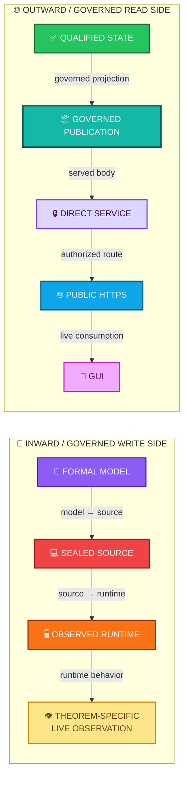
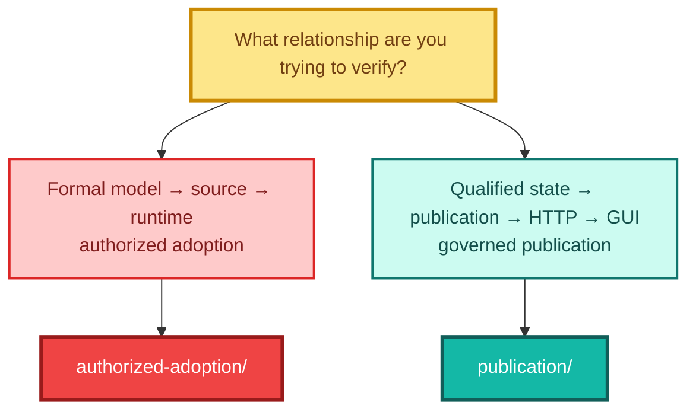
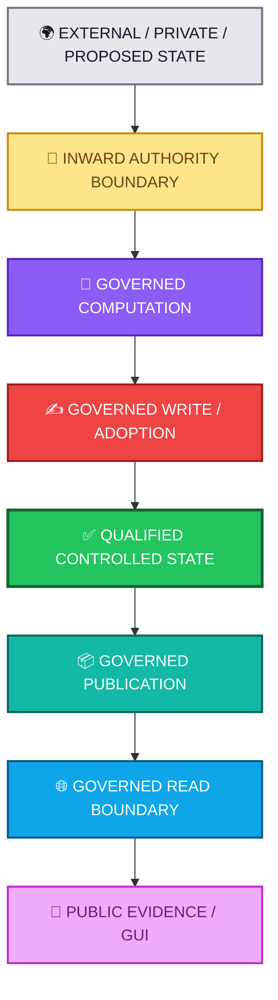

<div align="center">

# ALLIS — Correspondence

### Evidence-backed relationships among formal models, qualified objects, runtime state, publication, and public presentation

<br>


<br>

**Kidd’s Technical Services · ALLIS**

</div>

---

> [!IMPORTANT]
> The correspondence layer answers:
>
> **When a claim moves from one technical representation to another, what evidence establishes that the two objects are related in the way the claim requires?**
>
> Correspondence does not make different objects identical.
>
> It does not create authority.
>
> It does not convert a bounded result into a whole-system proof.

---

# 👀 Correspondence in one view

ALLIS currently preserves two distinct correspondence directions.



These are different correspondence packages.

Neither replaces the other.

---

# 🎯 Purpose

The correspondence layer exists because a valid claim in one representation does not silently become a valid claim in another.

For example:

```text
formal model exists
    ≠
source implements the model
```

```text
source implements the model
    ≠
runtime is running that source
```

```text
runtime contains the source
    ≠
required behavior was observed
```

```text
qualified state exists
    ≠
state is eligible for publication
```

```text
publication exists
    ≠
public route serves that publication
```

```text
public endpoint serves publication
    ≠
GUI consumes it correctly
```

Correspondence establishes the required bridge between those states.

---

# 📁 Current correspondence packages

```text
correspondence/
├── README.md
│
├── authorized-adoption/
│   ├── model-to-source.md
│   └── source-to-runtime.md
│
└── publication/
    └── source-to-publication-to-http-to-gui.md
```

The packages serve different technical purposes.

| Package                | Workstream | Direction                    | Primary question                                                                                                 |
| ---------------------- | ---------- | ---------------------------- | ---------------------------------------------------------------------------------------------------------------- |
| `authorized-adoption/` | Step 12    | Inward / governed write side | Does the bounded formal model correspond to the sealed production source and inspected runtime?                  |
| `publication/`         | Step 17    | Outward / governed read side | Does qualified state correspond through governed publication, direct service, public HTTPS, and GUI consumption? |

---

# 🧭 Which correspondence package should I read?



---

# 🔐 Package 1 — Authorized adoption

The authorized-adoption package records the bounded correspondence history for:

```text
DGM_PRODUCTION_AUTHORIZED_ADOPTION_MODEL_V1
```

That history now contains two distinct observation epochs:

```text
Step-12 final-seal correspondence
    =
historical predecessor evidence
```

and:

```text
post-A8 source/runtime + theorem-specific B/C live revalidation
    =
newest current theorem-correspondence evidence
```

The later epoch is additive successor evidence. It does not rewrite the historical Step-12 final seal.

The controlling production source identity is:

```text
20c8cbe175781c8a1c05d65c03977859ceca884a
```

This source has a specific role in the current ALLIS object registry:

```text
REG-D1201
=
Step-12 production DGM source
```

It is not a universal ALLIS source identity.

---

## Model → source

Record:

[`authorized-adoption/model-to-source.md`](authorized-adoption/model-to-source.md)

This correspondence boundary asks:

> **Does the bounded formal model map to behavior implemented by the sealed Step-12 production source?**

Conceptually:

```math
C_{FS}(F,S)=1
```

where:

```text
F = bounded formal object
S = sealed production source object
```

The mapping includes formal concepts such as:

* candidate;
* authorization;
* signature verification;
* NBB validation;
* authorized publication;
* worker claim;
* target validation;
* prestate validation;
* one-use authority;
* governed application;
* receipt;
* terminalization.

The correspondence establishes the required relationship between formal semantics and implementation.

It does not mean:

```text
formal object
    =
source code
```

---

## Source → runtime

Record:

[`authorized-adoption/source-to-runtime.md`](authorized-adoption/source-to-runtime.md)

This boundary asks:

> **Was the sealed Step-12 production source actually represented in the inspected runtime?**

At the final Step-12 observation:

```text
NBB source correspondence     11/11 PASS

Worker source correspondence  11/11 PASS
```

That remains the historical predecessor observation.

A later post-A8 revalidation established the current theorem-relevant source/runtime relationship:

```text
IMMUTABLE_SOURCE_IDENTITY=PASS_11_OF_11

NBB_SOURCE_TO_RUNTIME_CORRESPONDENCE=PASS_11_OF_11

WORKER_SOURCE_TO_RUNTIME_CORRESPONDENCE=PASS_11_OF_11

CURRENT_POST_A8_DGM_SOURCE_TO_RUNTIME_CORRESPONDENCE=PASS_11_OF_11
```

This later result is the newest current source/runtime evidence for the bounded DGM theorem domain.

Related bounded runtime evidence also recorded:

```text
Public trust     PASS
Governance view  PASS
NBB health       PASS
Worker health    PASS
Host health      PASS
Authorized spool PASS_EMPTY
```

These are separate evidence relationships.

For example:

```text
source correspondence
    ≠
trust correspondence
```

and:

```text
trust correspondence
    ≠
governance correspondence
```

ALLIS preserves those distinctions.

---

# 📐 Authorized-adoption theorem correspondence

Matching source bytes are not enough to establish theorem-level correspondence.

## Historical Step-12 criterion

The Step-12 criterion is conceptually:

```math
MC(T,S)
\land
C_{SR}(S,R)
\land
LiveObs(T,R)
```

where:

* `MC(T,S)` means the theorem was machine-checked against the bounded source;
* `C_SR(S,R)` means the inspected runtime corresponded to that source;
* `LiveObs(T,R)` means the relevant theorem behavior was observed in the runtime.

That distinction produces different validation states:

```text
T12D-A = MACHINE_CHECKED

T12D-B = CORRESPONDENCE_VERIFIED

T12D-C = CORRESPONDENCE_VERIFIED

P12C-09 = MACHINE_CHECKED_DISPROVEN
```

A theorem can therefore be machine-checked without being correspondence-verified.

## Later/current post-A8 criterion

The later work uses the same bounded logic against the current source/runtime observation epoch:

```math
MC(T,S)
\land
C_{SR}^{current}(S,R)
\land
LiveObs^{current}(T,R)
```

where the theorem-specific live observation is required when correspondence promotion depends on observed runtime behavior.

Current evidence state:

```text
CURRENT_POST_A8_DGM_SOURCE_TO_RUNTIME_CORRESPONDENCE=PASS_11_OF_11

T12D-A = MACHINE_CHECKED

T12D-B = CORRESPONDENCE_VERIFIED

T12D-C = CORRESPONDENCE_VERIFIED

P12C-09 = MACHINE_CHECKED_DISPROVEN
```

For `T12D-B`, the later/current observation epoch includes the bounded invalid-signature fail-closed observation.

For `T12D-C`, the later/current observation epoch includes the bounded empty-spool non-application observation.

For `T12D-A`, current source/runtime correspondence is present, but the positive authorized-apply production path was not executed:

```text
T12D_A_POSITIVE_AUTHORIZED_APPLY_EXECUTED=NO
T12D_A_CURRENT_CORRESPONDENCE_VERIFIED=NO
```

Therefore `T12D-A` remains `MACHINE_CHECKED`.

## Why 11/11 source/runtime identity is not enough by itself

The later work preserves this distinction:

```text
current source/runtime byte correspondence
    ≠
theorem-specific live behavior observed
```

The 11/11 result establishes the current implementation identity relationship for the bounded source set.

It does not, by itself, establish a theorem-specific runtime observation.

That is why B/C required separate live observations for current correspondence verification and why A remains machine-checked.

---

# 🧭 A8 frontend scope note

A qualified A8 frontend/private-context workstream is **not automatically the DGM theorem runtime**.

These are different technical objects with different evidence and authority domains.

Therefore:

```text
qualified A8 frontend
    ≠
automatic DGM theorem-runtime correspondence
```

and:

```text
A8 application/private-context evidence
    ≠
H_people runtime authority
```

This correspondence overview does not use A8 qualification to promote the DGM theorem runtime, H_people runtime authority, or any theorem validation level.

Exact A8 production/build identity should be introduced only through its own sealed public-safe evidence record.

---

# 🌐 Package 2 — Governed publication

The publication package records the bounded Step-17 outward correspondence chain.

Record:

[`publication/source-to-publication-to-http-to-gui.md`](publication/source-to-publication-to-http-to-gui.md)

Final bounded result:

```text
SOURCE_TO_PUBLICATION_TO_HTTP_TO_GUI=GREEN
```

Final workstream state:

```text
ALL_STEPS_0_THROUGH_17=GREEN

FINAL_CRITERIA=25_OF_25_PASS

FINAL_NETWORK_CONTINUITY=GREEN

OVERALL_GOAL=GREEN_COMPLETE
```

Publication state:

```text
ALLIS_LIVE_PUBLICATION_ENDPOINT=COMPLETE

ALLIS_EVIDENCE_GOVERNANCE_PORTAL=LIVE
```

---

# 📦 Step-17 publication reference set

The current baseline-object registry represents Step 17 as:

```text
REG-P1701
=
Step-17 publication reference set
```

Its principal identities are:

```text
Publication ID:
allis-publication-step6-retention-v2
```

```text
Publication SHA-256:
d6ab63522f9080fae440578ebbb6ed42140595155c9a30253f5b8eeeef8009b7
```

```text
Frontend build:
5By6R3CWTM7NDXc-4lmSi
```

These are different identities.

```text
publication identity
    ≠
source-code identity
```

```text
publication body
    ≠
frontend build
```

Step 17 therefore uses a reference set rather than pretending one Git commit identifies the entire public state.

---

# 🔗 Publication correspondence edges

The Step-17 chain contains distinct correspondence edges.

| Edge  | Relationship                              | Final bounded state |
| ----- | ----------------------------------------- | ------------------- |
| `E1`  | Qualified state → governed publication    | 🟢 `GREEN`          |
| `E2`  | Governed publication → direct service     | 🟢 `PASS`           |
| `E2a` | Service → loopback listener boundary      | 🟢 `PASS`           |
| `E3`  | Direct service → public HTTPS publication | 🟢 `PASS`           |
| `E3a` | Authorized public routing                 | 🟢 `GREEN`          |
| `E4`  | Public publication → GUI consumption      | 🟢 `GREEN`          |
| `E4a` | GUI epistemic presentation                | 🟢 `GREEN`          |

The edges do not all prove the same kind of relationship.

---

## Qualified state → publication

This is primarily a:

```text
provenance
+
authority
+
eligibility
+
governed projection
```

relationship.

It is not byte equality.

```text
qualified internal state
    ≠
publication JSON bytes
```

A governed publication is a controlled outward projection.

---

## Publication → direct service

The direct loopback service returned the identified governed publication.

Final direct endpoint:

```text
http://127.0.0.1:8096/api/publication/latest
```

Final listener evidence established:

```text
loopback listener count = 1

wildcard listener count = 0
```

This preserved the publication service as a bounded read plane.

---

## Direct service → public HTTPS

The public endpoint was:

```text
https://allis.pro/api/publication/latest
```

At final observation:

```text
direct publication SHA
=
public publication SHA
=
d6ab63522f9080fae440578ebbb6ed42140595155c9a30253f5b8eeeef8009b7
```

Final result:

```text
FINAL_DIRECT_PUBLIC_BODY_CORRESPONDENCE=PASS
```

This is a byte/body correspondence result.

---

## Public HTTPS → GUI

The Evidence & Governance Portal was observed at:

```text
https://allis.pro/evidence
```

with final frontend build:

```text
5By6R3CWTM7NDXc-4lmSi
```

The relevant relationship is:

```text
public governed publication
    ↓ consumed by
GUI presentation
```

not:

```text
publication JSON
    =
GUI HTML
```

The GUI is a consumer of the governed publication.

It is not the publication object itself.

---

# 🔐 Inward and outward correspondence are complementary

The current correspondence architecture now covers both sides of a governed system boundary.



The Step-12 package addresses a bounded portion of the governed write side.

The Step-17 package addresses the governed publication/read side.

Neither package represents ALLIS by itself.

---

# 🧩 Correspondence and the composite current system

The current ALLIS technical record is composite.

The baseline-object registry currently distinguishes roles including:

```text
REG-F01
Workstream-F qualified baseline
65b9f7db…
```

```text
REG-A501
A5 proof/source anchor
35f1aa55…
```

```text
REG-D1201
Step-12 production DGM source
20c8cbe1…
```

```text
REG-P1701
Step-17 publication reference set
allis-publication-step6-retention-v2
d6ab6352…
5By6R3…
```

These objects have different scopes.

Therefore:

```text
newer object
    ≠
automatic replacement for older object
```

and:

```text
one qualified object
    ≠
whole current ALLIS state
```

The current-system manifest assembles the qualified object graph.

The correspondence layer establishes specific relationships within that graph.

---

# 🧭 Division of responsibility

| Repository layer                         | Primary question                                                                      |
| ---------------------------------------- | ------------------------------------------------------------------------------------- |
| `acceptance/baseline-object-registry.md` | **Which qualified object applies to this scope?**                                     |
| `acceptance/current-system-manifest.md`  | **How do the current qualified objects fit together?**                                |
| `formal-verification/`                   | **What mathematical claims were established or disproven?**                           |
| `evidence/`                              | **What identities, observations, seals, residuals, and failures support the claims?** |
| `correspondence/`                        | **Which relationships among those objects have been established?**                    |
| `architecture/`                          | **Why are these system and authority boundaries designed this way?**                  |
| `CURRENT.md`                             | **What may be stated about ALLIS now?**                                               |

---

# 🕒 Correspondence is point-in-time

Correspondence is temporal.

The authorized-adoption package currently preserves two bounded time anchors:

```text
historical predecessor:
Step-12 final-seal correspondence
```

```text
newest current theorem-correspondence evidence:
post-A8 source/runtime + live B/C revalidation
```

For source/runtime correspondence:

```math
C_{SR}^{\tau}(S,R)=1
```

means:

> The inspected runtime corresponded to the relevant sealed source at observation time `τ`.

It does not imply:

```math
\forall t>\tau,\ C_{SR}^{t}(S,R)=1
```

Likewise, the Step-17 result:

```text
SOURCE_TO_PUBLICATION_TO_HTTP_TO_GUI=GREEN
```

is bound to the final Step-17 observation.

It does not guarantee all future:

* source states;
* publication objects;
* publication services;
* proxy routes;
* network conditions;
* frontend builds;
* GUI behavior.

A claim-bearing change may require renewed correspondence.

---

# 🔄 When correspondence must be renewed

Examples include:

* qualified source changes;
* source files within a bounded formal domain change;
* runtime image or deployed source changes;
* trust anchors change;
* governance objects change;
* authority semantics change;
* publication body changes;
* publication schema changes;
* publication authority changes;
* service listener/bind changes;
* proxy or routing changes;
* public endpoint changes;
* frontend build changes;
* GUI data-flow changes;
* privacy or eligibility rules change.

Revalidation should target the affected edge.

```text
changed object
    ↓
identify dependent correspondence edge
    ↓
re-establish required evidence
    ↓
update current claim
```

A change in one workstream does not automatically invalidate an unrelated historical correspondence result.

---

# 🛡️ Correspondence does not create authority

Correspondence establishes identity or relationship.

Authority determines whether a transition may occur.

These are different questions.

```text
formal model corresponds to source
    ≠
production mutation authorized
```

```text
source corresponds to runtime
    ≠
runtime may execute a privileged action
```

```text
publication corresponds to qualified state
    ≠
state is automatically eligible for publication
```

```text
public route corresponds to direct publication
    ≠
public route has write authority
```

```text
GUI consumes governed publication
    ≠
GUI may mutate ALLIS
```

Correspondence asks:

> **Are these the related objects we claim they are?**

Authority asks:

> **May this transition occur?**

ALLIS keeps those questions separate.

---

# 🚫 Correspondence does not imply whole-system proof

The current correspondence packages are bounded.

They do not establish:

```text
all ALLIS source is formally modeled
```

They do not establish:

```text
every ALLIS runtime behavior has been observed
```

They do not establish:

```text
all production mutation is safe
```

They do not establish:

```text
all future publication paths will correspond
```

They do not establish:

```text
whole-system safety
```

The current system-level boundary remains:

```text
PRODUCTION_MUTATION_SAFETY_THEOREM_PROVEN=NO

WHOLE_SYSTEM_SAFETY_THEOREM_PROVEN=NO

SYSTEM_PROVEN=NO
```

---

# 📚 Relationship to formal verification

Formal verification asks:

> **What mathematical object is being studied, and which propositions were proven or disproven?**

Correspondence asks:

> **Does that mathematical object map to the implementation and runtime being discussed?**

For Step 12:

```text
formal-verification/authorized-adoption/
        ↓
defines and adjudicates the bounded formal object

correspondence/authorized-adoption/
        ↓
binds the formal object to source and runtime
```

A proof without correspondence remains a proof about its bounded formal object.

It does not silently become a runtime fact.

---

# 🧾 Relationship to evidence

Evidence answers:

> **What identifiable objects and observations support this claim?**

Correspondence answers:

> **What relationship among those objects was established?**

For Step 12, the evidence package includes source, trust, governance, residual, and final-seal records.

For Step 17, the publication evidence package includes:

```text
publication identity
runtime boundary
network continuity
final evidence close
```

The relationship is:

```text
evidence
    ↓
preserves the objects and observations

correspondence
    ↓
establishes the required relationship among them
```

Correspondence depends on evidence.

It is not the same thing as evidence.

---

# ✅ Relationship to acceptance

Acceptance determines what bounded technical result enters the accepted current record.

Correspondence may support that acceptance.

Examples:

```text
acceptance/closeout/dgm-step12-close.md
    =
What bounded Step-12 result was accepted?
```

```text
correspondence/authorized-adoption/
    =
What formal/source/runtime relationships support it?
```

and:

```text
acceptance/closeout/publication-step17-close.md
    =
What bounded Step-17 result was accepted?
```

```text
correspondence/publication/
    =
What source/publication/HTTP/GUI relationships support it?
```

Acceptance and correspondence should agree.

They should not duplicate one another.

---

# 🧠 What belongs in `correspondence/`

A record belongs here when its principal purpose is to establish an evidence-backed relationship between defined technical objects.

Examples include:

```text
formal model
→
sealed source
```

```text
sealed source
→
runtime
```

```text
trust object
→
runtime trust state
```

```text
governance object
→
runtime governance view
```

```text
qualified state
→
governed publication
```

```text
governed publication
→
direct service
```

```text
direct service
→
public HTTPS
```

```text
public publication
→
GUI consumption
```

A new correspondence package should identify:

* the objects being related;
* their roles;
* the evidence supporting the edge;
* the observation/seal time;
* the required relationship type;
* the final correspondence state;
* the stronger claim not supported.

---

# 🚫 What does not belong in `correspondence/`

Use:

```text
formal-verification/
```

for formal models, theorem definitions, proofs, counterexamples, and proposition status.

Use:

```text
evidence/
```

for hashes, canonical identities, observations, seals, residuals, failures, recovery evidence, and non-promotions.

Use:

```text
acceptance/
```

for qualified-object admission, object registries, current-system manifests, and bounded workstream closeouts.

Use:

```text
architecture/
```

for system design, authority planes, state models, trust boundaries, and fail-closed semantics.

Use:

```text
claims/
```

for current claim maturity, evidence binding, nonclaims, and residuals.

Correspondence remains focused on **relationships**.

---

# 📋 Current package summary

| Package                                               | Scope                                              | Result     | Time boundary |
| ----------------------------------------------------- | -------------------------------------------------- | ---------- | ------------- |
| `authorized-adoption/model-to-source.md`              | Step-12 formal model → production source           | 🟢 `PASS`  | Bounded Step-12 source identity; later Lean relationship is documented separately |
| `authorized-adoption/source-to-runtime.md`            | Bounded DGM source → inspected runtime             | 🟢 `PASS`  | Step-12 historical predecessor + current post-A8 11/11 revalidation |
| `publication/source-to-publication-to-http-to-gui.md` | Step-17 qualified state → publication → HTTP → GUI | 🟢 `GREEN` | Final Step-17 observation |

Current Step-12 close:

```text
GREEN_CLOSED_WITH_EXPLICIT_RESIDUALS
```

Current Step-17 close:

```text
GREEN_COMPLETE
```

System-level state:

```text
SYSTEM_PROVEN=NO
```

---

# 📦 Normalized correspondence index

```yaml
allis_correspondence:

  model:
    correspondence_is_object_specific: true
    correspondence_is_edge_specific: true
    correspondence_is_point_in_time: true
    correspondence_creates_authority: false
    correspondence_implies_whole_system_proof: false

  packages:

    authorized_adoption:
      workstream: step12
      direction: inward_governed_write_side

      formal_object:
        name: DGM_PRODUCTION_AUTHORIZED_ADOPTION_MODEL_V1

      production_source:
        registry_id: REG-D1201
        commit: 20c8cbe175781c8a1c05d65c03977859ceca884a

      edges:
        - model_to_source
        - source_to_runtime
        - theorem_specific_live_observation

      evidence_epochs:
        historical_predecessor:
          name: step12_final_seal_correspondence
        current:
          name: post_a8_dgm_revalidation
          immutable_source_identity: 11_of_11_PASS
          nbb_source_to_runtime: 11_of_11_PASS
          worker_source_to_runtime: 11_of_11_PASS
          current_combined_source_runtime: 11_of_11_PASS
          T12D_A_validation: MACHINE_CHECKED
          T12D_A_positive_authorized_apply_executed: false
          T12D_B_validation: CORRESPONDENCE_VERIFIED
          T12D_C_validation: CORRESPONDENCE_VERIFIED
          P12C_09_validation: MACHINE_CHECKED_DISPROVEN

      correspondence_rule:
        source_runtime_bytes_alone_promote_theorem: false
        theorem_specific_live_observation_required_where_applicable: true

      result:
        state: GREEN_CLOSED_WITH_EXPLICIT_RESIDUALS
        system_proven: false

    publication:
      workstream: step17
      direction: outward_governed_read_side

      reference_set:
        registry_id: REG-P1701
        publication_id: allis-publication-step6-retention-v2
        publication_sha256: d6ab63522f9080fae440578ebbb6ed42140595155c9a30253f5b8eeeef8009b7
        frontend_build: 5By6R3CWTM7NDXc-4lmSi

      edges:
        - qualified_state_to_publication
        - publication_to_direct_service
        - direct_service_to_public_https
        - public_https_to_gui

      result:
        source_to_publication_to_http_to_gui: GREEN
        final_criteria: 25_OF_25_PASS
        final_network_continuity: GREEN
        overall_goal: GREEN_COMPLETE
        system_proven: false

  scope_boundaries:
    qualified_a8_frontend_is_automatically_dgm_theorem_runtime: false
    a8_application_private_context_is_hpeople_runtime_authority: false

  current_system:
    composite_object_model: true
    one_universal_source_object: false
    one_package_represents_all_allis: false
    system_proven: false
```

> [!NOTE]
> This YAML block is a human-readable normalization of the correspondence index.
>
> Package-specific records and their underlying evidence remain the authority for each bounded correspondence result.

---

# 📚 Related repository records

## Current state

* [`../CURRENT.md`](../CURRENT.md)
* [`../README.md`](../README.md)

## Acceptance

* [`../acceptance/current-system-manifest.md`](../acceptance/current-system-manifest.md)
* [`../acceptance/baseline-object-registry.md`](../acceptance/baseline-object-registry.md)
* [`../acceptance/closeout/dgm-step12-close.md`](../acceptance/closeout/dgm-step12-close.md)
* [`../acceptance/closeout/publication-step17-close.md`](../acceptance/closeout/publication-step17-close.md)

## Formal verification

* [`../formal-verification/authorized-adoption/formal-model.md`](../formal-verification/authorized-adoption/formal-model.md)
* [`../formal-verification/authorized-adoption/theorem-registry.md`](../formal-verification/authorized-adoption/theorem-registry.md)
* [`../formal-verification/authorized-adoption/counterexample-registry.md`](../formal-verification/authorized-adoption/counterexample-registry.md)
* [`../formal-verification/authorized-adoption/lean/workstream-closeout-r1.md`](../formal-verification/authorized-adoption/lean/workstream-closeout-r1.md)

## Authorized-adoption correspondence

* [`authorized-adoption/model-to-source.md`](authorized-adoption/model-to-source.md)
* [`authorized-adoption/source-to-runtime.md`](authorized-adoption/source-to-runtime.md)

## Publication correspondence

* [`publication/source-to-publication-to-http-to-gui.md`](publication/source-to-publication-to-http-to-gui.md)

## Evidence

* [`../evidence/README.md`](../evidence/README.md)
* [`../evidence/governed-evolution/source-identity.md`](../evidence/governed-evolution/source-identity.md)
* [`../evidence/governed-evolution/trust-anchor.md`](../evidence/governed-evolution/trust-anchor.md)
* [`../evidence/governed-evolution/governance-view.md`](../evidence/governed-evolution/governance-view.md)
* [`../evidence/governed-evolution/residuals.md`](../evidence/governed-evolution/residuals.md)
* [`../evidence/governed-evolution/step12-final-seal.md`](../evidence/governed-evolution/step12-final-seal.md)
* [`../evidence/governed-evolution/post-a8-theorem-correspondence-registry-r1.md`](../evidence/governed-evolution/post-a8-theorem-correspondence-registry-r1.md)
* [`../evidence/publication/README.md`](../evidence/publication/README.md)
* [`../evidence/publication/publication-identity.md`](../evidence/publication/publication-identity.md)
* [`../evidence/publication/runtime-boundary.md`](../evidence/publication/runtime-boundary.md)
* [`../evidence/publication/network-continuity.md`](../evidence/publication/network-continuity.md)
* [`../evidence/publication/step17-final-close.md`](../evidence/publication/step17-final-close.md)

## Architecture

* [`../architecture/authority-planes.md`](../architecture/authority-planes.md)
* [`../architecture/fail-closed-semantics.md`](../architecture/fail-closed-semantics.md)

---

# 🧾 Correspondence summary

<div align="center">

## 🔐 INWARD / GOVERNED WRITE SIDE

### FORMAL MODEL

↓

### SEALED SOURCE

↓

### OBSERVED RUNTIME

↓

### THEOREM-SPECIFIC OBSERVATION

**Step 12 historical predecessor + post-A8 current B/C revalidation · bounded authorized adoption**

<br>

# ↕️

<br>

## 🌐 OUTWARD / GOVERNED READ SIDE

### QUALIFIED STATE

↓

### GOVERNED PUBLICATION

↓

### DIRECT SERVICE

↓

### PUBLIC HTTPS

↓

### GUI

**Step 17 · governed publication**

<br>

### Both chains are evidence-backed.

### Both chains are point-in-time.

### Neither chain creates authority.

### Neither chain represents ALLIS by itself.

<br>

# `SYSTEM_PROVEN=NO`

</div>

---

# Governing correspondence principles

> **A claim about one representation does not silently become a claim about another representation.**

> **Correspondence relates distinct objects; it does not erase their identities.**

> **A formal proof is not automatically a runtime fact.**

> **Matching source is not automatically observed theorem behavior.**

> **Current 11/11 source/runtime correspondence alone does not promote a theorem; theorem-specific live observation remains separately required where applicable.**

> **The qualified A8 frontend/private-context workstream is not automatically the DGM theorem runtime.**

> **Qualified state is not automatically public state.**

> **Publication is a governed projection, not a raw synonym for internal state.**

> **GUI consumption is not byte identity with publication JSON.**

> **Public read correspondence does not create public write authority.**

> **Correspondence is bound to the observation and evidence that established it.**

> **A claim-bearing change must re-establish the correspondence edges it affects.**

> **A newer qualified object does not silently replace a differently scoped object.**

> **Closed correspondence packages remain bounded by their workstream scope.**

> **`SYSTEM_PROVEN=NO`.**

---
