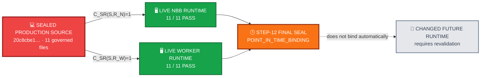

<div align="center">

# ALLIS — Source → Runtime Correspondence

### Point-in-time evidence that the sealed Step-12 production source matched the inspected live NBB and worker runtimes

<br>


<br>

**Kidd’s Technical Services · ALLIS**

</div>

---

> [!IMPORTANT]
> This record preserves the **historical Step-12 source → runtime correspondence edge** and adds the later **post-A8 current revalidation epoch** for the same bounded production authorized-adoption source domain.
>
> The Step-12 final-seal observation remains historical predecessor evidence. It is not rewritten by the later revalidation.
>
> The later post-A8 observation re-established current source/runtime correspondence for the theorem-relevant 11-file source set and then re-observed the bounded `T12D-B` and `T12D-C` behaviors.
>
> It does **not** establish permanent runtime correspondence, standing runtime authority, a real positive production authorized-application observation, or whole-system proof.
>
> Any future theorem-relevant source/runtime change still requires new correspondence evidence.

---

# 👀 Correspondence in one view



The sealed source matched both inspected runtime roles at the final Step-12 correspondence boundary.

That result is **time-indexed**. It does not become a perpetual runtime invariant.

---

# 🎯 Purpose

This document records two source/runtime observation epochs for the sealed production source used by the ALLIS authorized-adoption formal model:

```text
Epoch 1 — Step-12 final seal
historical predecessor correspondence

Epoch 2 — post-A8 revalidation
newest current theorem-relevant source/runtime correspondence
```

The original Step-12 sections below remain the historical evidence for Epoch 1. A separate successor section records Epoch 2.

The formal object is:

```text
DGM_PRODUCTION_AUTHORIZED_ADOPTION_MODEL_V1
```

The production source identity is anchored at:

```text
20c8cbe175781c8a1c05d65c03977859ceca884a
```

The governing correspondence result is:

```text
NBB source correspondence     11/11 = PASS
Worker source correspondence  11/11 = PASS
```

The governing time boundary is equally important:

> **Runtime correspondence is a sealed point-in-time property, not a perpetual invariant.**

The broader ALLIS principle remains:

> **State does not become authority merely because it exists.**

Applied here:

```text
source was running at seal time
≠
source is guaranteed to remain unchanged forever

11/11 matched once
≠
all future deployments automatically inherit correspondence

deployed source matches the model
≠
every modeled behavior has been observed
```

---

# 📋 Historical Step-12 correspondence status

The following table is preserved as the Step-12 final-seal observation state.

| Field | Value |
|---|---|
| Document role | Source-to-runtime correspondence record |
| Formal object | `DGM_PRODUCTION_AUTHORIZED_ADOPTION_MODEL_V1` |
| Production source commit | `20c8cbe175781c8a1c05d65c03977859ceca884a` |
| Sealed source domain | 11 governed production source files |
| Live NBB source correspondence | `11/11 = PASS` |
| Live worker source correspondence | `11/11 = PASS` |
| NBB source/runtime predicate | `C_SR(S,R_N)=1` at final seal |
| Worker source/runtime predicate | `C_SR(S,R_W)=1` at final seal |
| Public trust correspondence | `PASS` |
| Governance-view correspondence | `PASS` |
| NBB health | `PASS` |
| Worker health | `PASS` |
| Host health | `PASS` |
| Authorized spool | `PASS_EMPTY` |
| Correspondence time class | `POINT_IN_TIME_BINDING` |
| Final Step-12 status | `GREEN_CLOSED_WITH_EXPLICIT_RESIDUALS` |
| Final seal SHA-256 | `b00a954a924d3aa3490a5bcb8d4473da2b6885b8c41e116cf03545fee975c23b` |

---

# 🧭 1. What this document answers

`model-to-source.md` answers:

> Does the mathematical object map to the sealed production source?

This document answers the next question:

> Was that sealed source actually the source present in the live NBB and worker at the time of final correspondence sealing?

The distinction is:

```text
formal model
      ↓
sealed source
      ↓
live runtime
```

A correct formal model of a sealed source tree is not enough for runtime correspondence if the deployed runtime contains different source.

Likewise, a running application is not enough to establish theorem correspondence if its source identity is not bound to the source that was modeled.

---

# 🧩 Runtime correspondence objects

# 2. Correspondence objects

Let:

```math
S=
\{s_1,\ldots,s_{11}\}
```

be the exact sealed production source set.

Let:

```math
R_N
```

be the live NBB runtime source set.

Let:

```math
R_W
```

be the live worker runtime source set.

Let:

```math
H(x)=SHA256(x)
```

for the byte-oriented source identity comparison used by the Step-12 correspondence record.

The source-to-runtime correspondence question is therefore:

```text
For every governed source file in S,
does the runtime copy have the same byte identity?
```

---

# 3. Byte-correspondence criterion

For an eleven-file runtime set $`R`$, define source/runtime byte correspondence as:

```math
C_{SR}(S,R)=1
```

when:

```math
\bigwedge_{i=1}^{11}
H(s_i)=H(r_i)
```

where each sealed source file $`s_i`$ is compared with its corresponding runtime file $`r_i`$.

This is a byte-identity correspondence criterion.

It does not assert semantic equivalence between arbitrary programs.

It asks a narrower question:

> Is the exact governed source that was sealed also the exact governed source present in this runtime?

---

# 4. NBB runtime correspondence

At final Step-12 sealing, the live NBB runtime source set satisfied:

```math
\boxed{
C_{SR}(S,R_N)=1
}
```

with:

```text
11/11 matching governed production files
```

Therefore:

```text
NBB_SOURCE_CORRESPONDENCE=PASS
NBB_MATCHED_FILES=11
NBB_EXPECTED_FILES=11
```

## Meaning

The bounded NBB source used by the formal and source-model work was not merely similar to the runtime NBB source.

For all eleven governed production files in the correspondence domain, the runtime copies matched the sealed source identities used by Step 12.

## What this supports

This establishes the source identity needed to ask whether source-model properties can correspond to live NBB behavior.

It does not, by itself, establish that every theorem has been observed live.

---

# 5. Worker runtime correspondence

At final Step-12 sealing, the live worker runtime source set satisfied:

```math
\boxed{
C_{SR}(S,R_W)=1
}
```

with:

```text
11/11 matching governed production files
```

Therefore:

```text
WORKER_SOURCE_CORRESPONDENCE=PASS
WORKER_MATCHED_FILES=11
WORKER_EXPECTED_FILES=11
```

## Meaning

The worker runtime contained the same governed source identities used by the sealed production model for all eleven files in the correspondence domain.

## Architectural significance

The NBB and worker are different runtime responsibilities.

The NBB admits authorized work.

The worker claims and executes the bounded authorized-adoption path.

Establishing correspondence in only one of them would therefore be insufficient for the complete bounded runtime path.

The final seal established both:

```text
NBB     11/11 PASS
Worker  11/11 PASS
```

---

# 6. Combined source/runtime result

The final bounded runtime identity statement is:

```math
\boxed{
C_{SR}(S,R_N)=1
\land
C_{SR}(S,R_W)=1
}
```

at the Step-12 final seal.

In plain language:

> The exact eleven governed production source files corresponded byte-for-byte to the sealed source set in both the live NBB and the live worker at the time of final sealing.

This is the source/runtime identity bridge required by the correspondence model.

---

# 7. Why both sides matter

The architecture separates admission from execution.

```text
External package
      ↓
NBB admission boundary
      ↓
Authorized spool
      ↓
Worker claim
      ↓
Authorized application
```

Therefore a correspondence claim about the bounded production path must not silently assume that one runtime represents the other.

The final evidence independently records:

```text
NBB source correspondence
AND
Worker source correspondence
```

rather than:

```text
NBB matched
therefore
worker assumed to match
```

This follows the broader ALLIS discipline:

> **One established state does not authorize an unstated successor conclusion.**

---

# 8. Public trust correspondence

Source correspondence alone does not establish that the runtime verifies authorizations against the intended trust anchor.

Let:

```math
K_S
```

be the sealed public trust anchor,

```math
K_N
```

the NBB runtime copy, and:

```math
K_W
```

the worker runtime copy.

The sealed public-key SHA-256 is:

```text
4809a1af3dd8fad1767dc5a8a9d67aa763388a055e00ec818c15f9fe0321fbb5
```

At the final seal, the live copies corresponded to the sealed trust anchor.

Therefore:

```math
\boxed{
C_K=1
}
```

at final seal time.

## Meaning

The runtime source correspondence and the trust-anchor correspondence point to the same bounded authorization-verification environment.

This does not mean the runtime possesses private signing authority.

The NBB and worker verify and consume external authorization; authorization issuance remains external to this runtime model.

---

# 9. Governance-view correspondence

Let:

```math
G_S
```

be the sealed governance view and:

```math
G_N
```

the live NBB governance view.

The sealed governance-view SHA-256 is:

```text
26523c0bad40ff06a75c62a802f20195295534764dce45cfa6acdcdaecc3fcc2
```

The final live revalidation established:

```math
H(G_S)=H(G_N)
```

and therefore:

```math
\boxed{
C_G=1
}
```

at final seal time.

## Meaning

The NBB runtime was not only source-correspondent.

Its relevant governance view also corresponded to the sealed governance object at the correspondence boundary.

---

# 10. Runtime health and spool state at seal

At Step-12 final sealing, the bounded runtime state was recorded as:

```text
NBB health        PASS
Worker health     PASS
Host health       PASS
Authorized spool  PASS_EMPTY
```

These observations provide runtime context for the correspondence result.

They do not replace byte correspondence.

They also do not establish a positive authorized-application observation.

The empty spool is especially important because Step 12 deliberately did not issue or consume a real production authorization.

---

# 11. No production authorization or patch was exercised

At final seal:

```text
REAL_PRODUCTION_AUTHORIZATION_PUBLICATION=NOT_PERFORMED
REAL_PRODUCTION_AUTHORIZATION_CONSUMPTION=NOT_PERFORMED
REAL_PRODUCTION_DGM_PATCH_APPLICATION=NOT_PERFORMED
```

Therefore the runtime correspondence result means:

```text
the source identity matched
the runtime was healthy
the trust/governance boundary matched
the empty-spool fail-closed behavior was observable
```

It does **not** mean:

```text
a real positive production self-modification was executed
```

This is why `T12D-A` remains `MACHINE_CHECKED` rather than `CORRESPONDENCE_VERIFIED`.

---

# ➕ Post-A8 current revalidation — September 2026

The Step-12 final-seal correspondence above is historical predecessor evidence.

A later post-A8 qualification re-established the source/runtime edge against the current observed theorem-relevant DGM runtimes.

## Current qualified source identity

The source identity remained the same qualified production source used by Step 12:

```text
SOURCE_COMMIT=
20c8cbe175781c8a1c05d65c03977859ceca884a

SOURCE_TREE=
8d0840f076e84b4033ff398f602fb81a6d6e29f2

CANONICAL_SOURCE_SET_CARDINALITY=11

IMMUTABLE_SOURCE_IDENTITY=PASS_11_OF_11
```

The canonical theorem-relevant source set was:

```text
services/dgm_adoption_worker.py
services/hilbert/dgm_authorized_adoption.py
services/hilbert/dgm_authorized_spool.py
services/hilbert/dgm_evolution_agent.py
services/hilbert/dgm_evolution_authorization_bridge.py
services/hilbert/dgm_evolution_kernel.py
services/hilbert/dgm_governed_cycle.py
services/hilbert/dgm_nbb_authorized_package.py
services/hilbert/dgm_public_key_authorization_verifier.py
services/hilbert/dgm_worker_authorized_consumer.py
services/nbb_darwin_godel_machines.py
```

No replacement DGM source baseline was created.

## Current observed NBB runtime identity

The exact NBB runtime observed for the post-A8 qualification was:

```text
NBB_CONTAINER_ID=
851a55dbbd78ea36c711099df39a1e975884bfbc22d26bd916827f2e64cebe48

NBB_CONTAINER_NAME=
nbb_darwin_godel_machines
```

Current result:

```text
NBB_SOURCE_RUNTIME_MATCH_COUNT=11
NBB_SOURCE_TO_RUNTIME_CORRESPONDENCE=PASS_11_OF_11
```

## Current observed worker runtime identity

The exact worker runtime observed for the post-A8 qualification was:

```text
WORKER_CONTAINER_ID=
abcda93ad26be00c6d987f14abddd887147caa7785b9c8c9810981fa17a8371d

WORKER_CONTAINER_NAME=
msjarvis-rebuild-dgm_adoption_worker-1
```

Current result:

```text
WORKER_SOURCE_RUNTIME_MATCH_COUNT=11
WORKER_SOURCE_TO_RUNTIME_CORRESPONDENCE=PASS_11_OF_11
```

Combined current result:

```text
CURRENT_POST_A8_DGM_SOURCE_TO_RUNTIME_CORRESPONDENCE=PASS_11_OF_11
```

The container IDs above identify the exact runtimes observed in this qualification epoch.

They are point-in-time runtime identities, not permanent identities for every future deployment.

## Correspondence before and after behavioral observation

The 11/11 source/runtime relationship was established **before** the bounded theorem-specific behavioral observations.

The exact runtime identities were preserved during those observations.

After the behavioral observations, source/runtime correspondence was rechecked and remained 11/11.

For the final empty-spool observation, the post-observation evidence explicitly recorded:

```text
POST_NBB_SOURCE_RUNTIME=PASS_11_OF_11
POST_WORKER_SOURCE_RUNTIME=PASS_11_OF_11
```

Therefore the theorem-specific observations were not used to bridge an unqualified or silently changed runtime.

## T12D-B — current invalid-authorization observation

The post-A8 bounded observation exercised the live NBB validation/publication path with a structurally valid package carrying a deliberately invalid cryptographic signature.

Observed fail-closed result:

```text
exception_type=AuthorizationError
exception_text=authorization_signature_invalid
publish_returned=false

T12D_B_INVALID_SIGNATURE_REJECTED=YES
T12D_B_NO_AUTHORIZED_SPOOL_PUBLICATION=PASS
T12D_B_NO_AUTHORIZATION_CONSUMPTION=PASS
T12D_B_NO_RECEIPT_CREATION=PASS
T12D_B_LIVE_OBSERVATION=PASS
```

Current disposition:

```text
T12D_B_POST_A8_CORRESPONDENCE_VERIFIED=YES
T12D_B_POST_A8_VALIDATION_LEVEL=CORRESPONDENCE_VERIFIED
```

The source/runtime correspondence was rechecked after the observation and remained 11/11.

## T12D-C — current empty-spool observation

The post-A8 bounded observation kept the authorized incoming and claimed spool states empty while the current worker remained active.

The observation window was bounded to:

```text
T12D_C_OBSERVATION_WINDOW_SECONDS=3
```

Observed result:

```text
T12D_C_INCOMING_PRE=0
T12D_C_CLAIMED_PRE=0
T12D_C_INCOMING_POST=0
T12D_C_CLAIMED_POST=0

T12D_C_NO_WORKER_CLAIM=PASS
T12D_C_NO_AUTHORIZATION_CONSUMPTION=PASS
T12D_C_NO_RECEIPT_CREATION=PASS
T12D_C_NO_AUTHORIZED_APPLY=PASS
T12D_C_LIVE_OBSERVATION=PASS
```

Current disposition:

```text
T12D_C_POST_A8_CORRESPONDENCE_VERIFIED=YES
T12D_C_POST_A8_VALIDATION_LEVEL=CORRESPONDENCE_VERIFIED
```

The complete source/runtime correspondence was rechecked after this observation and remained:

```text
POST_NBB_SOURCE_RUNTIME=PASS_11_OF_11
POST_WORKER_SOURCE_RUNTIME=PASS_11_OF_11
```

## T12D-A — positive path remains unexecuted

`T12D-A` participates in the same qualified 11/11 current source/runtime set.

However, current correspondence promotion requires the positive authorized-application behavior to be observed.

That was deliberately not executed:

```text
T12D_A_POSITIVE_AUTHORIZED_APPLY_EXECUTED=NO
T12D_A_CURRENT_CORRESPONDENCE_VERIFIED=NO
T12D_A_CURRENT_VALIDATION_LEVEL=MACHINE_CHECKED
```

The post-A8 work did not issue or consume real production authorization and did not apply a real production DGM patch:

```text
REAL_PRODUCTION_AUTHORIZATION_ISSUED=NO
REAL_PRODUCTION_AUTHORIZATION_CONSUMED=NO
REAL_PRODUCTION_DGM_PATCH_APPLICATION=NO
```

Therefore the current theorem state remains:

```text
T12D-A = MACHINE_CHECKED
T12D-B = CORRESPONDENCE_VERIFIED
T12D-C = CORRESPONDENCE_VERIFIED
P12C-09 = MACHINE_CHECKED_DISPROVEN
```

## Two-epoch conclusion

The controlling correspondence history is now:

```text
Epoch 1:
Step-12 final-seal source/runtime correspondence
=
historical predecessor evidence

Epoch 2:
post-A8 immutable source + current NBB/worker 11/11
+ current live T12D-B/T12D-C observations
=
newest current theorem-correspondence evidence
```

The later result does not rewrite the Step-12 final seal.

It answers the later question of whether the same bounded theorem-relevant source still corresponded to the observed current DGM runtimes and whether the safely observable B/C behaviors still corresponded.

The current answer for the source/runtime edge is:

```text
CURRENT_POST_A8_DGM_SOURCE_TO_RUNTIME_CORRESPONDENCE=PASS_11_OF_11
```

The current answer for B/C is:

```text
T12D-B = CORRESPONDENCE_VERIFIED
T12D-C = CORRESPONDENCE_VERIFIED
```

The current answer for A remains:

```text
T12D-A = MACHINE_CHECKED
```

because the positive authorized-apply path was not executed.

Successor evidence record:

- [`../../evidence/governed-evolution/post-a8-theorem-correspondence-registry-r1.md`](../../evidence/governed-evolution/post-a8-theorem-correspondence-registry-r1.md)

Lean qualification companion:

- [`../../formal-verification/authorized-adoption/lean/workstream-closeout-r1.md`](../../formal-verification/authorized-adoption/lean/workstream-closeout-r1.md)

---

# 🕒 Point-in-time boundary

# 12. Runtime correspondence is time-indexed

Define:

```math
C_{SR}^{\tau}(S,R)
```

as source-to-runtime correspondence observed at time $`\tau`$.

Step 12 establishes:

```math
\boxed{
C_{SR}^{\tau_{seal}}(S,R)=1
}
```

for the runtime state at final seal.

The later post-A8 work separately establishes a newer time-indexed correspondence observation:

```text
CURRENT_POST_A8_DGM_SOURCE_TO_RUNTIME_CORRESPONDENCE=PASS_11_OF_11
```

for the exact current runtime identities recorded in the successor section above.

Neither observation establishes:

```math
\forall \tau>\tau_{seal},
C_{SR}^{\tau}(S,R)=1
```

without future revalidation.

This is a central boundary of the evidence.

---

# 13. Why the time boundary matters

A running system can change after a seal.

Examples include:

```text
new image
new bind-mounted source
new source commit
manual file change
deployment replacement
configuration drift
trust-anchor replacement
governance-view change
worker replacement
```

A prior correspondence observation does not logically prevent those future changes.

Therefore:

```text
correspondence observed at seal
≠
correspondence guaranteed for all future time
```

The correct historical claim is:

> The sealed source corresponded to the inspected live runtime at the final Step-12 correspondence boundary.

The correct current successor claim is:

> The same bounded theorem-relevant source identity was revalidated post-A8 against the exact observed current NBB and worker runtimes at 11/11 source-byte correspondence.

The incorrect stronger claim would be:

> The runtime can never drift from the sealed source.

Step 12 does not establish the stronger claim.

---

# 14. Residual R12F-07

The point-in-time limitation is preserved as an explicit Step-12 residual:

```text
R12F-07 — Point-in-time correspondence
```

Classification:

```text
POINT_IN_TIME_BINDING
```

Meaning:

```text
runtime correspondence was established
at the Step-12 final-seal epoch

and

was re-established at the later post-A8 epoch

but

future changed deployment states still require future validation
```

This is not an unresolved defect in the Step-12 result.

It is the correct temporal boundary of the result.

---

# 15. Revalidation rule

For a later runtime state $`R'`$ observed at time $`\tau'`$:

```math
\tau'>\tau_{seal}
```

the prior result:

```math
C_{SR}^{\tau_{seal}}(S,R)=1
```

must not be silently promoted to:

```math
C_{SR}^{\tau'}(S,R')=1
```

A later correspondence claim requires new evidence.

Conceptually:

```text
new runtime state
      ↓
recompute relevant source identities
      ↓
compare against authoritative sealed source
      ↓
revalidate trust/governance boundary where applicable
      ↓
establish new time-indexed correspondence result
```

This mirrors the prestate rule inside the adoption architecture:

```text
old valid state
≠
automatic authority over changed current state
```

---

# 📐 Theorem correspondence

# 16. Source/runtime identity is necessary but not sufficient

The Step-12 theorem correspondence criterion is:

```math
MC(T,S)
\land
C_{SR}(S,R)
\land
LiveObs(T,R)
```

The later post-A8 work applies the same bounded structure to the newer observation epoch:

```math
MC(T,S)
\land
C_{SR}^{current}(S,R)
\land
LiveObs^{current}(T,R)
```

where:

- $`MC(T,S)`$ means theorem $`T`$ was machine-checked against source $`S`$;
- $`C_{SR}(S,R)`$ means that source corresponds to runtime $`R`$; and
- $`LiveObs(T,R)`$ means the behavior relevant to the theorem was observed in the live runtime.

This is why:

```text
11/11 source match
```

does not automatically make every machine-checked theorem:

```text
CORRESPONDENCE_VERIFIED
```

Runtime source identity and relevant runtime behavior are different evidence requirements.

---

# 17. T12D-A runtime boundary

For `T12D-A`:

```math
MC(T_A,S)=1
```

and:

```math
C_{SR}(S,R)=1
```

but:

```math
LiveObs^{+}(T_A,R)=0
```

because no real positive production authorization/application was performed during Step 12 and the later post-A8 revalidation also deliberately did not execute the positive authorized-apply production path.

Therefore:

```math
Corr(T_A,S,R)\neq1
```

under the Step-12 correspondence criterion.

Final validation remains:

```text
T12D-A = MACHINE_CHECKED
```

## Architectural meaning

```text
runtime source matched theorem source
≠
positive theorem behavior observed
```

The source identity cannot manufacture an observation that never occurred.

---

# 18. T12D-B runtime correspondence

For `T12D-B`:

```math
MC(T_B,S)=1
```

```math
C_{SR}(S,R)=1
```

and:

```math
LiveObs(T_B,R)=1
```

The relevant live fail-closed behavior was observed.

Therefore:

```math
\boxed{
Corr(T_B,S,R)=1
}
```

and the historical Step-12 level was:

```text
T12D-B = CORRESPONDENCE_VERIFIED
```

The later post-A8 epoch independently re-observed the current invalid-authorization fail-closed behavior:

```text
T12D_B_LIVE_OBSERVATION=PASS
T12D_B_POST_A8_CORRESPONDENCE_VERIFIED=YES
```

Therefore the current level remains:

```text
T12D-B = CORRESPONDENCE_VERIFIED
```

---

# 19. T12D-C runtime correspondence

For `T12D-C`:

```math
MC(T_C,S)=1
```

```math
C_{SR}(S,R)=1
```

and:

```math
LiveObs(T_C,R)=1
```

The production empty-spool boundary was observed without authorization consumption or application.

Therefore:

```math
\boxed{
Corr(T_C,S,R)=1
}
```

and the historical Step-12 level was:

```text
T12D-C = CORRESPONDENCE_VERIFIED
```

The later post-A8 epoch independently re-observed the current empty-spool non-application behavior:

```text
T12D_C_LIVE_OBSERVATION=PASS
T12D_C_POST_A8_CORRESPONDENCE_VERIFIED=YES
```

Therefore the current level remains:

```text
T12D-C = CORRESPONDENCE_VERIFIED
```

---

# 20. Model-level runtime statement

The final Step-12 validation registry describes:

```text
DGM_PRODUCTION_AUTHORIZED_ADOPTION_MODEL_V1
```

as:

```text
Correspondence-verified for deployed identity and observed boundaries
```

That qualification is essential.

It means:

```text
deployed identity correspondence
+
specified observed runtime boundaries
```

It does not mean:

```text
every possible behavior in the formal model
has been observed live
```

---

# 🛡️ Correspondence claim boundaries

# 21. What 11/11 proves

The historical 11/11 results establish that, at the Step-12 final seal:

```text
for each of the eleven governed production source files,
the corresponding NBB runtime file matched the sealed source
```

and:

```text
for each of the eleven governed production source files,
the corresponding worker runtime file matched the sealed source
```

Thus the runtime source identity needed by the bounded correspondence argument was established in both execution roles.

The later post-A8 revalidation independently established the same 11/11 source/runtime relationship for the exact current NBB and worker identities recorded above.

The later B/C observations were then followed by another correspondence check that remained 11/11.

---

# 22. What 11/11 does not prove

The 11/11 result does not establish:

```text
every line of ALLIS is formally modeled
```

It does not establish:

```text
every possible runtime path has been executed
```

It does not establish:

```text
future runtime drift is impossible
```

It does not establish:

```text
all production mutation is safe
```

It does not establish:

```text
the whole ALLIS system is proven
```

The controlling statements remain:

```text
PRODUCTION_MUTATION_SAFETY_THEOREM_PROVEN=NO
WHOLE_SYSTEM_SAFETY_THEOREM_PROVEN=NO
SYSTEM_PROVEN=NO
```

---

# 23. Correspondence is not authorization

This record establishes facts about runtime identity.

It does not grant authority to mutate production.

```text
NBB 11/11 PASS
≠
authorization to publish a candidate

Worker 11/11 PASS
≠
authorization to apply a candidate

trust anchor matches
≠
private authority exists in the runtime

governance view matches
≠
runtime may invent a decision

runtime healthy
≠
runtime may act without authorization
```

The correspondence layer answers:

> Is the inspected runtime the implementation we think it is?

The authorization layer answers:

> Is this exact operation permitted now?

ALLIS keeps those questions separate.

---

# 24. Source/runtime correspondence and authority provenance

The runtime receives authority from outside the bounded verification runtime.

The final residual set preserves:

```text
R12F-08 — authorization issuance remains external to runtime model
```

The NBB and worker verify and consume external authorization.

They do not independently mint or sign private authorization authority within this model.

Therefore runtime source correspondence cannot be interpreted as self-authorization capability.

---

# 25. Future failure to revalidate

The post-A8 runtime was revalidated and therefore has its own current correspondence evidence.

If a later future runtime changes again and no new correspondence evidence is collected, the correct status is not:

```text
CORRESPONDENCE_PRESUMED
```

The correct status is:

```text
CURRENT_CORRESPONDENCE_NOT_ESTABLISHED_FOR_CHANGED_RUNTIME
```

until revalidation occurs.

This is an evidence rule, not a prediction that drift has occurred.

---

# 26. Relationship to source identity

The canonical list of the eleven governed production files and their sealed source identities belongs in:

```text
evidence/governed-evolution/source-identity.md
```

This document owns the comparison result:

```text
sealed source set
versus
live runtime source set
```

It intentionally does not create a competing source manifest.

That separation keeps one canonical source identity while allowing correspondence to be re-established at later runtime boundaries.

---

# 27. Relationship to `model-to-source.md`

Together:

```text
model-to-source.md
    establishes
    C_FS(F,S)=1

source-to-runtime.md
    establishes historically at Step-12 seal
    C_SR(S,R_N)=1
    C_SR(S,R_W)=1

and later re-establishes
    current post-A8 NBB = PASS_11_OF_11
    current post-A8 worker = PASS_11_OF_11
```

The historical combined evidence chain is:

```math
F
\overset{C_{FS}}{\longrightarrow}
S
\overset{C_{SR}^{\tau_{seal}}}{\longrightarrow}
R
```

This chain is what permits theorem correspondence to be evaluated against observed live behavior.

But:

```math
C_{FS}=1
\land
C_{SR}=1
```

still does not imply:

```math
LiveObs(T,R)=1
```

for every theorem.

That is why the live-observation condition remains separate.

---

# 28. Runtime seal snapshot

At final Step-12 sealing, the relevant bounded state was:

```text
NBB source correspondence      11/11 PASS
Worker source correspondence   11/11 PASS
Public trust                   PASS
Governance view                PASS
NBB health                     PASS
Worker health                  PASS
Host health                    PASS
Authorized spool               PASS_EMPTY
```

And:

```text
Production authorization publication  NOT PERFORMED
Production authorization consumption  NOT PERFORMED
Production DGM patch application      NOT PERFORMED
```

This is the historical Step-12 runtime boundary that the original correspondence record sealed.

## Current post-A8 runtime snapshot

The later observation epoch records:

```text
Source commit
20c8cbe175781c8a1c05d65c03977859ceca884a

Source tree
8d0840f076e84b4033ff398f602fb81a6d6e29f2

Immutable source identity
PASS_11_OF_11

NBB container
851a55dbbd78ea36c711099df39a1e975884bfbc22d26bd916827f2e64cebe48
nbb_darwin_godel_machines
PASS_11_OF_11

Worker container
abcda93ad26be00c6d987f14abddd887147caa7785b9c8c9810981fa17a8371d
msjarvis-rebuild-dgm_adoption_worker-1
PASS_11_OF_11

T12D-B live observation
PASS

T12D-C live observation
PASS

T12D-A positive authorized apply
NOT_EXECUTED
```

And:

```text
REAL_PRODUCTION_AUTHORIZATION_ISSUED=NO
REAL_PRODUCTION_AUTHORIZATION_CONSUMED=NO
REAL_PRODUCTION_DGM_PATCH_APPLICATION=NO
```

This later snapshot is also point-in-time.

---

# 29. Architectural meaning

This layer answers a deceptively simple question:

> **Is the system we proved things about the system that is actually running?**

ALLIS does not answer that question by assumption.

It establishes a byte-correspondence boundary.

And it does not turn that boundary into a timeless claim.

The architecture therefore preserves separate truths across time:

```text
the model corresponds to sealed source
```

```text
the sealed source corresponded to runtime at the Step-12 seal
```

```text
the same bounded source was revalidated against the post-A8 current runtime
```

```text
specific theorem behavior was or was not observed live in each applicable epoch
```

None is allowed to silently substitute for another.

This is the correspondence form of the overarching architecture:

> **Evidence of one state does not authorize a stronger state that the evidence did not establish.**

---

# 30. Final correspondence statement

Let:

```math
S=\{s_1,\ldots,s_{11}\}
```

be the sealed production authorized-adoption source set.

Let:

```math
R_N
```

be the live NBB source set, and:

```math
R_W
```

the live worker source set.

At the Step-12 final seal:

```math
\boxed{
C_{SR}^{\tau_{seal}}(S,R_N)=1
}
```

with:

```text
11/11 = PASS
```

and:

```math
\boxed{
C_{SR}^{\tau_{seal}}(S,R_W)=1
}
```

with:

```text
11/11 = PASS
```

Additionally:

```math
\boxed{
C_K^{\tau_{seal}}=1
}
```

for the sealed public trust anchor, and:

```math
\boxed{
C_G^{\tau_{seal}}=1
}
```

for the sealed governance view.

But:

```math
\boxed{
C_{SR}^{\tau_{seal}}(S,R)=1
\not\Rightarrow
\forall \tau>\tau_{seal},
C_{SR}^{\tau}(S,R)=1
}
```

without future revalidation.

That is the controlling **historical Step-12** runtime correspondence boundary.

The later post-A8 successor observation separately establishes:

```text
SOURCE_COMMIT=
20c8cbe175781c8a1c05d65c03977859ceca884a

SOURCE_TREE=
8d0840f076e84b4033ff398f602fb81a6d6e29f2

IMMUTABLE_SOURCE_IDENTITY=PASS_11_OF_11

NBB_SOURCE_TO_RUNTIME_CORRESPONDENCE=PASS_11_OF_11

WORKER_SOURCE_TO_RUNTIME_CORRESPONDENCE=PASS_11_OF_11

CURRENT_POST_A8_DGM_SOURCE_TO_RUNTIME_CORRESPONDENCE=PASS_11_OF_11
```

with the exact observed runtime identities recorded in the post-A8 section above.

Thus the current record has **two valid observation epochs**, not one timeless correspondence claim.

Any future theorem-relevant source or runtime change requires fresh revalidation.

---

# 31. Seal identity

The controlling Step-12 formal seal is:

```text
STEP12_FINAL_THEOREM_AND_FORMAL_CORRESPONDENCE_SEALED_GREEN_WITH_EXPLICIT_RESIDUALS
```

Final result SHA-256:

```text
b00a954a924d3aa3490a5bcb8d4473da2b6885b8c41e116cf03545fee975c23b
```

Controlling scope:

```text
BOUNDED_PRODUCTION_AUTHORIZED_ADOPTION_FORMAL_MODEL_AND_ESTABLISHED_CORRESPONDENCE_ONLY
```

Residual governing this document:

```text
R12F-07 = POINT_IN_TIME_BINDING
```

No perpetual runtime-correspondence claim is implied by the seal.

The later post-A8 correspondence record is additive successor evidence.

It does not rewrite this historical Step-12 seal.

---

# 📚 32. Companion records

This record belongs at:

```text
correspondence/
    authorized-adoption/
        model-to-source.md
        source-to-runtime.md
```

and should be read with:

```text
formal-verification/
    authorized-adoption/
        formal-model.md
        theorem-registry.md
        counterexample-registry.md
        lean/
            workstream-closeout-r1.md

evidence/
    governed-evolution/
        step12-final-seal.md
        post-a8-theorem-correspondence-registry-r1.md
        source-identity.md
        trust-anchor.md
        governance-view.md
        residuals.md
```

Use:

- [`model-to-source.md`](model-to-source.md) — formal object → sealed source correspondence
- [`source-to-runtime.md`](source-to-runtime.md) — historical Step-12 and later post-A8 11/11 NBB/worker byte correspondence, with point-in-time boundaries
- [`lean/workstream-closeout-r1.md`](../../formal-verification/authorized-adoption/lean/workstream-closeout-r1.md) — later Lean R1 qualification closeout
- [`post-a8-theorem-correspondence-registry-r1.md`](../../evidence/governed-evolution/post-a8-theorem-correspondence-registry-r1.md) — later current DGM source/runtime and B/C live correspondence evidence
- [`source-identity.md`](../../evidence/governed-evolution/source-identity.md) — canonical eleven-file sealed source manifest
- [`trust-anchor.md`](../../evidence/governed-evolution/trust-anchor.md) — sealed public-key identity
- [`governance-view.md`](../../evidence/governed-evolution/governance-view.md) — sealed governance-view identity
- [`residuals.md`](../../evidence/governed-evolution/residuals.md) — continuing point-in-time correspondence limitation

---

# 🧾 Source-to-runtime correspondence summary

<div align="center">

### 💻 SEALED PRODUCTION SOURCE
**commit `20c8cbe1…` · 11-file bounded source set**

↓

### 🖥️ NBB RUNTIME
**11 / 11 source correspondence · PASS**

### 🖥️ WORKER RUNTIME
**11 / 11 source correspondence · PASS**

<br>

### 🕒 TEMPORAL BOUNDARY
**`R12F-07 = POINT_IN_TIME_BINDING`**

**Epoch 1: Step-12 final-seal 11/11 correspondence — historical predecessor**

**Epoch 2: post-A8 current NBB/worker 11/11 correspondence + B/C live revalidation**

**Any later changed theorem-relevant source/runtime requires fresh revalidation.**

<br>

### CURRENT THEOREM STATE
**`T12D-A = MACHINE_CHECKED`**

**`T12D-B = CORRESPONDENCE_VERIFIED`**

**`T12D-C = CORRESPONDENCE_VERIFIED`**

**`P12C-09 = MACHINE_CHECKED_DISPROVEN`**

<br>

# `SYSTEM_PROVEN=NO`

</div>

---

# Governing correspondence principle

> **Runtime correspondence must be observed and sealed. It cannot be inherited forever from a prior successful observation.**

> **The post-A8 revalidation establishes a newer bounded observation epoch; it does not turn correspondence into a permanent invariant.**
