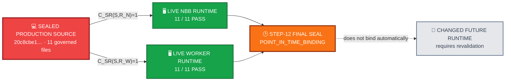

<div align="center">

# ALLIS — Source → Runtime Correspondence

### Point-in-time evidence that the sealed Step-12 production source matched the inspected live NBB and worker runtimes

<br>


<br>

**Kidd’s Technical Services · ALLIS**

</div>

---

> [!IMPORTANT]
> This record establishes the **source → runtime correspondence edge** for the bounded Step-12 production authorized-adoption domain **at the final seal boundary**.
>
> It does **not** establish permanent runtime correspondence, standing runtime authority, a real positive production authorized-application observation, or whole-system proof.
>
> A changed future runtime requires new correspondence evidence.

---

# 👀 Correspondence in one view



The sealed source matched both inspected runtime roles at the final Step-12 correspondence boundary.

That result is **time-indexed**. It does not become a perpetual runtime invariant.

---

# 🎯 Purpose

This document establishes whether the sealed production source used by the ALLIS authorized-adoption formal model corresponds to the source actually present in the live NBB and worker runtimes at the Step-12 final seal.

The formal object is:

```text
DGM_PRODUCTION_AUTHORIZED_ADOPTION_MODEL_V1
```

The production source identity is anchored at:

```text
20c8cbe175781c8a1c05d65c03977859ceca884a
```

The governing correspondence result is:

```text
NBB source correspondence     11/11 = PASS
Worker source correspondence  11/11 = PASS
```

The governing time boundary is equally important:

> **Runtime correspondence is a sealed point-in-time property, not a perpetual invariant.**

The broader ALLIS principle remains:

> **State does not become authority merely because it exists.**

Applied here:

```text
source was running at seal time
≠
source is guaranteed to remain unchanged forever

11/11 matched once
≠
all future deployments automatically inherit correspondence

deployed source matches the model
≠
every modeled behavior has been observed
```

---

# 📋 Correspondence status

| Field | Value |
|---|---|
| Document role | Source-to-runtime correspondence record |
| Formal object | `DGM_PRODUCTION_AUTHORIZED_ADOPTION_MODEL_V1` |
| Production source commit | `20c8cbe175781c8a1c05d65c03977859ceca884a` |
| Sealed source domain | 11 governed production source files |
| Live NBB source correspondence | `11/11 = PASS` |
| Live worker source correspondence | `11/11 = PASS` |
| NBB source/runtime predicate | `C_SR(S,R_N)=1` at final seal |
| Worker source/runtime predicate | `C_SR(S,R_W)=1` at final seal |
| Public trust correspondence | `PASS` |
| Governance-view correspondence | `PASS` |
| NBB health | `PASS` |
| Worker health | `PASS` |
| Host health | `PASS` |
| Authorized spool | `PASS_EMPTY` |
| Correspondence time class | `POINT_IN_TIME_BINDING` |
| Final Step-12 status | `GREEN_CLOSED_WITH_EXPLICIT_RESIDUALS` |
| Final seal SHA-256 | `b00a954a924d3aa3490a5bcb8d4473da2b6885b8c41e116cf03545fee975c23b` |

---

# 🧭 1. What this document answers

`model-to-source.md` answers:

> Does the mathematical object map to the sealed production source?

This document answers the next question:

> Was that sealed source actually the source present in the live NBB and worker at the time of final correspondence sealing?

The distinction is:

```text
formal model
      ↓
sealed source
      ↓
live runtime
```

A correct formal model of a sealed source tree is not enough for runtime correspondence if the deployed runtime contains different source.

Likewise, a running application is not enough to establish theorem correspondence if its source identity is not bound to the source that was modeled.

---

# 🧩 Runtime correspondence objects

# 2. Correspondence objects

Let:

```math
S=
\{s_1,\ldots,s_{11}\}
```

be the exact sealed production source set.

Let:

```math
R_N
```

be the live NBB runtime source set.

Let:

```math
R_W
```

be the live worker runtime source set.

Let:

```math
H(x)=SHA256(x)
```

for the byte-oriented source identity comparison used by the Step-12 correspondence record.

The source-to-runtime correspondence question is therefore:

```text
For every governed source file in S,
does the runtime copy have the same byte identity?
```

---

# 3. Byte-correspondence criterion

For an eleven-file runtime set $`R`$, define source/runtime byte correspondence as:

```math
C_{SR}(S,R)=1
```

when:

```math
\bigwedge_{i=1}^{11}
H(s_i)=H(r_i)
```

where each sealed source file $`s_i`$ is compared with its corresponding runtime file $`r_i`$.

This is a byte-identity correspondence criterion.

It does not assert semantic equivalence between arbitrary programs.

It asks a narrower question:

> Is the exact governed source that was sealed also the exact governed source present in this runtime?

---

# 4. NBB runtime correspondence

At final Step-12 sealing, the live NBB runtime source set satisfied:

```math
\boxed{
C_{SR}(S,R_N)=1
}
```

with:

```text
11/11 matching governed production files
```

Therefore:

```text
NBB_SOURCE_CORRESPONDENCE=PASS
NBB_MATCHED_FILES=11
NBB_EXPECTED_FILES=11
```

## Meaning

The bounded NBB source used by the formal and source-model work was not merely similar to the runtime NBB source.

For all eleven governed production files in the correspondence domain, the runtime copies matched the sealed source identities used by Step 12.

## What this supports

This establishes the source identity needed to ask whether source-model properties can correspond to live NBB behavior.

It does not, by itself, establish that every theorem has been observed live.

---

# 5. Worker runtime correspondence

At final Step-12 sealing, the live worker runtime source set satisfied:

```math
\boxed{
C_{SR}(S,R_W)=1
}
```

with:

```text
11/11 matching governed production files
```

Therefore:

```text
WORKER_SOURCE_CORRESPONDENCE=PASS
WORKER_MATCHED_FILES=11
WORKER_EXPECTED_FILES=11
```

## Meaning

The worker runtime contained the same governed source identities used by the sealed production model for all eleven files in the correspondence domain.

## Architectural significance

The NBB and worker are different runtime responsibilities.

The NBB admits authorized work.

The worker claims and executes the bounded authorized-adoption path.

Establishing correspondence in only one of them would therefore be insufficient for the complete bounded runtime path.

The final seal established both:

```text
NBB     11/11 PASS
Worker  11/11 PASS
```

---

# 6. Combined source/runtime result

The final bounded runtime identity statement is:

```math
\boxed{
C_{SR}(S,R_N)=1
\land
C_{SR}(S,R_W)=1
}
```

at the Step-12 final seal.

In plain language:

> The exact eleven governed production source files corresponded byte-for-byte to the sealed source set in both the live NBB and the live worker at the time of final sealing.

This is the source/runtime identity bridge required by the correspondence model.

---

# 7. Why both sides matter

The architecture separates admission from execution.

```text
External package
      ↓
NBB admission boundary
      ↓
Authorized spool
      ↓
Worker claim
      ↓
Authorized application
```

Therefore a correspondence claim about the bounded production path must not silently assume that one runtime represents the other.

The final evidence independently records:

```text
NBB source correspondence
AND
Worker source correspondence
```

rather than:

```text
NBB matched
therefore
worker assumed to match
```

This follows the broader ALLIS discipline:

> **One established state does not authorize an unstated successor conclusion.**

---

# 8. Public trust correspondence

Source correspondence alone does not establish that the runtime verifies authorizations against the intended trust anchor.

Let:

```math
K_S
```

be the sealed public trust anchor,

```math
K_N
```

the NBB runtime copy, and:

```math
K_W
```

the worker runtime copy.

The sealed public-key SHA-256 is:

```text
4809a1af3dd8fad1767dc5a8a9d67aa763388a055e00ec818c15f9fe0321fbb5
```

At the final seal, the live copies corresponded to the sealed trust anchor.

Therefore:

```math
\boxed{
C_K=1
}
```

at final seal time.

## Meaning

The runtime source correspondence and the trust-anchor correspondence point to the same bounded authorization-verification environment.

This does not mean the runtime possesses private signing authority.

The NBB and worker verify and consume external authorization; authorization issuance remains external to this runtime model.

---

# 9. Governance-view correspondence

Let:

```math
G_S
```

be the sealed governance view and:

```math
G_N
```

the live NBB governance view.

The sealed governance-view SHA-256 is:

```text
26523c0bad40ff06a75c62a802f20195295534764dce45cfa6acdcdaecc3fcc2
```

The final live revalidation established:

```math
H(G_S)=H(G_N)
```

and therefore:

```math
\boxed{
C_G=1
}
```

at final seal time.

## Meaning

The NBB runtime was not only source-correspondent.

Its relevant governance view also corresponded to the sealed governance object at the correspondence boundary.

---

# 10. Runtime health and spool state at seal

At Step-12 final sealing, the bounded runtime state was recorded as:

```text
NBB health        PASS
Worker health     PASS
Host health       PASS
Authorized spool  PASS_EMPTY
```

These observations provide runtime context for the correspondence result.

They do not replace byte correspondence.

They also do not establish a positive authorized-application observation.

The empty spool is especially important because Step 12 deliberately did not issue or consume a real production authorization.

---

# 11. No production authorization or patch was exercised

At final seal:

```text
REAL_PRODUCTION_AUTHORIZATION_PUBLICATION=NOT_PERFORMED
REAL_PRODUCTION_AUTHORIZATION_CONSUMPTION=NOT_PERFORMED
REAL_PRODUCTION_DGM_PATCH_APPLICATION=NOT_PERFORMED
```

Therefore the runtime correspondence result means:

```text
the source identity matched
the runtime was healthy
the trust/governance boundary matched
the empty-spool fail-closed behavior was observable
```

It does **not** mean:

```text
a real positive production self-modification was executed
```

This is why `T12D-A` remains `MACHINE_CHECKED` rather than `CORRESPONDENCE_VERIFIED`.

---

# 🕒 Point-in-time boundary

# 12. Runtime correspondence is time-indexed

Define:

```math
C_{SR}^{\tau}(S,R)
```

as source-to-runtime correspondence observed at time $`\tau`$.

Step 12 establishes:

```math
\boxed{
C_{SR}^{\tau_{seal}}(S,R)=1
}
```

for the runtime state at final seal.

It does not establish:

```math
\forall \tau>\tau_{seal},
C_{SR}^{\tau}(S,R)=1
```

without future revalidation.

This is a central boundary of the evidence.

---

# 13. Why the time boundary matters

A running system can change after a seal.

Examples include:

```text
new image
new bind-mounted source
new source commit
manual file change
deployment replacement
configuration drift
trust-anchor replacement
governance-view change
worker replacement
```

A prior correspondence observation does not logically prevent those future changes.

Therefore:

```text
correspondence observed at seal
≠
correspondence guaranteed for all future time
```

The correct claim is:

> The sealed source corresponded to the inspected live runtime at the final Step-12 correspondence boundary.

The incorrect stronger claim would be:

> The runtime can never drift from the sealed source.

Step 12 does not establish the stronger claim.

---

# 14. Residual R12F-07

The point-in-time limitation is preserved as an explicit Step-12 residual:

```text
R12F-07 — Point-in-time correspondence
```

Classification:

```text
POINT_IN_TIME_BINDING
```

Meaning:

```text
runtime correspondence is established
for the sealed and revalidated deployment state

but

future deployment states require future validation
```

This is not an unresolved defect in the Step-12 result.

It is the correct temporal boundary of the result.

---

# 15. Revalidation rule

For a later runtime state $`R'`$ observed at time $`\tau'`$:

```math
\tau'>\tau_{seal}
```

the prior result:

```math
C_{SR}^{\tau_{seal}}(S,R)=1
```

must not be silently promoted to:

```math
C_{SR}^{\tau'}(S,R')=1
```

A later correspondence claim requires new evidence.

Conceptually:

```text
new runtime state
      ↓
recompute relevant source identities
      ↓
compare against authoritative sealed source
      ↓
revalidate trust/governance boundary where applicable
      ↓
establish new time-indexed correspondence result
```

This mirrors the prestate rule inside the adoption architecture:

```text
old valid state
≠
automatic authority over changed current state
```

---

# 📐 Theorem correspondence

# 16. Source/runtime identity is necessary but not sufficient

The Step-12 theorem correspondence criterion is:

```math
MC(T,S)
\land
C_{SR}(S,R)
\land
LiveObs(T,R)
```

where:

- $`MC(T,S)`$ means theorem $`T`$ was machine-checked against source $`S`$;
- $`C_{SR}(S,R)`$ means that source corresponds to runtime $`R`$; and
- $`LiveObs(T,R)`$ means the behavior relevant to the theorem was observed in the live runtime.

This is why:

```text
11/11 source match
```

does not automatically make every machine-checked theorem:

```text
CORRESPONDENCE_VERIFIED
```

Runtime source identity and relevant runtime behavior are different evidence requirements.

---

# 17. T12D-A runtime boundary

For `T12D-A`:

```math
MC(T_A,S)=1
```

and:

```math
C_{SR}(S,R)=1
```

but:

```math
LiveObs^{+}(T_A,R)=0
```

because no real positive production authorization/application was performed.

Therefore:

```math
Corr(T_A,S,R)\neq1
```

under the Step-12 correspondence criterion.

Final validation remains:

```text
T12D-A = MACHINE_CHECKED
```

## Architectural meaning

```text
runtime source matched theorem source
≠
positive theorem behavior observed
```

The source identity cannot manufacture an observation that never occurred.

---

# 18. T12D-B runtime correspondence

For `T12D-B`:

```math
MC(T_B,S)=1
```

```math
C_{SR}(S,R)=1
```

and:

```math
LiveObs(T_B,R)=1
```

The relevant live fail-closed behavior was observed.

Therefore:

```math
\boxed{
Corr(T_B,S,R)=1
}
```

and the final level is:

```text
T12D-B = CORRESPONDENCE_VERIFIED
```

---

# 19. T12D-C runtime correspondence

For `T12D-C`:

```math
MC(T_C,S)=1
```

```math
C_{SR}(S,R)=1
```

and:

```math
LiveObs(T_C,R)=1
```

The production empty-spool boundary was observed without authorization consumption or application.

Therefore:

```math
\boxed{
Corr(T_C,S,R)=1
}
```

and the final level is:

```text
T12D-C = CORRESPONDENCE_VERIFIED
```

---

# 20. Model-level runtime statement

The final Step-12 validation registry describes:

```text
DGM_PRODUCTION_AUTHORIZED_ADOPTION_MODEL_V1
```

as:

```text
Correspondence-verified for deployed identity and observed boundaries
```

That qualification is essential.

It means:

```text
deployed identity correspondence
+
specified observed runtime boundaries
```

It does not mean:

```text
every possible behavior in the formal model
has been observed live
```

---

# 🛡️ Correspondence claim boundaries

# 21. What 11/11 proves

The 11/11 results establish that, at the final seal:

```text
for each of the eleven governed production source files,
the corresponding NBB runtime file matched the sealed source
```

and:

```text
for each of the eleven governed production source files,
the corresponding worker runtime file matched the sealed source
```

Thus the runtime source identity needed by the bounded correspondence argument was established in both execution roles.

---

# 22. What 11/11 does not prove

The 11/11 result does not establish:

```text
every line of ALLIS is formally modeled
```

It does not establish:

```text
every possible runtime path has been executed
```

It does not establish:

```text
future runtime drift is impossible
```

It does not establish:

```text
all production mutation is safe
```

It does not establish:

```text
the whole ALLIS system is proven
```

The controlling statements remain:

```text
PRODUCTION_MUTATION_SAFETY_THEOREM_PROVEN=NO
WHOLE_SYSTEM_SAFETY_THEOREM_PROVEN=NO
SYSTEM_PROVEN=NO
```

---

# 23. Correspondence is not authorization

This record establishes facts about runtime identity.

It does not grant authority to mutate production.

```text
NBB 11/11 PASS
≠
authorization to publish a candidate

Worker 11/11 PASS
≠
authorization to apply a candidate

trust anchor matches
≠
private authority exists in the runtime

governance view matches
≠
runtime may invent a decision

runtime healthy
≠
runtime may act without authorization
```

The correspondence layer answers:

> Is the inspected runtime the implementation we think it is?

The authorization layer answers:

> Is this exact operation permitted now?

ALLIS keeps those questions separate.

---

# 24. Source/runtime correspondence and authority provenance

The runtime receives authority from outside the bounded verification runtime.

The final residual set preserves:

```text
R12F-08 — authorization issuance remains external to runtime model
```

The NBB and worker verify and consume external authorization.

They do not independently mint or sign private authorization authority within this model.

Therefore runtime source correspondence cannot be interpreted as self-authorization capability.

---

# 25. Failure to revalidate

If a future runtime changes and no new correspondence evidence is collected, the correct status is not:

```text
CORRESPONDENCE_PRESUMED
```

The correct status is:

```text
CURRENT_CORRESPONDENCE_NOT_ESTABLISHED_FOR_CHANGED_RUNTIME
```

until revalidation occurs.

This is an evidence rule, not a prediction that drift has occurred.

---

# 26. Relationship to source identity

The canonical list of the eleven governed production files and their sealed source identities belongs in:

```text
evidence/governed-evolution/source-identity.md
```

This document owns the comparison result:

```text
sealed source set
versus
live runtime source set
```

It intentionally does not create a competing source manifest.

That separation keeps one canonical source identity while allowing correspondence to be re-established at later runtime boundaries.

---

# 27. Relationship to `model-to-source.md`

Together:

```text
model-to-source.md
    establishes
    C_FS(F,S)=1

source-to-runtime.md
    establishes at seal
    C_SR(S,R_N)=1
    C_SR(S,R_W)=1
```

The combined evidence chain is:

```math
F
\overset{C_{FS}}{\longrightarrow}
S
\overset{C_{SR}^{\tau_{seal}}}{\longrightarrow}
R
```

This chain is what permits theorem correspondence to be evaluated against observed live behavior.

But:

```math
C_{FS}=1
\land
C_{SR}=1
```

still does not imply:

```math
LiveObs(T,R)=1
```

for every theorem.

That is why the live-observation condition remains separate.

---

# 28. Runtime seal snapshot

At final Step-12 sealing, the relevant bounded state was:

```text
NBB source correspondence      11/11 PASS
Worker source correspondence   11/11 PASS
Public trust                   PASS
Governance view                PASS
NBB health                     PASS
Worker health                  PASS
Host health                    PASS
Authorized spool               PASS_EMPTY
```

And:

```text
Production authorization publication  NOT PERFORMED
Production authorization consumption  NOT PERFORMED
Production DGM patch application      NOT PERFORMED
```

This is the runtime boundary that the correspondence record seals.

---

# 29. Architectural meaning

This layer answers a deceptively simple question:

> **Is the system we proved things about the system that is actually running?**

ALLIS does not answer that question by assumption.

It establishes a byte-correspondence boundary.

And it does not turn that boundary into a timeless claim.

The architecture therefore preserves three separate truths:

```text
the model corresponds to sealed source
```

```text
the sealed source corresponded to runtime at seal time
```

```text
specific theorem behavior was or was not observed live
```

None is allowed to silently substitute for another.

This is the correspondence form of the overarching architecture:

> **Evidence of one state does not authorize a stronger state that the evidence did not establish.**

---

# 30. Final correspondence statement

Let:

```math
S=\{s_1,\ldots,s_{11}\}
```

be the sealed production authorized-adoption source set.

Let:

```math
R_N
```

be the live NBB source set, and:

```math
R_W
```

the live worker source set.

At the Step-12 final seal:

```math
\boxed{
C_{SR}^{\tau_{seal}}(S,R_N)=1
}
```

with:

```text
11/11 = PASS
```

and:

```math
\boxed{
C_{SR}^{\tau_{seal}}(S,R_W)=1
}
```

with:

```text
11/11 = PASS
```

Additionally:

```math
\boxed{
C_K^{\tau_{seal}}=1
}
```

for the sealed public trust anchor, and:

```math
\boxed{
C_G^{\tau_{seal}}=1
}
```

for the sealed governance view.

But:

```math
\boxed{
C_{SR}^{\tau_{seal}}(S,R)=1
\not\Rightarrow
\forall \tau>\tau_{seal},
C_{SR}^{\tau}(S,R)=1
}
```

without future revalidation.

That is the controlling runtime correspondence boundary.

---

# 31. Seal identity

The controlling Step-12 formal seal is:

```text
STEP12_FINAL_THEOREM_AND_FORMAL_CORRESPONDENCE_SEALED_GREEN_WITH_EXPLICIT_RESIDUALS
```

Final result SHA-256:

```text
b00a954a924d3aa3490a5bcb8d4473da2b6885b8c41e116cf03545fee975c23b
```

Controlling scope:

```text
BOUNDED_PRODUCTION_AUTHORIZED_ADOPTION_FORMAL_MODEL_AND_ESTABLISHED_CORRESPONDENCE_ONLY
```

Residual governing this document:

```text
R12F-07 = POINT_IN_TIME_BINDING
```

No perpetual runtime-correspondence claim is implied by the seal.

---

# 📚 32. Companion records

This record belongs at:

```text
correspondence/
    authorized-adoption/
        model-to-source.md
        source-to-runtime.md
```

and should be read with:

```text
formal-verification/
    authorized-adoption/
        formal-model.md
        theorem-registry.md
        counterexample-registry.md

evidence/
    governed-evolution/
        step12-final-seal.md
        source-identity.md
        trust-anchor.md
        governance-view.md
        residuals.md
```

Use:

- [`model-to-source.md`](model-to-source.md) — formal object → sealed source correspondence
- [`source-to-runtime.md`](source-to-runtime.md) — 11/11 live NBB and worker byte correspondence and its temporal boundary
- [`source-identity.md`](../../evidence/governed-evolution/source-identity.md) — canonical eleven-file sealed source manifest
- [`trust-anchor.md`](../../evidence/governed-evolution/trust-anchor.md) — sealed public-key identity
- [`governance-view.md`](../../evidence/governed-evolution/governance-view.md) — sealed governance-view identity
- [`residuals.md`](../../evidence/governed-evolution/residuals.md) — continuing point-in-time correspondence limitation

---

# 🧾 Source-to-runtime correspondence summary

<div align="center">

### 💻 SEALED PRODUCTION SOURCE
**commit `20c8cbe1…` · 11-file bounded source set**

↓

### 🖥️ NBB RUNTIME
**11 / 11 source correspondence · PASS**

### 🖥️ WORKER RUNTIME
**11 / 11 source correspondence · PASS**

<br>

### 🕒 TEMPORAL BOUNDARY
**`R12F-07 = POINT_IN_TIME_BINDING`**

**Correspondence established at the Step-12 final seal; changed future runtime requires revalidation.**

<br>

# `SYSTEM_PROVEN=NO`

</div>

---

# Governing correspondence principle

> **Runtime correspondence must be observed and sealed. It cannot be inherited forever from a prior successful observation.**
