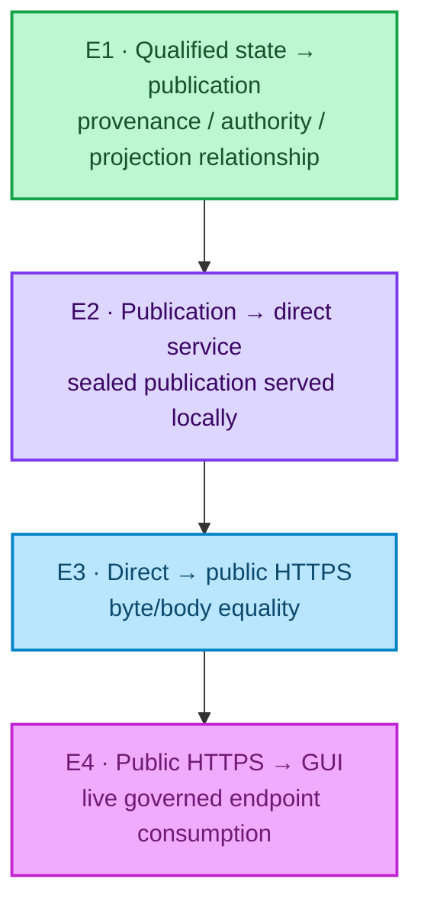
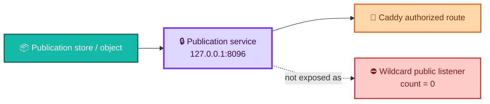
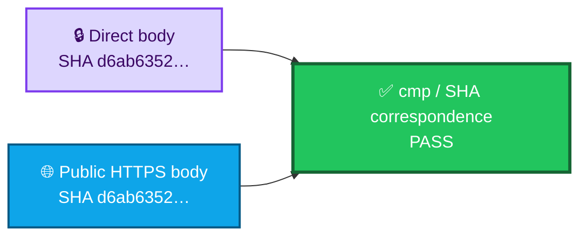
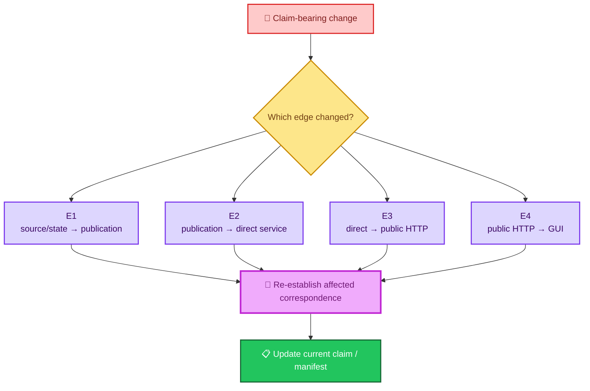
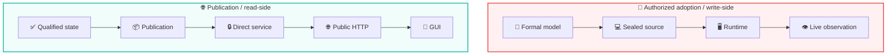

<div align="center">

# ALLIS — Source → Publication → HTTP → GUI Correspondence

### Evidence-backed correspondence for the governed Step-17 publication chain

<br>


<br>

**Kidd’s Technical Services · ALLIS**

</div>

---

> [!IMPORTANT]
> This document records the **bounded correspondence chain** established for the final Step-17 publication state.
>
> It does not claim that qualified source, publication JSON, HTTP transport, and GUI rendering are the same object. It records the specific evidence-backed relationships established **between** those objects at the final observation.

---

# 👀 Final correspondence result

```text
SOURCE_TO_PUBLICATION_TO_HTTP_TO_GUI=GREEN
```

The final Step-17 state also records:

```text
ALL_STEPS_0_THROUGH_17=GREEN
FINAL_CRITERIA=25_OF_25_PASS
FINAL_NETWORK_CONTINUITY=GREEN

OVERALL_GOAL=GREEN_COMPLETE

ALLIS_LIVE_PUBLICATION_ENDPOINT=COMPLETE
ALLIS_EVIDENCE_GOVERNANCE_PORTAL=LIVE
```

The final publication identities are:

```text
Publication ID:
allis-publication-step6-retention-v2

Publication SHA-256:
d6ab63522f9080fae440578ebbb6ed42140595155c9a30253f5b8eeeef8009b7

Publication payload SHA-256:
04ebb5bc1f97cbf56b8722fea9bcc7e7303cac2f5b467510d7a821d84d4a3c3c

Frontend build:
5By6R3CWTM7NDXc-4lmSi
```

---

# 🎯 Correspondence question

This package answers:

> **Did the final public state shown through the ALLIS Evidence & Governance Portal correspond to the governed Step-17 publication path from qualified ALLIS state through publication, loopback service, authorized public routing, and live GUI consumption?**

Final answer:

```text
YES — within the sealed Step-17 fixed-goal scope and final observation boundary.
```

It does **not** answer:

> Is every future publication, route, runtime, frontend build, or ALLIS state permanently guaranteed to remain identical?

The answer to that stronger question is not established by Step 17.

---

# 🧭 The correspondence chain

```mermaid
flowchart LR
    Q["✅ Qualified ALLIS state<br/>identifiable source/state"]:::qualified
    B["🛡️ Governed publication boundary<br/>authority + eligibility"]:::boundary
    P["📦 Immutable publication<br/>allis-publication-step6-retention-v2<br/>SHA d6ab6352…"]:::publication
    D["🔒 Direct loopback GET<br/>127.0.0.1:8096<br/>HTTP 200"]:::direct
    R["🚦 Authorized public route<br/>Caddy"]:::route
    H["🌐 Public HTTPS publication<br/>HTTP 200<br/>SHA d6ab6352…"]:::http
    G["🔎 Evidence & Governance Portal<br/>/evidence · HTTP 200<br/>build 5By6R3…"]:::gui

    Q --> B --> P --> D --> R --> H --> G

    classDef qualified fill:#22c55e,stroke:#166534,color:#ffffff,stroke-width:2px;
    classDef boundary fill:#fde68a,stroke:#ca8a04,color:#713f12,stroke-width:2px;
    classDef publication fill:#14b8a6,stroke:#115e59,color:#ffffff,stroke-width:3px;
    classDef direct fill:#ddd6fe,stroke:#7c3aed,color:#3b0764,stroke-width:2px;
    classDef route fill:#fed7aa,stroke:#ea580c,color:#7c2d12,stroke-width:2px;
    classDef http fill:#0ea5e9,stroke:#075985,color:#ffffff,stroke-width:2px;
    classDef gui fill:#f0abfc,stroke:#c026d3,color:#701a75,stroke-width:2px;
```



The chain contains **different object classes**.

The correspondence claim depends on preserving those differences.

---

# 🧩 Objects in the chain

| ID | Object | Role | Final identity / observation |
|---|---|---|---|
| `CORR-P17-Q` | Qualified ALLIS source/state | Controlled state from which publication is authorized | Identifiable within the sealed Step-17 provenance/authority record |
| `CORR-P17-P` | Governed publication | Immutable public projection | `allis-publication-step6-retention-v2` |
| `CORR-P17-B` | Publication body | Exact sealed publication representation | SHA-256 `d6ab63522…` |
| `CORR-P17-D` | Direct publication service response | Local serving of governed publication | `http://127.0.0.1:8096/api/publication/latest` · HTTP `200` |
| `CORR-P17-R` | Authorized public route | Controlled outward route | Caddy routing `GREEN` |
| `CORR-P17-H` | Public HTTPS publication | Publicly served governed publication | `https://allis.pro/api/publication/latest` · HTTP `200` |
| `CORR-P17-G` | Evidence & Governance Portal | Frontend consumer of governed publication | `https://allis.pro/evidence` · HTTP `200` · build `5By6R3CWTM7NDXc-4lmSi` |

---

# 🔑 Correspondence is edge-specific

The final result is not one undifferentiated statement that “everything matched.”

Each edge establishes a different relationship.



The proof burden changes from edge to edge.

---

# `E1` — Qualified source/state → governed publication

## Question

> **Is the publication traceable to an identifiable qualified source/state and an identifiable publication authority rather than being an ungoverned public serialization?**

Final criteria include:

```text
FINAL_CRITERION_SOURCE_STATE_IDENTIFIABLE=PASS
FINAL_CRITERION_PUBLICATION_AUTHORITY_IDENTIFIABLE=PASS
FINAL_CRITERION_INTEGRITY_HASH_PRESENT=PASS
FINAL_CRITERION_IMMUTABLE_PUBLICATION_ID_PRESENT=PASS
FINAL_CRITERION_CLAIM_EVIDENCE_AUTHORITY_REFERENCES_RESOLVE=PASS
```

The final aggregate state includes:

```text
SOURCE_AND_AUTHORITY_PROVENANCE=GREEN
PUBLICATION_INTEGRITY_AND_IDENTITY=GREEN
IMMUTABLE_PUBLICATION_RETENTION=GREEN
PRIVACY_AND_ELIGIBILITY_GOVERNANCE=GREEN
```

## Correspondence meaning

This edge is a **provenance, authority, eligibility, reference-resolution, and projection relationship**.

It is **not** a byte-equality relationship.

```text
qualified internal state
    ↓ governed projection
publication body
```

can legitimately change representation because publication is a controlled outward projection rather than a raw dump of internal state.

Therefore:

```text
source/state identity
    ≠
publication-body hash
```

The correspondence claim is that the publication is **governed by and traceable to** the qualified source/state and publication authority recorded by Step 17.

---

# Why this edge does not name one universal ALLIS source commit

The current ALLIS technical record is composite.

Different source identities have different roles:

```text
Workstream-F qualified baseline
A5 proof/source anchor
Step-12 production DGM source
Step-17 publication/runtime objects
```

This correspondence document therefore does not invent a statement such as:

```text
one source commit
    =
all qualified ALLIS state
    =
publication source
```

The publication correspondence begins from the **qualified controlled state established by the Step-17 provenance and authority record**, not from a fabricated universal source commit.

---

# `E2` — Governed publication → direct loopback service

## Question

> **Did the bounded publication service return the expected governed publication through its direct local GET endpoint?**

The final direct endpoint was:

```text
http://127.0.0.1:8096/api/publication/latest
```

At final continuity:

```text
PUBLICATION_ACTIVE=active
DIRECT_PUBLICATION_STATUS=200
DIRECT_PUBLICATION_SHA256=
d6ab63522f9080fae440578ebbb6ed42140595155c9a30253f5b8eeeef8009b7

LOCAL_PRODUCTION_CONTINUITY=PASS
```

## Correspondence meaning

The direct service returned a body whose SHA-256 matched the sealed publication identity.

```text
sealed publication body
        =
directly served publication body
```

for the final observation.

That is a stronger identity relationship than `E1`.

---

# 🔒 Loopback service boundary

The direct publication service was not publicly wildcard-bound.

The final sealed listener evidence established:

```text
STEP16_RECORDED_LOOPBACK_LISTENER_COUNT=1
STEP16_RECORDED_WILDCARD_LISTENER_COUNT=0

SEALED_LOOPBACK_LISTENER_COUNT=1
SEALED_WILDCARD_LISTENER_COUNT=0

SEALED_LOOPBACK_ONLY_EVIDENCE=PASS
LOOPBACK_CRITERION_RESOLVED=PASS
```

The observed listener was:

```text
127.0.0.1:8096
```

The final fixed-goal state records:

```text
PUBLICATION_SERVICE_ISOLATION=GREEN
PUBLICATION_SERVICE_LOOPBACK_ONLY=GREEN
```



---

# The loopback evidence-source repair

The final Step-17 close preserved an important evidence correction.

An earlier completion harness read the loopback criterion from an intermediate Step-16 matrix that did not contain the controlling field.

That produced a **false criterion failure**.

The repair did not change production.

Instead, it corrected the evidence source to the authoritative Step-16 final audit and independently rechecked the sealed listener evidence.

The repaired state established:

```text
STEP17_R2_R1_STEP16_LOOPBACK_ONLY=PASS
STEP16_RECORDED_LOOPBACK_LISTENER_COUNT=1
STEP16_RECORDED_WILDCARD_LISTENER_COUNT=0

SEALED_LOOPBACK_ONLY_EVIDENCE=PASS

LOOPBACK_CRITERION_CORRECT_AUTHORITY=
build/step16/r1b/step16-final-audit.json

LOOPBACK_CRITERION_RESOLVED=PASS
LOOPBACK_EVIDENCE_SOURCE_REPAIR=PASS
```

This matters because correspondence must bind to the **correct evidence authority**.

A green result cannot be manufactured by choosing a convenient evidence source.

---

# `E3` — Direct service → authorized public HTTPS publication

## Question

> **Did the public HTTPS route return the same governed publication body as the direct loopback service?**

The final public endpoint was:

```text
https://allis.pro/api/publication/latest
```

The final network recovery recorded:

```text
DNS_RC=0

PUBLICATION_CURL_RC=0
PUBLICATION_STATUS=200

PUBLICATION_ID=
allis-publication-step6-retention-v2

PUBLICATION_SHA256=
d6ab63522f9080fae440578ebbb6ed42140595155c9a30253f5b8eeeef8009b7

PUBLICATION_PAYLOAD_SHA256=
04ebb5bc1f97cbf56b8722fea9bcc7e7303cac2f5b467510d7a821d84d4a3c3c
```

The route state was:

```text
CADDY_AUTHORIZED_ROUTING=GREEN
PUBLIC_GET_ENDPOINT=GREEN
```

---

# 🔗 Direct/public body correspondence

The direct and public bodies were independently hashed.

Final values:

```text
FINAL_DIRECT_SHA256=
d6ab63522f9080fae440578ebbb6ed42140595155c9a30253f5b8eeeef8009b7

FINAL_PUBLIC_SHA256=
d6ab63522f9080fae440578ebbb6ed42140595155c9a30253f5b8eeeef8009b7
```

Final adjudication:

```text
FINAL_DIRECT_PUBLIC_BODY_CORRESPONDENCE=PASS
```

The final harness required both:

```text
public SHA = expected publication SHA
```

and:

```text
direct body = public body
```

before the correspondence edge could pass.



This is the strongest byte-level correspondence in the Step-17 public path.

---

# What `E3` proves

At the final observation:

```text
Body(direct loopback endpoint)
    =
Body(public HTTPS endpoint)
    =
sealed publication body
```

under the final publication SHA:

```text
d6ab63522f9080fae440578ebbb6ed42140595155c9a30253f5b8eeeef8009b7
```

This establishes that the authorized public route did not substitute a different publication body.

---

# What `E3` does not prove

It does not prove:

```text
all future public responses
    =
this Step-17 body
```

A future valid publication can have a different identity.

It also does not prove:

```text
public HTTP access
    ⇒
public mutation authority
```

The public path remained read-only.

---

# `E4` — Public HTTPS publication → GUI consumption

## Question

> **Did the production Evidence & Governance Portal consume the governed live publication path without gaining unrestricted direct access to ALLIS?**

The final GUI observation recorded:

```text
GUI_CURL_RC=0
GUI_STATUS=200
```

for:

```text
https://allis.pro/evidence
```

The frontend identity was:

```text
5By6R3CWTM7NDXc-4lmSi
```

The final criteria include:

```text
FINAL_CRITERION_GUI_CONSUMES_LIVE_PUBLICATION_ENDPOINT=PASS
FINAL_CRITERION_GUI_HAS_NO_UNRESTRICTED_DIRECT_ALLIS_ACCESS=PASS
FINAL_CRITERION_GUI_PRESERVES_EPISTEMIC_STATES=PASS
```

The aggregate final state records:

```text
GUI_LIVE_ENDPOINT_CONSUMPTION=GREEN
GUI_NO_DIRECT_ALLIS_ACCESS=GREEN
GUI_EPISTEMIC_STATE_PRESERVATION=GREEN
```

---

# 🔎 GUI correspondence is consumption, not byte equality

The GUI is not expected to be byte-identical to the publication JSON.

It is a consumer.

Therefore the relevant relationship is:

```text
public governed publication
    ↓ consumed by
frontend presentation
```

not:

```text
publication JSON bytes
    =
HTML page bytes
```


The important claim is that the GUI consumes the governed publication boundary rather than bypassing it.

---

# 🛡️ Public read does not create public write authority

The correspondence chain remained bounded by:

```text
STRICT_READ_ONLY_PUBLICATION_BOUNDARY=GREEN
NO_PUBLIC_MUTATION_ENDPOINT=GREEN
GUI_NO_DIRECT_ALLIS_ACCESS=GREEN
```

So:

```text
GUI can read governed publication
    ≠
GUI can mutate ALLIS
```

and:

```text
public endpoint is live
    ≠
public endpoint is an ALLIS control channel
```

The read plane and write plane remain separate.

---

# 📐 Edge matrix

| Edge | Relationship type | Final state | Evidence form | Stronger claim not supported |
|---|---|---|---|---|
| `E1` Qualified state → publication | provenance / authority / governed projection | 🟢 `GREEN` | identifiable source/state, authority, references, eligibility, integrity | publication body is raw source state |
| `E2` Publication → direct service | publication-body identity | 🟢 `PASS` | direct HTTP `200` + publication SHA | direct service exposes unrestricted ALLIS |
| `E2a` Service → listener boundary | deployment correspondence | 🟢 `PASS` | one loopback listener, zero wildcard listeners | service is directly internet-bound |
| `E3` Direct → public HTTPS | byte/body correspondence | 🟢 `PASS` | equal SHA + body comparison | permanent future body identity |
| `E3a` Public route | routing correspondence | 🟢 `GREEN` | authorized Caddy route | routing authority creates mutation authority |
| `E4` Public HTTPS → GUI | live-consumption correspondence | 🟢 `GREEN` | GUI HTTP `200`, live endpoint consumption, frontend build | GUI has unrestricted direct ALLIS access |
| `E4a` GUI epistemic presentation | semantic/presentation requirement | 🟢 `GREEN` | epistemic-state preservation criterion | GUI presentation is itself formal proof |

---

# 🧮 Formal correspondence notation

For this bounded publication path, let:

```text
Q = qualified controlled ALLIS state
P = governed immutable publication object
D = direct loopback publication response
H = public HTTPS publication response
G = production GUI consumption state
τ = final Step-17 observation
```

The correspondence record establishes distinct relations:

```math
C_{QP}^{\tau}(Q,P)=1
```

for governed source/state → publication provenance and authority;

```math
C_{PD}^{\tau}(P,D)=1
```

for sealed publication → direct service;

```math
C_{DH}^{\tau}(D,H)=1
```

for direct/public body correspondence;

and:

```math
C_{HG}^{\tau}(H,G)=1
```

for public publication → GUI live consumption.

The final chain state is:

```math
C_{QPHG}^{\tau}=1
```

within the bounded Step-17 fixed goal.

This notation does not mean the object types are identical.

It means the required relationship for each edge passed.

---

# 🕒 Correspondence is point-in-time

The final correspondence statement is temporal.

```text
correspondence at final Step-17 observation
    ≠
correspondence guaranteed forever
```

Conceptually:

```math
C^{\tau_{17}}=1
```

does not imply:

```math
\forall \tau>\tau_{17}, C^\tau=1
```

without renewed evidence.

A claim-bearing change can invalidate one or more edges.

---

# 🔄 What changes require renewed correspondence?

Examples include:

- qualified source/state changes that affect publication content;
- publication authority changes;
- publication schema/contract changes;
- publication body changes;
- publication ID changes;
- publication-service code changes;
- listener/bind changes;
- route changes;
- proxy configuration changes;
- public host/path changes;
- frontend build changes;
- GUI data-flow changes;
- epistemic-state rendering changes;
- publication-store changes;
- trust/privacy/eligibility rule changes.

The required revalidation depends on the changed edge.



A change to one edge does not automatically invalidate every unrelated historical workstream.

It invalidates the correspondence claims that depend on that changed object or relationship.

---

# 🌍 Network continuity

Step 17 separates public network continuity from publication integrity.

That distinction matters.

At final recovery:

```text
PUBLIC_CONTINUITY_ATTEMPT=1

DNS_RC=0

PUBLICATION_CURL_RC=0
PUBLICATION_STATUS=200

GUI_CURL_RC=0
GUI_STATUS=200

PUBLIC_CONTINUITY_ATTEMPT_RESULT=PASS

PUBLIC_CONTINUITY_RECOVERED=YES
SUCCESSFUL_PUBLIC_CONTINUITY_ATTEMPT=1
PUBLIC_NETWORK_CONTINUITY=PASS
```

Final state:

```text
FINAL_NETWORK_CONTINUITY=GREEN
```

---

# 🌦️ The prior DNS timeout

An earlier final continuity request to `/evidence` encountered a DNS-resolution timeout.

The completed matrix itself had already reached 25/25 after the loopback evidence-source repair.

The final recovery then established simultaneous public publication and GUI reachability.

The prior event was adjudicated:

```text
NETWORK_FAILURE_CLASSIFICATION=
TRANSIENT_EXTERNAL_NAME_RESOLUTION_FAILURE_RECOVERED

FIXED_GOAL_MATRIX_25_OF_25=PASS
NETWORK_CONTINUITY_RECOVERY=PASS
PRODUCTION_REPAIR_REQUIRED=NO
TRANSIENT_DNS_ADJUDICATION=PASS
```

This preserves causality.

```text
one public DNS timeout
    ≠
publication-body mismatch
```

```text
one public DNS timeout
    ≠
production source failure
```

```text
one public DNS timeout
    ≠
route mutation required
```

The final public continuity claim is the recovered final state.

The earlier timeout remains historical evidence.

---

# 🧾 Final evidence chain

The final Step-17 close verified supporting artifacts including:

```text
docs/publication/STEP17_R1A_SHA256SUMS.txt
docs/publication/STEP16_FINAL_SHA256SUMS.txt

build/step17/r2/final-fixed-goal-criteria.json
build/step17/r2/final-browser-dom.html
build/step17/r2/final-browser-visible-text.txt
build/step17/r2/final-browser.log

build/step17/r2r1/loopback-evidence-source-repair.json
build/step17/r2r1/final-fixed-goal-criteria-r1.json

build/step17/r2r2/network-continuity-attempts.txt
build/step17/r2r2/network-continuity-adjudication.json
build/step17/r2r2/final-direct-publication.json
build/step17/r2r2/final-public-publication.json
build/step17/r2r2/final-publication.headers
build/step17/r2r2/step17-final-audit.json

docs/publication/STEP17_FINAL_COMPLETION.md
```

Final verification:

```text
STEP17_FINAL_MANIFEST_CREATED=PASS
STEP17_FINAL_MANIFEST_VERIFICATION=PASS

STEP16_FINAL_SEAL_AFTER_COMPLETION=PASS
STEP17_R1A_SEAL_AFTER_COMPLETION=PASS
```

This correspondence document summarizes the relationships established by that evidence.

It does not replace the evidence artifacts.

---

# 📦 Publication identity is not source identity

The publication object has its own identity:

```text
allis-publication-step6-retention-v2
```

and body hash:

```text
d6ab63522f9080fae440578ebbb6ed42140595155c9a30253f5b8eeeef8009b7
```

These are **publication identities**.

They are not:

- the Workstream-F source baseline;
- the A5 source anchor;
- the Step-12 DGM source commit;
- the whole ALLIS source tree;
- the frontend build.

```text
publication identity
    ≠
source-code baseline
```

The current-system manifest preserves those roles separately.

---

# 🧠 GUI identity is not publication identity

Likewise:

```text
Frontend build:
5By6R3CWTM7NDXc-4lmSi
```

identifies the observed frontend build.

It is not the publication body.

The correspondence relationship is:

```text
frontend build
    consumes
publication endpoint
```

not:

```text
frontend build
    =
publication identity
```

---

# 🔒 Correspondence does not create authority

The final public chain can correspond perfectly while remaining read-only.

```text
direct body = public body
    ≠
public write authority
```

```text
GUI consumes public endpoint
    ≠
GUI may mutate ALLIS
```

```text
source/state maps to publication
    ≠
publication may create new source state
```

Correspondence answers:

> **Are these the related objects we claim they are?**

Authority answers:

> **May this transition occur?**

Those questions remain separate.

---

# 🧱 Correspondence does not create a whole-system theorem

Step 17 established:

```text
SOURCE_TO_PUBLICATION_TO_HTTP_TO_GUI=GREEN
```

It did **not** establish:

```text
SYSTEM_PROVEN=YES
```

The current repository boundary remains:

```text
PRODUCTION_MUTATION_SAFETY_THEOREM_PROVEN=NO
WHOLE_SYSTEM_SAFETY_THEOREM_PROVEN=NO
SYSTEM_PROVEN=NO
```

A complete publication correspondence chain is still a bounded result.

---

# 🚫 Stronger claims not supported

This record does not support:

```text
all ALLIS internal state is publicly exposed
```

It does not support:

```text
public publication is byte-identical to raw internal source state
```

It does not support:

```text
GUI HTML is byte-identical to publication JSON
```

It does not support:

```text
GUI has unrestricted direct ALLIS access
```

It does not support:

```text
public endpoint has mutation authority
```

It does not support:

```text
correspondence is guaranteed forever
```

It does not support:

```text
all future frontend builds consume the same publication correctly
```

It does not support:

```text
Step 17 proves whole-system safety
```

It does not support:

```text
completion of Step 17 authorizes arbitrary new publication capability
```

---

# ✅ Supported public correspondence claim

A concise supported claim is:

> **At the final Step-17 observation, qualified ALLIS state passed through the governed publication boundary into the sealed publication `allis-publication-step6-retention-v2`; the direct loopback and public HTTPS endpoints returned the same sealed publication body; and the production Evidence & Governance Portal consumed the governed live endpoint without unrestricted direct access to ALLIS.**

That statement is bounded by:

- the Step-17 fixed goal;
- the sealed publication identity;
- the final frontend build;
- the final correspondence observation;
- the final network continuity observation.

---

# 🧩 Relationship to the authorized-adoption correspondence package

The repository now contains two conceptually different correspondence directions.

## Authorized adoption — inward/write-side correspondence

```text
formal model
    ↓
sealed source
    ↓
runtime
    ↓
theorem-specific observation
```

## Publication — outward/read-side correspondence

```text
qualified state
    ↓
governed publication
    ↓
direct service
    ↓
public HTTP
    ↓
GUI
```



Both packages follow the same repository rule:

> **A claim about one representation does not silently become a claim about another representation.**

---

# 🧩 Relationship to evidence

This document belongs in:

```text
correspondence/publication/
```

because its primary purpose is to establish **relationships among evidence-bearing objects**.

The companion evidence package belongs in:

```text
evidence/publication/
```

and should preserve the underlying:

```text
publication identity
runtime boundary
network continuity
final Step-17 close/seal
```

The distinction is:

```text
evidence
    =
what objects and observations exist

correspondence
    =
what relationships among those objects were established
```

---

# 🧩 Relationship to acceptance

The Step-17 acceptance closeout answers:

> **Did the fixed publication workstream close successfully?**

This document answers:

> **Which Step-17 representations corresponded, by what evidence, and at what observation boundary?**

Use:

```text
acceptance/closeout/publication-step17-close.md
```

for workstream closure.

Use this file for the publication correspondence chain.

---

# 🧩 Relationship to architecture

Architecture explains why this chain exists.

Relevant records include:

```text
architecture/authority-planes.md
architecture/fail-closed-semantics.md
```

The authority-plane model describes:

```text
QUALIFIED CONTROLLED STATE
        ↓
publication eligibility
        ↓
governed read-only publication
        ↓
PUBLIC EVIDENCE / GUI
```

This correspondence record supplies the Step-17 evidence-backed instance of that architecture.

---

# 📚 Related repository records

## Correspondence

- [`../README.md`](../README.md) — correspondence index
- [`../authorized-adoption/model-to-source.md`](../authorized-adoption/model-to-source.md)
- [`../authorized-adoption/source-to-runtime.md`](../authorized-adoption/source-to-runtime.md)

## Acceptance

- [`../../acceptance/current-system-manifest.md`](../../acceptance/current-system-manifest.md)
- [`../../acceptance/baseline-object-registry.md`](../../acceptance/baseline-object-registry.md)
- [`../../acceptance/closeout/publication-step17-close.md`](../../acceptance/closeout/publication-step17-close.md)

## Claims

- [`../../claims/claim-registry.md`](../../claims/claim-registry.md)
- [`../../claims/nonclaims-and-residuals.md`](../../claims/nonclaims-and-residuals.md)

## Architecture

- [`../../architecture/authority-planes.md`](../../architecture/authority-planes.md)
- [`../../architecture/fail-closed-semantics.md`](../../architecture/fail-closed-semantics.md)

## Publication evidence

The companion publication-evidence package is intended under:

```text
evidence/publication/
```

with dedicated records for publication identity, runtime boundary, network continuity, and final Step-17 close evidence.

---

# 📦 Normalized correspondence record

```yaml
publication_correspondence:

  scope:
    workstream: publication_step17
    fixed_goal: governed_read_only_live_publication
    correspondence_is_point_in_time: true

  qualified_state_to_publication:
    edge_id: E1
    relationship: governed_projection_and_provenance
    source_state_identifiable: PASS
    publication_authority_identifiable: PASS
    claim_evidence_authority_references_resolve: PASS
    privacy_and_eligibility_governance: GREEN
    publication_integrity_and_identity: GREEN
    raw_byte_identity_with_internal_state_claimed: false

  publication:
    id: allis-publication-step6-retention-v2
    sha256: d6ab63522f9080fae440578ebbb6ed42140595155c9a30253f5b8eeeef8009b7
    payload_sha256: 04ebb5bc1f97cbf56b8722fea9bcc7e7303cac2f5b467510d7a821d84d4a3c3c

  publication_to_direct_service:
    edge_id: E2
    direct_endpoint: http://127.0.0.1:8096/api/publication/latest
    service_active_at_final_observation: true
    direct_http_status: 200
    direct_sha256: d6ab63522f9080fae440578ebbb6ed42140595155c9a30253f5b8eeeef8009b7
    service_isolation: GREEN
    loopback_only: GREEN
    sealed_loopback_listener_count: 1
    sealed_wildcard_listener_count: 0

  direct_to_public_http:
    edge_id: E3
    public_endpoint: https://allis.pro/api/publication/latest
    public_http_status: 200
    public_sha256: d6ab63522f9080fae440578ebbb6ed42140595155c9a30253f5b8eeeef8009b7
    direct_public_body_correspondence: PASS
    caddy_authorized_routing: GREEN
    public_get_endpoint: GREEN

  public_http_to_gui:
    edge_id: E4
    gui_endpoint: https://allis.pro/evidence
    gui_http_status: 200
    frontend_build: 5By6R3CWTM7NDXc-4lmSi
    live_endpoint_consumption: GREEN
    unrestricted_direct_allis_access: false
    epistemic_state_preservation: GREEN

  network_continuity:
    final_state: GREEN
    dns_rc: 0
    public_continuity_recovered: true
    successful_recovery_attempt: 1
    prior_failure_classification: TRANSIENT_EXTERNAL_NAME_RESOLUTION_FAILURE_RECOVERED
    production_repair_required: false

  final_result:
    source_to_publication_to_http_to_gui: GREEN
    final_criteria: 25_OF_25_PASS
    overall_goal: GREEN_COMPLETE
    live_publication_endpoint: COMPLETE
    evidence_governance_portal: LIVE_AT_FINAL_OBSERVATION

  nonclaims:
    permanent_correspondence: false
    public_mutation_authority: false
    gui_direct_allis_control: false
    universal_source_commit: false
    whole_system_proven: false
```

> [!NOTE]
> This YAML block is a human-readable normalization of the correspondence result. The sealed Step-17 evidence and completion manifest remain the authority for the final bounded observation.

---

# 🧾 Final correspondence summary

<div align="center">

### ✅ QUALIFIED STATE
**identifiable**

↓

### 🛡️ GOVERNED PUBLICATION BOUNDARY
**authority + eligibility established**

↓

### 📦 IMMUTABLE PUBLICATION
**`allis-publication-step6-retention-v2`**

**SHA `d6ab6352…`**

↓

### 🔒 DIRECT LOOPBACK SERVICE
**HTTP 200**

**SHA `d6ab6352…`**

↓

### 🚦 AUTHORIZED PUBLIC ROUTE
**GREEN**

↓

### 🌐 PUBLIC HTTPS PUBLICATION
**HTTP 200**

**SHA `d6ab6352…`**

↓

### 🔎 EVIDENCE & GOVERNANCE PORTAL
**HTTP 200**

**build `5By6R3…`**

<br>

# `SOURCE_TO_PUBLICATION_TO_HTTP_TO_GUI=GREEN`

### Correspondence boundary

**POINT-IN-TIME**

<br>

# `SYSTEM_PROVEN=NO`

</div>

---

# Governing correspondence principles

> **Correspondence relates distinct objects; it does not erase the distinctions among them.**

> **Qualified state does not become public merely because it exists.**

> **Publication identity is not source-code identity.**

> **The direct and public publication bodies matched byte-for-byte at the final Step-17 observation.**

> **The GUI consumed the governed publication; it did not gain unrestricted direct access to ALLIS.**

> **Public read access does not create public mutation authority.**

> **A corrected evidence source can repair an adjudication without mutating production.**

> **Network continuity is an observation, not an eternal guarantee.**

> **A claim-bearing change must re-establish the correspondence edges it affects.**

> **A green publication correspondence chain remains a bounded result, not a whole-system theorem.**
