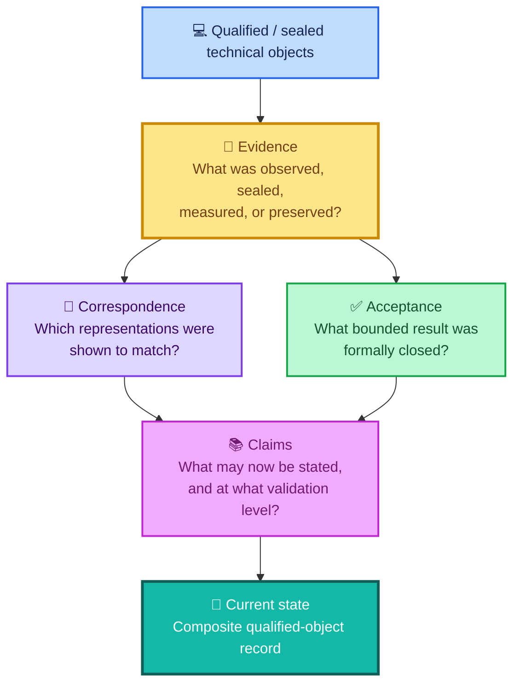

<div align="center">

# ALLIS — Evidence Index

### Public evidence packages supporting bounded ALLIS technical claims

<br>


<br>

**Kidd’s Technical Services · ALLIS**

</div>

---

> [!IMPORTANT]
> This directory is the **top-level evidence index for ALLIS**.
>
> It organizes public, non-sensitive evidence by bounded workstream and technical purpose.
>
> Evidence in this directory supports specific claims within specific scopes. It does **not** mean that every ALLIS subsystem has been verified, that every runtime path currently corresponds to its sealed source, or that the whole ALLIS system has been proven.

The controlling whole-system boundary remains:

```text
SYSTEM_PROVEN=NO
```

---

# 👀 Evidence at a glance

The current public evidence record contains two primary evidence packages:

| Evidence package                                | Scope                                                                                                                                      | Current bounded result                 |
| ----------------------------------------------- | ------------------------------------------------------------------------------------------------------------------------------------------ | -------------------------------------- |
| 🔐 [`governed-evolution/`](governed-evolution/) | Production DGM authorized-adoption formalization, trust/governance correspondence, fail-closed behavior, residuals, and final Step-12 seal | `GREEN_CLOSED_WITH_EXPLICIT_RESIDUALS` |
| 🌐 [`publication/`](publication/)               | Governed immutable publication, read-only runtime boundary, public-network continuity, and final Step-17 evidence close                    | `GREEN_COMPLETE`                       |

These packages answer different technical questions.

Neither silently inherits the authority, proof level, or scope of the other.

---

# 🧭 How the evidence layer fits into ALLIS

ALLIS separates evidence from acceptance, claims, correspondence, and current-state documentation.



The key distinction is:

```text
evidence exists
    ≠
claim is proven
    ≠
correspondence is established
    ≠
workstream is closed
    ≠
whole system is proven
```

---

# 🔐 Governed-evolution evidence

Directory:

[`evidence/governed-evolution/`](governed-evolution/)

This package preserves public evidence for the bounded production authorized-adoption workstream.

Its central architectural principle is:

> **Capability does not create authority.**

The governed-evolution evidence records how ALLIS separates:

```text
candidate generation
        ↓
candidate evaluation
        ↓
evidence
        ↓
independent authorization
        ↓
target / prestate / replay checks
        ↓
governed application
        ↓
poststate verification
        ↓
receipt and evidence
```

Current bounded formal object:

```text
DGM_PRODUCTION_AUTHORIZED_ADOPTION_MODEL_V1
```

Production source identity for the Step-12 formal/correspondence package:

```text
20c8cbe175781c8a1c05d65c03977859ceca884a
```

Final bounded Step-12 state:

```text
GREEN_CLOSED_WITH_EXPLICIT_RESIDUALS
```

## Package contents

### [`governed-evolution/README.md`](governed-evolution/README.md)

Explains the governed-evolution evidence package, its architectural meaning, and its bounded validation state.

### [`governed-evolution/source-identity.md`](governed-evolution/source-identity.md)

Preserves the relevant source identity for the bounded governed-evolution evidence record.

### [`governed-evolution/trust-anchor.md`](governed-evolution/trust-anchor.md)

Preserves the public trust object used in the Step-12 correspondence record.

### [`governed-evolution/governance-view.md`](governed-evolution/governance-view.md)

Preserves the sealed governance-state evidence used by the bounded Step-12 package.

### [`governed-evolution/residuals.md`](governed-evolution/residuals.md)

Preserves explicit residuals and non-promotions so a closed workstream is not silently promoted into a stronger claim.

### [`governed-evolution/step12-final-seal.md`](governed-evolution/step12-final-seal.md)

Preserves the final bounded Step-12 evidence-seal state.

## Related closeout

See:

[`acceptance/closeout/dgm-step12-close.md`](../acceptance/closeout/dgm-step12-close.md)

for the acceptance-side Step-12 conclusion.

## Related correspondence

See:

* [`correspondence/authorized-adoption/model-to-source.md`](../correspondence/authorized-adoption/model-to-source.md)
* [`correspondence/authorized-adoption/source-to-runtime.md`](../correspondence/authorized-adoption/source-to-runtime.md)

for the bounded correspondence records.

---

# 🌐 Publication evidence

Directory:

[`evidence/publication/`](publication/)

This package preserves public evidence for the completed Step-17 governed publication workstream.

The fixed goal was to establish a:

```text
governed
read-only
versioned
live ALLIS publication endpoint
```

consumed by the Evidence & Governance Portal without granting the GUI unrestricted direct access to ALLIS.

Final bounded result:

```text
ALL_STEPS_0_THROUGH_17=GREEN
FINAL_CRITERIA=25_OF_25_PASS
FINAL_NETWORK_CONTINUITY=GREEN

OVERALL_GOAL=GREEN_COMPLETE
```

Final publication identity:

```text
Publication ID:
allis-publication-step6-retention-v2

Publication SHA-256:
d6ab63522f9080fae440578ebbb6ed42140595155c9a30253f5b8eeeef8009b7

Publication payload SHA-256:
04ebb5bc1f97cbf56b8722fea9bcc7e7303cac2f5b467510d7a821d84d4a3c3c
```

Final frontend build observed in the Step-17 publication path:

```text
5By6R3CWTM7NDXc-4lmSi
```

## Package contents

### [`publication/publication-identity.md`](publication/publication-identity.md)

Answers:

> **What exact governed immutable publication object was sealed?**

It records publication identity, integrity, retention, authority/provenance requirements, and bounded meaning.

### [`publication/runtime-boundary.md`](publication/runtime-boundary.md)

Answers:

> **What runtime boundary served the publication, and what evidence shows that the outward path remained read-only and isolated?**

It preserves evidence for:

```text
publication service isolation
loopback-only binding
read-only store access
no public mutation endpoint
authorized routing
no unrestricted GUI access to ALLIS
sealed Landlock runtime provenance
```

### [`publication/network-continuity.md`](publication/network-continuity.md)

Answers:

> **Was the intended public network path reachable at the final Step-17 observation, and how was the transient DNS failure classified and recovered?**

It preserves the bounded continuity and recovery record rather than deleting the earlier failed observation.

### [`publication/step17-final-close.md`](publication/step17-final-close.md)

Answers:

> **What final evidence bundle sealed the Step-17 result?**

It preserves:

```text
25 / 25 completion matrix
final network continuity
publication identity
frontend identity
final SHA-256 seal
predecessor-seal continuity
nonmutation state
successor-authority boundary
```

## Related closeout

See:

[`acceptance/closeout/publication-step17-close.md`](../acceptance/closeout/publication-step17-close.md)

for the acceptance-side bounded Step-17 conclusion.

## Related correspondence

See:

[`correspondence/publication/source-to-publication-to-http-to-gui.md`](../correspondence/publication/source-to-publication-to-http-to-gui.md)

for the source/state → publication → HTTP → GUI correspondence record.

---

# ✅ Evidence and acceptance are not the same thing

The repository deliberately separates:

```text
evidence/
```

from:

```text
acceptance/
```

Evidence asks:

> **What observations, identities, records, tests, seals, or measurements support the claim?**

Acceptance asks:

> **What bounded conclusion was formally accepted from that evidence?**

For example:

```text
evidence/publication/step17-final-close.md
```

records the **final evidence package**.

Whereas:

```text
acceptance/closeout/publication-step17-close.md
```

records the **bounded accepted conclusion**.

One should not replace the other.

---

# 🔗 Evidence and correspondence are not the same thing

Evidence can exist without establishing correspondence.

Correspondence asks whether separately identified representations were shown to match within a defined observation boundary.

Examples include:

```text
formal model
    ↓
sealed source

sealed source
    ↓
observed runtime
```

and:

```text
qualified source/state
    ↓
governed publication
    ↓
direct HTTP body
    ↓
public HTTP body
    ↓
GUI consumption
```

Correspondence is therefore separately documented under:

[`correspondence/`](../correspondence/)

The governing rule is:

> **Correspondence is point-in-time.**

```text
corresponded at seal time
    ≠
guaranteed to correspond forever
```

If a claim-bearing runtime object changes, the relevant correspondence must be re-established.

---

# 📚 Evidence and claims are not the same thing

Evidence does not automatically determine how strongly a statement may be made.

Claims are separately indexed under:

[`claims/`](../claims/)

Current claim records include:

* [`claims/claim-registry.md`](../claims/claim-registry.md)
* [`claims/nonclaims-and-residuals.md`](../claims/nonclaims-and-residuals.md)

A claim may advance only as far as its evidence supports.

The ALLIS validation vocabulary includes bounded states such as:

```text
Implemented
Observed
Demonstrated
Formally Specified
Proven
Machine-Checked
Correspondence-Verified
```

These levels should not be silently collapsed.

---

# 🚧 Closed workstreams retain their limits

A workstream can close successfully while preserving:

* residuals;
* counterexamples;
* negative results;
* unresolved broader questions;
* scope limitations;
* non-promotions;
* time-indexed correspondence.

Therefore:

```text
workstream closed
    ≠
all stronger claims proven
```

The repository intentionally preserves examples of this rule.

Step 12 closed with explicit residuals and a machine-checked disproven proposition.

Step 17 closed its fixed publication goal without promoting that result into whole-system proof.

The controlling boundary remains:

```text
SYSTEM_PROVEN=NO
```

---

# ⛔ Evidence does not create authority

A recurring ALLIS rule is:

> **State does not become authority merely because it exists.**

The same applies to evidence.

```text
evidence exists
    ≠
authority exists

evidence supports a claim
    ≠
publication is authorized

internal state exists
    ≠
public disclosure is authorized

AI generated an output
    ≠
verified evidence exists
```

Authority, disclosure, protected transitions, publication, and documentation each have their own governed boundary.

See:

* [`architecture/authority-planes.md`](../architecture/authority-planes.md)
* [`architecture/fail-closed-semantics.md`](../architecture/fail-closed-semantics.md)
* [`architecture/private-state/h-people-boundary.md`](../architecture/private-state/h-people-boundary.md)

---

# 🧩 Workstream F and the evidence index

Workstream F is part of the current qualified ALLIS record, but the repository does not currently contain a separate:

```text
evidence/workstream-f/
```

package.

Its formal close is documented under:

[`acceptance/closeout/workstream-f-close.md`](../acceptance/closeout/workstream-f-close.md)

The absence of a dedicated Workstream-F evidence directory should not be interpreted as evidence that Workstream F did not occur or did not close.

The repository should not invent a new evidence package merely for directory symmetry.

---

# 🗺️ Current evidence structure

```text
evidence/
│
├── README.md
│
├── governed-evolution/
│   ├── README.md
│   ├── governance-view.md
│   ├── residuals.md
│   ├── source-identity.md
│   ├── step12-final-seal.md
│   └── trust-anchor.md
│
└── publication/
    ├── publication-identity.md
    ├── runtime-boundary.md
    ├── network-continuity.md
    └── step17-final-close.md
```

Each package has a bounded role.

The evidence directory should grow by **evidence domain or bounded workstream**, not as a chronological dump of every development artifact.

---

# 🧭 Where to start

For the present qualified ALLIS state, begin with:

[`CURRENT.md`](../CURRENT.md)

Then review:

[`acceptance/current-system-manifest.md`](../acceptance/current-system-manifest.md)

and:

[`acceptance/baseline-object-registry.md`](../acceptance/baseline-object-registry.md)

Those documents explain how the different qualified source, proof, trust, governance, publication, and frontend objects fit together.

Then use this directory to inspect the evidence supporting the bounded claims.

---

# 🔎 Evidence navigation

## Governed evolution / Step 12

* [Governed-evolution overview](governed-evolution/README.md)
* [Source identity](governed-evolution/source-identity.md)
* [Trust anchor](governed-evolution/trust-anchor.md)
* [Governance view](governed-evolution/governance-view.md)
* [Residuals and non-promotions](governed-evolution/residuals.md)
* [Step-12 final seal](governed-evolution/step12-final-seal.md)

## Publication / Step 17

* [Publication identity](publication/publication-identity.md)
* [Publication runtime boundary](publication/runtime-boundary.md)
* [Publication network continuity](publication/network-continuity.md)
* [Step-17 final evidence close](publication/step17-final-close.md)

## Related acceptance

* [Workstream-F close](../acceptance/closeout/workstream-f-close.md)
* [DGM Step-12 close](../acceptance/closeout/dgm-step12-close.md)
* [Publication Step-17 close](../acceptance/closeout/publication-step17-close.md)

## Related correspondence

* [Correspondence index](../correspondence/README.md)
* [Authorized adoption: model → source](../correspondence/authorized-adoption/model-to-source.md)
* [Authorized adoption: source → runtime](../correspondence/authorized-adoption/source-to-runtime.md)
* [Publication: source → publication → HTTP → GUI](../correspondence/publication/source-to-publication-to-http-to-gui.md)

## Related claims

* [Claim registry](../claims/claim-registry.md)
* [Nonclaims and residuals](../claims/nonclaims-and-residuals.md)

---

# ✅ What this evidence index supports

A defensible description of this directory is:

> **The ALLIS evidence layer preserves bounded, public, non-sensitive technical records supporting specific claims about governed production evolution, formal/correspondence results, immutable publication, runtime isolation, network continuity, and completed workstream evidence seals.**

It does not itself establish:

* whole-system formal verification;
* permanent runtime correspondence;
* universal production-mutation safety;
* authority beyond a bounded workstream;
* unrestricted access to internal ALLIS state;
* public mutation authority;
* or `SYSTEM_PROVEN=YES`.

---

# 🧠 Evidence rule

The evidence layer follows the same rule as the larger ALLIS repository:

> **Current truth is assembled from qualified objects and explicit correspondence—not from whichever file was written most recently.**

And:

> **A claim may advance only as far as its evidence supports.**
