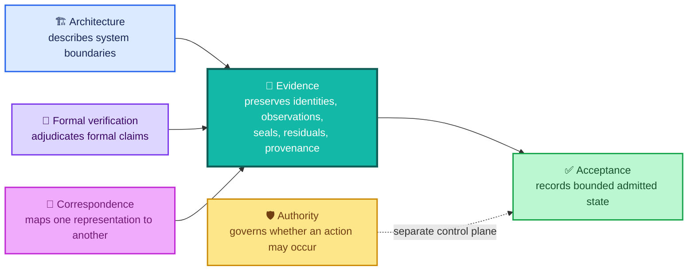
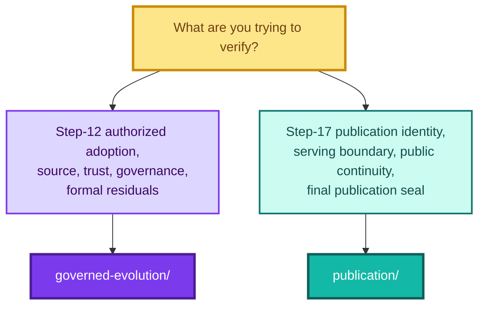

<div align="center">

# ALLIS — Evidence

### Public, non-sensitive records that support and bound technical claims

<br>


<br>

**Kidd’s Technical Services · ALLIS**

</div>

---

> [!IMPORTANT]
> The evidence layer answers:
>
> **What record supports this claim, what exact object does that record refer to, and what does the evidence still not permit us to claim?**

Evidence can support a claim.

Evidence does not create authority beyond the claim it supports.

---

# 👀 Evidence architecture

ALLIS keeps evidence separate from architecture, formal verification, correspondence, acceptance, and operational authority.



These layers inform one another.

They are not interchangeable.

---

# Why the evidence layer exists

A technical record becomes misleading if it preserves successful results while dropping:

- failed claims;
- counterexamples;
- residuals;
- source identities;
- runtime identities;
- evidence repairs;
- scope boundaries;
- non-promotions;
- observation times;
- final seals.

ALLIS therefore treats evidence as a first-class technical layer.

The evidence directory preserves:

- which source object a result applies to;
- which runtime state was observed;
- which trust or governance object was present;
- which formal obligations were closed;
- which propositions were proven;
- which propositions were disproven;
- which stronger claims were deliberately not promoted;
- which residuals remain after closure;
- which publication object was served;
- which runtime boundary enclosed a public service;
- which public path was observed;
- which correspondence edges passed;
- which final evidence seal binds the completed state.

This allows reviewers to distinguish:

```text
intended
    ≠
implemented

implemented
    ≠
observed

observed
    ≠
proven

proven
    ≠
correspondence-verified

correspondence-verified
    ≠
permanently true

verified
    ≠
authorized now
```

---

# Current evidence packages

The evidence directory is organized by bounded technical workstream.

```text
evidence/
├── README.md
│
├── governed-evolution/
│   ├── source-identity.md
│   ├── trust-anchor.md
│   ├── governance-view.md
│   ├── residuals.md
│   └── step12-final-seal.md
│
└── publication/
    ├── readme.md
    ├── publication-identity.md
    ├── runtime-boundary.md
    ├── network-continuity.md
    └── step17-final-close.md
```

The packages have different evidence domains.

```text
governed-evolution/
    =
bounded production authorized-adoption evidence

publication/
    =
bounded governed live-publication evidence
```

Do not merge the two into a single implied whole-system proof.

---

# 🧭 Which package should I read?



---

# Package 1 — Governed evolution

The governed-evolution package supports the bounded production authorized-adoption formal object:

```text
DGM_PRODUCTION_AUTHORIZED_ADOPTION_MODEL_V1
```

The controlling production source commit is:

```text
20c8cbe175781c8a1c05d65c03977859ceca884a
```

The final Step-12 status is:

```text
GREEN_CLOSED_WITH_EXPLICIT_RESIDUALS
```

The controlling final seal is:

```text
STEP12_FINAL_THEOREM_AND_FORMAL_CORRESPONDENCE_SEALED_GREEN_WITH_EXPLICIT_RESIDUALS
```

The final Step-12 evidence identity is:

```text
SHA-256
b00a954a924d3aa3490a5bcb8d4473da2b6885b8c41e116cf03545fee975c23b
```

The controlling scope is:

```text
BOUNDED_PRODUCTION_AUTHORIZED_ADOPTION_FORMAL_MODEL_AND_ESTABLISHED_CORRESPONDENCE_ONLY
```

The seal closes that scope.

It does not enlarge it.

---

# Step-12 evidence state

The bounded formal result records:

```text
12 formal propositions
11 proven
1 disproven
0 unadjudicated
```

Principal validation levels:

```text
T12D-A = MACHINE_CHECKED
T12D-B = CORRESPONDENCE_VERIFIED
T12D-C = CORRESPONDENCE_VERIFIED
P12C-09 = MACHINE_CHECKED_DISPROVEN
```

Runtime source correspondence at final seal:

```text
NBB source correspondence     11/11 PASS
Worker source correspondence  11/11 PASS
```

Final bounded runtime state:

```text
Public trust     PASS
Governance view  PASS
NBB health       PASS
Worker health    PASS
Host health      PASS
Authorized spool PASS_EMPTY
```

Formal obligations:

```text
15 / 15 adjudicated
0 unadjudicated
```

The package still preserves:

```text
8 residuals
7 explicit non-promotions
```

because:

```text
closed
    ≠
everything proven
```

---

# How to read `governed-evolution/`

## `step12-final-seal.md`

Start here for the package-level Step-12 evidence state.

It ties together:

- the formal object;
- production source identity;
- proposition adjudication;
- obligation closure;
- source correspondence;
- public trust;
- governance correspondence;
- residuals;
- non-promotions;
- final scope;
- final evidence identity.

Use this record when the question is:

> **What did Step 12 actually close?**

---

## `source-identity.md`

Use this record to identify the exact source domain to which the bounded formal result applies.

Controlling source commit:

```text
20c8cbe175781c8a1c05d65c03977859ceca884a
```

The bounded Step-12 source domain contains:

```text
11 governed production source files
```

The per-file manifest should contain only identities transcribed from sealed source-manifest evidence.

Do not reconstruct a source manifest from memory or plausible filenames.

This record owns the question:

> **What exact source object did the formal and correspondence work refer to?**

---

## `trust-anchor.md`

Use this record for the public verification trust object.

Sealed production public-key SHA-256:

```text
4809a1af3dd8fad1767dc5a8a9d67aa763388a055e00ec818f15f9fe0321fbb5
```

This record preserves the distinction:

```text
can verify authority
    ≠
can create authority
```

A public verification key can verify an authorization artifact.

It does not create one.

---

## `governance-view.md`

Use this record for the sealed governance-view object at the Step-12 NBB boundary.

Sealed governance-view SHA-256:

```text
26523c0bad40ff06a75c62a802f20195295534764dce45cfa6acdcdaecc3fcc2
```

Final Step-12 result:

```text
Governance view = PASS
```

The governing distinction is:

```text
governance state exists
    ≠
authority to act exists
```

---

## `residuals.md`

Use this record for the eight explicit residuals and seven explicit non-promotions that remain part of the Step-12 evidence state.

| ID | Residual | Classification |
|---|---|---|
| `R12F-01` | Positive production path | `NOT_OBSERVED` |
| `R12F-02` | Terminalization | `DISPROVEN` |
| `R12F-03` | General production mutation safety | `NOT_PROVEN` |
| `R12F-04` | Whole-system safety | `NOT_PROVEN` |
| `R12F-05` | Historical D1R5 domain | `HISTORICAL_ONLY` |
| `R12F-06` | Bounded formal domain | `BOUNDED_DOMAIN` |
| `R12F-07` | Point-in-time correspondence | `POINT_IN_TIME_BINDING` |
| `R12F-08` | External authority | `EXTERNAL_TO_RUNTIME_MODEL` |

The seven non-promotions preserve that:

```text
T12D-A
    ↛
CORRESPONDENCE_VERIFIED
```

```text
P12C-09
    ↛
PROVEN
```

```text
historical D1R5
    ↛
current production proof
```

```text
current bounded proof
    ⇏
ProductionMutationSafety
```

```text
current bounded proof
    ⇏
WholeSystemSafety
```

```text
current bounded proof
    ⇏
SYSTEM_PROVEN
```

```text
MachineCheckedPositivePath
    ⇏
LivePositivePathObserved
```

These are evidence boundaries.

They are not documentation defects.

---

# Package 2 — Publication

The publication package supports the bounded Step-17 governed live-publication result.

Final Step-17 state:

```text
STEP17_STATUS=
GREEN_ALLIS_LIVE_PUBLICATION_ENDPOINT_COMPLETE
```

Fixed-goal result:

```text
ALL_STEPS_0_THROUGH_17=GREEN
FINAL_CRITERIA=25_OF_25_PASS
FINAL_NETWORK_CONTINUITY=GREEN
OVERALL_GOAL=GREEN_COMPLETE
```

Public endpoint state:

```text
ALLIS_LIVE_PUBLICATION_ENDPOINT=COMPLETE
ALLIS_EVIDENCE_GOVERNANCE_PORTAL=LIVE
```

The publication evidence package answers four separate questions:

```text
publication-identity.md
    What exact governed publication object was sealed?

runtime-boundary.md
    How was that publication safely served?

network-continuity.md
    Was the intended public path reachable at final observation?

step17-final-close.md
    What final evidence bundle sealed Step 17?
```

---

# Step-17 publication identity

Final publication ID:

```text
allis-publication-step6-retention-v2
```

Publication SHA-256:

```text
d6ab63522f9080fae440578ebbb6ed42140595155c9a30253f5b8eeeef8009b7
```

Publication payload SHA-256:

```text
04ebb5bc1f97cbf56b8722fea9bcc7e7303cac2f5b467510d7a821d84d4a3c3c
```

Final frontend build:

```text
5By6R3CWTM7NDXc-4lmSi
```

These are distinct identities.

```text
publication ID
    ≠
source commit

publication SHA
    ≠
whole-system hash

payload SHA
    ≠
publication-body SHA

frontend build
    ≠
publication identity
```

---

# Step-17 runtime boundary

The final bounded serving state records:

```text
PUBLICATION_SERVICE_ISOLATION=GREEN
PUBLICATION_SERVICE_LOOPBACK_ONLY=GREEN
STRICT_READ_ONLY_PUBLICATION_BOUNDARY=GREEN
NO_PUBLIC_MUTATION_ENDPOINT=GREEN
CADDY_AUTHORIZED_ROUTING=GREEN
GUI_NO_DIRECT_ALLIS_ACCESS=GREEN
```

Final listener evidence:

```text
loopback listener count = 1
wildcard listener count = 0
listener = 127.0.0.1:8096
```

The serving model is:


The public publication path is a read plane.

It is not a public control plane.

---

# Step-17 network continuity

The final bounded recovery observation records:

```text
DNS_RC=0

PUBLICATION_CURL_RC=0
PUBLICATION_STATUS=200

GUI_CURL_RC=0
GUI_STATUS=200

PUBLIC_CONTINUITY_ATTEMPT_RESULT=PASS

PUBLIC_CONTINUITY_RECOVERED=YES
PUBLIC_NETWORK_CONTINUITY=PASS
```

Final result:

```text
FINAL_NETWORK_CONTINUITY=GREEN
```

The direct and public bodies also matched:

```text
FINAL_DIRECT_PUBLIC_BODY_CORRESPONDENCE=PASS
```

with publication SHA:

```text
d6ab63522f9080fae440578ebbb6ed42140595155c9a30253f5b8eeeef8009b7
```

---

# The prior DNS timeout remains evidence

Before final recovery, a public `/evidence` request encountered a DNS-resolution timeout.

The final adjudication is:

```text
NETWORK_FAILURE_CLASSIFICATION=
TRANSIENT_EXTERNAL_NAME_RESOLUTION_FAILURE_RECOVERED

NETWORK_CONTINUITY_RECOVERY=PASS

PRODUCTION_REPAIR_REQUIRED=NO

TRANSIENT_DNS_ADJUDICATION=PASS
```

The recovered final state does not erase the earlier observation.

This preserves:

```text
failure observed
    ↓
failure classified from evidence
    ↓
bounded path re-observed
    ↓
recovery established
```

instead of rewriting history as though the failure never occurred.

---

# Step-17 final evidence close

The final 25-condition matrix records:

```text
FINAL_CRITERION_COUNT=25
FINAL_CRITERION_PASS_COUNT=25
FINAL_CRITERION_FAILURE_COUNT=0
FINAL_FIXED_GOAL_COMPLETION_MATRIX=PASS
```

The final SHA-256 evidence manifest was created and verified:

```text
STEP17_FINAL_MANIFEST_CREATED=PASS
STEP17_FINAL_MANIFEST_VERIFICATION=PASS
```

Predecessor seal continuity also passed:

```text
STEP16_FINAL_SEAL_AFTER_COMPLETION=PASS
STEP17_R1A_SEAL_AFTER_COMPLETION=PASS
```

Final audit:

```text
STEP17_FINAL_AUDIT=PASS
```

---

# Step-17 final evidence objects

The final completion seal includes:

```text
docs/publication/STEP17_R1A_SHA256SUMS.txt

docs/publication/STEP16_FINAL_SHA256SUMS.txt

build/step17/r2/final-fixed-goal-criteria.json

build/step17/r2/final-browser-dom.html

build/step17/r2/final-browser-visible-text.txt

build/step17/r2/final-browser.log

build/step17/r2r1/loopback-evidence-source-repair.json

build/step17/r2r1/final-fixed-goal-criteria-r1.json

build/step17/r2r2/network-continuity-attempts.txt

build/step17/r2r2/network-continuity-adjudication.json

build/step17/r2r2/final-direct-publication.json

build/step17/r2r2/final-public-publication.json

build/step17/r2r2/final-publication.headers

build/step17/r2r2/step17-final-audit.json

docs/publication/STEP17_FINAL_COMPLETION.md
```

The public Markdown records in this repository explain these evidence objects.

They do not replace the sealed engineering artifacts.

---

# Final Step-17 nonmutation state

The final closeout records:

```text
SUDO_INVOKED=NO
QUALIFIED_SOURCE_MODIFIED=NO
PUBLICATION_CODE_MODIFIED=NO
PUBLICATION_STORE_MODIFIED=NO
PUBLICATION_SERVICE_RESTARTED=NO
FRONTEND_SOURCE_MODIFIED=NO
FRONTEND_RUNTIME_MODIFIED=NO
FRONTEND_RESTARTED=NO
CADDYFILE_MODIFIED=NO
CADDY_RELOADED=NO
CLOUDFLARED_MODIFIED=NO
SYSTEMD_DEFINITION_MODIFIED=NO
```

This means the **final verification and sealing operation** did not modify the listed production/source/runtime objects.

It does not mean those objects can never change under a future governed workstream.

---

# How to read `publication/`

## `publication-identity.md`

Start here when the question is:

> **What exact publication object was sealed?**

Use it for:

- publication ID;
- publication body SHA-256;
- payload SHA-256;
- frozen-contract validation;
- reference resolution;
- publication authority identity;
- source-state identification;
- immutable publication ID;
- prior-publication retention;
- privacy and eligibility governance.

It owns **object identity**.

---

## `runtime-boundary.md`

Use this record when the question is:

> **How was the governed publication safely served?**

Use it for:

- publication-service role;
- non-root service identity;
- service hardening;
- read-only publication store;
- publication-service isolation;
- inability to mutate qualified ALLIS;
- loopback-only listener;
- zero wildcard listeners;
- sealed Landlock runtime provenance;
- authorized Caddy route;
- no public mutation endpoint;
- GUI no-direct-ALLIS boundary;
- restart and rollback evidence.

It owns **serving-boundary evidence**.

---

## `network-continuity.md`

Use this record when the question is:

> **Did the intended public path actually work at final observation?**

Use it for:

- DNS recovery;
- publication endpoint HTTP result;
- GUI `/evidence` HTTP result;
- expected publication ID;
- expected publication SHA;
- expected payload SHA;
- direct/public body correspondence;
- prior DNS timeout;
- final failure classification;
- recovery without production repair.

It owns **public-path continuity evidence**.

---

## `step17-final-close.md`

Use this record when the question is:

> **What final evidence package sealed Step 17?**

Use it for:

- 25-of-25 completion matrix;
- evidence-source repair;
- final publication and frontend identities;
- final network state;
- final audit;
- final SHA-256 completion seal;
- predecessor-seal continuity;
- final nonmutation;
- fixed-goal terminal state;
- successor-workstream boundary.

It owns the **final evidence close**.

---

# Publication evidence and publication correspondence

These layers are deliberately separate.

The evidence package preserves:

```text
publication identity
runtime boundary
network observation
final evidence seal
```

The publication correspondence package records:

```text
qualified state
    ↓
governed publication
    ↓
direct publication service
    ↓
public HTTPS publication
    ↓
Evidence & Governance Portal
```

Therefore:

```text
evidence
    ≠
correspondence

but

correspondence requires evidence
```

Use:

```text
correspondence/publication/
source-to-publication-to-http-to-gui.md
```

for edge-by-edge relationship claims.

Use:

```text
evidence/publication/
```

for the evidence identities and observations supporting those edges.

---

# Evidence and acceptance are different

Acceptance records what bounded state has been admitted as the current technical record.

Evidence records what supports that conclusion.

For Step 17:

```text
acceptance/closeout/publication-step17-close.md
    =
What final bounded conclusion was accepted?
```

while:

```text
evidence/publication/step17-final-close.md
    =
What final evidence bundle supports that close?
```

The two documents should agree.

They should not duplicate one another.

---

# Evidence and architecture are different

Architecture explains system design and authority boundaries.

Evidence records what was actually identified, observed, demonstrated, or sealed.

Examples:

```text
architecture/authority-planes.md
    =
Where are authority crossings?

architecture/fail-closed-semantics.md
    =
What do safe non-success states mean?

evidence/publication/runtime-boundary.md
    =
What runtime boundary was actually demonstrated for Step 17?
```

Architecture can define a required control.

Evidence determines whether that control has been supported in a bounded result.

---

# Evidence and formal verification are different

The formal-verification layer contains mathematical objects and proposition adjudication.

```text
formal-verification/
    authorized-adoption/
        formal-model.md
        theorem-registry.md
        counterexample-registry.md
```

The evidence layer does not replace those documents.

Instead:

```text
formal model
    ↓
What mathematical object is being studied?

theorem registry
    ↓
Which propositions are proven, disproven,
machine-checked, or correspondence-verified?

counterexample registry
    ↓
Which proposed universal property was falsified?

evidence
    ↓
What source, runtime, trust, governance,
publication, residual, and seal identities
support and constrain those results?
```

---

# Evidence does not create operational authority

The evidence directory documents what is known.

It does not authorize what the system may do next.

For Step 12:

```text
REAL_PRODUCTION_AUTHORIZATION_PUBLICATION=NOT_PERFORMED
REAL_PRODUCTION_AUTHORIZATION_CONSUMPTION=NOT_PERFORMED
REAL_PRODUCTION_DGM_PATCH_APPLICATION=NOT_PERFORMED
```

For Step 17:

```text
FURTHER_IMPLEMENTATION_AUTHORITY=
NONE_REQUIRED_FOR_FIXED_GOAL
```

This means the fixed Step-17 goal needs no additional implementation step.

It does not mean arbitrary future capability is pre-authorized.

A new capability requires a new governed workstream.

---

# Evidence repairs are evidence

An evidence discrepancy should not be hidden merely because the final result later passes.

Step 17 preserves the loopback evidence-source repair.

The completion harness initially read the loopback-only criterion from the wrong intermediate evidence source.

The final repair:

- identified the correct authoritative Step-16 audit;
- independently rechecked the listener evidence;
- established one loopback listener;
- established zero wildcard listeners;
- resolved the criterion;
- restored the legitimate 25-of-25 matrix;
- did not require production mutation.

The corrected state does not make the earlier evidence-source problem disappear.

---

# Residuals are evidence

Residuals are not failed documentation.

They are adjudicated boundaries.

For Step 12:

```text
Unadjudicated = 0
Residuals     = 8
```

Both statements are true.

A result can be completely adjudicated as:

```text
PROVEN
DISPROVEN
NOT_OBSERVED
NOT_PROVEN
HISTORICAL_ONLY
BOUNDED_DOMAIN
POINT_IN_TIME_BINDING
EXTERNAL_TO_RUNTIME_MODEL
```

A known limitation is evidence.

---

# Counterexamples are evidence

The machine-executed counterexample to:

```text
P12C-09
```

is preserved because it falsified the proposed unconditional terminal-totality property.

The governing rule is:

> **Evidence constrains the architecture. The architecture does not rewrite the evidence.**

A public evidence package that preserves only successful results is incomplete.

---

# Failed and superseded states remain traceable

When a later repair or stronger result replaces an earlier state, preserve enough evidence to understand the transition.

```text
prior state
    ↓
discrepancy / counterexample / failure
    ↓
repair or adjudication
    ↓
new evidence
    ↓
new qualified state
```

Examples include:

- Step-12 terminalization counterexample;
- Step-17 loopback evidence-source repair;
- Step-17 transient DNS timeout and recovery.

The corrected state should not create the appearance that the discrepancy never occurred.

---

# Point-in-time evidence

Runtime evidence is temporal.

If correspondence is established at observation time `τ`:

```math
C^{\tau}=1
```

that does not establish:

```math
\forall t>\tau,\; C^t=1
```

without future revalidation.

This applies to:

- source/runtime correspondence;
- trust state;
- governance state;
- service health;
- listener state;
- public route state;
- DNS state;
- network continuity;
- GUI consumption;
- direct/public publication correspondence.

```text
observed once
    ≠
guaranteed forever
```

---

# Durable identity and temporal observation are different

The evidence layer contains both.

## Durable evidence identity

Examples:

```text
source commit
publication ID
publication SHA
trust-anchor hash
governance-view hash
final evidence seal
```

## Temporal observation

Examples:

```text
service active
listener count
DNS resolution
HTTP 200
GUI reachable
runtime correspondence
network continuity
```

A durable object can remain identified while the runtime around it changes.

Do not collapse these evidence classes.

---

# Public and private evidence

This repository exposes enough public evidence to make technical claims reviewable without publishing sensitive operational material.

## Appropriate public evidence

Examples include:

- source commit identities;
- non-sensitive source-file hashes;
- public-key hashes;
- governance-object hashes;
- formal-object identifiers;
- theorem validation levels;
- proposition counts;
- residuals;
- non-promotions;
- publication IDs;
- publication hashes;
- public-safe listener counts;
- public endpoint status;
- public-safe correspondence summaries;
- seal identities;
- public-safe provenance descriptions.

## Evidence that remains private

Examples include:

- private signing keys;
- passwords;
- tokens;
- active credentials;
- secret material;
- live authorization artifacts where disclosure would weaken controls;
- unnecessary internal network details;
- sensitive runtime configuration;
- exploit-relevant security details;
- evidence containing private personal information.

Public transparency does not require publishing secrets.

---

# What belongs in `evidence/`

A record belongs here when its primary purpose is to preserve:

- an evidence identity;
- a cryptographic identity;
- a source identity;
- a publication identity;
- an observed runtime state;
- an observed network state;
- a correspondence-supporting artifact;
- an obligation disposition;
- a residual;
- a non-promotion;
- a final seal;
- a public-safe evidence manifest;
- provenance required to audit a technical claim.

---

# What does not belong in `evidence/`

Do not use this directory as a catch-all.

Use:

```text
architecture/
```

for explanatory system design and authority boundaries.

Use:

```text
formal-verification/
```

for formal models, theorem status, and counterexamples.

Use:

```text
correspondence/
```

for mappings between model, source, runtime, publication, HTTP, and GUI representations.

Use:

```text
acceptance/
```

for qualified-baseline admission and accepted closeout status.

Use:

```text
measurements/
```

for measurement definitions and reproducible empirical quantities.

Use private operational storage for:

- credentials;
- raw sensitive runtime bundles;
- signing secrets;
- private authorization material;
- private personal data;
- other non-public evidence.

---

# Naming and identity rules

Use stable, descriptive evidence names.

Good examples:

```text
source-identity.md
trust-anchor.md
governance-view.md
residuals.md
step12-final-seal.md
publication-identity.md
runtime-boundary.md
network-continuity.md
step17-final-close.md
```

Avoid names such as:

```text
notes.md
final.md
results2.md
latest.md
```

Where an evidence object has a cryptographic identity:

```text
record the exact algorithm and digest
```

Where an evidence object is bound to a source commit:

```text
record the full commit identity
```

Where an observation is point-in-time:

```text
say so explicitly
```

Where a source or proof domain is bounded:

```text
state the boundary explicitly
```

---

# Claim-preservation rules

An evidence record must not silently convert:

```text
MACHINE_CHECKED
```

into:

```text
CORRESPONDENCE_VERIFIED
```

It must not convert:

```text
NOT_OBSERVED
```

into:

```text
OBSERVED
```

It must not convert:

```text
NOT_PROVEN
```

into:

```text
PROVEN
```

It must not convert:

```text
temporary public reachability
```

into:

```text
permanent availability
```

It must not convert:

```text
publication identity
```

into:

```text
source identity
```

It must not convert:

```text
SYSTEM_PROVEN=NO
```

into:

```text
SYSTEM_PROVEN=YES
```

without new evidence that explicitly earns that promotion.

---

# Current whole-system boundary

The current evidence packages establish strong bounded results.

They do not establish a whole-system ALLIS proof.

The controlling statements remain:

```text
PRODUCTION_MUTATION_SAFETY_THEOREM_PROVEN=NO

WHOLE_SYSTEM_SAFETY_THEOREM_PROVEN=NO

SYSTEM_PROVEN=NO
```

These are explicit boundaries.

They are not unresolved placeholders.

---

# Evidence chains

## Governed evolution

```text
sealed source identity
        ↓
formal object derived from source
        ↓
formal propositions adjudicated
        ↓
counterexample preserved
        ↓
model-to-source correspondence
        ↓
source-to-runtime correspondence
        ↓
trust and governance identities checked
        ↓
residuals and non-promotions preserved
        ↓
final Step-12 seal
```

## Publication

```text
qualified controlled state
        ↓
publication authority + eligibility
        ↓
immutable publication identity
        ↓
isolated read-only publication runtime
        ↓
loopback service
        ↓
authorized public route
        ↓
public publication identity re-observed
        ↓
GUI reachable through governed path
        ↓
direct/public body correspondence
        ↓
network continuity adjudicated
        ↓
25-of-25 completion matrix
        ↓
final Step-17 audit
        ↓
final SHA-256 evidence seal
```

The seals bind their respective packages.

They do not erase the different evidentiary roles of the records inside them.

---

# 🧾 Evidence package comparison

| Question | Governed evolution | Publication |
|---|---|---|
| Primary workstream | Step 12 | Step 17 |
| Main object | Authorized-adoption formal/runtime domain | Governed live publication path |
| Source identity | Production DGM source commit | Composite qualified publication provenance |
| Formal proposition state | 12 adjudicated | Not the package’s primary role |
| Counterexample | P12C-09 preserved | N/A as primary publication result |
| Residuals | 8 explicit | Scope/nonclaim boundaries preserved in claims/acceptance |
| Runtime evidence | NBB/worker/trust/governance | Publication service/listener/GUI route |
| Public object | Not the primary package object | Immutable governed publication |
| Network continuity | Not the primary package object | Final Step-17 evidence domain |
| Final seal | Step-12 final seal | Step-17 final completion seal |
| Whole-system proof | No | No |

---

# Reviewer path

For the shortest accurate review:

```text
1. CURRENT.md
        ↓
2. acceptance/current-system-manifest.md
        ↓
3. claims/claim-registry.md
        ↓
4. evidence/README.md
        ↓
5. choose the relevant evidence package
```

For Step 12:

```text
governed-evolution/step12-final-seal.md
        ↓
source-identity.md
trust-anchor.md
governance-view.md
residuals.md
```

For Step 17:

```text
publication/step17-final-close.md
        ↓
publication-identity.md
runtime-boundary.md
network-continuity.md
        ↓
correspondence/publication/
source-to-publication-to-http-to-gui.md
```

---

# Core commitment

The evidence layer enforces one rule:

> **A claim may advance only as far as its evidence supports.**

For ALLIS:

```text
evidence exists
    ≠
authority exists

evidence supports a bounded claim
    ≠
evidence supports every stronger claim

seal exists
    ≠
future state automatically inherits the seal

publication is reachable
    ≠
publication has write authority

runtime correspondence passed once
    ≠
runtime correspondence is permanent

proof exists
    ≠
production action is authorized
```

The purpose of `evidence/` is to keep those distinctions durable, reviewable, and difficult to erase accidentally.

---

<div align="center">

## Current evidence state

### 🟣 Governed evolution

**Step 12**

`GREEN_CLOSED_WITH_EXPLICIT_RESIDUALS`

### 🟢 Publication

**Step 17**

`GREEN_COMPLETE`

`25 / 25 PASS`

`FINAL_NETWORK_CONTINUITY=GREEN`

<br>

### Repository-wide boundary

# `SYSTEM_PROVEN=NO`

</div>
