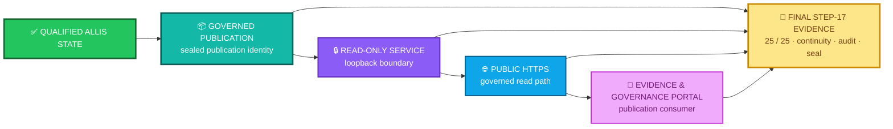

<div align="center">

# ALLIS — Publication Evidence

### Evidence supporting the bounded Step-17 governed live-publication result

<br>


<br>

**Kidd’s Technical Services · ALLIS**

</div>

---

> [!IMPORTANT]
> This directory preserves the public, non-sensitive evidence record for the **bounded Step-17 governed publication workstream**.
>
> It supports claims about the publication object, its serving boundary, the observed public path, and the final Step-17 evidence close.
>
> It does **not** establish whole-system proof, permanent future correspondence, or public mutation authority.

---

# 👀 Publication evidence in one view



The package preserves four separate evidence questions:

```text
publication identity
    ↓
What exact governed publication object was sealed?

runtime boundary
    ↓
How was that publication safely served?

network continuity
    ↓
Did the intended public path work at final observation?

final evidence close
    ↓
What evidence bundle closed Step 17?
```

These questions are related.

They are not interchangeable.

---

# 🎯 Purpose

The publication evidence package exists to preserve the evidence supporting the final Step-17 bounded result:

```text
ALL_STEPS_0_THROUGH_17=GREEN

FINAL_CRITERIA=25_OF_25_PASS

FINAL_NETWORK_CONTINUITY=GREEN

OVERALL_GOAL=GREEN_COMPLETE
```

The final publication state records:

```text
ALLIS_LIVE_PUBLICATION_ENDPOINT=COMPLETE

ALLIS_EVIDENCE_GOVERNANCE_PORTAL=LIVE
```

The evidence package makes those statements reviewable without turning the public documentation itself into a substitute for the sealed engineering artifacts.

---

# 📁 Package structure

```text
evidence/
└── publication/
    ├── README.md
    ├── publication-identity.md
    ├── runtime-boundary.md
    ├── network-continuity.md
    └── step17-final-close.md
```

Each file owns a different evidence domain.

| Record                                               | Evidence domain                | Primary question                          |
| ---------------------------------------------------- | ------------------------------ | ----------------------------------------- |
| [`publication-identity.md`](publication-identity.md) | Governed publication identity  | What exact publication object was sealed? |
| [`runtime-boundary.md`](runtime-boundary.md)         | Serving and isolation boundary | How was the publication safely served?    |
| [`network-continuity.md`](network-continuity.md)     | Final public-path observation  | Did the intended public path work?        |
| [`step17-final-close.md`](step17-final-close.md)     | Final evidence bundle and seal | What evidence closed Step 17?             |

This README is the package index.

It does not replace any of those records.

---

# 📦 1. Publication identity

The final governed publication object is identified as:

```text
Publication ID:
allis-publication-step6-retention-v2
```

Publication SHA-256:

```text
d6ab63522f9080fae440578ebbb6ed42140595155c9a30253f5b8eeeef8009b7
```

Publication payload SHA-256:

```text
04ebb5bc1f97cbf56b8722fea9bcc7e7303cac2f5b467510d7a821d84d4a3c3c
```

Final frontend build:

```text
5By6R3CWTM7NDXc-4lmSi
```

These identities belong to different objects.

```text
publication ID
    ≠
source commit
```

```text
publication SHA
    ≠
whole-system hash
```

```text
payload SHA
    ≠
frontend build identity
```

```text
frontend build
    ≠
publication object
```

Use [`publication-identity.md`](publication-identity.md) for the full publication-identity record.

---

# 🔒 2. Runtime boundary

The final Step-17 publication service remained a governed **read plane**.

The bounded serving state records:

```text
PUBLICATION_SERVICE_ISOLATION=GREEN

PUBLICATION_SERVICE_LOOPBACK_ONLY=GREEN

STRICT_READ_ONLY_PUBLICATION_BOUNDARY=GREEN

NO_PUBLIC_MUTATION_ENDPOINT=GREEN

CADDY_AUTHORIZED_ROUTING=GREEN

GUI_NO_DIRECT_ALLIS_ACCESS=GREEN
```

Final listener evidence:

```text
loopback listener count = 1

wildcard listener count = 0

listener = 127.0.0.1:8096
```

The serving relationship is:


Therefore:

```text
public read access
    ≠
public write authority
```

and:

```text
GUI access to governed publication
    ≠
unrestricted GUI access to ALLIS
```

Use [`runtime-boundary.md`](runtime-boundary.md) for the complete serving-boundary evidence record.

---

# 🌐 3. Network continuity

The final bounded public-path observation records:

```text
DNS_RC=0

PUBLICATION_CURL_RC=0
PUBLICATION_STATUS=200

GUI_CURL_RC=0
GUI_STATUS=200

PUBLIC_CONTINUITY_ATTEMPT_RESULT=PASS

PUBLIC_CONTINUITY_RECOVERED=YES

PUBLIC_NETWORK_CONTINUITY=PASS
```

Final state:

```text
FINAL_NETWORK_CONTINUITY=GREEN
```

The direct and public publication bodies also corresponded:

```text
FINAL_DIRECT_PUBLIC_BODY_CORRESPONDENCE=PASS
```

against publication SHA-256:

```text
d6ab63522f9080fae440578ebbb6ed42140595155c9a30253f5b8eeeef8009b7
```

Use [`network-continuity.md`](network-continuity.md) for the complete public-path and recovery record.

---

# 🌦️ The prior DNS timeout remains part of the evidence

An earlier public `/evidence` request encountered a DNS-resolution timeout.

That observation remains part of the engineering history.

It was not removed simply because the final continuity attempt succeeded.

Final adjudication:

```text
NETWORK_FAILURE_CLASSIFICATION=
TRANSIENT_EXTERNAL_NAME_RESOLUTION_FAILURE_RECOVERED

NETWORK_CONTINUITY_RECOVERY=PASS

PRODUCTION_REPAIR_REQUIRED=NO

TRANSIENT_DNS_ADJUDICATION=PASS
```

The evidence therefore preserves the sequence:

```text
failure observed
    ↓
failure classified
    ↓
bounded path re-observed
    ↓
recovery demonstrated
```

rather than rewriting the record as:

```text
final success
    =
earlier failure never occurred
```

This distinction preserves causality.

---

# ✅ 4. Final Step-17 evidence close

The final completion matrix records:

```text
FINAL_CRITERION_COUNT=25

FINAL_CRITERION_PASS_COUNT=25

FINAL_CRITERION_FAILURE_COUNT=0

FINAL_FIXED_GOAL_COMPLETION_MATRIX=PASS
```

The final evidence manifest was created and verified:

```text
STEP17_FINAL_MANIFEST_CREATED=PASS

STEP17_FINAL_MANIFEST_VERIFICATION=PASS
```

Predecessor seal continuity also passed:

```text
STEP16_FINAL_SEAL_AFTER_COMPLETION=PASS

STEP17_R1A_SEAL_AFTER_COMPLETION=PASS
```

Final audit:

```text
STEP17_FINAL_AUDIT=PASS
```

Use [`step17-final-close.md`](step17-final-close.md) for the complete final evidence-close record.

---

# 🧾 Final Step-17 evidence objects

The final completion package identifies evidence including:

```text
docs/publication/STEP17_R1A_SHA256SUMS.txt

docs/publication/STEP16_FINAL_SHA256SUMS.txt

build/step17/r2/final-fixed-goal-criteria.json

build/step17/r2/final-browser-dom.html

build/step17/r2/final-browser-visible-text.txt

build/step17/r2/final-browser.log

build/step17/r2r1/loopback-evidence-source-repair.json

build/step17/r2r1/final-fixed-goal-criteria-r1.json

build/step17/r2r2/network-continuity-attempts.txt

build/step17/r2r2/network-continuity-adjudication.json

build/step17/r2r2/final-direct-publication.json

build/step17/r2r2/final-public-publication.json

build/step17/r2r2/final-publication.headers

build/step17/r2r2/step17-final-audit.json

docs/publication/STEP17_FINAL_COMPLETION.md
```

The Markdown files in this public repository explain the evidence state.

They do not replace the sealed engineering artifacts.

---

# 🛡️ Final nonmutation state

The final Step-17 verification and sealing operation records:

```text
SUDO_INVOKED=NO

QUALIFIED_SOURCE_MODIFIED=NO

PUBLICATION_CODE_MODIFIED=NO

PUBLICATION_STORE_MODIFIED=NO

PUBLICATION_SERVICE_RESTARTED=NO

FRONTEND_SOURCE_MODIFIED=NO

FRONTEND_RUNTIME_MODIFIED=NO

FRONTEND_RESTARTED=NO

CADDYFILE_MODIFIED=NO

CADDY_RELOADED=NO

CLOUDFLARED_MODIFIED=NO

SYSTEMD_DEFINITION_MODIFIED=NO
```

This statement applies to the **final verification and sealing operation**.

It does not mean these objects can never change.

A future governed workstream may change a qualified object under new authority and new evidence.

---

# 🔗 Evidence and correspondence

Evidence and correspondence answer different questions.

```text
EVIDENCE
    =
What objects, identities, observations,
seals, failures, recoveries, and audits exist?
```

```text
CORRESPONDENCE
    =
What relationship among those objects
was established at a particular observation?
```

For Step 17:

```text
qualified state
    ↓
governed publication
    ↓
direct publication service
    ↓
public HTTPS publication
    ↓
Evidence & Governance Portal
```

The corresponding repository record is:

[`../../correspondence/publication/source-to-publication-to-http-to-gui.md`](../../correspondence/publication/source-to-publication-to-http-to-gui.md)

The evidence package supports those relationships.

It does not collapse the objects into one identity.

---

# ✅ Evidence and acceptance

Acceptance records the bounded conclusion admitted into the current technical record.

Evidence records what supports that conclusion.

For Step 17:

```text
acceptance/closeout/publication-step17-close.md
    =
What bounded publication result was accepted?
```

while:

```text
evidence/publication/step17-final-close.md
    =
What evidence bundle supports that accepted close?
```

Use:

[`../../acceptance/closeout/publication-step17-close.md`](../../acceptance/closeout/publication-step17-close.md)

for the accepted Step-17 workstream close.

Use this directory for the supporting evidence records.

---

# 🧠 Evidence and architecture

Architecture describes the system model and its intended authority boundaries.

Evidence records what was actually identified, observed, demonstrated, or sealed within a bounded workstream.

For example:

```text
architecture/authority-planes.md
    =
Where do authority transitions occur?
```

```text
architecture/fail-closed-semantics.md
    =
How are safe non-success states classified?
```

```text
evidence/publication/runtime-boundary.md
    =
What serving boundary was actually demonstrated
during the Step-17 workstream?
```

Relevant architecture:

* [`../../architecture/authority-planes.md`](../../architecture/authority-planes.md)
* [`../../architecture/fail-closed-semantics.md`](../../architecture/fail-closed-semantics.md)

---

# 🧭 Recommended reading order

For a reviewer examining the live-publication result:

```text
1. README.md
       ↓
2. publication-identity.md
       ↓
3. runtime-boundary.md
       ↓
4. network-continuity.md
       ↓
5. step17-final-close.md
       ↓
6. publication correspondence
       ↓
7. acceptance closeout
```

Or by question:

| Question                                                   | Read                                                                                                                                                   |
| ---------------------------------------------------------- | ------------------------------------------------------------------------------------------------------------------------------------------------------ |
| What publication object was sealed?                        | [`publication-identity.md`](publication-identity.md)                                                                                                   |
| How was it served without creating a public control plane? | [`runtime-boundary.md`](runtime-boundary.md)                                                                                                           |
| Did the final public path work?                            | [`network-continuity.md`](network-continuity.md)                                                                                                       |
| What evidence closed Step 17?                              | [`step17-final-close.md`](step17-final-close.md)                                                                                                       |
| How do source, publication, HTTP, and GUI relate?          | [`../../correspondence/publication/source-to-publication-to-http-to-gui.md`](../../correspondence/publication/source-to-publication-to-http-to-gui.md) |
| What bounded conclusion was accepted?                      | [`../../acceptance/closeout/publication-step17-close.md`](../../acceptance/closeout/publication-step17-close.md)                                       |

---

# 🕒 Evidence is time-bounded

The Step-17 publication evidence records a bounded observed state.

```text
observed at final Step-17 close
    ≠
guaranteed forever
```

The publication correspondence is therefore point-in-time.

A claim-bearing change may require renewed evidence.

Examples include:

* publication-body changes;
* publication-ID changes;
* source/state changes affecting publication content;
* publication-authority changes;
* privacy or eligibility-rule changes;
* publication-service code changes;
* listener or bind changes;
* proxy or route changes;
* public host/path changes;
* frontend-build changes;
* GUI data-flow changes;
* publication-store changes;
* epistemic-state rendering changes.

A changed object does not erase the historical Step-17 evidence.

It may invalidate a claim that the historical observation remains current.

---

# 🚫 Stronger claims not supported

This package does **not** establish:

```text
SYSTEM_PROVEN=YES
```

It does not establish:

```text
WHOLE_SYSTEM_SAFETY_THEOREM_PROVEN=YES
```

It does not establish:

```text
PRODUCTION_MUTATION_SAFETY_THEOREM_PROVEN=YES
```

It does not establish:

```text
all ALLIS internal state is publicly exposed
```

It does not establish:

```text
the public endpoint has write authority
```

It does not establish:

```text
the GUI has unrestricted direct ALLIS access
```

It does not establish:

```text
publication JSON
    =
raw internal system state
```

It does not establish:

```text
GUI HTML
    =
publication JSON
```

It does not establish:

```text
final network continuity
    =
permanent future network continuity
```

It does not establish:

```text
Step 17 closure
    =
authority for a successor workstream
```

---

# ✅ Supported bounded claim

A concise supported statement is:

> **At the final Step-17 observation, the governed ALLIS publication `allis-publication-step6-retention-v2` was served through the bounded read-only publication path; the direct loopback and public HTTPS publication bodies corresponded; the public publication endpoint and Evidence & Governance Portal were reachable; the fixed-goal matrix passed 25 of 25 criteria; and the final Step-17 evidence manifest and audit passed.**

That statement remains bounded by:

* the Step-17 fixed goal;
* the identified publication object;
* the final publication SHA;
* the final frontend build;
* the final runtime observation;
* the final network-continuity observation;
* the final evidence seal.

---

# 📊 Package status

| Evidence area                     | Final bounded status        |
| --------------------------------- | --------------------------- |
| Publication identity              | 🟢 Sealed                   |
| Publication integrity             | 🟢 Green                    |
| Publication service isolation     | 🟢 Green                    |
| Loopback-only serving             | 🟢 Green                    |
| Public mutation endpoint          | 🟢 Absent                   |
| Authorized public routing         | 🟢 Green                    |
| Direct/public body correspondence | 🟢 Pass                     |
| Public publication endpoint       | 🟢 HTTP 200                 |
| Evidence & Governance Portal      | 🟢 HTTP 200                 |
| Network continuity                | 🟢 Green                    |
| Prior DNS failure                 | 🟢 Classified and recovered |
| Final criteria                    | 🟢 25 / 25 Pass             |
| Final manifest verification       | 🟢 Pass                     |
| Predecessor-seal continuity       | 🟢 Pass                     |
| Final audit                       | 🟢 Pass                     |
| Whole-system proof                | ⚪ `SYSTEM_PROVEN=NO`        |

---

# 📚 Related repository records

## Parent evidence index

* [`../README.md`](../README.md)

## Publication evidence

* [`publication-identity.md`](publication-identity.md)
* [`runtime-boundary.md`](runtime-boundary.md)
* [`network-continuity.md`](network-continuity.md)
* [`step17-final-close.md`](step17-final-close.md)

## Publication correspondence

* [`../../correspondence/publication/source-to-publication-to-http-to-gui.md`](../../correspondence/publication/source-to-publication-to-http-to-gui.md)

## Acceptance

* [`../../acceptance/current-system-manifest.md`](../../acceptance/current-system-manifest.md)
* [`../../acceptance/baseline-object-registry.md`](../../acceptance/baseline-object-registry.md)
* [`../../acceptance/closeout/publication-step17-close.md`](../../acceptance/closeout/publication-step17-close.md)

## Claims

* [`../../claims/claim-registry.md`](../../claims/claim-registry.md)
* [`../../claims/nonclaims-and-residuals.md`](../../claims/nonclaims-and-residuals.md)

## Architecture

* [`../../architecture/authority-planes.md`](../../architecture/authority-planes.md)
* [`../../architecture/fail-closed-semantics.md`](../../architecture/fail-closed-semantics.md)

## Current state

* [`../../CURRENT.md`](../../CURRENT.md)

---

# 📦 Normalized publication-evidence record

```yaml
publication_evidence:

  scope:
    workstream: publication_step17
    fixed_goal: governed_read_only_live_publication
    evidence_is_point_in_time: true
    whole_system_proof: false

  publication:
    id: allis-publication-step6-retention-v2
    sha256: d6ab63522f9080fae440578ebbb6ed42140595155c9a30253f5b8eeeef8009b7
    payload_sha256: 04ebb5bc1f97cbf56b8722fea9bcc7e7303cac2f5b467510d7a821d84d4a3c3c

  frontend:
    build: 5By6R3CWTM7NDXc-4lmSi

  runtime_boundary:
    publication_service_isolation: GREEN
    loopback_only: GREEN
    strict_read_only_boundary: GREEN
    public_mutation_endpoint: false
    caddy_authorized_routing: GREEN
    gui_unrestricted_direct_allis_access: false
    listener: 127.0.0.1:8096
    loopback_listener_count: 1
    wildcard_listener_count: 0

  final_network_observation:
    dns_rc: 0
    publication_http_status: 200
    gui_http_status: 200
    public_network_continuity: PASS
    final_network_continuity: GREEN
    direct_public_body_correspondence: PASS
    prior_failure_classification: TRANSIENT_EXTERNAL_NAME_RESOLUTION_FAILURE_RECOVERED
    production_repair_required: false

  final_close:
    criteria_total: 25
    criteria_pass: 25
    criteria_fail: 0
    completion_matrix: PASS
    final_manifest_created: PASS
    final_manifest_verification: PASS
    predecessor_seal_continuity: PASS
    final_audit: PASS
    overall_goal: GREEN_COMPLETE

  publication_state:
    live_publication_endpoint: COMPLETE
    evidence_governance_portal: LIVE_AT_FINAL_OBSERVATION

  nonclaims:
    permanent_network_continuity: false
    public_mutation_authority: false
    gui_direct_allis_control: false
    raw_internal_state_publication: false
    whole_system_safety_proven: false
    production_mutation_safety_proven: false
    system_proven: false
```

> [!NOTE]
> This YAML block is a human-readable normalization of the package.
>
> The sealed Step-17 engineering artifacts and final completion manifest remain the evidence authority for the bounded final observation.

---

# 🧾 Publication evidence summary

<div align="center">

### 📦 GOVERNED PUBLICATION

**`allis-publication-step6-retention-v2`**

**SHA `d6ab6352…`**

↓

### 🔒 READ-ONLY PUBLICATION SERVICE

**loopback only**

**1 listener · 0 wildcard listeners**

↓

### 🚦 AUTHORIZED PUBLIC ROUTE

**GREEN**

↓

### 🌐 PUBLIC PUBLICATION

**HTTP 200**

↓

### 🔎 EVIDENCE & GOVERNANCE PORTAL

**HTTP 200**

↓

### 🔗 DIRECT / PUBLIC CORRESPONDENCE

**PASS**

↓

### 🌐 FINAL NETWORK CONTINUITY

**GREEN**

↓

### 🧾 FINAL COMPLETION MATRIX

**25 / 25 PASS**

↓

### 🔐 FINAL MANIFEST + AUDIT

**PASS**

<br>

# `OVERALL_GOAL=GREEN_COMPLETE`

### Bounded Step-17 result

<br>

# `SYSTEM_PROVEN=NO`

</div>

---

# Governing evidence principles

> **Evidence supports a claim; it does not silently enlarge the claim.**

> **Publication identity is not source identity.**

> **A live public read path is not a public control plane.**

> **The GUI consumes governed publication; it does not gain unrestricted direct access to ALLIS.**

> **A recovered failure remains part of the evidence record.**

> **Final success does not erase prior observations.**

> **Network continuity is an observed state, not an eternal guarantee.**

> **Evidence and correspondence are related but distinct.**

> **Evidence and acceptance are related but distinct.**

> **A closed workstream retains its scope, seals, evidence, and nonclaims.**

> **A green Step-17 publication result remains a bounded result.**

> **`SYSTEM_PROVEN=NO`.**

---
