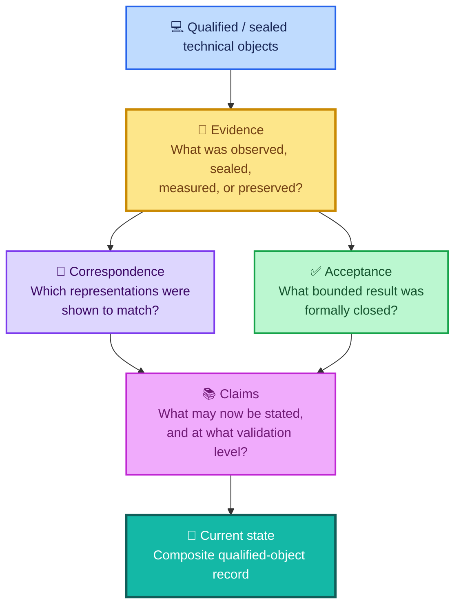

<div align="center">

# ALLIS — Evidence Index

### Public evidence packages supporting bounded ALLIS technical claims

<br>


<br>

**Kidd’s Technical Services · ALLIS**

</div>

---

> [!IMPORTANT]
> This directory is the **top-level evidence index for ALLIS**.
>
> It organizes public, non-sensitive evidence by bounded workstream and technical purpose.
>
> Evidence in this directory supports specific claims within specific scopes. It does **not** mean that every ALLIS subsystem has been verified, that every runtime path currently corresponds to its sealed source, or that the whole ALLIS system has been proven.

The controlling whole-system boundary remains:

```text
SYSTEM_PROVEN=NO
```

---

# 👀 Evidence at a glance

The current public evidence record contains five bounded evidence families:

| Evidence package | Scope | Current bounded result |
|---|---|---|
| 🔐 [`governed-evolution/`](governed-evolution/) | Production DGM authorized-adoption formalization, trust/governance correspondence, fail-closed behavior, residuals, and final Step-12 seal | `GREEN_CLOSED_WITH_EXPLICIT_RESIDUALS` |
| 🟪 [`conversational-admission/`](conversational-admission/) | Public-safe Lean R2 qualification evidence for ordinary authenticated conversational admission | `R2_QUALIFICATION=PASS` |
| 🟪 [`hilbert-jcp-separation/`](hilbert-jcp-separation/) | Public-safe Lean R3 qualification evidence for current JCP structure, Hilbert nonadmission, and static H_geo separation | `R3_QUALIFICATION=PASS` |
| 💬 [`conversational-frontdoor/`](conversational-frontdoor/) | Post-September current production evidence for auth/Guardian, frontend, Unified Gateway, rollback, and demonstrated/non-demonstrated conversational boundaries | `SERVER_SIDE_CONVERSATIONAL_PATH_QUALIFIED=YES` |
| 🌐 [`publication/`](publication/) | Governed immutable publication, read-only runtime boundary, public-network continuity, and final Step-17 evidence close | `GREEN_COMPLETE` |

The current record also includes proof-assistant and correspondence records outside `evidence/` that bind these evidence families to their formal and runtime scopes:

| Related record | Role | Current bounded meaning |
|---|---|---|
| 🧮 [`../formal-verification/authorized-adoption/lean/workstream-closeout-r1.md`](../formal-verification/authorized-adoption/lean/workstream-closeout-r1.md) | Lean R1 proof-assistant qualification | Principal Step-12 theorem/disproof set independently kernel-checked |
| 🟪 [`../formal-verification/conversational-admission/workstream-closeout-r2.md`](../formal-verification/conversational-admission/workstream-closeout-r2.md) | Lean R2 proof-assistant closeout | 6/6 Conversational Admission checks closed PASS |
| 🟪 [`../formal-verification/hilbert-jcp-separation/workstream-closeout-r3.md`](../formal-verification/hilbert-jcp-separation/workstream-closeout-r3.md) | Lean R3 proof-assistant closeout | 14/14 Hilbert/JCP Separation checks closed PASS |
| 🔗 [`governed-evolution/post-a8-theorem-correspondence-registry-r1.md`](governed-evolution/post-a8-theorem-correspondence-registry-r1.md) | Post-A8 DGM correspondence | Current theorem-relevant DGM source/runtime revalidated 11/11; `T12D-B` and `T12D-C` re-observed |
| 🔗 [`../correspondence/conversational-admission/source-to-runtime.md`](../correspondence/conversational-admission/source-to-runtime.md) | R2 source/runtime correspondence | Current `/api/chat` / Gateway identity boundary supports the R2 model |
| 🔗 [`../correspondence/hilbert-jcp-separation/source-to-runtime.md`](../correspondence/hilbert-jcp-separation/source-to-runtime.md) | R3 source/runtime correspondence | Current four-field JCP and static H_geo/nonadmission state support the R3 model |
| 🔗 [`../correspondence/conversational-path/gateway-to-synthesis.md`](../correspondence/conversational-path/gateway-to-synthesis.md) | Conversational downstream correspondence | Qualified observed server path through Gateway → BBB → `llm20production` → LM Synthesizer |

These records answer different technical questions.

None silently inherits the authority, proof level, or scope of another.

---

# 🧭 How the evidence layer fits into ALLIS

ALLIS separates evidence from acceptance, claims, correspondence, and current-state documentation.


```mermaid
flowchart TB
    S["💻 Qualified / sealed technical objects"]:::source

    E["🧾 Evidence<br/>What was observed, sealed,<br/>measured, or preserved?"]:::evidence

    C["🔗 Correspondence<br/>Which representations were<br/>shown to match?"]:::corr

    A["✅ Acceptance<br/>What bounded result was<br/>formally closed?"]:::acceptance

    Q["📚 Claims<br/>What may now be stated,<br/>and at what validation level?"]:::claims

    N["🧭 Current state<br/>Composite qualified-object record"]:::current

    S --> E
    E --> C
    E --> A
    C --> Q
    A --> Q
    Q --> N

    classDef source fill:#bfdbfe,stroke:#2563eb,color:#172554,stroke-width:2px;
    classDef evidence fill:#fde68a,stroke:#ca8a04,color:#713f12,stroke-width:3px;
    classDef corr fill:#ddd6fe,stroke:#7c3aed,color:#3b0764,stroke-width:2px;
    classDef acceptance fill:#bbf7d0,stroke:#16a34a,color:#14532d,stroke-width:2px;
    classDef claims fill:#f0abfc,stroke:#c026d3,color:#701a75,stroke-width:2px;
    classDef current fill:#14b8a6,stroke:#115e59,color:#ffffff,stroke-width:3px;
```

The key distinction is:

```text
evidence exists
    ≠
claim is proven
    ≠
correspondence is established
    ≠
workstream is closed
    ≠
whole system is proven
```

---

# 🔐 Governed-evolution evidence

Directory:

[`evidence/governed-evolution/`](governed-evolution/)

This package preserves public evidence for the bounded production authorized-adoption workstream.

Its central architectural principle is:

> **Capability does not create authority.**

The governed-evolution evidence records how ALLIS separates:

```text
candidate generation
        ↓
candidate evaluation
        ↓
evidence
        ↓
independent authorization
        ↓
target / prestate / replay checks
        ↓
governed application
        ↓
poststate verification
        ↓
receipt and evidence
```

Current bounded formal object:

```text
DGM_PRODUCTION_AUTHORIZED_ADOPTION_MODEL_V1
```

Production source identity for the Step-12 formal/correspondence package:

```text
20c8cbe175781c8a1c05d65c03977859ceca884a
```

Final bounded Step-12 state:

```text
GREEN_CLOSED_WITH_EXPLICIT_RESIDUALS
```

## Package contents

### [`governed-evolution/README.md`](governed-evolution/README.md)

Explains the governed-evolution evidence package, its architectural meaning, and its bounded validation state.

### [`governed-evolution/source-identity.md`](governed-evolution/source-identity.md)

Preserves the relevant source identity for the bounded governed-evolution evidence record.

### [`governed-evolution/trust-anchor.md`](governed-evolution/trust-anchor.md)

Preserves the public trust object used in the Step-12 correspondence record.

### [`governed-evolution/governance-view.md`](governed-evolution/governance-view.md)

Preserves the sealed governance-state evidence used by the bounded Step-12 package.

### [`governed-evolution/residuals.md`](governed-evolution/residuals.md)

Preserves explicit residuals and non-promotions so a closed workstream is not silently promoted into a stronger claim.

### [`governed-evolution/step12-final-seal.md`](governed-evolution/step12-final-seal.md)

Preserves the final bounded Step-12 evidence-seal state.

### [`governed-evolution/post-a8-theorem-correspondence-registry-r1.md`](governed-evolution/post-a8-theorem-correspondence-registry-r1.md)

Preserves the later public-safe post-A8 DGM theorem-correspondence observation.

It records:

```text
IMMUTABLE_SOURCE_IDENTITY=PASS_11_OF_11

NBB_SOURCE_TO_RUNTIME_CORRESPONDENCE=PASS_11_OF_11

WORKER_SOURCE_TO_RUNTIME_CORRESPONDENCE=PASS_11_OF_11

CURRENT_POST_A8_DGM_SOURCE_TO_RUNTIME_CORRESPONDENCE=PASS_11_OF_11
```

and the later/current theorem-specific observations supporting:

```text
T12D-B = CORRESPONDENCE_VERIFIED
T12D-C = CORRESPONDENCE_VERIFIED
```

while preserving:

```text
T12D-A = MACHINE_CHECKED
P12C-09 = MACHINE_CHECKED_DISPROVEN
SYSTEM_PROVEN=NO
```

> [!IMPORTANT]
> This post-A8 record is **successor observation evidence**.
>
> It does not rewrite the historical Step-12 final seal, Step-12 closeout, or historical Step-12 validation labels.

## Later proof-assistant qualification

The later Lean R1 closeout is maintained under formal verification rather than duplicated inside `evidence/`:

[`../formal-verification/authorized-adoption/lean/workstream-closeout-r1.md`](../formal-verification/authorized-adoption/lean/workstream-closeout-r1.md)

That record documents the later Lean 4.34.0 kernel qualification of the principal Step-12 result set.

The Lean closeout is a later proof-assistant qualification record.

It does not replace the historical Step-12 machine-check evidence, and it did not by itself establish production source/runtime correspondence.

## Related closeout

See:

[`acceptance/closeout/dgm-step12-close.md`](../acceptance/closeout/dgm-step12-close.md)

for the acceptance-side Step-12 conclusion.

## Related correspondence

See:

* [`correspondence/authorized-adoption/model-to-source.md`](../correspondence/authorized-adoption/model-to-source.md)
* [`correspondence/authorized-adoption/source-to-runtime.md`](../correspondence/authorized-adoption/source-to-runtime.md)

for the bounded correspondence records.

---

# 🟪 Conversational Admission R2 evidence

Directory:

[`evidence/conversational-admission/`](conversational-admission/)

Current public-safe evidence file:

[`conversational-admission/r2-qualification.md`](conversational-admission/r2-qualification.md)

This package preserves the accepted R2 proof evidence without duplicating the formal source.

It records:

```text
R2_QUALIFICATION=PASS

PRINCIPAL_CHECKS=6_OF_6

PROOF_HOLES=0

INITIAL_PROPEXT_DEPENDENCIES=6_OF_6

FINAL_PROPEXT_DEPENDENCIES=0_OF_6

FINAL_THEOREM_LEVEL_AXIOM_DEPENDENCIES=0_OF_6
```

It also preserves the qualified R2 Git identity:

```text
branch =
formal-verification/lean-conversational-admission-r2

HEAD =
c1a18b2e5fbe2e288d8b91dafe18668392bc787d

tree =
e325bfdd78cd6903dbfb3a8c15130af26de5cd9f
```

and the public-safe final evidence/seal identities.

The six principal theorem identifiers are:

```text
TCHAT_A_server_derived_authenticated_identity
TCHAT_B_browser_identity_is_nonauthoritative
TCHAT_C_canonical_scalar_user_id_not_invented
TCHAT_D_distinct_authenticated_sessions_remain_identity_isolated
TCHAT_E_ordinary_chat_does_not_create_governance_authority
TCHAT_F_ordinary_chat_does_not_authorize_hpeople_secret_disclosure
```

The evidence package preserves the important repair history:

```text
compiled 6/6 with zero holes
    ↓
unexpected propext dependency 6/6
    ↓
qualification failure
    ↓
direct proof repair
    ↓
0/6 final propext
    ↓
PASS
```

The theorem statements, types, and intended semantics were preserved; proof bodies changed.

Related acceptance:

[`../acceptance/closeout/lean-conversational-admission-r2-close.md`](../acceptance/closeout/lean-conversational-admission-r2-close.md)

Related correspondence:

- [`../correspondence/conversational-admission/model-to-source.md`](../correspondence/conversational-admission/model-to-source.md)
- [`../correspondence/conversational-admission/source-to-runtime.md`](../correspondence/conversational-admission/source-to-runtime.md)

---

# 🟪 Hilbert/JCP Separation R3 evidence

Directory:

[`evidence/hilbert-jcp-separation/`](hilbert-jcp-separation/)

Current public-safe evidence file:

[`hilbert-jcp-separation/r3-qualification.md`](hilbert-jcp-separation/r3-qualification.md)

This package preserves the accepted R3 proof evidence for the current Hilbert/JCP Separation domain.

It records:

```text
R3_QUALIFICATION=PASS

FINAL_CHECKS=14_OF_14

PROOF_HOLES=0

INITIAL_PROPEXT_DEPENDENCIES=11_OF_14

FINAL_PROPEXT_DEPENDENCIES=0_OF_14

FINAL_THEOREM_LEVEL_AXIOM_DEPENDENCIES=0_OF_14
```

Current JCP builder:

```text
build_judge_context_v2
```

Exact current top-level field set:

```text
schema_version
request_context
approved_evidence
wv_deliberative_context
```

Current/candidate JCP AST SHA-256:

```text
7c9cc765677848685066884c47d7ef8c2adf49a5ee4c6ec32da0492f7ef0b422
```

Current admission state:

```text
H_GEO_CURRENT_JCP_ADMISSION=NO

H_P_CURRENT_JCP_ADMISSION=NO

H_PEOPLE_CURRENT_JCP_ADMISSION=NO

STATIC_H_GEO_PATH_QUALIFIED=YES
```

Preserve:

```text
static H_geo qualification
    ≠
live H_geo JCP admission
```

Related acceptance:

[`../acceptance/closeout/lean-hilbert-jcp-separation-r3-close.md`](../acceptance/closeout/lean-hilbert-jcp-separation-r3-close.md)

Related correspondence:

- [`../correspondence/hilbert-jcp-separation/model-to-source.md`](../correspondence/hilbert-jcp-separation/model-to-source.md)
- [`../correspondence/hilbert-jcp-separation/source-to-runtime.md`](../correspondence/hilbert-jcp-separation/source-to-runtime.md)

---

# 💬 Conversational-frontdoor production evidence

Directory:

[`evidence/conversational-frontdoor/`](conversational-frontdoor/)

Current evidence file:

[`conversational-frontdoor/current-production-state.md`](conversational-frontdoor/current-production-state.md)

This package consolidates the post-September production evidence for:

```text
auth / Guardian versioned qualification

frontend candidate and production cutover

Unified Gateway production cutover

qualified observed downstream conversational path

rollback retention

browser-E2E non-demonstration boundary
```

Current bounded production state:

```text
AUTH_GUARDIAN_VERSIONED_INSTALL=PASS

FRONTEND_PRODUCTION_CUTOVER=PASS

GATEWAY_PRODUCTION_CUTOVER=PASS

SERVER_SIDE_CONVERSATIONAL_PATH_QUALIFIED=YES

BROWSER_E2E_DEMONSTRATED=NO

ROLLBACK_RETIREMENT_AUTHORIZED=NO
```

Qualified observed server-side path:

```text
Unified Gateway
    ↓
BBB
    ↓
llm20production
    ↓
LM Synthesizer
    ↓
response
```

The package intentionally preserves the distinction:

```text
server-side conversational path qualified
    ≠
authenticated browser E2E demonstrated
```

The current UI-boundary record remains:

```text
CURRENT_BROWSER_CONVERSATIONAL_UI_READY=NO

CURRENT_BROWSER_CONVERSATIONAL_SEND_SURFACE=NO

AUTHENTICATED_BROWSER_CHAT_E2E=NOT_EXECUTABLE_CURRENT_UI
```

Related correspondence:

[`../correspondence/conversational-path/gateway-to-synthesis.md`](../correspondence/conversational-path/gateway-to-synthesis.md)

Related current-state records:

- [`../CURRENT.md`](../CURRENT.md)
- [`../acceptance/current-system-manifest.md`](../acceptance/current-system-manifest.md)
- [`../acceptance/baseline-object-registry.md`](../acceptance/baseline-object-registry.md)

---

# 🧭 A8 production/private-context evidence boundary

No separate A8 production/private-context evidence package is indexed here yet.

That is deliberate.

A new A8 evidence package should be added only after the exact public-safe closeout artifacts intended for repository publication have been selected and admitted.

Until then:

```text
qualified A8 engineering work exists
    ≠
public evidence package admitted
```

and:

```text
A8 frontend/private-context qualification
    ≠
automatic DGM theorem-runtime evidence
```

This index therefore does not invent or infer an A8 production/build identity.

---

# 🌐 Publication evidence

Directory:

[`evidence/publication/`](publication/)

This package preserves public evidence for the completed Step-17 governed publication workstream.

The fixed goal was to establish a:

```text
governed
read-only
versioned
live ALLIS publication endpoint
```

consumed by the Evidence & Governance Portal without granting the GUI unrestricted direct access to ALLIS.

Final bounded result:

```text
ALL_STEPS_0_THROUGH_17=GREEN
FINAL_CRITERIA=25_OF_25_PASS
FINAL_NETWORK_CONTINUITY=GREEN

OVERALL_GOAL=GREEN_COMPLETE
```

Final publication identity:

```text
Publication ID:
allis-publication-step6-retention-v2

Publication SHA-256:
d6ab63522f9080fae440578ebbb6ed42140595155c9a30253f5b8eeeef8009b7

Publication payload SHA-256:
04ebb5bc1f97cbf56b8722fea9bcc7e7303cac2f5b467510d7a821d84d4a3c3c
```

Final frontend build observed in the Step-17 publication path:

```text
5By6R3CWTM7NDXc-4lmSi
```

## Package contents

### [`publication/publication-identity.md`](publication/publication-identity.md)

Answers:

> **What exact governed immutable publication object was sealed?**

It records publication identity, integrity, retention, authority/provenance requirements, and bounded meaning.

### [`publication/runtime-boundary.md`](publication/runtime-boundary.md)

Answers:

> **What runtime boundary served the publication, and what evidence shows that the outward path remained read-only and isolated?**

It preserves evidence for:

```text
publication service isolation
loopback-only binding
read-only store access
no public mutation endpoint
authorized routing
no unrestricted GUI access to ALLIS
sealed Landlock runtime provenance
```

### [`publication/network-continuity.md`](publication/network-continuity.md)

Answers:

> **Was the intended public network path reachable at the final Step-17 observation, and how was the transient DNS failure classified and recovered?**

It preserves the bounded continuity and recovery record rather than deleting the earlier failed observation.

### [`publication/step17-final-close.md`](publication/step17-final-close.md)

Answers:

> **What final evidence bundle sealed the Step-17 result?**

It preserves:

```text
25 / 25 completion matrix
final network continuity
publication identity
frontend identity
final SHA-256 seal
predecessor-seal continuity
nonmutation state
successor-authority boundary
```

## Related closeout

See:

[`acceptance/closeout/publication-step17-close.md`](../acceptance/closeout/publication-step17-close.md)

for the acceptance-side bounded Step-17 conclusion.

## Related correspondence

See:

[`correspondence/publication/source-to-publication-to-http-to-gui.md`](../correspondence/publication/source-to-publication-to-http-to-gui.md)

for the source/state → publication → HTTP → GUI correspondence record.

---

# ✅ Evidence and acceptance are not the same thing

The repository deliberately separates:

```text
evidence/
```

from:

```text
acceptance/
```

Evidence asks:

> **What observations, identities, records, tests, seals, or measurements support the claim?**

Acceptance asks:

> **What bounded conclusion was formally accepted from that evidence?**

For example:

```text
evidence/publication/step17-final-close.md
```

records the **final evidence package**.

Whereas:

```text
acceptance/closeout/publication-step17-close.md
```

records the **bounded accepted conclusion**.

One should not replace the other.

---

# 🔗 Evidence and correspondence are not the same thing

Evidence can exist without establishing correspondence.

Correspondence asks whether separately identified representations were shown to match within a defined observation boundary.

Examples include:

```text
formal model
    ↓
sealed source

sealed source
    ↓
observed runtime
```

and:

```text
qualified source/state
    ↓
governed publication
    ↓
direct HTTP body
    ↓
public HTTP body
    ↓
GUI consumption
```

Correspondence is therefore separately documented under:

[`correspondence/`](../correspondence/)

The governing rule is:

> **Correspondence is point-in-time.**

```text
corresponded at seal time
    ≠
guaranteed to correspond forever
```

If a claim-bearing runtime object changes, the relevant correspondence must be re-established.

The post-A8 DGM record is an example of that rule being applied:

```text
historical Step-12 source/runtime correspondence
    ↓
later runtime observation epoch
    ↓
fresh 11/11 source/runtime revalidation
    ↓
separate B/C theorem-specific live observation
```

The later observation strengthens the current record without rewriting the predecessor seal.

---

# 📚 Evidence and claims are not the same thing

Evidence does not automatically determine how strongly a statement may be made.

Claims are separately indexed under:

[`claims/`](../claims/)

Current claim records include:

* [`claims/claim-registry.md`](../claims/claim-registry.md)
* [`claims/nonclaims-and-residuals.md`](../claims/nonclaims-and-residuals.md)

A claim may advance only as far as its evidence supports.

The ALLIS validation vocabulary includes bounded states such as:

```text
Implemented
Observed
Demonstrated
Formally Specified
Proven
Machine-Checked
Correspondence-Verified
```

These levels should not be silently collapsed.

---

# 🚧 Closed workstreams retain their limits

A workstream can close successfully while preserving:

* residuals;
* counterexamples;
* negative results;
* unresolved broader questions;
* scope limitations;
* non-promotions;
* time-indexed correspondence.

Therefore:

```text
workstream closed
    ≠
all stronger claims proven
```

The repository intentionally preserves examples of this rule.

Step 12 closed with explicit residuals and a machine-checked disproven proposition.

Step 17 closed its fixed publication goal without promoting that result into whole-system proof.

The controlling boundary remains:

```text
SYSTEM_PROVEN=NO
```

---

# ⛔ Evidence does not create authority

A recurring ALLIS rule is:

> **State does not become authority merely because it exists.**

The same applies to evidence.

```text
evidence exists
    ≠
authority exists

evidence supports a claim
    ≠
publication is authorized

internal state exists
    ≠
public disclosure is authorized

AI generated an output
    ≠
verified evidence exists
```

Authority, disclosure, protected transitions, publication, and documentation each have their own governed boundary.

See:

* [`architecture/authority-planes.md`](../architecture/authority-planes.md)
* [`architecture/fail-closed-semantics.md`](../architecture/fail-closed-semantics.md)
* [`architecture/private-state/h-people-boundary.md`](../architecture/private-state/h-people-boundary.md)

---

# 🧩 Workstream F and the evidence index

Workstream F is part of the current qualified ALLIS record, but the repository does not currently contain a separate:

```text
evidence/workstream-f/
```

package.

Its formal close is documented under:

[`acceptance/closeout/workstream-f-close.md`](../acceptance/closeout/workstream-f-close.md)

The absence of a dedicated Workstream-F evidence directory should not be interpreted as evidence that Workstream F did not occur or did not close.

The repository should not invent a new evidence package merely for directory symmetry.

---

# 🗺️ Current evidence structure

```text
evidence/
│
├── README.md
│
├── governed-evolution/
│   ├── README.md
│   ├── governance-view.md
│   ├── post-a8-theorem-correspondence-registry-r1.md
│   ├── residuals.md
│   ├── source-identity.md
│   ├── step12-final-seal.md
│   └── trust-anchor.md
│
├── conversational-admission/
│   └── r2-qualification.md
│
├── hilbert-jcp-separation/
│   └── r3-qualification.md
│
├── conversational-frontdoor/
│   └── current-production-state.md
│
└── publication/
    ├── publication-identity.md
    ├── runtime-boundary.md
    ├── network-continuity.md
    └── step17-final-close.md
```

Each package has a bounded role.

The evidence directory grows by **evidence domain or bounded workstream**, not as a chronological dump of engineering artifacts.

---

# 🧭 Where to start

For the present qualified ALLIS state, begin with:

[`CURRENT.md`](../CURRENT.md)

Then review:

[`acceptance/current-system-manifest.md`](../acceptance/current-system-manifest.md)

and:

[`acceptance/baseline-object-registry.md`](../acceptance/baseline-object-registry.md)

Those documents explain how the different qualified source, proof, trust, governance, publication, and frontend objects fit together.

Then use this directory to inspect the evidence supporting the bounded claims.

---

# 🔎 Evidence navigation

## Governed evolution / Step 12 + later successor evidence

- [Governed-evolution overview](governed-evolution/README.md)
- [Source identity](governed-evolution/source-identity.md)
- [Trust anchor](governed-evolution/trust-anchor.md)
- [Governance view](governed-evolution/governance-view.md)
- [Residuals and non-promotions](governed-evolution/residuals.md)
- [Step-12 final seal](governed-evolution/step12-final-seal.md)
- [Post-A8 DGM theorem correspondence registry R1](governed-evolution/post-a8-theorem-correspondence-registry-r1.md)
- [Lean R1 proof-assistant qualification closeout](../formal-verification/authorized-adoption/lean/workstream-closeout-r1.md)

The Step-12 final seal remains the historical predecessor record.

The Lean R1 and post-A8 records are additive successor evidence.

## Conversational Admission / R2

- [R2 public qualification evidence](conversational-admission/r2-qualification.md)
- [R2 formal workstream closeout](../formal-verification/conversational-admission/workstream-closeout-r2.md)
- [R2 acceptance closeout](../acceptance/closeout/lean-conversational-admission-r2-close.md)
- [R2 model → source](../correspondence/conversational-admission/model-to-source.md)
- [R2 source → runtime](../correspondence/conversational-admission/source-to-runtime.md)

## Hilbert/JCP Separation / R3

- [R3 public qualification evidence](hilbert-jcp-separation/r3-qualification.md)
- [R3 formal workstream closeout](../formal-verification/hilbert-jcp-separation/workstream-closeout-r3.md)
- [R3 acceptance closeout](../acceptance/closeout/lean-hilbert-jcp-separation-r3-close.md)
- [R3 model → source](../correspondence/hilbert-jcp-separation/model-to-source.md)
- [R3 source → runtime](../correspondence/hilbert-jcp-separation/source-to-runtime.md)

## Conversational front door / current production

- [Current production state](conversational-frontdoor/current-production-state.md)
- [Gateway → synthesis correspondence](../correspondence/conversational-path/gateway-to-synthesis.md)

## Publication / Step 17

- [Publication identity](publication/publication-identity.md)
- [Publication runtime boundary](publication/runtime-boundary.md)
- [Publication network continuity](publication/network-continuity.md)
- [Step-17 final evidence close](publication/step17-final-close.md)

## Related acceptance

- [Current system manifest](../acceptance/current-system-manifest.md)
- [Baseline object registry](../acceptance/baseline-object-registry.md)
- [Workstream-F close](../acceptance/closeout/workstream-f-close.md)
- [DGM Step-12 close](../acceptance/closeout/dgm-step12-close.md)
- [Lean R2 close](../acceptance/closeout/lean-conversational-admission-r2-close.md)
- [Lean R3 close](../acceptance/closeout/lean-hilbert-jcp-separation-r3-close.md)
- [Publication Step-17 close](../acceptance/closeout/publication-step17-close.md)

## Related correspondence

- [Correspondence index](../correspondence/README.md)
- [Authorized adoption: model → source](../correspondence/authorized-adoption/model-to-source.md)
- [Authorized adoption: source → runtime](../correspondence/authorized-adoption/source-to-runtime.md)
- [R2: model → source](../correspondence/conversational-admission/model-to-source.md)
- [R2: source → runtime](../correspondence/conversational-admission/source-to-runtime.md)
- [R3: model → source](../correspondence/hilbert-jcp-separation/model-to-source.md)
- [R3: source → runtime](../correspondence/hilbert-jcp-separation/source-to-runtime.md)
- [Conversational path: Gateway → synthesis](../correspondence/conversational-path/gateway-to-synthesis.md)
- [Publication: source → publication → HTTP → GUI](../correspondence/publication/source-to-publication-to-http-to-gui.md)

## Related claims

- [Claim registry](../claims/claim-registry.md)
- [Nonclaims and residuals](../claims/nonclaims-and-residuals.md)

---

# ✅ What this evidence index supports

A defensible description of this directory is:

> **The ALLIS evidence layer preserves bounded, public, non-sensitive technical records supporting specific claims about governed production evolution, historical Step-12 evidence, Lean R1/R2/R3 qualification, post-A8 DGM correspondence revalidation, current conversational-frontdoor production state, immutable publication, runtime isolation, network continuity, and completed workstream evidence seals.**

The current evidence families support, within their bounded scopes:

```text
LEAN_R2_CONVERSATIONAL_ADMISSION_QUALIFIED=YES

LEAN_R3_HILBERT_JCP_SEPARATION_QUALIFIED=YES

SERVER_SIDE_CONVERSATIONAL_PATH_QUALIFIED=YES
```

while preserving:

```text
BROWSER_E2E_DEMONSTRATED=NO

H384_FORMALIZATION_COMPLETE=NO

LIVE_HILBERT_JCP_INTEGRATION_COMPLETE=NO

SYSTEM_PROVEN=NO
```

It does not itself establish:

* whole-system formal verification;
* permanent runtime correspondence;
* universal production-mutation safety;
* authority beyond a bounded workstream;
* unrestricted access to internal ALLIS state;
* public mutation authority;
* or `SYSTEM_PROVEN=YES`.

---

# 🧠 Evidence rule

The evidence layer follows the same rule as the larger ALLIS repository:

> **Current truth is assembled from qualified objects and explicit correspondence—not from whichever file was written most recently.**

And:

> **A claim may advance only as far as its evidence supports.**

> **Successor evidence may strengthen the current bounded record without rewriting the historical evidence that established an earlier observation or seal.**
