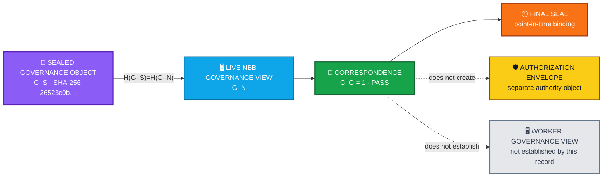

<div align="center">

# ALLIS — Governance View Evidence

### Sealed Step-12 governance-state identity and point-in-time NBB correspondence

<br>


<br>

**Kidd’s Technical Services · ALLIS**

</div>

---

> [!IMPORTANT]
> This record identifies the **sealed Step-12 governance object** and establishes that the inspected **live NBB governance view matched that sealed object at the final seal boundary**.
>
> It does **not** turn the governance view into an authorization envelope, establish worker governance-view correspondence, authorize production mutation, prove all governance semantics, or create permanent future correspondence.
>
> The evidence identity and governance-view claim scope remain bounded to the object and observation described here.

---

# 👀 Governance view in one view



The governing result is an **identity-and-correspondence claim**:

```math
H(G_S)=H(G_N)
\Rightarrow
C_G=1
```

at the Step-12 final seal.

It is not an authorization or whole-system governance theorem.

---

# 🎯 Purpose

This document records the sealed governance view used by the bounded ALLIS production authorized-adoption pathway and the Step-12 evidence that the live NBB governance view corresponded to that sealed object at final sealing.

The formal object is:

```text
DGM_PRODUCTION_AUTHORIZED_ADOPTION_MODEL_V1
```

The sealed governance-view SHA-256 is:

```text
26523c0bad40ff06a75c62a802f20195295534764dce45cfa6acdcdaecc3fcc2
```

The controlling correspondence result is:

```math
\boxed{
C_G=1
}
```

at final seal time.

The governing architecture is:

> **A governance view can represent governed state. It does not create authority merely because it exists.**

The broader ALLIS principle remains:

> **State does not become authority merely because it exists.**

Applied here:

```text
governance view exists
≠
authorization exists

governance view matches
≠
candidate is approved

governance view matches
≠
production mutation is permitted

governance correspondence passed
≠
future governance state can never change
```

---

# 📋 Governance-view status

| Field | Value |
|---|---|
| Document role | Sealed governance-view evidence record |
| Formal object | `DGM_PRODUCTION_AUTHORIZED_ADOPTION_MODEL_V1` |
| Production source commit | `20c8cbe175781c8a1c05d65c03977859ceca884a` |
| Sealed governance-view SHA-256 | `26523c0bad40ff06a75c62a802f20195295534764dce45cfa6acdcdaecc3fcc2` |
| Sealed governance object | `G_S` |
| Live governance object tested | NBB governance view `G_N` |
| Correspondence predicate | `C_G=1` |
| Correspondence status | `PASS` at final seal |
| Time class | Point-in-time sealed correspondence |
| Worker governance-view correspondence | Not separately established by this Step-12 governance-view result |
| Final Step-12 status | `GREEN_CLOSED_WITH_EXPLICIT_RESIDUALS` |

---

# 🧭 1. What the governance view is in this record

For Step 12, let:

```math
G_S
```

denote the sealed governance view.

Let:

```math
G_N
```

denote the live NBB governance view.

The correspondence question is narrow:

> **Did the governance view present to the live NBB match the sealed governance object used by the Step-12 evidence boundary?**

The result is based on hash identity.

The record does not redefine the broader ALLIS governance architecture.

It records the identity and correspondence of the governance object used in this bounded production verification state.

---

# 🧩 Governance-view evidence model

# 2. Sealed governance-view identity

The sealed governance view is bound to:

```text
SHA-256
26523c0bad40ff06a75c62a802f20195295534764dce45cfa6acdcdaecc3fcc2
```

Define:

```math
H(x)=SHA256(x)
```

for the sealed object identity comparison.

The Step-12 formal record states:

```math
H(G_S)=H(G_N)
```

with the hash above.

Therefore:

```math
\boxed{
C_G=1
}
```

at final seal time.

---

# 3. What hash correspondence establishes

The governance-view hash comparison establishes identity of the sealed and inspected NBB governance-view objects under the defined hashing procedure.

In bounded form:

```text
sealed governance view
        ↓
SHA-256 identity

live NBB governance view
        ↓
SHA-256 identity

identities equal
        ↓
governance correspondence PASS
```

This is an object-correspondence result.

It is not a semantic proof of every possible governance interpretation.

---

# 4. What hash correspondence does not establish

The equality:

```math
H(G_S)=H(G_N)
```

does not independently establish:

```text
all ALLIS governance is proven correct
```

It does not independently establish:

```text
every governance decision is valid
```

It does not establish:

```text
every possible governance state has been tested
```

It does not establish:

```text
the governance view itself authorized a mutation
```

It establishes that the NBB governance view inspected at final seal matched the sealed governance object.

---

# 5. Governance view is not an authorization envelope

The governance view and the authorization envelope have different roles.

The authorization envelope is represented formally as:

```math
a\in A
```

and carries bounded authorization fields such as:

```text
authorization identifier
proposal binding
decision
candidate binding
evaluation binding
target binding
prestate binding
authority class
issuance time
expiration time
signature
```

The governance view is a separate sealed state object.

Therefore:

```text
governance view
≠
AuthorizationEnvelope
```

and:

```text
governance correspondence
≠
authorization validation
```

---

# 6. Governance state is not self-authorizing

The existence of a governance state does not permit the NBB to infer a stronger operational state without the required authorization evidence.

The architecture preserves:

```text
governance context exists
        ≠
candidate approved

governance context matches
        ≠
authorization signature valid

governance context matches
        ≠
target permitted

governance context matches
        ≠
current prestate matches

governance context matches
        ≠
authorization unspent
```

Those conditions remain separately governed.

---

# 7. Governance view and cryptographic trust are separate

The Step-12 runtime evidence independently records:

```text
Public trust     PASS
Governance view  PASS
```

These are not duplicate checks.

The public trust anchor answers:

> **Does the runtime contain the expected public verification identity?**

The governance-view correspondence answers:

> **Does the NBB contain the expected sealed governance-state view?**

Therefore:

```text
cryptographic trust
≠
governance state
```

Both can correspond while serving different architectural purposes.

---

# 8. Governance view and source correspondence are separate

Step 12 also independently records:

```text
NBB source correspondence     11/11 PASS
Worker source correspondence  11/11 PASS
Governance view               PASS
```

Source correspondence establishes the identity of governed production code.

Governance correspondence establishes the identity of the NBB governance view.

Neither result replaces the other.

```text
correct source
≠
correct governance object

correct governance object
≠
correct source
```

The final seal records both.

---

# 9. Scope of the governance correspondence result

The Step-12 formal record defines:

```math
G_S
```

as the sealed governance view and:

```math
G_N
```

as the NBB live governance view.

Therefore the established correspondence is:

```math
\boxed{
H(G_S)=H(G_N)
}
```

and:

```math
\boxed{
C_G=1
}
```

at final seal time.

The record does **not** separately define or establish a worker governance object:

```math
G_W
```

for this governance-view check.

Accordingly, this document does not claim:

```text
WORKER_GOVERNANCE_VIEW_CORRESPONDENCE=PASS
```

unless a separate evidence record establishes that fact.

---

# 10. Why the NBB boundary matters

The NBB is the admission boundary for authorized work.

The bounded path is:

```text
External package
      ↓
NBB validation
      ↓
Authorized spool
      ↓
Worker claim
      ↓
Authorized application
```

The governance view is therefore relevant at the point where the production system determines whether incoming work can proceed into the governed authorized-adoption path.

But the NBB does not obtain authority merely from having a governance view.

It still requires the authorization conditions defined by the formal model.

---

# 🕒 11. Governance correspondence is point-in-time

The final correspondence is tied to the Step-12 seal boundary.

Conceptually, define:

```math
C_G^{\tau}
```

as governance-view correspondence observed at time $`\tau`$.

Step 12 establishes:

```math
\boxed{
C_G^{\tau_{seal}}=1
}
```

for the inspected NBB state.

It does not establish:

```math
\forall\tau>\tau_{seal},
C_G^{\tau}=1
```

without future revalidation.

A future change to the governance view requires a new identity and correspondence determination.

---

# 🔄 Successor-state and revalidation boundary

# 12. Governance-view replacement semantics

If a future sealed governance object is:

```math
G'_S
```

and:

```math
G'_S\neq G_S
```

then the current result:

```math
C_G(G_S,G_N)=1
```

does not automatically establish:

```math
C_G(G'_S,G'_N)=1
```

for a successor deployment.

A new governance object requires new evidence.

This follows the same architecture used for source and authorization state:

```text
previous valid state
≠
automatic authority over changed state
```

---

# 13. Governance correspondence does not create approval

The governance-view result:

```math
C_G=1
```

does not imply:

```math
V_{decision}=1
```

It does not imply:

```math
V_{class}=1
```

It does not imply:

```math
V_{sig}=1
```

It does not imply:

```math
V_{auth}=1
```

The correspondence result says:

> The live NBB governance view matched the sealed governance object.

It does not say:

> A specific authorization was approved.

---

# 14. Governance correspondence does not create target authority

Even a valid authorization must separately satisfy:

```math
V_{target}
=
V_{contain}
\land
V_{allow}
```

Therefore:

```text
governance view matched
≠
arbitrary target may be mutated
```

Target authority remains governed by the bounded target-safety predicates.

---

# 15. Governance correspondence does not waive prestate binding

The authorized path also requires:

```math
V_{pre}=1
```

The current source state must match the prestate against which the candidate and authorization were bound.

Therefore:

```text
governance state matched
≠
stale authorization becomes valid
```

Governance correspondence cannot repair source-state drift.

---

# 16. Governance correspondence does not waive replay protection

The authorized path also requires:

```math
V_{once}=1
```

and successful spent reservation.

Therefore:

```text
governance view matched
≠
spent authorization may be reused
```

The governance layer does not supersede the one-use authorization boundary.

---

# 17. Governance correspondence does not prove application

The governance-view result also does not establish:

```text
production mutation occurred
```

At Step-12 close:

```text
REAL_PRODUCTION_AUTHORIZATION_PUBLICATION=NOT_PERFORMED
REAL_PRODUCTION_AUTHORIZATION_CONSUMPTION=NOT_PERFORMED
REAL_PRODUCTION_DGM_PATCH_APPLICATION=NOT_PERFORMED
```

Thus:

```text
governance correspondence PASS
≠
positive production apply observed
```

This is why the positive authorized-application theorem remained `MACHINE_CHECKED`.

---

# 📐 18. Governance correspondence and theorem correspondence

The Step-12 theorem-correspondence criterion requires more than governance correspondence.

Conceptually:

```math
MC(T,S)
\land
C_{SR}(S,R)
\land
LiveObs(T,R)
```

must hold for a theorem to reach correspondence verification under the Step-12 method.

Governance-view correspondence contributes to the integrity of the sealed runtime state.

It does not replace:

- source/runtime correspondence;
- machine evidence; or
- theorem-specific live observation.

---

# 🖥️ Runtime evidence context

# 19. Final runtime state at seal

At final Step-12 sealing, the bounded runtime evidence recorded:

```text
NBB source correspondence      11/11 PASS
Worker source correspondence   11/11 PASS
Public trust                   PASS
Governance view                PASS
NBB health                     PASS
Worker health                  PASS
Host health                    PASS
Authorized spool               PASS_EMPTY
```

The governance-view result is one member of that sealed evidence state.

It should not be read in isolation as a global governance theorem.

---

# 20. Governance view and external authority

The bounded runtime model preserves:

```text
R12F-08
authorization issuance remains external to runtime model
```

This means that even when the NBB governance view corresponds to the sealed object, the runtime does not become the origin of its own private authorization authority.

The architecture remains:

```text
governance state
        ↓
context / governed state

external authorization authority
        ↓
issues bounded authorization

runtime verifier
        ↓
verifies supplied authorization

runtime application path
        ↓
acts only if all required conditions succeed
```

---

# 🛡️ 21. Scope boundary

This record documents only the Step-12 governance-view correspondence used by the bounded production authorized-adoption verification workstream.

It does **not** document the entire governance architecture of ALLIS.

It does not define:

- every Guardian policy;
- every constitutional rule;
- every Commons or MountainShares governance mechanism;
- every administrative policy;
- every user-authorization flow;
- every privacy or disclosure rule; or
- every future governance object.

Those may have separate architecture and evidence records.

The current document is narrower:

```text
sealed governance object
        ↔
live NBB governance view
```

at the Step-12 final seal.

---

# 22. Content boundary

The Step-12 formal record establishes the sealed governance-view identity and its NBB correspondence.

It does not, in the evidence used for this public record, enumerate the complete semantic contents of the governance view.

Accordingly, this document does not invent:

- governance fields;
- policy rows;
- decision values;
- actor identities;
- permissions;
- rule text; or
- governance semantics

that are not explicitly established by the controlling evidence.

The authoritative public claim is the correspondence claim.

---

# 23. What `C_G=1` establishes

The result:

```math
C_G=1
```

establishes:

> At the Step-12 final seal, the live NBB governance view had the same sealed SHA-256 identity as the Step-12 governance object.

That is the full bounded correspondence statement.

---

# 24. What `C_G=1` does not establish

It does not establish:

```text
GOVERNANCE_SYSTEM_PROVEN=YES
```

It does not establish:

```text
ALL_GOVERNANCE_DECISIONS_CORRECT=YES
```

It does not establish:

```text
PRODUCTION_MUTATION_AUTHORIZED=YES
```

It does not establish:

```text
WHOLE_SYSTEM_SAFETY_THEOREM_PROVEN=YES
```

and it does not establish:

```text
SYSTEM_PROVEN=YES
```

The controlling broader Step-12 boundaries remain:

```text
PRODUCTION_MUTATION_SAFETY_THEOREM_PROVEN=NO
WHOLE_SYSTEM_SAFETY_THEOREM_PROVEN=NO
SYSTEM_PROVEN=NO
```

---

# 25. No automatic successor authority

A matching governance view does not authorize a future governance transition merely because the predecessor view was valid.

Likewise, completion of Step 12 did not authorize the next workstream automatically.

The same rule applies at both levels:

```text
valid predecessor state
≠
authorized successor state
```

A successor requires its own evidence and authority.

---

# 26. Evidence role

`governance-view.md` is an identity-and-correspondence evidence record.

Its job is to answer:

> **Which governance object was sealed, and did the live NBB view match it?**

It is not the place to explain all governance theory.

It is not the place to define authorization issuance.

It is not the place to prove all governance correctness.

Keeping those responsibilities separate prevents one documentation artifact from silently acquiring a broader authority than its evidence supports.

---

# 🔗 27. Relationship to `trust-anchor.md`

`trust-anchor.md` identifies the public verification trust object.

`governance-view.md` identifies the sealed governance-state object.

Together:

```text
trust-anchor.md
    ↓
which public verification identity is trusted

governance-view.md
    ↓
which governance view was sealed and observed
```

Neither replaces the authorization envelope.

Neither independently authorizes production mutation.

---

# 28. Relationship to `source-to-runtime.md`

`source-to-runtime.md` records:

```math
C_{SR}(S,R_N)=1
```

and:

```math
C_{SR}(S,R_W)=1
```

for the eleven-file production source set.

This record adds:

```math
C_G=1
```

for:

```text
sealed governance view
↔
live NBB governance view
```

The final runtime evidence therefore separates:

```text
source identity
trust identity
governance identity
health state
spool state
```

instead of treating them as one undifferentiated "production matched" claim.

---

# 29. Relationship to `step12-final-seal.md`

The Step-12 final seal records:

```text
Governance view: PASS
```

as part of the final runtime state.

This document provides the governing object identity behind that `PASS`:

```text
SHA-256
26523c0bad40ff06a75c62a802f20195295534764dce45cfa6acdcdaecc3fcc2
```

and formalizes the correspondence as:

```math
\boxed{
C_G=1
}
```

at final seal time.

---

# 30. Final governance-view statement

Let:

```math
G_S
```

be the sealed governance view.

Let:

```math
G_N
```

be the live NBB governance view.

Let:

```math
H(x)=SHA256(x)
```

for the bounded object-identity comparison.

At the Step-12 final seal:

```math
\boxed{
H(G_S)=H(G_N)
}
```

with:

```text
26523c0bad40ff06a75c62a802f20195295534764dce45cfa6acdcdaecc3fcc2
```

Therefore:

```math
\boxed{
C_G=1
}
```

at that seal boundary.

This result establishes governance-view correspondence.

It does not independently authorize a candidate, target, publication, consumption, application, or successor governance state.

---

# 31. Seal identity

The controlling Step-12 seal is:

```text
STEP12_FINAL_THEOREM_AND_FORMAL_CORRESPONDENCE_SEALED_GREEN_WITH_EXPLICIT_RESIDUALS
```

Final result SHA-256:

```text
b00a954a924d3aa3490a5bcb8d4473da2b6885b8c41e116cf03545fee975c23b
```

Controlling scope:

```text
BOUNDED_PRODUCTION_AUTHORIZED_ADOPTION_FORMAL_MODEL_AND_ESTABLISHED_CORRESPONDENCE_ONLY
```

The governance-view correspondence does not enlarge that scope.

---

# 📚 32. Repository location

This record belongs at:

```text
evidence/
    governed-evolution/
        governance-view.md
```

It should be read with:

```text
evidence/
    governed-evolution/
        step12-final-seal.md
        source-identity.md
        trust-anchor.md
        governance-view.md
        residuals.md
```

and:

```text
correspondence/
    authorized-adoption/
        model-to-source.md
        source-to-runtime.md
```

Use:

- [`governance-view.md`](governance-view.md) — this sealed governance-view identity and NBB correspondence record
- [`trust-anchor.md`](trust-anchor.md) — sealed public verification trust identity
- [`source-identity.md`](source-identity.md) — canonical sealed eleven-file production source identity
- [`step12-final-seal.md`](step12-final-seal.md) — controlling Step-12 close and final correspondence seal
- [`residuals.md`](residuals.md) — continuing bounded residuals and non-promotions
- [`model-to-source.md`](../../correspondence/authorized-adoption/model-to-source.md) — formal object → sealed source correspondence
- [`source-to-runtime.md`](../../correspondence/authorized-adoption/source-to-runtime.md) — sealed source → inspected runtime correspondence

---

# 🧾 Governance-view evidence summary

<div align="center">

### 🧾 SEALED GOVERNANCE OBJECT
**`G_S`**

**SHA-256 `26523c0b…`**

↓

### 🖥️ LIVE NBB GOVERNANCE VIEW
**`G_N`**

↓

### 🔗 GOVERNANCE-VIEW CORRESPONDENCE
**`C_G=1` · PASS at final seal**

<br>

### 🕒 TEMPORAL BOUNDARY
**point-in-time sealed correspondence**

**Future governance state requires new identity and correspondence evidence.**

<br>

### 🚫 AUTHORITY BOUNDARY
**governance view ≠ authorization envelope ≠ mutation authority**

<br>

# `SYSTEM_PROVEN=NO`

</div>

---

# Governing governance statement

> **The governance view tells the system what governed state it is looking at. It does not, merely by existing or matching, grant authority to act.**

> **State does not become authority merely because it exists.**
