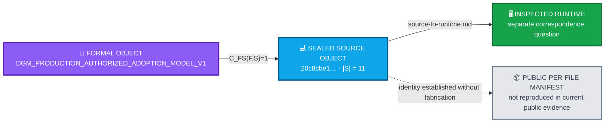

<div align="center">

# ALLIS — Source Identity Evidence

### Canonical Step-12 source object for the bounded production authorized-adoption formal and correspondence package

<br>


<br>

**Kidd’s Technical Services · ALLIS**

</div>

---

> [!IMPORTANT]
> This record defines the **canonical sealed source object** for the bounded Step-12 production authorized-adoption domain.
>
> It does **not** itself establish runtime correspondence. Runtime correspondence is a separate, time-indexed observation recorded in `source-to-runtime.md`.
>
> The public record establishes the sealed commit, the 11-file source-set identity and cardinality, and formal-to-source binding. It does **not** fabricate the original per-file 11-name/SHA-256 manifest where that manifest is not reproduced in the available public evidence.
>
> A later post-A8 qualification revalidated this **same bounded source domain** against exact observed NBB and worker runtimes. That later observation is successor correspondence evidence; it does **not** define a replacement source object or expand the Step-12 source domain.

---

# 👀 Source identity in one view



The repository keeps two different questions separate:

```text
source identity
=
which exact source object is authoritative?
```

versus:

```text
runtime correspondence
=
did the inspected runtime contain that exact source object at a defined time?
```

A stable source identity does not create permanent runtime correspondence.

---

# 🎯 Purpose

This document records the canonical source identity for the bounded ALLIS production authorized-adoption formal-verification and correspondence package.

The formal object is:

```text
DGM_PRODUCTION_AUTHORIZED_ADOPTION_MODEL_V1
```

The governing source-identity principle is:

> **A proof applies to the source object it was proved against—not to a later, similar, or intended source state merely because the names or architecture look the same.**

The broader ALLIS principle remains:

> **State does not become authority merely because it exists.**

> **A later runtime revalidation may strengthen current correspondence without redefining the immutable source domain it was measured against.**

Applied here:

```text
source file exists
≠
file belongs to the sealed theorem domain

same filename
≠
same source identity

descendant commit
≠
same sealed source

similar runtime code
≠
byte correspondence

prior correspondence
≠
future correspondence
```

---

# 📋 Source-identity status

| Field | Value |
|---|---|
| Document role | Canonical Step-12 source-identity record |
| Formal object | `DGM_PRODUCTION_AUTHORIZED_ADOPTION_MODEL_V1` |
| Production source commit | `20c8cbe175781c8a1c05d65c03977859ceca884a` |
| Source domain | Exact sealed 11-file production authorized-adoption source set |
| Source-set cardinality | `11` |
| Formal-to-source correspondence | `PASS` |
| Historical NBB source/runtime correspondence | `11/11 PASS` at Step-12 final seal |
| Historical worker source/runtime correspondence | `11/11 PASS` at Step-12 final seal |
| Current immutable source revalidation | `IMMUTABLE_SOURCE_IDENTITY=PASS_11_OF_11` |
| Current NBB source/runtime correspondence | `NBB_SOURCE_TO_RUNTIME_CORRESPONDENCE=PASS_11_OF_11` |
| Current worker source/runtime correspondence | `WORKER_SOURCE_TO_RUNTIME_CORRESPONDENCE=PASS_11_OF_11` |
| Current combined source/runtime correspondence | `CURRENT_POST_A8_DGM_SOURCE_TO_RUNTIME_CORRESPONDENCE=PASS_11_OF_11` |
| Final Step-12 status | `GREEN_CLOSED_WITH_EXPLICIT_RESIDUALS` |
| Final Step-12 seal SHA-256 | `b00a954a924d3aa3490a5bcb8d4473da2b6885b8c41e116cf03545fee975c23b` |
| Scope | `BOUNDED_PRODUCTION_AUTHORIZED_ADOPTION_FORMAL_MODEL_AND_ESTABLISHED_CORRESPONDENCE_ONLY` |

---

# 🧭 1. Canonical source authority

The source authority for the Step-12 authorized-adoption model is the exact committed source state at:

```text
20c8cbe175781c8a1c05d65c03977859ceca884a
```

The Step-12 formal record states that:

```text
DGM_PRODUCTION_AUTHORIZED_ADOPTION_MODEL_V1
```

was constructed from:

```text
the exact sealed 11-file production source set sealed during Step 11
```

Therefore define:

```math
S=
\{s_1,\ldots,s_{11}\}
```

where every member of `S` is a specific committed production source object at the controlling source commit.

The source set is not defined by filename alone.

It is defined by:

```text
repository source identity
+
commit identity
+
exact file identity
+
sealed byte identity
```

---

# 2. Source identity is not branch identity

The controlling source identity is the commit:

```text
20c8cbe175781c8a1c05d65c03977859ceca884a
```

A branch name is not sufficient to reproduce that identity because a branch can move.

Therefore:

```text
branch points to commit
≠
branch is immutable source identity
```

The Step-12 theorem and correspondence package is bound to the committed source object, not to whichever source a mutable branch may reference later.

---

# 3. Exact source-domain cardinality

The sealed Step-12 source domain contains:

```math
\boxed{
|S|=11
}
```

governed production source files.

The formal record repeatedly identifies this as the:

```text
sealed 11-file production authorized-adoption source set
```

and the source/runtime evidence establishes correspondence for:

```text
all eleven governed production source files
```

This cardinality is part of the proof boundary.

A source set with 10 or 12 files is not silently the same Step-12 formal domain.

---

# 📦 4. Canonical per-file manifest

The canonical per-file section of this record must contain, for each member of `S`:

```text
relative source path
SHA-256 byte identity
controlling production commit
membership in the sealed 11-file set
```

The authoritative table shape is:

| # | Production source path | SHA-256 | Commit |
|---:|---|---|---|
| 1 | `<sealed path 1>` | `<sealed SHA-256>` | `20c8cbe175781c8a1c05d65c03977859ceca884a` |
| 2 | `<sealed path 2>` | `<sealed SHA-256>` | `20c8cbe175781c8a1c05d65c03977859ceca884a` |
| 3 | `<sealed path 3>` | `<sealed SHA-256>` | `20c8cbe175781c8a1c05d65c03977859ceca884a` |
| 4 | `<sealed path 4>` | `<sealed SHA-256>` | `20c8cbe175781c8a1c05d65c03977859ceca884a` |
| 5 | `<sealed path 5>` | `<sealed SHA-256>` | `20c8cbe175781c8a1c05d65c03977859ceca884a` |
| 6 | `<sealed path 6>` | `<sealed SHA-256>` | `20c8cbe175781c8a1c05d65c03977859ceca884a` |
| 7 | `<sealed path 7>` | `<sealed SHA-256>` | `20c8cbe175781c8a1c05d65c03977859ceca884a` |
| 8 | `<sealed path 8>` | `<sealed SHA-256>` | `20c8cbe175781c8a1c05d65c03977859ceca884a` |
| 9 | `<sealed path 9>` | `<sealed SHA-256>` | `20c8cbe175781c8a1c05d65c03977859ceca884a` |
| 10 | `<sealed path 10>` | `<sealed SHA-256>` | `20c8cbe175781c8a1c05d65c03977859ceca884a` |
| 11 | `<sealed path 11>` | `<sealed SHA-256>` | `20c8cbe175781c8a1c05d65c03977859ceca884a` |

## Current evidence-resolution boundary

The Step-12 report available for this public documentation confirms:

- the controlling commit;
- the exact source-set cardinality of 11;
- formal-to-source binding to that exact set;
- `11/11` NBB runtime byte correspondence; and
- `11/11` worker runtime byte correspondence.

However, the currently available public/transcript evidence does **not reproduce the original Step-11 per-file 11-name/SHA-256 manifest**.

Accordingly, this document does **not** fabricate those identities.

The table above must be populated only by transcription from the original sealed Step-11 source-manifest artifact or another evidence artifact that explicitly enumerates all eleven paths and hashes.

Until that transcription is performed:

```text
SEALED_SET_IDENTITY=ESTABLISHED
SEALED_SET_CARDINALITY=11
SEALED_COMMIT_IDENTITY=ESTABLISHED
PER_FILE_MANIFEST_REPRODUCED_IN_PUBLIC_DOC=NO
```

This is a documentation-completeness limitation, not a reversal of the Step-12 source identity result.

---

# ➕ 4A. Post-A8 successor source-identity revalidation

The later post-A8 qualification did **not** infer a new source domain.

It consumed the sealed correspondence harness contract and revalidated the same theorem-relevant production source identity against the current observed DGM runtimes.

The qualified source identity remained:

```text
SOURCE_COMMIT=
20c8cbe175781c8a1c05d65c03977859ceca884a

SOURCE_TREE=
8d0840f076e84b4033ff398f602fb81a6d6e29f2

CANONICAL_SOURCE_SET_CARDINALITY=11

IMMUTABLE_SOURCE_IDENTITY=PASS_11_OF_11
```

## Sealed harness relationship

The current qualification used the previously sealed source/runtime harness profile:

```text
HARNESS_CONTRACT=DGM_CORRESPONDENCE_HARNESS_CONTRACT_R1

HARNESS_PROFILE_CONSUMED=YES

HARNESS_SCHEMA_DISCOVERY_REPEATED=NO
```

This matters because the qualification did not silently rediscover or redefine the theorem source domain during the same step that adjudicated correspondence.

The method was:

```text
discover once
    ↓
freeze contract
    ↓
qualify against contract
    ↓
seal result
```

The harness resolved the theorem-relevant canonical set as exactly these eleven paths:

```text
services/dgm_adoption_worker.py
services/hilbert/dgm_authorized_adoption.py
services/hilbert/dgm_authorized_spool.py
services/hilbert/dgm_evolution_agent.py
services/hilbert/dgm_evolution_authorization_bridge.py
services/hilbert/dgm_evolution_kernel.py
services/hilbert/dgm_governed_cycle.py
services/hilbert/dgm_nbb_authorized_package.py
services/hilbert/dgm_public_key_authorization_verifier.py
services/hilbert/dgm_worker_authorized_consumer.py
services/nbb_darwin_godel_machines.py
```

This is the current qualified **canonical path set** for the already established 11-file theorem domain.

It does not reconstruct or replace the historical Step-11 per-file SHA-256 manifest that is not reproduced in this public record.

## Current observed NBB runtime identity

The exact NBB runtime observed during the post-A8 qualification was:

```text
NBB_CONTAINER_ID=
851a55dbbd78ea36c711099df39a1e975884bfbc22d26bd916827f2e64cebe48

NBB_CONTAINER_NAME=
nbb_darwin_godel_machines
```

Observed result:

```text
NBB_SOURCE_RUNTIME_MATCH_COUNT=11
NBB_SOURCE_TO_RUNTIME_CORRESPONDENCE=PASS_11_OF_11
```

## Current observed worker runtime identity

The exact worker runtime observed during the post-A8 qualification was:

```text
WORKER_CONTAINER_ID=
abcda93ad26be00c6d987f14abddd887147caa7785b9c8c9810981fa17a8371d

WORKER_CONTAINER_NAME=
msjarvis-rebuild-dgm_adoption_worker-1
```

Observed result:

```text
WORKER_SOURCE_RUNTIME_MATCH_COUNT=11
WORKER_SOURCE_TO_RUNTIME_CORRESPONDENCE=PASS_11_OF_11
```

Combined current result:

```text
CURRENT_POST_A8_DGM_SOURCE_TO_RUNTIME_CORRESPONDENCE=PASS_11_OF_11
```

## Observation-specific identity boundary

The container IDs above identify the exact runtime objects observed during this post-A8 qualification epoch.

They are **not perpetual runtime identities**.

```text
observed container identity at qualification time
    ≠
identity guaranteed for every future deployment
```

If either theorem-relevant runtime is replaced, rebuilt, remounted, or otherwise changes, the runtime correspondence claim must be re-established.

The stable source object remains the immutable Git source identity.

The runtime relationship remains time-indexed observation evidence.

See:

- [`post-a8-theorem-correspondence-registry-r1.md`](post-a8-theorem-correspondence-registry-r1.md)
- [`../../correspondence/authorized-adoption/source-to-runtime.md`](../../correspondence/authorized-adoption/source-to-runtime.md)

---

# 5. Source modules explicitly evidenced by the formal correspondence record

The supporting source analysis explicitly references production modules including:

```text
services/hilbert/dgm_authorized_adoption.py
services/hilbert/dgm_public_key_authorization_verifier.py
services/hilbert/dgm_nbb_authorized_package.py
services/hilbert/dgm_evolution_authorization_bridge.py
services/hilbert/dgm_authorized_spool.py
services/hilbert/dgm_worker_authorized_consumer.py
services/hilbert/dgm_governed_cycle.py
services/hilbert/dgm_evolution_agent.py
services/hilbert/dgm_evolution_kernel.py
```

These paths are included here as **explicitly evidenced implementation references** from the historical formal-correspondence record.

The later post-A8 sealed harness qualification independently resolved the full canonical 11-path set shown in Section 4A.

That later path resolution does **not** mean that the historical Step-11 per-file SHA-256 table has been reconstructed in this document.

The distinction is deliberate:

```text
historically referenced source modules
≠
complete historical per-file Step-11 SHA table

current sealed-harness canonical path resolution
≠
fabricated historical per-file SHA manifest
```

---

# 📐 Formal and correspondence relationships

# 6. Formal-to-source identity

Let:

```math
F=
DGM\_PRODUCTION\_AUTHORIZED\_ADOPTION\_MODEL\_V1
```

and let:

```math
S=
\{s_1,\ldots,s_{11}\}
```

be the exact sealed production source set.

Step 12 establishes:

```math
\boxed{
C_{FS}(F,S)=1
}
```

for the bounded authorized-adoption domain.

This means the formal object is derived from and bound to the sealed source domain represented by `S`.

It does not mean:

```math
F=S
```

and it does not mean:

```text
the formal model covers every behavior in the source repository
```

---

# 🔗 7. Source-to-runtime byte identity

Let:

```math
R_N
```

be the live NBB runtime source set and:

```math
R_W
```

the live worker runtime source set.

At the Step-12 final seal:

```math
\boxed{
C_{SR}^{\tau_{seal}}(S,R_N)=1
}
```

with:

```text
11/11 PASS
```

and:

```math
\boxed{
C_{SR}^{\tau_{seal}}(S,R_W)=1
}
```

with:

```text
11/11 PASS
```

Thus every one of the eleven governed files in the sealed source domain corresponded by byte identity in both inspected runtime roles at the final seal boundary.

That is the historical Step-12 observation.

The later post-A8 qualification separately re-established:

```text
NBB_SOURCE_TO_RUNTIME_CORRESPONDENCE=PASS_11_OF_11
WORKER_SOURCE_TO_RUNTIME_CORRESPONDENCE=PASS_11_OF_11
CURRENT_POST_A8_DGM_SOURCE_TO_RUNTIME_CORRESPONDENCE=PASS_11_OF_11
```

against the exact current runtime identities recorded in Section 4A.

---

# 8. Byte identity is stronger than filename correspondence

The Step-12 runtime result is not merely:

```text
the same filenames existed
```

It is a byte-correspondence result.

Conceptually, for every `i` in the sealed set:

```math
H(s_i)=H(r_{N,i})
```

and:

```math
H(s_i)=H(r_{W,i})
```

at the final seal boundary.

Therefore:

```text
same filename
≠
sufficient correspondence
```

A changed byte identity breaks the sealed identity even if the path remains unchanged.

---

# 🧱 9. Source identity and runtime identity remain separate

This document defines the source object.

`source-to-runtime.md` records whether runtime copies corresponded to that object.

The distinction is:

```text
source-identity.md
    ↓
What exact source object is authoritative?

source-to-runtime.md
    ↓
Did the inspected runtime contain that source object?
```

The first cannot substitute for the second.

---

# 10. Source identity and formal model remain separate

Likewise:

```text
source-identity.md
```

does not itself prove a theorem.

The chain is:

```text
sealed source identity
        ↓
formal model derived from source
        ↓
formal propositions adjudicated
        ↓
runtime correspondence evaluated
```

A hash identifies an object.

It does not prove every semantic property of that object.

---

# 🔄 Successor-source boundary

# 11. Source replacement invalidates automatic inheritance

Let:

```math
S'
```

be a later source state.

If:

```math
S'\neq S
```

then the Step-12 source identity does not automatically become the identity of `S'`.

Likewise:

```math
C_{FS}(F,S)=1
```

does not automatically imply:

```math
C_{FS}(F,S')=1
```

and:

```math
C_{SR}^{\tau_{seal}}(S,R)=1
```

does not automatically imply correspondence for a changed source/runtime state.

A successor source requires a new evidence boundary.

The post-A8 qualification described in this record was **not** such a source replacement.

It revalidated the same immutable source commit/tree against a later observed runtime epoch.

```text
same source identity + later runtime observation
    ≠
successor source
```

---

# 12. Source identity does not authorize mutation

The fact that a source object is the sealed theorem domain does not make that source mutable without authorization.

```text
source belongs to the formal model
≠
source may be changed

source identity is known
≠
mutation authority exists

candidate targets sealed source
≠
candidate is authorized
```

Operational authorization remains governed by the authorization, target, prestate, one-use, application, poststate, and receipt predicates defined in the formal model.

---

# 🧩 Distinct evidence objects

# 13. Relationship to the trust anchor

The source set and public trust anchor are separate identities.

The public trust anchor is bound to SHA-256:

```text
4809a1af3dd8fad1767dc5a8a9d67aa763388a055e00ec818c15f9fe0321fbb5
```

The trust anchor establishes the expected public verification identity.

It is not one of the eleven production source files merely because it participates in the same bounded architecture.

---

# 14. Relationship to the governance view

The sealed governance view is separately bound to SHA-256:

```text
26523c0bad40ff06a75c62a802f20195295534764dce45cfa6acdcdaecc3fcc2
```

The governance view is a sealed governance object.

It is not silently merged into the eleven-file source identity.

The Step-12 package keeps:

```text
source identity
trust identity
governance identity
runtime health
spool state
```

as distinct evidence objects.

---

# 15. Relationship to the final seal

The controlling Step-12 seal is:

```text
STEP12_FINAL_THEOREM_AND_FORMAL_CORRESPONDENCE_SEALED_GREEN_WITH_EXPLICIT_RESIDUALS
```

with final result SHA-256:

```text
b00a954a924d3aa3490a5bcb8d4473da2b6885b8c41e116cf03545fee975c23b
```

and scope:

```text
BOUNDED_PRODUCTION_AUTHORIZED_ADOPTION_FORMAL_MODEL_AND_ESTABLISHED_CORRESPONDENCE_ONLY
```

The final seal binds the Step-12 result to the sealed source domain.

It does not expand the eleven-file source domain into a whole-system source claim.

---

# 🛡️ 16. Source-domain residual boundary

The Step-12 residual set explicitly preserves:

```text
R12F-06 — Bounded formal domain
```

with classification:

```text
BOUNDED_DOMAIN
```

and controlling meaning:

> The formal model covers the sealed 11-file authorized-adoption path rather than all platform behavior.

Therefore the source identity recorded here must not be described as:

```text
the complete ALLIS source identity
```

It is:

```text
the exact Step-12 production authorized-adoption source identity
```

---

# 🕒 17. Point-in-time runtime boundary

Source identity at commit `20c8cbe...` is immutable as a Git object.

Runtime correspondence to that source is not perpetual.

Thus:

```text
sealed commit identity
=
stable historical identity
```

while:

```text
runtime correspondence
=
time-indexed observation
```

This distinction is preserved in:

```text
R12F-07 = POINT_IN_TIME_BINDING
```

The current record now contains two runtime observation epochs:

```text
Step-12 final seal
    =
historical 11/11 source/runtime correspondence

post-A8 revalidation
    =
current 11/11 source/runtime correspondence
```

Neither observation is perpetual.

A future changed runtime must earn another correspondence result.

---

# 18. Final source-identity statement

Let:

```math
S=
\{s_1,\ldots,s_{11}\}
```

be the exact sealed production authorized-adoption source set at:

```text
20c8cbe175781c8a1c05d65c03977859ceca884a
```

Then Step 12 establishes that:

```math
\boxed{
|S|=11
}
```

and:

```math
\boxed{
C_{FS}(F,S)=1
}
```

for:

```text
DGM_PRODUCTION_AUTHORIZED_ADOPTION_MODEL_V1
```

and, at the final runtime seal:

```math
\boxed{
C_{SR}^{\tau_{seal}}(S,R_N)=1
}
```

and:

```math
\boxed{
C_{SR}^{\tau_{seal}}(S,R_W)=1
}
```

with:

```text
NBB     11/11 PASS
Worker  11/11 PASS
```

No larger source domain is implied.

No later source state inherits this identity automatically.

No mutation authority is created by this identity.

The later post-A8 observation does not alter those Step-12 source facts.

It separately establishes for the same immutable source object:

```text
SOURCE_TREE=
8d0840f076e84b4033ff398f602fb81a6d6e29f2

IMMUTABLE_SOURCE_IDENTITY=PASS_11_OF_11

CURRENT_POST_A8_DGM_SOURCE_TO_RUNTIME_CORRESPONDENCE=PASS_11_OF_11
```

with observation-specific NBB and worker runtime identities.

---

# 📚 19. Repository location

This record belongs at:

```text
evidence/
    governed-evolution/
        source-identity.md
```

The evidence directory should be spelled exactly:

```text
governed-evolution
```

not:

```text
govgoverned-evolution
```

---

# 🔗 20. Companion records

This record should be read with:

```text
formal-verification/
    authorized-adoption/
        formal-model.md
        theorem-registry.md
        counterexample-registry.md

correspondence/
    authorized-adoption/
        model-to-source.md
        source-to-runtime.md

evidence/
    governed-evolution/
        source-identity.md
        trust-anchor.md
        governance-view.md
        residuals.md
        step12-final-seal.md
        post-a8-theorem-correspondence-registry-r1.md
```

Use:

- [`source-identity.md`](source-identity.md) — canonical sealed Step-12 source identity
- [`model-to-source.md`](../../correspondence/authorized-adoption/model-to-source.md) — formal object → sealed source correspondence
- [`source-to-runtime.md`](../../correspondence/authorized-adoption/source-to-runtime.md) — sealed source → inspected runtime byte correspondence at final seal
- [`formal-model.md`](../../formal-verification/authorized-adoption/formal-model.md) — bounded mathematical object
- [`theorem-registry.md`](../../formal-verification/authorized-adoption/theorem-registry.md) — proposition dispositions and validation levels
- [`counterexample-registry.md`](../../formal-verification/authorized-adoption/counterexample-registry.md) — preserved falsifying cases
- [`trust-anchor.md`](trust-anchor.md) — separate sealed public verification identity
- [`governance-view.md`](governance-view.md) — separate sealed governance-view identity and NBB correspondence
- [`residuals.md`](residuals.md) — bounded residual and non-promotion ledger
- [`step12-final-seal.md`](step12-final-seal.md) — controlling historical Step-12 final seal
- [`post-a8-theorem-correspondence-registry-r1.md`](post-a8-theorem-correspondence-registry-r1.md) — later current source/runtime and theorem-correspondence successor observation

The ownership split remains:

```text
source-identity.md
    answers
    "What exact source object is authoritative?"

source-to-runtime.md
    answers
    "Did the inspected runtime contain that source object at the observation boundary?"
```

The first does not substitute for the second.

---

# 🧾 Source-identity summary

<div align="center">

### 💻 SEALED PRODUCTION SOURCE
**commit `20c8cbe1…`**

### 📦 SOURCE DOMAIN
**exact 11-file production authorized-adoption set**

### 📐 FORMAL → SOURCE
**`C_FS(F,S)=1`**

<br>

### 🧾 PUBLIC MANIFEST BOUNDARY
**sealed set identity established · cardinality = 11**

**per-file 11-name / SHA-256 manifest not reproduced in the current public record**

<br>

### 🕒 RUNTIME RELATION
**source identity = stable immutable object**

**Step-12 runtime = historical point-in-time observation**

**post-A8 runtime = later point-in-time `PASS_11_OF_11` observation**

<br>

### 🖥️ CURRENT OBSERVATION
**exact NBB + worker identities recorded for the post-A8 qualification epoch**

**container identities are observation-specific, not perpetual**

<br>

### 🛡️ SCOPE
**`R12F-06 = BOUNDED_DOMAIN`**

<br>

# `SYSTEM_PROVEN=NO`

</div>

---

# Governing source-identity statement

> **The theorem domain is the exact source object that was sealed—not whatever source later happens to occupy the same path.**

> **Source identity does not become runtime correspondence merely because the runtime uses the same filenames or architecture.**

> **State does not become authority merely because it exists.**
