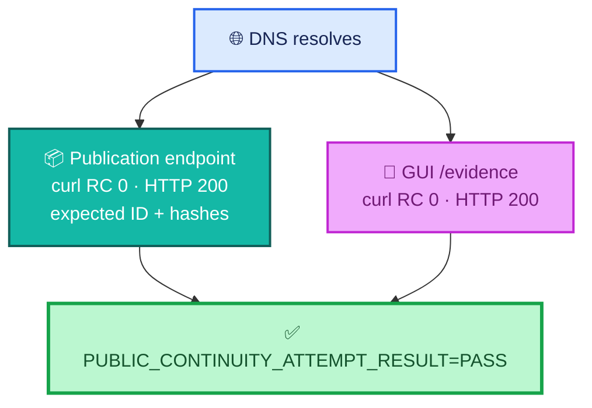
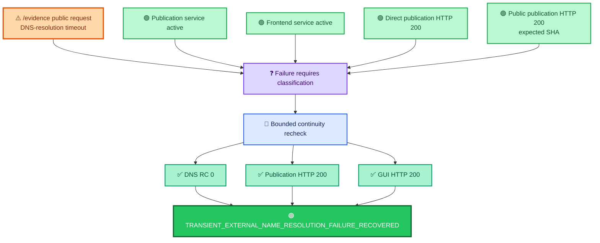
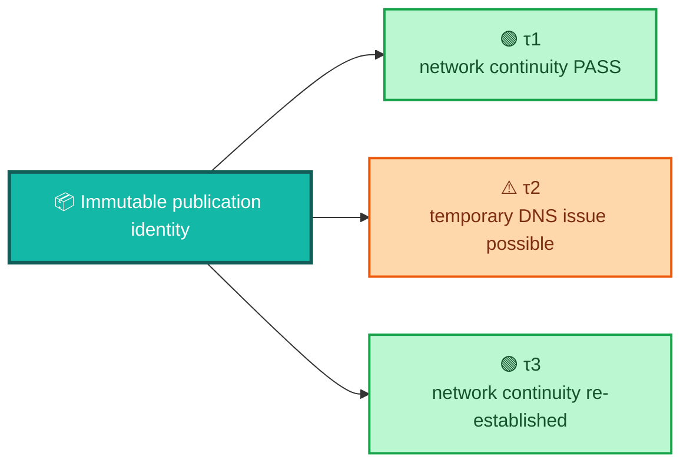

<div align="center">

# ALLIS — Publication Network Continuity

### Evidence record for the final Step-17 public DNS, publication endpoint, GUI reachability, recovery, and continuity adjudication

<br>


<br>

**Kidd’s Technical Services · ALLIS**

</div>

---

> [!IMPORTANT]
> This record documents the **final bounded public-network continuity result** for Step 17.
>
> It preserves both the earlier transient DNS-resolution timeout and the later successful recovery observation.
>
> The final result is not obtained by deleting the failure. It is obtained by **classifying the failure correctly, re-observing the public path, and sealing the recovered state without production repair**.

---

# 👀 Final network-continuity result

```text
FINAL_NETWORK_CONTINUITY=GREEN

PUBLIC_CONTINUITY_RECOVERED=YES
SUCCESSFUL_PUBLIC_CONTINUITY_ATTEMPT=1
PUBLIC_NETWORK_CONTINUITY=PASS

DNS_RC=0

PUBLICATION_CURL_RC=0
PUBLICATION_STATUS=200

GUI_CURL_RC=0
GUI_STATUS=200

FINAL_DIRECT_PUBLIC_BODY_CORRESPONDENCE=PASS

NETWORK_FAILURE_CLASSIFICATION=
TRANSIENT_EXTERNAL_NAME_RESOLUTION_FAILURE_RECOVERED

NETWORK_CONTINUITY_RECOVERY=PASS
PRODUCTION_REPAIR_REQUIRED=NO

TRANSIENT_DNS_ADJUDICATION=PASS
```

---

# 🎯 Purpose

`evidence/publication/network-continuity.md` answers:

> **Was the sealed governed publication and the Evidence & Governance Portal reachable through the intended public network path at the final Step-17 observation, and how was the prior DNS failure adjudicated?**

It does not answer:

> What publication object was sealed?

That belongs in:

```text
evidence/publication/publication-identity.md
```

It does not answer:

> What local service and isolation boundary served the publication?

That belongs in:

```text
evidence/publication/runtime-boundary.md
```

It does not answer:

> Which objects corresponded across source/state, publication, HTTP, and GUI?

That belongs in:

```text
correspondence/publication/source-to-publication-to-http-to-gui.md
```

This record is specifically about **network reachability, continuity, recovery, and failure classification**.

---

# 🧭 The continuity path


The final check required more than “the host answered.”

It required:

```text
DNS resolves
+
public publication request succeeds
+
publication identity matches expected
+
publication SHA matches expected
+
payload SHA matches expected
+
GUI request succeeds
```

before continuity could pass.

---

# ✅ Final successful public-continuity attempt

The final bounded recovery observation recorded:

```text
PUBLIC_CONTINUITY_ATTEMPT=1

DNS_RC=0
DNS_RESULT_LINES=12

PUBLICATION_CURL_RC=0
PUBLICATION_STATUS=200

PUBLICATION_ID=
allis-publication-step6-retention-v2

PUBLICATION_SHA256=
d6ab63522f9080fae440578ebbb6ed42140595155c9a30253f5b8eeeef8009b7

PUBLICATION_PAYLOAD_SHA256=
04ebb5bc1f97cbf56b8722fea9bcc7e7303cac2f5b467510d7a821d84d4a3c3c

GUI_CURL_RC=0
GUI_STATUS=200

PUBLIC_CONTINUITY_ATTEMPT_RESULT=PASS
```

The resulting continuity state was:

```text
PUBLIC_CONTINUITY_RECOVERED=YES
SUCCESSFUL_PUBLIC_CONTINUITY_ATTEMPT=1
PUBLIC_NETWORK_CONTINUITY=PASS
```

---

# 🌐 DNS success is necessary but not sufficient

The final recovery began with:

```text
DNS_RC=0
```

That established successful name resolution for the bounded recovery attempt.

But:

```text
DNS_RC=0
    ≠
publication continuity proven
```

and:

```text
DNS_RC=0
    ≠
GUI continuity proven
```

The HTTP observations and publication identity checks were required separately.

---

# 📦 Public publication continuity

The final public publication request returned:

```text
PUBLICATION_CURL_RC=0
PUBLICATION_STATUS=200
```

and the expected identity:

```text
allis-publication-step6-retention-v2
```

with the expected body hash:

```text
d6ab63522f9080fae440578ebbb6ed42140595155c9a30253f5b8eeeef8009b7
```

and expected payload hash:

```text
04ebb5bc1f97cbf56b8722fea9bcc7e7303cac2f5b467510d7a821d84d4a3c3c
```

Therefore network continuity was not declared merely because the endpoint returned `200`.

The returned publication also had to be the expected governed object.

---

# 🔎 GUI continuity

The Evidence & Governance Portal request returned:

```text
GUI_CURL_RC=0
GUI_STATUS=200
```

That established successful public GUI reachability during the same bounded recovery attempt.

The final result therefore covered both:

```text
publication endpoint reachable
```

and:

```text
GUI endpoint reachable
```

rather than testing one and assuming the other.

---

# 🔗 Simultaneous bounded continuity

The recovery logic required both public components to succeed in the same successful attempt.

Conceptually:



This is stronger than:

```text
publication succeeded once
+
GUI succeeded at some unrelated time
```

The bounded recovery established a common successful continuity observation.

---

# 🏠 Local production continuity remained healthy

Before the final public recovery check, Step 17 separately established local production continuity.

The record shows:

```text
FRONTEND_ACTIVE=active
PUBLICATION_ACTIVE=active

DIRECT_PUBLICATION_STATUS=200

DIRECT_PUBLICATION_SHA256=
d6ab63522f9080fae440578ebbb6ed42140595155c9a30253f5b8eeeef8009b7

LOCAL_PRODUCTION_CONTINUITY=PASS
```

This distinction matters because the prior failing observation involved public name resolution, not the local publication service disappearing.

---

# 🧱 Local continuity and public continuity are different layers

```text
local service healthy
    ≠
public DNS healthy
```

```text
public DNS healthy
    ≠
correct publication body
```

```text
publication endpoint healthy
    ≠
GUI healthy
```

```text
GUI healthy
    ≠
publication identity validated
```

Step 17 kept these layers separate.

---

# ⚠️ The prior transient DNS failure

Before the final recovery, the final fresh production continuity check encountered:

```text
curl: (28) Resolving timed out after 5000 milliseconds
```

The same observation still showed:

```text
FINAL_FRONTEND_ACTIVE=active
FINAL_PUBLICATION_ACTIVE=active

FINAL_DIRECT_STATUS=200

FINAL_DIRECT_SHA256=
d6ab63522f9080fae440578ebbb6ed42140595155c9a30253f5b8eeeef8009b7

FINAL_PUBLIC_STATUS=200

FINAL_PUBLIC_SHA256=
d6ab63522f9080fae440578ebbb6ed42140595155c9a30253f5b8eeeef8009b7

FINAL_PUBLIC_GUI_STATUS=000
FINAL_PRODUCTION_CONTINUITY=FAIL
```

The failure therefore had to be diagnosed rather than generalized.

---

# 🧠 Why the failure was not classified as production failure

The final adjudication explicitly states that the `/evidence` request encountered a transient DNS-resolution timeout and that:

- no application failure accompanied it;
- no service failure accompanied it;
- no route failure accompanied it;
- no publication failure accompanied it;
- no production failure accompanied it;
- the exact public publication had succeeded on the same host;
- both production services remained active;
- later bounded public checks restored simultaneous publication and GUI reachability;
- no production repair was required.

This is a causal classification, not an excuse to ignore the failure.

---

# 🔬 Evidence pattern around the failure



---

# 🧾 Final failure classification

The authoritative final classification is:

```text
NETWORK_FAILURE_CLASSIFICATION=
TRANSIENT_EXTERNAL_NAME_RESOLUTION_FAILURE_RECOVERED
```

with:

```text
NETWORK_CONTINUITY_RECOVERY=PASS

PRODUCTION_REPAIR_REQUIRED=NO

TRANSIENT_DNS_ADJUDICATION=PASS
```

That classification should be preserved exactly.

It should not be shortened to:

```text
network failure
```

because that loses the resolution state.

It should not be rewritten as:

```text
production outage
```

because the evidence did not support that conclusion.

---

# 🚫 The timeout is not deleted from history

The final green state does not mean:

```text
the timeout never happened
```

The correct chronology is:

```text
public continuity attempt encountered DNS timeout
        ↓
services and publication remained healthy
        ↓
bounded public continuity rechecked
        ↓
DNS resolved
        ↓
publication returned expected object
        ↓
GUI returned HTTP 200
        ↓
prior failure adjudicated as transient DNS-resolution failure
        ↓
final network continuity GREEN
```

The recovered state supersedes the failure as the **final continuity status** without erasing the historical observation.

---

# 🔁 Recovery did not require production repair

The final adjudication records:

```text
PRODUCTION_REPAIR_REQUIRED=NO
```

That is a specific claim.

It means the recovered public path did not require a production repair to:

- application code;
- publication state;
- route configuration;
- service state;
- frontend runtime;
- publication runtime.

It does **not** mean production can never require repair in a future event.

---

# 🧱 Recovery without repair vs recovery by mutation

```text
continuity recovered
+
production repair not required
```

is different from:

```text
continuity restored by changing production
```

The Step-17 final state is the first case.

This matters because the evidence preserves the distinction between:

```text
environmental/transient reachability condition
```

and:

```text
production defect corrected by mutation
```

---

# 🔗 Direct/public body correspondence remained intact

After public continuity recovered, the final direct and public bodies were hashed independently.

Final values:

```text
FINAL_DIRECT_SHA256=
d6ab63522f9080fae440578ebbb6ed42140595155c9a30253f5b8eeeef8009b7

FINAL_PUBLIC_SHA256=
d6ab63522f9080fae440578ebbb6ed42140595155c9a30253f5b8eeeef8009b7
```

and:

```text
FINAL_DIRECT_PUBLIC_BODY_CORRESPONDENCE=PASS
```

This shows that recovery did not merely restore *some* HTTP body.

It restored public access to the expected sealed publication body.

---

# 📦 Network continuity is publication-aware

The Step-17 continuity check did not reduce health to:

```text
HTTP 200
```

It checked:

```text
expected publication ID
expected publication SHA
expected payload SHA
```

That protects against this false positive:

```text
endpoint reachable
+
wrong publication served
=
healthy
```

The final recovery did not allow that shortcut.

---

# 🔒 Network continuity does not create publication authority

A public endpoint can be reachable without being authorized.

Therefore:

```text
reachable
    ≠
authorized
```

The route authority and publication authority are established elsewhere in the Step-17 evidence.

This file records reachability and continuity for the already governed path.

---

# 🔒 Network continuity does not create mutation authority

Likewise:

```text
public endpoint returns HTTP 200
    ≠
public endpoint can write
```

The final publication boundary remained:

```text
STRICT_READ_ONLY_PUBLICATION_BOUNDARY=GREEN
NO_PUBLIC_MUTATION_ENDPOINT=GREEN
```

Network success is evidence about availability.

It is not evidence of write authority.

---

# 🧭 Continuity dimensions

The final Step-17 result can be separated into four continuity dimensions.

| Dimension | Question | Final result |
|---|---|---|
| Local runtime continuity | Are the local frontend/publication services active and is direct publication serving healthy? | ✅ `PASS` |
| DNS continuity | Does the public hostname resolve during the final bounded recovery? | ✅ `DNS_RC=0` |
| Public publication continuity | Does the public publication endpoint return the expected governed object? | ✅ HTTP `200` + expected ID/hashes |
| Public GUI continuity | Does `/evidence` respond successfully through the public route? | ✅ HTTP `200` |

All four contribute to the final network-continuity interpretation.

---

# 🧮 Continuity predicate

For the bounded final recovery, let:

```text
D = DNS resolution succeeds
P = publication HTTP request succeeds
I = publication ID matches expected
H = publication SHA matches expected
Y = payload SHA matches expected
G = GUI HTTP request succeeds
```

Then the successful bounded continuity attempt can be represented as:

```math
C_{\text{public}} = D \land P \land I \land H \land Y \land G
```

For the final attempt:

```text
D = true
P = true
I = true
H = true
Y = true
G = true
```

therefore:

```text
PUBLIC_CONTINUITY_ATTEMPT_RESULT=PASS
```

---

# 🧮 Recovery predicate

The final recovery required more than one passing request.

It also required correct adjudication of the prior failure.

Conceptually:

```math
R =
C_{\text{public}}
\land C_{\text{local}}
\land C_{\text{body}}
\land A_{\text{dns}}
```

where:

```text
C_public = successful final public continuity
C_local = local production continuity PASS
C_body = direct/public body correspondence PASS
A_dns = prior DNS event adjudicated as resolved transient failure
```

The final record establishes all four.

---

# 🕒 Continuity is point-in-time

This is one of the most important boundaries in the file.

```text
FINAL_NETWORK_CONTINUITY=GREEN
```

means:

> The intended public path was successfully observed in the bounded final Step-17 continuity recovery.

It does not mean:

```text
the network can never fail again
```

or:

```text
DNS is permanently available
```

or:

```text
the GUI is permanently reachable
```

or:

```text
future publication routes require no revalidation
```

---

# 🕒 Object identity and network availability have different time behavior

The sealed publication can remain historically identified by:

```text
allis-publication-step6-retention-v2
```

while the network path can vary over time.



Object identity and network continuity must not be collapsed.

---

# 🔄 What changes require renewed network continuity evidence?

Examples include:

- DNS record changes;
- public hostname changes;
- TLS/HTTPS changes;
- reverse-proxy changes;
- public route changes;
- publication-service port changes;
- publication-service listener changes;
- GUI route changes;
- frontend deployment changes affecting `/evidence`;
- publication endpoint path changes;
- CDN/tunnel changes;
- service relocation;
- public certificate changes;
- network-policy changes.

A new publication object does not always require a new network topology, but the new public correspondence should still be checked.

---

# 🌍 External dependency failure is not automatically internal failure

Step 17 demonstrates a useful evidence discipline:

```text
external resolution problem
    ≠
internal publication failure
```

The system did not infer:

```text
DNS timeout
    ⇒
application broken
```

Instead it checked the surrounding evidence.

That is the correct classification pattern for a governed evidence system.

---

# 🧠 Failure cause and failure surface are different

A user-visible request can fail at the network surface even when the internal application remains healthy.

```text
observed surface:
GUI public request unavailable at that moment
```

```text
adjudicated cause:
transient external name-resolution failure
```

Those are related but not identical statements.

The final evidence preserves both.

---

# 🟡 `TIMED_OUT` vs `UNAVAILABLE` vs `DENIED`

The prior event was a timeout during DNS resolution.

Under the fail-closed semantic architecture:

```text
timed out
    ≠
denied
```

and:

```text
network unavailable
    ≠
publication unauthorized
```

The event carried transport/network meaning, not governance-denial meaning.

This distinction prevents infrastructure incidents from being misreported as policy decisions.

---

# 🧱 No silent downgrade of publication identity during recovery

The recovery logic required the expected:

```text
publication ID
publication SHA
payload SHA
```

So recovery could not pass by serving:

- stale publication;
- arbitrary successful JSON;
- wrong immutable publication;
- mismatched payload;
- placeholder success response.

The continuity path remained evidence-bound.

---

# 🔎 GUI `200` is necessary but not the whole GUI correspondence proof

The network-continuity package records:

```text
GUI_STATUS=200
```

That establishes reachability.

But the stronger claim:

```text
GUI consumes governed live publication
```

depends on the Step-17 correspondence/browser evidence, not this status code alone.

This file therefore avoids turning network reachability into a semantic GUI proof.

---

# 📦 Publication `200` is necessary but not the whole publication-identity proof

Likewise:

```text
PUBLICATION_STATUS=200
```

does not independently prove:

```text
correct publication
```

The ID and hashes provide the identity evidence.

The frozen contract, reference resolution, authority, eligibility, and retention evidence are documented elsewhere.

---

# 🔗 Network continuity and correspondence

The publication correspondence record uses this network evidence to support:

```text
direct service
    ↓
public HTTPS publication
    ↓
GUI
```

This file supplies:

- public reachability;
- public publication identity observation;
- GUI reachability;
- final body comparison;
- failure/recovery adjudication.

It does not duplicate the full correspondence model.

---

# 🔗 Network continuity and runtime boundary

The runtime-boundary record establishes:

```text
loopback publication service
authorized Caddy route
read-only exposure
```

This file establishes that the resulting public route was actually reachable in the final observation.

So:

```text
runtime-boundary.md
    = how the route is constrained

network-continuity.md
    = whether the route worked at final observation
```

---

# 🔗 Network continuity and publication identity

The publication-identity record establishes the immutable governed publication object.

This file verifies that the public path returned that expected identity during the successful final continuity attempt.

So:

```text
publication-identity.md
    = WHAT object

network-continuity.md
    = WAS that object reachable publicly
```

---

# 🔗 Network continuity and acceptance

The final acceptance close depends on:

```text
FINAL_NETWORK_CONTINUITY=GREEN
```

but the acceptance file should not need to reproduce the full failure/recovery analysis.

That analysis lives here.

This keeps acceptance concise while preserving the evidence trail.

---

# 🧾 Network-continuity evidence artifacts

The final Step-17 seal included dedicated network-continuity evidence:

```text
build/step17/r2r2/network-continuity-attempts.txt

build/step17/r2r2/network-continuity-adjudication.json

build/step17/r2r2/final-direct-publication.json

build/step17/r2r2/final-public-publication.json

build/step17/r2r2/final-publication.headers

build/step17/r2r2/step17-final-audit.json

docs/publication/STEP17_FINAL_COMPLETION.md
```

Those artifacts were included in the final SHA-256 completion seal and later verified successfully.

---

# 🔐 Evidence seal continuity

The final completion manifest verification recorded:

```text
STEP17_FINAL_MANIFEST_VERIFICATION=PASS
```

The predecessor seals also remained valid:

```text
STEP16_FINAL_SEAL_AFTER_COMPLETION=PASS

STEP17_R1A_SEAL_AFTER_COMPLETION=PASS
```

This matters because final network recovery was not appended as an unsealed informal observation.

It became part of the final evidence package.

---

# 🧾 Final continuity matrix

| Evidence question | Final observation |
|---|---|
| Were local production services active? | ✅ Yes |
| Did direct publication return HTTP 200? | ✅ Yes |
| Did direct publication match expected SHA? | ✅ Yes |
| Did DNS resolve during recovery? | ✅ `DNS_RC=0` |
| Did public publication curl succeed? | ✅ `RC=0` |
| Did public publication return HTTP 200? | ✅ Yes |
| Did public publication ID match expected? | ✅ Yes |
| Did public publication SHA match expected? | ✅ Yes |
| Did payload SHA match expected? | ✅ Yes |
| Did GUI curl succeed? | ✅ `RC=0` |
| Did GUI return HTTP 200? | ✅ Yes |
| Did direct/public bodies match? | ✅ `PASS` |
| Was prior failure adjudicated? | ✅ `PASS` |
| Was production repair required? | ✅ `NO` |
| Final network continuity | 🟢 `GREEN` |

---

# 🚫 Stronger claims not supported

This record does not support:

```text
the network will never fail
```

It does not support:

```text
DNS is permanently healthy
```

It does not support:

```text
all future GUI builds will be reachable
```

It does not support:

```text
all future publications will be served correctly
```

It does not support:

```text
every timeout is external DNS
```

It does not support:

```text
HTTP 200 proves semantic correctness
```

It does not support:

```text
public reachability creates public mutation authority
```

It does not support:

```text
the transient DNS timeout did not happen
```

It does not support:

```text
Step 17 proves all network infrastructure
```

It does not support:

```text
SYSTEM_PROVEN=YES
```

---

# ✅ Supported network-continuity claim

A concise supported claim is:

> **At the final Step-17 recovery observation, public DNS resolution succeeded, the governed publication endpoint returned HTTP 200 with the expected publication ID, publication SHA, and payload SHA, and the Evidence & Governance Portal returned HTTP 200. The direct and public publication bodies matched. The earlier `/evidence` DNS timeout was adjudicated as a recovered transient external name-resolution failure, and no production repair was required.**

That statement preserves both the success and the historical failure.

---

# 🧩 Relationship to fail-closed semantics

The earlier DNS event should be interpreted as a network/availability condition.

It should not be converted into:

```text
DENIED
```

or:

```text
publication invalid
```

or:

```text
production mutation required
```

without evidence.

The final adjudication is an example of preserving the failure's actual semantic class until evidence resolves the cause.

---

# 🧩 Relationship to `CURRENT.md`

`CURRENT.md` can state the bounded present result:

```text
final publication network continuity is GREEN
```

without reproducing the entire recovery history.

This evidence record preserves the underlying detail:

```text
what failed
what remained healthy
what was rechecked
what recovered
what was classified
what did not require repair
```

---

# 📦 Normalized network-continuity record

```yaml
allis_publication_network_continuity:

  scope:
    workstream: publication_step17
    evidence_type: network_continuity
    point_in_time: true

  prior_observation:
    public_gui_status: 000
    event: dns_resolution_timeout
    curl_error: resolving_timed_out_after_5000ms
    frontend_active: true
    publication_service_active: true
    direct_publication_status: 200
    public_publication_status: 200
    direct_publication_sha256: d6ab63522f9080fae440578ebbb6ed42140595155c9a30253f5b8eeeef8009b7
    public_publication_sha256: d6ab63522f9080fae440578ebbb6ed42140595155c9a30253f5b8eeeef8009b7
    continuity_state_at_that_observation: FAIL

  recovery_attempt:
    attempt: 1
    dns_rc: 0
    dns_result_lines: 12

    publication:
      curl_rc: 0
      http_status: 200
      id: allis-publication-step6-retention-v2
      sha256: d6ab63522f9080fae440578ebbb6ed42140595155c9a30253f5b8eeeef8009b7
      payload_sha256: 04ebb5bc1f97cbf56b8722fea9bcc7e7303cac2f5b467510d7a821d84d4a3c3c

    gui:
      curl_rc: 0
      http_status: 200

    result: PASS

  local_production_continuity:
    frontend_active: true
    publication_active: true
    direct_publication_status: 200
    direct_publication_sha256: d6ab63522f9080fae440578ebbb6ed42140595155c9a30253f5b8eeeef8009b7
    state: PASS

  direct_public_correspondence:
    direct_sha256: d6ab63522f9080fae440578ebbb6ed42140595155c9a30253f5b8eeeef8009b7
    public_sha256: d6ab63522f9080fae440578ebbb6ed42140595155c9a30253f5b8eeeef8009b7
    body_correspondence: PASS

  adjudication:
    failure_classification: TRANSIENT_EXTERNAL_NAME_RESOLUTION_FAILURE_RECOVERED
    network_continuity_recovery: PASS
    transient_dns_adjudication: PASS
    production_repair_required: false

  final:
    public_continuity_recovered: true
    successful_public_continuity_attempt: 1
    public_network_continuity: PASS
    final_network_continuity: GREEN

  evidence_seal:
    final_manifest_verification: PASS
    step16_predecessor_seal_after_completion: PASS
    step17_r1a_predecessor_seal_after_completion: PASS

  nonclaims:
    permanent_dns_availability: false
    permanent_network_availability: false
    http_200_alone_proves_correct_publication: false
    every_timeout_is_external_dns: false
    public_reachability_creates_mutation_authority: false
    system_proven: false
```

> [!NOTE]
> This YAML block is a human-readable evidence normalization. The sealed Step-17 network-continuity attempts, adjudication, final public/direct bodies, audit, and completion manifest remain the bounded engineering evidence authority.

---

# 📚 Related repository records

## Publication evidence

- `readme.md` — publication evidence package index
- [`publication-identity.md`](publication-identity.md) — immutable publication identity
- [`runtime-boundary.md`](runtime-boundary.md) — serving-runtime and isolation boundary
- `network-continuity.md` — **this record**
- `step17-final-close.md` — final evidence/seal record

## Publication correspondence

- [`../../correspondence/publication/source-to-publication-to-http-to-gui.md`](../../correspondence/publication/source-to-publication-to-http-to-gui.md)

## Acceptance

- [`../../acceptance/closeout/publication-step17-close.md`](../../acceptance/closeout/publication-step17-close.md)
- [`../../acceptance/current-system-manifest.md`](../../acceptance/current-system-manifest.md)
- [`../../acceptance/baseline-object-registry.md`](../../acceptance/baseline-object-registry.md)

## Architecture

- [`../../architecture/authority-planes.md`](../../architecture/authority-planes.md)
- [`../../architecture/fail-closed-semantics.md`](../../architecture/fail-closed-semantics.md)

## Claims

- [`../../claims/claim-registry.md`](../../claims/claim-registry.md)
- [`../../claims/nonclaims-and-residuals.md`](../../claims/nonclaims-and-residuals.md)

---

# 🧾 Network continuity summary

<div align="center">

### ⚠️ PRIOR PUBLIC GUI OBSERVATION
**DNS-resolution timeout**

`GUI_STATUS=000`

while:

**frontend active**

**publication service active**

**direct publication HTTP 200**

**public publication HTTP 200**

↓

### 🔁 BOUNDED RECOVERY

`DNS_RC=0`

↓

### 📦 PUBLICATION ENDPOINT
**HTTP 200**

**expected publication ID**

**expected publication SHA**

**expected payload SHA**

↓

### 🔎 EVIDENCE & GOVERNANCE PORTAL
**HTTP 200**

↓

### 🔗 DIRECT / PUBLIC BODY
**CORRESPONDENCE PASS**

↓

### ✅ ADJUDICATION

`TRANSIENT_EXTERNAL_NAME_RESOLUTION_FAILURE_RECOVERED`

`PRODUCTION_REPAIR_REQUIRED=NO`

<br>

# `FINAL_NETWORK_CONTINUITY=GREEN`

### Observation boundary

**POINT-IN-TIME**

<br>

# `SYSTEM_PROVEN=NO`

</div>

---

# Governing network-continuity principles

> **A public timeout must be classified from evidence, not assumption.**

> **Local service health and public-network reachability are separate evidence layers.**

> **DNS success does not substitute for publication identity validation.**

> **HTTP 200 does not, by itself, prove the correct publication was served.**

> **A continuity recovery must preserve the expected publication identity and integrity.**

> **A transient external failure does not become a production defect without supporting evidence.**

> **A recovered final state does not erase the historical failure observation.**

> **Recovery without production repair is different from recovery caused by production mutation.**

> **Public publication reachability and GUI reachability must be observed independently.**

> **Direct/public byte correspondence protects against recovering to the wrong publication body.**

> **Network continuity is point-in-time and should be revalidated after claim-bearing network or route changes.**

> **A green public path does not create write authority.**

> **Final Step-17 network continuity is a bounded result, not a permanent availability guarantee or whole-system theorem.**
