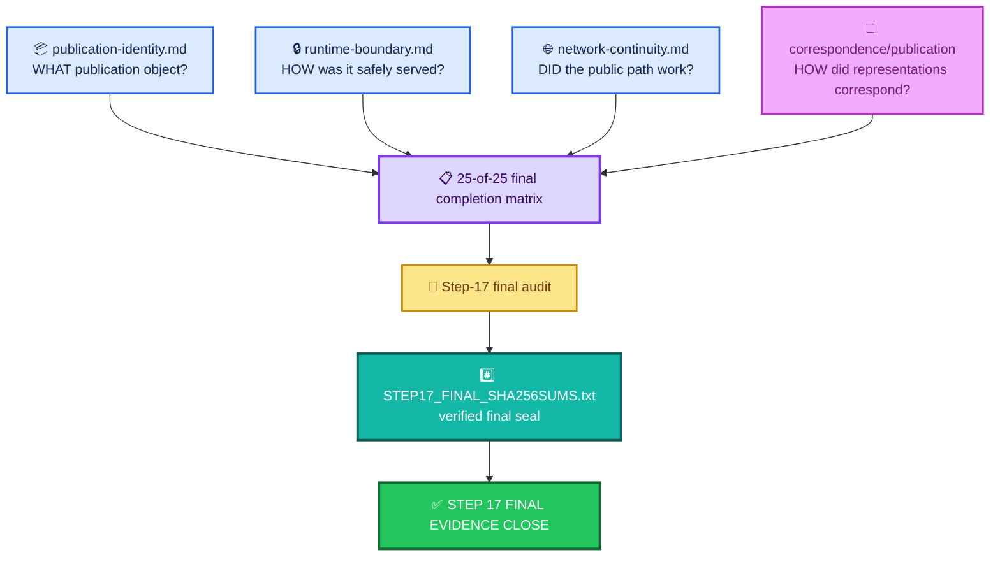
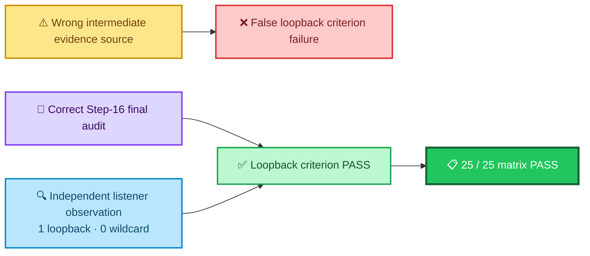
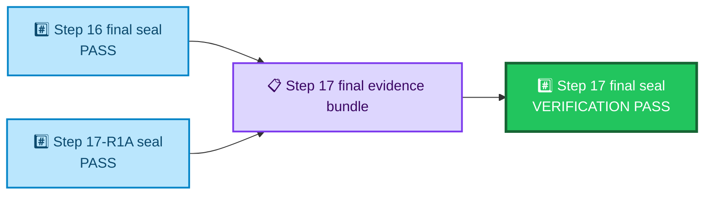
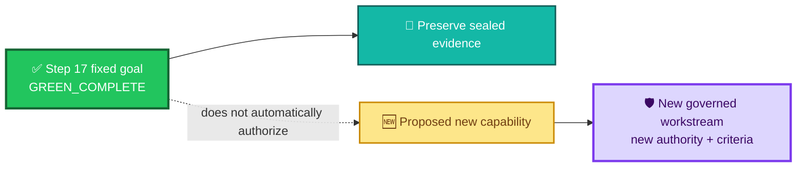
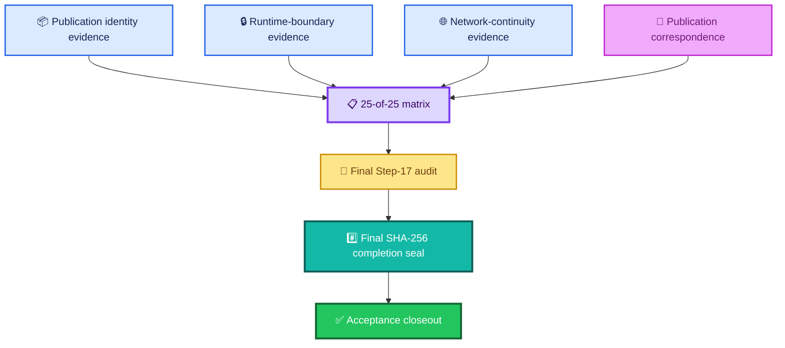

<div align="center">

# ALLIS — Step 17 Final Evidence Close

### Final evidence/seal record for the governed live publication endpoint and Evidence & Governance Portal

<br>


<br>

**Kidd’s Technical Services · ALLIS**

</div>

---

> [!IMPORTANT]
> This document is the **evidence-side final close record** for Step 17.
>
> It identifies the completed fixed goal, the final 25-of-25 evidence matrix, the final publication and frontend identities, the recovered public-network observation, the final evidence seal, predecessor-seal continuity, final nonmutation state, and the boundary on successor authority.
>
> It is not a replacement for the acceptance closeout. It records **what evidence package was sealed**.

---

# 👀 Final Step-17 evidence state

```text
STEP17_STATUS=GREEN_ALLIS_LIVE_PUBLICATION_ENDPOINT_COMPLETE

STEPS_0_THROUGH_17_GREEN=YES
OVERALL_GOAL_COMPLETE=YES

ALL_STEPS_0_THROUGH_17=GREEN
FINAL_CRITERIA=25_OF_25_PASS
FINAL_NETWORK_CONTINUITY=GREEN

OVERALL_GOAL=GREEN_COMPLETE

ALLIS_LIVE_PUBLICATION_ENDPOINT=COMPLETE
ALLIS_EVIDENCE_GOVERNANCE_PORTAL=LIVE
```

Final identities:

```text
FINAL_PUBLICATION_ID=
allis-publication-step6-retention-v2

FINAL_PUBLICATION_SHA256=
d6ab63522f9080fae440578ebbb6ed42140595155c9a30253f5b8eeeef8009b7

FINAL_FRONTEND_BUILD=
5By6R3CWTM7NDXc-4lmSi
```

Final seal:

```text
STEP17_FINAL_MANIFEST_CREATED=PASS
STEP17_FINAL_MANIFEST_VERIFICATION=PASS
```

Predecessor-seal continuity:

```text
STEP16_FINAL_SEAL_AFTER_COMPLETION=PASS
STEP17_R1A_SEAL_AFTER_COMPLETION=PASS
```

---

# 🎯 Fixed goal

The Step-17 fixed goal was:

> **Create and prove a governed, read-only, versioned live ALLIS publication endpoint at `https://allis.pro/api/publication/latest`, consumed by the ALLIS Evidence & Governance Portal without granting the GUI unrestricted direct access to ALLIS.**

The final evidence close establishes that this **fixed goal** reached its terminal green state.

This does not mean every future ALLIS capability is complete.

---

# 🧩 Why this file exists

The repository now separates four different publication concerns.

```text
acceptance/closeout/publication-step17-close.md
    =
What bounded conclusion was accepted?

correspondence/publication/
source-to-publication-to-http-to-gui.md
    =
Which representations were shown to correspond?

evidence/publication/
publication-identity.md
runtime-boundary.md
network-continuity.md
    =
What evidence supports the individual publication claims?

evidence/publication/
step17-final-close.md
    =
What final evidence bundle sealed the Step-17 result?
```

This file closes the **evidence package**.

It does not duplicate every detail from the three specialized evidence records.

---

# 🧭 Final evidence geometry



---

# ✅ Final completion matrix

The repaired final completion matrix contains:

```text
FINAL_CRITERION_COUNT=25
FINAL_CRITERION_PASS_COUNT=25
FINAL_CRITERION_FAILURE_COUNT=0

FINAL_FIXED_GOAL_COMPLETION_MATRIX=PASS
REPAIRED_FINAL_COMPLETION_MATRIX=PASS
```

The matrix passed only after the loopback criterion was bound to the correct evidence authority.

---

# 📋 The 25 final criteria

The final matrix records all 25 criteria as `PASS`.

| # | Final criterion | Result |
|---:|---|---|
| 1 | Public GET endpoint works | ✅ `PASS` |
| 2 | Publication validates against frozen contract | ✅ `PASS` |
| 3 | Claim/evidence/authority references resolve | ✅ `PASS` |
| 4 | Source state identifiable | ✅ `PASS` |
| 5 | Publication authority identifiable | ✅ `PASS` |
| 6 | Integrity hash present | ✅ `PASS` |
| 7 | Immutable publication ID present | ✅ `PASS` |
| 8 | Prior publications retained | ✅ `PASS` |
| 9 | Explicit privacy and eligibility governance | ✅ `PASS` |
| 10 | Unknown or missing publication fails closed | ✅ `PASS` |
| 11 | GUI fails closed without fixture | ✅ `PASS` |
| 12 | No public mutation endpoint | ✅ `PASS` |
| 13 | Publication service cannot mutate ALLIS | ✅ `PASS` |
| 14 | Publication store read-only and unchanged | ✅ `PASS` |
| 15 | Caddy routing authorized and tested | ✅ `PASS` |
| 16 | GUI consumes live publication endpoint | ✅ `PASS` |
| 17 | GUI has no unrestricted direct ALLIS access | ✅ `PASS` |
| 18 | GUI preserves epistemic states | ✅ `PASS` |
| 19 | Restart persistence proven | ✅ `PASS` |
| 20 | Rollback documented and demonstrated | ✅ `PASS` |
| 21 | Source → publication → HTTP → GUI correspondence | ✅ `PASS` |
| 22 | Publication runtime isolation proven | ✅ `PASS` |
| 23 | Loopback-only publication service | ✅ `PASS` |
| 24 | Sealed Landlock runtime provenance | ✅ `PASS` |
| 25 | No unauthorized infrastructure change observed | ✅ `PASS` |

---

# 🧠 The matrix is bounded

A 25-of-25 result means:

```text
all 25 fixed-goal Step-17 completion criteria passed
```

It does not mean:

```text
every possible ALLIS claim passed
```

It does not mean:

```text
all future publication versions are automatically qualified
```

It does not mean:

```text
whole-system safety theorem proven
```

The matrix closes the **Step-17 fixed-goal domain**.

---

# 🛠️ The loopback evidence-source repair

Before final close, the fixed-goal matrix encountered a false failure on the loopback-only criterion.

The cause was not a production listener defect.

The cause was that the completion harness read the criterion from an intermediate evidence source that did not contain the controlling field.

The final repair established:

```text
LOOPBACK_CRITERION_CORRECT_AUTHORITY=
build/step16/r1b/step16-final-audit.json

LOOPBACK_CRITERION_RESOLVED=PASS
LOOPBACK_EVIDENCE_SOURCE_REPAIR=PASS
```

with sealed listener evidence:

```text
STEP16_RECORDED_LOOPBACK_LISTENER_COUNT=1
STEP16_RECORDED_WILDCARD_LISTENER_COUNT=0

SEALED_LOOPBACK_LISTENER_COUNT=1
SEALED_WILDCARD_LISTENER_COUNT=0

SEALED_LOOPBACK_ONLY_EVIDENCE=PASS
```

---

# 🧾 Why the repair matters to the final close

The final matrix became legitimate only after the criterion was bound to the correct evidence authority.



The repair changed the evidence binding.

It did not require changing production.

---

# 📦 Final publication identity

The final publication object is:

```text
allis-publication-step6-retention-v2
```

with publication body SHA-256:

```text
d6ab63522f9080fae440578ebbb6ed42140595155c9a30253f5b8eeeef8009b7
```

The final public continuity observation also recorded payload SHA-256:

```text
04ebb5bc1f97cbf56b8722fea9bcc7e7303cac2f5b467510d7a821d84d4a3c3c
```

These identities are documented in detail in:

```text
evidence/publication/publication-identity.md
```

---

# 🔎 Final frontend identity

The final frontend build is:

```text
5By6R3CWTM7NDXc-4lmSi
```

The frontend identity is separate from the publication identity.

```text
frontend build
    ≠
publication ID
```

The Step-17 correspondence package records the relationship between them.

---

# 🔒 Final runtime boundary

The final runtime evidence includes:

```text
PUBLICATION_SERVICE_ISOLATION=GREEN
PUBLICATION_SERVICE_LOOPBACK_ONLY=GREEN
STRICT_READ_ONLY_PUBLICATION_BOUNDARY=GREEN
NO_PUBLIC_MUTATION_ENDPOINT=GREEN
CADDY_AUTHORIZED_ROUTING=GREEN
GUI_NO_DIRECT_ALLIS_ACCESS=GREEN
```

The 25-condition matrix independently includes:

```text
PUBLICATION_SERVICE_CANNOT_MUTATE_ALLIS=PASS
PUBLICATION_STORE_READ_ONLY_AND_UNCHANGED=PASS
PUBLICATION_RUNTIME_ISOLATION_PROVEN=PASS
LOOPBACK_ONLY_PUBLICATION_SERVICE=PASS
SEALED_LANDLOCK_RUNTIME_PROVENANCE=PASS
```

The detailed evidence belongs in:

```text
evidence/publication/runtime-boundary.md
```

---

# 🌐 Final network continuity

The final recovery observation established:

```text
DNS_RC=0

PUBLICATION_CURL_RC=0
PUBLICATION_STATUS=200

GUI_CURL_RC=0
GUI_STATUS=200

PUBLIC_CONTINUITY_ATTEMPT_RESULT=PASS

PUBLIC_CONTINUITY_RECOVERED=YES
SUCCESSFUL_PUBLIC_CONTINUITY_ATTEMPT=1
PUBLIC_NETWORK_CONTINUITY=PASS
```

Final aggregate:

```text
FINAL_NETWORK_CONTINUITY=GREEN
```

---

# ⚠️ Prior DNS timeout remains part of the evidence

Before final recovery, a public `/evidence` request encountered:

```text
curl: (28) Resolving timed out after 5000 milliseconds
```

That observation was not erased.

The final adjudication is:

```text
NETWORK_FAILURE_CLASSIFICATION=
TRANSIENT_EXTERNAL_NAME_RESOLUTION_FAILURE_RECOVERED

NETWORK_CONTINUITY_RECOVERY=PASS

PRODUCTION_REPAIR_REQUIRED=NO

TRANSIENT_DNS_ADJUDICATION=PASS
```

The detailed chronology belongs in:

```text
evidence/publication/network-continuity.md
```

---

# 🔗 Final direct/public body correspondence

The final direct and public bodies were independently hashed:

```text
FINAL_DIRECT_SHA256=
d6ab63522f9080fae440578ebbb6ed42140595155c9a30253f5b8eeeef8009b7

FINAL_PUBLIC_SHA256=
d6ab63522f9080fae440578ebbb6ed42140595155c9a30253f5b8eeeef8009b7
```

Final result:

```text
FINAL_DIRECT_PUBLIC_BODY_CORRESPONDENCE=PASS
```

This is part of the final evidence close because public continuity alone would not have been enough if the public route returned the wrong publication body.

---

# 🔗 Final publication correspondence

The aggregate final state records:

```text
SOURCE_TO_PUBLICATION_TO_HTTP_TO_GUI=GREEN
```

This means the final evidence package supported the bounded correspondence chain:

```text
qualified controlled state
    ↓
governed publication
    ↓
direct publication service
    ↓
public HTTPS publication
    ↓
Evidence & Governance Portal
```

The detailed edge-by-edge correspondence belongs in:

```text
correspondence/publication/source-to-publication-to-http-to-gui.md
```

---

# 🧭 Final green domains

The final Step-17 output records these domains as green:

```text
PUBLIC_GET_ENDPOINT=GREEN
FROZEN_SCHEMA_VALIDATION=GREEN
REFERENCE_RESOLUTION=GREEN
SOURCE_AND_AUTHORITY_PROVENANCE=GREEN
PUBLICATION_INTEGRITY_AND_IDENTITY=GREEN
IMMUTABLE_PUBLICATION_RETENTION=GREEN
PRIVACY_AND_ELIGIBILITY_GOVERNANCE=GREEN
FAIL_CLOSED_BEHAVIOR=GREEN
STRICT_READ_ONLY_PUBLICATION_BOUNDARY=GREEN
NO_PUBLIC_MUTATION_ENDPOINT=GREEN
PUBLICATION_SERVICE_ISOLATION=GREEN
PUBLICATION_SERVICE_LOOPBACK_ONLY=GREEN
CADDY_AUTHORIZED_ROUTING=GREEN
GUI_LIVE_ENDPOINT_CONSUMPTION=GREEN
GUI_NO_DIRECT_ALLIS_ACCESS=GREEN
GUI_EPISTEMIC_STATE_PRESERVATION=GREEN
RESTART_PERSISTENCE=GREEN
ROLLBACK_DEMONSTRATION=GREEN
SOURCE_TO_PUBLICATION_TO_HTTP_TO_GUI=GREEN
AUTHORIZED_INFRASTRUCTURE_CONTINUITY=GREEN
```

These are the final aggregate domains for the fixed Step-17 goal.

---

# 📊 Final evidence dashboard

| Domain | Final state |
|---|---|
| Public GET endpoint | 🟢 `GREEN` |
| Frozen schema validation | 🟢 `GREEN` |
| Reference resolution | 🟢 `GREEN` |
| Source + authority provenance | 🟢 `GREEN` |
| Publication integrity + identity | 🟢 `GREEN` |
| Immutable publication retention | 🟢 `GREEN` |
| Privacy + eligibility governance | 🟢 `GREEN` |
| Fail-closed behavior | 🟢 `GREEN` |
| Strict read-only publication boundary | 🟢 `GREEN` |
| No public mutation endpoint | 🟢 `GREEN` |
| Publication service isolation | 🟢 `GREEN` |
| Loopback-only publication service | 🟢 `GREEN` |
| Caddy authorized routing | 🟢 `GREEN` |
| GUI live-endpoint consumption | 🟢 `GREEN` |
| GUI no direct ALLIS access | 🟢 `GREEN` |
| GUI epistemic-state preservation | 🟢 `GREEN` |
| Restart persistence | 🟢 `GREEN` |
| Rollback demonstration | 🟢 `GREEN` |
| Source → publication → HTTP → GUI | 🟢 `GREEN` |
| Authorized infrastructure continuity | 🟢 `GREEN` |
| Final network continuity | 🟢 `GREEN` |
| Fixed goal | 🟢 `GREEN_COMPLETE` |

---

# #️⃣ Final evidence seal

The final close created:

```text
docs/publication/STEP17_FINAL_SHA256SUMS.txt
```

and then verified it.

Final state:

```text
STEP17_FINAL_MANIFEST_CREATED=PASS
STEP17_FINAL_MANIFEST_VERIFICATION=PASS
```

The seal is important because it turns the final close from:

```text
a collection of successful-looking files
```

into:

```text
a verified evidence bundle with explicit object membership
```

---

# 📚 Objects included in the final completion seal

The final seal included:

```text
docs/publication/STEP17_R1A_SHA256SUMS.txt

docs/publication/STEP16_FINAL_SHA256SUMS.txt

build/step17/r2/final-fixed-goal-criteria.json

build/step17/r2/final-browser-dom.html

build/step17/r2/final-browser-visible-text.txt

build/step17/r2/final-browser.log

build/step17/r2r1/loopback-evidence-source-repair.json

build/step17/r2r1/final-fixed-goal-criteria-r1.json

build/step17/r2r2/network-continuity-attempts.txt

build/step17/r2r2/network-continuity-adjudication.json

build/step17/r2r2/final-direct-publication.json

build/step17/r2r2/final-public-publication.json

build/step17/r2r2/final-publication.headers

build/step17/r2r2/step17-final-audit.json

docs/publication/STEP17_FINAL_COMPLETION.md
```

The final SHA-256 verification reported each of these as `OK`.

---

# 🧾 Why the seal includes predecessor evidence

The final Step-17 seal includes predecessor-seal artifacts:

```text
STEP17_R1A_SHA256SUMS.txt
STEP16_FINAL_SHA256SUMS.txt
```

This creates evidence continuity across the bounded predecessor states.

The final re-verification recorded:

```text
STEP16_FINAL_SEAL_AFTER_COMPLETION=PASS
STEP17_R1A_SEAL_AFTER_COMPLETION=PASS
```

So the Step-17 final close did not silently replace its predecessor evidence.

---

# 🔗 Seal continuity



This is seal continuity, not a claim that every predecessor object has the same scope.

---

# 🧾 Final audit

The final audit state is:

```text
STEP17_FINAL_AUDIT=PASS
```

The final audit incorporates:

- the 25-of-25 fixed-goal matrix;
- final network continuity adjudication;
- final publication identity;
- final direct/public correspondence;
- final runtime state;
- final fixed-goal result.

It is one of the authoritative final closeout artifacts.

---

# 📌 Authoritative final closeout artifacts

The final engineering record identifies these as the primary final closeout artifacts:

```text
docs/publication/STEP17_FINAL_COMPLETION.md

docs/publication/STEP17_FINAL_SHA256SUMS.txt

build/step17/r2r2/step17-final-audit.json

build/step17/r2r1/final-fixed-goal-criteria-r1.json
```

This public evidence record should point to those objects conceptually without pretending the GitHub documentation is the engineering seal itself.

---

# 🧱 Public evidence record vs engineering seal

This Markdown file is a **public documentation projection**.

It is not:

```text
STEP17_FINAL_SHA256SUMS.txt
```

It is not:

```text
step17-final-audit.json
```

It is not:

```text
the final-fixed-goal criteria object
```

Those remain the evidence-bearing engineering artifacts.

This file explains what they establish.

---

# 🚫 Final nonmutation

The final closeout records:

```text
SUDO_INVOKED=NO

QUALIFIED_SOURCE_MODIFIED=NO

PUBLICATION_CODE_MODIFIED=NO

PUBLICATION_STORE_MODIFIED=NO

PUBLICATION_SERVICE_RESTARTED=NO

FRONTEND_SOURCE_MODIFIED=NO

FRONTEND_RUNTIME_MODIFIED=NO

FRONTEND_RESTARTED=NO

CADDYFILE_MODIFIED=NO

CADDY_RELOADED=NO

CLOUDFLARED_MODIFIED=NO

SYSTEMD_DEFINITION_MODIFIED=NO
```

These values are part of the final evidence close.

---

# 🧭 What final nonmutation means

The nonmutation block means:

> **The final Step-17 verification, network recovery, evidence sealing, and closeout did not require modifying the listed production/source/runtime objects.**

It does not mean:

```text
those objects are permanently immutable
```

It does not mean:

```text
no earlier Step-17 implementation work modified anything
```

It describes the **final closeout operation**.

---

# 🔁 Final network recovery did not mutate production

The final network recovery explicitly ran under:

```text
NO PRODUCTION MUTATION
```

and finished with:

```text
PRODUCTION_REPAIR_REQUIRED=NO
```

So the final seal reflects:

```text
public continuity recovered
+
expected publication remained intact
+
production repair not required
+
final closeout remained non-mutating
```

---

# 🧠 Why this matters

A final green state reached only after unrecorded production changes would be a different evidence story.

Step 17 instead preserved:

```text
existing qualified production state
    ↓
bounded re-observation
    ↓
transient DNS event resolved
    ↓
final continuity confirmed
    ↓
evidence sealed
```

That keeps the closeout evidentiary rather than corrective.

---

# ↩️ Restart and rollback evidence are predecessor demonstrations

The final matrix includes:

```text
FINAL_CRITERION_RESTART_PERSISTENCE_PROVEN=PASS

FINAL_CRITERION_ROLLBACK_DOCUMENTED_AND_DEMONSTRATED=PASS
```

Those demonstrations occurred before the final closeout.

The final nonmutation block then records:

```text
PUBLICATION_SERVICE_RESTARTED=NO
FRONTEND_RESTARTED=NO
```

during final close.

There is no contradiction.

```text
restart/rollback previously demonstrated
    ≠
restart performed during final closeout
```

---

# 🔐 Fixed-goal closure

The final state is:

```text
OVERALL_GOAL=GREEN_COMPLETE
```

with:

```text
ALLIS_LIVE_PUBLICATION_ENDPOINT=COMPLETE

ALLIS_EVIDENCE_GOVERNANCE_PORTAL=LIVE
```

for the bounded fixed goal.

The final engineering record explicitly states that there is **no Step 18 for this fixed goal**.

---

# 🧭 Successor authority boundary

Final output:

```text
FURTHER_IMPLEMENTATION_AUTHORITY=
NONE_REQUIRED_FOR_FIXED_GOAL
```

This wording must be read carefully.

It means:

```text
the fixed goal needs no further implementation step
```

It does **not** mean:

```text
future unrelated capability may proceed without governance
```

The engineering close explicitly treats new capabilities as a **new governed workstream**.

---

# 🚫 No automatic Step 18

The closeout principle is:

```text
fixed goal complete
    ⇒
stop this workstream
```

not:

```text
fixed goal complete
    ⇒
invent another implementation step
```

Examples of capabilities that would require a new governed workstream include:

- new publication contents;
- new claim classes;
- expanded GUI functions;
- write-capable workflows;
- Ms. Allis interaction;
- additional public endpoints;
- altered publication authority;
- altered runtime trust boundaries.

---

# 🔄 Completion does not create future authority



This prevents workstream completion from becoming open-ended implementation authority.

---

# 🧩 Evidence-package responsibilities

The publication evidence package now has four different jobs.

## `publication-identity.md`

Answers:

> **What governed publication object was sealed?**

Core objects:

```text
publication ID
publication SHA
payload SHA
contract validation
identity / retention evidence
```

---

## `runtime-boundary.md`

Answers:

> **How was that publication safely served?**

Core evidence:

```text
read-only store
service isolation
non-root/hardened runtime
loopback-only listener
authorized Caddy route
no public mutation endpoint
GUI no direct ALLIS access
```

---

## `network-continuity.md`

Answers:

> **Did the intended public path work at final observation?**

Core evidence:

```text
DNS recovery
publication HTTP 200
GUI HTTP 200
expected publication identity
direct/public body match
transient DNS adjudication
no production repair
```

---

## `step17-final-close.md`

Answers:

> **What final evidence set was accepted into the Step-17 seal, and what terminal state did that sealed package establish?**

That is the purpose of this file.

---

# 🔗 Evidence package and correspondence

The evidence package answers:

```text
what evidence objects exist?
```

The correspondence package answers:

```text
what relationships among those objects passed?
```

The final close depends on both.

---

# 🔗 Evidence package and acceptance

The acceptance closeout answers:

```text
what bounded conclusion is accepted?
```

This evidence close answers:

```text
what sealed evidence supports that accepted conclusion?
```

This separation keeps the repository auditable.

---

# 🔗 Evidence package and claims

The claims registry should cite these evidence records for bounded Step-17 claims.

A claim can depend on:

```text
publication identity evidence
runtime boundary evidence
network continuity evidence
final Step-17 seal evidence
correspondence evidence
```

depending on its scope.

No one evidence file should be treated as automatic support for every Step-17 claim.

---

# 🧾 Evidence maturity vs workstream closure

A workstream can be closed while individual claims remain scoped.

For Step 17:

```text
fixed-goal workstream = complete
```

and:

```text
publication path criteria = 25 / 25 pass
```

but the repository still preserves:

```text
point-in-time correspondence
bounded runtime scope
fixed publication identity
explicit nonclaims
```

Closure does not erase scope.

---

# ⏱️ Final evidence is time-indexed where appropriate

Some Step-17 objects are durable:

```text
publication identity
sealed evidence files
final audit
final manifest
```

Some observations are temporal:

```text
service active
DNS resolves
public endpoint reachable
GUI reachable
listener state
direct/public correspondence
```

The final seal captures those temporal observations as evidence from the final bounded close.

It does not convert them into eternal guarantees.

---

# 🧱 Object permanence vs observation permanence

```text
immutable publication object
    can remain historically stable
```

while:

```text
network continuity
    can change
```

and:

```text
runtime listener state
    can change
```

and:

```text
frontend build
    can change
```

Therefore the final close preserves both identity and observation boundaries.

---

# 🔄 Revalidation after a claim-bearing change

A future change may require revalidation of one or more evidence domains.

Examples:

```text
new publication
    → new publication identity evidence

new service/runtime boundary
    → new runtime-boundary evidence

new route/network topology
    → new network-continuity evidence

new frontend build/data flow
    → renewed GUI correspondence evidence

new fixed goal
    → new acceptance criteria and final close
```

Do not rewrite the Step-17 final evidence record to make it describe a new workstream.

---

# 🧾 Final evidence authority graph



---

# 📊 Final close matrix

| Close requirement | Final state |
|---|---|
| 25 criteria enumerated | ✅ `25` |
| 25 criteria passed | ✅ `25` |
| Criterion failures | ✅ `0` |
| Loopback evidence-source repair | ✅ `PASS` |
| Local production continuity | ✅ `PASS` |
| Public network continuity | ✅ `PASS` |
| Direct/public body correspondence | ✅ `PASS` |
| Prior DNS failure adjudicated | ✅ `PASS` |
| Production repair required | ✅ `NO` |
| Step-17 final audit | ✅ `PASS` |
| Final manifest created | ✅ `PASS` |
| Final manifest verified | ✅ `PASS` |
| Step-16 predecessor seal retained | ✅ `PASS` |
| Step-17-R1A predecessor seal retained | ✅ `PASS` |
| Final closeout production mutation | ✅ `NO` |
| Overall fixed goal | 🟢 `GREEN_COMPLETE` |

---

# 🚫 Stronger claims not supported

This final evidence close does not support:

```text
all ALLIS workstreams are complete
```

It does not support:

```text
every future publication is qualified
```

It does not support:

```text
network continuity is permanent
```

It does not support:

```text
runtime correspondence is permanent
```

It does not support:

```text
frontend build can never change
```

It does not support:

```text
public read access creates public write authority
```

It does not support:

```text
the publication service may mutate qualified ALLIS
```

It does not support:

```text
the DNS timeout never occurred
```

It does not support:

```text
Step-17 completion authorizes arbitrary new capabilities
```

It does not support:

```text
SYSTEM_PROVEN=YES
```

---

# ⚪ Whole-system boundary

The final Step-17 publication fixed goal is complete.

The controlling repository-wide nonclaims remain:

```text
PRODUCTION_MUTATION_SAFETY_THEOREM_PROVEN=NO

WHOLE_SYSTEM_SAFETY_THEOREM_PROVEN=NO

SYSTEM_PROVEN=NO
```

Step 17 is a strong bounded result.

It is not a whole-system theorem.

---

# ✅ Supported final-close claim

A concise supported claim is:

> **Step 17 closed `GREEN_COMPLETE` for the fixed governed live-publication goal. All 25 final completion criteria passed. The final public-network continuity check recovered successfully without production repair, the direct and public publication bodies matched the sealed publication, the Step-17 final audit passed, the final SHA-256 completion manifest was created and verified, predecessor seals remained valid, and the final closeout did not mutate the listed production/source/runtime objects.**

That statement stays within the sealed Step-17 evidence.

---

# 📦 Normalized final-close record

```yaml
allis_step17_final_evidence_close:

  scope:
    workstream: publication_step17
    evidence_type: final_close
    fixed_goal: governed_read_only_versioned_live_publication_endpoint
    fixed_goal_status: GREEN_COMPLETE

  completion_matrix:
    criterion_count: 25
    pass_count: 25
    failure_count: 0
    final_fixed_goal_completion_matrix: PASS
    repaired_final_completion_matrix: PASS

  final_state:
    step17_status: GREEN_ALLIS_LIVE_PUBLICATION_ENDPOINT_COMPLETE
    steps_0_through_17_green: true
    overall_goal_complete: true
    final_network_continuity: GREEN
    live_publication_endpoint: COMPLETE
    evidence_governance_portal: LIVE

  final_identities:
    publication_id: allis-publication-step6-retention-v2
    publication_sha256: d6ab63522f9080fae440578ebbb6ed42140595155c9a30253f5b8eeeef8009b7
    payload_sha256: 04ebb5bc1f97cbf56b8722fea9bcc7e7303cac2f5b467510d7a821d84d4a3c3c
    frontend_build: 5By6R3CWTM7NDXc-4lmSi

  evidence_repairs:
    loopback_evidence_source_repair: PASS
    loopback_criterion_resolved: PASS
    sealed_loopback_listener_count: 1
    sealed_wildcard_listener_count: 0

  network_close:
    public_continuity_recovered: true
    successful_public_continuity_attempt: 1
    public_network_continuity: PASS
    direct_public_body_correspondence: PASS
    prior_failure_classification: TRANSIENT_EXTERNAL_NAME_RESOLUTION_FAILURE_RECOVERED
    network_continuity_recovery: PASS
    production_repair_required: false
    transient_dns_adjudication: PASS

  seal:
    final_audit: PASS
    final_manifest_created: PASS
    final_manifest_verification: PASS
    step16_final_seal_after_completion: PASS
    step17_r1a_seal_after_completion: PASS

  final_nonmutation:
    sudo_invoked: false
    qualified_source_modified: false
    publication_code_modified: false
    publication_store_modified: false
    publication_service_restarted: false
    frontend_source_modified: false
    frontend_runtime_modified: false
    frontend_restarted: false
    caddyfile_modified: false
    caddy_reloaded: false
    cloudflared_modified: false
    systemd_definition_modified: false

  successor_boundary:
    further_implementation_authority: NONE_REQUIRED_FOR_FIXED_GOAL
    automatic_step18_for_fixed_goal: false
    new_capability_requires_new_governed_workstream: true

  repository_boundary:
    production_mutation_safety_theorem_proven: false
    whole_system_safety_theorem_proven: false
    system_proven: false
```

> [!NOTE]
> This YAML block is a human-readable public normalization. The sealed final audit, criterion matrix, network-continuity adjudication, predecessor seals, completion report, and SHA-256 manifest remain the bounded engineering evidence authority.

---

# 📚 Related repository records

## Publication evidence

- `readme.md` — publication evidence package index
- [`publication-identity.md`](publication-identity.md) — immutable publication identity
- [`runtime-boundary.md`](runtime-boundary.md) — serving runtime and isolation evidence
- [`network-continuity.md`](network-continuity.md) — public network continuity and recovery evidence
- `step17-final-close.md` — **this record**

## Publication correspondence

- [`../../correspondence/publication/source-to-publication-to-http-to-gui.md`](../../correspondence/publication/source-to-publication-to-http-to-gui.md)

## Acceptance

- [`../../acceptance/closeout/publication-step17-close.md`](../../acceptance/closeout/publication-step17-close.md)
- [`../../acceptance/current-system-manifest.md`](../../acceptance/current-system-manifest.md)
- [`../../acceptance/baseline-object-registry.md`](../../acceptance/baseline-object-registry.md)

## Architecture

- [`../../architecture/authority-planes.md`](../../architecture/authority-planes.md)
- [`../../architecture/fail-closed-semantics.md`](../../architecture/fail-closed-semantics.md)

## Claims

- [`../../claims/claim-registry.md`](../../claims/claim-registry.md)
- [`../../claims/nonclaims-and-residuals.md`](../../claims/nonclaims-and-residuals.md)

---

# 🧾 Final evidence-close summary

<div align="center">

### 📋 FINAL COMPLETION MATRIX

# `25 / 25 PASS`

**0 failures**

↓

### 📦 FINAL PUBLICATION

`allis-publication-step6-retention-v2`

`d6ab63522f9080fae440578ebbb6ed42140595155c9a30253f5b8eeeef8009b7`

↓

### 🌐 FINAL NETWORK CONTINUITY

# `GREEN`

**DNS recovered**

**publication HTTP 200**

**GUI HTTP 200**

**direct/public body PASS**

↓

### 🧾 FINAL AUDIT

# `PASS`

↓

### #️⃣ FINAL SHA-256 COMPLETION SEAL

# `VERIFICATION PASS`

↓

### 🔗 PREDECESSOR SEALS

**Step 16 PASS**

**Step 17-R1A PASS**

↓

### 🚫 FINAL CLOSEOUT MUTATION

# `NONE`

↓

### ✅ FIXED GOAL

# `GREEN_COMPLETE`

<br>

# **NO STEP 18 FOR THIS FIXED GOAL**

### New capability

**new governed workstream**

<br>

# `SYSTEM_PROVEN=NO`

</div>

---

# Governing final-close principles

> **A final evidence close must identify exactly what was sealed.**

> **A 25-of-25 matrix closes the fixed Step-17 criteria, not every possible ALLIS claim.**

> **The loopback criterion passed only after its evidence source was bound to the correct authority.**

> **The final DNS recovery preserved the earlier timeout as historical evidence rather than erasing it.**

> **Public continuity had to return the expected governed publication, not merely any HTTP 200 response.**

> **The final publication body remained identical between direct and public serving paths.**

> **The final SHA-256 manifest binds the final evidence bundle and verifies its members.**

> **Predecessor-seal verification preserves evidence continuity without collapsing predecessor scopes.**

> **The final closeout verified production without mutating the listed production/source/runtime objects.**

> **Restart and rollback were demonstrated before final close; they were not repeated during the final nonmutating seal.**

> **Completion of the fixed goal means preserve the evidence, not invent another implementation step.**

> **A new capability requires a new governed workstream with its own authority and acceptance criteria.**

> **A green Step-17 publication close remains a bounded evidence result, not a whole-system theorem.**
