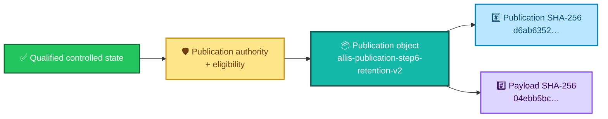
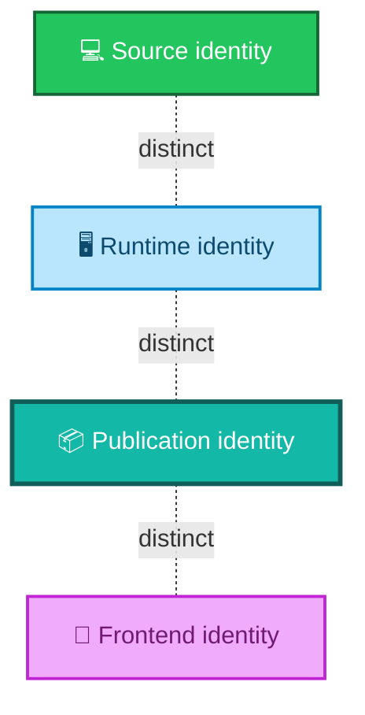
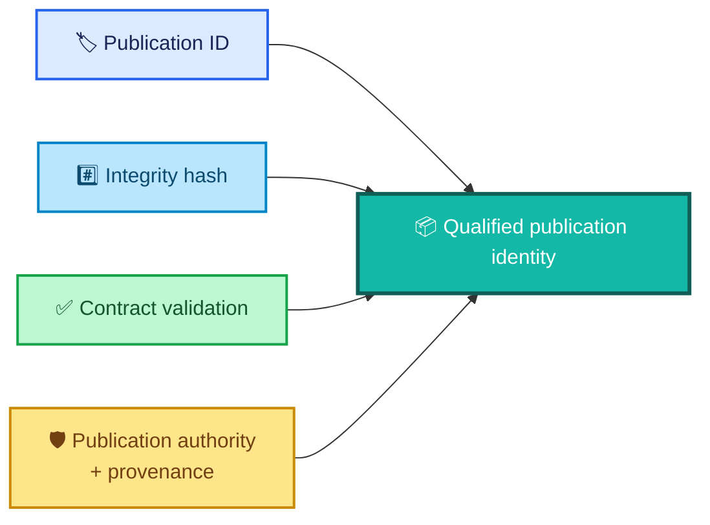
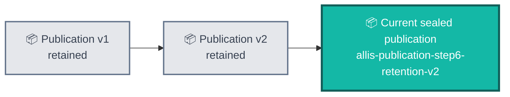
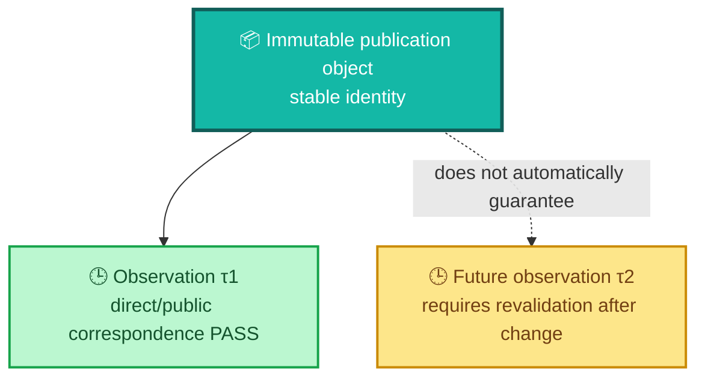
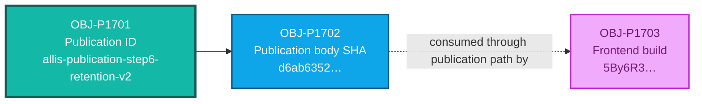

<div align="center">

# ALLIS — Publication Identity

### Evidence record for the immutable Step-17 governed publication object

<br>


<br>

**Kidd’s Technical Services · ALLIS**

</div>

---

> [!IMPORTANT]
> This document identifies the **governed publication object** sealed by the Step-17 publication workstream.
>
> It records the publication ID, integrity identities, validation status, retention properties, authority/provenance requirements, and the boundaries on what that identity means.
>
> A publication identity is not a source-code identity, runtime identity, frontend identity, or whole-system identity.

---

# 👀 Publication identity at a glance

```text
Publication ID:
allis-publication-step6-retention-v2

Publication SHA-256:
d6ab63522f9080fae440578ebbb6ed42140595155c9a30253f5b8eeeef8009b7

Publication payload SHA-256:
04ebb5bc1f97cbf56b8722fea9bcc7e7303cac2f5b467510d7a821d84d4a3c3c

Step-17 final state:
GREEN_COMPLETE

Publication endpoint state:
COMPLETE

Evidence & Governance Portal state:
LIVE at final observation
```

The publication object passed the final Step-17 criteria for:

```text
publication validation against the frozen contract
publication authority identification
source-state identification
integrity hash presence
immutable publication ID presence
prior-publication retention
claim/evidence/authority reference resolution
privacy and eligibility governance
```

---

# 🎯 Purpose

`evidence/publication/publication-identity.md` answers one narrow question:

> **What exact governed publication object was sealed and recognized as the final Step-17 publication identity?**

It does not answer:

> How was the publication service isolated?

That belongs in:

```text
evidence/publication/runtime-boundary.md
```

It does not answer:

> Was the public network path available at the final observation?

That belongs in:

```text
evidence/publication/network-continuity.md
```

It does not answer:

> Which objects corresponded from source/state through publication, HTTP, and GUI?

That belongs in:

```text
correspondence/publication/source-to-publication-to-http-to-gui.md
```

It does not answer:

> Did the Step-17 workstream formally close?

That belongs in:

```text
acceptance/closeout/publication-step17-close.md
```

This file is specifically the **identity evidence record**.

---

# 🧩 The publication object has its own identity

ALLIS treats the public projection as its own governed object.



The identity exists **after** governed publication construction.

It is not a nickname for the internal source state.

---

# 🏷️ Canonical publication identity

## Publication ID

```text
allis-publication-step6-retention-v2
```

The Step-17 final completion state explicitly records:

```text
FINAL_PUBLICATION_ID=
allis-publication-step6-retention-v2
```

The final public continuity observation also returned:

```text
PUBLICATION_ID=
allis-publication-step6-retention-v2
```

That provides two useful roles:

```text
sealed expected identity
```

and:

```text
observed public identity
```

The publication ID is therefore an evidence-bearing object identifier, not merely display text.

---

# #️⃣ Publication body SHA-256

The canonical publication-body integrity identity is:

```text
d6ab63522f9080fae440578ebbb6ed42140595155c9a30253f5b8eeeef8009b7
```

The final close records:

```text
FINAL_PUBLICATION_SHA256=
d6ab63522f9080fae440578ebbb6ed42140595155c9a30253f5b8eeeef8009b7
```

The final direct local publication response also produced:

```text
DIRECT_PUBLICATION_SHA256=
d6ab63522f9080fae440578ebbb6ed42140595155c9a30253f5b8eeeef8009b7
```

The final public HTTPS response produced:

```text
PUBLICATION_SHA256=
d6ab63522f9080fae440578ebbb6ed42140595155c9a30253f5b8eeeef8009b7
```

And final direct/public body correspondence established:

```text
FINAL_DIRECT_SHA256=
d6ab63522f9080fae440578ebbb6ed42140595155c9a30253f5b8eeeef8009b7

FINAL_PUBLIC_SHA256=
d6ab63522f9080fae440578ebbb6ed42140595155c9a30253f5b8eeeef8009b7

FINAL_DIRECT_PUBLIC_BODY_CORRESPONDENCE=PASS
```

---

# #️⃣ Publication payload SHA-256

The final public continuity evidence separately recorded:

```text
PUBLICATION_PAYLOAD_SHA256=
04ebb5bc1f97cbf56b8722fea9bcc7e7303cac2f5b467510d7a821d84d4a3c3c
```

This is intentionally preserved separately from the publication-body SHA.

```text
publication body identity
    ≠
payload identity
```

The two hashes represent different integrity surfaces.

They should not be silently substituted for one another.

---

# 🧭 Identity tuple

A practical normalized publication identity is:

```text
PublicationIdentity =
    publication_id
  + publication_sha256
  + payload_sha256
  + frozen_contract_validation
  + authority/provenance resolution
  + immutable-retention state
```

For the final Step-17 object:

```yaml
publication_id: allis-publication-step6-retention-v2
publication_sha256: d6ab63522f9080fae440578ebbb6ed42140595155c9a30253f5b8eeeef8009b7
payload_sha256: 04ebb5bc1f97cbf56b8722fea9bcc7e7303cac2f5b467510d7a821d84d4a3c3c
frozen_contract_validation: PASS
publication_authority_identifiable: PASS
source_state_identifiable: PASS
immutable_publication_id_present: PASS
prior_publications_retained: PASS
```

This tuple identifies the bounded publication evidence more precisely than a URL alone.

---

# 🌐 A URL is not the publication identity

The final public endpoint is:

```text
https://allis.pro/api/publication/latest
```

But:

```text
URL
    ≠
publication identity
```

The route can remain stable while the governed publication changes.

Likewise:

```text
publication identity
    ≠
route identity
```

The publication ID and hashes identify the object.

The endpoint identifies where the current governed publication was exposed at the final observation.

---

# 🔎 The GUI is not the publication identity

The final frontend build was:

```text
5By6R3CWTM7NDXc-4lmSi
```

That build consumed the governed publication.

It is not the publication.

```text
frontend build
    ≠
publication ID
```

```text
frontend build
    ≠
publication-body SHA
```

The two objects corresponded within the Step-17 publication chain, but they retain separate identities.

---

# 💻 Source identity is not publication identity

The current ALLIS record contains several role-specific source identities.

Examples include:

```text
Workstream-F qualified baseline
65b9f7dbd594ec9d225152aabd705eefc9216dbb

A5 proof/source anchor
35f1aa5586e1a23e1ab88f4d757c451b44506893

Step-12 production DGM source
20c8cbe175781c8a1c05d65c03977859ceca884a
```

None of those values should be relabeled as:

```text
publication identity
```

Likewise:

```text
d6ab6352…
```

must not be presented as:

```text
whole ALLIS source commit
```

The publication is a governed outward projection with its own object identity.

---

# 🧱 Why separate publication identity matters

Without a distinct publication object, a public endpoint can accidentally blur several different claims:

```text
this is the source
this is the runtime
this is the publication
this is what the GUI shows
```

ALLIS does not collapse those layers.



A reviewer should be able to ask:

```text
Which source object?
Which runtime?
Which publication?
Which frontend build?
```

and receive four separate answers where appropriate.

---

# ✅ Frozen-contract validation

The final Step-17 completion matrix records:

```text
FINAL_CRITERION_PUBLICATION_VALIDATES_AGAINST_FROZEN_CONTRACT=PASS
```

The aggregate final state also records:

```text
FROZEN_SCHEMA_VALIDATION=GREEN
```

That means the publication identity is not established by hashing arbitrary bytes alone.

The object also passed the bounded publication contract/schema validation required by Step 17.

---

# 🧾 Reference resolution

The final Step-17 completion matrix records:

```text
FINAL_CRITERION_CLAIM_EVIDENCE_AUTHORITY_REFERENCES_RESOLVE=PASS
```

and the aggregate final state records:

```text
REFERENCE_RESOLUTION=GREEN
```

This is important because a publication can be structurally valid while still containing broken or unresolvable evidence/authority references.

The final identity record therefore includes:

```text
publication bytes
+
publication structure
+
resolvable claim/evidence/authority references
```

within the fixed Step-17 scope.

---

# 🛡️ Publication authority is identifiable

The final completion matrix records:

```text
FINAL_CRITERION_PUBLICATION_AUTHORITY_IDENTIFIABLE=PASS
```

and:

```text
FINAL_CRITERION_SOURCE_STATE_IDENTIFIABLE=PASS
```

The aggregate final state records:

```text
SOURCE_AND_AUTHORITY_PROVENANCE=GREEN
```

This means the publication object was not treated as authoritative merely because it existed.

Its bounded provenance and publication authority were required to be identifiable.

---

# 🧾 Identity is not authority

Even with a valid publication ID and valid hash:

```text
identity valid
    ≠
publication authorized
```

The Step-17 identity result depends on the surrounding governance state.



No one factor silently replaces the others.

---

# 🔒 Immutable publication identity

The final completion matrix records:

```text
FINAL_CRITERION_IMMUTABLE_PUBLICATION_ID_PRESENT=PASS
```

and aggregate state:

```text
PUBLICATION_INTEGRITY_AND_IDENTITY=GREEN
```

The purpose of an immutable publication ID is to prevent a publication label from silently changing meaning after the fact.

Conceptually:

```text
publication ID P
    ↓
binds to a specific governed publication state
```

rather than:

```text
publication ID P
    ↓
mutable container whose meaning can drift invisibly
```

---

# 📚 Prior-publication retention

The final completion matrix records:

```text
FINAL_CRITERION_PRIOR_PUBLICATIONS_RETAINED=PASS
```

The aggregate final state records:

```text
IMMUTABLE_PUBLICATION_RETENTION=GREEN
```

That allows new publication states to be added without rewriting the historical identity of earlier publication objects.



The point is historical preservation, not a claim that every prior publication has the same content.

---

# 🧱 Retention is not mutability

A retained prior publication means:

```text
historical object remains addressable / preserved
```

It does not mean:

```text
old publication is current
```

Likewise:

```text
new publication exists
    ≠
old publication was overwritten
```

The Step-17 retention property supports publication history without chronology becoming authority.

---

# 🔄 “Latest” is a route role, not an immutable object name

The public route used:

```text
/api/publication/latest
```

The word `latest` describes the endpoint’s selection role.

It is not the immutable publication ID.

The immutable object identity remains:

```text
allis-publication-step6-retention-v2
```

This distinction matters:

```text
latest route
    → selects current governed publication
```

while:

```text
immutable publication ID
    → identifies a specific publication object
```

---

# 🔐 Privacy and publication eligibility

The final Step-17 completion matrix records:

```text
FINAL_CRITERION_EXPLICIT_PRIVACY_AND_ELIGIBILITY_GOVERNANCE=PASS
```

The aggregate state records:

```text
PRIVACY_AND_ELIGIBILITY_GOVERNANCE=GREEN
```

Therefore the publication object should be understood as:

```text
eligible governed projection
```

not:

```text
raw internal state dump
```

This is the outward-publication boundary described by the architecture layer.

---

# 📦 Publication is a projection

A governed publication can preserve:

- claims;
- evidence links;
- authority references;
- validation states;
- provenance;
- explicit uncertainty;
- safe public metadata;

without exposing every internal system state.


Because projection is governed, publication identity cannot be inferred directly from the hash of an unrelated internal source object.

---

# 🧪 Unknown or missing publication fails closed

The Step-17 completion matrix records:

```text
FINAL_CRITERION_UNKNOWN_OR_MISSING_PUBLICATION_FAILS_CLOSED=PASS
```

That protects publication identity from ambiguous lookup behavior.

Conceptually:

```text
requested publication unknown
    ⇒
do not substitute arbitrary publication
```

and:

```text
expected publication missing
    ⇒
do not silently fabricate success
```

The publication identity therefore participates in fail-closed retrieval semantics.

---

# 📬 Publication identity and HTTP observation

The final public continuity observation returned:

```text
PUBLICATION_CURL_RC=0
PUBLICATION_STATUS=200
PUBLICATION_ID=allis-publication-step6-retention-v2
PUBLICATION_SHA256=d6ab63522f9080fae440578ebbb6ed42140595155c9a30253f5b8eeeef8009b7
PUBLICATION_PAYLOAD_SHA256=04ebb5bc1f97cbf56b8722fea9bcc7e7303cac2f5b467510d7a821d84d4a3c3c
```

The recovery harness required the observed public identity values to equal the expected values before declaring the public continuity attempt successful.

That is runtime/public evidence for the publication identity.

---

# 🔗 Direct/public identity correspondence

At final observation:

```text
DIRECT BODY SHA
=
PUBLIC BODY SHA
=
SEALED PUBLICATION SHA
```

The final result was:

```text
FINAL_DIRECT_PUBLIC_BODY_CORRESPONDENCE=PASS
```

This belongs primarily to the publication correspondence package, but it is important supporting evidence for the identity record because it demonstrates that the public route returned the sealed publication object rather than a different body.

---

# 🕒 Publication identity is durable; correspondence is temporal

The immutable publication object can remain historically identifiable.

The observation that a particular endpoint served it is time-specific.

```text
publication identity
    can remain stable
```

while:

```text
route/runtime correspondence
    must be re-observed after claim-bearing change
```



This avoids confusing object immutability with permanent infrastructure correspondence.

---

# 🔄 When a new publication gets a new identity

A materially new governed publication should not silently reuse the old immutable identity as though the object had not changed.

Claim-bearing changes can include:

- publication content;
- claim set;
- evidence references;
- authority references;
- publication schema;
- eligibility result;
- provenance;
- integrity-relevant metadata;
- public projection fields.

The exact versioning rule belongs to the publication implementation/governance contract.

The architecture rule is simpler:

> **A changed immutable publication object must not masquerade as the unchanged prior object.**

---

# 🔄 What may remain stable across publication versions

Some infrastructure can remain unchanged while publication identity changes.

Examples:

```text
same public route
same publication service
same frontend route
same general schema family
```

can coexist with:

```text
new governed publication object
new immutable publication ID
new body hash
new payload hash
```

That distinction supports durable infrastructure and immutable evidence at the same time.

---

# 🧾 Publication identity and source provenance

The final criteria require both:

```text
source state identifiable
```

and:

```text
publication authority identifiable
```

But this document intentionally does not invent one universal source commit for Step 17.

Instead:

```text
publication object
    has traceable governed provenance
```

without falsely stating:

```text
publication object
    equals one universal ALLIS source baseline
```

That keeps the publication evidence consistent with the composite current-system manifest.

---

# 🧠 Publication identity and epistemic states

The Step-17 final matrix also records:

```text
FINAL_CRITERION_GUI_PRESERVES_EPISTEMIC_STATES=PASS
```

This matters because publication integrity is not only about transport bytes.

A public evidence system must not silently erase distinctions among states such as:

```text
observed
demonstrated
proven
disproven
unresolved
outside audited scope
```

The publication identity belongs to a governed evidence object whose downstream presentation preserves those distinctions.

The detailed GUI behavior belongs in the correspondence/runtime evidence rather than this identity record.

---

# 🛡️ Publication identity and mutation boundary

The final Step-17 state includes:

```text
STRICT_READ_ONLY_PUBLICATION_BOUNDARY=GREEN
NO_PUBLIC_MUTATION_ENDPOINT=GREEN
```

Those are not themselves publication-ID fields.

They establish the boundary around how this publication object is exposed.

The identity record therefore supports:

```text
this is the sealed publication object
```

without implying:

```text
the publication object can mutate qualified ALLIS
```

---

# 📐 Publication identity vs acceptance state

The publication object can be identified independently of the broader workstream acceptance language.

```text
PublicationIdentity
    =
object identity / integrity evidence
```

while:

```text
Step17Acceptance
    =
bounded workstream close conclusion
```

The final acceptance state is:

```text
GREEN_COMPLETE
```

But `GREEN_COMPLETE` is not the publication ID.

---

# 📐 Publication identity vs correspondence state

Likewise:

```text
publication identity
    =
what object?
```

while:

```text
correspondence
    =
what relationship did this object have to another object at time τ?
```

This is why the repository keeps:

```text
evidence/publication/publication-identity.md
```

separate from:

```text
correspondence/publication/source-to-publication-to-http-to-gui.md
```

---

# 📐 Publication identity vs runtime boundary

This record does not attempt to absorb:

- service isolation;
- Landlock provenance;
- loopback listener counts;
- Caddy routing;
- read-only filesystem/store details;
- frontend isolation.

Those belong in:

```text
evidence/publication/runtime-boundary.md
```

The publication identity record can reference those results without duplicating the entire runtime evidence package.

---

# 📐 Publication identity vs network continuity

This record also does not absorb:

- DNS recovery;
- endpoint reachability history;
- HTTP retry behavior;
- transient external name-resolution classification;
- final GUI/public simultaneous reachability.

Those belong in:

```text
evidence/publication/network-continuity.md
```

The final public observation is relevant here only because it independently re-observed the expected publication identity and hashes.

---

# 🧾 Evidence matrix for publication identity

| Evidence question | Final result |
|---|---|
| Does the publication validate against the frozen contract? | ✅ `PASS` |
| Do claim/evidence/authority references resolve? | ✅ `PASS` |
| Is source state identifiable? | ✅ `PASS` |
| Is publication authority identifiable? | ✅ `PASS` |
| Is an integrity hash present? | ✅ `PASS` |
| Is an immutable publication ID present? | ✅ `PASS` |
| Are prior publications retained? | ✅ `PASS` |
| Is privacy/publication eligibility explicit? | ✅ `PASS` |
| Does an unknown/missing publication fail closed? | ✅ `PASS` |
| Did public continuity return the expected publication ID? | ✅ `PASS` |
| Did public continuity return the expected publication SHA? | ✅ `PASS` |
| Did public continuity return the expected payload SHA? | ✅ `PASS` |
| Did direct/public bodies correspond? | ✅ `PASS` |

---

# 🧾 Final identity evidence

The final public continuity observation establishes:

```text
PUBLICATION_STATUS=200

PUBLICATION_ID=
allis-publication-step6-retention-v2

PUBLICATION_SHA256=
d6ab63522f9080fae440578ebbb6ed42140595155c9a30253f5b8eeeef8009b7

PUBLICATION_PAYLOAD_SHA256=
04ebb5bc1f97cbf56b8722fea9bcc7e7303cac2f5b467510d7a821d84d4a3c3c

PUBLIC_CONTINUITY_ATTEMPT_RESULT=PASS
```

The final close establishes:

```text
PUBLICATION_INTEGRITY_AND_IDENTITY=GREEN
IMMUTABLE_PUBLICATION_RETENTION=GREEN

FINAL_PUBLICATION_ID=
allis-publication-step6-retention-v2

FINAL_PUBLICATION_SHA256=
d6ab63522f9080fae440578ebbb6ed42140595155c9a30253f5b8eeeef8009b7
```

---

# 🧱 Evidence ownership

The canonical low-level Step-17 evidence remains in the sealed engineering artifacts.

Final authoritative closeout artifacts include:

```text
docs/publication/STEP17_FINAL_COMPLETION.md
docs/publication/STEP17_FINAL_SHA256SUMS.txt
build/step17/r2r2/step17-final-audit.json
build/step17/r2r1/final-fixed-goal-criteria-r1.json
```

The public repository evidence record translates that sealed evidence into a reviewable, durable documentation object.

It does not replace the engineering artifacts.

---

# 🚫 Stronger claims not supported

This identity record does not support:

```text
publication ID = source commit
```

It does not support:

```text
publication SHA = whole-system hash
```

It does not support:

```text
payload SHA = publication-body SHA
```

It does not support:

```text
immutable publication = permanently live endpoint
```

It does not support:

```text
publication identity = frontend identity
```

It does not support:

```text
publication is raw qualified ALLIS state
```

It does not support:

```text
public visibility = public mutation authority
```

It does not support:

```text
current publication identity is guaranteed to remain the latest forever
```

It does not support:

```text
Step 17 proves whole-system safety
```

---

# ✅ Supported publication-identity claim

A concise supported claim is:

> **The final Step-17 governed publication is identified as `allis-publication-step6-retention-v2`, with publication SHA-256 `d6ab63522f9080fae440578ebbb6ed42140595155c9a30253f5b8eeeef8009b7` and payload SHA-256 `04ebb5bc1f97cbf56b8722fea9bcc7e7303cac2f5b467510d7a821d84d4a3c3c`. The publication passed the frozen contract, reference-resolution, provenance/authority, immutable-ID, prior-retention, privacy/eligibility, and integrity criteria in the final Step-17 completion matrix.**

That claim stays within the evidence.

---

# 🧩 Relationship to the current-system manifest

The current-system manifest should register publication identity as a distinct object class.

Conceptually:

```text
OBJ-P1701
    publication ID

OBJ-P1702
    publication body SHA

OBJ-P1703
    frontend build
```

Those roles should remain distinct.



No one object silently inherits the role of another.

---

# 🧩 Relationship to claims

The claims layer can rely on this evidence for bounded Step-17 claims involving:

- publication identity;
- publication integrity;
- immutable retention;
- final publication state;
- direct/public correspondence when paired with the correspondence evidence;
- public endpoint identity at the final observation.

Claims should still record their own:

- scope;
- validation level;
- evidence;
- correspondence status;
- observation boundary;
- stronger unsupported claim.

---

# 🧩 Relationship to nonclaims

The global nonclaims record should continue to preserve:

```text
publication correspondence is not permanent
```

```text
public retrieval does not create mutation authority
```

```text
publication identity is not source-code baseline
```

```text
Step-17 completion does not authorize arbitrary future capability
```

Those boundaries remain valid even though this publication object is strongly identified.

---

# 🧩 Relationship to authority planes

The authority architecture describes:

```text
QUALIFIED CONTROLLED STATE
    ↓
publication eligibility
    ↓
governed immutable projection
    ↓
read-only public publication
```

This file identifies the actual Step-17 object at the center of that outward projection.

Architecture says **what kind of boundary exists**.

This evidence file says **which publication object crossed it in the bounded Step-17 result**.

---

# 🔄 Revalidation after publication change

If a future workstream creates a new governed publication, the new object should earn its own evidence record.

At minimum, re-establish as applicable:

```text
publication ID
publication body SHA
payload SHA
contract validation
claim/evidence/authority reference resolution
source-state identification
publication-authority identification
privacy/eligibility governance
immutable-retention behavior
public correspondence
```

Do not overwrite this file's historical identity to make it describe a new publication object.

---

# 🕰️ Historical preservation rule

This publication identity record should remain tied to:

```text
allis-publication-step6-retention-v2
```

If a later publication becomes current:

```text
new publication
    ≠
rewrite old evidence identity
```

Instead:

```text
preserve old publication record
+
add new publication evidence
+
update current-system manifest
+
re-establish correspondence
```

That mirrors the broader ALLIS rule that current state is composed from qualified objects rather than inferred from chronology alone.

---

# ⚪ Whole-system boundary

Publication identity is strongly established within Step 17.

That does not establish:

```text
PRODUCTION_MUTATION_SAFETY_THEOREM_PROVEN=YES
```

or:

```text
WHOLE_SYSTEM_SAFETY_THEOREM_PROVEN=YES
```

or:

```text
SYSTEM_PROVEN=YES
```

The controlling repository state remains:

```text
PRODUCTION_MUTATION_SAFETY_THEOREM_PROVEN=NO

WHOLE_SYSTEM_SAFETY_THEOREM_PROVEN=NO

SYSTEM_PROVEN=NO
```

A sealed publication object is one qualified part of the larger technical record.

---

# 📦 Normalized publication identity record

```yaml
allis_publication_identity:

  scope:
    workstream: publication_step17
    evidence_type: publication_identity
    final_workstream_state: GREEN_COMPLETE

  publication:
    id: allis-publication-step6-retention-v2
    sha256: d6ab63522f9080fae440578ebbb6ed42140595155c9a30253f5b8eeeef8009b7
    payload_sha256: 04ebb5bc1f97cbf56b8722fea9bcc7e7303cac2f5b467510d7a821d84d4a3c3c
    immutable_id_present: PASS
    integrity_hash_present: PASS

  contract:
    frozen_contract_validation: PASS
    claim_evidence_authority_reference_resolution: PASS

  provenance:
    source_state_identifiable: PASS
    publication_authority_identifiable: PASS
    aggregate_source_and_authority_provenance: GREEN

  retention:
    prior_publications_retained: PASS
    immutable_publication_retention: GREEN

  governance:
    explicit_privacy_and_eligibility: PASS
    aggregate_privacy_and_eligibility_governance: GREEN
    unknown_or_missing_publication_fails_closed: PASS

  final_public_observation:
    http_status: 200
    publication_id_matches_expected: true
    publication_sha256_matches_expected: true
    payload_sha256_matches_expected: true

  supporting_correspondence:
    direct_sha256: d6ab63522f9080fae440578ebbb6ed42140595155c9a30253f5b8eeeef8009b7
    public_sha256: d6ab63522f9080fae440578ebbb6ed42140595155c9a30253f5b8eeeef8009b7
    direct_public_body_correspondence: PASS

  related_identity:
    frontend_build: 5By6R3CWTM7NDXc-4lmSi
    frontend_is_publication_identity: false

  nonclaims:
    publication_id_is_source_commit: false
    publication_sha_is_whole_system_hash: false
    publication_body_is_raw_internal_state: false
    publication_identity_guarantees_permanent_network_availability: false
    public_visibility_creates_mutation_authority: false
    system_proven: false
```

> [!NOTE]
> This YAML block is a human-readable evidence normalization. The sealed Step-17 final artifacts remain the bounded engineering evidence authority.

---

# 📚 Related repository records

## Publication evidence

- [`README.md`](README.md) — publication evidence package index
- `publication-identity.md` — **this record**
- `runtime-boundary.md` — publication-service and public-boundary evidence
- `network-continuity.md` — final public-path continuity evidence
- `step17-final-close.md` — final evidence/seal summary

## Publication correspondence

- [`../../correspondence/publication/source-to-publication-to-http-to-gui.md`](../../correspondence/publication/source-to-publication-to-http-to-gui.md)

## Acceptance

- [`../../acceptance/current-system-manifest.md`](../../acceptance/current-system-manifest.md)
- [`../../acceptance/baseline-object-registry.md`](../../acceptance/baseline-object-registry.md)
- [`../../acceptance/closeout/publication-step17-close.md`](../../acceptance/closeout/publication-step17-close.md)

## Claims

- [`../../claims/claim-registry.md`](../../claims/claim-registry.md)
- [`../../claims/nonclaims-and-residuals.md`](../../claims/nonclaims-and-residuals.md)

## Architecture

- [`../../architecture/authority-planes.md`](../../architecture/authority-planes.md)
- [`../../architecture/fail-closed-semantics.md`](../../architecture/fail-closed-semantics.md)

---

# 🧾 Publication identity summary

<div align="center">

### 📦 PUBLICATION ID

# `allis-publication-step6-retention-v2`

### #️⃣ PUBLICATION SHA-256

`d6ab63522f9080fae440578ebbb6ed42140595155c9a30253f5b8eeeef8009b7`

### #️⃣ PAYLOAD SHA-256

`04ebb5bc1f97cbf56b8722fea9bcc7e7303cac2f5b467510d7a821d84d4a3c3c`

<br>

### ✅ FROZEN CONTRACT
**PASS**

### 🔗 REFERENCES
**PASS**

### 🛡️ SOURCE + AUTHORITY PROVENANCE
**GREEN**

### 🔒 IMMUTABLE ID + RETENTION
**PASS / GREEN**

### 👁️ FINAL PUBLIC OBSERVATION
**EXPECTED ID + SHA + PAYLOAD SHA MATCHED**

<br>

# **PUBLICATION IDENTITY ≠ SOURCE IDENTITY**

# **PUBLICATION IDENTITY ≠ FRONTEND IDENTITY**

# **IMMUTABLE OBJECT ≠ PERMANENT NETWORK CORRESPONDENCE**

# `SYSTEM_PROVEN=NO`

</div>

---

# Governing publication-identity principles

> **A publication is a governed object with its own identity.**

> **The publication ID identifies the publication object; it does not identify the entire ALLIS source tree.**

> **The publication-body SHA and payload SHA are separate integrity identities and should not be substituted for each other.**

> **Contract validation, provenance, authority, integrity, and retention all contribute evidence to the publication identity.**

> **An immutable publication ID prevents silent historical meaning drift.**

> **Prior publication retention preserves history without making prior publications current.**

> **The `/latest` route selects a governed current publication; it is not itself the immutable publication identity.**

> **The frontend consumes the publication; the frontend is not the publication.**

> **The publication is a governed outward projection, not a raw dump of internal ALLIS state.**

> **Public visibility does not create mutation authority.**

> **Object identity can remain stable while runtime and network correspondence remain point-in-time observations.**

> **A later publication should earn a new identity and new evidence rather than rewriting this historical record.**

> **A strongly identified publication object remains a bounded Step-17 result, not a whole-system theorem.**
