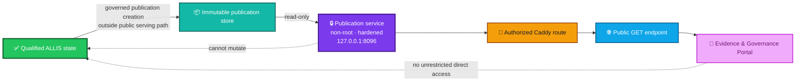
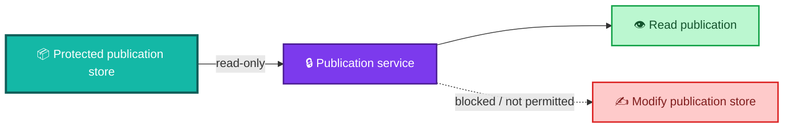
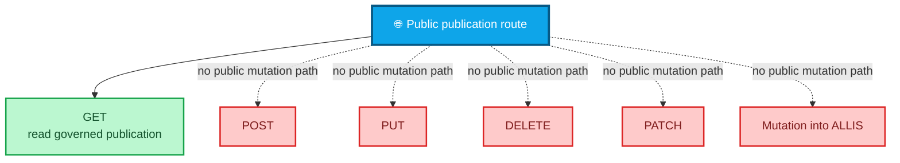
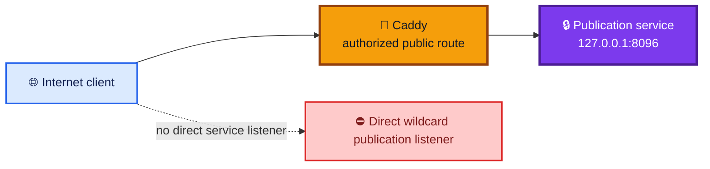
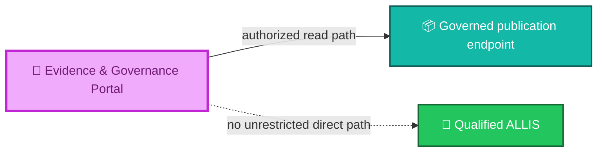
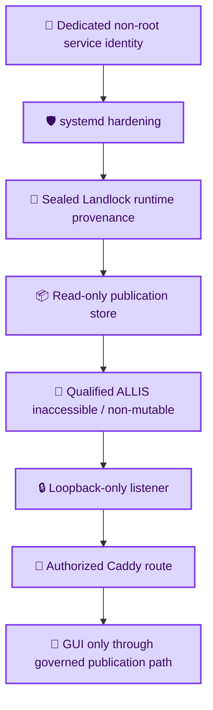
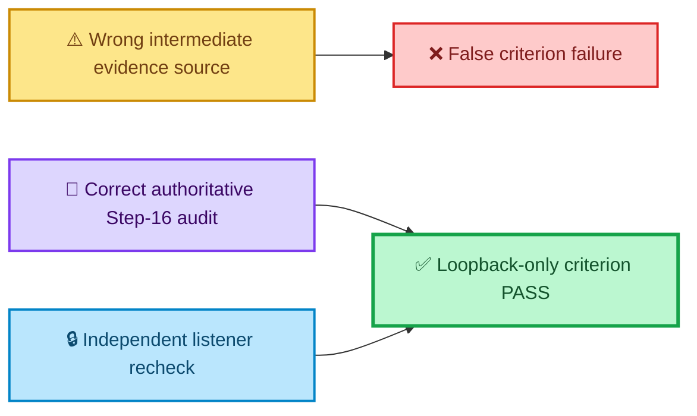

<div align="center">

# ALLIS — Publication Runtime Boundary

### Evidence record for the isolated, read-only Step-17 publication service and authorized public route

<br>


<br>

**Kidd’s Technical Services · ALLIS**

</div>

---

> [!IMPORTANT]
> This record identifies the **runtime boundary that served the governed Step-17 publication**.
>
> The publication service was qualified as a read-only outward projection path. It did not become a public control plane, an unrestricted ALLIS backend, or a mutation path into qualified ALLIS state.

---

# 👀 Runtime boundary at a glance

```text
PUBLICATION_SERVICE_ISOLATION=GREEN
PUBLICATION_SERVICE_LOOPBACK_ONLY=GREEN
STRICT_READ_ONLY_PUBLICATION_BOUNDARY=GREEN
NO_PUBLIC_MUTATION_ENDPOINT=GREEN
CADDY_AUTHORIZED_ROUTING=GREEN
GUI_NO_DIRECT_ALLIS_ACCESS=GREEN
SEALED_LANDLOCK_RUNTIME_PROVENANCE=PASS
```

Final listener evidence:

```text
loopback listeners: 1
wildcard listeners: 0
listener: 127.0.0.1:8096
```

Final service posture:

```text
service active
service enabled
dedicated non-root user
no public wildcard bind
publication store read-only
qualified ALLIS inaccessible to publication service
no public mutation endpoint
authorized public route only
```

---

# 🎯 Purpose

`evidence/publication/runtime-boundary.md` answers:

> **What runtime boundary actually enclosed the Step-17 publication service, and what evidence shows that the public path remained read-only, isolated, loopback-bound, and separated from unrestricted ALLIS access?**

It does not answer:

> Which immutable publication object was served?

That belongs in:

```text
evidence/publication/publication-identity.md
```

It does not answer:

> Was the public network path reachable at the final observation?

That belongs in:

```text
evidence/publication/network-continuity.md
```

It does not answer:

> Which representations corresponded from source/state through publication, HTTP, and GUI?

That belongs in:

```text
correspondence/publication/source-to-publication-to-http-to-gui.md
```

This record is specifically about the **runtime containment and access boundary**.

---

# 🧭 Runtime topology



The public path begins from a **governed publication object**, not from unrestricted ALLIS runtime state.

---

# 🧱 The central runtime separation

The Step-17 publication service is a **projection service**, not an ALLIS mutation service.

```text
qualified ALLIS state
    ↓
governed publication
    ↓
read-only publication service
    ↓
authorized public route
```

The runtime boundary intentionally prevents the reverse path:

```text
public request
    ↛
qualified ALLIS mutation
```

and:

```text
GUI
    ↛
unrestricted ALLIS backend
```

---

# ✅ Final bounded runtime criteria

The repaired final Step-17 completion matrix records all of the following as `PASS`:

```text
FINAL_CRITERION_NO_PUBLIC_MUTATION_ENDPOINT=PASS

FINAL_CRITERION_PUBLICATION_SERVICE_CANNOT_MUTATE_ALLIS=PASS

FINAL_CRITERION_PUBLICATION_STORE_READ_ONLY_AND_UNCHANGED=PASS

FINAL_CRITERION_CADDY_ROUTING_AUTHORIZED_AND_TESTED=PASS

FINAL_CRITERION_GUI_HAS_NO_UNRESTRICTED_DIRECT_ALLIS_ACCESS=PASS

FINAL_CRITERION_PUBLICATION_RUNTIME_ISOLATION_PROVEN=PASS

FINAL_CRITERION_LOOPBACK_ONLY_PUBLICATION_SERVICE=PASS

FINAL_CRITERION_SEALED_LANDLOCK_RUNTIME_PROVENANCE=PASS

FINAL_CRITERION_NO_UNAUTHORIZED_INFRASTRUCTURE_CHANGE_OBSERVED=PASS
```

These criteria together define the final runtime boundary.

---

# 🔐 Dedicated service identity

At the final observed service state, the publication service ran under a dedicated service identity:

```text
User=allis-publication-api
Group=allis-publication-api
```

The service was:

```text
active
enabled
```

and the service identity check passed.

The runtime therefore did not rely on an ordinary interactive user identity for publication serving.

---

# 🛡️ Non-root execution

The final publication report describes the service as:

```text
non-root
```

That matters because:

```text
service can read publication
    ≠
service receives unrestricted host authority
```

A dedicated non-root service identity narrows the operating boundary.

It does not, by itself, prove isolation.

The broader boundary also depends on filesystem restrictions, capability restrictions, Landlock provenance, loopback binding, routing, and negative testing.

---

# 🧰 Capability boundary

The observed systemd security properties included:

```text
CapabilityBoundingSet=
```

with no listed capabilities.

This supports the runtime-isolation model:

```text
publication serving capability
    ≠
ambient privileged capability
```

The publication service is intentionally bounded to the role required by the public read plane.

---

# 🔒 No writable service path declared

The observed systemd service properties included:

```text
ReadWritePaths=
```

with no listed writable paths.

The observed read-only set included the publication application/runtime area and publication store.

This supports the final criterion:

```text
PUBLICATION_STORE_READ_ONLY_AND_UNCHANGED=PASS
```

The public-serving process therefore did not require a writable publication store to answer GET requests.

---

# 📦 Publication store is read-only to the service

The final Step-17 report states:

> The protected publication store is read-only to the service and remained unchanged during negative testing.

The final matrix records:

```text
FINAL_CRITERION_PUBLICATION_STORE_READ_ONLY_AND_UNCHANGED=PASS
```

This is one of the most important runtime-boundary properties.



The serving path is read-oriented by design and evidence.

---

# 🧱 Qualified ALLIS is outside the publication service boundary

The observed systemd boundary included the qualified ALLIS source/runtime area among paths inaccessible to the publication service.

The final Step-17 matrix records:

```text
FINAL_CRITERION_PUBLICATION_SERVICE_CANNOT_MUTATE_ALLIS=PASS
```

The aggregate result records:

```text
PUBLICATION_SERVICE_ISOLATION=GREEN
```

So the public service should be understood as:

```text
can serve governed publication
```

not:

```text
can traverse or modify qualified ALLIS
```

---

# 🔴 No public mutation endpoint

The final matrix records:

```text
FINAL_CRITERION_NO_PUBLIC_MUTATION_ENDPOINT=PASS
```

and the final aggregate state records:

```text
NO_PUBLIC_MUTATION_ENDPOINT=GREEN
STRICT_READ_ONLY_PUBLICATION_BOUNDARY=GREEN
```

That means the externally exposed publication boundary is not a write API.



This diagram expresses the bounded Step-17 public role.

It does not claim that every conceivable host route is part of the audited publication API.

---

# 📥 GET-only publication role

The fixed Step-17 goal was to create and prove a:

```text
governed, read-only, versioned live ALLIS publication endpoint
```

The publication service therefore exists to expose the governed publication through a public GET path.

That public purpose is deliberately narrower than:

```text
general ALLIS API
```

or:

```text
public administrative interface
```

---

# 🔁 The read plane does not become the write plane

```text
public GET
    ≠
public mutation authority
```

```text
publication service
    ≠
governed write worker
```

```text
Caddy route
    ≠
authorization to mutate qualified ALLIS
```

```text
GUI access
    ≠
backend administrative access
```

The Step-17 runtime boundary is the concrete read-side counterpart to the separately governed write-side authorized-adoption architecture.

---

# 🔒 Loopback-only publication service

The final sealed listener evidence established:

```text
PUBLICATION_LOOPBACK_LISTENER_COUNT=1
PUBLICATION_WILDCARD_LISTENER_COUNT=0
```

and:

```text
127.0.0.1:8096
```

as the publication-service listener.

The final independent recheck recorded:

```text
SEALED_LOOPBACK_LISTENER_COUNT=1
SEALED_WILDCARD_LISTENER_COUNT=0
SEALED_LOOPBACK_ONLY_EVIDENCE=PASS
```

Final aggregate state:

```text
PUBLICATION_SERVICE_LOOPBACK_ONLY=GREEN
```

---

# 🌐 Loopback means the service is not directly internet-bound

The intended topology is:



The service listens locally.

The authorized reverse-proxy route controls public exposure.

---

# 🚦 Caddy is the authorized outward route

The final matrix records:

```text
FINAL_CRITERION_CADDY_ROUTING_AUTHORIZED_AND_TESTED=PASS
```

The final aggregate state records:

```text
CADDY_AUTHORIZED_ROUTING=GREEN
```

Therefore the public route is not modeled as:

```text
publication service binds publicly on its own
```

It is modeled as:

```text
loopback publication service
    ↓
authorized Caddy route
    ↓
public HTTPS endpoint
```

---

# 🧭 Route authority is narrower than service authority

A route can expose one endpoint without exposing an entire local service surface.

That gives the runtime two boundaries:

```text
service boundary
    =
what the local process can do

route boundary
    =
what the public can reach
```

Both must remain constrained.

---

# 🧠 GUI does not receive unrestricted ALLIS access

The final matrix records:

```text
FINAL_CRITERION_GUI_HAS_NO_UNRESTRICTED_DIRECT_ALLIS_ACCESS=PASS
```

The final aggregate state records:

```text
GUI_NO_DIRECT_ALLIS_ACCESS=GREEN
```

The production GUI consumes the governed same-origin publication endpoint.

It does not become a privileged direct client of qualified ALLIS.



This boundary is as important as loopback binding.

A frontend that bypassed publication governance would defeat the outward projection model even if the publication service itself remained read-only.

---

# 🛡️ Systemd hardening evidence

The observed publication-service security properties included:

```text
PrivateTmp=yes
PrivateDevices=yes
ProtectKernelTunables=yes
ProtectKernelModules=yes
ProtectControlGroups=yes
ProtectHome=yes
ProtectSystem=strict
NoNewPrivileges=yes
LockPersonality=yes
RestrictAddressFamilies=AF_INET AF_UNIX
RestrictSUIDSGID=yes
```

The exact meaning and effectiveness of each control remain governed by the host/runtime environment.

Together, they form part of the observed hardening posture supporting the bounded publication-service role.

---

# 🔐 `ProtectSystem=strict`

The observed service state included:

```text
ProtectSystem=strict
```

This supports the read-only service model by constraining filesystem write access at the service-manager boundary.

It should be read together with:

```text
ReadWritePaths=
ReadOnlyPaths=...
```

rather than as an isolated guarantee.

---

# 🔐 `NoNewPrivileges=yes`

The observed service state included:

```text
NoNewPrivileges=yes
```

This supports the principle:

```text
publication-service execution
    ≠
runtime privilege escalation path
```

It is one control within the larger bounded runtime design.

---

# 🔐 Private devices and temporary space

The observed service state included:

```text
PrivateTmp=yes
PrivateDevices=yes
```

These controls reduce unintended coupling between the publication service and broader host resources.

They support service isolation without changing the semantic role of the publication object.

---

# 🌐 Restricted address families

The observed service state included:

```text
RestrictAddressFamilies=AF_INET AF_UNIX
```

This constrains the service's permitted address-family surface.

The actual publication listener was still separately verified as:

```text
127.0.0.1:8096
```

with zero wildcard listeners.

Configuration intent and listener observation are separate evidence classes.

---

# 🧱 Configuration is not observation

ALLIS documentation keeps this distinction explicit:

```text
configured to be loopback-only
    ≠
observed loopback-only
```

```text
configured read-only
    ≠
negative testing shows store unchanged
```

```text
hardening directives exist
    ≠
runtime isolation proven
```

The final Step-17 matrix therefore includes separate runtime/isolation criteria rather than relying only on configuration text.

---

# 🛡️ Landlock runtime provenance

The final completion matrix records:

```text
FINAL_CRITERION_SEALED_LANDLOCK_RUNTIME_PROVENANCE=PASS
```

The final completion report states:

```text
The sealed Landlock runtime and API provenance are proven.
```

This record therefore treats the Landlock result as **sealed Step-17 runtime provenance evidence**.

It does not publish private implementation source.

It does not reinterpret Landlock as a whole-system security theorem.

---

# 🧬 Landlock is one layer, not the whole boundary

The runtime boundary is layered.



No single layer should be described as the sole reason the boundary is safe.

---

# 🧪 Negative testing matters

The Step-17 final report explicitly states:

```text
The protected publication store is read-only to the service
and remained unchanged during negative testing.
```

The final matrix records:

```text
FINAL_CRITERION_PUBLICATION_STORE_READ_ONLY_AND_UNCHANGED=PASS
```

Negative testing is important because a runtime boundary is not established merely by stating an intended policy.

The evidence must also show that prohibited behavior did not succeed in the tested scope.

---

# ⛔ Missing resources and prohibited methods fail closed

The final completion report states:

```text
Missing resources and prohibited methods fail closed.
```

The final aggregate state records:

```text
FAIL_CLOSED_BEHAVIOR=GREEN
```

For the publication runtime, that means the boundary does not substitute arbitrary success when:

- a publication is unknown;
- a resource is missing;
- a prohibited method is attempted;
- the expected governed publication is unavailable.

The detailed semantics are defined in:

```text
architecture/fail-closed-semantics.md
```

---

# 📦 Publication store does not become runtime state authority

The store contains governed publication objects.

It does not become authority for:

- production mutation;
- new publication creation;
- private-state access;
- source promotion;
- frontend write operations.

```text
publication stored
    ≠
publication authorized to create new state
```

The store is a read-side evidence substrate.

---

# 🧩 Publication service does not become publication authority

The service can serve an already governed publication.

That does not mean the service decides:

```text
what becomes publishable
```

Publication eligibility and authority occur upstream.


That preserves:

```text
can serve
    ≠
can authorize publication
```

---

# 🌐 Public route does not become backend authority

Similarly:

```text
Caddy can route request
    ≠
Caddy can authorize ALLIS mutation
```

The reverse proxy participates in the outward public transport boundary.

It does not inherit the authority of the controlled source system.

---

# 🔎 GUI does not become evidence authority

The GUI presents governed publication state.

It does not create:

- publication authority;
- evidence authority;
- claim authority;
- production mutation authority.

The final criterion that the GUI preserves epistemic states helps ensure presentation does not silently inflate evidence maturity.

---

# 🧠 Runtime isolation and epistemic isolation

The publication boundary protects two different things.

## Runtime isolation

```text
public clients cannot directly operate qualified ALLIS
```

## Epistemic isolation

```text
presentation does not silently upgrade claim maturity
```

The final Step-17 aggregate records both:

```text
PUBLICATION_SERVICE_ISOLATION=GREEN
GUI_EPISTEMIC_STATE_PRESERVATION=GREEN
```

These are related but not interchangeable.

---

# 🔁 Restart persistence

The final matrix records:

```text
FINAL_CRITERION_RESTART_PERSISTENCE_PROVEN=PASS
```

The final aggregate state records:

```text
RESTART_PERSISTENCE=GREEN
```

This means the bounded publication runtime was shown to retain the required state/behavior across the tested restart scenario.

It does not mean:

```text
all future restarts are guaranteed
```

It is evidence from the demonstrated Step-17 scope.

---

# ↩️ Rollback demonstration

The final matrix records:

```text
FINAL_CRITERION_ROLLBACK_DOCUMENTED_AND_DEMONSTRATED=PASS
```

The final completion report states:

```text
Rollback was physically demonstrated and the new runtime restored.
```

The aggregate state records:

```text
ROLLBACK_DEMONSTRATION=GREEN
```

Rollback evidence matters because the runtime boundary was not only installed; it was shown to have a governed reversal/restoration path in the tested scope.

---

# 🔄 Restart and rollback do not redefine publication identity

A restart or rollback action concerns runtime state.

It does not silently change the immutable publication object's identity.

```text
runtime lifecycle
    ≠
publication identity lifecycle
```

If a rollback selected a different publication object, that would require separate publication/correspondence evidence.

---

# 🧾 No unauthorized infrastructure change observed

The final matrix records:

```text
FINAL_CRITERION_NO_UNAUTHORIZED_INFRASTRUCTURE_CHANGE_OBSERVED=PASS
```

This criterion belongs in the runtime boundary because the fixed goal included infrastructure continuity and change control.

The final closeout also reports no mutation to the relevant production configuration during final closeout.

---

# 🧱 Final-close nonmutation

The final closeout records:

```text
SUDO_INVOKED=NO
QUALIFIED_SOURCE_MODIFIED=NO
PUBLICATION_CODE_MODIFIED=NO
PUBLICATION_STORE_MODIFIED=NO
PUBLICATION_SERVICE_RESTARTED=NO
FRONTEND_SOURCE_MODIFIED=NO
FRONTEND_RUNTIME_MODIFIED=NO
FRONTEND_RESTARTED=NO
CADDYFILE_MODIFIED=NO
CADDY_RELOADED=NO
CLOUDFLARED_MODIFIED=NO
SYSTEMD_DEFINITION_MODIFIED=NO
```

These values describe the **final closeout operation**, not the entire development history.

They establish that the final verification/closeout did not require modifying the bounded production system.

---

# 🧭 Final-close nonmutation is narrower than runtime isolation

Do not read:

```text
PUBLICATION_CODE_MODIFIED=NO
```

as:

```text
publication code can never be modified
```

The correct statement is:

```text
final closeout did not modify publication code
```

Likewise:

```text
PUBLICATION_SERVICE_RESTARTED=NO
```

means no restart occurred during final closeout.

Restart behavior had been demonstrated separately earlier in the Step-17 evidence chain.

---

# 🧾 Loopback evidence-source repair

The final Step-17 completion harness initially read the loopback-only criterion from an intermediate evidence matrix that did not contain the controlling field.

That produced a false failure.

The final repair identified the correct evidence authority and independently rechecked the sealed listener evidence.

Final repair state:

```text
LOOPBACK_CRITERION_RESOLVED=PASS
LOOPBACK_EVIDENCE_SOURCE_REPAIR=PASS
```

with:

```text
loopback listener count = 1
wildcard listener count = 0
```

---

# 🔗 Why the loopback repair belongs here

This was not a production networking repair.

It was an **evidence-source repair**.



The production listener did not need to change.

The documentation/evidence binding needed correction.

---

# 🧾 Configuration authority vs evidence authority

The runtime boundary depends on both:

```text
configuration / deployment state
```

and:

```text
observed evidence
```

A configuration file can say:

```text
bind loopback
```

but final correspondence should still inspect the listener.

A service definition can say:

```text
read-only
```

but negative testing should still demonstrate that protected state remains unchanged.

This is why Step 17 preserved independent runtime evidence.

---

# 🔗 Runtime boundary vs publication identity

`publication-identity.md` answers:

```text
WHAT object is this?
```

`runtime-boundary.md` answers:

```text
WHAT can the serving environment do and reach?
```

These cannot be merged without losing precision.

A perfectly identified publication could still be served through an unsafe runtime.

A perfectly isolated runtime could still serve the wrong publication.

Both evidence packages are required.

---

# 🔗 Runtime boundary vs network continuity

`runtime-boundary.md` answers:

```text
Is the service locally constrained and correctly routed?
```

`network-continuity.md` answers:

```text
Was the intended public route actually reachable at the final observation?
```

A loopback service can be healthy while public DNS is unavailable.

That distinction became concrete in Step 17.

---

# 🔗 Runtime boundary vs correspondence

The correspondence package records:

```text
publication
    ↓
direct service
    ↓
public HTTP
    ↓
GUI
```

This runtime evidence record substantiates the **service and routing boundary** used by those correspondence edges.

It does not replace the correspondence record.

---

# 🔗 Runtime boundary vs acceptance

The Step-17 closeout says:

```text
the bounded fixed goal closed GREEN
```

This runtime evidence record explains one reason that conclusion is supportable:

```text
the publication-serving path was demonstrably read-only,
isolated, loopback-bound, routed through the authorized proxy,
and separated from unrestricted ALLIS access
```

---

# 🧾 Runtime evidence matrix

| Evidence question | Final result |
|---|---|
| Is there a public mutation endpoint? | ✅ `NO` / criterion `PASS` |
| Can the publication service mutate qualified ALLIS? | ✅ `NO` / criterion `PASS` |
| Is the publication store read-only and unchanged under negative testing? | ✅ `PASS` |
| Is the publication runtime isolated? | ✅ `PASS` |
| Is the publication service loopback-only? | ✅ `PASS` |
| Is the sealed Landlock runtime/API provenance established? | ✅ `PASS` |
| Is Caddy routing authorized and tested? | ✅ `PASS` |
| Does the GUI lack unrestricted direct ALLIS access? | ✅ `PASS` |
| Is restart persistence demonstrated? | ✅ `PASS` |
| Is rollback documented and demonstrated? | ✅ `PASS` |
| Was unauthorized infrastructure change observed in the final matrix? | ✅ `NO` / criterion `PASS` |
| Did final closeout mutate production configuration? | ✅ `NO` |

---

# 🧭 Boundary invariants

The Step-17 runtime evidence supports these bounded invariants:

```text
PublicRequest
    ↛
DirectQualifiedALLISMutation
```

```text
PublicationService
    → ReadGovernedPublication
```

```text
PublicationService
    ↛
WritePublicationStore
```

```text
PublicationService
    ↛
MutateQualifiedALLIS
```

```text
InternetClient
    → AuthorizedProxyRoute
    → LoopbackPublicationService
```

```text
GUI
    → GovernedPublicationEndpoint
```

```text
GUI
    ↛
UnrestrictedDirectALLIS
```

These are architecture-level summaries of the bounded Step-17 evidence.

---

# 🛑 What this evidence does not establish

This runtime record does not establish:

```text
the host is universally secure
```

It does not establish:

```text
Landlock proves whole-system safety
```

It does not establish:

```text
all host services are isolated
```

It does not establish:

```text
every future publication-service build inherits this boundary automatically
```

It does not establish:

```text
all future proxy configurations remain authorized
```

It does not establish:

```text
the GUI can never change
```

It does not establish:

```text
network continuity forever
```

It does not establish:

```text
SYSTEM_PROVEN=YES
```

---

# 🕒 Runtime evidence is time-indexed

The publication identity can remain an immutable historical object.

The runtime boundary is an observed deployment condition.

Therefore:

```text
runtime boundary at Step-17 final observation
    ≠
runtime boundary guaranteed forever
```

A claim-bearing runtime change can require revalidation.

---

# 🔄 Changes that should trigger runtime-boundary revalidation

Examples include:

- service user or group changes;
- systemd security-property changes;
- publication-store permissions changes;
- write-path additions;
- executable/runtime changes;
- Landlock launcher/runtime changes;
- listener-address changes;
- port changes;
- wildcard binding;
- reverse-proxy route changes;
- new HTTP methods;
- new public endpoints;
- direct GUI-to-ALLIS paths;
- publication-service access to qualified ALLIS;
- publication-store mutation capability;
- frontend architecture changes that bypass publication governance.

The required tests should correspond to the changed boundary.

---

# 🧱 Runtime change does not automatically invalidate publication identity

A runtime change and a publication-object change are different events.

```text
runtime changes
    ≠
publication bytes changed
```

However, runtime correspondence claims may need to be re-established even when the publication object remains identical.

That is why the repository separates:

```text
publication identity
```

from:

```text
runtime boundary
```

from:

```text
correspondence
```

---

# 📦 Public-safe runtime detail

This record intentionally documents controls and observed boundary properties without publishing private implementation source.

Public-safe details include:

- service role;
- dedicated service identity;
- read-only state;
- loopback listener count;
- wildcard listener count;
- authorized routing;
- hardened service properties;
- fail-closed behavior;
- runtime provenance status;
- negative-test result;
- restart/rollback result;
- nonmutation state.

This record does not need to publish:

- private source code;
- credentials;
- secrets;
- tokens;
- signing material;
- private keys;
- sensitive private-state content.

---

# 📦 Normalized runtime-boundary record

```yaml
allis_publication_runtime_boundary:

  scope:
    workstream: publication_step17
    evidence_type: runtime_boundary
    point_in_time: true

  service:
    role: governed_read_only_publication_service
    active_at_final_observation: true
    enabled_at_final_observation: true
    user: allis-publication-api
    group: allis-publication-api
    non_root: true

  service_manager_hardening:
    capability_bounding_set_empty: true
    read_write_paths_declared: false
    protect_system: strict
    no_new_privileges: true
    private_tmp: true
    private_devices: true
    protect_kernel_tunables: true
    protect_kernel_modules: true
    protect_control_groups: true
    protect_home: true
    lock_personality: true
    restrict_address_families:
      - AF_INET
      - AF_UNIX
    restrict_suid_sgid: true

  publication_store:
    service_access: read_only
    unchanged_during_negative_testing: PASS

  qualified_allis_boundary:
    publication_service_can_mutate_allis: false
    criterion: PASS

  public_api:
    public_mutation_endpoint: false
    strict_read_only_boundary: GREEN
    fail_closed_behavior: GREEN

  listener:
    address: 127.0.0.1
    port: 8096
    loopback_listener_count: 1
    wildcard_listener_count: 0
    loopback_only_evidence: PASS

  public_routing:
    reverse_proxy: Caddy
    authorized_and_tested: PASS
    direct_public_service_bind: false

  frontend_boundary:
    consumes_governed_publication: true
    unrestricted_direct_allis_access: false
    no_direct_access_criterion: PASS
    epistemic_state_preservation: GREEN

  runtime_provenance:
    sealed_landlock_runtime_provenance: PASS
    publication_runtime_isolation: PASS

  lifecycle:
    restart_persistence: PASS
    rollback_documented_and_demonstrated: PASS

  infrastructure_change_control:
    unauthorized_infrastructure_change_observed: false
    final_closeout_mutated_production: false

  aggregate:
    publication_service_isolation: GREEN
    publication_service_loopback_only: GREEN
    caddy_authorized_routing: GREEN
    no_public_mutation_endpoint: GREEN

  nonclaims:
    universal_host_security_proven: false
    whole_system_safety_proven: false
    permanent_future_runtime_correspondence: false
    system_proven: false
```

> [!NOTE]
> This YAML block is a human-readable evidence normalization. The sealed Step-16/Step-17 runtime audits and final completion artifacts remain the bounded engineering evidence authority.

---

# 📚 Related repository records

## Publication evidence

- `readme.md` — publication evidence package index
- [`publication-identity.md`](publication-identity.md) — immutable publication identity
- `runtime-boundary.md` — **this record**
- `network-continuity.md` — public-path continuity
- `step17-final-close.md` — final evidence/seal record

## Publication correspondence

- [`../../correspondence/publication/source-to-publication-to-http-to-gui.md`](../../correspondence/publication/source-to-publication-to-http-to-gui.md)

## Acceptance

- [`../../acceptance/closeout/publication-step17-close.md`](../../acceptance/closeout/publication-step17-close.md)
- [`../../acceptance/current-system-manifest.md`](../../acceptance/current-system-manifest.md)
- [`../../acceptance/baseline-object-registry.md`](../../acceptance/baseline-object-registry.md)

## Architecture

- [`../../architecture/authority-planes.md`](../../architecture/authority-planes.md)
- [`../../architecture/fail-closed-semantics.md`](../../architecture/fail-closed-semantics.md)

## Claims

- [`../../claims/claim-registry.md`](../../claims/claim-registry.md)
- [`../../claims/nonclaims-and-residuals.md`](../../claims/nonclaims-and-residuals.md)

---

# 🧾 Runtime boundary summary

<div align="center">

### 📦 GOVERNED PUBLICATION STORE
**read-only to publication service**

↓

### 🔒 PUBLICATION SERVICE
**dedicated non-root identity**

**hardened · Landlock provenance sealed**

↓

### 🖥️ LOCAL LISTENER
**`127.0.0.1:8096`**

**1 loopback · 0 wildcard**

↓

### 🚦 AUTHORIZED CADDY ROUTE
**PASS**

↓

### 🌐 PUBLIC GET BOUNDARY
**read-only**

**no mutation endpoint**

↓

### 🔎 EVIDENCE & GOVERNANCE PORTAL
**governed publication consumer**

**no unrestricted direct ALLIS access**

<br>

# `PUBLICATION_SERVICE_ISOLATION=GREEN`

# `PUBLICATION_SERVICE_LOOPBACK_ONLY=GREEN`

# `NO_PUBLIC_MUTATION_ENDPOINT=GREEN`

# `SYSTEM_PROVEN=NO`

</div>

---

# Governing runtime-boundary principles

> **The publication service serves a governed projection; it does not become qualified ALLIS.**

> **Read capability does not create write authority.**

> **A public route does not create a public control plane.**

> **Loopback configuration is supported by observed listener evidence, not configuration intent alone.**

> **The publication store remains read-only to the serving process.**

> **The publication service does not gain authority to mutate qualified ALLIS.**

> **The GUI consumes the governed publication path rather than unrestricted ALLIS state.**

> **Service hardening is layered; no single control substitutes for the complete runtime boundary.**

> **Landlock provenance is one bounded runtime property, not a whole-system theorem.**

> **Negative testing is part of the evidence that protected state remained unchanged.**

> **Restart and rollback evidence describe the tested lifecycle scope, not an eternal guarantee.**

> **Runtime correspondence is point-in-time and must be revalidated after claim-bearing boundary changes.**

> **A green publication runtime boundary remains a bounded Step-17 result, not proof of the entire system.**
