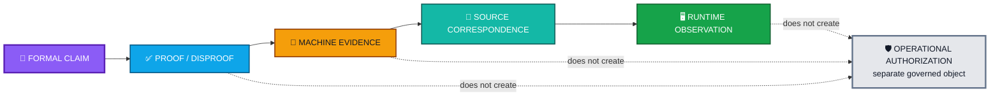

<div align="center">

# ALLIS — Theorem Registry

### Formal proposition dispositions and validation levels for the bounded Step-12 production authorized-adoption model

<br>


<br>

**Kidd’s Technical Services · ALLIS**

</div>

---

> [!IMPORTANT]
> This registry records **what formal propositions the evidence establishes and at what validation level**.
>
> It does **not** grant permission to execute production changes. A theorem may be proven, machine-checked, or correspondence-verified without becoming an authorization object.
>
> In particular, `CORRESPONDENCE_VERIFIED` establishes a bounded theorem/evidence relationship. It does **not** create standing permission to execute, waive target or prestate checks, mint authorization, or authorize a future production mutation.

---

# 👀 Theorem status and authority in one view



The registry therefore keeps two questions separate:

```text
What has the evidence established?
```

versus:

```text
What exact transition is authorized now?
```

They are not interchangeable.

---

# 🎯 Purpose

This registry records the formal propositions currently established for the bounded ALLIS production authorized-adoption model.

The referenced formal object is:

```text
DGM_PRODUCTION_AUTHORIZED_ADOPTION_MODEL_V1
```

The governing architecture is:

> **Capability does not create authority.**

The theorem layer follows the same rule.

A proposition can be proven without becoming operational authority.  
A theorem can be machine-checked without authorizing a production change.  
A theorem can correspond to deployed source without establishing every possible runtime behavior.  
A bounded proof does not become a whole-system proof merely because it is valid inside its domain.

```text
FORMAL CLAIM
     │
     ▼
PROOF / DISPROOF
     │
     ▼
MACHINE EVIDENCE
     │
     ▼
SOURCE CORRESPONDENCE
     │
     ▼
RUNTIME OBSERVATION
```

Each step answers a different question.

None of these steps grants production authority.

Production authority remains a separate governed object defined by the authorized-adoption architecture.

---

# 📋 Registry status

| Field | Value |
|---|---|
| Document role | Current theorem and proposition registry |
| Formal object | `DGM_PRODUCTION_AUTHORIZED_ADOPTION_MODEL_V1` |
| Production source commit | `20c8cbe175781c8a1c05d65c03977859ceca884a` |
| Source domain | Sealed 11-file production authorized-adoption source set |
| Proposition count | `12` |
| Proven | `11` |
| Disproven | `1` |
| Unadjudicated | `0` |
| Principal theorems | `T12D-A`, `T12D-B`, `T12D-C` |
| Preserved disproven proposition | `P12C-09` |
| Final Step-12 status | `GREEN_CLOSED_WITH_EXPLICIT_RESIDUALS` |
| Final seal SHA-256 | `b00a954a924d3aa3490a5bcb8d4473da2b6885b8c41e116cf03545fee975c23b` |

The adjudication vector is:

```math
(11,1,0)
```

representing:

```text
11 proven
1 disproven
0 unadjudicated
```

The registry contains the eight sealed-source lemmas, the three principal theorems, and the one disproven proposition that together account for the twelve adjudicated formal claims.

---

# 🧭 1. How to read this registry

The registry distinguishes a proposition's **logical result** from its **highest validated evidence level**.

## Proven

`PROVEN` means the proposition is established within the stated sealed source-model domain.

It does not by itself establish live runtime correspondence.

## Machine-checked

`MACHINE_CHECKED` means the formal result is supported by machine-executed source-structure checks and bounded execution evidence in the Step-12 method.

It does not mean proof-assistant verification in Coq, Lean, Isabelle, TLA+, or another general formal system.

## Correspondence-verified

`CORRESPONDENCE_VERIFIED` requires more than proof.

For a theorem $`T`$, the Step-12 correspondence criterion is conceptually:

```math
MC(T,S)
\land
C_{SR}(S,R)
\land
LiveObs(T,R)
```

where:

- $`MC(T,S)`$ means the theorem is machine-checked against source $`S`$;
- $`C_{SR}(S,R)`$ means the modeled source corresponds to runtime $`R`$; and
- $`LiveObs(T,R)`$ means the behavior relevant to the theorem was actually observed in that runtime.

## Disproven

`MACHINE_CHECKED_DISPROVEN` means a machine-executed bounded counterexample invalidated the proposed property.

A disproven proposition remains part of the evidence record.

It is not deleted, softened, or silently replaced.

---

# 🧩 2. Architectural meaning of the theorem set

The theorem family does not attempt to prove that an intelligent system is safe because it is capable, well evaluated, or internally confident.

It instead formalizes boundaries such as:

```text
candidate exists
≠
candidate is authorized

candidate passes evaluation
≠
candidate may enter production

runtime can mutate source
≠
runtime has authority to mutate source

authorization existed previously
≠
authorization may be replayed

source matched when authorized
≠
source still matches now

proof exists
≠
proof authorizes execution
```

The theorem set therefore tests whether the production adoption path preserves the separation between **capability** and **authority**.

---

# 📐 Source-model lemmas

# 3. A.33 — Lemma 1: publication validation precedence

## Statement

For successful authorized-spool publication:

```math
Publish(x,q_s)\downarrow
\Rightarrow
V_{NBB}(x)=1
```

Equivalent result:

```math
Publish\downarrow
\Rightarrow
NValidate\downarrow
```

## Meaning

A package cannot successfully enter the authorized incoming-spool path unless NBB validation has already succeeded.

```text
package exists
≠
authorized work exists
```

## Basis

The successful publication path calls NBB validation before authorized-spool publication.

## Registry result

| Field | Status |
|---|---|
| Logical result | `PROVEN` |
| Domain | Sealed production source model |
| Runtime promotion | Not independently promoted in this lemma |
| Authority implication | None |

> Publication eligibility follows validation; publication does not create authority retroactively.

---

# 4. A.34 — Lemma 2: NBB validation implies authorization and target acceptance

## Statement

```math
V_{NBB}(x)=1
\Rightarrow
V_{auth}(c,a,\tau)=1
\land
V_{allow}(t(c))=1
```

Equivalent result:

```math
NBBValidateSuccess
\Rightarrow
AuthorizationValid
\land
TargetAllowed
```

## Meaning

Successful NBB validation requires both an acceptable authorization and an allowed governed target.

A valid candidate alone is not sufficient.

## Registry result

| Field | Status |
|---|---|
| Logical result | `PROVEN` |
| Domain | Sealed production source model |
| Runtime promotion | Not independently promoted in this lemma |
| Authority implication | Validation verifies authority; it does not mint authority |

---

# 5. A.35 — Lemma 3: authorized apply success implies authorization validation

## Statement

```math
M_{auth}=1
\Rightarrow
V_{auth}=1
```

## Meaning

The authorized-application function cannot successfully return unless authorization validation succeeds.

```text
successful mutation
⇒
authorization validation succeeded
```

The reverse is not asserted.

A valid authorization does not guarantee that application will succeed.

## Basis

Authorization validation precedes governed application on the successful path.

## Registry result

| Field | Status |
|---|---|
| Logical result | `PROVEN` |
| Domain | Sealed production source model |
| Runtime promotion | Incorporated into `T12D-A` |
| Authority implication | Successful execution depends on verified authority |

---

# 6. A.36 — Lemma 4: authorized apply success implies target safety

## Statement

```math
M_{auth}=1
\Rightarrow
V_{target}=1
```

with:

```math
M_{auth}=1
\Rightarrow
V_{contain}=1
\land
V_{allow}=1
```

## Meaning

Successful authorized application requires both:

- filesystem containment; and
- governed target allowance.

Technical reachability of a path does not establish permission to modify it.

## Registry result

| Field | Status |
|---|---|
| Logical result | `PROVEN` |
| Domain | Sealed production source model |
| Runtime promotion | Incorporated into `T12D-A` |
| Authority implication | Access and authority remain separate |

---

# 7. A.37 — Lemma 5: authorized apply success implies prestate correspondence

## Statement

```math
M_{auth}=1
\Rightarrow
V_{pre}=1
```

The prestate condition requires:

```math
H_{current}(s,t(c))
=
h_b(c)
```

If instead:

```math
H_{current}(s,t(c))
\neq
h_b(c)
```

the application path rejects the stale transition.

## Meaning

Authorization applies to the source state that was actually authorized.

It is not standing permission to modify whatever later source happens to exist.

```text
authority for state A
≠
authority for later state B
```

## Registry result

| Field | Status |
|---|---|
| Logical result | `PROVEN` |
| Domain | Sealed production source model |
| Runtime promotion | Incorporated into `T12D-A` |
| Authority implication | Authority remains bound to state provenance |

---

# 8. A.38 — Lemma 6: successful apply requires fresh one-use authorization

## Statement

```math
M_{auth}=1
\Rightarrow
V_{once}=1
```

At the reservation boundary:

```math
M_{auth}=1
\Rightarrow
i(a)\notin L_s
```

## Meaning

An authorization that has already been spent cannot support another successful application.

A prior valid authorization does not become continuing authority.

## Basis

Exclusive spent reservation occurs before governed mutation. If the authorization identifier is already present in the spent ledger, reservation fails.

## Registry result

| Field | Status |
|---|---|
| Logical result | `PROVEN` |
| Domain | Sealed production source model |
| Runtime promotion | Incorporated into `T12D-A` |
| Authority implication | Authorization is one-use, not persistent sovereignty |

---

# 9. A.39 — Lemma 7: successful apply implies spent reservation

Define:

```math
S_{spent}=1
```

if and only if the exclusive spent reservation has been created.

## Statement

```math
M_{auth}=1
\Rightarrow
S_{spent}=1
```

## Meaning

The one-use authority state is durably advanced before successful application can return.

## Registry result

| Field | Status |
|---|---|
| Logical result | `PROVEN` |
| Domain | Sealed production source model |
| Runtime promotion | Incorporated into `T12D-A` |
| Authority implication | Successful adoption consumes the bounded authorization state |

---

# 10. A.40 — Lemma 8: successful apply implies receipt correspondence

Define:

```math
R_{receipt}=1
```

if and only if the expected application receipt has been created before successful function return.

## Statement

```math
M_{auth}=1
\Rightarrow
R_{receipt}=1
```

## Meaning

A successful governed source transition must leave durable evidence of the completed application.

The receipt records the transition.

It does not create retrospective permission for the transition.

## Registry result

| Field | Status |
|---|---|
| Logical result | `PROVEN` |
| Domain | Sealed production source model |
| Runtime promotion | Incorporated into `T12D-A` |
| Authority implication | Evidence records authority use; evidence does not create authority |

---

# ✅ Principal theorems

# 🧪 Principal theorem validation levels

# 11. T12D-A — Authorized-application gating theorem

## Statement

```math
\boxed{
M_{auth}
\Rightarrow
V_{auth}
\land
V_{target}
\land
V_{pre}
\land
V_{once}
\land
S_{spent}
\land
R_{receipt}
}
```

## Expanded authorization dependency

Successful authorized application entails the required authorization predicates, including:

```math
V_{id}
\land
V_{decision}
\land
V_{class}
\land
V_{time}
\land
V_{proposal}
\land
V_{targetbind}
\land
V_{prebind}
\land
V_{candidate}
\land
V_{evaluation}
\land
V_{evalbody}
\land
V_{sig}
```

and target safety:

```math
V_{contain}
\land
V_{allow}
```

and transition-state requirements:

```math
V_{pre}
\land
V_{once}
\land
S_{spent}
\land
R_{receipt}
```

## Architectural meaning

This theorem expresses the strongest compact source-model result for authorized production adoption.

```text
successful production mutation
does not authorize itself

successful production mutation
implies that the required authorization,
target, prestate, replay, spent-state,
and receipt conditions held
within the sealed bounded source model
```

## Registry result

| Field | Status |
|---|---|
| Source-model result | `PROVEN_WITHIN_SEALED_SOURCE_MODEL` |
| Highest validation level | `MACHINE_CHECKED` |
| Positive live observation | `NO` |
| Correspondence-verified | `NO` |
| Reason for non-promotion | No real positive production authorization/application was exercised during Step 12 |

Formally:

```math
LiveObs^{+}(T12D\text{-}A)=0
```

Therefore Step 12 does not promote:

```math
Corr(T12D\text{-}A)=1
```

## Claim boundary

`T12D-A` does **not** establish:

- universal production-mutation safety;
- whole-system safety;
- success of every authorized candidate;
- correctness of every evaluation procedure; or
- positive production behavior that was not actually observed.

> **Proof of the gate is not authority to exercise the gate.**

---

# 12. T12D-B — Invalid-authorization fail-closed theorem

## Statement

```math
\boxed{
\neg V_{auth}
\Rightarrow
\neg Publish
}
```

Equivalent operational form:

```math
InvalidExternalAuthorization
\Rightarrow
NoAuthorizedSpoolPublication
```

## Architectural meaning

Invalid authority does not enter the authorized work path.

```text
candidate may exist
evaluation may exist
package may exist

but

invalid authorization
⇒
no authorized spool publication
```

This is a direct formal expression of the separation between capability and authority.

## Registry result

| Field | Status |
|---|---|
| Source-model result | `PROVEN` |
| Machine evidence | Established |
| Relevant live observation | Established |
| Highest validation level | `CORRESPONDENCE_VERIFIED` |

The live fail-closed observation establishes:

```math
LiveObs(T12D\text{-}B)=1
```

and the final registry level is:

```math
L(T_B)=CORRESPONDENCE\_VERIFIED
```

---

# 13. T12D-C — Empty-spool non-application theorem

## Statement

```math
\boxed{
Incoming(q_s)=\varnothing
\Rightarrow
Claim(q_s)=\varnothing
\Rightarrow
NoAuthorizedApply
}
```

State form:

```math
Q_2=\varnothing
\Rightarrow
Q_3\text{ not reached}
\Rightarrow
Q_4\text{ not reached}
```

## Architectural meaning

The worker does not manufacture authority from its own ability to act.

If no authorized incoming record exists:

```text
no record
   ↓
no claim
   ↓
no authorized apply
```

## Registry result

| Field | Status |
|---|---|
| Source-model result | `PROVEN` |
| Machine evidence | Established |
| Relevant live observation | Established |
| Highest validation level | `CORRESPONDENCE_VERIFIED` |

The live empty-spool observation establishes:

```math
LiveObs(T12D\text{-}C)=1
```

and:

```math
L(T_C)=CORRESPONDENCE\_VERIFIED
```

---

# 🔬 Disproven proposition

# ❌ Preserved negative result

# 14. P12C-09 — Terminal totality

## Proposed statement

```math
\boxed{
Q_3
\Rightarrow
Q_{6C}
\lor
Q_{6R}
}
```

The proposed property asserted that every claimed record necessarily reaches either the completed or rejected terminal state.

## Counterexample

There exists a claimed record $`r`$ such that:

```math
State(r)=Q_3
```

and terminalization fails:

```math
FinishClaim(r,z,q_s)\uparrow
```

The record can therefore remain:

```math
State'(r)=Q_3
```

rather than reaching either terminal state.

Thus:

```math
\exists r:
Q_3(r)
\land
\neg Q_{6C}(r)
\land
\neg Q_{6R}(r)
```

after terminalization failure.

## Registry result

| Field | Status |
|---|---|
| Logical result | `DISPROVEN` |
| Highest validation level | `MACHINE_CHECKED_DISPROVEN` |
| Counterexample | Preserved |
| Silent replacement permitted | `NO` |

## Refined but unpromoted proposition

The narrower statement:

```math
Q_3
\land
FinishClaim\downarrow
\Rightarrow
Q_{6C}
\lor
Q_{6R}
```

is consistent with the discovered transition structure.

Step 12 did not promote it as a replacement theorem.

## Architectural meaning

A desired system property does not become true because it would make the architecture cleaner.

> **Evidence constrains the claim. The claim does not control the evidence.**

That rule is the theorem-layer expression of the broader ALLIS principle that state does not become authority merely because it exists.

---

# 📊 Registry summary

# 📊 Aggregate adjudication

# 15. Twelve adjudicated formal claims

| Registry item | Result | Highest recorded level |
|---|---|---|
| A.33 — Lemma 1: publication validation precedence | Proven | `PROVEN` |
| A.34 — Lemma 2: NBB validation implies authorization and target acceptance | Proven | `PROVEN` |
| A.35 — Lemma 3: apply success implies authorization validation | Proven | `PROVEN` |
| A.36 — Lemma 4: apply success implies target safety | Proven | `PROVEN` |
| A.37 — Lemma 5: apply success implies prestate correspondence | Proven | `PROVEN` |
| A.38 — Lemma 6: apply success requires fresh one-use authorization | Proven | `PROVEN` |
| A.39 — Lemma 7: apply success implies spent reservation | Proven | `PROVEN` |
| A.40 — Lemma 8: apply success implies receipt correspondence | Proven | `PROVEN` |
| T12D-A — Authorized-application gating theorem | Proven | `MACHINE_CHECKED` |
| T12D-B — Invalid-authorization fail-closed theorem | Proven | `CORRESPONDENCE_VERIFIED` |
| T12D-C — Empty-spool non-application theorem | Proven | `CORRESPONDENCE_VERIFIED` |
| P12C-09 — Terminal totality | Disproven | `MACHINE_CHECKED_DISPROVEN` |

The aggregate adjudication remains:

```math
N_{total}=12
```

```math
N_{proven}=11
```

```math
N_{disproven}=1
```

```math
N_{open}=0
```

Therefore:

```math
\boxed{
12=11+1+0
}
```

---

# 16. Validation-level summary

The three principal theorem levels are:

```math
L(T_A)=MACHINE\_CHECKED
```

```math
L(T_B)=CORRESPONDENCE\_VERIFIED
```

```math
L(T_C)=CORRESPONDENCE\_VERIFIED
```

and:

```math
\mathcal{M}_{DGM}
\not\models
P12C\text{-}09
```

The different levels are intentional.

They reflect the evidence actually earned by each claim.

```text
same formal model
does not mean
same evidence level
```

---

# 🚫 Non-promotion boundaries

# 17. Explicit non-promotions

The theorem registry preserves the following current boundaries:

```text
T12D-A
≠
CORRESPONDENCE_VERIFIED

P12C-09
≠
PROVEN

bounded authorized-adoption proof
≠
general production-mutation safety proof

bounded authorized-adoption proof
≠
whole-system safety proof

bounded authorized-adoption proof
≠
SYSTEM_PROVEN

machine-checked positive path
≠
positive live path observed
```

The controlling system-level statements remain:

```text
PRODUCTION_MUTATION_SAFETY_THEOREM_PROVEN=NO
WHOLE_SYSTEM_SAFETY_THEOREM_PROVEN=NO
SYSTEM_PROVEN=NO
```

These are explicit non-promotions.

They are not missing work silently represented as success.

---

# 🛡️ 18. The theorem registry does not authorize production action

This registry records knowledge about the architecture.

It does not grant permission to use the architecture.

```text
theorem proven
≠
candidate authorized

theorem machine-checked
≠
production mutation authorized

theorem correspondence-verified
≠
standing permission to execute

formal evidence exists
≠
operational authority exists
```

Operational authorization remains governed by the independent authorization object and runtime predicates defined in [`formal-model.md`](./formal-model.md).

This separation is intentional.

The formal layer answers:

> **What properties have the evidence established?**

The authority layer answers:

> **What exact transition is permitted now, by whom, against what state, under what bounded authorization?**

ALLIS does not treat those questions as interchangeable.

---

# 🔐 19. Seal boundary

The controlling Step-12 formal seal is:

```text
STEP12_FINAL_THEOREM_AND_FORMAL_CORRESPONDENCE_SEALED_GREEN_WITH_EXPLICIT_RESIDUALS
```

Final result SHA-256:

```text
b00a954a924d3aa3490a5bcb8d4473da2b6885b8c41e116cf03545fee975c23b
```

Controlling scope:

```text
BOUNDED_PRODUCTION_AUTHORIZED_ADOPTION_FORMAL_MODEL_AND_ESTABLISHED_CORRESPONDENCE_ONLY
```

The strongest compact theorem remains:

```math
\boxed{
M_{auth}
\Rightarrow
V_{auth}
\land
V_{target}
\land
V_{pre}
\land
V_{once}
\land
S_{spent}
\land
R_{receipt}
}
```

The two current correspondence-verified fail-closed results remain:

```math
\boxed{
\neg V_{auth}
\Rightarrow
\neg Publish
}
```

and:

```math
\boxed{
Incoming=\varnothing
\Rightarrow
Claim=\varnothing
\Rightarrow
NoAuthorizedApply
}
```

The terminal-totality proposition remains false.

No stronger theorem is implied by the seal.

---

# 📚 20. Companion records

This registry belongs with:

```text
formal-verification/
    authorized-adoption/
        formal-model.md
        theorem-registry.md
        counterexample-registry.md

correspondence/
    authorized-adoption/
        model-to-source.md
        source-to-runtime.md

evidence/
    governed-evolution/
        step12-final-seal.md
        source-identity.md
        trust-anchor.md
        governance-view.md
        residuals.md
```

Use:

- [`formal-model.md`](./formal-model.md) — definitions, predicates, state space, and transition semantics
- [`theorem-registry.md`](./theorem-registry.md) — this proposition adjudication and validation-level registry
- [`counterexample-registry.md`](./counterexample-registry.md) — preserved falsifying cases
- [`model-to-source.md`](../../correspondence/authorized-adoption/model-to-source.md) — formal object → sealed source correspondence
- [`source-to-runtime.md`](../../correspondence/authorized-adoption/source-to-runtime.md) — sealed source → inspected runtime correspondence
- [`step12-final-seal.md`](../../evidence/governed-evolution/step12-final-seal.md) — controlling bounded Step-12 final seal
- [`source-identity.md`](../../evidence/governed-evolution/source-identity.md) — canonical sealed source identity
- [`trust-anchor.md`](../../evidence/governed-evolution/trust-anchor.md) — public verification trust identity
- [`governance-view.md`](../../evidence/governed-evolution/governance-view.md) — governance-view identity and correspondence evidence
- [`residuals.md`](../../evidence/governed-evolution/residuals.md) — residual and non-promotion ledger

---

# 🧾 Theorem-registry summary

<div align="center">

### 📐 FORMAL CLAIMS
# **12**

**11 proven · 1 disproven · 0 unadjudicated**

<br>

### ✅ `T12D-A`
**`MACHINE_CHECKED`**

### ✅ `T12D-B`
**`CORRESPONDENCE_VERIFIED`**

### ✅ `T12D-C`
**`CORRESPONDENCE_VERIFIED`**

### 🔬 `P12C-09`
**`MACHINE_CHECKED_DISPROVEN`**

<br>

### 🛡️ AUTHORITY BOUNDARY
**theorem proven ≠ candidate authorized**

**theorem correspondence-verified ≠ standing permission to execute**

**formal evidence exists ≠ operational authority exists**

<br>

# `SYSTEM_PROVEN=NO`

</div>

---

# Governing theorem-registry principle

> **A stronger claim requires stronger evidence, and stronger evidence still does not create operational authority.**

> **Proof describes what the evidence establishes. Authorization governs what transition may occur now.**

> **Capability does not create authority.**
