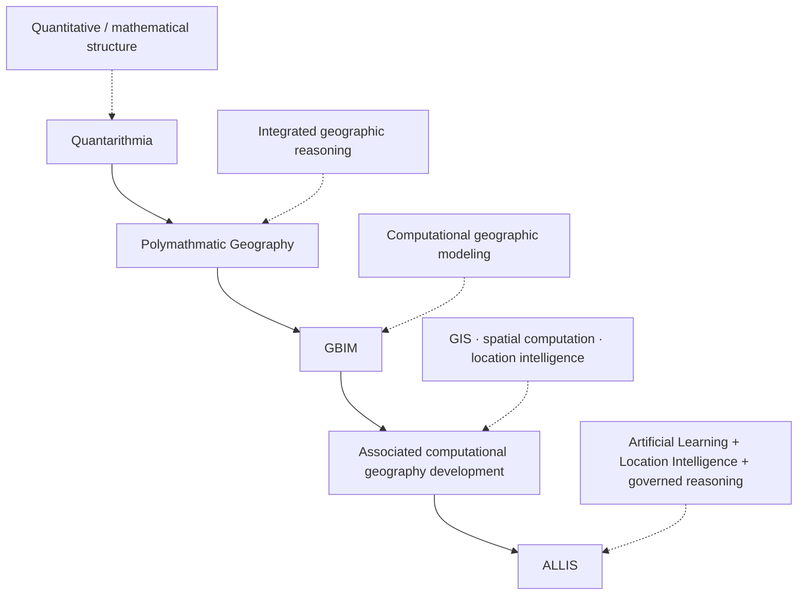

<div align="center">

# ALLIS — Historical Research & Intellectual Lineage

### Research lineage from Quantarithmia through Polymathmatic Geography and GBIM-associated computational geography development to ALLIS

<br>


<br>

**Kidd's Technical Services · ALLIS**

</div>

---

> [!IMPORTANT]
> This document preserves the **research and intellectual lineage** of ALLIS independently of present implementation authority.
>
> The lineage is:
>
> ```text
> Quantarithmia
>     ↓
> Polymathmatic Geography
>     ↓
> GBIM / associated computational geography development
>     ↓
> ALLIS
> ```
>
> Historical lineage explains where ideas came from.
>
> It does **not** by itself establish:
>
> - current source correspondence;
> - current runtime correspondence;
> - present production authority;
> - theorem coverage;
> - JCP admission;
> - or whole-system proof.

---

# 1. Purpose

ALLIS did not emerge as an isolated software artifact.

It developed through a longer intellectual path involving:

```text
quantitative / mathematical abstraction
    ↓
geographic reasoning
    ↓
computational geography
    ↓
integrated learning / location intelligence architecture
```

This document preserves that lineage so the repository does not lose the conceptual history behind the current system.

At the same time, it keeps historical research separate from current implementation authority.

---

# 2. Lineage summary

The intended historical sequence is:

```text
Quantarithmia
    ↓
Polymathmatic Geography
    ↓
GBIM
    ↓
associated computational geography development
    ↓
ALLIS
```

The transitions should be understood as intellectual development, not as one-to-one code inheritance.

---

# 3. Quantarithmia

Quantarithmia represents the earliest named stage in this lineage.

Its role in the historical record is foundational.

At this stage, the intellectual emphasis was on:

```text
quantitative structure

mathematical relationships

formalized representation

multi-variable reasoning
```

The importance of Quantarithmia in the lineage is not that current ALLIS source files are necessarily direct descendants of a Quantarithmia implementation.

Its importance is that it established an early conceptual tendency toward treating complex problems as structured quantitative systems rather than as isolated observations.

---

# 4. Quantarithmia as conceptual foundation

The broad intellectual contribution of Quantarithmia can be summarized as:

```text
complex systems
    ↓
structured mathematical representation
    ↓
relations among variables
    ↓
computable reasoning
```

This becomes important later when geography is treated not only as mapped location, but as a mathematically structured domain.

---

# 5. Transition to Polymathmatic Geography

The next stage in the lineage is:

```text
Polymathmatic Geography
```

This marks a conceptual expansion from generalized quantitative/mathematical structure into a geographic reasoning framework.

The emphasis moves toward:

```text
space

location

relationships among places

multiple interacting variables

temporal/geographic context

computational representation
```

---

# 6. Meaning of Polymathmatic Geography in the lineage

Polymathmatic Geography should be preserved as an intellectual bridge between abstract mathematical thinking and applied computational geography.

The concept reflects the idea that geographic problems often require simultaneous reasoning across:

- location;
- distance;
- time;
- social context;
- infrastructure;
- environmental context;
- human activity;
- mathematical relations;
- multiple disciplinary domains.

The historical value is the move toward **integrated geographic reasoning**.

---

# 7. "Polymathmatic" as a research idea

Within the lineage, "polymathmatic" should be understood as the convergence of:

```text
multiple domains of knowledge
+
mathematical structure
+
geographic context
```

rather than as a claim that every later ALLIS component directly implements a single historical formula.

This distinction matters because the intellectual concept survives even where later source architecture becomes more specific.

---

# 8. Geographic reasoning becomes computational

The transition from Polymathmatic Geography toward GBIM and related development introduces a more explicit computational layer.

Conceptually:

```text
mathematical geographic reasoning
    ↓
computational representation
    ↓
data structures
    ↓
spatial analysis
    ↓
model interaction
```

This is where the lineage becomes increasingly recognizable as the precursor to modern ALLIS architecture.

---

# 9. GBIM

GBIM is the next major named stage in the lineage.

Within the broader research history, GBIM should be preserved as part of the development of computational geographic intelligence and structured geographic information reasoning.

The important lineage relation is:

```text
Polymathmatic Geography
    ↓
GBIM
```

with GBIM representing a more computationally explicit phase.

---

# 10. GBIM and computational geography development

GBIM should not be treated in isolation.

The historical record includes:

```text
GBIM
    /
associated computational geography development
```

as a broader body of technical and research evolution.

This includes the maturation of ideas around:

- geographic information systems;
- spatial analysis;
- computational geography;
- structured geographic context;
- vectorized/embedded geographic state;
- geospatial decision support;
- machine-readable geographic relationships.

---

# 11. Associated computational geography development

The phrase:

```text
associated computational geography development
```

is intentionally broader than one codebase or one formal model.

It preserves the fact that the intellectual path from GBIM to ALLIS included continued work around:

```text
GIS

spatial computation

geographic modeling

location intelligence

temporal/geographic context

structured geospatial evidence

machine-assisted reasoning
```

This broader development should remain visible in the historical record.

---

# 12. From geographic computation to integrated intelligence

The transition from GBIM-associated work to ALLIS reflects a change in system scope.

Earlier stages centered heavily on:

```text
mathematics
+
geographic structure
+
computational geography
```

ALLIS expands that into:

```text
learning
+
location intelligence
+
governed reasoning
+
identity-aware conversation
+
structured evidence
+
formal authority boundaries
```

This is an expansion, not a rejection, of the earlier lineage.

---

# 13. ALLIS

ALLIS stands for:

```text
Artificial Learning and Location Intelligence System
```

and represents the current engineering/research platform in this lineage.

Within the lineage, ALLIS integrates:

- location intelligence;
- conversational reasoning;
- governed state;
- evidence;
- cognition;
- formal verification;
- projection-based state models;
- authority separation;
- publication boundaries;
- private/public state distinctions;
- automated learning architecture.

---

# 14. Why the lineage matters

Without the historical lineage, ALLIS can appear to be only:

```text
a collection of current services
```

or:

```text
a modern LLM application
```

That interpretation is incomplete.

The architecture is rooted in a longer research trajectory centered on:

```text
structured mathematics

geography

computational geography

location intelligence

governed machine reasoning
```

The lineage explains why geographic/state architecture remains central rather than incidental.

---

# 15. Lineage vs implementation authority

The critical repository rule is:

```text
historical lineage
    ≠
current implementation authority
```

A historical concept may explain why a current architecture exists.

It does not prove that the current source implements the historical concept exactly.

---

# 16. Historical concept vs current source

Preserve:

```text
historical concept
    ≠
current source implementation
```

Current source correspondence requires:

```text
exact file
function
schema
source identity
```

not intellectual ancestry alone.

---

# 17. Historical concept vs runtime

Likewise:

```text
historical concept
    ≠
live runtime
```

A historical GBIM or computational-geography concept may remain intellectually relevant while no corresponding live service exists under that historical name.

---

# 18. Historical concept vs theorem coverage

Preserve:

```text
historical mathematical concept
    ≠
current Lean theorem
```

The presence of mathematical/geographic terminology in earlier research does not establish current machine-checked proof.

---

# 19. Historical concept vs H_* formalization

Similarly:

```text
historical geography/state concept
    ≠
proved H_* subspace
```

Current H_* objects remain governed typed projections/views unless stronger formal properties are separately proved.

---

# 20. Historical concept vs JCP admission

A historic spatial or geographic model does not imply current JCP admission.

Current R3 state remains:

```text
H_geo current JCP admission = NO
```

Historical lineage cannot override current nonadmission.

---

# 21. Historical concept vs Gateway wiring

A historic cognition/geography relation does not prove current Unified Gateway wiring.

Current Gateway correspondence must be established from:

```text
source

runtime

request/response behavior

qualified observations
```

---

# 22. Historical concept vs authority

Historical research also does not grant operational authority.

Preserve:

```text
researched
    ≠
authorized
```

and:

```text
historically designed
    ≠
currently admitted
```

---

# 23. Lineage diagram



---

# 24. Conceptual progression

A useful conceptual interpretation is:

```text
Quantarithmia
    =
structured quantitative reasoning
```

```text
Polymathmatic Geography
    =
multidomain mathematical geographic reasoning
```

```text
GBIM / computational geography
    =
machine-readable spatial modeling and geographic intelligence
```

```text
ALLIS
    =
governed artificial learning + location intelligence architecture
```

This is a lineage summary, not an assertion of direct code equivalence.

---

# 25. What carries forward

The strongest conceptual themes that carry forward are:

```text
mathematical structure

geographic context

multi-domain reasoning

spatial relationships

computational representation

evidence

location intelligence
```

Later ALLIS work adds stronger explicit boundaries around:

```text
identity

authority

private state

publication

formal proof

runtime correspondence

conversational admission
```

---

# 26. What changes over time

The architecture becomes more explicit as the lineage advances.

Early research emphasizes:

```text
conceptual mathematical/geographic reasoning
```

Later development increasingly emphasizes:

```text
source-defined state

service boundaries

runtime behavior

formal verification

authority separation

evidence provenance
```

The lineage therefore shows increasing operational rigor.

---

# 27. Research role

This document belongs under:

```text
research/
```

because its authority class is:

```text
RESEARCH_LINEAGE
```

not:

```text
CURRENT_IMPLEMENTATION_MANIFEST
```

It is explanatory evidence.

---

# 28. Relationship to thesis

The thesis/research corpus may contain historical conceptual language that reflects stages in this lineage.

The thesis should remain:

```text
explanatory / research evidence
```

not:

```text
current implementation authority
```

This lineage document should therefore complement, not replace, thesis reconciliation.

---

# 29. Relationship to current qualified baseline

The current qualified baseline is established through:

```text
qualified source identities

formal proof artifacts

model-to-source correspondence

source-to-runtime correspondence

live observations

governed closeouts
```

The historical lineage is not part of that authority chain unless a specific current claim is separately crosswalked.

---

# 30. Historical evidence may still be useful

Historical lineage remains useful for:

```text
explaining architecture

understanding terminology

recovering design intent

identifying predecessor concepts

guiding future theorem families

tracing research evolution
```

That is a valid role.

---

# 31. Historical evidence should not be discarded

The correct rule is not:

```text
old = irrelevant
```

The correct rule is:

```text
historical evidence
    =
valuable lineage evidence
```

while:

```text
historical evidence
    ≠
current operational authority
```

---

# 32. Terminology continuity

Some terms may survive across multiple lineage stages while changing meaning.

Therefore future historical reconciliation should record:

```text
term

historical meaning

intermediate meaning

current meaning
```

rather than assuming continuity by name alone.

---

# 33. Geography remains central

The progression into ALLIS preserves geography as a structural component.

Location intelligence is not an accessory bolted onto a generic conversational system.

The historical lineage supports the interpretation that spatial/geographic reasoning has been part of the research direction from early stages onward.

---

# 34. ALLIS as convergence point

ALLIS represents the convergence of several research themes:

```text
mathematics

geography

computational geography

location intelligence

machine reasoning

conversation

governance

formal verification
```

The lineage is therefore best understood as cumulative convergence.

---

# 35. Not a simple rename chain

Avoid representing the history as:

```text
Quantarithmia renamed to Polymathmatic Geography
renamed to GBIM
renamed to ALLIS
```

That would be too simplistic.

A better description is:

```text
research evolved through successive conceptual and computational stages
```

with some ideas carried forward, some refined, and some replaced.

---

# 36. Not a code genealogy claim

This document does not claim:

```text
every ALLIS source file descends from GBIM source
```

or:

```text
current runtime contains Quantarithmia modules
```

or:

```text
all historical models remain active
```

Those would require source evidence.

---

# 37. Not a theorem genealogy claim

It also does not claim:

```text
current Lean theorems derive directly from historical equations
```

unless a specific formal reconciliation establishes that relation.

---

# 38. Not a production-authority claim

The lineage does not authorize:

```text
production mutation

state adoption

JCP admission

publication

private-state disclosure
```

Historical importance is not operational authority.

---

# 39. Lineage metadata

Recommended repository metadata:

```yaml
allis_historical_lineage:
  role: RESEARCH_INTELLECTUAL_LINEAGE

  sequence:
    - Quantarithmia
    - Polymathmatic_Geography
    - GBIM
    - Associated_Computational_Geography_Development
    - ALLIS

  authority:
    current_implementation_authority: false
    runtime_authority: false
    theorem_authority: false
    production_authority: false

  value:
    explains_architectural_origins: true
    preserves_terminology_history: true
    supports_design_reconciliation: true

  current_system:
    system_proven: false
```

---

# 40. Historical-lineage status vocabulary

Recommended labels:

```text
RESEARCH_PRECURSOR

CONCEPTUAL_PRECURSOR

COMPUTATIONAL_PRECURSOR

HISTORICAL_IMPLEMENTATION

CURRENT_IMPLEMENTATION

CURRENT_QUALIFIED_FORMAL_MODEL
```

These labels can help prevent lineage evidence from being mistaken for current authority.

---

# 41. Suggested future evidence additions

Future versions of this document may add:

```text
dates

original notebooks

papers

diagrams

early code repositories

GIS models

GBIM artifacts

historical source snapshots

terminology crosswalks
```

provided those sources are actually available and cited.

Do not invent dates or direct-source continuity without evidence.

---

# 42. Future chronology table

A later source-grounded version may use:

| Stage | Approximate period | Core concept | Source artifacts | Current relevance |
|---|---|---|---|---|
| Quantarithmia | source-grounded date needed | quantitative/mathematical structure | source-grounded artifact needed | conceptual precursor |
| Polymathmatic Geography | source-grounded date needed | multidomain geographic reasoning | source-grounded artifact needed | conceptual precursor |
| GBIM | source-grounded date needed | computational geography | source-grounded artifact needed | computational precursor |
| Associated computational geography | source-grounded date needed | GIS/location-intelligence development | source-grounded artifact needed | technical precursor |
| ALLIS | current | governed artificial learning + location intelligence | current repository/evidence | current platform |

This table intentionally leaves unsupported chronology open.

---

# 43. Relationship to H_geo

The geographic lineage helps explain why H_geo exists conceptually.

But:

```text
historical geographic reasoning
    ≠
current H_geo theorem
```

Current H_geo remains governed by the R3/static qualification and successor H384/projection plans.

---

# 44. Relationship to H384

The long mathematical/geographic lineage may motivate the current H384 formalization.

But:

```text
historical quantitative thinking
    ≠
H384 proof
```

The H384 carrier must still be formally established independently.

---

# 45. Relationship to cognition

The lineage may also explain the gradual move toward multi-source reasoning.

But the current cognition path:

```text
prefrontal
+
iContainers
+
psychology
→ stage/evaluate/emit
```

must be qualified from current source/runtime evidence.

Historical multidomain reasoning does not substitute for cognition correspondence.

---

# 46. Relationship to automated learning

The lineage toward integrated intelligence may conceptually precede automated learning.

But current automated-learning status remains:

```text
AUTOMATED_LEARNING_WEB_RESEARCH_QUALIFIED=NO

RESEARCH_TO_CORPUS_INGESTION_QUALIFIED=NO
```

Historical research direction cannot upgrade those flags.

---

# 47. Relationship to DGM

The lineage predates and conceptually feeds later governed evolution/adoption work.

But current DGM qualification stands on its own evidence.

Preserve:

```text
historical research lineage
    ≠
DGM completion
```

and:

```text
FULL_DGM_COMPLETION_CLAIMED=NO
```

---

# 48. Repository placement rule

This file belongs in:

```text
research/allis-historical-lineage.md
```

because its function is:

```text
preserve historical/intellectual continuity
```

not:

```text
declare current system state
```

---

# 49. Current authority hierarchy

When lineage and current evidence differ, present-tense implementation claims should follow:

```text
current qualified source

current formal evidence

current correspondence

current runtime observation
```

not historical architecture.

The lineage remains explanatory.

---

# 50. Final lineage statement

```text
ALLIS_HISTORICAL_LINEAGE=DOCUMENTED

LINEAGE:
Quantarithmia
-> Polymathmatic_Geography
-> GBIM
-> Associated_Computational_Geography_Development
-> ALLIS

ROLE=RESEARCH_INTELLECTUAL_LINEAGE

CURRENT_IMPLEMENTATION_AUTHORITY=NO

CURRENT_RUNTIME_AUTHORITY=NO

CURRENT_THEOREM_AUTHORITY=NO

PRODUCTION_AUTHORITY=NO

EXPLAINS_ARCHITECTURAL_ORIGINS=YES

PRESERVES_RESEARCH_CONTINUITY=YES

SYSTEM_PROVEN=NO
```

---

# Governing principles

> **Quantarithmia is preserved as the earliest named quantitative/mathematical precursor in the lineage.**

> **Polymathmatic Geography marks the move toward integrated mathematical geographic reasoning.**

> **GBIM and associated computational geography development represent the transition into machine-readable spatial and location-intelligence work.**

> **ALLIS is the current convergence point for artificial learning, location intelligence, governed reasoning, evidence, conversation, and formal authority boundaries.**

> **The lineage is cumulative research history, not a simple rename chain.**

> **Historical concepts explain current architecture; they do not automatically prove current implementation.**

> **Historical evidence is valuable without being current runtime authority.**

> **Current source, formal correspondence, runtime observation, and qualified closeouts remain the basis for present-tense system claims.**

> **SYSTEM_PROVEN remains NO.**
