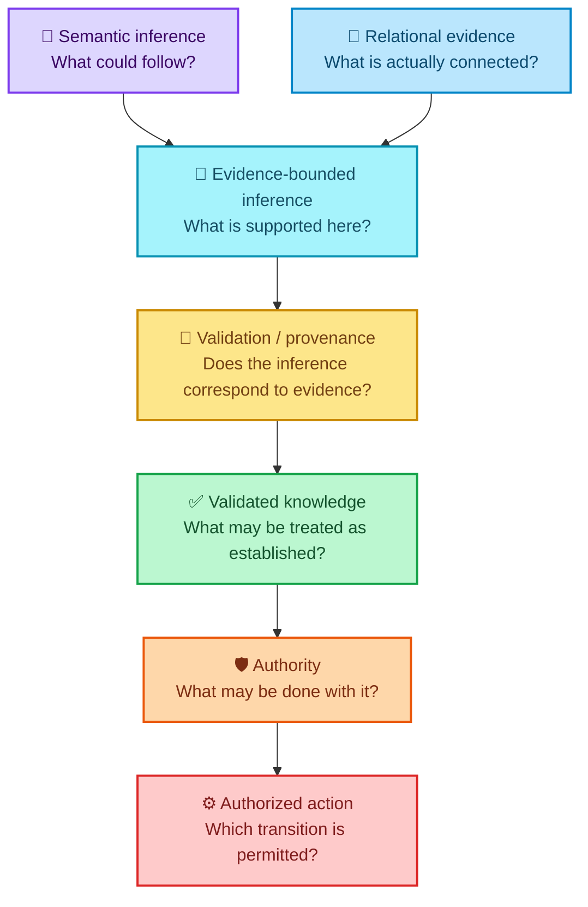

<div align="center">

# ALLIS — Relational Geometry and Warranted Understanding

### A prospective research program for testing whether reliable inference depends on preserving task-relevant relational distinctions

<br>


<br>

**Kidd's Technical Services · ALLIS**

</div>

---

> [!IMPORTANT]
> This directory defines a **prospective research program**.
>
> It does not define the current qualified technical state of ALLIS.
>
> It does not establish that meaning, understanding, intelligence, consciousness, or physical reality has been reduced to a particular geometry.
>
> The purpose of this work is to formulate and test a narrower question:
>
> # **Does reliable inference require preservation of the relational distinctions required by the task being solved?**

Preserve:

```text
research hypothesis
    ≠
architectural fact
    ≠
qualified result
    ≠
formal theorem
    ≠
whole-system claim
```

---

# 👀 The research question in one view



The proposed distinction is:

```text
semantically plausible
    ≠
relationally supported
    ≠
validated
    ≠
authorized
```

---

# 1. Purpose

This research program asks whether reliable artificial inference depends not only on the information available to a system, but also on preservation of the **relationships that make task-relevant distinctions identifiable**.

The central working hypothesis is:

\[
\boxed{
\textbf{Reliable intelligence requires preservation of task-relevant relational distinctions.}
}
\]

A broader motivating question is:

\[
\boxed{
\text{Does understanding require a physically instantiated relational geometry that preserves meaningful distinctions?}
}
\]

The broader question is intentionally separated from the immediate ALLIS research program.

ALLIS does not currently establish an answer to it.

Instead, ALLIS provides a governed artificial-system testbed in which the narrower structural hypothesis can be progressively formalized and challenged.

---

# 2. Research status

```text
Document class:
PROSPECTIVE RESEARCH

Central hypothesis:
NOT YET ESTABLISHED

Relational-geometry formal model:
PARTIAL / PROSPECTIVE

Controlled experimental program:
PLANNED

Cross-domain equivalence:
NOT ESTABLISHED

Human-consciousness implication:
NOT ESTABLISHED

Penrose validation:
NO

Whole-system proof:
SYSTEM_PROVEN=NO
```

The governing rule is:

> **The purpose of the research is to test the hypothesis, not to assume it.**

---

# 3. What “geometry” means in this research

The word **geometry** is used first in a relational and structural sense.

A useful abstract representation is:

\[
G=(V,E,\tau,C),
\]

where:

- \(V\) = states, objects, observations, or entities;
- \(E\) = relationships among them;
- \(\tau\) = types assigned to states and relationships;
- \(C\) = constraints governing valid states, interpretations, or transitions.

A relational geometry may therefore include:

```text
semantic relations

spatial relations

temporal relations

identity relations

provenance relations

evidentiary relations

correspondence relations

authority relations

network topology

ordering

neighborhood

admissible transitions
```

This definition does **not** establish:

```text
relational geometry
    =
physical spacetime geometry
```

or:

```text
semantic vector
    =
quantum state
```

or:

```text
named ALLIS H_* domain
    =
mathematical linear subspace
```

Those are separate questions requiring separate definitions and evidence.

---

# 4. The distinction-preservation hypothesis

Consider two states:

\[
s_1\neq s_2.
\]

For a bounded task \(T\), suppose the difference between those states matters:

\[
s_1\not\sim_Ts_2.
\]

Now consider a representation or transformation:

\[
\pi:S\rightarrow S'.
\]

If that representation is sufficient for task \(T\), then it should preserve the distinction:

\[
s_1\not\sim_Ts_2
\Rightarrow
\pi(s_1)\neq\pi(s_2).
\]

If instead:

\[
\pi(s_1)=\pi(s_2),
\]

then the representation has collapsed two task-relevant states into one observable state.

A downstream reasoner restricted to that representation cannot uniquely recover the destroyed distinction merely by reasoning harder.

The research question therefore becomes:

> **Which relational distinctions must remain recoverable for a particular inference to remain warranted?**

---

# 5. Meaning is not only the represented object

A central working proposition is:

\[
\boxed{
\textbf{Meaning is not exhausted by the things represented; it also depends on the relations that distinguish what those things are, where they belong, and what may validly follow from them.}
}
\]

For example, an isolated statement:

```text
Bridge closed
```

contains semantic information.

But record-specific interpretation may additionally depend on:

```text
which bridge

where

when

source

observation

current state

provenance

applicable authority
```

The proposition being investigated is not that the words have no meaning without those relations.

It is that **specific warranted interpretation cannot legitimately exceed the relations that support it**.

---

# 6. Semantic inference and relational evidence

This research distinguishes:

```text
SEMANTIC INFERENCE
```

from:

```text
AVAILABLE RELATIONAL EVIDENCE
```

Semantic inference concerns what could follow from:

- concepts;
- language;
- rules;
- learned associations;
- similarity;
- model reasoning.

Relational evidence concerns which specific connections have actually been established for the object or claim under consideration.

A working formulation is:

\[
\boxed{
\text{Semantic Inference}
\cap
\text{Available Relational Evidence}
=
\text{Evidence-Bounded Inference}.
}
\]

That result is not automatically validated knowledge.

The intended progression is:

```text
semantic possibility
    ↓
evidence-bounded inference
    ↓
validation / correspondence
    ↓
validated knowledge
    ↓
applicable authority
    ↓
permitted use
    ↓
authorized transition
```

ALLIS intentionally treats these as different states.

---

# 7. Why ALLIS is a useful testbed

The current ALLIS architecture already separates many of the dimensions needed to study relational distinction preservation.

The current state architecture distinguishes, among other things:

```text
semantic state

geographic / spatial state

temporal state

person-linked state

memory / provenance state

evidence state

lifecycle state

authority state

publication state
```

See:

- [`../../architecture/state-models/state-model-overview.md`](../../architecture/state-models/state-model-overview.md)

ALLIS also maintains:

```text
state
    ≠
authority
```

```text
capability
    ≠
permission
```

```text
evidence
    ≠
execution authority
```

See:

- [`../../architecture/authority-planes.md`](../../architecture/authority-planes.md)

The Automated Learning architecture further preserves:

```text
information missing
    ≠
permission to invent
```

See:

- [`../../architecture/automated-learning/automated-learning-graph.md`](../../architecture/automated-learning/automated-learning-graph.md)

These distinctions give ALLIS a useful experimental property:

> Relations can potentially be manipulated by type while unrelated state dimensions remain separately represented.

---

# 8. Typed relational state

The research program treats relational distinctions as typed.

A spatial relation is not a provenance relation.

A provenance relation is not an authority relation.

An authority relation is not semantic similarity.

An identity relation is not publication permission.

Conceptually:

\[
\text{PLACE}
\neq
\text{TIME}
\neq
\text{SOURCE}
\neq
\text{IDENTITY}
\neq
\text{AUTHORITY}.
\]

This matters because collapsing types can produce category errors.

For example:

```text
information exists
    ≠
information is verified
```

```text
information is verified
    ≠
information may be disclosed
```

```text
information may be disclosed
    ≠
information may authorize action
```

The hypothesis therefore concerns not merely the existence of relationships, but preservation of **task-relevant typed relationships**.

---

# 9. H384 and representational geometry

The current ALLIS architecture contains a prospective common carrier:

```text
H384 := Fin 384 → ℝ
```

The current safe classification of named H_* objects remains:

```text
governed typed projection / view / architectural state domain
```

until stronger mathematical properties are separately established.

See:

- [`../../architecture/state-models/h384-formalization-plan.md`](../../architecture/state-models/h384-formalization-plan.md)
- [`../../architecture/state-models/hilbert-projection-interfaces.md`](../../architecture/state-models/hilbert-projection-interfaces.md)

Preserve:

```text
vector proximity
    ≠
referential identity
    ≠
provenance
    ≠
authority
    ≠
correspondence
```

Representational geometry is therefore one candidate geometry within the research program.

It is not assumed to be the complete geometry of warranted meaning.

---

# 10. Experimental principle

The strongest experiments should distinguish:

```text
information loss
```

from:

```text
relational-structure loss.
```

A preferred experiment therefore begins with:

\[
G=(V,E)
\]

and constructs:

\[
G'=(V,E')
\]

while preserving:

\[
V_G=V_{G'}.
\]

The objects, values, or propositions remain substantially the same.

The relationship structure changes:

\[
E_G\neq E_{G'}.
\]

Possible controlled transformations include:

```text
edge removal

edge reassignment

edge permutation

type substitution

temporal rebinding

spatial rebinding

provenance rebinding

identity rebinding

authority-edge removal

correspondence-edge removal
```

The research question becomes:

> **Does the system lose the specific inference supported by the altered relation while preserving unrelated capabilities?**

This is stronger than simply testing whether providing more information improves performance.

---

# 11. Experimental families

## 11.1 Referential geometry

Test relationships among:

```text
object
place
time
event
source
provenance
```

The information remains available while selected bindings are changed.

The question is whether record-specific interpretation follows the actual surviving relations.

---

## 11.2 Typed-state geometry

Test whether distinctions such as:

```text
semantic state
    ≠
authority state
```

```text
candidate
    ≠
qualified
```

```text
source
    ≠
evidence
```

```text
private
    ≠
public
```

are necessary to prevent predictable category errors.

---

## 11.3 Provenance and correspondence geometry

Hold semantic content constant while manipulating:

```text
source relation

source → runtime correspondence

runtime → observation correspondence

observation → claim correspondence
```

The question is whether plausible content is correctly distinguished from corresponded evidence.

---

## 11.4 Authority geometry

Hold information and system capability constant while changing authority relationships.

Test whether:

```text
ability to perform transition X
```

remains distinguishable from:

```text
authority to perform transition X.
```

A missing authority edge must not be reconstructed from model confidence, usefulness, or capability.

---

## 11.5 Representational geometry

Test the relationship between vector-space structure and typed system state.

Questions may include:

- Which semantic distinctions are reflected in H384?
- Which are not?
- When does proximity support retrieval?
- When does proximity fail to establish identity or factual correspondence?
- Can vector similarity ever substitute for provenance?
- Can it substitute for authorization?

The expected architectural answer to the final two questions is currently **no**, but experimental work may help characterize why.

---

## 11.6 Physical grounding

A later experimental family may connect ALLIS state to:

```text
physical place

sensor observation

infrastructure state

time

measured event

physical topology
```

This would permit comparison between relationally grounded semantic inference and physics-aware cyber-physical inference.

---

# 12. What would count as evidence?

General performance degradation is not sufficient.

A stronger result would show **relation-specific degradation**.

For example:

```text
remove / corrupt temporal relation
    ↓
temporal attribution degrades
```

while:

```text
spatial classification remains substantially intact
```

Likewise:

```text
remove provenance relation
    ↓
source attribution / evidentiary confidence degrades
```

without requiring unrelated semantic competence to collapse.

And:

```text
remove authority relation
    ↓
protected transition becomes unavailable
```

without changing the underlying factual content.

Selective degradation would support a stronger relational interpretation than indiscriminate degradation.

---

# 13. Falsifiability

The research hypothesis must be capable of failing.

It would be weakened if:

- relations formally required by a task can be destroyed without measurable effect;
- semantic inference reliably reconstructs destroyed distinctions without another information source;
- relation-specific manipulations produce only random or unrelated effects;
- apparently distinct relation types prove unnecessary for the tasks assigned to them;
- simpler information-theoretic explanations account for the observations completely.

The research program should therefore specify before execution:

```text
which distinction matters

why it matters

which relation represents it

what transformation will alter it

what failure should occur

what behavior should remain unchanged
```

A hypothesis that predicts every possible outcome is not useful.

---

# 14. Measurement

Potential measurements include:

```text
task accuracy

unsupported specificity

appropriate uncertainty

relation reconstruction accuracy

provenance adherence

correspondence adherence

identity preservation

authority violations

false authorization

type-confusion rate

calibration

recovery after relation restoration
```

No aggregate “relational geometry score” is currently established.

Any such metric should be formally defined before being treated as evidence.

---

# 15. Relationship to physics-aware intelligence

A useful cross-domain comparison is:

\[
\text{data-driven inference}
+
\text{physical topology}
+
\text{system dynamics}
+
\text{physical constraints}
\rightarrow
\text{bounded physical inference}
\]

versus:

\[
\text{semantic inference}
+
\text{relational evidence}
+
\text{provenance}
+
\text{typed state}
\rightarrow
\text{bounded warranted inference}.
\]

These are not asserted to be mathematically equivalent.

The research question is whether they instantiate a common structural principle:

\[
\boxed{
\textbf{Reliable inference requires preservation of the distinctions required by the system's task.}
}
\]

If so, physical-system intelligence and semantic intelligence may provide two independently testable domains for the same broader structural hypothesis.

---

# 16. Relationship to understanding and consciousness

The research program does not begin by assuming consciousness.

It asks a prior structural question:

\[
\boxed{
\text{What must remain distinguishable for understanding to remain possible?}
}
\]

ALLIS can investigate that question for artificial inference.

Cyber-physical systems can investigate analogous questions for physical-state inference.

Human cognition would require independent biological, neurological, psychological, or physical experiments.

Preserve:

```text
artificial warranted inference
    ≠
human subjective consciousness
```

and:

```text
shared structural principle
    ≠
shared mechanism
```

---

# 17. Relationship to Penrose

Roger Penrose has argued that ordinary algorithmic computation may be insufficient to explain human understanding or consciousness and that deeper physical law may be relevant.

This research program does not establish or assume Penrose's conclusion.

Instead, it identifies an intermediate question:

\[
\boxed{
\text{Could the structure that makes understanding possible depend on preservation of physically instantiated relational distinctions?}
}
\]

This creates a possible three-domain research program:

```text
CYBER-PHYSICAL INTELLIGENCE
    ↓
Which physical / topological distinctions
must survive for reliable inference?

ARTIFICIAL SEMANTIC INTELLIGENCE
    ↓
Which semantic / referential / evidentiary
distinctions must survive for warranted inference?

HUMAN UNDERSTANDING
    ↓
Which physically instantiated distinctions,
if any, must survive for understanding?
```

The first two may eventually provide independently testable evidence about a broader structural principle.

The third remains an open question.

This research does not claim:

```text
PENROSE_VALIDATED=YES
```

```text
ORCH_OR_VALIDATED=YES
```

```text
CONSCIOUSNESS_IS_QUANTUM_GEOMETRY=YES
```

or:

```text
ALLIS_IS_CONSCIOUS=YES
```

---

# 18. Cross-domain hypothesis

The broad candidate hypothesis is:

\[
\boxed{
\textbf{Reliable intelligence requires preservation of task-relevant relational distinctions.}
}
\]

Possible realizations differ by domain.

### Cyber-physical system

```text
topology
physical law
time
sensor placement
system dynamics
```

### ALLIS

```text
semantic relation
place
time
identity
provenance
evidence
correspondence
privacy
authority
lifecycle
```

### Human cognition

```text
unknown / empirical question
```

The scientific objective is not to use similar vocabulary across the three domains.

It is to determine whether a **common formal invariant** can eventually be identified.

---

# 19. What ALLIS can test

ALLIS may be able to test whether:

- bounded inference depends on specified relational distinctions;
- destroying particular relations produces predictable failure modes;
- restoring those relations restores the corresponding capability;
- relation types can be manipulated independently;
- semantic proximity can or cannot substitute for referential evidence;
- provenance changes epistemic status without changing semantic content;
- authority changes permitted transitions without changing knowledge;
- typed boundaries prevent category errors;
- different system tasks require different minimal relational structures.

These are empirical and formalizable questions.

---

# 20. What ALLIS cannot establish by itself

ALLIS cannot by itself establish:

```text
subjective consciousness

human phenomenal experience

Penrose non-computability

Orch OR

quantum consciousness

physical spacetime equivalence

a theory of everything

a universal theory of meaning
```

Nor does successful ALLIS performance prove:

```text
ALLIS understands exactly as a human understands
```

The research program must preserve the difference between:

```text
artificial testbed result
```

and:

```text
cross-domain physical theory.
```

---

# 21. Research sequence

The intended sequence is:

```text
qualified ALLIS baseline
    ↓
bounded task definition
    ↓
identify task-relevant distinctions
    ↓
identify the relations encoding them
    ↓
define control condition
    ↓
define relation-only transformation where possible
    ↓
freeze protocol
    ↓
execute
    ↓
measure relation-specific effects
    ↓
replicate
    ↓
formalize supported results
    ↓
compare across domains
```

The order matters.

Do not infer:

```text
interesting observation
    =
validated cross-domain theory
```

---

# 22. Evidence levels

Research findings should advance only as far as the evidence supports.

A useful progression is:

```text
HYPOTHESIZED

FORMALLY_SPECIFIED

IMPLEMENTED

OBSERVED

REPLICATED

MACHINE_CHECKED

CORRESPONDENCE_VERIFIED

CROSS_DOMAIN_REPLICATED
```

These states are not interchangeable.

For example:

```text
FORMALLY_SPECIFIED
    ≠
OBSERVED
```

and:

```text
OBSERVED
    ≠
CROSS_DOMAIN_REPLICATED.
```

---

# 23. Relationship to current ALLIS authority

This research directory does not supersede:

- [`../../CURRENT.md`](../../CURRENT.md)
- [`../../acceptance/current-system-manifest.md`](../../acceptance/current-system-manifest.md)
- [`../../claims/claim-registry.md`](../../claims/claim-registry.md)
- [`../../claims/nonclaims-and-residuals.md`](../../claims/nonclaims-and-residuals.md)

Research may propose future models or experiments.

It does not silently update the qualified state of the system.

Preserve:

```text
research finding
    ≠
production authority
```

and:

```text
research hypothesis
    ≠
current system claim.
```

---

# 24. Relationship to formal verification

Some parts of this research may eventually admit formal treatment.

Possible future formal objects include:

```text
task-relevant equivalence relation

distinction-preserving projection

distinction-destroying projection

typed relational graph

minimal sufficient relation set

relation-specific invariants

authorized transition graph
```

Formalization should occur only when the definitions are sufficiently stable.

A mathematical proof about an abstract relational model would still require implementation and runtime correspondence before becoming a claim about a live ALLIS path.

Preserve:

```text
formal theorem
    ≠
runtime correspondence
```

---

# 25. Proposed directory growth

The research may eventually expand as:

```text
research/
└── relational-geometry/
    ├── README.md
    │
    ├── theory/
    │   ├── relational-geometry-model.md
    │   └── distinction-preservation.md
    │
    ├── protocols/
    │   ├── referential-geometry.md
    │   ├── typed-state-geometry.md
    │   ├── provenance-correspondence-geometry.md
    │   ├── authority-geometry.md
    │   └── representational-geometry.md
    │
    ├── cross-domain/
    │   ├── physics-aware-intelligence.md
    │   └── consciousness-boundary.md
    │
    └── results/
```

These files should be created only when their corresponding research exists.

The directory tree is a roadmap, not a statement that those artifacts are already present.

---

# 26. Current working principle

The present research principle is:

\[
\boxed{
\textbf{Meaning is not exhausted by the things represented; it also depends on the relations that distinguish what those things are, where they belong, and what may validly follow from them.}
}
\]

The corresponding systems hypothesis is:

\[
\boxed{
\textbf{Reliable intelligence requires preservation of the relational distinctions required by the task being solved.}
}
\]

And the broader open question is:

\[
\boxed{
\textbf{Does understanding require a physically instantiated relational geometry that preserves meaningful distinctions?}
}
\]

These statements occupy different evidence levels.

The first is the working research principle.

The second is a falsifiable systems hypothesis.

The third is a broader scientific question.

They must not be collapsed into one claim.

---

# 27. Research objective

The purpose of this work is not to declare:

# **Meaning requires geometry.**

The purpose is to determine:

# **which geometry**

# **which relations**

# **which distinctions**

# **for which tasks**

# **under which physical or computational conditions**

# **with what measurable consequences**

# **and with what evidence.**

Only then can the broader question be answered responsibly.

---

<div align="center">

## Kidd's Technical Services

**ALLIS is an active research and engineering program.**

This research directory exists to make a difficult question testable without allowing the question itself to become a conclusion.

<br>

### **HYPOTHESIS ≠ EVIDENCE ≠ PROOF**

<br>

`SYSTEM_PROVEN=NO`

</div>
