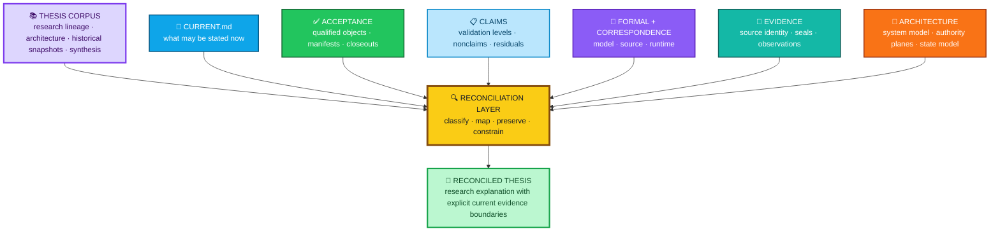
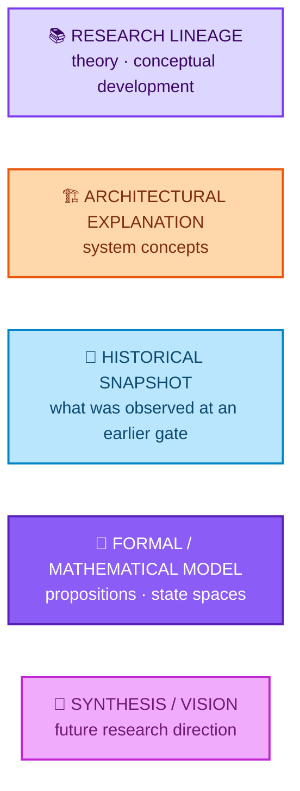
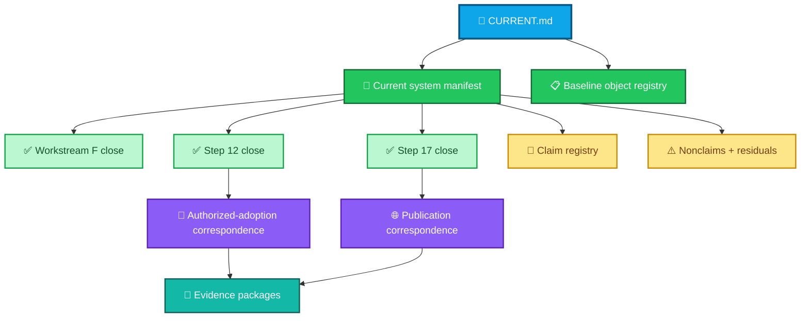
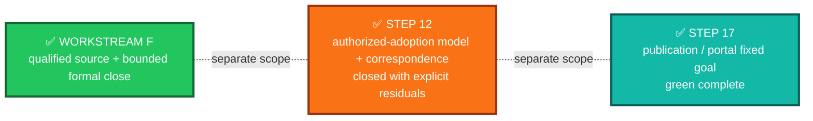
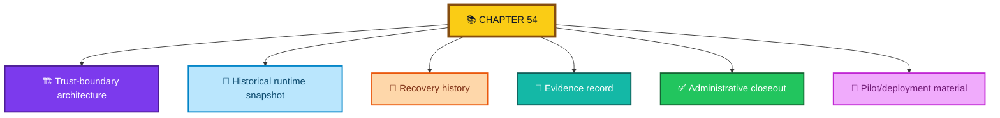
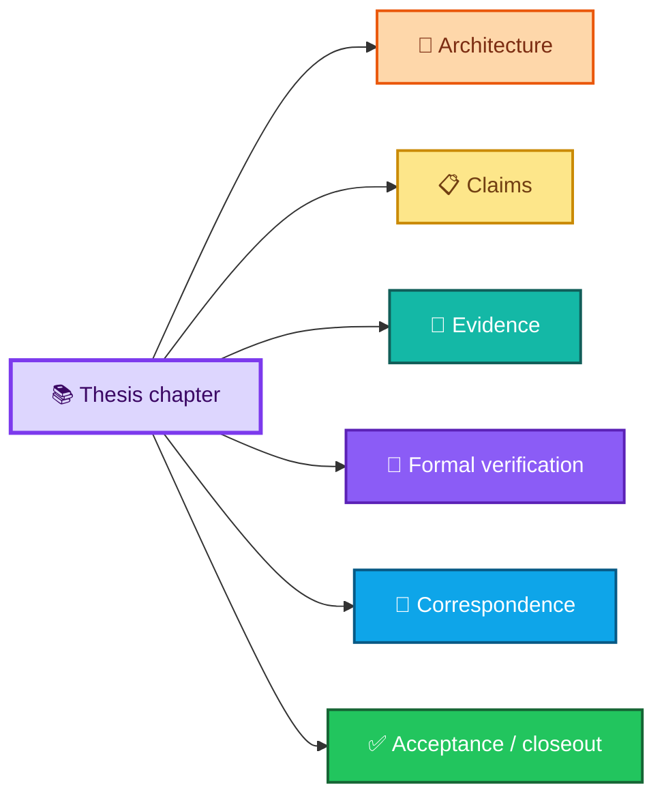
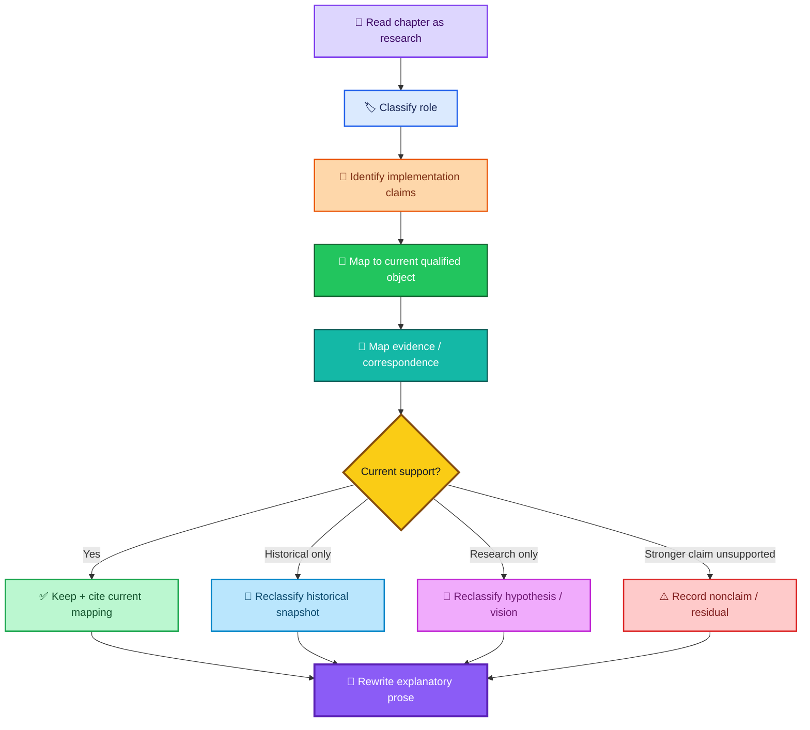

<div align="center">

# ALLIS — Thesis Reconciliation

### Mapping the thesis research corpus to the current qualified ALLIS technical record without turning research history into implementation authority

<br>


<br>

**Kidd’s Technical Services · ALLIS**

</div>

---

> [!IMPORTANT]
> The thesis is a **research, explanatory, and intellectual-lineage record**.
>
> It is not the current implementation authority for ALLIS.
>
> Current technical claims must be assembled from qualified objects, accepted closeouts, evidence, formal results, and explicit correspondence. The thesis may explain those results, interpret them, and trace how the architecture developed, but it does not supersede them.

---

# 👀 Reconciliation in one view



The central relationship is:

```text
thesis
    =
research explanation of ALLIS development

current technical record
    =
authority for present implementation claims
```

---

# 🎯 Purpose

This document defines how the ALLIS thesis corpus should be reconciled with the current technical repository.

It exists to prevent four common errors:

```text
historical implementation
    → accidentally presented as current

research hypothesis
    → accidentally presented as demonstrated

formal model
    → accidentally presented as runtime fact

deployment/use case
    → accidentally presented as the definition of ALLIS
```

The reconciliation preserves the thesis as valuable research while moving current implementation authority into the dedicated ALLIS acceptance, claims, evidence, formal-verification, correspondence, and architecture layers.

---

# 1. Document role

```text
Document role:
Research reconciliation

Primary source:
Thesis corpus through Chapter 55 + Appendix A

Current technical comparison:
ALLIS current-state repository

Purpose:
Map, preserve, qualify, and constrain thesis claims

Operational authority:
NONE

Implementation authority:
NONE

Whole-system proof:
SYSTEM_PROVEN=NO
```

This document is not a rewrite of the thesis.

It is the crosswalk that determines how later thesis revisions should treat the current technical record.

---

# 2. Controlling rule

The reconciliation follows the same rule as ALLIS itself:

> **State does not become authority merely because it exists.**

Applied to research documentation:

```text
a chapter exists
    ≠
the chapter is current implementation authority
```

```text
a chapter contains code-era observations
    ≠
those observations remain current
```

```text
a theorem is described
    ≠
the theorem is proven
```

```text
a proof exists
    ≠
runtime correspondence exists
```

```text
a pilot is described
    ≠
the pilot defines ALLIS
```

---

# 3. The thesis remains valuable

The thesis is not obsolete.

Its continuing value is substantial.

It preserves:

- the intellectual development of ALLIS;
- Quantarithmia and early theoretical framing;
- the evolution of GBIM/state-space thinking;
- early memory and RAG architecture;
- the progression toward governed state;
- the emergence of geographic, person-linked, and temporal state;
- the development of constitutional and authority boundaries;
- the progression from candidate state toward governed promotion;
- the emergence of formal and mathematical models;
- the development of the Commons and community-governance ideas;
- the evolution of temporal governance;
- the research synthesis that later became clearer in the current ALLIS architecture.

The problem is not the thesis's intellectual value.

The problem is **authority mixing**.

---

# 4. The thesis has multiple document roles

The corpus should not be treated as one homogeneous technical specification.

It contains at least five document roles:



One chapter can contain more than one role.

That is especially true of Chapter 54.

---

# 5. Recommended thesis status classes

Every reconciled thesis chapter should be classifiable as one or more of:

| Status | Meaning |
|---|---|
| 🟣 **RESEARCH_LINEAGE** | Explains how the research idea developed |
| 🟠 **ARCHITECTURAL_EXPLANATION** | Explains a design concept that still maps to current architecture |
| 🔵 **HISTORICAL_SNAPSHOT** | Records a bounded earlier implementation/gate |
| 🟢 **CURRENTLY_GROUNDED** | Has a current qualified technical mapping |
| 🟡 **PARTIALLY_GROUNDED** | Some concepts map to current evidence; stronger claims do not |
| 📐 **FORMAL_MODEL** | Mathematical/formal object; proof status must remain explicit |
| 🔭 **VISION_SYNTHESIS** | Proposed synthesis or future research direction |
| 🔴 **REWRITE_REQUIRED** | Contains stale implementation or authority claims that need correction |

These are research-document classifications.

They are not runtime states.

---

# 6. Current technical authority order

When a thesis statement conflicts with the current repository, use this precedence:

```text
1. CURRENT.md
2. acceptance/current-system-manifest.md
3. acceptance/baseline-object-registry.md
4. claims/claim-registry.md
5. claims/nonclaims-and-residuals.md
6. accepted workstream closeouts
7. formal-verification records
8. correspondence records
9. evidence records
10. architecture documents
11. thesis / historical research prose
```

This order prevents the thesis from becoming a parallel source of current implementation truth.

---

# 7. Current technical record

The reconciled thesis should understand the current ALLIS repository as a composite record.



The thesis should explain this record.

It should not replace it.

---

# 8. Validation hierarchy

The reconciled thesis should use the current validation hierarchy consistently:

```text
Implemented
    ↓
Observed
    ↓
Demonstrated
    ↓
Formally Specified
    ↓
Proven
    ↓
Machine-Checked
    ↓
Correspondence-Verified
```

These terms are not synonyms.

---

# 9. Validation rules

```text
implemented
    ≠
observed
```

```text
observed
    ≠
demonstrated
```

```text
formally specified
    ≠
proven
```

```text
proven
    ≠
machine-checked
```

```text
machine-checked
    ≠
source/runtime correspondence
```

```text
correspondence-verified for a bounded claim
    ≠
whole-system proof
```

---

# 10. Current qualified object model

The thesis must no longer imply that one Git object is the universal current ALLIS baseline.

The current technical record uses role-scoped objects.

| Role | Current reference |
|---|---|
| Workstream-F qualified baseline | `65b9f7dbd594ec9d225152aabd705eefc9216dbb` |
| A5 proof/source anchor | `35f1aa5586e1a23e1ab88f4d757c451b44506893` |
| A5 tree | `36dd9f2425db4b23bacfce1cb258603cace25f1b` |
| Step-12 production source | `20c8cbe175781c8a1c05d65c03977859ceca884a` |
| Step-12 public verification trust | `4809a1af3dd8fad1767dc5a8a9d67aa763388a055e00ec818c15f9fe0321fbb5` |
| Step-12 governance view | `26523c0bad40ff06a75c62a802f20195295534764dce45cfa6acdcdaecc3fcc2` |
| Step-12 final evidence seal | `b00a954a924d3aa3490a5bcb8d4473da2b6885b8c41e116cf03545fee975c23b` |
| Step-17 publication ID | `allis-publication-step6-retention-v2` |
| Step-17 publication body SHA-256 | `d6ab63522f9080fae440578ebbb6ed42140595155c9a30253f5b8eeeef8009b7` |
| Step-17 payload SHA-256 | `04ebb5bc1f97cbf56b8722fea9bcc7e7303cac2f5b467510d7a821d84d4a3c3c` |
| Step-17 frontend build | `5By6R3CWTM7NDXc-4lmSi` |

No thesis chapter should silently collapse these into one source identity.

---

# 11. Research corpus structure

The thesis now extends through:

```text
Chapter 55
+
Appendix A
+
front matter
+
empirical / supporting research material
```

The broad research sequence is:

| Range | Primary research role |
|---|---|
| **01–10** | Theory, Quantarithmia, GBIM, Hilbert/state-space framing, RAG, entanglement, DGM, WOAH |
| **11–18** | Computational/cognitive architecture, gateway, neurobiological organization, introspection, safeguards, executive coordination, metaphor limits |
| **19–31** | Infrastructure and operations, containers, evaluation, memory, identity retention, feedback, time, web research, heartbeat, PIA, Appalachian corpus, MountainShares |
| **32–43** | Optimization, judges, identity, constitutional/external authority, audit, validation, cryptographic/security, role-gated access |
| **44–53** | Measured/formal state structures, Phi, H_geo, tensor bridge, H_people, temporal state, direct-sum memory, Commons, recurrent epistemic loop, spacetime contract |
| **54** | Production trust-boundary + recovery + administrative closeout material |
| **55** | Synthesis / vision: coupled linear and cyclic time |
| **Appendix A** | Governed-state / admissibility mathematics and verification contract |

This sequence is best read as **chronological research development**, not as evidence that later chapter numbers automatically represent stronger validation.

---

# 12. Central intellectual through-line

The current architecture makes one thesis-wide idea much clearer:

> **State does not become authority merely because it exists.**

The thesis expresses that principle in many earlier forms:

```text
retrieved state
    ≠
admitted evidence
```

```text
candidate conclusion
    ≠
promoted memory
```

```text
identity
    ≠
authorization
```

```text
semantic similarity
    ≠
geographic truth
```

```text
private user state
    ≠
commons state
```

```text
caller identity
    ≠
operation authority
```

```text
formal model
    ≠
qualified implementation
```

The reconciled thesis should surface this as a unifying principle without rewriting the history to pretend the principle was always expressed in its final form.

---

# 13. Entity separation

The reconciled thesis must maintain these boundaries:

```text
ALLIS
    =
KTS governed computational / knowledge / location-intelligence platform
```

```text
Ms. Allis
    =
intelligence-facing governed analytical/advisory service operating through ALLIS
```

```text
MountainShares / The Commons
    =
separate community governance / economic systems that may use ALLIS
```

```text
deployment or pilot
    =
bounded use case / instantiation of ALLIS
```

These are related systems.

They are not synonyms.

---

# 14. Ms. Allis reconciliation rule

Older thesis material often describes the system through Ms. Allis.

Current architecture should instead distinguish:

```text
Ms. Allis can:
    interpret
    reason
    explain
    propose
    request governed operations
```

from:

```text
ALLIS governs:
    protected admission
    state transition
    retention
    disclosure
    operation authority
    publication
    evidence
```

The thesis may preserve the earlier Ms. Allis framing as research history, but current explanatory text should not make Ms. Allis synonymous with ALLIS.

---

# 15. MountainShares reconciliation rule

MountainShares is not the ALLIS architecture.

Thesis chapters that treat MountainShares as central should be reframed as:

```text
application / governance context
```

rather than:

```text
system definition
```

A MountainShares use case can demonstrate or motivate ALLIS concepts without defining ALLIS ownership, architecture, or universal governance.

---

# 16. Deployment reconciliation rule

A pilot or place-based project must remain:

```text
deployment
```

not:

```text
ALLIS
```

Current project-specific material belongs in deployment examples and project repositories.

The thesis can discuss pilots as case studies.

---

# 17. Historical-gate rule

The July 2026 gate should be treated as an immutable historical research snapshot.

Do not continuously rewrite July observations into present-tense current-state claims.

Use:

```text
At the July 2026 gate...
```

or:

```text
The July 2026 snapshot demonstrated...
```

not:

```text
ALLIS currently...
```

unless current qualified evidence independently establishes the same claim.

---

# 18. Missing historical gate artifacts

Earlier thesis overview material references items such as:

```text
chapter_closure_index.md

overview_docs_gate_20260722_090900.md
```

Those references should not be treated as current authority where the referenced artifacts are not present in the reconciled research package.

The reconciliation should either:

- point to a preserved historical gate artifact if it is later restored;
- or state that the reference is historical and unavailable in the present public package.

Do not reconstruct missing gate artifacts from memory.

---

# 19. Historical topology rule

Older thesis material includes implementation snapshots such as:

- historical container counts;
- historical service inventory;
- historical slot/topology counts;
- historical routing architecture;
- historical database/runtime state.

These are valuable evidence of development.

They should be described as snapshots, not current architecture.

---

# 20. Terminology normalization

The thesis contains terminology drift.

The reconciled corpus should establish a terminology registry for recurring terms.

One especially important example is **GBIM**.

Different historical files have expanded the acronym differently.

The thesis should select one canonical expansion for current explanatory use and preserve older variants only when quoting or discussing historical documents.

Do not silently mix distinct expansions as though they are equivalent.

---

# 21. Validation-language normalization

The thesis should avoid broad words such as:

```text
verified
proven
operational
live
complete
production
```

without identifying:

```text
what was verified
over what domain
against which object
at what time
by which method
with what residuals
```

---

# 22. Current workstream model

The thesis should recognize three separately closed technical workstreams:



Closure of one workstream does not silently promote another.

---

# 23. Workstream-F thesis mapping

Workstream F establishes a bounded accepted source and formal close.

The thesis may use it when discussing:

- qualified source identity;
- bounded proof closure;
- acceptance discipline;
- authority to close;
- nonmutation during close.

It should not use Workstream-F closure as evidence that:

```text
all ALLIS behavior is proven
```

---

# 24. A5 thesis mapping

The A5 tract supplies a bounded formal/source anchor.

Current bounded results include:

```text
102 CFG nodes
107 CFG edges
0 unsupported control flow

76 broad effect candidates
47 source-bound / structural candidates
29 unresolved source symbols
```

The thesis must preserve the current boundary:

```text
effect-sink adjudication incomplete

dominance / cut theorem not yet performed

mathematical proof not yet completed

machine-checked theorem for this tract not yet established

runtime/system correspondence not established
```

The 29 unresolved symbols are not automatically counterexamples.

The 47 reduced candidates are not automatically final protected effect sinks.

---

# 25. Step-12 thesis mapping

Step 12 is the strongest current bounded example of governed write authority / authorized adoption.

It establishes:

```text
12 propositions
11 proven
1 disproven

15 formal obligations
0 unadjudicated
```

but retains explicit residuals.

---

# 26. Step-12 validation boundary

The thesis should distinguish:

```text
T12D-A
    =
Machine-Checked
```

from:

```text
T12D-B / T12D-C
    =
Correspondence-Verified
```

and:

```text
P12C-09
    =
Machine-Checked Disproven
```

Do not rewrite all Step-12 propositions as equally correspondence-verified.

---

# 27. Step-12 terminalization correction

The thesis must preserve the formal correction:

```text
Claimed
    ≠
guaranteed Completed or Rejected
```

A claimed record can remain nonterminal if terminalization fails.

This means recovery state belongs in the research model.

---

# 28. Step-12 positive-production boundary

The positive production authorization/application path was not observed as a real positive production apply in the bounded closeout.

Therefore:

```text
machine-checked positive path
    ≠
observed positive production mutation
```

---

# 29. Step-12 global boundaries

The thesis must preserve:

```text
PRODUCTION_MUTATION_SAFETY_THEOREM_PROVEN=NO

WHOLE_SYSTEM_SAFETY_THEOREM_PROVEN=NO

SYSTEM_PROVEN=NO
```

These are not signs that the bounded work failed.

They define the current proof scope.

---

# 30. Step-17 thesis mapping

Step 17 supplies the current bounded example of governed outward publication and read-only public delivery.

Its fixed-goal chain is:

```text
qualified controlled state
    ↓
governed publication
    ↓
immutable publication identity
    ↓
isolated loopback publication service
    ↓
authorized public route
    ↓
public HTTPS publication
    ↓
Evidence & Governance Portal consumption
```

---

# 31. Step-17 current result

The bounded final state includes:

```text
STEPS_0_THROUGH_17_GREEN=YES

FINAL_CRITERIA=25_OF_25_PASS

FINAL_NETWORK_CONTINUITY=GREEN

ALLIS_LIVE_PUBLICATION_ENDPOINT=COMPLETE

ALLIS_EVIDENCE_GOVERNANCE_PORTAL=LIVE
```

The thesis may explain this result as a bounded publication workstream.

---

# 32. Publication correspondence remains temporal

The thesis must not imply:

```text
corresponded once
    =
corresponds forever
```

The current rule is:

```text
correspondence at observation time τ
    ≠
perpetual correspondence
```

A claim-bearing change requires renewed evidence.

---

# 33. Publication identity vs source identity

The thesis should distinguish:

```text
source identity
```

from:

```text
publication identity
```

from:

```text
publication-body identity
```

from:

```text
frontend build identity
```

These are different objects.

---

# 34. H_people reconciliation

The thesis contains substantial person-linked/private-state research.

Current public architecture supports a privacy/disclosure boundary.

It does not justify promoting historical Gate05c runtime state into current runtime-authoritative H_people claims.

---

# 35. H_people current architectural rule

The thesis should preserve:

```text
information exists
    ≠
identity established
```

```text
identity
    ≠
use authority
```

```text
use authority
    ≠
disclosure authority
```

```text
disclosure
    ≠
retention authority
```

```text
private continuity
    ≠
public publication
```

---

# 36. Historical H_people runtime

Historical Gate05c evidence can remain in the thesis as a historical implementation record.

It should not be rewritten as current runtime state unless current qualification and correspondence establish it.

The reconciled language should use:

```text
historical implementation / snapshot
```

rather than:

```text
current runtime authority
```

---

# 37. Private projection rule

Where private continuity is authorized, it remains recipient-specific and purpose-specific.

It does not automatically enter:

- common packets;
- public RAG;
- public evidence;
- H_geo;
- shared research context;
- public publication;
- unrelated model lanes.

The thesis should not use "memory" as though all stored personal information is globally available system context.

---

# 38. Fail-closed reconciliation

The thesis should use the standardized semantic classes:

```text
BLOCKED / DENIED

WITHHELD / NOT_AUTHORIZED

UNAVAILABLE

GOVERNED_DEGRADED

UNRESOLVED

NOT_APPLICABLE

TIMED_OUT
```

and preserve:

```text
PASS_EMPTY

CLAIMED
```

where relevant.

---

# 39. Fail-closed terms are not synonyms

```text
DENIED
    ≠
UNAVAILABLE
```

```text
WITHHELD
    ≠
NO_DATA
```

```text
UNRESOLVED
    ≠
DISPROVEN
```

```text
NOT_APPLICABLE
    ≠
PASS
```

```text
CLAIMED
    ≠
COMPLETED
```

---

# 40. Thesis rewrite strategy

Do not rewrite all chapters as though they are present-tense as-built technical documents.

Use a layered rewrite strategy:

```text
PRESERVE
    research idea / historical narrative

ANNOTATE
    historical implementation state

MAP
    current architecture or evidence

CONSTRAIN
    stronger claims not supported

UPDATE
    current terminology and cross-references
```

---

# 41. Recommended chapter metadata

A reconciled chapter can use a header such as:

```yaml
thesis_reconciliation:
  document_type: thesis-chapter
  research_role:
    - RESEARCH_LINEAGE
    - ARCHITECTURAL_EXPLANATION

  system_state: HISTORICAL_AND_EXPLANATORY

  current_implementation_authority: false

  current_evidence_links:
    - ../ALLIS-repository/path

  current_claim_boundary:
    system_proven: false

  historical_snapshots:
    - 2026-07

  last_reconciled_against:
    - CURRENT.md
    - acceptance/current-system-manifest.md
    - claims/claim-registry.md
```

The exact schema can evolve.

The core purpose is to stop research prose from being misread as current runtime authority.

---

# 42. Chapter-level reconciliation map

The following registry maps the thesis sequence to the current ALLIS record.

Where a chapter has no current qualified implementation mapping, the correct status is **research/architectural**, not an invented implementation claim.

---

## Chapters 01–10 — theory and early architecture

| Thesis file / concept | Research role | Current mapping | Reconciliation action |
|---|---|---|---|
| `01-quantarithmia.md` | Research lineage / theory | Current governing-state principles, state/authority separation | Preserve theory; do not present conceptual mathematics as current runtime proof |
| `01-researcher-position.md` | Researcher positionality / framing | Research layer only | Preserve as positionality; keep separate from technical validation |
| `02-ms-allis-gbim.md` | Early system/GBIM architecture | State model, provenance, governed computation | Reconcile ALLIS vs Ms. Allis; normalize GBIM terminology; remove universal current-runtime implications not supported by current record |
| `03-mountainshares-dao.md` | Application/governance concept | Deployment/external governance context | Explicitly separate MountainShares from ALLIS architecture |
| `04-hilbert-space-state.md` | Mathematical/state-space research | State-model architecture; later A5/formal work only where directly corresponding | Preserve as research formalism; do not imply current theorem/correspondence without specific evidence |
| `05-chromadb-semantic-memory.md` | Historical memory implementation / architecture | Memory/provenance state; private-state boundary | Treat implementation details as historical unless current evidence requalifies them |
| `06-geodb-spatial-body.md` | Spatial architecture / historical implementation | Geographic/spatial state; deployment context | Preserve spatial research; do not treat historical GeoDB state as current runtime authority |
| `07-rag-pipeline-and-routers.md` | Retrieval/routing architecture | Governed computation + system boundary | Reframe direct pipeline language around governed admission and protected transitions |
| `08-quantum-inspired-entanglement.md` | Conceptual/mathematical metaphor | Research layer | Preserve as quantum-inspired abstraction; do not imply physical quantum effect |
| `09-darwin-godel-machines.md` | DGM research lineage | Step-12 governed-evolution package; A5 tract where directly relevant | Map current bounded formal/correspondence results; remove whole-system implications |

---

## Chapters 10–18 — optimization and computational/cognitive architecture

| Thesis file / concept | Research role | Current mapping | Reconciliation action |
|---|---|---|---|
| `10-woah-weighted-optimization-hierarchy.md` | Optimization research | Governed evaluation/candidate state | Preserve as architecture/research unless direct current qualified evidence is cited |
| `11-llm-fabric-of-ms-allis.md` | Intelligence-facing computation | Ms. Allis as intelligence-facing service | Clarify that model ensemble/reasoning does not create authority |
| `12-neurobiological-architecture.md` | Architectural metaphor | System/computation architecture | Preserve metaphor; do not imply biological equivalence |
| `13-qualia-engine-and-introspective-state.md` | Research metaphor / introspection | Candidate/semantic state where conceptually relevant | Preserve as research; avoid consciousness or phenomenology claims unsupported by evidence |
| `14-hippocampus-and-memory-consolidation.md` | Memory metaphor / architecture | Memory/provenance + private-state boundary | Reframe consolidation as governed retention/promotion |
| `15-pituitary-and-global-modes.md` | Coordination metaphor | Governance/state coordination | Preserve metaphor as explanatory only |
| `16-blood-brain-barrier-and-safeguards.md` | Safeguard architecture | Inward authority, fail-closed semantics, protected boundaries | Map current architectural boundary; historical service behavior remains historical |
| `17-executive-coordination-overview.md` | Coordination architecture | System boundary; Ms. Allis vs ALLIS | Clarify intelligence-facing coordination vs system authority |
| `18-limits-and-evaluation-of-metaphor.md` | Methodological constraint | Research reconciliation itself | Preserve strongly; use to prevent metaphor from becoming implementation claim |

---

## Chapters 19–31 — infrastructure, memory, temporal, and application context

| Thesis file / concept | Research role | Current mapping | Reconciliation action |
|---|---|---|---|
| `19-container-architecture-and-routing.md` | Historical runtime topology | Evidence/correspondence only where current | Preserve as historical snapshot; remove "current definitive topology" framing |
| `20-first-stage-evaluation.md` | Evaluation methodology | Validation hierarchy / evidence model | Normalize validation terminology |
| `21-background-store-and-patterns.md` | Memory architecture | Memory/provenance state | Reconcile retention and promotion authority |
| `22-identity-focused-retention.md` | Person-linked memory research | H_people/private-state boundary | Apply current identity/use/disclosure/retention separations |
| `23-dual-tracks-meaning-and-analysis.md` | Computational architecture | Governed computation / evidence distinction | Preserve conceptual split; map only where current evidence supports |
| `24-feedback-into-broader-layers.md` | Feedback architecture | Governed state transitions | Ensure feedback does not imply automatic promotion |
| `25-consciousness-coordinator-and-services.md` | Historical naming / coordinator architecture | Ms. Allis intelligence-facing service | Replace authority implications; preserve metaphor/history |
| `26-temporal-toroidal-semaphore-structure.md` | Temporal research | Temporal state; authority lifecycle | Preserve as temporal mechanism/research; do not claim sole system authority or physical time structure |
| `27-web-research-and-autonomy.md` | External retrieval / autonomy research | Governed computation + external authority | "Autonomy" must remain bounded by authority planes |
| `28-heartbeat-and-live-cycles.md` | Runtime liveness / temporal operations | Runtime evidence / temporal state | Historical runtime observations remain snapshots |
| `29-psychological-safeguards-and-pia.md` | Safeguard/privacy research | Private-state boundary, fail-closed architecture | Preserve normative design; separate architecture from current runtime status |
| `30-aapcappE-scraper-and-corpus.md` | Data/corpus acquisition | Provenance + deployment data | Treat data-source state as historical unless requalified |
| `31-mountainshares-and-infrastructure.md` | Deployment/application context | Deployment model / external governance | Separate MountainShares infrastructure from ALLIS platform definition |

---

## Chapters 32–43 — governance, identity, validation, and security

| Thesis file / concept | Research role | Current mapping | Reconciliation action |
|---|---|---|---|
| `32-fractal-optimization-and-dgms.md` | DGM/optimization research | Step-12 and A5 only where direct mapping exists | Do not promote bounded DGM proof into whole-system theorem |
| `33-llm-ensemble-and-judges.md` | Deliberation/evaluation architecture | Governed computation / candidate evaluation | Explicitly state judges evaluate; they do not create operation authority |
| `34-spiritual-root-and-mother-carrie.md` | Values / narrative / researcher framing | Research layer only | Keep separate from technical evidence and formal validation |
| `35-swarm-functions-and-eternal-watchdogs.md` | Monitoring/coordination research | Historical runtime / monitoring concept | Current runtime status must come from current evidence, not chapter prose |
| `36-identity-and-registration.md` | Identity architecture | H_people/private-state boundary | **High-priority rewrite**: historical identity runtime must not become current H_people authority |
| `37-constitutional-principles-service.md` | Governance architecture | Trust/authority; external authority; fail-closed semantics | Map architectural principles; separate policy existence from operation authority |
| `38-external-communication-and-authority.md` | External authority research | System boundary + trust/authority | Strong current architectural mapping; preserve external authority as external |
| `39-operational-evaluation.md` | Evaluation methodology | Claims/evidence/validation hierarchy | Update terminology and current evidence links |
| `40-system-audit-and-operational-validation.md` | Historical audit / validation | Evidence and correspondence | **High-priority rewrite**: separate historical audit results from current runtime |
| `41-test-harness-and-continuous-validation.md` | Test methodology | Evidence/correspondence/revalidation | **High-priority rewrite** where older runtime state is embedded |
| `42-Post-Quantum Security Layer.md` | Security architecture / historical implementation | Trust-anchor/evidence only where current | Preserve research/security design; avoid universal current-security claim |
| `43-Role-Gated Knowledge Access.md` | Authorization/privacy architecture | Inward authority + H_people + fail-closed semantics | **High-priority rewrite** where older role/runtime state is presented as current |

---

## Chapters 44–53 — formal/measured state structures

| Thesis file / concept | Research role | Current mapping | Reconciliation action |
|---|---|---|---|
| `44-Phi Probe — Semantic Coherence Measurement in H_App.md` | Measurement/formal research | Evidence maturity / semantic state | Preserve as measurement research; identify protocol and qualified-object limitations |
| `45-H_geo — The Spatial Hilbert Body of H_App.md` | Spatial formalism | Geographic/spatial state architecture | Preserve formal model; do not imply source/runtime correspondence unless separately established |
| `46-The Tensor Product Bridge — H_App ⊗ H_geo.md` | Coupled-state formalism | State model + governed promotion | Preserve provisional-state/promotion insight; avoid universal proof claims |
| `47-Hilbert People Space Without Surveillance.md` | Privacy/person-state research | H_people/private-state boundary | **High-priority rewrite**: current architecture maps strongly; historical runtime claims remain historical |
| `48-Hilbert People Space.md` | Person-linked formal state | H_people/private-state boundary | **High-priority rewrite**: do not promote historical Gate05c runtime to current authority |
| `49-The Temporal Hilbert Axis and the Three-Dimensional Memory of H_App.md` | Temporal/memory formalism | Temporal state + memory/provenance | Preserve as research/formalization; distinguish mechanism from demonstrated causal benefit |
| `50-Per-User Direct Sum Decomposition of Conversational Memory.md` | Sovereign/per-user memory formalism | Private-state boundary / recipient-specific projection | Preserve privacy architecture; current runtime status must be separately evidenced |
| `51-The Community Hilbert Commons — Anonymized Aggregation Over Sovereign Subspaces` | Commons formalism / governance | External community-governance context + privacy boundary | Separate Commons governance from ALLIS core; preserve bounded historical evidence and unresolved formal claims |
| `52-The Recurrent Epistemic Loop.md` | Epistemic-learning architecture | Validation/revalidation concepts; state lifecycle | Treat as architectural research unless individual mechanisms have current evidence; do not imply one monolithic current loop |
| `53-The Spacetime Contract.md` | Place/time/provenance formalization | Geographic + temporal + provenance state | Preserve as synthesis/formal architecture; current implementation claims require explicit correspondence |

---

## Chapters 54–55 and Appendix A

| Thesis file / concept | Research role | Current mapping | Reconciliation action |
|---|---|---|---|
| `54-pilot trust-boundary.md` | Historical snapshot + trust-boundary specification + recovery report + administrative closeout | Current system boundary, trust/authority, closeouts, evidence | **Highest-priority structural rewrite**: remove current-status authority from chapter; retain research interpretation and historical evidence references |
| `55 — Coupled Linear and Cyclic Time.md` | Synthesis / vision | Temporal state + authority lifecycle + recurrent evaluation | Preserve as research synthesis; no physical two-time claim; scheduler/cycle does not become sole authority |
| `Appendix A - Governed State Mathematics.md` | Formal verification contract / admissibility mathematics | Current validation hierarchy, claim registry, formal-verification, correspondence | Preserve mathematical framework; replace stale July runtime assumptions with explicit historical-snapshot references; distinguish formal model from current correspondence |

---

# 43. High-priority rewrite set

The chapters with the largest current-state drift should be reviewed first:

```text
36
37
40
41
43
47
48
54
```

This does not mean those chapters are invalid.

It means they contain the highest risk of mixing:

```text
historical implementation
+
current architecture
+
current authority
```

without enough separation.

---

# 44. Chapter 54 requires structural treatment

Chapter 54 is not functioning as only a thesis chapter.

It contains several document roles:



The reconciled chapter should become primarily an **interpretive research chapter**.

Current operational status belongs in the ALLIS repository.

---

# 45. Chapter 54 rewrite rule

Retain:

- why the trust boundary was needed;
- what failure modes were discovered;
- what the recovery process taught;
- how authority separation evolved;
- how pilot boundaries shaped the architecture;
- how the research changed as evidence matured.

Move or replace current-status declarations with links to:

- `CURRENT.md`;
- closeout records;
- current evidence;
- current correspondence;
- current architecture.

---

# 46. Chapter 55 interpretation

Chapter 55 should be treated as a synthesis chapter.

Its useful research contribution is the distinction among temporal behaviors and their coupling.

It should not be read as:

- proof of a new physical theory of time;
- proof that one scheduler governs ALLIS;
- proof that cyclic control creates operation authority;
- proof that temporal formalism is fully runtime-correspondent.

---

# 47. Linear and cyclic time reconciliation

A safe current reading is:

```text
linear temporal register
    =
ordered state / provenance / lifecycle progression
```

```text
cyclic temporal structure
    =
recurring evaluation / maintenance / governance processes
```

```text
coupling
    =
governed interaction among state progressions and recurrent review
```

Authority remains a separate dimension.

---

# 48. Appendix A role

Appendix A should remain a **formal verification and admissibility contract**.

It is not a runtime inventory.

Its strongest continuing value is methodological:

```text
define the state
define the admissibility condition
define the proof obligation
identify evidence
identify discrepancy
preserve what is not demonstrated
```

---

# 49. Appendix A historical implementation material

Appendix A includes historical runtime examples and July 2026 observations.

Those should be labeled:

```text
historical verification snapshot
```

rather than used as current implementation authority.

---

# 50. Appendix A and current proof language

Appendix A should adopt the current validation hierarchy.

For each formal statement, distinguish:

```text
formal definition
proposition
proof
machine check
source correspondence
runtime correspondence
```

Do not let one stand in for another.

---

# 51. Formal mathematics vs architecture

The thesis frequently uses Hilbert-space, tensor, geometric, and mathematical language.

Reconciliation should classify each use as one of:

```text
formal mathematical definition

computational representation

architectural abstraction

analogy / metaphor

empirical hypothesis
```

Do not allow the reader to infer which category applies.

---

# 52. Quantum-inspired terminology

Where the thesis uses "quantum-inspired," "entanglement," Hilbert space, or tensor-product language:

- preserve mathematical structure where it is genuinely mathematical;
- preserve metaphor where it is metaphor;
- avoid claims of physical quantum behavior unless separately demonstrated;
- avoid treating mathematical elegance as runtime evidence.

---

# 53. Neurobiological terminology

Terms such as:

- hippocampus;
- pituitary;
- blood-brain barrier;
- consciousness coordinator;
- qualia;
- swarm/watchdog;

can remain part of the historical architecture vocabulary.

The reconciled thesis should mark them as:

```text
architectural analogy / service naming
```

unless a chapter is explicitly making a separately supported scientific claim.

---

# 54. Spiritual and values material

Values-oriented and spiritual material belongs to:

```text
researcher position
values
ethical framing
design motivation
```

It should remain distinct from:

```text
formal proof
runtime evidence
scientific demonstration
technical authority
```

This separation protects both the values narrative and the technical record.

---

# 55. Empirical measurements

Empirical measurements in the thesis should identify:

```text
protocol
qualified object
model/source identity
sample
time
metric
interpretation
correspondence
```

A result without this context should be treated as historical or preliminary evidence.

---

# 56. Perplexity evidence

The historical scored perplexity CSV is empirical evidence.

It should not be promoted beyond the evidence available for:

- protocol;
- qualified source/model identity;
- reproducibility;
- current correspondence.

The thesis can preserve the result while explicitly labeling the evidence boundary.

---

# 57. Current architecture crosswalk

| Thesis concept | Current ALLIS architecture |
|---|---|
| State/admissibility | `architecture/state-models/state-model-overview.md` |
| Protected transition authority | `architecture/authority-planes.md` |
| Trust/identity/authorization | `architecture/trust-and-authority/trust-and-authority-overview.md` |
| System boundary | `architecture/system-boundary/allis-system-boundary.md` |
| Fail-closed semantics | `architecture/fail-closed-semantics.md` |
| H_people/private state | `architecture/private-state/h-people-boundary.md` |
| Deployment/pilot separation | `architecture/deployment-model/deployment-model-overview.md` |
| New River Gorge deployment example | `architecture/deployment-model/examples/new-river-gorge-deployment-example.md` |

The architecture files explain the current model.

They do not independently establish runtime state.

---

# 58. Current acceptance crosswalk

| Thesis question | Current record |
|---|---|
| What is current? | `CURRENT.md` |
| Which qualified objects compose current state? | `acceptance/current-system-manifest.md` |
| Which reference object applies to a scope? | `acceptance/baseline-object-registry.md` |
| Why is an object qualified? | `acceptance/qualified-baseline/qualified-baseline-manifest.md` |
| What bounded workstream closed? | `acceptance/closeout/` |

---

# 59. Current claims crosswalk

| Thesis question | Current record |
|---|---|
| What exact claim is supported? | `claims/claim-registry.md` |
| What stronger claim is not supported? | `claims/nonclaims-and-residuals.md` |
| What validation level applies? | Claim registry entry |
| Is correspondence required? | Claim registry + correspondence record |
| Is the claim point-in-time? | Claim/correspondence observation boundary |

---

# 60. Current Step-12 crosswalk

Use:

```text
acceptance/closeout/dgm-step12-close.md

formal-verification/authorized-adoption/formal-model.md

formal-verification/authorized-adoption/theorem-registry.md

formal-verification/authorized-adoption/counterexample-registry.md

correspondence/authorized-adoption/model-to-source.md

correspondence/authorized-adoption/source-to-runtime.md

evidence/governed-evolution/
```

for current Step-12 claims.

Do not reconstruct Step-12 truth from thesis prose.

---

# 61. Current publication crosswalk

Use:

```text
acceptance/closeout/publication-step17-close.md

correspondence/publication/source-to-publication-to-http-to-gui.md

evidence/publication/
```

for current publication claims.

Do not use old thesis frontend/deployment statements as the current publication record.

---

# 62. Research claim classes

Every significant thesis claim should be classifiable as:

```text
CONCEPTUAL

ARCHITECTURAL

HISTORICAL_OBSERVATION

EMPIRICAL

FORMAL_SPECIFICATION

PROVEN

MACHINE_CHECKED

CORRESPONDENCE_VERIFIED

VISION
```

A claim can have only the strongest level actually supported by its evidence.

---

# 63. Current-state rewrite pattern

Replace broad present-tense statements such as:

```text
Ms. Allis uses X in production.
```

with one of:

```text
The July 2026 snapshot observed X.
```

or:

```text
The architecture defines X.
```

or:

```text
The current qualified record demonstrates X within scope S.
```

or:

```text
X remains a research hypothesis.
```

The choice depends on evidence.

---

# 64. Historical snapshot pattern

For older implementation evidence:

```markdown
### Historical implementation snapshot

At the July 2026 gate, the documented implementation included ...

This snapshot is preserved as historical evidence.

Current implementation status is defined by the ALLIS current-state and evidence records.
```

---

# 65. Current evidence pattern

For a claim with a current mapping:

```markdown
### Current technical mapping

The current ALLIS record supports the following bounded result:

- claim:
- qualified object:
- validation level:
- evidence:
- correspondence:
- observation boundary:
- stronger claim not supported:
```

---

# 66. Vision pattern

For research synthesis:

```markdown
### Research status

This section is a research synthesis / hypothesis.

It is not presented as current implementation state or whole-system proof.

Current technical status is defined separately by the ALLIS repository.
```

---

# 67. Formal-model pattern

For mathematical material:

```markdown
### Formal status

- object:
- domain:
- assumptions:
- proposition:
- proof status:
- machine-check status:
- source correspondence:
- runtime correspondence:
- residuals:
```

---

# 68. Thesis cross-references should point outward

The thesis should increasingly link to the technical repository instead of duplicating operational records.



The thesis interprets.

The technical repository substantiates.

---

# 69. Do not duplicate live status into the thesis

Avoid maintaining two independent copies of:

- current source identity;
- current runtime identity;
- current publication identity;
- service status;
- network status;
- current residual list;
- current correspondence result.

The thesis should link to those records.

This reduces future drift.

---

# 70. Preserve historical evidence rather than deleting it

When a chapter contains an old implementation state:

```text
do not erase it
```

Instead:

```text
label it
date it
scope it
link current state separately
```

Research history is valuable.

---

# 71. Preserve contradictions as research evidence

If a later workstream disproves an earlier claim, the earlier claim should not disappear without explanation.

The thesis can say:

```text
Earlier model:
X

Later formal result:
not X / narrower X

Research consequence:
state model expanded to represent Y
```

P12C-09 is a strong example.

---

# 72. Preserve disproven results

A disproven proposition is a research result.

It is not documentation failure.

The thesis should preserve:

```text
what was proposed
how it was tested
what counterexample appeared
what architecture changed
```

---

# 73. Preserve negative evidence

Examples include:

- no positive production apply observed;
- universal theorem not established;
- current H_people runtime authority not established;
- point-in-time correspondence only;
- unresolved source symbols.

These boundaries are part of the research record.

---

# 74. Preserve residuals

Residuals should remain tied to the workstream that produced them.

Do not globalize a Step-12 residual into every thesis chapter.

Do not silently erase it either.

---

# 75. Workstream-local vs system-global boundaries

Use:

```text
workstream-local residual
```

for bounded closeout boundaries.

Use:

```text
system-global nonclaim
```

for repository-wide boundaries such as:

```text
SYSTEM_PROVEN=NO
```

---

# 76. Thesis and current system proof boundary

The thesis must preserve:

```text
SYSTEM_PROVEN=NO
```

until a separately qualified whole-system proof exists.

No accumulation of:

- chapters;
- diagrams;
- tests;
- formal fragments;
- deployments;
- successful services;

can silently change that status.

---

# 77. Thesis and deployment success

A successful deployment does not prove:

```text
whole ALLIS correct
```

A successful deployment demonstrates:

```text
bounded behavior under that deployment's conditions
```

---

# 78. Thesis and community governance

Community governance can remain an important research theme.

The thesis should distinguish:

```text
community governance
```

from:

```text
ALLIS technical authority
```

and:

```text
human stewardship
```

from:

```text
system administration
```

---

# 79. Thesis and external authority

The thesis should strongly preserve:

```text
ALLIS can verify / consume external authority
```

without implying:

```text
ALLIS owns the external authority
```

This applies to:

- institutional decisions;
- policy;
- legal authority;
- community governance;
- deployment permissions.

---

# 80. Thesis and semantic commitment

Current Step-12 work sharpened an important research principle:

> **Every authority-bearing semantic input must be cryptographically committed where authorization depends on it.**

The thesis should incorporate this as a later refinement of the governed-state model.

---

# 81. Semantic commitment is not only signature validity

```text
valid signature
    ≠
complete semantic authorization
```

The reconciled research should explain that authorization must bind the relevant decision-bearing semantics.

---

# 82. Thesis and replay authority

Current trust architecture also clarifies:

```text
previously valid authority
    ≠
currently replayable authority
```

One-use authority, reservation, consumption, and spent state should be reflected in any future thesis treatment of operation authority.

---

# 83. Thesis and publication authority

The older thesis largely developed inward and internal state governance before publication became a first-class current boundary.

The reconciled thesis should now recognize:

```text
qualified internal state
    ≠
publication-authorized state
```

Publication is a distinct outward authority plane.

---

# 84. Thesis and read/write symmetry

The current architecture makes a useful duality explicit:

```text
WRITE:
candidate
    ↓
write authority
    ↓
qualified state
```

```text
READ:
qualified state
    ↓
publication authority
    ↓
governed projection
```

This is a strong synthesis point for later thesis revision.

---

# 85. Thesis and recovery semantics

The current formal work shows that a lifecycle can contain a nonterminal recovery state.

The reconciled thesis should model:

```text
claimed
    ↓
terminalization failure
    ↓
recovery required
```

rather than forcing every path into success/rejection.

---

# 86. Thesis and uncertainty

The thesis should preserve uncertainty rather than treating it as an editorial defect.

Valid statuses include:

```text
UNRESOLVED
NOT_PROVEN
NOT_OBSERVED
HISTORICAL_ONLY
BOUNDED_DOMAIN
POINT_IN_TIME_BINDING
```

---

# 87. Thesis and correspondence

When a chapter makes an implementation claim, ask:

```text
Is the formal object connected to source?

Is source connected to runtime?

At what time?

Over what scope?

What changed afterward?
```

If the answer is not available, do not infer correspondence.

---

# 88. Thesis and current publication portal

The current live publication endpoint / Evidence & Governance Portal belongs in current technical documentation.

The thesis can discuss it as:

```text
a later implementation of the outward governed publication model
```

without becoming the primary operational status page.

---

# 89. Thesis and local/private source code

The public thesis and public ALLIS repository do not need to publish private implementation source.

The thesis can describe:

- architecture;
- public-safe identities;
- proof objects;
- evidence;
- correspondence;
- public interfaces.

It should not imply that public documentation is the private implementation repository.

---

# 90. Reconciliation workflow



---

# 91. Rewrite order

When the current technical repository is internally stable, use this thesis rewrite order:

```text
1. front matter / overview files
2. highest-drift chapters
3. Chapters 44–55 + Appendix A
4. governance/authority/security chapters
5. infrastructure/history chapters
6. early theory / architecture chapters
7. final cross-reference and terminology pass
```

This is a reconciliation order, not a claim that early theory matters less.

---

# 92. Why front matter must be corrected

The front matter has historically lagged behind the thesis itself.

A reconciled front door should identify:

```text
55 chapters + Appendix A
```

and should not continue to advertise older chapter counts or missing navigation artifacts.

---

# 93. Front matter should explain document classes

Readers should be told that the thesis contains:

- theory;
- architecture;
- historical system snapshots;
- formal research;
- implementation interpretation;
- synthesis/vision.

This prevents readers from treating every chapter as a current technical specification.

---

# 94. Front matter should link current ALLIS state

The thesis front matter should link readers to the current ALLIS repository for:

- implementation status;
- qualified objects;
- current claims;
- evidence;
- correspondence;
- closeouts.

---

# 95. Front matter should preserve historical provenance

It should also explain that historical implementation details remain intentionally preserved as research evidence.

---

# 96. Chapter rewrite checklist

For each chapter, answer:

```text
What kind of document is this chapter?

Which statements are theoretical?

Which statements are architectural?

Which statements are historical observations?

Which statements are current implementation claims?

Which qualified object supports each current implementation claim?

What validation level applies?

What evidence supports it?

What correspondence is established?

At what observation time?

What stronger claim remains unsupported?

What belongs in current ALLIS docs instead of this chapter?
```

---

# 97. Formal chapter checklist

For mathematical/formal chapters, additionally answer:

```text
What is the formal domain?

What are the symbols?

What is assumed?

What is defined?

What is conjectured?

What is proven?

What is machine-checked?

What corresponds to source?

What corresponds to runtime?

What remains unresolved?
```

---

# 98. Historical snapshot checklist

For historical implementation chapters, answer:

```text
What date/gate does this describe?

What source identity existed?

What runtime was observed?

Which services were running?

Which evidence was available?

Which claims were valid then?

Which claims are now superseded?

What remains historically important?
```

---

# 99. Vision chapter checklist

For synthesis/vision chapters, answer:

```text
What is the hypothesis?

What existing evidence motivated it?

Which mechanisms already exist?

Which mechanisms remain architectural?

Which mechanisms remain proposed?

What test would move the claim forward?
```

---

# 100. Reconciliation categories for stale claims

A stale claim should be handled using one of five actions:

| Action | Use when |
|---|---|
| **UPDATE** | Current evidence supports the same concept but with newer identity/status |
| **HISTORICIZE** | The statement was true/observed at an earlier gate |
| **NARROW** | The old claim was too broad; a bounded version is supported |
| **DOWNGRADE** | The statement is better classified as architecture/hypothesis |
| **RETRACT / CORRECT** | A later result disproves the earlier claim |

Do not use silent deletion as the default.

---

# 101. Example — identity runtime

Old pattern:

```text
The H_people identity service provides current private continuity.
```

Reconciled pattern:

```text
Historical Gate05c work implemented subject-key and identity-related mechanisms.

The current public ALLIS architecture defines the H_people privacy/disclosure boundary, but historical Gate05c runtime state is not current H_people runtime authority.
```

---

# 102. Example — DGM safety

Old pattern:

```text
The DGM proves production mutation is safe.
```

Reconciled pattern:

```text
Step 12 established a bounded authorized-adoption formal model with 11 proven propositions, one machine-checked disproven proposition, and explicit residuals.

A general production mutation safety theorem is not established.
```

---

# 103. Example — terminality

Old pattern:

```text
Every claimed record finishes as completed or rejected.
```

Reconciled pattern:

```text
The bounded formal model disproved unconditional terminal totality.

A record can remain claimed when terminalization fails, creating a recovery state.
```

---

# 104. Example — publication

Old pattern:

```text
The GUI shows ALLIS state.
```

Reconciled pattern:

```text
The bounded Step-17 publication workstream established a governed publication chain from qualified state to immutable publication, public HTTPS delivery, and GUI consumption.

The GUI consumes the governed publication; it does not receive unrestricted direct ALLIS access.
```

---

# 105. Example — MountainShares

Old pattern:

```text
MountainShares is the governance layer of ALLIS.
```

Reconciled pattern:

```text
MountainShares is a separate community governance/economic system that may use ALLIS.

ALLIS technical authority and MountainShares governance authority remain distinct.
```

---

# 106. Example — Ms. Allis

Old pattern:

```text
Ms. Allis controls the system.
```

Reconciled pattern:

```text
Ms. Allis is an intelligence-facing service operating through ALLIS.

Protected transitions remain subject to ALLIS authority boundaries.
```

---

# 107. Example — mathematical model

Old pattern:

```text
The Hilbert construction proves the running system.
```

Reconciled pattern:

```text
The Hilbert construction defines a formal or architectural representation.

Implementation and runtime claims require separately established source and runtime correspondence.
```

---

# 108. Example — cyclic time

Old pattern:

```text
The cyclic scheduler governs all system state.
```

Reconciled pattern:

```text
Cyclic processes can provide recurring evaluation or maintenance.

Authority remains separately governed and is not created by recurrence alone.
```

---

# 109. Research preservation rule

Do not rewrite the thesis into a sterile technical manual.

Preserve:

- intellectual development;
- historical uncertainty;
- failed approaches;
- conceptual breakthroughs;
- evolving vocabulary;
- mathematical exploration;
- research motivation.

Reconciliation should add precision, not erase history.

---

# 110. Current repository should own operational truth

The ALLIS technical repository should own:

```text
current state
qualified object identity
formal status
current residuals
runtime correspondence
publication state
workstream closure
```

The thesis should own:

```text
research interpretation
development history
theory
conceptual synthesis
academic argument
```

---

# 111. Historical gate archive recommendation

If historical gates are later restored into a public research structure, use a dedicated immutable archive.

Conceptually:

```text
research/
└── historical-gates/
    └── 2026-07/
        ├── system-state.md
        ├── service-inventory.md
        ├── evidence-index.md
        └── claim-boundary.md
```

Do not fabricate missing artifacts.

Only add preserved evidence that actually exists.

---

# 112. Research repository boundary

The ALLIS public repository does not need to ingest the entire thesis corpus.

This reconciliation file is sufficient to establish the relationship:

```text
ALLIS repo
    =
current qualified technical record

thesis repo
    =
research corpus
```

The two repositories can cross-link.

---

# 113. Current-source links

Once filename normalization is complete, the thesis should point to:

```text
../CURRENT.md

../acceptance/current-system-manifest.md

../acceptance/baseline-object-registry.md

../claims/claim-registry.md

../claims/nonclaims-and-residuals.md

../architecture/system-boundary/allis-system-boundary.md

../architecture/authority-planes.md

../architecture/trust-and-authority/trust-and-authority-overview.md

../architecture/state-models/state-model-overview.md

../architecture/fail-closed-semantics.md

../architecture/private-state/h-people-boundary.md

../architecture/deployment-model/deployment-model-overview.md
```

---

# 114. Current closeout links

```text
../acceptance/closeout/workstream-f-close.md

../acceptance/closeout/dgm-step12-close.md

../acceptance/closeout/publication-step17-close.md
```

These records should remain bounded workstream evidence.

---

# 115. Current correspondence links

```text
../correspondence/authorized-adoption/model-to-source.md

../correspondence/authorized-adoption/source-to-runtime.md

../correspondence/publication/source-to-publication-to-http-to-gui.md
```

Correspondence should not be inferred from chapter prose.

---

# 116. Current evidence links

```text
../evidence/governed-evolution/

../evidence/publication/
```

Evidence should be referenced rather than re-copied into the thesis.

---

# 117. No current truth from chronology

The reconciled thesis must reject this rule:

```text
newer chapter
    =
more authoritative
```

Instead:

```text
authority
+
scope
+
qualification
+
evidence
+
correspondence
+
time
    =
current technical applicability
```

---

# 118. No current truth from chapter count

Fifty-five chapters do not create whole-system proof.

The size of the research corpus is not itself evidence maturity.

---

# 119. No current truth from successful-looking output

A successful output can be:

- a test;
- a historical observation;
- a bounded demonstration;
- a local result;
- a publication response.

The thesis must identify which.

---

# 120. No authority from narrative confidence

Strong explanatory prose does not increase the formal or empirical validation level of a claim.

---

# 121. No authority from metaphor

A metaphor can organize thinking.

It does not create a mechanism.

---

# 122. No authority from mathematics alone

A mathematical model can be internally valid.

That does not establish that the running system implements it.

---

# 123. No authority from implementation alone

An implementation can exist.

That does not prove the relevant theorem.

---

# 124. No authority from deployment alone

A deployment can operate.

That does not define the platform or prove every architecture claim.

---

# 125. No authority from publication alone

A public result can be reachable.

That does not create write authority or prove the underlying system globally.

---

# 126. Reconciliation acceptance criteria

This file is doing its job when a reader can answer:

```text
What is the thesis for?

What is the current ALLIS technical authority?

Which thesis claims are historical?

Which claims are current and grounded?

Which claims remain architecture?

Which claims remain hypotheses?

Which claims were disproven or narrowed?

Which current repository files substantiate present claims?

Why does the thesis not supersede them?
```

---

# 127. Recommended thesis-front-matter statement

A concise front-matter statement can say:

```markdown
The ALLIS thesis is a research corpus documenting the theoretical,
architectural, mathematical, and historical development of the system.

It is not the authoritative current implementation record.

Current implementation state, qualified source identities, accepted
workstream closeouts, evidence, formal results, and correspondence are
maintained in the ALLIS technical repository.

Historical implementation statements in the thesis remain preserved as
research evidence and should be interpreted within their dated scope.
```

---

# 128. Recommended chapter note for historical implementation chapters

```markdown
> [!NOTE]
> This chapter includes historical implementation evidence.
>
> Where a current technical status is required, use the ALLIS current-state,
> acceptance, claims, evidence, and correspondence records rather than
> treating this chapter as current runtime authority.
```

---

# 129. Recommended chapter note for formal/research chapters

```markdown
> [!NOTE]
> This chapter contains research and/or formal architecture.
>
> Formal specification, proof, machine checking, source correspondence,
> and runtime correspondence are separate validation states. This chapter
> should not be read as asserting a stronger state than the cited evidence supports.
```

---

# 130. Recommended chapter note for vision chapters

```markdown
> [!NOTE]
> This chapter contains research synthesis and future-facing architecture.
>
> Proposed mechanisms remain hypotheses or design directions until separately
> implemented, evaluated, qualified, and correspondence-verified as required.
```

---

# 131. Reconciliation does not require erasing legacy names

Historical names such as:

- Ms. Jarvis;
- Ms. Allis;
- Jarvis;
- Egeria;
- legacy service names;

can remain where historically accurate.

Current explanatory prose should clarify the relationship to present ALLIS terminology.

---

# 132. Name provenance rule

When a historical name appears:

```text
historical name
    +
date / context
    +
current equivalent where appropriate
```

is preferable to silently replacing history.

---

# 133. Chapter numbering rule

The thesis sequence contains historical numbering quirks, including early duplicate numeric prefixes.

Use:

```text
filename
+
chapter title
```

as the stable research reference where chapter ordinal could be ambiguous.

---

# 134. Research sequence is chronological

Later chapter numbers show the evolution of the research argument.

They should not be read as:

```text
later chapter
    =
higher validation
```

---

# 135. Current vs historical vocabulary

Prefer:

```text
current qualified record
```

for present technical state.

Prefer:

```text
historical snapshot
```

for earlier implementation state.

Prefer:

```text
architecture
```

for design.

Prefer:

```text
research hypothesis
```

for unvalidated proposed behavior.

---

# 136. Reconciliation and citations

A reconciled chapter should cite:

- the thesis source it is interpreting;
- the current ALLIS document that supports a current technical claim;
- the bounded evidence/formal record when necessary.

Do not cite a current architecture document as proof of current runtime behavior.

---

# 137. Reconciliation and diagrams

Thesis diagrams should identify whether they depict:

```text
conceptual architecture

formal model

historical implementation

current qualified implementation

deployment example
```

A diagram should not leave this ambiguous.

---

# 138. Reconciliation and tables

Tables comparing "implemented" or "live" state should include:

```text
observation date
source identity
scope
evidence
```

or be labeled historical.

---

# 139. Reconciliation and appendices

Appendices can hold:

- historical gate tables;
- terminology history;
- proof definitions;
- mapping tables;
- methodological notes.

Operational current status should remain in the technical repository.

---

# 140. Reconciliation and public readability

The research corpus should remain understandable to readers who are not maintaining the runtime.

Use:

```text
plain-language explanation
+
exact technical term
+
validation label
+
link to technical evidence
```

---

# 141. Reconciliation and current architecture vocabulary

Prefer current platform terms:

```text
governed computation

candidate state

authority plane

qualified controlled state

publication eligibility

governed projection

read-only publication

correspondence

evidence maturity

fail-closed state
```

where they clarify older terminology.

---

# 142. Research lineage should remain visible

Do not rewrite older chapters so thoroughly that the reader can no longer see:

- how the architecture was discovered;
- where concepts came from;
- how terminology evolved;
- what mistakes or overclaims were corrected;
- how later formal work changed earlier assumptions.

That development is academically valuable.

---

# 143. Current architecture should not be backdated

Do not rewrite an early chapter as though the final authority-plane model already existed in its current form.

Instead:

```text
early concept
    ↓
later refinement
    ↓
current architecture
```

---

# 144. Current proof results should not be backdated

Do not insert later Step-12 proof results into earlier chapters as though they had been known at the time.

Use later reconciliation notes.

---

# 145. Current publication should not be backdated

Step-17 publication state belongs to the later system history.

Earlier chapters can be updated with a "current mapping" section without rewriting chronology.

---

# 146. Recommended per-chapter structure

```text
1. Original research argument
2. Historical implementation context
3. Current ALLIS mapping
4. Validation status
5. Current claim boundary
6. Open research questions
7. References
```

This preserves research history and current technical precision.

---

# 147. Current mapping should be concise

A chapter does not need to duplicate the entire technical repository.

A current mapping section can simply say:

```text
Current architecture:
<links>

Current evidence:
<links>

Current validation:
<one bounded statement>

Not established:
<one bounded statement>
```

---

# 148. Open research questions remain first-class

The reconciled thesis should explicitly preserve open questions.

Examples can include:

- formal effect-sink adjudication;
- dominance/cut proof;
- broader source/runtime correspondence;
- future H_people current-runtime qualification;
- replication evidence;
- causal evaluation of recurrent epistemic mechanisms;
- formal properties of Commons aggregation;
- temporal-governance hypotheses.

Do not turn open questions into missing documentation defects.

---

# 149. Research hypotheses should have test paths

Where possible, record:

```text
hypothesis
current evidence
missing evidence
test / proof path
```

This makes the thesis a stronger research program.

---

# 150. Example hypothesis record

```yaml
research_hypothesis:
  claim: <hypothesis>

  current_support:
    architecture: true
    implementation: partial
    empirical_evidence: bounded
    formal_specification: false

  missing:
    - explicit protocol
    - qualified object
    - correspondence

  next_validation_step:
    - define test
    - bind source
    - collect evidence
```

---

# 151. Research status does not weaken the thesis

Labeling a chapter:

```text
VISION
```

or:

```text
PARTIALLY_GROUNDED
```

does not make it less valuable.

It makes the research state legible.

---

# 152. Reconciliation output classes

After review, each chapter should end in one of these treatments:

```text
PRESERVE_WITH_METADATA

PRESERVE_AS_HISTORICAL_SNAPSHOT

REWRITE_CURRENT_MAPPING

SPLIT_OPERATIONAL_MATERIAL

NARROW_CLAIMS

FORMAL_STATUS_UPDATE

VISION_LABEL

CORRECTION / RETRACTION
```

---

# 153. Current technical source should remain modular

The thesis should not collapse:

```text
acceptance
claims
architecture
formal verification
correspondence
evidence
deployment
```

back into one narrative authority file.

The modular repository structure is a research result in itself.

---

# 154. The thesis can explain why modularity matters

A useful research interpretation is:

```text
monolithic narrative state
    creates ambiguity

modular qualified objects
    preserve role, scope, and provenance
```

This is a natural continuation of the thesis's governed-state argument.

---

# 155. Current architecture as a later research result

The thesis can treat the current architecture as the result of accumulated work:

```text
theory
    ↓
implementation
    ↓
failure / discrepancy
    ↓
formalization
    ↓
qualified object separation
    ↓
authority planes
    ↓
correspondence
    ↓
governed publication
```

This is an explanatory research arc.

---

# 156. Thesis reconciliation does not modify historical evidence

This document should never be used to:

- alter old evidence hashes;
- rewrite historical commits;
- mutate sealed closeouts;
- erase disproven results;
- fabricate missing historical gate artifacts.

It is an interpretive crosswalk.

---

# 157. Thesis reconciliation and future ALLIS changes

If ALLIS changes later:

```text
update current technical record first
```

then:

```text
update this reconciliation mapping
```

then:

```text
update affected thesis interpretation
```

Do not update the thesis first and let it become the source of current truth.

---

# 158. Reconciliation lifecycle


---

# 159. Normalized reconciliation contract

```yaml
allis_thesis_reconciliation:

  thesis:
    role:
      - research_lineage
      - explanatory_architecture
      - historical_snapshot
      - formal_research
      - synthesis

    current_implementation_authority: false
    whole_system_proof_authority: false

  current_truth:
    assembled_from:
      - CURRENT.md
      - acceptance
      - claims
      - formal_verification
      - correspondence
      - evidence

  entity_separation:
    allis_is_platform: true
    ms_allis_is_intelligence_facing_service: true
    mountainshares_is_separate_governance_system: true
    deployments_define_allis: false

  validation_hierarchy:
    - IMPLEMENTED
    - OBSERVED
    - DEMONSTRATED
    - FORMALLY_SPECIFIED
    - PROVEN
    - MACHINE_CHECKED
    - CORRESPONDENCE_VERIFIED

  historical_state:
    preserve_snapshots: true
    rewrite_history_as_current: false
    fabricate_missing_gate_artifacts: false

  chapter_treatment:
    allowed:
      - PRESERVE_WITH_METADATA
      - PRESERVE_AS_HISTORICAL_SNAPSHOT
      - REWRITE_CURRENT_MAPPING
      - SPLIT_OPERATIONAL_MATERIAL
      - NARROW_CLAIMS
      - FORMAL_STATUS_UPDATE
      - VISION_LABEL
      - CORRECTION_RETRACTION

  high_priority_review:
    - chapter_36
    - chapter_37
    - chapter_40
    - chapter_41
    - chapter_43
    - chapter_47
    - chapter_48
    - chapter_54

  current_boundaries:
    production_mutation_safety_theorem_proven: false
    whole_system_safety_theorem_proven: false
    system_proven: false

  update_order:
    - technical_record
    - reconciliation_mapping
    - thesis_interpretation
```

> [!NOTE]
> This YAML is a human-readable research reconciliation contract. It is not a runtime configuration, authority artifact, theorem, or machine-enforced policy.

---

# 160. Repository placement

The intended path is:

```text
research/
└── thesis-reconciliation.md
```

The research directory is the correct layer because this document interprets the relationship between the research corpus and the current technical record.

It is not:

- acceptance;
- architecture;
- evidence;
- formal verification;
- correspondence.

---

# 161. What this document does not do

This reconciliation does not:

- rewrite all 55 chapters;
- declare historical claims false merely because they are old;
- promote current architecture into universal proof;
- create missing evidence;
- create missing correspondence;
- create H_people current runtime authority;
- prove the A5 theorem tract;
- create Step-12 positive production observation;
- make a deployment define ALLIS;
- make MountainShares part of ALLIS;
- turn Ms. Allis into system authority.

---

# 162. What this document does establish

This reconciliation establishes the documentation relationship:

```text
THESIS
    =
research / explanation / history

ALLIS TECHNICAL REPOSITORY
    =
current qualified technical record
```

and:

```text
current implementation claim
    requires
qualified object + evidence + applicable correspondence
```

---

# 🧾 Thesis-reconciliation summary

<div align="center">

### 📚 THESIS

**research lineage · architecture · history · formal exploration · synthesis**

↓

### 🔍 RECONCILIATION

**classify · map · preserve · constrain**

↓

### 📌 CURRENT ALLIS TECHNICAL RECORD

**qualified objects · claims · closeouts · evidence · correspondence**

↓

### 📝 RECONCILED THESIS

**explains the current system without becoming its authority**

<br>

### Historical state remains historical.

### Research hypotheses remain research hypotheses.

### Formal models remain separate from runtime correspondence.

### Deployment programs remain deployments.

### Ms. Allis remains an intelligence-facing service.

### MountainShares remains a separate governance/economic system.

<br>

# `THESIS ≠ CURRENT IMPLEMENTATION AUTHORITY`

# `SYSTEM_PROVEN=NO`

</div>

---

# Governing principles

> **The thesis explains the research; it does not replace the qualified technical record.**

> **Current truth is assembled from qualified objects and explicit correspondence, not from chapter chronology.**

> **Historical implementation remains valuable evidence when it is labeled as historical.**

> **A newer chapter is not automatically more authoritative than a sealed technical record.**

> **Architecture does not equal implementation.**

> **Implementation does not equal proof.**

> **Proof does not equal source correspondence.**

> **Source correspondence does not equal perpetual runtime correspondence.**

> **A deployment does not define ALLIS.**

> **MountainShares and The Commons remain separate governance systems that may use ALLIS.**

> **Ms. Allis remains an intelligence-facing service operating through ALLIS.**

> **Private-state architecture does not create current H_people runtime authority by itself.**

> **A claimed record can remain nonterminal and require recovery.**

> **Qualified state does not create publication authority automatically.**

> **A bounded green workstream does not become a whole-system theorem.**

> **Disproven propositions, residuals, and historical snapshots are research results and should remain visible.**

> **The thesis should become more precise as the evidence matures, not less historical.**
